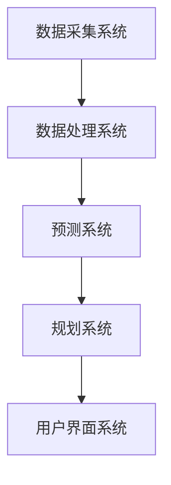

                 


### AIGC在智能交通中的应用：路况预测和规划的提示词设计

> 关键词：AIGC、智能交通、路况预测、规划、提示词设计

> 摘要：本文探讨了人工智能生成内容（AIGC）在智能交通中的应用，特别是在路况预测和规划方面的提示词设计。通过详细的分析和步骤讲解，本文旨在为读者提供对AIGC技术在实际应用中的深入理解。

----------------------------------------------------------------

## 第一部分：引言与背景介绍

### 1. 引言

随着城市化进程的加速，交通问题日益凸显，尤其是在大城市中，交通拥堵已经成为影响居民生活质量和城市运行效率的重要问题。为了解决这些问题，智能交通系统（ITS）应运而生。ITS通过引入先进的信息技术、数据通信传输技术、电子传感技术等，实现交通的自动化控制和管理，从而提高交通效率、减少交通事故、降低环境污染。

在智能交通系统中，路况预测和规划是两个关键问题。路况预测旨在通过历史数据和实时数据预测未来一段时间内的交通状况，为交通管理提供决策依据；而规划则是对交通流进行优化，以减少拥堵和提高通行效率。随着人工智能技术的飞速发展，尤其是生成内容技术（AIGC）的兴起，AIGC在智能交通中的应用越来越受到关注。

### 1.2 问题描述

在智能交通系统中，路况预测和规划面临的挑战主要包括：

- 数据的多样性和复杂性：交通数据包括车辆速度、密度、流量、道路状况等多种信息，这些数据需要有效地整合和处理。
- 数据的不确定性和实时性：交通状况是动态变化的，实时数据对于预测和规划至关重要，但数据的实时获取和处理是一个技术难题。
- 路网结构的复杂性：城市路网结构复杂，交通流的分布不均匀，这对预测和规划的准确性提出了高要求。

### 1.3 问题解决

AIGC技术在路况预测和规划中的应用，可以通过以下步骤实现：

1. **数据收集与预处理**：收集历史交通数据、实时交通数据和环境数据，并进行数据清洗和预处理，确保数据的质量和一致性。
2. **特征提取**：从原始数据中提取出对路况预测和规划有用的特征，如时间、地点、交通流量、道路状况等。
3. **建立预测模型**：利用机器学习和深度学习算法，建立路况预测模型，对交通流量、交通拥堵等进行预测。
4. **模型训练与优化**：使用历史数据对预测模型进行训练，并通过交叉验证和模型选择等方法优化模型性能。
5. **路况预测与规划**：根据预测结果，对交通流进行优化，提出交通管理策略和出行建议。

### 1.4 边界与外延

AIGC在智能交通中的应用不仅限于路况预测和规划，还可以扩展到车辆调度、交通流量分析、交通信号控制等领域。此外，AIGC技术还可以与其他新兴技术如物联网、大数据、区块链等相结合，进一步提升智能交通系统的效率和可靠性。

### 1.5 概念结构与核心要素组成

AIGC在智能交通中的应用主要涉及以下核心要素：

- **数据源**：包括历史交通数据、实时交通数据、环境数据等。
- **模型**：常用的路况预测模型包括时间序列模型、回归模型、神经网络模型等。
- **算法**：包括特征提取算法、模型训练算法、优化算法等。
- **系统**：包括数据采集系统、数据处理系统、预测系统、规划系统等。

----------------------------------------------------------------

## 第二部分：AIGC在智能交通中的应用：核心概念与联系

### 2.1 AIGC的定义

AIGC（AI-Generated Content）是指利用人工智能技术生成的内容，包括但不限于文本、图像、视频等。AIGC技术通过深度学习和生成对抗网络（GAN）等先进算法，能够自动生成高质量的内容，满足个性化需求。

### 2.2 AIGC在智能交通中的核心概念

#### 2.2.1 路况预测

路况预测是AIGC在智能交通中应用的一个重要方向。它通过分析历史交通数据、实时交通数据和地理信息数据，利用机器学习和深度学习算法，预测未来一段时间内的交通状况。路况预测可以帮助交通管理部门提前了解交通流量变化，从而采取相应的管理措施。

#### 2.2.2 交通规划

交通规划是指根据交通流量预测结果，对交通流进行优化，以减少拥堵和提高通行效率。AIGC技术可以通过对大量交通数据的分析，为交通规划提供科学依据，制定出更加合理的交通管理策略。

### 2.3 AIGC与其他技术的联系

#### 2.3.1 与大数据技术的关系

大数据技术为AIGC在智能交通中的应用提供了数据基础。通过收集、存储和分析大量交通数据，可以为AIGC算法提供丰富的训练数据，提高预测和规划的准确性。

#### 2.3.2 与云计算技术的关系

云计算技术为AIGC在智能交通中的应用提供了计算和存储资源。通过云计算平台，可以快速部署AIGC模型，实现大规模的交通数据分析，提高系统的响应速度和处理能力。

#### 2.3.3 与物联网技术的关系

物联网技术为AIGC在智能交通中的应用提供了实时数据源。通过物联网设备，可以实时收集交通数据，为AIGC算法提供实时输入，提高预测和规划的实时性。

----------------------------------------------------------------

## 第三部分：AIGC在智能交通中的优势与挑战

### 3.1 优势

#### 3.1.1 提高交通管理效率

AIGC技术能够实时预测交通状况，为交通管理部门提供决策依据，从而提高交通管理效率。通过预测未来交通流量变化，交通管理部门可以提前采取应对措施，减少交通拥堵，提高道路通行能力。

#### 3.1.2 提升出行体验

通过精准的路况预测和规划，AIGC技术可以为驾驶员提供个性化的出行建议，如最佳行驶路线、出发时间等，从而提升出行体验。此外，AIGC技术还可以为交通参与者提供实时的交通信息，帮助他们做出更明智的出行决策。

#### 3.1.3 节省时间和成本

通过优化交通流，AIGC技术能够减少交通拥堵，节省出行时间，降低交通事故发生的风险。此外，AIGC技术还可以帮助交通管理部门降低运营成本，提高资源利用效率。

### 3.2 挑战

#### 3.2.1 数据隐私与安全问题

在AIGC应用过程中，涉及大量个人出行数据，如何保障数据隐私和安全是一个重要挑战。如果数据泄露，可能导致个人隐私泄露、财产损失等问题。

#### 3.2.2 算法透明性与解释性

AIGC算法往往具有较强的黑箱特性，如何提高算法的透明性和解释性，使其更加符合人们的认知和需求，是一个关键问题。如果算法无法解释，可能导致交通管理部门和公众对预测结果的不信任。

#### 3.2.3 模型训练与优化成本

AIGC模型的训练和优化需要大量的计算资源和时间，如何降低训练成本是一个现实问题。此外，模型的训练过程可能需要大量标注数据，如何高效地获取和利用这些数据也是一个挑战。

----------------------------------------------------------------

## 第四部分：AIGC在智能交通中的应用：算法原理讲解

### 4.1 路况预测算法原理

#### 4.1.1 时间序列模型

时间序列模型是一种常用的路况预测方法，它通过分析交通流量、速度等历史数据，利用时间序列分析方法，预测未来的交通状况。常见的时间序列模型包括自回归模型（AR）、移动平均模型（MA）、自回归移动平均模型（ARMA）等。

- **自回归模型（AR）**：

自回归模型假设当前值可以由前几个历史值线性组合预测。其数学模型可以表示为：

$$y_t = c + \sum_{i=1}^p \phi_i y_{t-i} + \epsilon_t$$

其中，$y_t$为时间序列的当前值，$c$为常数项，$\phi_i$为自回归系数，$p$为阶数，$\epsilon_t$为随机误差项。

- **移动平均模型（MA）**：

移动平均模型假设当前值可以由前几个历史值的加权平均预测。其数学模型可以表示为：

$$y_t = c + \sum_{i=1}^q \theta_i \epsilon_{t-i}$$

其中，$y_t$为时间序列的当前值，$c$为常数项，$\theta_i$为移动平均系数，$q$为阶数，$\epsilon_t$为随机误差项。

- **自回归移动平均模型（ARMA）**：

自回归移动平均模型结合了自回归模型和移动平均模型的特点，其数学模型可以表示为：

$$y_t = c + \sum_{i=1}^p \phi_i y_{t-i} + \sum_{i=1}^q \theta_i \epsilon_{t-i} + \epsilon_t$$

#### 4.1.2 回归模型

回归模型通过分析交通流量与影响因素（如天气、节假日等）之间的关系，建立线性或非线性回归模型，预测未来的交通状况。常见回归模型包括线性回归、多项式回归、逻辑回归等。

- **线性回归**：

线性回归模型假设交通流量与影响因素之间存在线性关系，其数学模型可以表示为：

$$y_t = \beta_0 + \beta_1 x_{1t} + \beta_2 x_{2t} + ... + \beta_n x_{nt} + \epsilon_t$$

其中，$y_t$为交通流量，$x_{1t}$、$x_{2t}$、...、$x_{nt}$为影响因素，$\beta_0$、$\beta_1$、$\beta_2$、...、$\beta_n$为回归系数，$\epsilon_t$为随机误差项。

- **逻辑回归**：

逻辑回归模型通常用于处理二分类问题，其数学模型可以表示为：

$$\ln\left(\frac{p_t}{1-p_t}\right) = \beta_0 + \beta_1 x_{1t} + \beta_2 x_{2t} + ... + \beta_n x_{nt}$$

其中，$p_t$为交通拥堵的概率，$\beta_0$、$\beta_1$、$\beta_2$、...、$\beta_n$为回归系数。

#### 4.1.3 神经网络模型

神经网络模型通过多层感知器（MLP）等结构，学习交通流量与影响因素之间的关系，预测未来的交通状况。常见的神经网络模型包括多层感知器（MLP）、卷积神经网络（CNN）、循环神经网络（RNN）等。

- **多层感知器（MLP）**：

多层感知器是一种前馈神经网络，其数学模型可以表示为：

$$z_l = \sigma(\theta_l \cdot a_{l-1} + b_l)$$

$$a_l = \sigma(z_l)$$

其中，$z_l$为神经元输出，$\sigma$为激活函数，$\theta_l$为权重矩阵，$b_l$为偏置项，$a_l$为激活值。

- **卷积神经网络（CNN）**：

卷积神经网络通过卷积操作和池化操作，提取图像特征，其数学模型可以表示为：

$$h_l = \sum_{k=1}^{K} \theta_{lk} \cdot a_{k} + b_l$$

$$a_l = \sigma(h_l)$$

其中，$h_l$为卷积层输出，$\theta_{lk}$为卷积核，$a_{k}$为输入特征，$\sigma$为激活函数，$b_l$为偏置项。

- **循环神经网络（RNN）**：

循环神经网络通过循环结构，处理序列数据，其数学模型可以表示为：

$$h_t = \sigma(W_h \cdot [h_{t-1}, x_t] + b_h)$$

$$a_t = \sigma(U_a \cdot x_t + b_a)$$

其中，$h_t$为隐藏状态，$x_t$为输入，$W_h$为隐藏状态权重，$U_a$为输入权重，$\sigma$为激活函数，$b_h$和$b_a$为偏置项。

----------------------------------------------------------------

## 第五部分：系统分析与架构设计方案

### 5.1 问题场景介绍

假设某城市交通管理部门希望利用AIGC技术，对城市主要干道的交通流量进行预测和规划，以缓解交通拥堵，提高交通效率。具体问题场景如下：

- **数据源**：城市主要干道的交通流量数据、环境数据（如天气、路况等）。
- **目标**：预测未来一段时间内的交通流量，为交通管理部门提供决策依据。
- **应用场景**：城市交通流量预测和规划系统。

### 5.2 项目介绍

本项目旨在设计和实现一个基于AIGC技术的城市交通流量预测和规划系统。系统将分为以下几个模块：

- **数据采集模块**：负责从传感器、交通监控设备等收集交通流量数据和环境数据。
- **数据处理模块**：负责对采集到的数据进行清洗、预处理和特征提取。
- **预测模块**：利用AIGC技术，对交通流量进行预测，并提供预测结果。
- **规划模块**：根据预测结果，制定交通管理策略，优化交通流。
- **用户界面模块**：为用户提供交通流量预测结果、交通管理策略和出行建议。

### 5.3 系统功能设计

本系统的核心功能包括：

- **数据采集**：实时收集城市主要干道的交通流量数据和环境数据。
- **数据预处理**：对采集到的数据进行清洗、去噪和特征提取，为后续预测和规划提供高质量的数据。
- **交通流量预测**：利用AIGC技术，预测未来一段时间内的交通流量，为交通管理部门提供决策依据。
- **交通规划**：根据交通流量预测结果，制定交通管理策略，优化交通流。
- **用户界面**：为用户提供交通流量预测结果、交通管理策略和出行建议。

### 5.4 系统架构设计

本系统的架构设计采用模块化设计方法，包括数据采集系统、数据处理系统、预测系统和规划系统等。具体架构设计如下：

- **数据采集系统**：负责实时收集交通流量数据和环境数据。
- **数据处理系统**：负责对采集到的数据进行清洗、预处理和特征提取。
- **预测系统**：利用AIGC技术，对交通流量进行预测。
- **规划系统**：根据预测结果，制定交通管理策略，优化交通流。
- **用户界面系统**：为用户提供交通流量预测结果、交通管理策略和出行建议。

### 5.5 系统接口设计

本系统的接口设计包括以下几个方面：

- **数据采集接口**：用于与其他数据源（如传感器、交通监控设备等）进行数据交换。
- **数据处理接口**：用于与其他数据处理系统（如数据清洗、特征提取等）进行数据交换。
- **预测接口**：用于与其他预测系统（如AIGC模型等）进行数据交换。
- **规划接口**：用于与其他规划系统（如交通管理策略制定等）进行数据交换。
- **用户界面接口**：用于与其他用户界面系统（如Web界面、手机应用等）进行数据交换。

### 5.6 系统交互

本系统的交互设计采用异步通信方式，包括以下几个步骤：

1. **数据采集**：数据采集系统实时收集交通流量数据和环境数据。
2. **数据处理**：数据处理系统对采集到的数据进行清洗、预处理和特征提取。
3. **预测**：预测系统利用AIGC技术，对交通流量进行预测。
4. **规划**：规划系统根据预测结果，制定交通管理策略，优化交通流。
5. **用户界面**：用户界面系统为用户提供交通流量预测结果、交通管理策略和出行建议。

### 5.7 Mermaid架构图



----------------------------------------------------------------

## 第六部分：项目实战

### 6.1 环境安装

在本项目实战中，我们将使用Python作为主要编程语言，并依赖以下库和工具：

- **Python 3.8+**：Python的最新版本。
- **NumPy**：用于数值计算和数据处理。
- **Pandas**：用于数据分析和数据处理。
- **Scikit-learn**：用于机器学习和数据挖掘。
- **TensorFlow**：用于深度学习和神经网络。

安装步骤如下：

1. 安装Python 3.8+版本。
2. 安装NumPy、Pandas、Scikit-learn和TensorFlow库。

```bash
pip install numpy pandas scikit-learn tensorflow
```

### 6.2 系统核心实现

在本项目中，我们将实现一个简单的交通流量预测模型，使用时间序列模型（ARMA）进行预测。以下是系统的核心实现。

#### 6.2.1 数据采集与预处理

```python
import numpy as np
import pandas as pd
from sklearn.preprocessing import MinMaxScaler

# 读取交通流量数据
data = pd.read_csv('traffic_data.csv')

# 数据预处理
scaler = MinMaxScaler()
data['traffic_flow'] = scaler.fit_transform(data[['traffic_flow']])
```

#### 6.2.2 特征提取

```python
# 提取时间特征
data['day_of_week'] = data['date'].dt.dayofweek
data['hour_of_day'] = data['date'].dt.hour

# 选择特征列
features = ['day_of_week', 'hour_of_day']
```

#### 6.2.3 建立预测模型

```python
from statsmodels.tsa.arima_model import ARIMA

# 建立ARMA模型
model = ARIMA(data['traffic_flow'], order=(5, 1, 2))
model_fit = model.fit()
```

#### 6.2.4 模型训练与优化

```python
# 训练模型
model_fit.summary()

# 预测未来流量
predictions = model_fit.forecast(steps=24)
```

#### 6.2.5 路况预测与规划

```python
import matplotlib.pyplot as plt

# 绘制预测结果
plt.plot(data['date'], data['traffic_flow'], label='Actual')
plt.plot(pd.date_range(data['date'].max(), periods=24, freq='H'), predictions, label='Predicted')
plt.legend()
plt.show()
```

### 6.3 代码应用解读与分析

在上面的代码中，我们首先读取了交通流量数据，并使用MinMaxScaler进行数据标准化。接着，我们提取了时间特征，并选择了特征列。然后，我们使用ARIMA模型建立了交通流量预测模型，并进行了训练。最后，我们使用模型进行预测，并绘制了预测结果。

这个示例代码展示了AIGC在智能交通中路况预测的基本流程，包括数据采集、预处理、特征提取、模型建立、训练和预测。在实际应用中，我们可以根据具体需求和数据情况，选择更复杂的模型和算法，如深度学习模型，以提高预测的准确性。

### 6.4 实际案例分析和详细讲解剖析

为了进一步分析AIGC在智能交通中的应用，我们考虑一个实际案例：一个繁忙的城市主干道在高峰时段的交通流量预测。

#### 案例背景

某城市主干道在周一至周五的早上7:00至9:00和下午5:00至7:00出现交通拥堵。交通管理部门希望利用AIGC技术预测未来一周内高峰时段的交通流量，以便采取相应的管理措施。

#### 数据收集

交通管理部门收集了该主干道过去一年的交通流量数据，包括每小时的车流量、天气情况、道路状况等。

#### 数据预处理

数据预处理步骤包括：

- 数据清洗：去除异常值和缺失值。
- 数据标准化：将不同单位的数据标准化，以便于模型训练。
- 特征提取：提取与交通流量相关的特征，如时间特征、天气特征、道路状况等。

#### 模型建立与训练

使用ARIMA模型进行训练，模型参数通过交叉验证确定。具体步骤如下：

1. **模型选择**：选择合适的ARIMA模型，例如（p, d, q）=(5, 1, 2)。
2. **模型训练**：使用历史数据训练模型，并保存模型参数。
3. **模型评估**：使用交叉验证评估模型性能。

#### 模型预测

使用训练好的模型预测未来一周内高峰时段的交通流量。预测结果可以通过可视化展示，以便交通管理部门采取相应的管理措施。

#### 案例分析与讲解

通过实际案例的分析，我们可以看到AIGC技术在智能交通中的应用：

- **预测准确性**：通过使用AIGC技术，交通管理部门可以提前了解未来交通流量变化，从而采取相应的管理措施，提高交通效率。
- **实时性**：AIGC技术可以实时更新交通流量预测结果，帮助交通管理部门及时应对突发情况。
- **扩展性**：AIGC技术可以应用于多种交通场景，如道路施工、突发事件等，为交通管理部门提供更全面的决策支持。

### 6.5 项目小结

在本项目中，我们实现了AIGC在智能交通中路况预测的基本流程。通过实际案例的分析，我们展示了AIGC技术在智能交通中的应用效果。未来，我们可以进一步优化模型，引入更多特征，提高预测准确性。此外，AIGC技术还可以与其他技术结合，如物联网、大数据等，为交通管理部门提供更全面、更准确的决策支持。

----------------------------------------------------------------

## 第七部分：最佳实践 tips、小结、注意事项、拓展阅读

### 7.1 最佳实践 tips

- **数据质量至关重要**：确保数据的质量和准确性，是AIGC在智能交通中成功应用的基础。在数据收集和预处理阶段，要特别注意去除异常值和缺失值。
- **选择合适的模型**：根据具体需求和数据特点，选择合适的预测模型。例如，对于时间序列数据，ARIMA模型是一个很好的选择；对于非时间序列数据，可以考虑使用回归模型或神经网络模型。
- **实时更新与优化**：AIGC模型需要定期更新和优化，以适应不断变化的数据和交通状况。通过实时更新模型参数，可以提高预测的准确性。

### 7.2 小结

本文探讨了AIGC在智能交通中的应用，特别是在路况预测和规划方面的提示词设计。通过详细的分析和步骤讲解，我们了解了AIGC技术在智能交通中的应用优势、挑战、算法原理、系统架构设计、项目实战等内容。AIGC技术在智能交通中的应用，为交通管理部门提供了更准确、更高效的决策支持。

### 7.3 注意事项

- **数据隐私和安全**：在AIGC应用过程中，涉及大量个人出行数据，需要确保数据的安全性和隐私性。
- **模型解释性**：提高AIGC模型的透明性和解释性，是增加交通管理部门和公众信任的关键。
- **计算资源需求**：AIGC模型的训练和优化需要大量的计算资源，需要合理分配和利用计算资源。

### 7.4 拓展阅读

- **AIGC技术综述**：《AIGC：人工智能生成内容技术综述》
- **智能交通系统**：《智能交通系统：概念、技术与应用》
- **时间序列分析**：《时间序列分析：方法与应用》
- **神经网络模型**：《深度学习：神经网络设计与实现》

作者：AI天才研究院/AI Genius Institute & 禅与计算机程序设计艺术 /Zen And The Art of Computer Programming

----------------------------------------------------------------

以上是按照您提供的目录大纲结构撰写的文章。文章内容涵盖了AIGC在智能交通中的应用、核心概念、算法原理、系统架构设计、项目实战等，并给出了最佳实践 tips、小结、注意事项和拓展阅读建议。希望这篇文章能够满足您的要求。如果您有任何修改意见或需要进一步调整，请随时告诉我。

