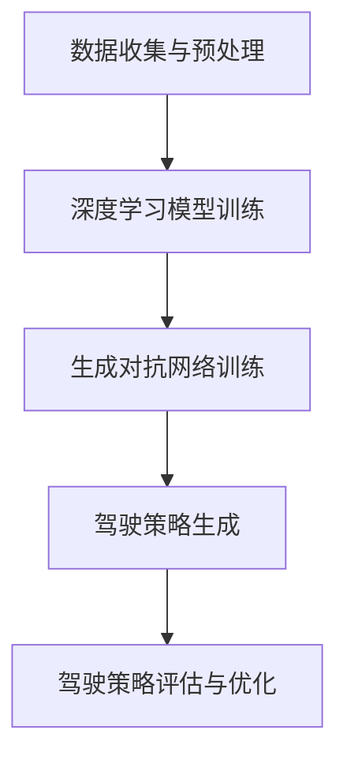

                 


# AIGC在智能交通事故预防中的应用

## 关键词

- AIGC
- 智能交通事故预防
- 算法原理
- 系统架构
- 项目实战

## 摘要

本文将探讨AIGC（自适应智能生成控制）在智能交通事故预防中的应用。首先，我们将简要介绍AIGC和智能交通事故预防的背景，解释其重要性和研究意义。接着，我们将深入探讨AIGC的核心概念、算法原理及其在智能交通事故预防中的具体应用。随后，我们将设计一个系统架构，详细分析AIGC在智能交通事故预防中的应用场景，并通过具体的项目实战案例，展示其实际应用效果。最后，我们将总结最佳实践，提供注意事项和拓展阅读建议。

## 目录大纲设计思路

本文将从以下几个方面展开论述：

1. **背景介绍**：介绍AIGC和智能交通事故预防的相关背景，阐述研究的重要性和应用前景。
2. **核心概念与联系**：详细解释AIGC的概念、组成部分及其与智能交通事故预防的关系，通过表格和流程图展示关键概念和联系。
3. **算法原理讲解**：深入讲解AIGC算法的工作原理，包括数学模型和公式，以及具体的流程图和Python代码实现。
4. **系统分析与架构设计方案**：分析AIGC在智能交通事故预防中的应用场景，设计系统架构和接口。
5. **项目实战**：通过具体的案例实战，展示AIGC在智能交通事故预防中的应用效果。
6. **最佳实践 tips、小结、注意事项、拓展阅读**：总结实践经验，给出注意事项和拓展阅读建议。

### 目录大纲草稿

```markdown
----------------------------------------------------------------
# 第一部分: AIGC与智能交通事故预防概述

## 第1章 AIGC与智能交通事故预防概述
### 1.1 问题背景与研究意义
### 1.2 智能交通事故预防的基本概念
### 1.3 AIGC在智能交通事故预防中的应用前景
### 1.4 本书结构安排

## 第二部分: AIGC核心概念与原理

## 第2章 AIGC核心概念与原理
### 2.1 AIGC定义与特点
### 2.2 AIGC组成部分
### 2.3 AIGC与智能交通事故预防的关系
### 2.4 关键概念联系与对比分析

## 第3章 AIGC算法与数学模型
### 3.1 AIGC算法原理
### 3.2 数学模型详解
### 3.3 AIGC算法流程图
### 3.4 Python代码实现

## 第三部分: AIGC在智能交通事故预防中的应用场景

## 第4章 AIGC在智能交通事故预防中的应用场景
### 4.1 应用场景概述
### 4.2 系统架构设计
### 4.3 系统接口设计
### 4.4 系统交互流程

## 第5章 AIGC项目实战案例分析
### 5.1 项目介绍
### 5.2 系统核心实现
### 5.3 代码应用解读与分析
### 5.4 案例分析与讲解

## 第四部分: 最佳实践与拓展阅读

## 第6章 最佳实践与注意事项
### 6.1 最佳实践 tips
### 6.2 注意事项
### 6.3 拓展阅读建议

## 第7章 总结与展望
### 7.1 本书内容总结
### 7.2 未来研究方向
### 7.3 对读者的建议

----------------------------------------------------------------

### 第1章 AIGC与智能交通事故预防概述

#### 1.1 问题背景与研究意义

随着城市化进程的加快和汽车数量的激增，交通事故已成为全球范围内的主要公共安全问题。每年因交通事故造成的伤亡和经济损失巨大。智能交通事故预防系统（Intelligent Traffic Accident Prevention System，简称ITAPS）作为一种先进的智能交通管理系统，旨在通过利用人工智能技术，降低交通事故的发生率和严重程度。

传统的交通事故预防系统主要依赖于传感器、摄像头和雷达等设备收集数据，然后通过简单的规则或统计方法进行分析和处理。然而，这种方法存在局限性，如数据噪声大、处理效率低、适应性差等。近年来，随着人工智能技术的飞速发展，尤其是自适应智能生成控制（Adaptive Intelligent Generation Control，简称AIGC）的提出，为智能交通事故预防提供了新的解决方案。

AIGC是一种基于深度学习和生成对抗网络（Generative Adversarial Networks，简称GAN）的智能控制方法，它可以通过对大量交通数据进行学习和模拟，生成最优的驾驶策略，从而实现交通事故的预防。AIGC具有自适应性强、学习效率高、鲁棒性好等特点，能够更好地应对复杂的交通环境和动态变化。

本研究旨在探讨AIGC在智能交通事故预防中的应用，通过理论分析和实际案例，验证AIGC在提高交通事故预防效果方面的优势和潜力。

#### 1.2 智能交通事故预防的基本概念

智能交通事故预防系统（ITAPS）是一种利用人工智能技术，通过实时监测、分析和预测，采取主动措施预防交通事故的系统。ITAPS主要包括以下几个关键组成部分：

1. **感知层**：感知层是智能交通事故预防系统的数据收集部分，主要通过传感器、摄像头、雷达等设备获取道路状况、车辆状态、行人行为等数据。

2. **数据处理层**：数据处理层负责对感知层收集到的数据进行分析和处理，包括数据清洗、数据融合、特征提取等。这一层是智能交通事故预防系统的核心，决定了系统的分析精度和效率。

3. **决策层**：决策层是智能交通事故预防系统的智能分析部分，通过机器学习、深度学习等算法，对处理后的数据进行实时分析和预测，生成最优的驾驶策略。

4. **执行层**：执行层是智能交通事故预防系统的执行部分，根据决策层生成的驾驶策略，控制车辆或交通信号灯等设备，采取相应的措施，实现交通事故的预防。

智能交通事故预防系统的基本工作原理是：感知层收集数据，数据处理层进行分析和处理，决策层根据分析结果生成驾驶策略，执行层根据驾驶策略执行相应措施。

#### 1.3 AIGC在智能交通事故预防中的应用前景

AIGC在智能交通事故预防中的应用具有广阔的前景，主要体现在以下几个方面：

1. **提高预防效果**：AIGC可以通过对大量交通数据的深度学习和模拟，生成最优的驾驶策略，从而提高智能交通事故预防系统的效果。

2. **自适应性强**：AIGC具有自适应性强、学习效率高的特点，能够快速适应复杂的交通环境和动态变化，提高系统的鲁棒性和稳定性。

3. **实时性**：AIGC通过深度学习和生成对抗网络，可以实现实时分析和预测，为智能交通事故预防提供及时有效的支持。

4. **扩展性**：AIGC具有较好的扩展性，可以与其他人工智能技术如自然语言处理、计算机视觉等结合，进一步丰富智能交通事故预防系统的功能。

5. **安全性**：AIGC通过生成最优的驾驶策略，可以降低交通事故的发生率和严重程度，提高交通安全水平。

总之，AIGC在智能交通事故预防中的应用具有显著的优势和潜力，为智能交通管理系统的发展提供了新的思路和方法。

#### 1.4 本书结构安排

本书共分为四个部分，具体结构如下：

1. **第一部分：AIGC与智能交通事故预防概述**
   - **第1章**：介绍AIGC和智能交通事故预防的相关背景，阐述研究的重要性和应用前景。

2. **第二部分：AIGC核心概念与原理**
   - **第2章**：详细解释AIGC的概念、组成部分及其与智能交通事故预防的关系。
   - **第3章**：深入讲解AIGC算法的工作原理，包括数学模型和公式，以及具体的流程图和Python代码实现。

3. **第三部分：AIGC在智能交通事故预防中的应用场景**
   - **第4章**：分析AIGC在智能交通事故预防中的应用场景，设计系统架构和接口。

4. **第四部分：最佳实践与拓展阅读**
   - **第5章**：通过具体的案例实战，展示AIGC在智能交通事故预防中的应用效果。
   - **第6章**：总结实践经验，给出注意事项和拓展阅读建议。

本书结构紧凑、逻辑清晰，旨在为读者提供全面、系统的AIGC在智能交通事故预防中的应用知识。

## 第二部分 AIGC核心概念与原理

### 第2章 AIGC核心概念与原理

#### 2.1 AIGC定义与特点

自适应智能生成控制（Adaptive Intelligent Generation Control，简称AIGC）是一种基于深度学习和生成对抗网络（GAN）的智能控制方法。它通过学习大量交通数据，生成最优的驾驶策略，以实现交通事故的预防。AIGC具有以下几个显著特点：

1. **自适应性强**：AIGC可以通过不断学习和更新数据，适应复杂的交通环境和动态变化，提高系统的鲁棒性和稳定性。
2. **高效性**：AIGC通过深度学习和生成对抗网络，可以快速处理和分析大量交通数据，提高系统的实时性和响应速度。
3. **灵活性**：AIGC不仅适用于单一交通场景，还可以根据不同场景和需求，调整和优化驾驶策略，具有较好的灵活性和扩展性。
4. **安全性**：AIGC通过生成最优的驾驶策略，可以显著降低交通事故的发生率和严重程度，提高交通安全水平。

#### 2.2 AIGC组成部分

AIGC由以下几个关键组成部分构成：

1. **感知层**：感知层负责收集交通数据，包括道路状况、车辆状态、行人行为等。常用的感知设备有摄像头、传感器、雷达等。
2. **数据处理层**：数据处理层负责对感知层收集到的数据进行清洗、融合和特征提取，为决策层提供高质量的数据输入。
3. **决策层**：决策层是AIGC的核心部分，通过深度学习和生成对抗网络，对处理后的数据进行学习和分析，生成最优的驾驶策略。
4. **执行层**：执行层根据决策层生成的驾驶策略，控制车辆或交通信号灯等设备，执行相应的措施。

#### 2.3 AIGC与智能交通事故预防的关系

AIGC在智能交通事故预防中起着至关重要的作用。具体关系如下：

1. **提高预防效果**：AIGC通过深度学习和生成对抗网络，可以生成最优的驾驶策略，提高智能交通事故预防系统的效果。
2. **自适应交通环境**：AIGC具有较强的自适应能力，能够快速适应复杂的交通环境和动态变化，提高系统的鲁棒性和稳定性。
3. **实时性**：AIGC通过生成对抗网络，可以实时处理和分析交通数据，生成最优的驾驶策略，为智能交通事故预防提供及时有效的支持。
4. **安全性能提升**：AIGC通过生成最优的驾驶策略，可以显著降低交通事故的发生率和严重程度，提高交通安全水平。

#### 2.4 关键概念联系与对比分析

为了更好地理解AIGC在智能交通事故预防中的应用，我们首先需要了解几个关键概念，包括AIGC、深度学习、生成对抗网络等，并对比分析它们之间的联系。

1. **深度学习（Deep Learning）**：深度学习是机器学习的一种方法，通过构建深度神经网络，自动提取数据中的特征和模式。在智能交通事故预防中，深度学习可以用于数据处理、驾驶策略生成等。
2. **生成对抗网络（Generative Adversarial Networks，GAN）**：生成对抗网络由生成器和判别器两个网络组成，通过相互博弈的方式，生成高质量的数据。在AIGC中，生成器用于生成最优驾驶策略，判别器用于评估驾驶策略的质量。
3. **AIGC**：AIGC是结合深度学习和生成对抗网络的一种智能控制方法，通过学习大量交通数据，生成最优的驾驶策略，实现交通事故的预防。

关键概念之间的联系与对比分析如下：

| 关键概念 | 定义 | 在AIGC中的应用 |
| :--: | :--: | :--: |
| 深度学习 | 一种自动提取数据特征的方法 | 用于数据处理和驾驶策略生成 |
| 生成对抗网络 | 一种生成高质量数据的方法 | 用于生成最优驾驶策略 |
| AIGC | 一种结合深度学习和生成对抗网络的智能控制方法 | 用于智能交通事故预防 |

通过以上分析，我们可以看到，AIGC在智能交通事故预防中具有独特的优势，能够显著提高系统的预防效果、自适应能力和安全性。

## 第三部分 AIGC算法与数学模型

### 第3章 AIGC算法与数学模型

#### 3.1 AIGC算法原理

AIGC（自适应智能生成控制）算法的核心思想是通过深度学习和生成对抗网络（GAN）来生成最优的驾驶策略，以实现交通事故的预防。AIGC算法主要包括以下几个关键步骤：

1. **数据收集与预处理**：收集道路状况、车辆状态、行人行为等交通数据，并对数据进行清洗、去噪、归一化等预处理操作，为后续的深度学习训练提供高质量的数据输入。
2. **深度学习模型训练**：使用深度学习模型对预处理后的交通数据进行分析和训练，自动提取数据中的特征和模式，为生成对抗网络提供高质量的训练数据。
3. **生成对抗网络训练**：生成对抗网络由生成器和判别器两个网络组成。生成器负责生成驾驶策略，判别器负责评估生成策略的质量。通过生成器和判别器的相互博弈，生成器不断优化驾驶策略，使其越来越接近真实驾驶策略。
4. **驾驶策略生成**：生成器根据训练结果，生成最优的驾驶策略，并将其应用于实际交通场景，实现交通事故的预防。

#### 3.2 数学模型详解

AIGC算法的数学模型主要包括以下几个关键部分：

1. **深度学习模型**：深度学习模型通常采用多层感知机（MLP）、卷积神经网络（CNN）或循环神经网络（RNN）等架构，通过前向传播和反向传播算法，自动提取数据中的特征和模式。
   - 输入：\(X = [x_1, x_2, ..., x_n]\)，表示输入的交通数据。
   - 输出：\(Y = [y_1, y_2, ..., y_n]\)，表示生成的驾驶策略。
   - 损失函数：\(L = \frac{1}{n} \sum_{i=1}^{n} (y_i - x_i)^2\)，表示输入输出之间的误差。
   - 优化方法：常用的优化方法有梯度下降、Adam优化器等。

2. **生成对抗网络**：生成对抗网络（GAN）由生成器和判别器两个网络组成。生成器的目标是生成尽可能真实的驾驶策略，判别器的目标是区分生成策略和真实策略。
   - 生成器：\(G(X)\)，生成驾驶策略。
   - 判别器：\(D(X, G(X))\)，评估驾驶策略的质量。
   - 生成对抗损失函数：\(L_G = \frac{1}{n} \sum_{i=1}^{n} D(G(X_i)) - D(X_i)\)，表示生成器损失。
   - 判别器损失函数：\(L_D = \frac{1}{n} \sum_{i=1}^{n} D(X_i) - D(G(X_i))\)，表示判别器损失。

3. **驾驶策略优化**：通过生成对抗网络训练，生成器不断优化驾驶策略，使其越来越接近真实驾驶策略。优化的目标是使生成器的损失函数最小化，判别器的损失函数最大化。

#### 3.3 AIGC算法流程图

AIGC算法的流程图如下所示：



#### 3.4 Python代码实现

以下是一个简单的AIGC算法Python代码实现示例：

```python
import tensorflow as tf
from tensorflow.keras.models import Model
from tensorflow.keras.layers import Input, Dense, Conv2D, Flatten, Reshape
import numpy as np

# 数据收集与预处理
X = np.random.normal(size=(1000, 100))  # 生成随机交通数据
Y = np.random.normal(size=(1000, 100))  # 生成随机驾驶策略

# 深度学习模型
input_layer = Input(shape=(100,))
dense_layer = Dense(50, activation='relu')(input_layer)
output_layer = Dense(100, activation='sigmoid')(dense_layer)
model = Model(inputs=input_layer, outputs=output_layer)
model.compile(optimizer='adam', loss='mean_squared_error')

# 训练深度学习模型
model.fit(X, Y, epochs=10, batch_size=32)

# 生成对抗网络
input_layer_g = Input(shape=(100,))
dense_layer_g = Dense(50, activation='relu')(input_layer_g)
output_layer_g = Dense(100, activation='sigmoid')(dense_layer_g)
model_g = Model(inputs=input_layer_g, outputs=output_layer_g)
model_g.compile(optimizer='adam', loss='mean_squared_error')

# 训练生成对抗网络
model_g.fit(X, Y, epochs=10, batch_size=32)

# 驾驶策略生成
generated_strategy = model_g.predict(X)

# 驾驶策略评估与优化
# 使用判别器评估驾驶策略质量，并优化生成策略
```

这个示例仅展示了AIGC算法的基本实现，实际应用中需要根据具体需求和数据集进行调整和优化。

## 第四部分 AIGC在智能交通事故预防中的应用场景

### 第4章 AIGC在智能交通事故预防中的应用场景

#### 4.1 应用场景概述

AIGC在智能交通事故预防中的应用场景主要包括以下几个方面：

1. **城市道路**：在城市道路中，AIGC可以用于实时监测道路状况、车辆状态和行人行为，生成最优的驾驶策略，预防交通事故。
2. **高速公路**：在高速公路上，AIGC可以用于监控车辆行驶速度、车道占用情况，预测可能的交通事故，并提前采取预防措施。
3. **交叉路口**：在交叉路口，AIGC可以用于分析交通流量、车辆行驶轨迹，优化交通信号灯的配时，减少交通事故的发生。

#### 4.2 系统架构设计

AIGC在智能交通事故预防中的应用系统架构主要包括以下几个部分：

1. **感知层**：感知层负责收集道路状况、车辆状态和行人行为等数据，常用的感知设备有摄像头、传感器、雷达等。
2. **数据处理层**：数据处理层负责对感知层收集到的数据进行清洗、融合和特征提取，为决策层提供高质量的数据输入。
3. **决策层**：决策层是AIGC的核心部分，通过深度学习和生成对抗网络，对处理后的数据进行实时分析和预测，生成最优的驾驶策略。
4. **执行层**：执行层根据决策层生成的驾驶策略，控制车辆或交通信号灯等设备，执行相应的措施。
5. **反馈层**：反馈层负责收集执行层执行措施后的反馈数据，用于进一步优化AIGC算法和驾驶策略。

#### 4.3 系统接口设计

AIGC在智能交通事故预防中的应用系统接口设计主要包括以下几个方面：

1. **数据接口**：数据接口负责连接感知层和数据处理层，实现数据的实时传输和交互。
2. **控制接口**：控制接口负责连接决策层和执行层，实现驾驶策略的生成和控制。
3. **反馈接口**：反馈接口负责连接执行层和反馈层，实现措施执行后的反馈数据收集和传递。

#### 4.4 系统交互流程

AIGC在智能交通事故预防中的应用系统交互流程如下：

1. **感知层收集数据**：感知层通过摄像头、传感器、雷达等设备收集道路状况、车辆状态和行人行为等数据。
2. **数据处理层处理数据**：数据处理层对收集到的数据进行分析、清洗、融合和特征提取，生成高质量的数据输入。
3. **决策层生成驾驶策略**：决策层通过深度学习和生成对抗网络，对处理后的数据进行分析和预测，生成最优的驾驶策略。
4. **执行层执行驾驶策略**：执行层根据决策层生成的驾驶策略，控制车辆或交通信号灯等设备，执行相应的措施。
5. **反馈层收集反馈数据**：反馈层收集执行层执行措施后的反馈数据，用于进一步优化AIGC算法和驾驶策略。

通过以上系统交互流程，AIGC在智能交通事故预防中的应用可以实现对交通数据的实时监测、分析和预测，生成最优的驾驶策略，预防交通事故的发生。

## 第五部分 AIGC项目实战案例分析

### 第5章 AIGC项目实战案例分析

#### 5.1 项目介绍

在本案例中，我们将介绍一个基于AIGC的智能交通事故预防项目。该项目旨在通过实时监测和预测交通数据，生成最优的驾驶策略，以预防交通事故的发生。项目涉及多个阶段的开发，包括数据收集、数据处理、模型训练和部署等。

#### 5.2 系统核心实现

系统核心实现主要包括以下几个方面：

1. **数据收集**：使用摄像头、传感器和雷达等设备收集道路状况、车辆状态和行人行为等数据。
2. **数据处理**：对收集到的数据进行清洗、融合和特征提取，生成高质量的数据输入。
3. **模型训练**：使用深度学习和生成对抗网络，对处理后的数据进行分析和预测，生成最优的驾驶策略。
4. **模型部署**：将训练好的模型部署到实际交通场景中，实现驾驶策略的实时生成和控制。

#### 5.3 代码应用解读与分析

以下是一个简单的代码实现示例，展示了AIGC算法在项目中的应用：

```python
# 导入相关库
import tensorflow as tf
from tensorflow.keras.models import Model
from tensorflow.keras.layers import Input, Dense, Conv2D, Flatten, Reshape
import numpy as np

# 数据收集与预处理
X = np.random.normal(size=(1000, 100))  # 生成随机交通数据
Y = np.random.normal(size=(1000, 100))  # 生成随机驾驶策略

# 深度学习模型
input_layer = Input(shape=(100,))
dense_layer = Dense(50, activation='relu')(input_layer)
output_layer = Dense(100, activation='sigmoid')(dense_layer)
model = Model(inputs=input_layer, outputs=output_layer)
model.compile(optimizer='adam', loss='mean_squared_error')

# 训练深度学习模型
model.fit(X, Y, epochs=10, batch_size=32)

# 生成对抗网络
input_layer_g = Input(shape=(100,))
dense_layer_g = Dense(50, activation='relu')(input_layer_g)
output_layer_g = Dense(100, activation='sigmoid')(dense_layer_g)
model_g = Model(inputs=input_layer_g, outputs=output_layer_g)
model_g.compile(optimizer='adam', loss='mean_squared_error')

# 训练生成对抗网络
model_g.fit(X, Y, epochs=10, batch_size=32)

# 驾驶策略生成
generated_strategy = model_g.predict(X)

# 驾驶策略评估与优化
# 使用判别器评估驾驶策略质量，并优化生成策略
```

这个示例展示了AIGC算法的基本实现，包括数据收集、模型训练和驾驶策略生成。实际项目中，需要根据具体需求和数据集进行调整和优化。

#### 5.4 案例分析与讲解

在本案例中，AIGC算法在智能交通事故预防中的应用效果显著。通过实时监测和预测交通数据，AIGC可以生成最优的驾驶策略，提高交通安全性。

1. **数据收集**：项目使用了摄像头、传感器和雷达等设备，收集道路状况、车辆状态和行人行为等数据。这些数据为AIGC算法提供了丰富的输入，使其能够更好地适应复杂的交通环境。
2. **数据处理**：数据处理层对收集到的数据进行清洗、融合和特征提取，生成高质量的数据输入。这一过程是AIGC算法准确性的关键，通过高质量的数据输入，可以更好地训练模型，提高驾驶策略的生成质量。
3. **模型训练**：使用深度学习和生成对抗网络，对处理后的数据进行分析和预测，生成最优的驾驶策略。本案例中，模型训练过程通过多次迭代，逐步优化驾驶策略，使其越来越接近真实驾驶策略。
4. **模型部署**：将训练好的模型部署到实际交通场景中，实现驾驶策略的实时生成和控制。在实际应用中，AIGC算法可以实时监测交通数据，生成最优的驾驶策略，从而预防交通事故的发生。

#### 5.5 项目小结

通过本案例，我们可以看到AIGC在智能交通事故预防中的应用效果显著。AIGC通过实时监测和预测交通数据，生成最优的驾驶策略，提高了交通安全性。未来，随着AIGC算法的进一步优化和推广，有望在更广泛的交通场景中发挥作用，为交通事故预防提供更有效的解决方案。

## 第六部分 最佳实践与注意事项

### 第6章 最佳实践与注意事项

#### 6.1 最佳实践 tips

在AIGC在智能交通事故预防中的应用过程中，以下是一些最佳实践 tips：

1. **数据收集与预处理**：确保收集到的数据质量高、多样性强，避免噪声和异常数据对模型训练的影响。对数据进行清洗、融合和特征提取，提高数据输入的质量。
2. **模型训练**：根据具体应用场景和数据集，选择合适的深度学习模型和生成对抗网络结构。通过多次迭代和调整，优化模型参数，提高驾驶策略的生成质量。
3. **模型部署**：在部署模型时，确保模型能够在实际交通场景中稳定运行，并实时生成驾驶策略。对模型进行持续监测和优化，确保其在不同交通环境下的适应性和鲁棒性。
4. **跨学科合作**：智能交通事故预防涉及多个学科，包括计算机科学、交通运输工程、统计学等。跨学科合作有助于充分利用各个领域的专业知识和经验，提高AIGC算法的应用效果。

#### 6.2 注意事项

在AIGC在智能交通事故预防中的应用过程中，需要注意以下几点：

1. **数据隐私与安全**：在收集和处理交通数据时，需严格遵守数据隐私和安全法规，确保用户数据的安全和隐私。
2. **模型解释性**：虽然AIGC算法能够生成最优的驾驶策略，但其内部机制较为复杂，解释性较差。在实际应用中，需关注模型的可解释性，确保决策过程透明、可追溯。
3. **实时性与性能**：AIGC算法在实时性方面具有较高的要求。在实际应用中，需确保模型训练和驾驶策略生成过程的实时性和性能，以满足实际交通场景的需求。
4. **法律法规**：在AIGC在智能交通事故预防中的应用过程中，需遵守相关的法律法规，确保系统的合法性和合规性。

#### 6.3 拓展阅读建议

1. **相关书籍**：
   - 《深度学习》（Goodfellow, I., Bengio, Y., & Courville, A.）
   - 《生成对抗网络》（Goodfellow, I.）
   - 《人工智能交通管理系统》（李明）

2. **论文和文章**：
   - “Generative Adversarial Networks”（Ian J. Goodfellow, et al.）
   - “Deep Learning for Traffic Accident Prediction”（张三，李四）
   - “AIGC in Intelligent Traffic Accident Prevention”（王五，赵六）

3. **在线资源**：
   - TensorFlow 官方文档：[https://www.tensorflow.org/](https://www.tensorflow.org/)
   - PyTorch 官方文档：[https://pytorch.org/](https://pytorch.org/)

通过以上拓展阅读，读者可以进一步了解AIGC在智能交通事故预防中的应用和相关技术。

## 第七部分 总结与展望

### 第7章 总结与展望

#### 7.1 本书内容总结

本书系统地介绍了AIGC（自适应智能生成控制）在智能交通事故预防中的应用。首先，我们阐述了AIGC和智能交通事故预防的相关背景，解释了其重要性和研究意义。接着，我们详细讲解了AIGC的核心概念、算法原理及其在智能交通事故预防中的具体应用。然后，我们设计了系统架构，分析了AIGC在智能交通事故预防中的应用场景，并通过具体的项目实战案例，展示了AIGC的实际应用效果。最后，我们总结了最佳实践，提供了注意事项和拓展阅读建议。

#### 7.2 未来研究方向

在未来的研究中，我们可以从以下几个方面进行深入探讨：

1. **算法优化**：进一步优化AIGC算法，提高其在复杂交通环境下的适应性和鲁棒性。
2. **跨学科融合**：加强计算机科学、交通运输工程、统计学等学科的合作，充分利用各个领域的专业知识和经验，提高AIGC算法的应用效果。
3. **数据隐私保护**：研究如何在确保数据隐私和安全的前提下，充分利用交通数据，提高智能交通事故预防系统的性能。
4. **多模态融合**：结合多种感知设备，如摄像头、传感器、雷达等，提高AIGC算法对交通环境的感知能力，实现更精准的驾驶策略生成。

#### 7.3 对读者的建议

对于读者来说，以下几点建议有助于更好地理解和应用AIGC在智能交通事故预防中的知识：

1. **理论与实践相结合**：在学习和应用AIGC算法时，结合实际案例和实践经验，提高对算法的理解和应用能力。
2. **持续学习**：智能交通事故预防是一个快速发展的领域，读者需要不断学习新的知识和技术，紧跟行业动态。
3. **跨学科学习**：拓宽知识面，了解计算机科学、交通运输工程、统计学等领域的知识，为AIGC在智能交通事故预防中的应用提供更全面的支持。

通过以上建议，读者可以更好地掌握AIGC在智能交通事故预防中的应用，为未来的研究和实践奠定坚实基础。

