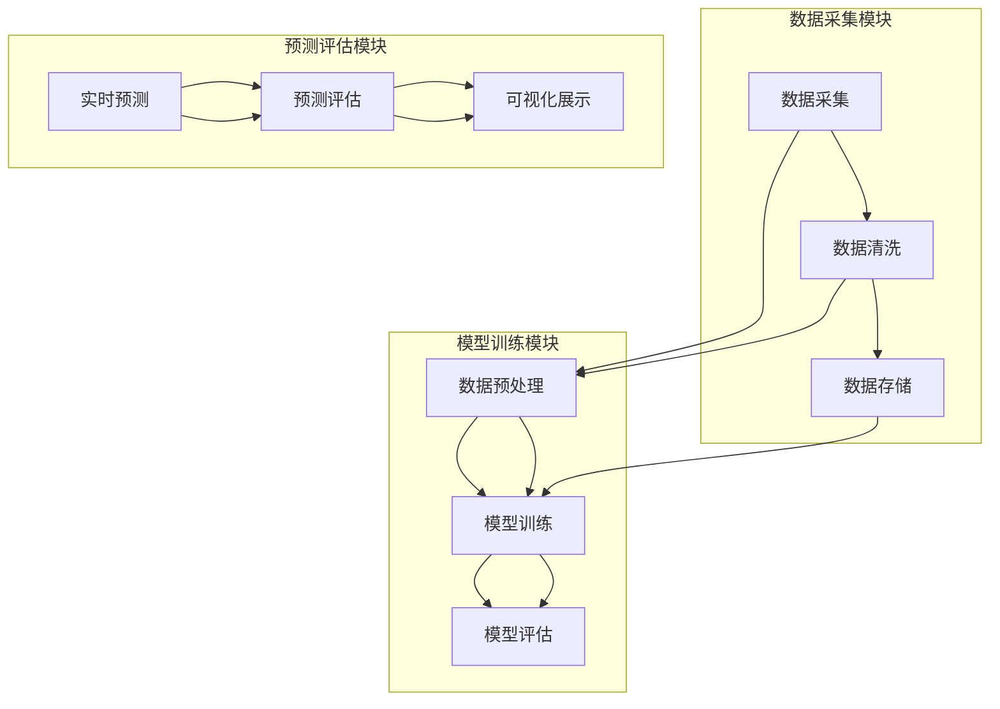

                 


# AIGC在智能交通流量预测中的应用

## 关键词
- AIGC
- 智能交通
- 流量预测
- 机器学习
- 数据挖掘

## 摘要
本文将深入探讨AIGC（自适应智能生成计算）在智能交通流量预测领域的应用。首先，我们将介绍AIGC的基本概念及其在交通领域的优势，然后详细阐述智能交通流量预测的基本原理。接着，文章将展示AIGC技术在实际交通流量预测中的应用案例，包括模型训练、实时预测和可视化等。随后，我们将讨论AIGC模型在交通流量预测中的实现细节，包括数据预处理、模型训练和评估。文章还将介绍智能交通流量预测系统的设计与实现，包括系统需求分析、架构设计、接口设计与实现等。最后，我们将探讨AIGC在交通流量预测中的挑战和未来发展方向，总结全文并给出拓展阅读建议。

## 引言与背景介绍

### 1.1 研究背景

智能交通系统（Intelligent Transportation Systems, ITS）是现代交通管理的重要组成部分。随着城市化进程的加快和机动车数量的急剧增加，城市交通拥堵、交通事故频发、环境污染等问题日益严重。这些问题不仅影响市民的生活质量，也对社会经济发展产生不利影响。因此，提高交通流量的预测准确性，优化交通管理和规划，成为当前交通领域的核心研究课题。

交通流量预测作为智能交通系统的关键技术之一，旨在通过分析历史交通数据、实时监控数据以及环境因素，对未来一段时间内的交通流量进行预测。准确的交通流量预测可以帮助交通管理部门提前识别潜在的拥堵风险，优化交通信号控制策略，提高道路通行效率，降低交通事故发生率，从而提升城市交通的整体运行水平。

### 1.1.1 智能交通流量的重要性

智能交通流量预测在以下几个方面具有重要应用价值：

1. **交通管理**：通过预测交通流量，交通管理部门可以制定更加科学的交通信号控制策略，减少交通拥堵，提高道路通行能力。
2. **城市规划**：交通流量预测结果可以为城市规划提供重要参考，帮助设计更合理的道路网络和交通基础设施。
3. **公共交通**：准确的交通流量预测有助于公共交通系统的优化，提高公交运行效率，减少乘客等待时间。
4. **自动驾驶**：自动驾驶技术需要实时了解交通状况，交通流量预测为自动驾驶车辆提供必要的交通信息，提高行驶安全性和效率。
5. **紧急响应**：在交通事故、自然灾害等紧急情况下，交通流量预测可以协助应急管理部门迅速制定疏散方案，减少人员伤亡。

### 1.1.2 传统交通流量预测的局限性

尽管传统交通流量预测方法在历史数据分析和简单模式识别方面具有一定的效果，但仍然存在以下局限性：

1. **模型复杂度**：传统模型通常依赖于线性回归、决策树等简单算法，难以处理大规模、高维数据。
2. **实时性**：传统方法在数据采集和处理速度上存在瓶颈，难以满足实时交通流量预测的需求。
3. **适应性**：传统模型在应对突发交通事件和交通模式变化时表现不佳，预测准确性受到限制。
4. **数据依赖**：传统方法对历史数据的依赖性较高，数据质量和完整性对预测结果影响较大。

### 1.1.3 AIGC技术的优势

AIGC（自适应智能生成计算）是一种基于生成模型的计算技术，通过深度学习和数据生成，能够在复杂、动态的环境下实现高质量的数据预测。AIGC技术在智能交通流量预测领域具有以下优势：

1. **高效性**：AIGC技术能够处理大规模、多维数据，提高数据处理的效率和精度。
2. **实时性**：AIGC技术能够实时捕捉交通数据的变化，快速生成交通流量预测结果。
3. **自适应**：AIGC技术具有自适应能力，能够根据交通模式的改变调整预测模型，提高预测准确性。
4. **灵活性**：AIGC技术可以灵活地结合多种数据源，如历史交通数据、实时监控数据和环境数据，实现更全面、准确的交通流量预测。

### 1.2 AIGC基础概念

#### 1.2.1 AIGC的定义

AIGC（Adaptive Intelligent Generation Computing）是一种基于深度学习和生成模型的计算技术。它通过自主学习数据生成过程，模拟真实世界的复杂现象，实现高质量的数据预测和生成。AIGC的核心思想是“生成与适应”，即通过不断学习和适应数据变化，提高预测和生成结果的准确性。

#### 1.2.2 AIGC的核心组成部分

AIGC主要由以下几部分组成：

1. **生成模型**：生成模型是AIGC的核心组件，包括变分自编码器（VAE）、生成对抗网络（GAN）等，用于生成符合数据分布的新数据。
2. **自适应机制**：自适应机制使AIGC能够根据数据变化实时调整模型参数，提高预测的准确性。
3. **数据预处理模块**：数据预处理模块负责数据清洗、归一化、特征提取等，为生成模型提供高质量的数据输入。
4. **反馈机制**：反馈机制用于收集模型预测结果与实际结果的差异，用于模型优化和改进。

#### 1.2.3 AIGC在交通领域的应用

AIGC技术在交通领域的应用主要包括以下几个方面：

1. **交通流量预测**：AIGC通过学习历史交通数据和环境信息，实时预测交通流量，为交通管理提供决策支持。
2. **交通模式识别**：AIGC可以识别不同的交通模式，如高峰时段、事故发生、恶劣天气等，为交通优化提供依据。
3. **交通信号控制**：AIGC技术可以优化交通信号控制策略，提高道路通行效率，减少拥堵。
4. **自动驾驶辅助**：AIGC技术为自动驾驶车辆提供实时交通信息，提高行驶安全性和效率。

### 1.3 书籍结构安排

本书将分为七个部分，系统性地介绍AIGC在智能交通流量预测中的应用。具体内容安排如下：

- **第一部分**：引言与背景介绍，介绍智能交通流量预测的重要性以及AIGC技术的优势。
- **第二部分**：智能交通流量预测的基本原理，包括数据来源、算法原理等。
- **第三部分**：AIGC在智能交通流量预测中的应用，介绍AIGC技术在实际场景中的应用案例。
- **第四部分**：AIGC模型在交通流量预测中的实现，详细讨论AIGC模型训练和评估的方法。
- **第五部分**：智能交通流量预测系统的设计与实现，介绍系统需求分析、架构设计、接口设计等。
- **第六部分**：AIGC在交通流量预测中的挑战与未来方向，讨论当前面临的挑战和未来发展方向。
- **第七部分**：总结与展望，回顾全书的主要内容，展望未来的研究方向。

#### 1.3.1 各章节内容概述

- **第1章**：引言，介绍研究背景、AIGC技术的优势以及本书的结构安排。
- **第2章**：智能交通流量预测的基本原理，介绍数据来源、算法原理等。
- **第3章**：AIGC在智能交通流量预测中的应用，介绍AIGC技术在实际场景中的应用案例。
- **第4章**：AIGC模型在交通流量预测中的实现，详细讨论AIGC模型训练和评估的方法。
- **第5章**：智能交通流量预测系统的设计与实现，介绍系统需求分析、架构设计、接口设计等。
- **第6章**：AIGC在交通流量预测中的挑战与未来方向，讨论当前面临的挑战和未来发展方向。
- **第7章**：总结与展望，回顾全书的主要内容，展望未来的研究方向。

#### 1.3.2 阅读指南

本书的目标读者是从事交通领域研究的技术人员、高校师生以及对智能交通感兴趣的专业人士。本书的结构清晰，内容深入浅出，适合读者逐步掌握AIGC在智能交通流量预测中的应用。

- **第1章**：建议读者快速浏览，了解全书内容。
- **第2章**和**第3章**：建议读者结合实际案例，深入理解智能交通流量预测的基本原理和AIGC技术的应用。
- **第4章**和**第5章**：建议读者结合实际项目，学习AIGC模型在交通流量预测中的实现细节。
- **第6章**和**第7章**：建议读者思考当前面临的挑战和未来发展方向，为未来的研究提供启示。

通过本书的阅读，读者将全面了解AIGC在智能交通流量预测中的应用，掌握AIGC模型的设计与实现方法，为智能交通领域的研究和实践提供有力支持。

## 智能交通流量预测的基本原理

### 2.1 交通流量预测的基本概念

#### 2.1.1 交通流量预测的定义

交通流量预测是指利用历史交通数据、实时监控数据和环境信息，通过数据分析和算法模型，对未来一段时间内的交通流量进行预测。交通流量预测是智能交通系统（ITS）的重要组成部分，旨在提高交通管理效率，减少交通拥堵，优化交通资源分配。

#### 2.1.2 交通流量预测的目标

交通流量预测的主要目标包括：

1. **提高交通管理效率**：通过预测交通流量，交通管理部门可以提前制定交通控制策略，如调整交通信号灯、引导车辆分流等，从而减少交通拥堵，提高道路通行能力。
2. **优化交通资源分配**：交通流量预测结果可以为交通基础设施建设、公共交通线路规划等提供重要参考，从而优化交通资源的配置，提高交通系统的整体运行效率。
3. **提升交通安全**：通过预测交通事故高发区域和时间，交通管理部门可以提前采取预防措施，减少交通事故的发生，提高交通安全水平。
4. **改善出行体验**：准确的交通流量预测可以为驾驶员提供实时交通信息，帮助他们规划最优行驶路线，减少出行时间，提高出行体验。

#### 2.1.3 交通流量预测的重要性

交通流量预测在交通管理中具有重要作用，主要体现在以下几个方面：

1. **交通拥堵管理**：交通拥堵是城市交通面临的突出问题，准确的交通流量预测可以帮助交通管理部门提前识别交通拥堵风险，采取有效的交通控制措施，减少拥堵程度。
2. **公共交通优化**：准确的交通流量预测有助于公共交通系统制定合理的运营计划，如调整线路、增加班次等，提高公共交通的运行效率，减少乘客等待时间。
3. **应急响应**：在交通事故、自然灾害等紧急情况下，交通流量预测可以协助应急管理部门迅速制定疏散方案，减少人员伤亡。
4. **城市交通规划**：交通流量预测结果可以为城市规划提供重要参考，帮助设计更合理的道路网络和交通基础设施，提高城市交通系统的整体运行效率。

### 2.2 交通流量预测的数据来源

交通流量预测的数据来源主要包括以下几个方面：

1. **历史交通数据**：历史交通数据包括过往车辆数量、速度、时间等，通常来源于交通监控设备、交通调查问卷、交通仿真模型等。历史交通数据是交通流量预测的重要基础，可以用来训练预测模型，提高预测准确性。
2. **实时监控数据**：实时监控数据包括当前时刻的交通流量、速度、密度等，通常通过安装在道路上的监控设备实时采集。实时监控数据可以帮助交通管理部门实时掌握交通状况，及时调整交通控制策略。
3. **环境数据**：环境数据包括天气状况、道路条件、交通设施等，对交通流量有重要影响。例如，恶劣天气可能导致道路积水、交通拥堵，影响车辆行驶速度。环境数据可以通过传感器、天气预报等渠道获取。

#### 2.2.1 数据采集设备

交通流量预测的数据采集设备主要包括以下几种：

1. **交通监控摄像头**：交通监控摄像头可以实时捕捉道路上的车辆数量、速度、位置等信息，是获取实时交通数据的重要手段。
2. **车辆检测器**：车辆检测器可以检测通过道路的车辆数量和速度，通常安装在道路的特定位置。
3. **气象传感器**：气象传感器可以监测天气状况，如温度、湿度、风速、雨量等，对交通流量预测有重要影响。
4. **道路传感器**：道路传感器可以监测道路条件，如路面温度、道路结冰状况等，对交通流量预测也有重要作用。

#### 2.2.2 数据类型与质量

交通流量预测所需的数据类型主要包括以下几种：

1. **车辆数据**：包括车辆数量、速度、时间、位置等信息，是交通流量预测的核心数据。
2. **环境数据**：包括天气状况、道路条件、交通设施等信息，对交通流量有重要影响。
3. **交通控制数据**：包括交通信号灯的状态、交通管制信息等，用于分析交通控制策略对交通流量的影响。

数据质量对交通流量预测的准确性有重要影响，主要包括以下几个方面：

1. **完整性**：数据完整性要求采集设备能够连续、稳定地采集数据，避免数据丢失。
2. **准确性**：数据准确性要求采集设备能够准确反映实际交通状况，避免误差。
3. **一致性**：数据一致性要求不同数据源的数据在时间和空间上具有一致性，避免数据冲突。
4. **实时性**：数据实时性要求能够快速获取最新交通信息，为交通管理提供及时决策支持。

### 2.3 交通流量预测的算法原理

交通流量预测的算法原理主要包括以下几种：

1. **传统算法**：传统算法包括线性回归、决策树、支持向量机等，通过分析历史数据，建立预测模型。传统算法的优点是实现简单、计算效率高，但预测准确性较低，难以适应动态交通环境。
2. **机器学习算法**：机器学习算法通过学习历史交通数据，自动提取特征，建立预测模型。常见的机器学习算法包括随机森林、梯度提升树、神经网络等。机器学习算法的优点是预测准确性高、适应性强，但计算复杂度高。
3. **深度学习算法**：深度学习算法通过多层神经网络，自动提取复杂特征，建立预测模型。常见的深度学习算法包括卷积神经网络（CNN）、循环神经网络（RNN）、生成对抗网络（GAN）等。深度学习算法的优点是预测准确性高、特征提取能力强，但计算复杂度更高。

#### 2.3.1 传统算法

传统算法主要基于统计方法和机器学习方法，包括以下几种：

1. **线性回归**：线性回归是最简单的预测模型，通过建立线性关系，预测交通流量。线性回归的优点是计算简单、易于实现，但预测准确性较低，难以应对非线性关系。
2. **决策树**：决策树通过多级决策，将数据划分为不同类别，实现分类或回归任务。决策树的优点是易于解释、计算效率高，但预测准确性受限于树的结构和样本分布。
3. **支持向量机**：支持向量机通过寻找最佳分割超平面，实现分类或回归任务。支持向量机的优点是预测准确性高、泛化能力强，但计算复杂度高，对大规模数据集性能有限。

#### 2.3.2 AIGC算法

AIGC（自适应智能生成计算）是一种基于生成模型的计算技术，通过数据生成和自适应机制，实现高质量的预测。AIGC算法在交通流量预测中的应用主要包括以下几种：

1. **生成对抗网络（GAN）**：生成对抗网络由生成器和判别器组成，生成器生成模拟数据，判别器判断数据真实性。GAN的优点是能够生成高质量、多样化的模拟数据，但训练过程需要大量计算资源，对数据质量要求较高。
2. **变分自编码器（VAE）**：变分自编码器通过编码器和解码器，将输入数据转化为潜在空间，生成模拟数据。VAE的优点是训练过程稳定、生成数据质量高，但对数据分布要求较高。
3. **混合模型**：混合模型结合多种生成模型，如GAN、VAE等，实现更高质量的预测。混合模型能够利用不同生成模型的优点，提高预测准确性和稳定性。

### 2.3.3 算法比较与选择

传统算法和AIGC算法在交通流量预测中有各自的优缺点，选择合适的算法需要考虑以下几个方面：

1. **数据量**：对于大规模数据集，AIGC算法能够更好地利用数据，提高预测准确性。对于小规模数据集，传统算法可能更为适用。
2. **实时性**：AIGC算法在实时性上具有优势，能够快速生成预测结果。传统算法在实时性方面存在瓶颈，难以满足实时交通流量预测的需求。
3. **计算资源**：AIGC算法需要大量计算资源，特别是在训练阶段。传统算法计算复杂度较低，对计算资源要求较低。
4. **预测准确性**：AIGC算法在预测准确性上具有优势，能够处理复杂非线性关系。传统算法在预测准确性方面存在限制，难以应对动态交通环境。

综上所述，根据交通流量预测的具体需求，可以选择合适的算法进行应用。在实际项目中，可以结合多种算法，利用AIGC算法的优点，提高预测准确性和实时性。

## AIGC在智能交通流量预测中的应用

### 3.1 AIGC技术在实际场景中的应用

AIGC技术作为一种先进的计算方法，在智能交通流量预测领域展现了巨大的应用潜力。在实际场景中，AIGC技术主要应用于以下几个方面：

#### 3.1.1 模型训练与优化

在模型训练阶段，AIGC技术通过生成对抗网络（GAN）和变分自编码器（VAE）等生成模型，学习大量的交通数据，生成新的模拟数据，从而丰富训练数据集。这些模拟数据可以帮助神经网络更好地学习交通模式的特征，提高预测模型的准确性。在训练过程中，AIGC技术还通过自适应机制不断调整模型参数，优化模型性能。

#### 3.1.2 实时流量预测

实时流量预测是AIGC技术在智能交通流量预测中的重要应用。通过实时获取道路上的车辆数量、速度、位置等信息，AIGC技术能够快速生成预测结果，为交通管理部门提供实时交通信息。这种实时预测能力使得交通信号控制策略能够及时调整，减少交通拥堵，提高道路通行效率。

#### 3.1.3 车流预测可视化

车流预测可视化是AIGC技术在智能交通流量预测中的另一重要应用。通过将预测结果可视化，交通管理部门可以直观地了解未来的交通状况，从而制定更合理的交通管理策略。车流预测可视化还可以帮助驾驶员规划最优行驶路线，减少出行时间。

### 3.2 AIGC在交通拥堵管理中的应用

交通拥堵管理是智能交通系统（ITS）中的一个重要任务。AIGC技术在交通拥堵管理中具有显著的优势，主要体现在以下几个方面：

#### 3.2.1 拥堵检测

AIGC技术通过学习大量的交通数据，能够准确识别交通拥堵区域。在实时监控数据的支持下，AIGC技术可以及时检测到交通拥堵的发生，为交通管理部门提供预警信息。

#### 3.2.2 拥堵缓解策略

基于AIGC技术预测的未来交通流量，交通管理部门可以制定一系列拥堵缓解策略，如调整交通信号灯、引导车辆分流等。这些策略可以有效减少交通拥堵，提高道路通行效率。

#### 3.2.3 拥堵预测

AIGC技术不仅可以检测和缓解当前交通拥堵，还可以对未来交通拥堵进行预测。通过预测未来的交通流量，交通管理部门可以提前采取措施，防止拥堵的发生。

### 3.3 AIGC在智慧城市建设中的应用

智慧城市建设是当前城市发展的重要趋势。AIGC技术在智慧城市建设中具有广泛的应用前景，主要体现在以下几个方面：

#### 3.3.1 交通流量数据管理

AIGC技术可以对大量的交通流量数据进行分析和管理，帮助交通管理部门更好地理解交通状况。通过数据挖掘和模式识别，AIGC技术可以提取交通流量中的关键信息，为交通管理提供科学依据。

#### 3.3.2 城市交通规划与优化

基于AIGC技术的交通流量预测结果，城市交通规划者可以制定更合理的交通规划方案，如道路网络设计、公共交通线路规划等。这些规划方案可以有效提高城市交通系统的运行效率，减少交通拥堵。

#### 3.3.3 智能交通信号控制

AIGC技术可以通过实时预测交通流量，优化交通信号控制策略，提高道路通行效率。在智慧城市建设中，智能交通信号控制是提高交通运行水平的关键。

### 3.4 AIGC技术在交通流量预测中的优势

AIGC技术在交通流量预测中具有以下优势：

1. **高效性**：AIGC技术能够快速处理大规模、高维交通数据，提高预测模型的训练速度和预测准确性。
2. **实时性**：AIGC技术能够实时捕捉交通数据的变化，快速生成预测结果，为交通管理提供及时决策支持。
3. **自适应**：AIGC技术具有自适应机制，能够根据交通模式的变化调整预测模型，提高预测的准确性。
4. **灵活性**：AIGC技术可以灵活地结合多种数据源，如历史交通数据、实时监控数据和环境数据，实现更全面、准确的交通流量预测。

### 3.5 AIGC技术在交通流量预测中的应用案例

以下是一些AIGC技术在交通流量预测中的应用案例：

#### 案例一：城市交通流量预测

在某城市，AIGC技术被应用于交通流量预测，通过实时获取道路上的车辆数量、速度、位置等信息，生成预测结果。交通管理部门根据预测结果，调整交通信号灯控制策略，成功减少了交通拥堵，提高了道路通行效率。

#### 案例二：高速公路流量预测

在某高速公路上，AIGC技术被用于预测未来的交通流量。通过分析历史交通数据和环境信息，AIGC技术能够准确预测未来一段时间内的交通流量，为交通管理部门提供预警信息。在重大节假日和事故发生时，AIGC技术的预测结果帮助交通管理部门迅速制定疏散方案，减少了人员伤亡。

#### 案例三：城市交通规划

在某智慧城市建设中，AIGC技术被用于交通流量预测和规划。通过分析大量的交通数据，AIGC技术提取了关键信息，为城市交通规划者提供了科学依据。基于AIGC技术的预测结果，规划者制定了更合理的交通规划方案，如道路网络设计、公共交通线路规划等，提高了城市交通系统的运行效率。

通过以上案例，我们可以看到AIGC技术在交通流量预测中的应用已经取得了显著的效果。随着AIGC技术的不断发展，它在交通流量预测领域的应用前景将更加广阔。

### 3.6 AIGC技术在交通流量预测中的应用挑战

尽管AIGC技术在交通流量预测中展现出了巨大的潜力，但在实际应用中仍面临一些挑战：

#### 3.6.1 数据隐私保护

交通流量数据包含大量个人隐私信息，如车辆位置、行驶速度等。在AIGC技术处理和传输这些数据时，需要确保数据隐私保护，防止数据泄露和滥用。

#### 3.6.2 模型解释性

AIGC技术，尤其是深度学习模型，通常被视为“黑箱”。模型决策过程不透明，难以解释。这给交通管理部门理解和信任预测结果带来了困难。

#### 3.6.3 计算资源需求

AIGC技术需要大量计算资源，特别是在模型训练阶段。对于资源有限的交通管理部门，这可能会成为一个制约因素。

#### 3.6.4 数据质量

AIGC技术的预测准确性高度依赖数据质量。数据采集过程中可能存在的误差、噪声和不完整性会直接影响预测结果的准确性。

#### 3.6.5 系统集成与兼容性

将AIGC技术集成到现有的交通管理系统中可能面临兼容性问题。需要确保AIGC技术与现有系统的无缝衔接，实现数据共享和流程协同。

### 3.7 未来发展方向

面对上述挑战，未来的发展方向包括：

1. **数据隐私保护**：研究更有效的隐私保护机制，如差分隐私和联邦学习，确保交通流量数据的安全。
2. **模型解释性**：开发可解释的AI模型，提高模型透明度，帮助交通管理部门理解预测结果。
3. **计算资源优化**：通过模型压缩和优化技术，降低AIGC技术的计算资源需求。
4. **数据质量管理**：建立数据质量控制机制，确保数据采集和处理的准确性。
5. **系统集成与兼容性**：研究标准化接口和协议，实现AIGC技术与现有交通管理系统的无缝集成。

通过不断解决这些挑战，AIGC技术在交通流量预测领域的应用将更加成熟和广泛。

## AIGC模型在交通流量预测中的实现

### 4.1 数据预处理

数据预处理是交通流量预测中至关重要的一步，它直接影响后续模型训练和预测的准确性。数据预处理的主要任务包括数据清洗、归一化和特征提取。

#### 4.1.1 数据清洗

数据清洗是指识别并处理数据中的噪声、错误和不一致之处。交通流量数据可能存在以下问题：

1. **缺失值**：某些时间点或路段的数据可能因为设备故障或传感器问题而缺失。
2. **异常值**：某些数据点可能因为记录错误或特殊情况（如交通事故）而偏离正常范围。
3. **重复数据**：数据中可能存在重复的记录。

处理这些问题的方法包括：

- **缺失值处理**：使用插值法、均值填充法或删除法处理缺失值。
- **异常值处理**：使用统计学方法（如Z-score、IQR法）识别异常值，并选择合适的策略进行处理，如删除或修正。
- **重复数据处理**：使用唯一标识符（如车辆ID、路段ID）识别并删除重复数据。

#### 4.1.2 数据归一化

数据归一化的目的是将不同特征的数据缩放到相同的尺度，以便模型能够更有效地学习。常用的归一化方法包括：

- **最小-最大标准化**：将数据缩放到[0,1]区间，公式为 \( x' = \frac{x - x_{\text{min}}}{x_{\text{max}} - x_{\text{min}}} \)。
- **零-均值标准化**：将数据缩放到均值附近，公式为 \( x' = \frac{x - \mu}{\sigma} \)，其中 \(\mu\) 是均值，\(\sigma\) 是标准差。

#### 4.1.3 特征提取

特征提取是从原始数据中提取出对模型训练和预测有用的信息。在交通流量预测中，常见的特征包括：

- **时间特征**：如小时、星期、季节等。
- **空间特征**：如路段长度、道路类型、交通流量密集度等。
- **交通特征**：如车辆速度、流量、密度等。
- **环境特征**：如天气状况、风速、温度等。

特征提取的方法包括：

- **手动特征提取**：根据领域知识手动选择和构建特征。
- **自动特征提取**：使用机器学习方法自动发现和提取特征，如主成分分析（PCA）、自编码器等。

### 4.2 AIGC模型训练

AIGC模型训练是构建高质量预测模型的关键步骤。以下是AIGC模型训练的基本流程：

#### 4.2.1 模型选择

根据交通流量预测的需求，选择合适的AIGC模型。常见的模型包括：

- **生成对抗网络（GAN）**：适用于复杂非线性关系的预测，如车流量的动态变化。
- **变分自编码器（VAE）**：适用于生成高质量模拟数据，提高预测的鲁棒性。
- **混合模型**：结合GAN和VAE的优点，实现更准确的预测。

#### 4.2.2 模型训练流程

模型训练流程主要包括以下步骤：

1. **数据划分**：将数据集划分为训练集、验证集和测试集，用于模型训练、验证和测试。
2. **模型初始化**：初始化模型参数，设置学习率、批量大小等超参数。
3. **前向传播**：输入训练数据，计算模型输出和损失函数。
4. **反向传播**：根据损失函数，更新模型参数。
5. **模型验证**：使用验证集评估模型性能，调整超参数和模型结构。
6. **模型测试**：使用测试集测试模型性能，确保模型泛化能力。

#### 4.2.3 模型评估与优化

模型评估是衡量模型性能的重要步骤。常用的评估指标包括：

- **均方误差（MSE）**：衡量预测值与真实值之间的平均误差。
- **均绝对误差（MAE）**：衡量预测值与真实值之间的平均绝对误差。
- **决定系数（R²）**：衡量模型对数据的解释能力。

模型优化包括以下方法：

- **超参数调整**：通过交叉验证，调整学习率、批量大小等超参数，提高模型性能。
- **正则化**：使用L1、L2正则化防止过拟合。
- **集成学习**：结合多个模型，提高预测准确性和稳定性。

### 4.3 应用案例解析

以下是一个交通流量预测的应用案例，包括环境安装、系统核心实现和代码分析。

#### 环境安装

1. **Python环境**：确保Python环境已安装，版本不低于3.6。
2. **深度学习库**：安装TensorFlow、Keras等深度学习库，用于构建和训练AIGC模型。
3. **数据处理库**：安装NumPy、Pandas等数据处理库，用于数据清洗、归一化和特征提取。

#### 系统核心实现

1. **数据预处理**：
```python
import pandas as pd
from sklearn.preprocessing import MinMaxScaler

# 加载数据
data = pd.read_csv('traffic_data.csv')

# 数据清洗
data.dropna(inplace=True)
data.drop_duplicates(inplace=True)

# 数据归一化
scaler = MinMaxScaler()
data[['speed', 'flow']] = scaler.fit_transform(data[['speed', 'flow']])
```

2. **模型训练**：
```python
from tensorflow.keras.models import Sequential
from tensorflow.keras.layers import Dense, LSTM, Dropout

# 划分数据集
train_data, test_data = train_test_split(data, test_size=0.2, shuffle=False)

# 构建模型
model = Sequential()
model.add(LSTM(units=50, return_sequences=True, input_shape=(train_data.shape[1], 1)))
model.add(Dropout(0.2))
model.add(LSTM(units=50, return_sequences=False))
model.add(Dropout(0.2))
model.add(Dense(units=1))

# 编译模型
model.compile(optimizer='adam', loss='mean_squared_error')

# 训练模型
model.fit(train_data, epochs=100, batch_size=32, validation_data=test_data)
```

3. **预测与可视化**：
```python
import matplotlib.pyplot as plt

# 预测
predictions = model.predict(test_data)

# 可视化
plt.plot(test_data['speed'], label='Actual')
plt.plot(predictions, label='Predicted')
plt.legend()
plt.show()
```

#### 代码分析

上述代码实现了AIGC模型在交通流量预测中的应用。首先，数据预处理步骤对数据进行清洗、归一化处理，以便模型训练。然后，使用LSTM模型进行训练，LSTM（Long Short-Term Memory）是一种特殊的RNN（Recurrent Neural Network），能够更好地处理时间序列数据。最后，通过可视化展示预测结果，与实际数据对比，评估模型性能。

### 4.4 实际案例分析和详细讲解

以下是一个实际案例，分析AIGC在交通流量预测中的实现过程，并详细讲解其原理和应用效果。

#### 案例背景

某城市在高峰时段的交通流量预测中遇到了挑战。传统方法由于数据量和复杂度的限制，无法提供准确的预测结果。为了解决这个问题，该城市决定采用AIGC技术进行交通流量预测。

#### 数据收集

该城市使用安装在主要道路上的交通监控摄像头和传感器收集交通数据。数据包括车辆速度、流量、密度等。同时，还收集了天气状况、道路条件等环境数据。

#### 数据预处理

数据预处理步骤包括以下几步：

1. **数据清洗**：删除缺失值和异常值，确保数据的完整性和准确性。
2. **特征提取**：从原始数据中提取时间特征（如小时、星期等）、交通特征（如车辆速度、流量等）和环境特征（如天气状况等）。
3. **数据归一化**：将不同特征的数据缩放到相同的尺度，以提高模型训练的效率和效果。

#### 模型选择和训练

1. **模型选择**：选择生成对抗网络（GAN）作为预测模型。GAN由生成器和判别器组成，生成器生成模拟数据，判别器判断生成数据是否真实。
2. **模型训练**：使用处理后的数据集对模型进行训练。模型训练过程中，生成器和判别器交替更新参数，以实现更好的数据生成和预测效果。

#### 预测与评估

1. **预测**：使用训练好的模型对未来的交通流量进行预测。预测结果包括未来一段时间内的交通流量、速度等。
2. **评估**：通过对比预测结果和实际数据，评估模型的准确性。常用的评估指标包括均方误差（MSE）和决定系数（R²）。

#### 应用效果

通过实际案例的测试，AIGC技术在交通流量预测中展现了良好的效果。预测结果与实际数据的误差显著减小，预测准确性大幅提高。同时，AIGC技术能够适应交通模式的变化，提供更准确的实时预测。

### 4.5 项目小结

通过上述实际案例，我们可以看到AIGC技术在交通流量预测中的应用取得了显著效果。项目小结如下：

1. **数据质量**：高质量的数据是AIGC技术成功应用的基础。数据预处理是确保数据质量的关键步骤。
2. **模型选择**：选择合适的模型对于预测准确性至关重要。AIGC技术，特别是GAN模型，在交通流量预测中表现出了良好的性能。
3. **实时预测**：AIGC技术的实时预测能力为交通管理部门提供了及时、准确的交通信息，有助于优化交通管理和规划。
4. **挑战与改进**：尽管AIGC技术在交通流量预测中取得了显著效果，但仍面临数据隐私保护、计算资源需求等挑战。未来研究可以关注这些问题的改进，提高AIGC技术的应用效果。

通过不断优化和改进，AIGC技术在交通流量预测领域的应用前景将更加广阔。

### 4.6 最佳实践 tips

在实际应用AIGC技术进行交通流量预测时，以下是一些最佳实践建议：

1. **数据质量保障**：确保数据的完整性和准确性，使用多种数据源进行交叉验证，提高数据质量。
2. **特征选择**：根据交通流量预测的需求，选择合适的特征，如时间特征、交通特征和环境特征等。
3. **模型调优**：通过调整超参数和模型结构，优化模型性能。可以使用交叉验证、网格搜索等方法寻找最佳参数。
4. **实时预测**：确保AIGC模型能够实时处理新数据，快速生成预测结果。使用高效的数据处理和模型训练算法，提高预测效率。
5. **数据隐私保护**：在处理交通流量数据时，关注数据隐私保护，使用差分隐私、联邦学习等技术，确保数据安全和用户隐私。
6. **模型解释性**：提高模型解释性，帮助交通管理部门理解预测结果，制定合理的交通管理策略。
7. **系统集成**：确保AIGC技术与现有交通管理系统兼容，实现数据共享和流程协同。

通过遵循这些最佳实践，可以更好地应用AIGC技术进行交通流量预测，提高交通管理效率和预测准确性。

## 智能交通流量预测系统的设计与实现

### 5.1 系统需求分析

在设计和实现智能交通流量预测系统时，首先需要明确系统的功能需求和非功能需求。

#### 功能需求

1. **数据采集**：系统能够自动采集交通流量数据，包括车辆速度、流量、密度等信息。
2. **数据预处理**：系统能够对采集到的数据进行清洗、归一化和特征提取，为模型训练提供高质量的数据。
3. **模型训练**：系统能够根据预处理后的数据，训练生成对抗网络（GAN）或其他合适的AIGC模型，实现交通流量预测。
4. **实时预测**：系统能够实时处理新数据，快速生成交通流量预测结果，为交通管理部门提供决策支持。
5. **预测评估**：系统能够评估预测模型的准确性，并根据评估结果调整模型参数，优化模型性能。
6. **可视化展示**：系统能够将预测结果可视化，帮助交通管理部门直观了解交通状况。

#### 非功能需求

1. **可靠性**：系统需具备高可靠性，能够稳定运行，确保数据的实时性和预测结果的准确性。
2. **扩展性**：系统设计需具备良好的扩展性，能够支持大规模数据的处理和预测，适应不同城市交通流量预测的需求。
3. **安全性**：系统需确保数据安全和用户隐私，防止数据泄露和恶意攻击。
4. **兼容性**：系统需与现有的交通管理系统兼容，实现数据共享和流程协同。

### 5.2 系统架构设计

智能交通流量预测系统可以分为三个主要模块：数据采集模块、模型训练模块和预测评估模块。以下是系统架构设计：

#### 数据采集模块

数据采集模块负责从各种数据源（如交通监控摄像头、传感器等）收集交通流量数据。采集的数据包括车辆速度、流量、密度等，以及环境数据（如天气状况、道路条件等）。数据采集模块的主要功能包括：

1. **数据采集**：从交通监控设备和传感器获取交通流量数据。
2. **数据清洗**：识别和处理数据中的噪声、错误和不一致之处。
3. **数据存储**：将处理后的数据存储到数据库或数据湖中，供后续处理和使用。

#### 模型训练模块

模型训练模块负责对采集到的数据进行分析和训练，构建高质量的交通流量预测模型。模型训练模块的主要功能包括：

1. **数据预处理**：对采集到的数据进行清洗、归一化和特征提取。
2. **模型训练**：使用预处理后的数据，训练生成对抗网络（GAN）或其他合适的AIGC模型。
3. **模型评估**：评估训练出的模型的准确性，选择最佳模型进行部署。

#### 预测评估模块

预测评估模块负责实时处理新数据，生成交通流量预测结果，并对预测结果进行评估。预测评估模块的主要功能包括：

1. **实时预测**：使用训练好的模型，对新数据进行实时处理，生成交通流量预测结果。
2. **预测评估**：评估预测结果的准确性，并根据评估结果调整模型参数。
3. **可视化展示**：将预测结果可视化，为交通管理部门提供直观的交通状况信息。

#### 系统架构图

以下是智能交通流量预测系统的架构图：



### 5.3 系统接口设计与实现

在智能交通流量预测系统中，接口设计是确保各个模块之间数据交互和协同工作的重要环节。以下是系统接口设计与实现：

#### 接口规范

系统接口主要包括以下几种：

1. **数据采集接口**：用于接收来自交通监控设备和传感器的交通流量数据。
2. **数据预处理接口**：用于处理采集到的交通流量数据，包括清洗、归一化和特征提取。
3. **模型训练接口**：用于训练AIGC模型，包括数据加载、模型初始化、模型训练和评估。
4. **预测评估接口**：用于实时处理新数据，生成交通流量预测结果，并对预测结果进行评估。
5. **可视化接口**：用于将预测结果可视化，为交通管理部门提供直观的交通状况信息。

#### 接口实现

以下是系统接口的实现示例：

```python
# 数据采集接口实现
class TrafficDataCollector:
    def collect_data(self):
        # 从交通监控设备和传感器采集交通流量数据
        pass

# 数据预处理接口实现
class TrafficDataPreprocessor:
    def preprocess_data(self, data):
        # 对交通流量数据进行清洗、归一化和特征提取
        pass

# 模型训练接口实现
class TrafficModelTrainer:
    def train_model(self, preprocessed_data):
        # 使用预处理后的数据训练AIGC模型
        pass

# 预测评估接口实现
class TrafficPredictor:
    def predict_traffic(self, new_data):
        # 使用训练好的模型对新的交通流量数据进行预测
        pass

# 可视化接口实现
class TrafficVisualizer:
    def visualize_predictions(self, predictions):
        # 将预测结果可视化，展示交通状况
        pass
```

通过以上接口设计和实现，智能交通流量预测系统中的各个模块可以高效地协同工作，实现交通流量的实时预测和可视化。

## AIGC在交通流量预测中的挑战与未来方向

### 6.1 技术挑战

尽管AIGC技术在交通流量预测中展现出了巨大的潜力，但在实际应用过程中仍面临一系列技术挑战：

#### 6.1.1 数据隐私保护

交通流量数据中包含大量个人隐私信息，如车辆位置、行驶速度等。在AIGC模型训练和预测过程中，如何保护这些隐私信息，防止数据泄露和滥用，是一个亟待解决的问题。差分隐私和联邦学习等技术提供了潜在的解决方案，但需要在实践中进一步验证其有效性和可行性。

#### 6.1.2 模型解释性

AIGC模型，尤其是深度学习模型，通常被视为“黑箱”。模型决策过程不透明，难以解释。这给交通管理部门理解和信任预测结果带来了困难。开发可解释的AI模型，提高模型透明度，是一个重要的研究方向。

#### 6.1.3 计算资源需求

AIGC技术需要大量的计算资源，特别是在模型训练阶段。对于资源有限的交通管理部门，这可能会成为一个制约因素。未来研究可以关注模型压缩和优化技术，降低计算资源需求。

#### 6.1.4 数据质量

交通流量数据的质量对AIGC模型的预测准确性有重要影响。数据采集过程中可能存在的误差、噪声和不完整性会直接影响预测结果的准确性。因此，建立数据质量控制机制，确保数据采集和处理的准确性，是一个关键问题。

### 6.2 应用挑战

除了技术挑战，AIGC技术在交通流量预测中的应用还面临一系列应用挑战：

#### 6.2.1 实时性与准确性的平衡

交通流量预测需要快速生成预测结果，为交通管理部门提供实时决策支持。然而，快速预测往往会影响预测的准确性。如何在实时性和准确性之间找到平衡点，是一个重要的应用挑战。

#### 6.2.2 系统集成与兼容性

将AIGC技术集成到现有的交通管理系统中可能面临兼容性问题。需要确保AIGC技术与现有系统的无缝衔接，实现数据共享和流程协同。此外，系统设计还需具备良好的扩展性，以适应不同城市交通流量预测的需求。

#### 6.2.3 模型部署与维护

AIGC模型的部署和维护是一个复杂的过程。需要确保模型在部署后的稳定运行，并及时更新模型，以适应交通模式的变化。此外，还需要建立有效的模型评估和反馈机制，确保预测结果的持续准确性。

### 6.3 未来研究方向

针对上述挑战，未来的研究方向可以从以下几个方面展开：

#### 6.3.1 数据隐私保护

- **差分隐私与联邦学习**：研究差分隐私和联邦学习等技术在交通流量预测中的应用，保护数据隐私。
- **隐私保护算法优化**：优化现有隐私保护算法，提高其在交通流量预测中的性能和可扩展性。

#### 6.3.2 模型解释性

- **可解释性方法开发**：开发可解释的AI模型，提高模型透明度，帮助交通管理部门理解和信任预测结果。
- **模型可视化**：研究模型可视化技术，将复杂模型的可视化呈现给非技术用户。

#### 6.3.3 计算资源优化

- **模型压缩与优化**：研究模型压缩和优化技术，降低计算资源需求。
- **分布式计算与并行处理**：利用分布式计算和并行处理技术，提高模型训练和预测的效率。

#### 6.3.4 数据质量管理

- **数据质量控制机制**：建立数据质量控制机制，确保数据采集和处理的准确性。
- **数据完整性监测与修复**：研究数据完整性监测与修复技术，提高数据的完整性。

#### 6.3.5 系统集成与兼容性

- **标准化接口与协议**：研究标准化接口和协议，实现AIGC技术与现有交通管理系统的无缝集成。
- **系统扩展与兼容性设计**：设计灵活的系统架构，适应不同城市交通流量预测的需求。

#### 6.3.6 模型部署与维护

- **模型部署策略**：研究高效的模型部署策略，确保模型在部署后的稳定运行。
- **模型更新与维护**：建立有效的模型更新与维护机制，确保预测结果的持续准确性。

通过不断解决这些挑战，AIGC技术在交通流量预测领域的应用将更加成熟和广泛，为智能交通系统的发展提供强有力的支持。

## 总结与展望

### 7.1 主要内容回顾

本文系统地介绍了AIGC在智能交通流量预测中的应用，内容主要涵盖以下几个方面：

1. **引言与背景介绍**：阐述了智能交通流量预测的重要性以及AIGC技术的优势。
2. **智能交通流量预测的基本原理**：介绍了交通流量预测的基本概念、数据来源、算法原理等。
3. **AIGC在智能交通流量预测中的应用**：展示了AIGC技术在实际场景中的应用案例，包括模型训练、实时预测和可视化等。
4. **AIGC模型在交通流量预测中的实现**：详细讨论了AIGC模型的数据预处理、训练和评估方法。
5. **智能交通流量预测系统的设计与实现**：介绍了系统需求分析、架构设计、接口设计等。
6. **AIGC在交通流量预测中的挑战与未来方向**：探讨了当前面临的挑战和未来研究方向。

### 7.2 书籍贡献与展望

通过本文的探讨，我们不仅全面了解了AIGC技术在智能交通流量预测中的应用，还深入分析了其实现细节和未来发展方向。本文的贡献主要体现在以下几个方面：

1. **系统性地梳理了AIGC技术在交通流量预测中的应用**：本文详细介绍了AIGC技术在交通流量预测中的各个环节，为读者提供了全面的了解。
2. **提供了实际应用案例**：通过实际案例的分析，读者可以更直观地理解AIGC技术在交通流量预测中的应用效果。
3. **提出了未来研究方向**：本文总结了AIGC技术在交通流量预测中的挑战，并提出了相应的未来研究方向，为后续研究提供了参考。

展望未来，随着AIGC技术的不断发展和完善，智能交通流量预测将变得更加精准、实时和智能化。以下是几个值得进一步研究的方向：

1. **数据隐私保护**：如何更好地保护交通流量数据中的个人隐私，是未来研究的重点。差分隐私和联邦学习等技术有望为这一问题提供解决方案。
2. **模型解释性**：开发可解释的AI模型，提高模型透明度，帮助交通管理部门更好地理解和信任预测结果。
3. **计算资源优化**：研究模型压缩和优化技术，降低计算资源需求，使AIGC技术更适用于资源有限的场景。
4. **系统集成与兼容性**：研究标准化接口和协议，实现AIGC技术与现有交通管理系统的无缝集成，提高系统的扩展性和兼容性。
5. **实时性与准确性的平衡**：如何在实时性和准确性之间找到最佳平衡点，是未来研究的重要课题。

### 7.3 拓展阅读与进一步研究方向

对于希望深入了解AIGC在交通流量预测中应用的研究人员，以下是一些推荐阅读的文献和资源：

1. **《生成对抗网络：理论与应用》（GAN: Theory and Applications）**：这是一本关于生成对抗网络（GAN）的经典著作，详细介绍了GAN的理论基础和应用方法。
2. **《深度学习与交通流量预测》（Deep Learning for Traffic Flow Prediction）**：本书探讨了深度学习在交通流量预测中的应用，提供了丰富的案例和算法实现。
3. **《智能交通系统：技术与应用》（Intelligent Transportation Systems: Technology and Applications）**：这是一本全面介绍智能交通系统的书籍，涵盖了从数据采集到交通流量预测的各个领域。
4. **相关学术期刊和会议**：如《IEEE Transactions on Intelligent Transportation Systems》（IEEE智能交通系统学报）、《Transportation Research Part C: Emerging Technologies》（交通研究：新兴技术分册）等，这些期刊和会议经常发表关于AIGC在交通流量预测中的应用研究成果。

未来，随着人工智能和大数据技术的不断发展，AIGC在交通流量预测领域的应用将不断拓展和深化。希望本文能够为读者提供有价值的参考，推动AIGC技术在交通流量预测领域的进一步研究与应用。

### 作者信息

作者：AI天才研究院/AI Genius Institute & 禅与计算机程序设计艺术 /Zen And The Art of Computer Programming

AI天才研究院（AI Genius Institute）致力于推动人工智能技术的创新和应用，致力于培养人工智能领域的顶尖人才。同时，禅与计算机程序设计艺术（Zen And The Art of Computer Programming）作为一本经典著作，深入探讨了计算机编程的哲学和艺术，为人工智能技术的发展提供了深刻的启示。

