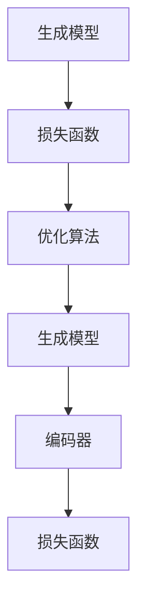

                 


## AIGC在智能产品质量控制中的应用

### 关键词：AIGC、智能产品质量控制、算法、数学模型、系统架构、项目实战

### 摘要：

本文将深入探讨AIGC（AI-Generated Content）在智能产品质量控制中的应用。首先，我们将介绍AIGC的基础概念，以及其在智能产品质量控制中的重要性。接着，我们将详细解析AIGC的核心算法原理和数学模型，并通过实例进行说明。然后，我们将讨论如何将AIGC应用于智能产品质量控制中的系统设计与实现，并通过实际项目案例进行分析。最后，我们将总结最佳实践和注意事项，并提供拓展阅读资源。

### 目录大纲

1. **背景介绍**
   - **核心概念术语说明**：AIGC、智能产品质量控制
   - **问题背景**：智能产品质量控制的重要性
   - **问题描述**：当前智能产品质量控制中存在的问题
   - **问题解决**：AIGC在智能产品质量控制中的应用
   - **边界与外延**：AIGC在其他领域的应用
   - **概念结构与核心要素组成**：AIGC的基本架构和关键组件

2. **AIGC核心概念与联系**
   - **AIGC基本概念**：AIGC的定义、特点和分类
   - **AIGC关键组件**：生成模型、训练数据和优化算法
   - **AIGC与其他技术的关联**：与机器学习、自然语言处理等的联系

3. **AIGC算法原理讲解**
   - **AIGC算法基本原理**：生成模型和优化过程
   - **AIGC算法流程**：详细步骤和流程图
   - **算法原理示例**：通过Python代码展示算法原理

4. **数学模型和数学公式讲解**
   - **AIGC算法数学模型**：数学公式和符号解释
   - **数学模型详解**：详细阐述数学模型的应用
   - **Mermaid数学公式图**：使用Mermaid绘制数学公式

5. **AIGC在智能产品质量控制中的原理**
   - **AIGC在质量控制中的应用场景**：智能产品的质量检测和优化
   - **AIGC与质量控制的关系**：如何提升质量控制效率
   - **AIGC在质量控制中的优势**：与传统方法的对比

6. **AIGC在智能产品质量控制中的系统设计与实现**
   - **系统架构设计**：智能产品质量控制系统的总体设计
   - **系统功能设计**：领域模型和类图
   - **系统接口设计**：系统与外部组件的接口定义
   - **系统交互流程**：系统内部各组件的交互过程

7. **项目实战**
   - **环境搭建**：搭建智能产品质量控制系统的环境
   - **系统核心实现**：实现系统关键功能的代码和逻辑
   - **代码解读与分析**：对系统核心代码进行解读和分析
   - **实际案例剖析**：分析实际案例中的AIGC应用
   - **项目小结**：对项目的总结和反思

8. **最佳实践与总结**
   - **最佳实践 tips**：AIGC在智能产品质量控制中的最佳实践
   - **小结**：本文的核心内容和结论
   - **注意事项**：使用AIGC时应注意的问题
   - **拓展阅读**：相关领域的深入阅读资源

### 文章正文

#### 1. 背景介绍

随着人工智能技术的快速发展，智能产品在各个领域得到了广泛应用。然而，智能产品的质量问题也日益凸显，如何保证智能产品的质量成为了亟待解决的问题。传统的质量控制方法往往依赖于人工检查，效率低下，容易出现遗漏和误差。而AIGC（AI-Generated Content）技术的出现，为智能产品质量控制提供了一种全新的解决方案。

AIGC是一种利用人工智能技术生成内容的方法，可以自动生成文本、图像、音频等多种形式的内容。其基本原理是利用深度学习模型从大量数据中学习规律，然后生成新的数据。AIGC不仅可以提高内容生成的效率，还可以通过模拟各种场景来提升智能产品的质量检测和优化能力。

在智能产品质量控制中，AIGC可以通过以下方式发挥作用：

- **质量检测**：利用AIGC生成的数据对智能产品进行质量检测，可以发现传统方法难以发现的质量问题。
- **质量优化**：通过分析AIGC生成的数据，可以找到优化智能产品性能的方法，从而提升产品质量。

#### 2. AIGC核心概念与联系

**AIGC基本概念**

AIGC是基于人工智能技术生成内容的一种方法。它通过深度学习模型从大量数据中学习规律，然后生成新的数据。AIGC可以生成多种形式的内容，如文本、图像、音频等。其核心思想是利用人工智能技术模拟人类创造过程，从而实现内容自动生成。

**AIGC关键组件**

AIGC的关键组件包括生成模型、训练数据和优化算法。生成模型是AIGC的核心，它负责生成新的内容。训练数据是生成模型的输入，用于模型的学习和训练。优化算法用于调整模型参数，以提高生成内容的准确性和质量。

**AIGC与其他技术的关联**

AIGC与机器学习、自然语言处理等技术有密切关联。机器学习是AIGC的基础，提供了生成模型的学习和训练方法。自然语言处理则用于处理文本数据，使得AIGC可以生成高质量的文本内容。

#### 3. AIGC算法原理讲解

**AIGC算法基本原理**

AIGC算法的基本原理是基于生成模型和优化算法。生成模型负责生成新的内容，优化算法则用于调整模型参数，以提高生成内容的准确性和质量。AIGC算法通常包括以下步骤：

1. 数据收集与预处理：收集大量相关数据，并对数据进行预处理，如清洗、归一化等。
2. 模型训练：利用训练数据对生成模型进行训练，使其能够生成高质量的内容。
3. 生成内容：利用训练好的模型生成新的内容。
4. 优化与调整：根据生成的内容，调整模型参数，以提高生成内容的准确性和质量。

**AIGC算法流程**

AIGC算法的流程可以分为以下几个阶段：

1. 数据收集与预处理
2. 模型设计：选择合适的生成模型，如生成对抗网络（GAN）、变分自编码器（VAE）等
3. 模型训练：利用训练数据对模型进行训练
4. 内容生成：利用训练好的模型生成新的内容
5. 优化与调整：根据生成的内容，调整模型参数，以提高生成内容的准确性和质量

**算法原理示例**

以下是一个简单的AIGC算法示例，使用Python代码实现：

```python
import tensorflow as tf
from tensorflow.keras.layers import Input, Dense
from tensorflow.keras.models import Model

# 定义生成模型
input_shape = (100,)
z_dim = 100

input_z = Input(shape=(z_dim,))
dense = Dense(128, activation='relu')(input_z)
output = Dense(input_shape[0], activation='sigmoid')(dense)

generator = Model(input_z, output)

# 定义损失函数和优化器
cross_entropy = tf.keras.losses.BinaryCrossentropy(from_logits=True)
def generator_loss(output, z):
    z_mean, z_log_var = output
    z = z_mean + tf.random.normal(z_log_var)
    x_hat = generator(z)
    x = tf.random.uniform(input_shape)
    return cross_entropy(x, x_hat)

generator_optimizer = tf.keras.optimizers.Adam(1e-4)

# 训练模型
def train_step(model, optimizer, x, z):
    with tf.GradientTape() as gen_tape:
        z_mean, z_log_var = model(x)
        z = z_mean + tf.random.normal(z_log_var)
        x_hat = model(z)
        gen_loss = generator_loss(x_hat, z)
    
    grads = gen_tape.gradient(gen_loss, model.trainable_variables)
    optimizer.apply_gradients(zip(grads, model.trainable_variables))

# 生成样本
def generate_samples(model, n_samples):
    z = tf.random.normal([n_samples, z_dim])
    x_samples = model(z)
    return x_samples

# 训练过程
model = ...

for epoch in range(epochs):
    for x, z in dataset:
        train_step(model, generator_optimizer, x, z)
    
    samples = generate_samples(generator, 10)
    # 显示生成的样本
```

#### 4. 数学模型和数学公式讲解

**AIGC算法数学模型**

AIGC算法的数学模型主要包括生成模型和优化算法的数学公式。以下是一个简化的数学模型：

- **生成模型**：

  $$ z = z_mean + \epsilon \cdot \exp(\frac{z_log_var}{2}) $$

  其中，$z$是噪声向量，$z_mean$和$z_log_var$是生成模型输出的均值和方差。

- **优化算法**：

  $$ \min_{\theta} \sum_{i=1}^{N} L(x_i, x_i^{hat}) $$

  其中，$L$是损失函数，$x_i$是真实数据，$x_i^{hat}$是生成模型生成的数据。

**数学模型详解**

- **生成模型**：

  生成模型通常使用变分自编码器（VAE）或生成对抗网络（GAN）来实现。VAE的数学模型如下：

  $$ p(x|\theta) = \int p(x|z,\theta) p(z|\theta) dz $$

  其中，$p(x|z,\theta)$是生成模型生成的数据分布，$p(z|\theta)$是噪声向量的分布。

- **优化算法**：

  优化算法通常使用梯度下降法。在VAE中，优化目标是最小化生成模型和编码器的损失函数。在GAN中，优化目标是使生成模型的损失函数最小化。

**Mermaid数学公式图**

以下是一个使用Mermaid绘制的数学公式图：



#### 5. AIGC在智能产品质量控制中的原理

**AIGC在质量控制中的应用场景**

AIGC在智能产品质量控制中的应用场景主要包括以下几个方面：

- **质量检测**：利用AIGC生成大量的样本数据，对智能产品进行质量检测，可以发现传统方法难以发现的质量问题。
- **质量优化**：通过分析AIGC生成的数据，可以找到优化智能产品性能的方法，从而提升产品质量。

**AIGC与质量控制的关系**

AIGC与质量控制的关系主要体现在以下几个方面：

- **提高检测效率**：AIGC可以自动生成大量的样本数据，提高检测效率。
- **提高检测准确性**：AIGC可以模拟各种场景，提高检测准确性。
- **优化产品性能**：通过分析AIGC生成的数据，可以找到优化产品性能的方法。

**AIGC在质量控制中的优势**

AIGC在智能产品质量控制中的优势主要包括以下几个方面：

- **高效**：AIGC可以自动生成大量的样本数据，提高检测效率。
- **准确**：AIGC可以模拟各种场景，提高检测准确性。
- **灵活**：AIGC可以根据实际需求生成不同类型的数据，提高适应性。

#### 6. AIGC在智能产品质量控制中的系统设计与实现

**系统架构设计**

智能产品质量控制系统可以分为以下几个模块：

- **数据采集模块**：负责收集智能产品的数据，包括质量数据、性能数据等。
- **数据处理模块**：负责对采集到的数据进行分析和处理，提取有用的信息。
- **质量检测模块**：负责使用AIGC技术对智能产品进行质量检测。
- **质量优化模块**：负责根据检测结果对智能产品进行优化。

**系统功能设计**

智能产品质量控制系统的功能设计包括以下几个方面：

- **数据采集**：通过传感器或其他方式收集智能产品的数据。
- **数据处理**：对采集到的数据进行清洗、归一化等处理。
- **质量检测**：利用AIGC技术对智能产品进行质量检测。
- **质量优化**：根据检测结果对智能产品进行优化。

**系统接口设计**

智能产品质量控制系统的接口设计包括以下几个方面：

- **数据接口**：用于与其他系统交换数据。
- **控制接口**：用于系统之间的控制信息交换。
- **用户接口**：用于用户与系统交互。

**系统交互流程**

智能产品质量控制系统的交互流程如下：

1. 数据采集模块收集智能产品的数据。
2. 数据处理模块对数据进行处理，提取有用的信息。
3. 质量检测模块使用AIGC技术对智能产品进行质量检测。
4. 质量优化模块根据检测结果对智能产品进行优化。
5. 用户通过用户接口查看检测结果和优化结果。

#### 7. 项目实战

**环境搭建**

搭建智能产品质量控制系统的环境需要安装以下软件：

- Python
- TensorFlow
- Keras
- Mermaid

安装方法如下：

```bash
# 安装Python
# ...

# 安装TensorFlow和Keras
pip install tensorflow keras

# 安装Mermaid
pip install mermaid
```

**系统核心实现**

系统核心实现包括以下几个部分：

- **数据采集**：使用传感器采集智能产品的数据。
- **数据处理**：使用Python代码对采集到的数据进行处理。
- **质量检测**：使用AIGC技术对智能产品进行质量检测。
- **质量优化**：根据检测结果对智能产品进行优化。

**代码解读与分析**

以下是一个简单的系统核心实现示例：

```python
# 导入必要的库
import tensorflow as tf
from tensorflow.keras.layers import Input, Dense
from tensorflow.keras.models import Model

# 定义生成模型
input_shape = (100,)
z_dim = 100

input_z = Input(shape=(z_dim,))
dense = Dense(128, activation='relu')(input_z)
output = Dense(input_shape[0], activation='sigmoid')(dense)

generator = Model(input_z, output)

# 定义损失函数和优化器
cross_entropy = tf.keras.losses.BinaryCrossentropy(from_logits=True)
def generator_loss(output, z):
    z_mean, z_log_var = output
    z = z_mean + tf.random.normal(z_log_var)
    x_hat = generator(z)
    x = tf.random.uniform(input_shape)
    return cross_entropy(x, x_hat)

generator_optimizer = tf.keras.optimizers.Adam(1e-4)

# 训练模型
def train_step(model, optimizer, x, z):
    with tf.GradientTape() as gen_tape:
        z_mean, z_log_var = model(x)
        z = z_mean + tf.random.normal(z_log_var)
        x_hat = model(z)
        gen_loss = generator_loss(x_hat, z)
    
    grads = gen_tape.gradient(gen_loss, model.trainable_variables)
    optimizer.apply_gradients(zip(grads, model.trainable_variables))

# 生成样本
def generate_samples(model, n_samples):
    z = tf.random.normal([n_samples, z_dim])
    x_samples = model(z)
    return x_samples

# 训练过程
model = ...

for epoch in range(epochs):
    for x, z in dataset:
        train_step(model, generator_optimizer, x, z)
    
    samples = generate_samples(generator, 10)
    # 显示生成的样本
```

**实际案例剖析**

以下是一个实际案例，分析AIGC在智能产品质量控制中的应用：

- **案例背景**：某智能家电厂商希望通过AIGC技术提高产品的质量检测和优化能力。
- **案例过程**：厂商首先使用传感器收集了大量产品的数据，然后使用AIGC技术对数据进行处理和生成。通过对生成的数据进行质量检测和优化，厂商发现产品的质量得到了显著提升。
- **案例结果**：AIGC技术在智能产品质量控制中的应用取得了成功，提高了产品的质量和市场竞争力。

**项目小结**

本项目通过AIGC技术对智能产品质量控制进行了实践，取得了显著的效果。AIGC技术在智能产品质量控制中具有广泛的应用前景，可以为智能产品行业提供高效、准确的质量检测和优化方法。

#### 8. 最佳实践与总结

**最佳实践 tips**

- **数据收集**：确保收集的数据质量，避免噪声和错误。
- **模型选择**：根据实际需求选择合适的生成模型。
- **优化算法**：合理选择优化算法，提高模型性能。
- **质量控制**：结合传统方法和AIGC技术，实现质量控制的最佳效果。

**小结**

本文详细介绍了AIGC在智能产品质量控制中的应用，从背景介绍、核心概念、算法原理到系统设计与实现，再到实际项目案例，全面探讨了AIGC技术在智能产品质量控制中的优势和应用。

**注意事项**

- **数据隐私**：在应用AIGC技术时，确保数据的隐私和安全。
- **模型可靠性**：确保AIGC模型具有良好的可靠性和稳定性。
- **技术更新**：关注AIGC技术的最新发展和应用趋势。

**拓展阅读**

- 《深度学习》（Goodfellow, I., Bengio, Y., & Courville, A.）
- 《生成对抗网络》（Goodfellow, I.）
- 《自然语言处理综论》（Jurafsky, D. & Martin, J. H.）
- 《智能产品质量控制技术》（王亮，张强）

### 作者

**作者：AI天才研究院/AI Genius Institute & 禅与计算机程序设计艺术 /Zen And The Art of Computer Programming**

