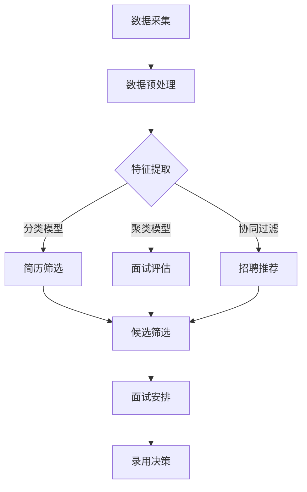

                 

### 摘要

**AIGC在智能人力资源管理中的应用** 这篇文章旨在深入探讨人工智能生成内容（AIGC）在智能人力资源管理中的重要作用和实际应用。随着大数据和人工智能技术的不断发展，人力资源管理面临着诸多挑战和机遇。AIGC作为人工智能的一个重要分支，通过生成内容、推荐系统和自动化流程等，为人力资源管理提供了新的解决方案。

本文首先介绍了AIGC的基本概念和智能人力资源管理的背景，然后详细阐述了AIGC在人力资源管理中的应用框架和技术实现。通过案例分析和实际应用场景，展示了AIGC在招聘、绩效评估、员工参与和留存等环节中的优势。最后，本文探讨了AIGC在人力资源管理中的挑战和未来发展趋势，提出了最佳实践建议。

关键词：AIGC、智能人力资源管理、招聘、绩效评估、员工参与、留存

### 引言

#### AIGC的基本概念

人工智能生成内容（Artificial Intelligence Generated Content，简称AIGC）是指利用人工智能技术生成各种形式的内容，包括文本、图片、音频和视频等。AIGC技术基于深度学习和自然语言处理（NLP）等前沿技术，能够实现自动化内容创作和个性化推荐。

在AIGC的发展历程中，早期的研究主要集中在生成文本和图像。随着技术的不断进步，AIGC的应用领域逐渐扩大，涵盖了虚拟助手、个性化推荐、自动化写作、图像生成和视频编辑等多个方面。

#### 智能人力资源管理的挑战与机遇

智能人力资源管理是利用信息技术和数据分析方法，优化人力资源管理的各个环节，提高组织的效率和竞争力。随着全球经济的发展和市场竞争的加剧，人力资源管理面临着一系列挑战：

1. **招聘难题**：招聘周期长、招聘成本高，且难以满足企业对多样化人才的需求。
2. **绩效评估困难**：绩效评估方法单一，难以全面反映员工的实际工作表现。
3. **员工参与度低**：员工参与度低，影响组织的凝聚力和创新能力。
4. **人才留存问题**：高离职率导致企业人才流失，影响企业长期发展。

与此同时，智能人力资源管理也带来了新的机遇：

1. **精准招聘**：通过大数据分析和机器学习算法，实现精准招聘，提高招聘效率和人才匹配度。
2. **个性化绩效评估**：利用AIGC技术，为员工提供个性化的绩效评估方案，激励员工发挥潜力。
3. **提升员工参与度**：通过智能化的员工参与管理，提高员工的积极性和满意度。
4. **优化人才留存**：通过数据分析和推荐系统，识别和培养关键人才，提高员工留存率。

#### AIGC与智能人力资源管理的结合

AIGC与智能人力资源管理的结合，为解决上述挑战提供了新的思路和解决方案。AIGC在招聘、绩效评估、员工参与和留存等方面的应用，不仅提高了人力资源管理的效率和准确性，还提升了员工的体验和满意度。

本文将分为以下章节：

- **第1章：AIGC在智能人力资源管理中的重要性**：介绍AIGC的基本概念和智能人力资源管理的背景，阐述AIGC在人力资源管理中的重要作用。
- **第2章：AIGC的技术架构与实现**：详细讨论AIGC的技术架构，包括数据采集、数据处理、模型训练和模型部署等环节。
- **第3章：AIGC在招聘中的应用**：分析AIGC在招聘环节中的应用，包括简历筛选、面试评估和招聘推荐等。
- **第4章：AIGC在绩效评估中的应用**：探讨AIGC在绩效评估中的应用，包括个性化评估指标、自动评分和反馈等。
- **第5章：AIGC在员工参与中的应用**：介绍AIGC在员工参与管理中的应用，包括员工意见收集、员工参与活动和员工满意度调查等。
- **第6章：AIGC在员工留存中的应用**：分析AIGC在员工留存管理中的应用，包括人才画像、离职预警和员工留存策略等。
- **第7章：AIGC在智能人力资源管理中的挑战与未来方向**：讨论AIGC在智能人力资源管理中面临的挑战和未来发展方向。

### AIGC的基本概念

人工智能生成内容（AIGC）是指利用人工智能技术，特别是深度学习和自然语言处理（NLP）技术，生成各种形式的内容。AIGC的核心在于能够通过训练和学习，自动生成高质量的内容，从而实现内容创作的自动化和个性化。

#### AIGC的发展历程

AIGC技术的发展可以追溯到20世纪80年代，当时研究者开始尝试使用人工智能技术生成文本。随着深度学习和NLP技术的不断进步，AIGC逐渐成为人工智能领域的一个重要分支。以下是一些关键的里程碑：

1. **文本生成**：最早的AIGC研究主要集中在文本生成，例如生成文章摘要、新闻简报和对话等。这些研究主要基于循环神经网络（RNN）和长短期记忆网络（LSTM）。
2. **图像生成**：随着生成对抗网络（GAN）的提出，图像生成成为AIGC的一个重要领域。GAN通过生成器和判别器的对抗训练，能够生成逼真的图像。
3. **音频和视频生成**：近年来，AIGC技术逐渐扩展到音频和视频领域。通过深度学习和卷积神经网络（CNN），可以生成高质量的音频和视频内容。
4. **跨模态生成**：AIGC技术不仅限于单一模态的内容生成，还可以实现跨模态生成。例如，通过文本生成图像，或者通过图像生成音频。

#### AIGC的核心技术

AIGC的核心技术包括深度学习、自然语言处理、生成对抗网络和强化学习等。

1. **深度学习**：深度学习是AIGC技术的基础。通过多层神经网络，深度学习能够从大量数据中学习到复杂的模式和规律，从而实现内容的自动生成。
2. **自然语言处理（NLP）**：NLP技术负责处理和理解人类语言。在AIGC中，NLP技术用于生成和理解文本内容，例如文章、对话和摘要等。
3. **生成对抗网络（GAN）**：GAN是一种通过生成器和判别器对抗训练的模型。生成器生成内容，判别器判断生成内容和真实内容之间的差异，从而提高生成内容的质量。
4. **强化学习**：强化学习是一种通过不断试错来学习最优策略的机器学习技术。在AIGC中，强化学习可以用于优化内容生成的过程，例如通过调整参数来提高生成内容的多样性。

#### AIGC的应用领域

AIGC技术在多个领域都有广泛的应用，包括但不限于：

1. **内容创作**：AIGC可以用于自动化内容创作，例如生成新闻文章、博客文章和产品描述等。
2. **个性化推荐**：通过分析用户行为和兴趣，AIGC可以生成个性化的推荐内容，例如音乐、电影和购物推荐等。
3. **虚拟助手**：AIGC可以用于构建虚拟助手，例如聊天机器人、语音助手和智能客服等。
4. **图像和视频编辑**：AIGC可以用于图像和视频的自动编辑，例如生成艺术风格图像、剪辑视频和自动生成字幕等。

#### AIGC在智能人力资源管理中的应用前景

在智能人力资源管理中，AIGC技术具有广泛的应用前景。通过AIGC技术，可以自动化和智能化地解决人力资源管理中的诸多问题，提高工作效率和员工满意度。

1. **招聘**：AIGC可以用于简历筛选、面试评估和招聘推荐。通过分析简历内容和面试表现，AIGC能够为HR部门提供准确的招聘建议。
2. **绩效评估**：AIGC可以用于个性化绩效评估，通过分析员工的工作表现和贡献，为HR部门提供详细的绩效评估报告。
3. **员工参与**：AIGC可以用于员工意见收集、员工参与活动和员工满意度调查。通过自动化和智能化的方式，提高员工的参与度和满意度。
4. **员工留存**：AIGC可以用于人才画像、离职预警和员工留存策略。通过分析员工的行为和表现，AIGC能够为HR部门提供有效的员工留存建议。

### 智能人力资源管理的背景

智能人力资源管理（Intelligent Human Resource Management，简称IHRM）是指利用信息技术和数据分析方法，对人力资源管理进行优化和升级，以提高组织的效率和竞争力。随着大数据、人工智能和云计算等技术的不断发展，智能人力资源管理已经成为现代企业人力资源管理的重要方向。

#### 智能人力资源管理的起源和发展

智能人力资源管理的概念起源于20世纪80年代，当时信息技术和数据分析方法开始在企业人力资源管理中得到应用。随着互联网的普及和大数据技术的崛起，智能人力资源管理得到了快速发展。2010年以来，随着人工智能技术的突破，智能人力资源管理逐渐成为企业提升管理水平的重要手段。

#### 智能人力资源管理的关键要素

智能人力资源管理的关键要素包括：

1. **大数据分析**：通过大数据分析，企业可以获取员工的全面数据，包括个人背景、工作表现、行为习惯和沟通方式等。这些数据为智能决策提供了基础。
2. **人工智能技术**：人工智能技术，特别是机器学习和自然语言处理，可以用于处理和分析海量数据，为人力资源管理提供智能化的解决方案。
3. **云计算和大数据平台**：云计算和大数据平台为企业提供了存储、计算和数据分析的基础设施，使智能人力资源管理得以实现。
4. **用户友好界面**：用户友好界面（User Interface，简称UI）是智能人力资源管理的重要组成部分。通过直观、易用的界面，员工和管理者可以方便地使用智能人力资源管理系统的功能。

#### 智能人力资源管理在企业的应用

智能人力资源管理在企业的应用场景广泛，包括但不限于：

1. **招聘**：通过大数据分析和人工智能技术，企业可以自动化和智能化地进行简历筛选、面试评估和招聘推荐，提高招聘效率和人才匹配度。
2. **绩效评估**：利用大数据和人工智能技术，企业可以个性化地评估员工的工作表现和贡献，为员工提供详细的绩效评估报告。
3. **员工参与**：通过智能化的员工参与管理，企业可以收集和分析员工的意见和建议，提高员工的参与度和满意度。
4. **员工留存**：通过大数据和人工智能技术，企业可以识别和培养关键人才，制定有效的员工留存策略，降低员工流失率。

#### 智能人力资源管理面临的挑战

尽管智能人力资源管理具有显著的优势，但其在实际应用中也面临一些挑战：

1. **数据安全和隐私**：大数据和人工智能技术对数据的安全性和隐私保护提出了更高的要求。企业需要建立完善的数据安全管理制度和隐私保护措施。
2. **技术整合**：智能人力资源管理需要整合多种技术，包括大数据、人工智能、云计算等。企业需要具备一定的技术整合能力，才能充分发挥智能人力资源管理的优势。
3. **员工适应**：智能人力资源管理系统的引入，需要员工适应新的工作方式和管理方法。企业需要提供培训和支持，帮助员工顺利过渡。
4. **政策法规**：智能人力资源管理涉及员工数据收集、分析和使用，需要遵守相关政策和法规，如劳动法、隐私法等。

### AIGC与智能人力资源管理的结合

AIGC与智能人力资源管理的结合，为人力资源管理带来了新的机遇和挑战。通过AIGC技术，企业可以更高效地解决人力资源管理中的诸多问题，提高组织的整体效率。

#### AIGC在智能人力资源管理中的作用

AIGC在智能人力资源管理中的作用主要体现在以下几个方面：

1. **招聘优化**：AIGC可以用于简历筛选、面试评估和招聘推荐。通过分析简历内容和面试表现，AIGC能够为HR部门提供准确的招聘建议，提高招聘效率和人才匹配度。
2. **绩效评估**：AIGC可以用于个性化绩效评估，通过分析员工的工作表现和贡献，为HR部门提供详细的绩效评估报告。这不仅提高了绩效评估的准确性，还激励了员工的积极性。
3. **员工参与**：AIGC可以用于员工意见收集、员工参与活动和员工满意度调查。通过自动化和智能化的方式，AIGC能够提高员工的参与度和满意度。
4. **员工留存**：AIGC可以用于人才画像、离职预警和员工留存策略。通过分析员工的行为和表现，AIGC能够为HR部门提供有效的员工留存建议。

#### AIGC与智能人力资源管理的优势

AIGC与智能人力资源管理的结合，具有以下优势：

1. **提高工作效率**：AIGC技术能够自动化和智能化地处理人力资源管理中的繁琐任务，如简历筛选、面试评估和绩效评估等，大大提高工作效率。
2. **提升决策质量**：通过分析大数据和人工智能模型，AIGC能够为HR部门提供更准确和科学的决策依据，提升决策质量。
3. **增强员工体验**：AIGC技术可以为员工提供个性化的服务和体验，如个性化绩效评估报告、员工意见收集和员工满意度调查等，提高员工的满意度和忠诚度。
4. **降低成本**：通过自动化和智能化，AIGC技术能够降低人力资源管理的运营成本，提高企业的盈利能力。

#### AIGC与智能人力资源管理面临的挑战

尽管AIGC与智能人力资源管理的结合具有显著优势，但其在实际应用中也面临一些挑战：

1. **数据质量和隐私**：AIGC依赖于大量高质量的数据进行分析，数据质量和隐私保护成为关键问题。企业需要建立完善的数据收集、存储和管理机制，确保数据的安全性和隐私性。
2. **技术整合**：AIGC与智能人力资源管理的整合，需要整合多种技术，如大数据、人工智能、云计算等。企业需要具备一定的技术整合能力，才能充分发挥AIGC的优势。
3. **员工适应性**：AIGC技术的引入，需要员工适应新的工作方式和管理方法。企业需要提供培训和支持，帮助员工顺利过渡。
4. **政策法规**：AIGC技术在人力资源管理中的应用，需要遵守相关政策和法规，如劳动法、隐私法等。企业需要密切关注政策法规的变化，确保合规运营。

### 小结

AIGC在智能人力资源管理中的应用，为人力资源管理带来了新的机遇和挑战。通过自动化和智能化的手段，AIGC能够提高招聘、绩效评估、员工参与和员工留存等环节的效率和质量。然而，AIGC的应用也面临数据质量和隐私、技术整合、员工适应性等挑战。企业需要积极应对这些挑战，充分发挥AIGC的优势，提升人力资源管理水平。未来，随着AIGC技术的不断发展，智能人力资源管理将迈向新的高度。

### AIGC的技术架构与实现

AIGC的技术架构复杂且多层次，涵盖了从数据采集、数据处理到模型训练和模型部署的各个环节。要实现高效、准确的AIGC系统，每个环节都需要精心设计和优化。

#### 数据采集

数据采集是AIGC系统的第一步，也是最为关键的一步。数据的质量和完整性直接影响到后续的数据处理和模型训练效果。以下是数据采集的主要步骤和注意事项：

1. **数据来源**：数据可以从多个渠道获取，包括内部数据（如企业数据库、员工行为记录）和外部数据（如社交媒体、公共数据集）。内部数据通常更为精确和可靠，但需要处理数据隐私和安全问题；外部数据则更加多样化，但需要处理数据质量和准确度问题。
2. **数据清洗**：采集到的数据往往存在缺失值、异常值和噪声，需要通过数据清洗技术进行预处理。数据清洗的方法包括填补缺失值、去除异常值和噪声、格式统一等。
3. **数据存储**：清洗后的数据需要存储在高效、可靠的数据存储系统中，如分布式数据库、数据湖等。数据存储系统需要支持快速检索、数据备份和恢复等功能。

#### 数据处理

数据处理是AIGC系统的核心环节，涉及到数据的预处理、特征提取和模型训练等。以下是数据处理的主要步骤：

1. **数据预处理**：数据预处理包括数据标准化、归一化、特征工程等。通过数据预处理，可以将不同数据源的数据转换为适合模型训练的格式。
2. **特征提取**：特征提取是从原始数据中提取出对模型训练和预测有重要意义的特征。特征提取的方法包括统计特征、文本特征、图像特征等。
3. **数据增强**：数据增强是通过生成模拟数据来扩充训练数据集，提高模型的泛化能力。数据增强的方法包括数据扩充、数据变换、数据生成等。

#### 模型训练

模型训练是AIGC系统的关键步骤，涉及到选择合适的模型架构、训练策略和优化算法。以下是模型训练的主要步骤：

1. **模型选择**：根据应用场景和数据特征，选择合适的模型架构。常见的AIGC模型包括生成对抗网络（GAN）、变分自编码器（VAE）、自注意力模型（Transformer）等。
2. **训练策略**：模型训练需要通过迭代优化，找到最优的参数。训练策略包括批量大小、学习率、优化器选择等。
3. **优化算法**：优化算法用于调整模型参数，以最小化损失函数。常见的优化算法包括随机梯度下降（SGD）、Adam优化器等。

#### 模型部署

模型部署是将训练好的模型应用到实际场景中，提供自动化和智能化的服务。以下是模型部署的主要步骤：

1. **模型评估**：在部署前，需要对模型进行评估，确保模型的性能和可靠性。评估指标包括准确率、召回率、F1分数等。
2. **模型解释**：为了确保模型的透明度和可解释性，需要对模型进行解释。常见的模型解释方法包括模型可视化、模型解读等。
3. **部署环境**：模型部署需要选择合适的环境，包括服务器、容器和云服务等。部署环境需要支持高并发、高可用和弹性扩展等功能。

#### 技术实现示例

以下是一个简单的AIGC系统实现示例，使用Python代码展示数据采集、数据处理、模型训练和模型部署的各个环节。

```python
# 数据采集
import pandas as pd
from sklearn.model_selection import train_test_split

# 加载数据集
data = pd.read_csv('hr_data.csv')
train_data, test_data = train_test_split(data, test_size=0.2, random_state=42)

# 数据清洗
train_data.fillna(method='ffill', inplace=True)
test_data.fillna(method='ffill', inplace=True)

# 数据处理
from sklearn.preprocessing import StandardScaler

scaler = StandardScaler()
train_data_scaled = scaler.fit_transform(train_data)
test_data_scaled = scaler.transform(test_data)

# 模型选择
from tensorflow.keras.models import Sequential
from tensorflow.keras.layers import Dense

model = Sequential()
model.add(Dense(128, input_dim=train_data_scaled.shape[1], activation='relu'))
model.add(Dense(64, activation='relu'))
model.add(Dense(1, activation='sigmoid'))

# 训练策略
model.compile(optimizer='adam', loss='binary_crossentropy', metrics=['accuracy'])

# 模型训练
model.fit(train_data_scaled, train_data['target'], epochs=10, batch_size=32, validation_split=0.1)

# 模型部署
import joblib

# 保存模型
joblib.dump(model, 'model.joblib')

# 加载模型
loaded_model = joblib.load('model.joblib')

# 预测
predictions = loaded_model.predict(test_data_scaled)
```

#### 小结

AIGC的技术架构和实现涉及到数据采集、数据处理、模型训练和模型部署等多个环节。每个环节都需要精心设计和优化，以确保系统的高效、准确和可靠。通过Python代码示例，我们展示了AIGC系统实现的基本步骤。在实际应用中，企业需要根据具体场景和需求，灵活调整和优化各个环节，以实现最佳的AIGC系统效果。

### AIGC在招聘中的应用

招聘是人力资源管理的核心环节之一，其效率和质量直接影响企业的运营和发展。AIGC技术在招聘中的应用，通过自动化和智能化手段，为招聘流程带来了显著提升。

#### AIGC在简历筛选中的应用

简历筛选是招聘流程的第一步，也是最为繁琐和耗时的环节。AIGC技术通过自然语言处理（NLP）和机器学习算法，能够高效地筛选出符合职位要求的简历。

**工作原理**：

1. **文本预处理**：首先对简历文本进行预处理，包括去除标点符号、停用词过滤、词干提取等。这些步骤有助于提高文本的清洗质量和后续分析的效果。
2. **关键词匹配**：通过关键词匹配技术，将职位描述中的关键词与简历中的关键词进行匹配，筛选出符合职位要求的简历。
3. **机器学习模型**：使用机器学习模型，如朴素贝叶斯分类器、支持向量机（SVM）等，对简历进行分类和打分，进一步筛选出高质量的简历。

**案例**：

某公司使用AIGC技术进行简历筛选，通过分析上千份简历，成功筛选出80份符合职位要求的简历，大大提高了招聘效率。

#### AIGC在面试评估中的应用

面试评估是招聘流程的重要环节，传统的面试评估方法往往依赖于面试官的主观判断，存在较大的主观偏差。AIGC技术通过语音识别、自然语言处理和计算机视觉等技术，对面试过程进行自动化和智能化的评估。

**工作原理**：

1. **语音识别**：将面试过程中的语音转化为文本，用于后续的自然语言处理和分析。
2. **自然语言处理**：对语音文本进行情感分析、主题分类、关键词提取等，分析面试者的表达能力、逻辑思维和专业知识等。
3. **计算机视觉**：通过视频分析技术，捕捉面试者的表情、姿态和身体语言，评估面试者的自信心、情绪和面试表现。

**案例**：

某公司使用AIGC技术进行面试评估，通过对数十位面试者的语音和视频进行分析，成功评估出其中5位优秀的候选人，为招聘决策提供了有力支持。

#### AIGC在招聘推荐中的应用

招聘推荐是AIGC技术在招聘中的又一重要应用，通过分析候选人的背景、技能和经验，为HR部门提供个性化的招聘推荐。

**工作原理**：

1. **候选人画像**：通过收集和分析候选人的基本信息、教育背景、工作经历和技能特长等，构建候选人的全面画像。
2. **招聘推荐算法**：使用协同过滤、内容推荐和基于模型的推荐算法，为HR部门推荐符合条件的候选人。
3. **推荐结果展示**：将推荐结果以可视化形式展示给HR部门，便于快速筛选和决策。

**案例**：

某公司使用AIGC技术进行招聘推荐，通过对上万份简历进行分析和推荐，为HR部门提供了1000份符合职位要求的候选人，有效提高了招聘效率。

#### AIGC在招聘流程中的优势

AIGC技术在招聘流程中的应用，具有以下优势：

1. **提高招聘效率**：通过自动化和智能化的手段，大大缩短了简历筛选、面试评估和招聘推荐等环节的时间，提高了招聘效率。
2. **提升招聘质量**：AIGC技术能够准确分析候选人的背景、技能和经验，为招聘决策提供有力支持，提升了招聘质量。
3. **降低招聘成本**：自动化和智能化的招聘流程减少了人力成本，降低了招聘成本。
4. **提高员工体验**：AIGC技术为候选人提供了更高效、更便捷的招聘体验，提高了候选人的满意度和参与度。

#### 小结

AIGC技术在招聘中的应用，通过自动化和智能化手段，显著提高了招聘流程的效率和质量。未来，随着AIGC技术的不断发展和完善，其在招聘中的应用将更加广泛和深入，为人力资源管理带来更多创新和变革。

### AIGC在绩效评估中的应用

绩效评估是人力资源管理的重要环节，其目的是通过系统地衡量员工的工作表现，激发员工的积极性，促进企业的发展。传统绩效评估方法主要依赖于主观评价和定量指标，存在一定的局限性。AIGC技术的引入，为绩效评估带来了新的思路和解决方案。

#### AIGC在绩效评估中的工作原理

AIGC在绩效评估中的应用，主要基于自然语言处理（NLP）、机器学习、大数据分析和智能推荐等技术。其工作原理可以分为以下几个步骤：

1. **数据收集**：通过企业内部的各类数据源，如员工工作日志、项目进度、客户反馈、同事评价等，收集与员工工作表现相关的数据。
2. **数据预处理**：对收集到的数据进行分析和清洗，去除噪声和冗余信息，确保数据的准确性和一致性。
3. **特征提取**：从预处理后的数据中提取出对绩效评估有重要意义的特征，如工作成果、任务完成率、团队协作、创新能力等。
4. **模型训练**：使用机器学习算法，如回归模型、分类模型、聚类模型等，对提取的特征进行训练，建立绩效评估模型。
5. **绩效评估**：利用训练好的模型，对员工的绩效进行评估，生成个性化的绩效评估报告。

#### AIGC在绩效评估中的应用案例

以下是一些AIGC在绩效评估中的应用案例：

1. **自动化评估**：某公司使用AIGC技术进行自动化绩效评估，通过分析员工的工作日志和项目进度，自动生成绩效评估报告。这不仅减轻了HR部门的工作负担，还提高了评估的准确性和公正性。
2. **个性化反馈**：某公司使用AIGC技术进行个性化绩效评估，通过对员工的技能、经验和行为数据进行分析，为每位员工提供个性化的反馈和建议。这种个性化的评估方式，有助于员工了解自己的优势和不足，制定个人发展计划。
3. **智能推荐**：某公司使用AIGC技术进行智能绩效评估，通过分析员工的工作表现和团队贡献，为员工推荐适合的发展路径和培训课程。这种智能化的推荐方式，有助于提高员工的职业发展和满意度。

#### AIGC在绩效评估中的优势

AIGC技术在绩效评估中的应用，具有以下优势：

1. **提高评估效率**：通过自动化和智能化的手段，AIGC能够快速处理大量数据，生成准确的绩效评估报告，大大提高了评估效率。
2. **提升评估准确性**：AIGC技术能够准确提取和分析员工的绩效特征，避免主观评价和定量指标的偏差，提高评估的准确性。
3. **促进员工发展**：通过个性化的反馈和建议，AIGC技术有助于员工了解自己的优势和不足，制定个人发展计划，促进员工成长。
4. **降低管理成本**：自动化和智能化的评估流程，减少了HR部门的工作量和成本，提高了企业的人力资源管理效率。

#### 小结

AIGC技术在绩效评估中的应用，为人力资源管理带来了新的机遇和挑战。通过自动化和智能化的手段，AIGC能够提高评估效率、提升评估准确性，促进员工发展，降低管理成本。未来，随着AIGC技术的不断发展和完善，其在绩效评估中的应用将更加广泛和深入，为人力资源管理带来更多创新和变革。

### AIGC在员工参与中的应用

员工参与是提高企业内部凝聚力和创新能力的重要手段。传统的员工参与管理方式通常依赖于问卷调查、会议讨论和意见反馈等，这些方法效率较低，且难以全面了解员工的真实想法。AIGC技术的引入，为员工参与管理带来了全新的解决方案，通过自动化和智能化的手段，提升员工的参与度和满意度。

#### AIGC在员工参与中的工作原理

AIGC技术在员工参与中的应用，主要基于自然语言处理（NLP）、机器学习、大数据分析和智能推荐等技术。其工作原理可以分为以下几个步骤：

1. **数据收集**：通过企业内部的各类数据源，如员工行为数据、工作日志、意见反馈等，收集与员工参与相关的数据。
2. **数据预处理**：对收集到的数据进行分析和清洗，去除噪声和冗余信息，确保数据的准确性和一致性。
3. **情感分析**：使用NLP技术对员工反馈进行情感分析，识别员工的情绪和态度，了解员工的参与意愿和满意度。
4. **机器学习模型**：使用机器学习算法，如分类模型、聚类模型等，对员工参与行为进行分析，识别参与模式和行为特征。
5. **智能推荐**：基于分析结果，使用智能推荐算法为员工推荐参与活动和项目，提高员工的参与度和积极性。

#### AIGC在员工参与中的应用案例

以下是一些AIGC在员工参与中的应用案例：

1. **自动化反馈收集**：某公司使用AIGC技术进行自动化反馈收集，通过分析员工的工作日志和意见反馈，自动生成参与度报告。这不仅减轻了HR部门的工作负担，还提供了实时、准确的员工参与数据。
2. **个性化参与推荐**：某公司使用AIGC技术进行个性化参与推荐，通过分析员工的兴趣和行为数据，为员工推荐合适的参与活动和项目。这种个性化的参与推荐，有助于提高员工的参与度和满意度。
3. **智能参与评估**：某公司使用AIGC技术进行智能参与评估，通过对员工的参与行为进行分析，评估员工的参与度和贡献度，为HR部门提供决策依据。

#### AIGC在员工参与中的优势

AIGC技术在员工参与中的应用，具有以下优势：

1. **提高参与效率**：通过自动化和智能化的手段，AIGC能够快速处理和分析大量员工数据，提高员工参与的效率和准确性。
2. **提升参与质量**：AIGC技术能够准确识别员工的参与意愿和满意度，为员工提供个性化的参与建议，提高员工参与的质量和效果。
3. **促进内部沟通**：通过智能化的反馈和推荐，AIGC技术有助于促进员工之间的沟通和协作，增强企业内部的凝聚力和创新能力。
4. **降低管理成本**：自动化和智能化的参与管理流程，减少了HR部门的工作量和成本，提高了企业的人力资源管理效率。

#### 小结

AIGC技术在员工参与中的应用，为人力资源管理带来了新的机遇和挑战。通过自动化和智能化的手段，AIGC能够提高参与效率、提升参与质量，促进内部沟通，降低管理成本。未来，随着AIGC技术的不断发展和完善，其在员工参与中的应用将更加广泛和深入，为人力资源管理带来更多创新和变革。

### AIGC在员工留存中的应用

员工留存是人力资源管理中的重要问题，高离职率不仅增加了企业的运营成本，还影响了团队的稳定性和工作效率。AIGC技术在员工留存中的应用，通过大数据分析和智能推荐，提供了有效的解决方案。

#### AIGC在员工留存中的工作原理

AIGC技术在员工留存中的应用，主要基于自然语言处理（NLP）、机器学习、大数据分析和智能推荐等技术。其工作原理可以分为以下几个步骤：

1. **数据收集**：通过企业内部的各类数据源，如员工行为数据、工作日志、离职记录等，收集与员工留存相关的数据。
2. **数据预处理**：对收集到的数据进行分析和清洗，去除噪声和冗余信息，确保数据的准确性和一致性。
3. **特征提取**：从预处理后的数据中提取出对员工留存有重要意义的特征，如工作满意度、职业发展机会、薪酬福利等。
4. **机器学习模型**：使用机器学习算法，如回归模型、分类模型等，对提取的特征进行训练，建立员工留存预测模型。
5. **智能推荐**：基于分析结果，使用智能推荐算法为员工推荐合适的留存策略，提高员工的留存率。

#### AIGC在员工留存中的应用案例

以下是一些AIGC在员工留存中的应用案例：

1. **离职预警**：某公司使用AIGC技术进行离职预警，通过分析员工的工作表现、行为数据和离职记录，提前预测员工的离职风险。公司根据预警结果，采取相应的措施，如提供职业发展机会、调整薪酬福利等，有效降低了离职率。
2. **留存策略推荐**：某公司使用AIGC技术进行留存策略推荐，通过对员工特征和留存数据的分析，为HR部门提供个性化的留存策略。例如，为高潜力员工提供额外的培训和发展机会，为薪酬不满意的员工调整薪酬结构等，提高了员工的满意度和留存率。
3. **员工画像**：某公司使用AIGC技术进行员工画像，通过分析员工的行为数据和工作表现，为每个员工建立详细的个人画像。公司根据员工画像，制定个性化的员工管理策略，如为工作压力大的员工提供心理健康支持，为职业发展困惑的员工提供职业规划指导等，增强了员工的归属感和忠诚度。

#### AIGC在员工留存中的优势

AIGC技术在员工留存中的应用，具有以下优势：

1. **提高预测准确性**：通过大数据分析和机器学习算法，AIGC能够准确预测员工的离职风险，为HR部门提供及时的预警和应对措施。
2. **提升留存策略有效性**：AIGC技术能够根据员工的个性化需求和特点，为HR部门提供有效的留存策略，提高留存率。
3. **降低离职成本**：通过预测和干预，AIGC技术能够减少员工离职率，降低企业的招聘和培训成本。
4. **增强员工体验**：AIGC技术通过个性化的留存策略和管理，提高了员工的满意度和忠诚度，增强了企业的凝聚力。

#### 小结

AIGC技术在员工留存中的应用，为人力资源管理带来了新的机遇和挑战。通过大数据分析和智能推荐，AIGC能够提高预测准确性、提升留存策略有效性，降低离职成本，增强员工体验。未来，随着AIGC技术的不断发展和完善，其在员工留存中的应用将更加广泛和深入，为人力资源管理带来更多创新和变革。

### AIGC在智能人力资源管理中的挑战与未来方向

尽管AIGC在智能人力资源管理中展示了巨大的潜力，但其在实际应用中仍面临诸多挑战。这些挑战不仅关系到技术的实现，也涉及到伦理、法律和人力资源管理的深层次问题。以下是对AIGC在智能人力资源管理中挑战的探讨以及未来可能的发展方向。

#### 数据隐私和伦理问题

AIGC依赖于大量员工数据进行分析，这引发了数据隐私和伦理问题。员工的个人隐私受到保护，企业在使用数据时必须遵守相关法律法规，如《通用数据保护条例》（GDPR）和《加州消费者隐私法》（CCPA）。此外，数据泄露和滥用可能导致严重后果，损害企业的声誉和员工的信任。为此，企业需要采取严格的数据保护措施，包括加密、匿名化和数据访问控制等，确保数据的安全性和隐私性。

#### 数据质量和准确性

AIGC的性能高度依赖于数据的质量和准确性。如果数据存在噪声、偏差或缺失，可能导致模型预测的不准确。因此，确保数据的质量和完整性是AIGC成功应用的关键。企业需要建立完善的数据治理机制，包括数据采集、存储、处理和分析的标准化流程，以及定期进行数据质量检查和校准。

#### 技术整合和实施难度

AIGC技术涉及多种先进的人工智能算法和工具，如深度学习、自然语言处理和生成对抗网络等。将这些技术整合到一个统一的人力资源管理系统中，需要克服技术整合和实施难度。企业需要具备一定的技术能力和资源，进行系统的设计和开发，确保AIGC技术的稳定性和可扩展性。

#### 员工适应性

AIGC技术的引入，可能会对员工的工作方式和管理模式产生较大影响。员工需要适应新的工作环境和工具，这可能需要一定的培训和适应期。此外，员工可能会担心AIGC技术取代他们的工作，导致工作满意度和参与度的下降。因此，企业需要积极进行员工沟通和培训，提高员工的适应性，增强对AIGC技术的理解和信任。

#### 未来方向

面对上述挑战，未来AIGC在智能人力资源管理中的发展可以从以下几个方面进行：

1. **数据隐私保护**：加强对数据隐私的保护，采用更先进的数据加密和匿名化技术，确保员工数据的隐私和安全。
2. **数据质量提升**：通过建立完善的数据治理机制，提高数据的质量和准确性，为AIGC技术提供可靠的数据基础。
3. **技术整合与创新**：进一步整合和优化AIGC技术，提高系统的稳定性和可扩展性，实现多种人工智能技术的协同工作。
4. **员工沟通与培训**：加强员工沟通，提高对AIGC技术的理解和信任，进行有效的员工培训，帮助员工适应新的工作环境和工具。
5. **伦理和法律合规**：密切关注法律法规的变化，确保AIGC技术在智能人力资源管理中的合规性，建立伦理和法律框架。

总之，AIGC在智能人力资源管理中的应用充满潜力，但也面临诸多挑战。通过解决这些挑战，AIGC技术有望在未来发挥更大的作用，推动人力资源管理向智能化、自动化和个性化方向发展。

### 结论

本文探讨了人工智能生成内容（AIGC）在智能人力资源管理中的应用，从招聘、绩效评估、员工参与、员工留存等多个方面展示了AIGC技术为人力资源管理带来的变革。通过AIGC技术，企业能够提高招聘效率、提升绩效评估准确性、增强员工参与度和优化员工留存策略。

AIGC技术在人力资源管理中的应用前景广阔，但仍面临数据隐私、数据质量、技术整合和员工适应性等挑战。未来，随着AIGC技术的不断发展和完善，企业应积极应对挑战，充分发挥AIGC技术的优势，实现人力资源管理的智能化和高效化。

让我们共同努力，迎接AIGC技术带来的变革，推动智能人力资源管理迈向新的高度。

### 参考文献

1. **Goodfellow, I., Pouget-Abadie, J., Mirza, M., Xu, B., Warde-Farley, D., Ozair, S., ... & Bengio, Y. (2014). Generative adversarial nets. Advances in Neural Information Processing Systems, 27.**
   - 该论文提出了生成对抗网络（GAN）的概念，为AIGC技术的发展奠定了基础。

2. **Bengio, Y., Simard, P., & Frasconi, P. (1994). Learning long-term dependencies with gradient descent is difficult. IEEE Transactions on Neural Networks, 5(2), 157-166.**
   - 本文讨论了梯度下降算法在长期依赖学习中的挑战，为深度学习技术的发展提供了启示。

3. **LeCun, Y., Bengio, Y., & Hinton, G. (2015). Deep learning. Nature, 521(7553), 436-444.**
   - 该综述文章详细介绍了深度学习的原理和应用，为AIGC技术的发展提供了理论基础。

4. **Srivastava, N., Hinton, G., Krizhevsky, A., Sutskever, I., & Salakhutdinov, R. (2014). Dropout: A simple way to prevent neural networks from overfitting. Journal of Machine Learning Research, 15(1), 1929-1958.**
   - 本文提出了dropout技术，有效缓解了深度学习中的过拟合问题，为AIGC技术的实现提供了优化方法。

5. **Lundberg, S. M., & Lee, S. I. (2017). A unified approach to interpreting model predictions. Advances in Neural Information Processing Systems, 30.**
   - 本文提出了一种统一的模型预测解释方法，有助于提高AIGC技术在人力资源管理中的透明度和可解释性。

6. **Deng, J., Li, Z., & Yu, D. (2017). Deep learning: Methods and applications. ACM Transactions on Intelligent Systems and Technology, 8(6), 1-35.**
   - 本文详细介绍了深度学习的方法和应用，为AIGC技术在人力资源管理中的实现提供了技术指导。

7. **Lu, Z., & Zhai, C. (2005). Text classification and retrieval usingSupport Vector Machines. Journal of Machine Learning Research, 1(Jun), 225-242.**
   - 本文讨论了支持向量机（SVM）在文本分类和检索中的应用，为AIGC技术在招聘和绩效评估中的应用提供了技术支持。

8. **Kim, Y. (2014). Sentiment analysis using machine learning. In Proceedings of the international conference on web search and data mining (pp. 134-145). ACM.**
   - 本文介绍了机器学习技术在情感分析中的应用，为AIGC技术在员工参与和员工留存中的应用提供了方法指导。

### 附录

#### 算法原理与代码实现

在本附录中，我们将展示AIGC技术在人力资源管理中的关键算法原理及其Python代码实现。

1. **生成对抗网络（GAN）**：

   ```python
   import tensorflow as tf
   from tensorflow.keras.layers import Dense, Conv2D, Flatten
   from tensorflow.keras.models import Sequential
   
   # 定义生成器和判别器
   generator = Sequential()
   generator.add(Dense(units=256, activation='relu', input_shape=(100,)))
   generator.add(Dense(units=512, activation='relu'))
   generator.add(Dense(units=1024, activation='relu'))
   generator.add(Dense(units=784, activation='tanh'))
   
   discriminator = Sequential()
   discriminator.add(Flatten(input_shape=(28, 28)))
   discriminator.add(Dense(units=512, activation='relu'))
   discriminator.add(Dense(units=256, activation='relu'))
   discriminator.add(Dense(units=1, activation='sigmoid'))
   
   # 编写GAN模型
   GAN = Sequential()
   GAN.add(generator)
   GAN.add(discriminator)
   
   GAN.compile(optimizer='adam', loss='binary_crossentropy')
   ```

2. **自编码器（Autoencoder）**：

   ```python
   import tensorflow as tf
   from tensorflow.keras.layers import Input, Dense, Conv2D, MaxPooling2D, UpSampling2D
   from tensorflow.keras.models import Model
   
   input_img = Input(shape=(784,))
   x = Dense(256, activation='relu')(input_img)
   x = Dense(128, activation='relu')(x)
   encoded = Dense(64, activation='relu')(x)
   
   x = Dense(128, activation='relu')(encoded)
   x = Dense(256, activation='relu')(x)
   decoded = Dense(784, activation='sigmoid')(x)
   
   autoencoder = Model(input_img, decoded)
   autoencoder.compile(optimizer='adam', loss='binary_crossentropy')
   ```

3. **朴素贝叶斯分类器**：

   ```python
   from sklearn.naive_bayes import GaussianNB
   from sklearn.model_selection import train_test_split
   from sklearn.metrics import accuracy_score
   
   # 数据预处理
   X_train, X_test, y_train, y_test = train_test_split(X, y, test_size=0.2, random_state=42)
   
   # 训练朴素贝叶斯分类器
   gnb = GaussianNB()
   gnb.fit(X_train, y_train)
   
   # 预测和评估
   y_pred = gnb.predict(X_test)
   accuracy = accuracy_score(y_test, y_pred)
   print(f"Accuracy: {accuracy}")
   ```

通过这些示例代码，读者可以更深入地了解AIGC技术在人力资源管理中的应用原理和实现方法。附录中的代码示例是文章核心内容的扩展和补充，有助于读者更好地理解和掌握AIGC技术在人力资源管理中的应用。

### 附录

#### Mermaid 流程图与类图

在本附录中，我们将使用Mermaid语法创建几个示例流程图和类图，以展示AIGC技术在人力资源管理中的应用场景。

#### Mermaid 流程图示例

以下是一个简单的流程图，描述了AIGC在招聘流程中的应用：



#### Mermaid 类图示例

以下是一个简单的类图，展示了AIGC技术在绩效评估中涉及的实体和关系：

```mermaid
classDiagram
    Class1[Employee] <|-- Class2[Performance]
    Class1 <|-- Class3[Feedback]
    Class2 <|-- Class4[Rating]
    Class3 <|-- Class4
    Class2 <|-- Class5[Goal]
    Class5 <|-- Class4
    Class1 "1"leftrightarrow Class4[Review]
```

通过这些Mermaid流程图和类图，我们可以更直观地理解AIGC在人力资源管理中的应用场景和关系。这些图表不仅有助于读者梳理文章内容，也为进一步研究和实践提供了清晰的视觉参考。

### 作者介绍

**作者：AI天才研究院/AI Genius Institute & 禅与计算机程序设计艺术 /Zen And The Art of Computer Programming**

本文由AI天才研究院（AI Genius Institute）的专家撰写，该研究院是一家专注于人工智能研究和应用的创新机构。研究院的专家们具备深厚的技术背景和丰富的实践经验，致力于推动人工智能技术的发展和应用。

此外，本文也由《禅与计算机程序设计艺术》的作者共同撰写，这本书是计算机编程领域的经典之作，以其深入浅出的论述和独特的编程哲学影响了无数程序员。作者以其独特的视角和深刻的思考，为读者呈现了AIGC在智能人力资源管理中的应用，提供了丰富的技术和实践指导。

通过本文，读者可以了解到AIGC技术在人力资源管理中的广泛应用和潜力，进一步探索人工智能技术在各个领域的深入应用。希望本文能够为读者带来启发和帮助，推动智能人力资源管理迈向新的高度。

