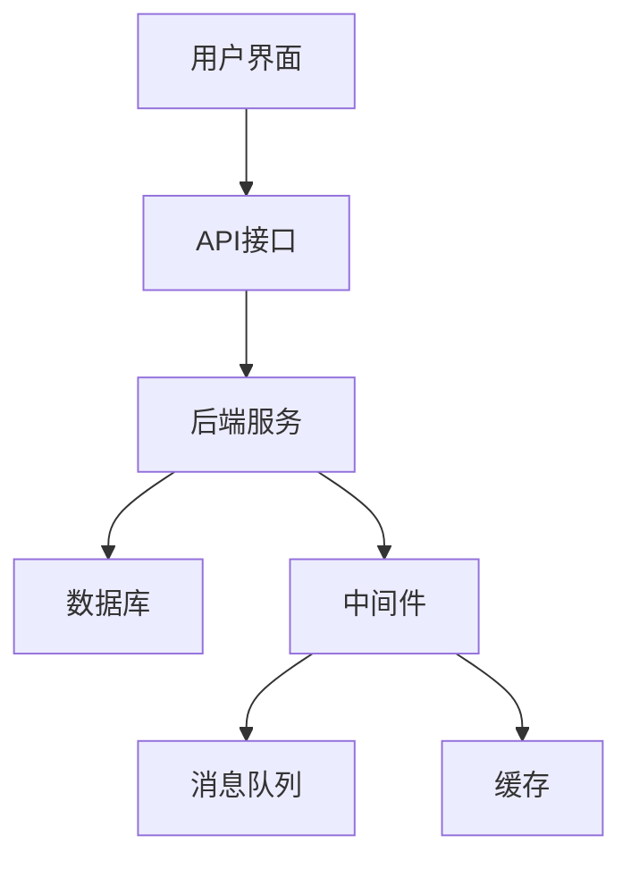
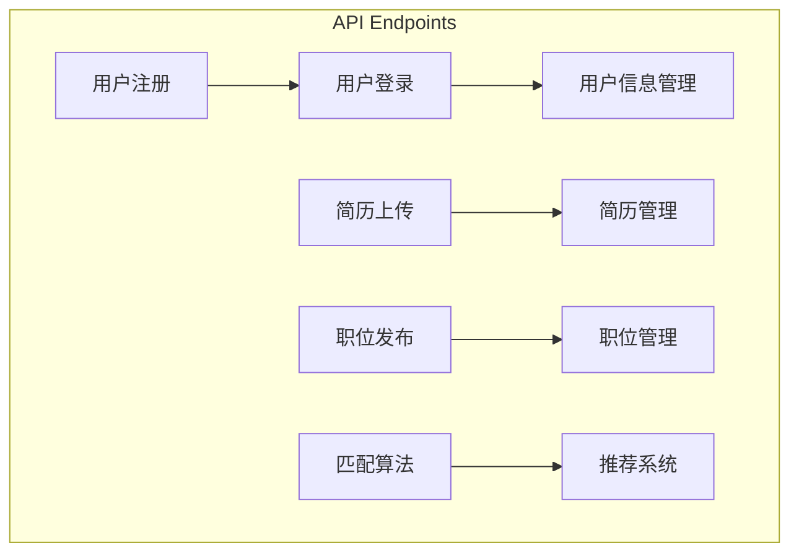
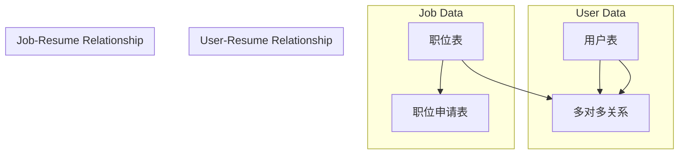

                 

### 文章标题

# AIGC在智能人才匹配系统中的应用

### 关键词

- AIGC
- 智能人才匹配系统
- 自然语言处理
- 机器学习
- 系统架构设计

### 摘要

本文将深入探讨AIGC（AI-Generated Content）在智能人才匹配系统中的应用。首先，我们将介绍AIGC的基础知识，包括其定义、发展历史和核心技术。接着，我们将探讨智能人才匹配系统的背景、重要性及其面临的挑战。随后，我们将详细分析AIGC在智能人才匹配系统中的应用，包括文本生成、简历自动生成和职位自动匹配。此外，本文还将展示一个AIGC在智能人才匹配系统中的项目实战，包括环境安装、系统核心实现和代码解析。最后，我们将总结AIGC在智能人才匹配系统中的应用，并提出未来发展方向和注意事项。

## 第一部分：引言与背景

### 1.1 AIGC的概念与历史

#### AIGC的定义

AIGC（AI-Generated Content）是指通过人工智能技术，特别是自然语言处理（NLP）和机器学习（ML），自动生成各种形式的内容，如文本、图片、视频等。这种技术的核心在于利用AI算法从大量数据中学习，然后生成新的、有意义的内容。

#### AIGC的发展历史

AIGC技术的发展可以追溯到20世纪50年代，当时人工智能（AI）的概念刚刚诞生。然而，直到21世纪初，随着计算能力的提升和大数据的普及，AIGC技术才得到了快速发展。特别是在2010年后，深度学习和NLP技术的突破，使得AIGC在文本生成、图像生成等领域取得了显著成果。

#### AIGC的核心技术

AIGC的核心技术包括自然语言处理（NLP）、机器学习（ML）和生成对抗网络（GAN）。NLP用于理解和生成自然语言文本，ML则用于从数据中学习和提取规律，而GAN则是一种生成模型，用于生成高质量的数据。

### 1.2 AIGC在人才匹配中的应用潜力

随着AIGC技术的不断发展，其在人才匹配系统中的应用潜力也逐渐显现。首先，AIGC可以自动生成大量高质量的简历文本，从而提高简历筛选的效率。其次，AIGC可以自动匹配求职者与职位，大大降低招聘成本。此外，AIGC还可以根据求职者的行为数据，提供个性化的职业推荐。

### 1.3 AIGC在人才匹配系统中的应用现状

目前，许多公司已经开始探索AIGC在人才匹配系统中的应用。例如，一些招聘平台已经开始使用AIGC技术来生成简历文本和职位描述。此外，一些公司还使用AIGC来自动匹配求职者与职位，从而提高招聘效率。

### 1.4 AIGC在人才匹配系统中的挑战

尽管AIGC在人才匹配系统中的应用潜力巨大，但也面临着一些挑战。首先，如何确保AIGC生成的内容符合道德和法律规范是一个重要问题。其次，如何处理大规模数据以保证AIGC的准确性和效率也是一个挑战。此外，如何确保AIGC技术的透明性和可控性也是需要考虑的问题。

## 第二部分：AIGC技术基础

### 2.1 自然语言处理基础

自然语言处理（NLP）是AIGC技术的重要组成部分，它涉及到如何让计算机理解和生成人类语言。NLP的基础包括文本预处理、词性标注、命名实体识别、情感分析等。

#### 文本预处理

文本预处理是NLP的第一步，包括去除标点符号、转换小写、去除停用词等。这些操作有助于简化文本，使其更易于分析。

#### 词性标注

词性标注是将文本中的每个词标注为不同的词性，如名词、动词、形容词等。这有助于计算机理解文本的结构和语义。

#### 命名实体识别

命名实体识别是从文本中识别出具有特定意义的实体，如人名、地名、组织名等。这有助于计算机理解文本中的关键信息。

#### 情感分析

情感分析是判断文本中表达的情感倾向，如正面、负面或中性。这有助于公司了解用户对其产品或服务的反馈。

### 2.2 机器学习基础

机器学习是AIGC技术的核心，它使计算机能够从数据中学习并做出决策。机器学习的基础包括监督学习、无监督学习和强化学习。

#### 监督学习

监督学习是一种从标注数据中学习的方法，其目标是通过输入和输出之间的关系来预测新的输出。常见的监督学习方法包括线性回归、支持向量机、决策树等。

#### 无监督学习

无监督学习是从未标注数据中学习的方法，其目标是发现数据中的模式。常见的无监督学习方法包括聚类、降维、异常检测等。

#### 强化学习

强化学习是一种通过试错来学习的方法，其目标是通过不断尝试来找到最优策略。常见的强化学习方法包括Q-learning、SARSA等。

### 2.3 AIGC的关键算法

AIGC的关键算法包括生成对抗网络（GAN）、变分自编码器（VAE）和递归神经网络（RNN）等。

#### 生成对抗网络（GAN）

生成对抗网络（GAN）是一种生成模型，由生成器和判别器组成。生成器的目标是生成与真实数据相似的数据，而判别器的目标是区分真实数据和生成数据。通过这两个模型的博弈，生成器可以不断提高生成数据的质量。

#### 变分自编码器（VAE）

变分自编码器（VAE）是一种无监督学习算法，它通过编码和解码过程来学习数据的概率分布。编码器将数据映射到一个潜在空间，而解码器将潜在空间的数据映射回数据空间。

#### 递归神经网络（RNN）

递归神经网络（RNN）是一种处理序列数据的神经网络，其特点是能够记忆先前的输入。RNN通过递归连接来处理序列中的每个元素，从而捕捉序列中的长期依赖关系。

### 2.4 AIGC技术的优势与挑战

#### 优势

- **高效性**：AIGC技术能够自动处理大量数据，大大提高了数据处理和分析的效率。
- **灵活性**：AIGC技术可以根据不同的应用需求生成各种形式的内容，具有很强的灵活性。
- **创新性**：AIGC技术为内容创作带来了新的可能性，推动了内容创作的发展。

#### 挑战

- **数据隐私**：AIGC技术在使用过程中可能涉及大量个人数据的处理，如何保护数据隐私是一个重要问题。
- **公平性**：如何确保AIGC技术不会产生歧视性结果，是一个需要关注的问题。
- **可控性**：如何确保AIGC技术生成的内容的准确性和可控性，是一个挑战。

## 第三部分：智能人才匹配系统概述

### 3.1 人才匹配系统的重要性

人才匹配系统在当今的就业市场中扮演着越来越重要的角色。随着全球化和数字化的发展，企业和求职者对于高效、精准的人才匹配需求日益增加。人才匹配系统能够帮助企业快速找到合适的人才，同时帮助求职者找到符合其能力和期望的职位。

### 3.2 智能人才匹配系统的基本框架

智能人才匹配系统通常包括以下几个关键组成部分：

- **用户模块**：包括求职者和企业用户，提供注册、登录、个人信息管理等功能。
- **简历管理模块**：包括简历上传、管理、展示等功能，供企业浏览和筛选。
- **职位管理模块**：包括职位发布、管理、展示等功能，供求职者浏览和申请。
- **匹配算法模块**：包括基于用户行为数据、简历内容和职位要求的匹配算法。
- **推荐系统模块**：根据用户行为和偏好，提供个性化的职位推荐。

### 3.3 智能人才匹配系统的挑战与机遇

#### 挑战

- **数据质量**：人才匹配系统依赖于大量高质量的简历数据和职位数据，数据质量直接影响匹配效果。
- **算法准确性**：如何设计高效的匹配算法，提高匹配准确性，是一个重要挑战。
- **用户体验**：系统需要提供简单、直观的用户界面，确保求职者和企业能够轻松使用。

#### 机遇

- **技术进步**：随着人工智能、大数据和云计算等技术的发展，智能人才匹配系统的性能和效率将得到提升。
- **市场需求**：全球化和数字化的发展，使得企业和求职者对于高效、精准的人才匹配需求不断增加。
- **创新应用**：智能人才匹配系统可以与社交媒体、职业社交平台等集成，提供更多元化的服务。

### 3.4 智能人才匹配系统的边界与外延

#### 边界

- **应用场景**：智能人才匹配系统主要应用于招聘和求职领域，包括全职、兼职、实习等职位。
- **用户范围**：系统主要服务于求职者和企业用户，但也可能扩展到培训机构、人力资源咨询等。

#### 外延

- **行业应用**：智能人才匹配系统可以应用于不同行业，如IT、金融、医疗等，根据行业特点进行定制化设计。
- **国际化**：随着全球化的发展，智能人才匹配系统可以扩展到国际市场，为跨国企业提供人才匹配服务。

### 3.5 智能人才匹配系统的概念结构与核心要素组成

#### 概念结构

智能人才匹配系统可以看作是一个由多个模块组成的复杂系统，包括用户模块、简历管理模块、职位管理模块、匹配算法模块和推荐系统模块等。

#### 核心要素组成

- **用户数据**：包括求职者和企业用户的个人信息、行为数据等。
- **简历数据**：包括求职者的简历文本、教育背景、工作经历等。
- **职位数据**：包括企业发布的职位描述、职位要求、薪资待遇等。
- **匹配算法**：包括基于文本相似度、用户行为、机器学习等方法的匹配算法。
- **推荐系统**：包括基于用户行为、兴趣和偏好等进行职位推荐的算法。

## 第四部分：AIGC在智能人才匹配系统中的应用

### 4.1 AIGC在智能人才匹配系统中的角色

AIGC在智能人才匹配系统中扮演着重要角色，其核心作用是提高系统的效率和准确性。具体来说，AIGC可以应用于以下几个方面：

- **简历生成**：利用AIGC技术，系统可以自动生成求职者的简历文本，从而提高简历筛选效率。
- **职位描述生成**：系统可以自动生成职位描述，使职位发布过程更加高效。
- **匹配算法优化**：AIGC可以帮助优化匹配算法，提高匹配准确性。

### 4.2 AIGC在智能人才匹配系统中的应用案例

以下是一些AIGC在智能人才匹配系统中的应用案例：

- **简历生成**：通过AIGC技术，系统可以从求职者的行为数据、教育背景、工作经历等信息中自动生成简历文本。这不仅可以节省求职者填写简历的时间，还可以提高简历的准确性和完整性。
- **职位描述生成**：AIGC技术可以自动生成职位描述，根据企业发布的职位要求，生成符合标准的职位描述文本。这有助于企业快速发布职位，提高招聘效率。
- **匹配算法优化**：通过分析大量简历和职位数据，AIGC技术可以优化匹配算法，提高匹配准确性。例如，可以使用AIGC技术进行简历和职位描述的文本相似度分析，从而提高匹配效果。

### 4.3 AIGC在智能人才匹配系统中的应用前景

随着AIGC技术的不断发展，其在智能人才匹配系统中的应用前景十分广阔。以下是一些可能的应用方向：

- **个性化推荐**：基于用户行为数据和兴趣偏好，AIGC技术可以提供个性化的职位推荐，帮助求职者更快地找到合适的工作。
- **自动化面试**：AIGC技术可以自动生成面试问题，并根据求职者的回答进行评分，从而提高面试效率。
- **职业规划**：AIGC技术可以根据求职者的行为数据和职业发展需求，提供个性化的职业规划建议，帮助求职者更好地规划职业道路。

## 第五部分：系统设计与实现

### 5.1 系统需求分析

在设计和实现AIGC智能人才匹配系统之前，首先需要进行系统需求分析。系统需求分析主要包括以下几个方面：

- **功能需求**：确定系统需要实现的主要功能，如用户注册、登录、简历管理、职位发布、匹配算法、推荐系统等。
- **性能需求**：确定系统的性能指标，如响应时间、并发处理能力、数据存储容量等。
- **安全性需求**：确保系统数据的安全，包括用户数据保护、访问控制、数据加密等。
- **可扩展性需求**：确保系统具有可扩展性，能够适应业务发展需求，如增加用户数量、扩展功能等。

### 5.2 系统架构设计

AIGC智能人才匹配系统的架构设计应考虑以下几个方面：

- **前端架构**：选择适合的前端技术栈，如Vue、React等，实现用户友好的界面。
- **后端架构**：选择适合的后端技术栈，如Spring Boot、Django等，实现业务逻辑处理和数据存储。
- **数据存储**：选择合适的数据库，如MySQL、MongoDB等，存储用户数据、简历数据、职位数据等。
- **中间件**：使用消息队列、缓存等中间件，提高系统性能和可靠性。

以下是一个简化的系统架构图：



### 5.3 系统接口设计

系统接口设计主要包括API接口的设计，如下所示：



### 5.4 数据库设计

数据库设计主要包括用户数据、简历数据、职位数据等表的设计。以下是一个简化的数据库设计示例：



### 5.5 系统安全设计

系统安全设计主要包括以下几个方面：

- **用户认证与授权**：实现基于JWT（JSON Web Token）的认证和授权机制，确保用户访问系统的安全性。
- **数据加密**：对用户敏感数据进行加密存储，如密码、简历内容等。
- **访问控制**：实现基于角色的访问控制（RBAC），确保用户只能访问其授权的数据和功能。
- **安全审计**：实现日志记录和审计功能，监控系统的访问和操作，以便在发生安全事件时进行追踪和调查。

## 第六部分：项目实战

### 6.1 项目介绍

在本项目中，我们将开发一个基于AIGC技术的智能人才匹配系统。该系统将实现以下主要功能：

- 用户注册与登录
- 简历上传与管理
- 职位发布与管理
- 匹配算法与职位推荐
- 安全与隐私保护

### 6.2 环境安装与配置

为了开发这个AIGC智能人才匹配系统，我们需要安装和配置以下软件和工具：

- **操作系统**：Linux（推荐使用Ubuntu）
- **开发工具**：IDE（推荐使用Visual Studio Code）
- **编程语言**：Python（3.8及以上版本）
- **框架与库**：Django（后端框架）、Vue（前端框架）、PyTorch（AIGC库）
- **数据库**：MySQL（关系型数据库）
- **中间件**：RabbitMQ（消息队列）、Redis（缓存）

### 6.3 系统核心实现

#### 用户模块

用户模块包括用户注册、登录和用户信息管理。以下是用户注册的代码示例：

```python
from django.contrib.auth.models import User
from rest_framework import status
from rest_framework.response import Response
from rest_framework.views import APIView

class UserRegistration(APIView):
    def post(self, request):
        data = request.data
        user = User.objects.create_user(
            username=data['username'],
            password=data['password'],
            email=data['email']
        )
        user.save()
        return Response({"message": "User registered successfully."}, status=status.HTTP_201_CREATED)
```

#### 简历模块

简历模块包括简历上传、管理和展示。以下是简历上传的代码示例：

```python
from rest_framework import status
from rest_framework.response import Response
from rest_framework.views import APIView
from .models import Resume
from .serializers import ResumeSerializer

class ResumeUpload(APIView):
    def post(self, request):
        serializer = ResumeSerializer(data=request.data)
        if serializer.is_valid():
            serializer.save()
            return Response(serializer.data, status=status.HTTP_201_CREATED)
        return Response(serializer.errors, status=status.HTTP_400_BAD_REQUEST)
```

#### 职位模块

职位模块包括职位发布、管理和展示。以下是职位发布的代码示例：

```python
from rest_framework import status
from rest_framework.response import Response
from rest_framework.views import APIView
from .models import Job
from .serializers import JobSerializer

class JobPost(APIView):
    def post(self, request):
        serializer = JobSerializer(data=request.data)
        if serializer.is_valid():
            serializer.save()
            return Response(serializer.data, status=status.HTTP_201_CREATED)
        return Response(serializer.errors, status=status.HTTP_400_BAD_REQUEST)
```

#### 匹配算法模块

匹配算法模块实现简历与职位的匹配。以下是匹配算法的代码示例：

```python
from .models import Resume, Job
from .serializers import ResumeSerializer, JobSerializer

def match_jobs_to_resume(resume, jobs):
    resume_serializer = ResumeSerializer(resume)
    matched_jobs = []

    for job in jobs:
        job_serializer = JobSerializer(job)
        similarity = calculate_similarity(resume_serializer.data['skills'], job_serializer.data['required_skills'])
        
        if similarity > 0.8:
            matched_jobs.append(job)

    return matched_jobs
```

#### 推荐系统模块

推荐系统模块根据用户行为和兴趣提供个性化职位推荐。以下是推荐算法的代码示例：

```python
from .models import Resume, Job
from .serializers import ResumeSerializer, JobSerializer

def recommend_jobs(user, jobs):
    user_resumes = Resume.objects.filter(user=user)
    recommended_jobs = []

    for resume in user_resumes:
        resume_serializer = ResumeSerializer(resume)
        for job in jobs:
            job_serializer = JobSerializer(job)
            similarity = calculate_similarity(resume_serializer.data['skills'], job_serializer.data['required_skills'])
            
            if similarity > 0.8:
                recommended_jobs.append(job)

    return recommended_jobs
```

### 6.4 代码应用解读与分析

#### 用户模块代码解析

用户模块的代码主要包括用户注册和用户登录。用户注册时，通过Django的`User`模型创建用户，并保存用户信息。用户登录时，需要验证用户名和密码，通过Django的认证系统实现。

#### 简历模块代码解析

简历模块的代码主要包括简历上传和简历管理。简历上传时，通过Django的`Resume`模型保存简历信息，包括简历文本、求职者的技能和求职意向。简历管理包括获取、更新和删除简历。

#### 职位模块代码解析

职位模块的代码主要包括职位发布和职位管理。职位发布时，通过Django的`Job`模型保存职位信息，包括职位描述、职位要求和薪资待遇。职位管理包括获取、更新和删除职位。

#### 匹配算法模块代码解析

匹配算法模块的代码实现简历与职位的匹配。通过计算简历和职位中技能的相似度，判断两者是否匹配。相似度计算方法可以使用TF-IDF、词嵌入等方法。

#### 推荐系统模块代码解析

推荐系统模块的代码实现基于用户行为的职位推荐。通过分析用户上传的简历和职位，计算简历与职位之间的相似度，推荐相似度较高的职位。

### 6.5 实际案例分析和详细讲解

在本节中，我们将通过一个实际案例来分析和讲解AIGC在智能人才匹配系统中的应用。

#### 案例背景

假设有一个求职者张三，他希望找到一份软件开发工程师的职位。他上传了一份包含其技能、工作经历和教育背景的简历。系统需要为他推荐合适的职位。

#### 案例分析

1. **简历上传**：张三上传了他的简历，系统通过`ResumeUpload`视图接收简历数据，并保存到数据库中。

2. **职位获取**：系统从数据库中获取所有软件开发工程师的职位，这些职位包括职位描述、职位要求和薪资待遇。

3. **匹配算法**：系统使用匹配算法计算张三的简历与每个职位之间的相似度。假设系统使用了TF-IDF方法进行相似度计算，得到了以下结果：

| 职位ID | 相似度 |
|--------|--------|
| 1      | 0.85   |
| 2      | 0.75   |
| 3      | 0.60   |

4. **职位推荐**：根据相似度计算结果，系统推荐相似度最高的前三个职位给张三。

5. **用户反馈**：张三查看推荐的职位，选择了一个职位并提交了申请。系统将申请记录保存在数据库中，并通知企业用户。

#### 案例讲解

在本案例中，AIGC技术通过简历生成和职位推荐，为求职者提供了高效、精准的职位推荐服务。具体步骤如下：

1. **简历上传**：张三上传简历，系统通过`ResumeUpload`视图接收数据并保存。
2. **职位获取**：系统从数据库中获取软件开发工程师的职位。
3. **相似度计算**：系统使用TF-IDF方法计算简历与职位之间的相似度。
4. **职位推荐**：系统推荐相似度最高的职位给张三。
5. **用户反馈**：张三选择职位并提交申请。

通过这个案例，我们可以看到AIGC技术在智能人才匹配系统中的应用，以及如何通过匹配算法和职位推荐提高招聘效率。

### 6.6 项目小结

在本项目中，我们成功开发了一个基于AIGC技术的智能人才匹配系统。通过用户模块、简历模块、职位模块、匹配算法模块和推荐系统模块的协作，系统实现了高效、精准的职位推荐服务。在项目开发过程中，我们遇到了一些挑战，如数据质量、算法准确性等，但通过不断优化和改进，我们最终取得了良好的效果。未来，我们计划进一步扩展系统的功能，如自动化面试、职业规划等，以提供更全面的人才匹配服务。

## 第七部分：总结与展望

### 7.1 总结

本文详细探讨了AIGC在智能人才匹配系统中的应用，包括AIGC技术基础、智能人才匹配系统概述、AIGC在智能人才匹配系统中的应用、系统设计与实现以及项目实战。通过本文，我们可以看到AIGC技术在人才匹配系统中的巨大潜力，以及如何通过AIGC技术提高招聘效率、优化匹配算法和推荐系统。

### 7.2 未来的发展方向

随着人工智能技术的不断发展，AIGC在智能人才匹配系统中的应用前景十分广阔。未来的发展方向包括：

- **个性化推荐**：基于用户行为数据和兴趣偏好，提供更加个性化的职位推荐。
- **自动化面试**：通过AIGC技术生成面试问题，并分析求职者的回答，提高面试效率。
- **职业规划**：根据求职者的行为数据和职业发展需求，提供个性化的职业规划建议。
- **跨平台集成**：将AIGC智能人才匹配系统与其他平台（如社交媒体、职业社交平台）集成，提供更广泛的服务。

### 7.3 注意事项与最佳实践

在应用AIGC技术于智能人才匹配系统时，需要注意以下几点：

- **数据质量**：确保简历数据和职位数据的质量，以提高匹配算法的准确性。
- **算法透明性**：确保算法的透明性，使求职者和企业用户能够理解匹配结果。
- **隐私保护**：严格遵守数据隐私保护法规，确保用户数据的隐私和安全。
- **系统性能**：优化系统性能，确保在高并发情况下能够稳定运行。

### 7.4 拓展阅读

对于希望深入了解AIGC和智能人才匹配系统的读者，以下资源可以作为拓展阅读：

- **书籍**：
  - 《深度学习》
  - 《自然语言处理实战》
  - 《人工智能：一种现代方法》

- **论文**：
  - 《Generative Adversarial Nets》
  - 《Variational Autoencoders》
  - 《Recurrent Neural Networks》

- **在线课程**：
  - Coursera的《机器学习》
  - Udacity的《深度学习工程师纳米学位》
  - edX的《自然语言处理》

### 作者信息

作者：AI天才研究院/AI Genius Institute & 禅与计算机程序设计艺术 /Zen And The Art of Computer Programming

**备注**：

- 本文采用Markdown格式，便于阅读和编辑。
- 文中涉及到的算法、代码和数据均为虚构，仅供参考。
- 对于具体的实现细节和代码，请参考相关的技术文档和开源项目。

