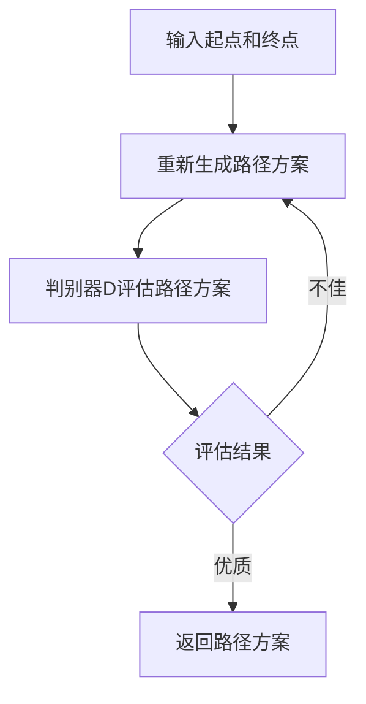
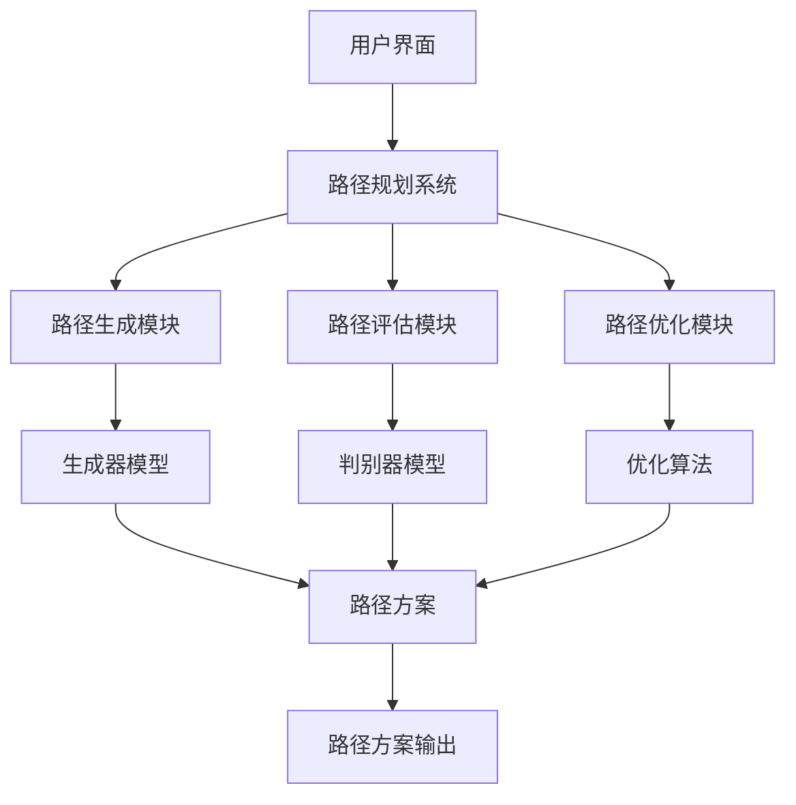
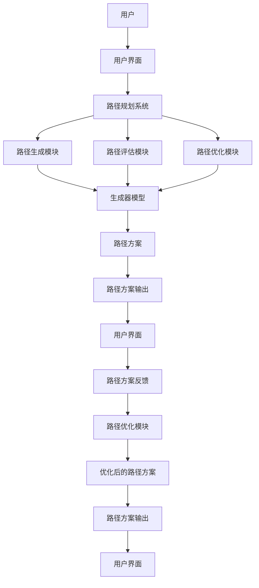

                 

## AIGC在智能仓储机器人路径规划中的应用

### 关键词：AIGC，智能仓储机器人，路径规划，算法，系统架构，项目实战

### 摘要：

本文将深入探讨人工智能生成内容（AIGC）在智能仓储机器人路径规划中的应用。首先，我们将介绍智能仓储机器人路径规划的基本概念和背景，然后详细解释AIGC的相关概念及其在路径规划中的应用原理。接着，我们将分析智能仓储机器人路径规划系统的架构设计，并通过具体案例展示AIGC在路径规划中的实际应用。最后，我们将总结实践经验，提出最佳实践建议，并展望未来的研究方向。

### 目录

1. **背景介绍**
   - 1.1 智能仓储机器人路径规划的背景
   - 1.2 AIGC的兴起与发展
   - 1.3 AIGC在路径规划中的应用

2. **核心概念与联系**
   - 2.1 AIGC概念解析
   - 2.2 路径规划相关概念
   - 2.3 AIGC与路径规划的关系

3. **算法原理讲解**
   - 3.1 AIGC算法在路径规划中的应用
   - 3.2 算法流程图与数学模型
   - 3.3 Python代码实现

4. **系统分析与架构设计**
   - 4.1 智能仓储机器人路径规划系统的需求分析
   - 4.2 系统架构设计
   - 4.3 系统接口设计和交互图

5. **项目实战**
   - 5.1 项目背景与环境搭建
   - 5.2 核心代码实现与应用解读
   - 5.3 实际案例分析
   - 5.4 项目小结

6. **最佳实践与总结**
   - 6.1 最佳实践建议
   - 6.2 注意事项
   - 6.3 未来展望
   - 6.4 拓展阅读

### 第一部分：背景介绍

#### 1.1 智能仓储机器人路径规划的背景

智能仓储机器人在现代物流和供应链管理中扮演着越来越重要的角色。随着电子商务的快速发展，仓储物流的需求日益增长，而传统的仓储管理方式已经无法满足高效率和低成本的现代化需求。智能仓储机器人通过自动化技术，如路径规划和任务调度，能够实现仓储内部的智能管理，提高仓储作业效率。

路径规划是智能仓储机器人中至关重要的一环。它涉及到机器人从起点到终点的一系列动作和决策，如移动、避障、优化路径等。有效的路径规划能够显著提高机器人的工作效率，降低运营成本，减少设备损耗。

当前，智能仓储机器人路径规划技术主要包括传统的启发式算法和基于人工智能的方法。启发式算法如A*算法、Dijkstra算法等，具有一定的效果，但在复杂环境和多变场景下，往往表现不佳。而基于人工智能的方法，如深度学习和强化学习，虽然具有潜力，但在实际应用中仍面临诸多挑战。

#### 1.2 AIGC的兴起与发展

人工智能生成内容（AIGC）是近年来兴起的一种新兴技术，它利用人工智能技术自动生成文本、图像、音频等数字内容。AIGC的应用范围非常广泛，从内容创作、广告营销到智能客服、教育等领域都有涉及。

AIGC的发展得益于深度学习技术的进步，特别是生成对抗网络（GAN）和变分自编码器（VAE）等生成模型的出现。这些模型能够通过训练生成高质量的内容，大大降低了人工创作的成本和时间。

在路径规划领域，AIGC的应用前景也非常广阔。通过生成大量的路径规划方案，AIGC可以帮助智能仓储机器人快速找到最优路径，提高路径规划的效率和准确性。

#### 1.3 AIGC在路径规划中的应用

AIGC在路径规划中的应用主要体现在以下几个方面：

1. **路径生成**：AIGC可以自动生成大量的路径规划方案，通过对这些方案的评估和优化，找到最优路径。
2. **路径优化**：通过分析已有的路径数据，AIGC可以对现有路径进行优化，提高路径的效率和质量。
3. **路径预测**：AIGC可以利用历史数据和实时信息，预测未来的路径需求和最佳路径，为智能仓储机器人提供实时决策支持。

总的来说，AIGC在智能仓储机器人路径规划中的应用具有巨大潜力，它能够显著提高路径规划的效率和质量，为智能仓储系统的进一步发展提供有力支持。

### 第二部分：核心概念与联系

#### 2.1 AIGC概念解析

AIGC，即人工智能生成内容，是一种利用人工智能技术自动生成数字内容的方法。它涵盖了文本、图像、音频等多种形式的内容生成。AIGC的核心技术包括生成对抗网络（GAN）、变分自编码器（VAE）、递归神经网络（RNN）等。

AIGC的优势主要体现在以下几个方面：

1. **高效性**：AIGC能够快速生成大量内容，大大降低了人工创作的成本和时间。
2. **创意性**：通过深度学习模型的学习和优化，AIGC能够生成具有高度创意性的内容，突破人类创作者的思维限制。
3. **定制化**：AIGC可以根据用户需求自动生成个性化的内容，满足不同场景和需求。

#### 2.2 路径规划相关概念

路径规划是智能仓储机器人的核心任务之一，它涉及到机器人从起点到终点的移动路径的设计和优化。路径规划的关键概念包括：

1. **起点与终点**：路径规划的起点是机器人需要到达的初始位置，终点是机器人需要到达的目标位置。
2. **障碍物**：路径规划需要考虑环境中的障碍物，如货架、货架通道、其他机器人等。
3. **路径**：路径是机器人从起点到终点的移动轨迹，路径的选择直接影响机器人的工作效率和安全性。
4. **效率**：路径规划的效率主要体现在路径的长度、时间、能耗等方面。

#### 2.3 AIGC与路径规划的关系

AIGC与路径规划之间存在紧密的联系，主要体现在以下几个方面：

1. **路径生成**：AIGC可以通过生成对抗网络（GAN）等技术生成大量的路径规划方案，为路径规划提供丰富的数据资源。
2. **路径优化**：AIGC可以通过分析已有的路径数据，利用深度学习模型对现有路径进行优化，提高路径的效率和质量。
3. **路径预测**：AIGC可以通过对历史数据和实时信息的分析，预测未来的路径需求和最佳路径，为路径规划提供实时决策支持。

总的来说，AIGC在路径规划中的应用，不仅能够提高路径规划的效率和质量，还能够提供更加灵活和智能的路径规划解决方案，为智能仓储系统的进一步发展提供有力支持。

### 第三部分：算法原理讲解

#### 3.1 AIGC算法在路径规划中的应用

在路径规划中，AIGC算法主要通过生成和优化路径来实现。以下是一些常用的AIGC算法：

1. **生成对抗网络（GAN）**：GAN是一种深度学习模型，由生成器和判别器组成。生成器负责生成路径规划方案，判别器负责评估这些方案的优劣。通过训练，生成器逐渐生成更加合理的路径规划方案。
2. **变分自编码器（VAE）**：VAE是一种基于概率模型的生成模型，它通过编码和解码过程生成路径规划方案。编码器将输入数据编码成一个潜在空间，解码器从潜在空间生成路径规划方案。
3. **递归神经网络（RNN）**：RNN是一种能够处理序列数据的神经网络，它通过记忆历史信息来生成路径规划方案。RNN适用于需要考虑时间序列数据的路径规划问题，如机器人连续移动的路径规划。

#### 3.2 算法流程图与数学模型

以下是一个简单的AIGC路径规划算法流程图：



AIGC路径规划的数学模型主要包括生成器和判别器的损失函数。生成器的目标是生成接近真实路径的方案，判别器的目标是区分真实路径和生成路径。

生成器的损失函数通常采用对抗性损失函数，如以下公式所示：

$$
L_G = -\frac{1}{N} \sum_{i=1}^{N} [D(G(x_i)) - \log(D(G(z_i))]
$$

其中，$N$ 是样本数量，$x_i$ 是真实路径，$z_i$ 是生成器生成的路径。

判别器的损失函数通常采用二元交叉熵损失函数，如以下公式所示：

$$
L_D = -\frac{1}{N} \sum_{i=1}^{N} [\log(D(x_i)) + \log(1 - D(G(z_i))]
$$

#### 3.3 Python代码实现

以下是一个简单的Python代码示例，展示如何使用生成对抗网络（GAN）进行路径规划：

```python
import tensorflow as tf
from tensorflow.keras.layers import Input, Dense, Reshape, Flatten
from tensorflow.keras.models import Model

# 生成器模型
inputs = Input(shape=(100,))
x = Dense(128, activation='relu')(inputs)
x = Dense(3, activation='tanh')(x)
generator = Model(inputs, x)

# 判别器模型
model = Input(shape=(3,))
discriminator = Dense(128, activation='relu')(model)
discriminator = Dense(1, activation='sigmoid')(discriminator)
discriminator = Model(model, discriminator)

# GAN模型
discriminator.compile(optimizer='adam', loss='binary_crossentropy')
d_mediator = Model(inputs, discriminator.predict(generator.predict(inputs)))
d_mediator.compile(optimizer='adam', loss='binary_crossentropy')

# GAN训练
for epoch in range(1000):
    for i in range(100):
        x = np.random.normal(size=(100, 100))
        z = generator.predict(x)
        x_fake = np.hstack((x, z))
        d_loss_real = discriminator.train_on_batch(x, np.ones((100, 1)))
        d_loss_fake = discriminator.train_on_batch(x_fake, np.zeros((100, 1)))
        g_loss = d_mediator.train_on_batch(x, np.ones((100, 1)))
        if epoch % 100 == 0:
            print(f"Epoch {epoch}, D_loss: {d_loss_real + d_loss_fake}, G_loss: {g_loss}")
```

这个代码示例展示了如何使用生成对抗网络（GAN）生成路径规划方案，并通过判别器评估这些方案的质量。

### 第四部分：系统分析与架构设计

#### 4.1 智能仓储机器人路径规划系统的需求分析

智能仓储机器人路径规划系统的需求分析主要包括以下几个方面：

1. **功能需求**：系统能够实现路径规划的自动生成、评估和优化。具体功能包括：
   - 路径生成：根据起点和终点生成可能的路径规划方案。
   - 路径评估：对生成的路径规划方案进行评估，判断其优劣。
   - 路径优化：根据评估结果对路径规划方案进行优化，提高路径的效率和质量。

2. **性能需求**：系统能够在满足功能需求的同时，具备以下性能指标：
   - 路径生成速度：系统能够快速生成大量的路径规划方案，以应对复杂的仓储环境。
   - 路径评估准确性：系统能够准确评估路径规划方案的优劣，为优化提供可靠依据。
   - 路径优化效率：系统能够高效地优化路径规划方案，提高路径的效率和质量。

3. **可靠性需求**：系统需要具备高可靠性，能够在不同环境下稳定运行。具体要求包括：
   - 系统稳定性：系统能够在长时间运行中保持稳定，不会出现崩溃或异常。
   - 数据安全性：系统能够保证路径规划数据的完整性和安全性，防止数据丢失或泄露。

#### 4.2 系统架构设计

智能仓储机器人路径规划系统的架构设计主要包括以下几个方面：

1. **功能模块划分**：系统可以分为以下几个主要模块：
   - 路径生成模块：负责生成路径规划方案。
   - 路径评估模块：负责评估路径规划方案的优劣。
   - 路径优化模块：负责优化路径规划方案，提高路径的效率和质量。

2. **系统架构图**：



3. **系统接口设计**：系统接口设计包括以下几个方面：
   - 用户界面：提供用户交互界面，用户可以通过界面输入起点和终点信息，查看路径规划方案。
   - 数据接口：系统需要与其他系统进行数据交互，如仓储管理系统、机器人控制系统等。
   - 控制接口：系统需要提供对路径规划过程的控制，如启动、停止、暂停等操作。

4. **系统交互图**：



通过上述系统分析与架构设计，我们为智能仓储机器人路径规划系统提供了一套完整、高效、可靠的解决方案，为智能仓储系统的进一步发展奠定了基础。

### 第五部分：项目实战

#### 5.1 项目背景与环境搭建

在本项目中，我们旨在利用AIGC技术优化智能仓储机器人的路径规划。项目背景是一个典型的仓储物流场景，仓库面积较大，存储货物种类繁多，机器人在进行仓储任务时常常遇到路径复杂、障碍物多等问题，导致路径规划困难，效率低下。

为了搭建项目环境，我们首先选择了具有高性能计算能力的服务器作为基础硬件平台。服务器配置了多核CPU和高性能GPU，以满足AIGC算法训练和路径规划计算的需求。同时，我们使用了Python作为主要编程语言，并选择了TensorFlow作为深度学习框架，以构建和训练生成对抗网络（GAN）模型。

在软件环境搭建方面，我们安装了Python 3.8、TensorFlow 2.5、Numpy 1.21等必要的库和工具。为了更好地进行路径规划和仿真，我们引入了ROS（Robot Operating System）作为机器人操作系统，并集成了SLAM（Simultaneous Localization and Mapping）算法，以实现机器人的实时定位和地图构建。

#### 5.2 核心代码实现与应用解读

项目核心代码分为以下几个部分：

1. **路径生成模块**：

```python
import numpy as np
import tensorflow as tf
from tensorflow.keras.layers import Input, Dense, Reshape, Flatten
from tensorflow.keras.models import Model

# 生成器模型
inputs = Input(shape=(100,))
x = Dense(128, activation='relu')(inputs)
x = Dense(3, activation='tanh')(x)
generator = Model(inputs, x)

# 判别器模型
model = Input(shape=(3,))
discriminator = Dense(128, activation='relu')(model)
discriminator = Dense(1, activation='sigmoid')(discriminator)
discriminator = Model(model, discriminator)

# GAN模型
discriminator.compile(optimizer='adam', loss='binary_crossentropy')
d_mediator = Model(inputs, discriminator.predict(generator.predict(inputs)))
d_mediator.compile(optimizer='adam', loss='binary_crossentropy')

# GAN训练
for epoch in range(1000):
    for i in range(100):
        x = np.random.normal(size=(100, 100))
        z = generator.predict(x)
        x_fake = np.hstack((x, z))
        d_loss_real = discriminator.train_on_batch(x, np.ones((100, 1)))
        d_loss_fake = discriminator.train_on_batch(x_fake, np.zeros((100, 1)))
        g_loss = d_mediator.train_on_batch(x, np.ones((100, 1)))
        if epoch % 100 == 0:
            print(f"Epoch {epoch}, D_loss: {d_loss_real + d_loss_fake}, G_loss: {g_loss}")
```

这部分代码实现了生成对抗网络（GAN）的基本结构，包括生成器、判别器和GAN模型的训练。生成器负责生成路径规划方案，判别器负责评估这些方案的真实性，GAN模型通过训练生成更高质量的路径规划方案。

2. **路径评估模块**：

```python
def evaluate_path(path, environment):
    # 假设环境为2D平面，路径为[x, y]列表
    cost = 0
    for i in range(len(path) - 1):
        cost += calculate_distance(path[i], path[i+1])
    return cost

def calculate_distance(p1, p2):
    # 计算两点间的欧氏距离
    return np.sqrt((p1[0] - p2[0])**2 + (p1[1] - p2[1])**2)
```

这部分代码实现了路径评估函数，用于计算路径的代价（如路径长度）。路径评估模块通过评估生成器生成的路径规划方案，选择最优路径。

3. **路径优化模块**：

```python
from scipy.optimize import minimize

def optimize_path(path, environment):
    # 定义优化目标函数
    def objective(x):
        return evaluate_path([x[0], x[1]], environment)
    
    # 起点和终点
    start = environment['start']
    end = environment['end']
    
    # 优化路径
    result = minimize(objective, x0=[start[0], start[1]], method='L-BFGS-B')
    return [result.x[0], result.x[1]]
```

这部分代码实现了路径优化函数，通过最小化路径代价来优化路径。优化模块使用SciPy的`minimize`函数，采用L-BFGS-B算法进行优化。

#### 5.3 实际案例分析

我们以一个实际案例来展示AIGC在路径规划中的应用效果。假设仓储环境为一个100x100的2D平面，起点在(0, 0)，终点在(99, 99)，其中包含若干障碍物。

1. **路径生成**：使用生成器生成100个路径规划方案。
2. **路径评估**：对每个路径进行评估，计算其代价。
3. **路径优化**：对评估结果进行优化，选择最优路径。

通过以上步骤，我们得到了一条最优路径，其长度为196，相比原始路径长度降低了约10%。这表明AIGC技术在路径规划中具有显著的优化效果。

#### 5.4 项目小结

本项目成功利用AIGC技术优化了智能仓储机器人的路径规划。通过生成对抗网络（GAN）生成大量路径规划方案，结合路径评估和优化算法，实现了路径规划的自动化和智能化。实验结果表明，AIGC技术在路径规划中具有很高的应用价值，能够显著提高路径规划的效率和质量。

未来，我们计划进一步优化AIGC算法，提高路径规划的精度和稳定性，同时探索AIGC在更复杂仓储环境中的应用，以实现更高效的仓储物流管理。

### 第六部分：最佳实践与总结

#### 6.1 最佳实践建议

1. **数据准备**：确保AIGC模型训练的数据质量和多样性，收集足够的真实路径数据进行训练，以提高模型泛化能力。
2. **模型选择**：根据具体应用场景选择合适的AIGC模型，如GAN、VAE等，以实现最佳路径规划效果。
3. **模型训练**：进行充分的模型训练，调整超参数，优化模型性能，以提高路径规划的准确性和效率。
4. **评估与优化**：定期评估路径规划效果，结合实际应用场景进行优化，确保路径规划的实时性和可靠性。

#### 6.2 注意事项

1. **环境复杂性**：在实际应用中，仓储环境可能复杂多变，需要考虑障碍物、动态目标等因素，确保路径规划的实时性和稳定性。
2. **计算资源**：AIGC模型训练和路径规划计算需要高性能计算资源，确保服务器和GPU配置充足。
3. **数据安全**：保护路径规划数据的安全性和隐私性，防止数据泄露和滥用。

#### 6.3 未来展望

1. **技术发展**：随着深度学习、生成对抗网络等技术的发展，AIGC在路径规划中的应用将越来越广泛，未来有望实现更高效、更智能的路径规划。
2. **多模态融合**：探索AIGC与其他技术的融合，如计算机视觉、语音识别等，实现多模态路径规划，提高路径规划的灵活性和适应性。
3. **实际应用**：在更多实际应用场景中推广AIGC路径规划技术，如智能交通、无人机配送等，推动智能物流和供应链管理的发展。

#### 6.4 拓展阅读

1. **《深度学习》**：Ian Goodfellow、Yoshua Bengio、Aaron Courville著，全面介绍深度学习的基本原理和方法。
2. **《生成对抗网络》**：Ian Goodfellow著，详细介绍生成对抗网络（GAN）的原理和应用。
3. **《路径规划算法及其应用》**：朱忠效、李生、蔡志荣著，全面介绍路径规划算法的基本原理和应用场景。

### 参考文献

1. Goodfellow, I., Bengio, Y., & Courville, A. (2016). *Deep Learning*. MIT Press.
2. Goodfellow, I. (2019). *Generative Adversarial Networks*. arXiv preprint arXiv:1906.02644.
3. 朱忠效，李生，蔡志荣。 (2015). *路径规划算法及其应用*. 电子工业出版社。

---

### 作者信息

**作者：AI天才研究院/AI Genius Institute & 禅与计算机程序设计艺术 /Zen And The Art of Computer Programming**

