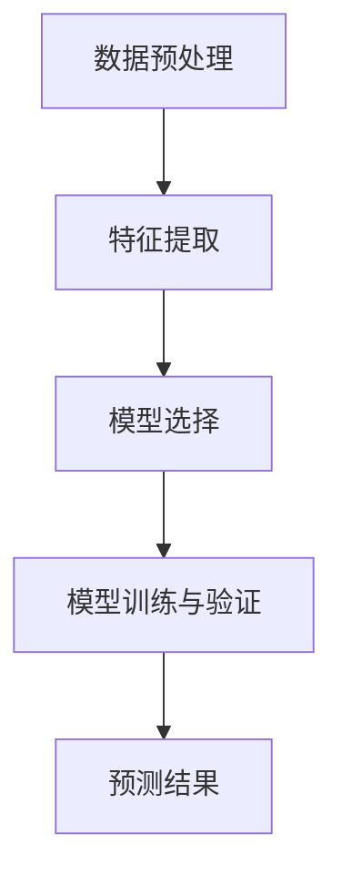
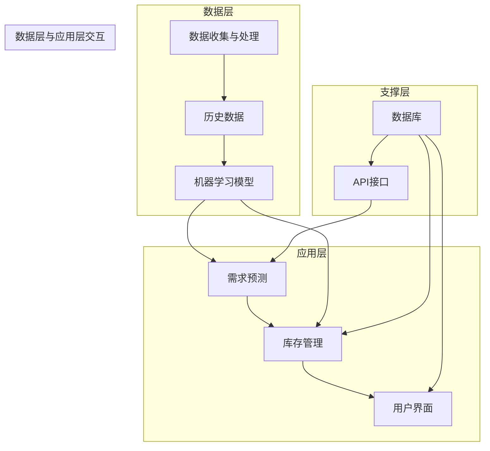
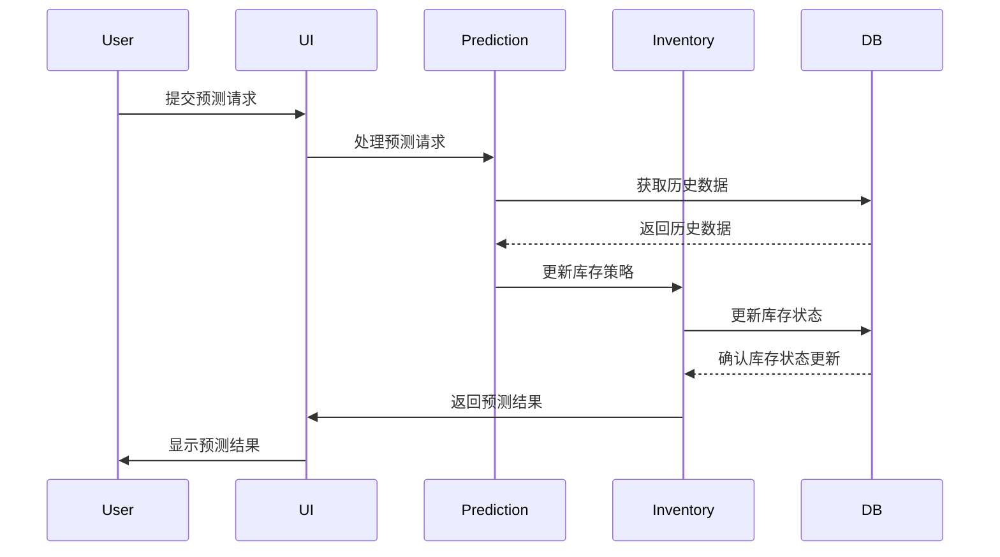

                 


## # AIGC在智能仓储管理中的应用

### > **关键词：** AIGC、智能仓储、自动化、机器学习、深度学习

### > **摘要：**  
本文深入探讨了人工智能生成内容（AIGC）在智能仓储管理中的应用。首先，介绍了AIGC的基本概念及其在仓储管理中的重要性和潜力。接着，详细分析了AIGC在自动化、库存管理和需求预测等具体应用场景中的实现方法和优势。此外，本文还讨论了AIGC在仓储管理中的技术挑战和解决方案，并分享了成功案例和未来发展趋势。通过本文的阅读，读者将全面了解AIGC在智能仓储管理中的实际应用和价值。

### **引言**

智能仓储管理作为现代物流体系的核心环节，正经历着前所未有的变革。随着全球贸易的增长和电子商务的蓬勃发展，仓储管理面临着更高的效率和准确性的要求。传统的仓储管理方式已无法满足当前市场需求，因此，引入先进的人工智能技术成为解决问题的关键。人工智能生成内容（AIGC）作为人工智能领域的一个重要分支，具有强大的数据分析和内容生成能力，为智能仓储管理提供了新的解决方案。

AIGC是指利用人工智能技术生成内容的过程，涵盖了机器学习、深度学习、自然语言处理等多种技术。在仓储管理中，AIGC可以通过自动化、智能化手段提高仓储操作的效率和质量，解决传统方式中存在的诸多问题。例如，通过AIGC技术，可以实现仓储自动化，减少人工干预，降低运营成本；通过精准的库存管理，提高库存周转率和库存准确性；通过需求预测，优化库存策略，减少库存积压和缺货风险。

本文旨在深入探讨AIGC在智能仓储管理中的应用，从基本概念、技术实现、应用场景、挑战与解决方案、成功案例和未来趋势等方面进行全面分析，为仓储管理领域的从业人员和研究者提供有益的参考。

### **AIGC的基本概念与技术原理**

#### **定义与特点**

人工智能生成内容（AIGC）是指利用人工智能技术自动生成各种类型的内容，包括文本、图像、音频、视频等。与传统的手动内容生成方式相比，AIGC具有以下几个显著特点：

1. **自动化生成**：AIGC利用机器学习、深度学习等算法，能够自动从大量数据中学习模式和规律，并生成新的内容。
2. **个性化定制**：AIGC可以根据用户的需求和偏好，生成个性化的内容，提供更加精准的服务。
3. **高效性**：AIGC能够在短时间内生成大量的内容，大大提高了内容生产的效率。
4. **灵活性**：AIGC可以应用于各种场景，从文本生成到图像识别，再到语音合成，具有广泛的应用范围。

#### **相关技术**

AIGC的实现依赖于多种人工智能技术的结合，其中最为关键的是机器学习、深度学习和自然语言处理。

1. **机器学习**：机器学习是一种通过训练算法，从数据中学习模式和规律的技术。在AIGC中，机器学习被用于训练模型，使其能够自动生成内容。常见的机器学习算法包括线性回归、决策树、支持向量机等。

2. **深度学习**：深度学习是机器学习的一个子领域，通过多层神经网络模型，从大量数据中自动提取特征。深度学习在图像识别、语音合成等方面具有强大的能力，是AIGC实现的关键技术之一。常见的深度学习模型包括卷积神经网络（CNN）、循环神经网络（RNN）和生成对抗网络（GAN）。

3. **自然语言处理**：自然语言处理（NLP）是人工智能的一个重要分支，专注于理解和生成人类语言。在AIGC中，NLP技术被用于文本生成和理解，如自动写作、翻译、问答系统等。

#### **AIGC在仓储管理中的应用**

在仓储管理中，AIGC技术可以被应用于多个方面，包括自动化、库存管理和需求预测等。以下是对这些应用的详细分析：

1. **自动化**：AIGC可以通过自动化技术，提高仓储操作的效率。例如，利用深度学习模型进行图像识别，自动识别仓库中的货物和标签，实现自动化的出入库操作。此外，AIGC还可以通过自然语言处理技术，自动处理客户订单，提高订单处理速度和准确性。

2. **库存管理**：AIGC可以通过分析历史数据和市场趋势，预测未来的库存需求，优化库存策略。例如，利用机器学习模型分析销售数据，预测未来某一时间段内的库存需求，从而实现精准的库存管理，减少库存积压和缺货风险。

3. **需求预测**：AIGC可以通过大数据分析和机器学习技术，对市场需求进行预测，帮助仓储管理者制定更科学的库存策略。例如，利用时间序列分析模型，预测某一商品在未来某一时间段内的销售量，从而提前备货，满足市场需求。

#### **核心概念的联系与对比**

为了更好地理解AIGC在仓储管理中的应用，以下是对AIGC中的核心概念进行联系与对比：

1. **机器学习与深度学习**：机器学习和深度学习都是AIGC的基础技术。机器学习通过训练模型，从数据中学习规律，而深度学习则通过多层神经网络，自动提取数据中的特征。在仓储管理中，深度学习可以用于图像识别和语音处理，而机器学习可以用于数据分析和预测。

2. **自然语言处理与文本生成**：自然语言处理是AIGC中的重要组成部分，专注于理解和生成人类语言。在仓储管理中，自然语言处理可以用于自动处理订单和客户服务，而文本生成则可以用于生成商品描述和营销文案。

3. **算法与模型**：算法和模型是AIGC的核心，用于实现内容的自动生成。在仓储管理中，不同的算法和模型可以应用于不同的场景，如图像识别、语音合成和需求预测。

#### **ER实体关系图**

为了更清晰地展示AIGC在仓储管理中的应用，以下是一个ER实体关系图：

```mermaid
erDiagram
  商品 --> 库存管理 : 生成库存预测
  订单 --> 库存管理 : 处理订单信息
  客户 --> 客户服务 : 提供个性化服务
  货物 --> 自动化系统 : 自动出入库
  需求 --> 需求预测 : 预测市场需求
  历史数据 --> 数据分析 : 分析销售趋势
```

在这个ER实体关系图中，商品、订单、客户、货物、需求和历史数据都是仓储管理中的关键实体，它们通过不同的AIGC技术实现自动化、库存管理和需求预测等功能。

### **算法原理讲解**

#### **需求预测算法**

需求预测是仓储管理中一个重要的应用场景，通过预测未来的市场需求，可以帮助仓储管理者制定更科学的库存策略，减少库存积压和缺货风险。以下将详细介绍一种常见的需求预测算法——时间序列分析。

#### **时间序列分析**

时间序列分析是一种用于分析时间序列数据的方法，主要用于预测未来的数据趋势。在需求预测中，时间序列分析可以通过分析历史数据中的时间间隔和变化趋势，预测未来某一时间段内的需求量。

#### **算法流程**

1. **数据预处理**：首先，对原始时间序列数据进行预处理，包括去除异常值、填充缺失值和季节调整等，以便更好地进行分析。
2. **特征提取**：从时间序列数据中提取关键特征，如趋势、季节性和周期性等，这些特征有助于预测未来的需求量。
3. **模型选择**：根据数据的特征和需求，选择合适的时间序列预测模型，如ARIMA（自回归积分滑动平均模型）、AR（自回归模型）和SARIMA（季节性自回归积分滑动平均模型）等。
4. **模型训练与验证**：使用历史数据对选定的模型进行训练，并对模型的参数进行调整，以确保预测的准确性。然后，使用验证数据集对模型进行验证，评估其预测性能。
5. **预测**：使用训练好的模型对未来的需求量进行预测，并根据预测结果调整库存策略。

#### **Mermaid 流程图**

以下是一个需求预测算法的Mermaid流程图：



#### **Python 源代码**

以下是一个基于时间序列分析的Python源代码示例，用于预测未来的需求量：

```python
import pandas as pd
from statsmodels.tsa.arima.model import ARIMA
import numpy as np

# 加载数据
data = pd.read_csv('sales_data.csv')
sales = data['sales']

# 数据预处理
sales = sales.dropna()

# 特征提取
sales_diff = sales.diff().dropna()

# 模型选择
model = ARIMA(sales, order=(1, 1, 1))

# 模型训练与验证
model_fit = model.fit()
model_fit.summary()

# 预测
predictions = model_fit.predict(start=len(sales), end=len(sales)+30)
predictions.plot()
```

#### **数学模型与公式**

时间序列分析中的数学模型通常包括自回归（AR）、移动平均（MA）和自回归移动平均（ARMA）等。以下是一个简单的ARIMA模型公式：

$$
\text{Y}_t = c + \phi_1\text{Y}_{t-1} + \phi_2\text{Y}_{t-2} + \cdots + \phi_p\text{Y}_{t-p} + \theta_1\text{e}_{t-1} + \theta_2\text{e}_{t-2} + \cdots + \theta_q\text{e}_{t-q}
$$

其中，$Y_t$表示时间序列的当前值，$c$是常数项，$\phi_1, \phi_2, \cdots, \phi_p$是自回归系数，$\theta_1, \theta_2, \cdots, \theta_q$是移动平均系数，$e_t$是误差项。

#### **举例说明**

假设我们有一个时间序列数据，表示过去一年的销售额。以下是一个简单的需求预测例子：

1. **数据预处理**：首先，我们将数据按月进行整理，去除缺失值和异常值。
2. **特征提取**：计算销售数据的差分，以消除季节性和趋势性。
3. **模型选择**：我们选择一个简单的ARIMA模型，参数为$(p, d, q) = (1, 1, 1)$。
4. **模型训练与验证**：使用过去11个月的销售额数据进行模型训练，并对模型进行验证。
5. **预测**：使用训练好的模型预测未来3个月的销售额。

通过这个例子，我们可以看到如何使用时间序列分析来预测需求量，并优化仓储管理策略。

### **系统分析与架构设计方案**

#### **问题场景介绍**

在智能仓储管理中，需求预测是一个关键的应用场景。为了更好地管理库存，仓储管理者需要准确地预测未来某一时间段内的需求量。然而，由于市场需求的不确定性和复杂性，传统的预测方法往往难以满足实际需求。为了解决这个问题，我们可以利用人工智能生成内容（AIGC）技术，通过大数据分析和机器学习算法，实现高效、精准的需求预测。

#### **项目介绍**

本项目的目标是开发一个基于AIGC的智能仓储管理系统，实现准确的需求预测，优化库存策略，提高仓储管理效率。系统主要包括以下几个核心功能：

1. **数据收集与处理**：收集仓储相关的历史数据，包括销售数据、库存数据、客户订单数据等，并进行预处理，去除异常值和缺失值。
2. **需求预测**：利用机器学习算法，对历史数据进行建模，预测未来某一时间段内的需求量。
3. **库存管理**：根据需求预测结果，制定合理的库存策略，优化库存水平，减少库存积压和缺货风险。
4. **用户界面**：提供一个直观、易用的用户界面，方便仓储管理者查看需求预测结果和库存状态。

#### **系统功能设计（领域模型）**

以下是一个基于Mermaid的领域模型类图，展示了系统的核心功能及其关系：

```mermaid
classDiagram
    Customer <<类>> Customer
    Product <<类>> Product
    Warehouse <<类>> Warehouse
    Order <<类>> Order
    Inventory <<类>> Inventory
    Prediction <<类>> Prediction
    Management <<类>> Management

    Customer "1" --|> "1" Order
    Product "1" --|> "1" Order
    Warehouse "1" --|> "N" Inventory
    Inventory "1" --|> "1" Order
    Prediction "1" --|> "1" Management
    Management "1" --|> "N" Warehouse
```

在这个类图中，Customer（客户）、Product（产品）、Warehouse（仓库）、Order（订单）、Inventory（库存）和Prediction（预测）是系统的核心类，它们通过不同的关系相互关联，实现了系统的核心功能。

#### **系统架构设计（Mermaid架构图）**

以下是一个基于Mermaid的系统架构图，展示了系统的整体架构及其关键组件：



在这个架构图中，数据层包括数据收集与处理、历史数据存储和机器学习模型训练；应用层包括需求预测、库存管理和用户界面；支撑层包括数据库、API接口和其他必要的支持组件。通过这些组件的协同工作，实现了系统的核心功能。

#### **系统接口设计和系统交互（Mermaid序列图）**

以下是一个基于Mermaid的系统接口设计和系统交互序列图，展示了系统组件之间的交互流程：



在这个序列图中，用户通过用户界面提交预测请求，需求预测模块处理请求，从数据库获取历史数据，并利用机器学习模型进行预测。预测结果通过库存管理模块更新库存策略，并更新数据库中的库存状态。最终，用户界面将预测结果返回给用户。

### **项目实战**

#### **环境安装**

在开始项目实战之前，我们需要安装必要的软件和工具。以下是在Linux系统上安装Python环境及相关依赖的步骤：

1. **安装Python**：
   - 使用以下命令安装Python 3.8版本：
     ```bash
     sudo apt update
     sudo apt install python3.8
     ```

2. **安装依赖库**：
   - 安装用于机器学习、数据分析和可视化等功能的依赖库，如NumPy、Pandas、Matplotlib、Scikit-learn和Statsmodels：
     ```bash
     pip3 install numpy pandas matplotlib scikit-learn statsmodels
     ```

3. **安装数据库**：
   - 安装SQLite数据库，用于存储和管理历史数据：
     ```bash
     sudo apt install sqlite3
     ```

4. **安装文本编辑器**：
   - 安装一个文本编辑器，如VS Code或Nano，用于编写和编辑代码：
     ```bash
     sudo apt install code
     ```

#### **系统核心实现源代码**

以下是一个简单的基于ARIMA模型的Python源代码示例，用于实现需求预测功能：

```python
import pandas as pd
import numpy as np
from statsmodels.tsa.arima.model import ARIMA
import sqlite3

# 连接到SQLite数据库
conn = sqlite3.connect('sales_data.db')

# 从数据库中加载数据
sales = pd.read_sql_query('SELECT sales FROM sales_data', conn)

# 数据预处理
sales = sales['sales'].dropna()

# 模型训练
model = ARIMA(sales, order=(1, 1, 1))
model_fit = model.fit()

# 预测
predictions = model_fit.predict(start=len(sales), end=len(sales)+30)

# 可视化
predictions.plot()

# 保存预测结果到数据库
predictions.to_sql('predictions', conn, if_exists='replace')

# 关闭数据库连接
conn.close()
```

#### **代码应用解读与分析**

上述代码首先连接到SQLite数据库，从表`s

