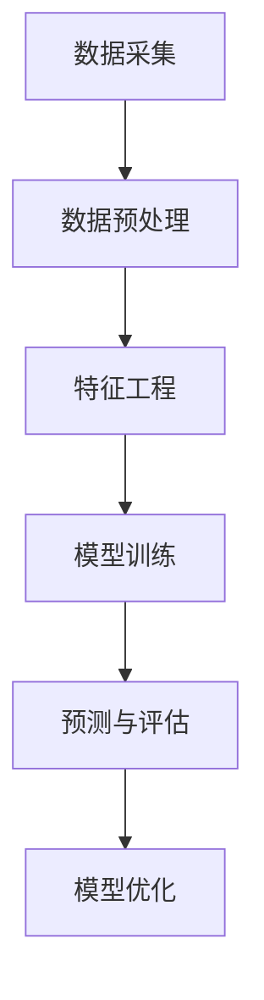
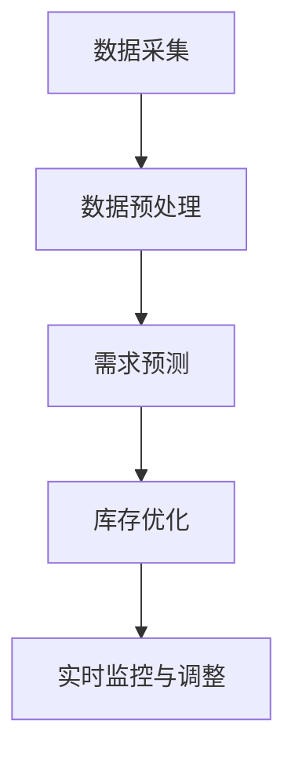
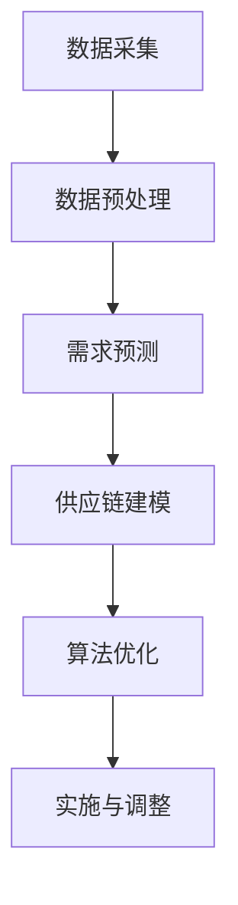
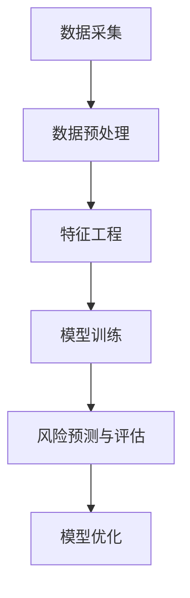
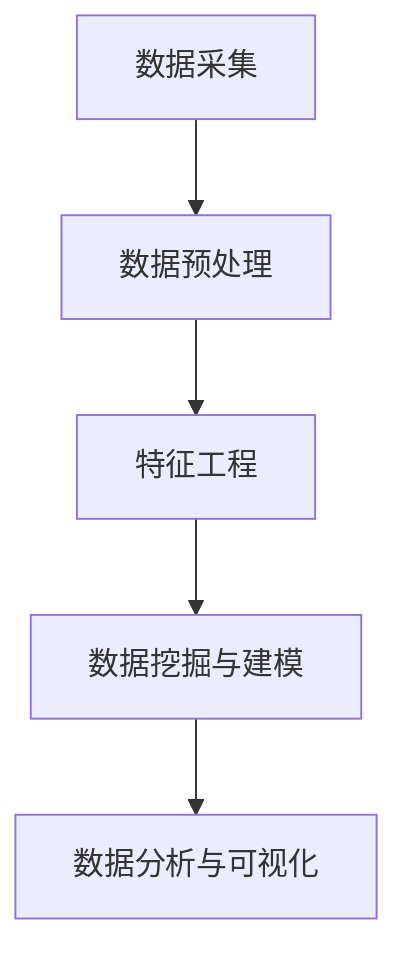

                 

# AIGC在智能供应链管理中的应用

## 关键词
- AIGC
- 智能供应链管理
- 需求预测
- 库存管理
- 供应链协同
- 风险管理
- 可视化

## 摘要
本文详细探讨了AIGC（自适应智能生成控制）在智能供应链管理中的应用。通过分析AIGC技术的发展历程及其核心要素，我们探讨了智能供应链管理的概念、体系架构以及核心功能模块。随后，文章深入探讨了AIGC在需求预测、库存管理、供应链协同、供应链风险管理、供应链可视化与数据分析等方面的具体应用，并展示了AIGC在供应链管理中的最佳实践和案例分析。最后，我们对AIGC在供应链管理中的未来发展方向进行了展望，并总结了全文内容。

## 目录大纲

----------------------------------------------------------------

# AIGC在智能供应链管理中的应用

## 第一部分：AIGC与智能供应链管理概述

## 第1章：AIGC技术概述

### 1.1 AIGC的定义与核心要素

### 1.2 AIGC的发展历程与未来趋势

### 1.3 AIGC在供应链管理中的应用前景

## 第2章：智能供应链管理的概念与体系架构

### 2.1 智能供应链管理的定义与核心概念

### 2.2 智能供应链管理的体系架构

### 2.3 智能供应链管理的核心功能模块

## 第二部分：AIGC在供应链管理中的具体应用

## 第3章：需求预测与库存管理

### 3.1 基于AIGC的需求预测算法

#### 3.1.1 需求预测的核心算法原理

#### 3.1.2 算法流程与mermaid流程图

### 3.2 基于AIGC的库存管理策略

#### 3.2.1 库存管理的数学模型

#### 3.2.2 库存管理策略的mermaid流程图

## 第4章：供应链协同与优化

### 4.1 AIGC在供应链协同中的作用

#### 4.1.1 供应链协同的核心问题

#### 4.1.2 AIGC技术在供应链协同中的应用

### 4.2 基于AIGC的供应链优化算法

#### 4.2.1 供应链优化的数学模型

#### 4.2.2 优化算法的mermaid流程图

## 第5章：供应链风险管理

### 5.1 AIGC在供应链风险管理中的应用

#### 5.1.1 供应链风险管理的核心问题

#### 5.1.2 AIGC技术在供应链风险管理中的应用

### 5.2 基于AIGC的供应链风险预测模型

#### 5.2.1 风险预测的数学模型

#### 5.2.2 风险预测算法的mermaid流程图

## 第6章：供应链可视化与数据分析

### 6.1 AIGC在供应链可视化中的作用

#### 6.1.1 供应链可视化的核心问题

#### 6.1.2 AIGC技术在供应链可视化中的应用

### 6.2 基于AIGC的供应链数据分析方法

#### 6.2.1 数据分析的核心概念

#### 6.2.2 数据分析方法的mermaid流程图

## 第7章：AIGC在供应链管理中的最佳实践与案例分析

### 7.1 AIGC在供应链管理中的最佳实践

#### 7.1.1 成功案例分析

#### 7.1.2 最佳实践总结

### 7.2 AIGC在供应链管理中的挑战与展望

#### 7.2.1 面临的挑战

#### 7.2.2 未来发展趋势

## 第8章：总结与展望

### 8.1 全书总结

### 8.2 AIGC在供应链管理中的未来发展方向

## 第一部分：AIGC与智能供应链管理概述

### 第1章：AIGC技术概述

### 1.1 AIGC的定义与核心要素

自适应智能生成控制（Adaptive Intelligent Generation Control，简称AIGC）是一种结合了人工智能、机器学习和自动控制技术的新型智能控制系统。它通过对数据的自适应分析和预测，实现对系统运行状态的实时调整和控制，从而提高系统的效率和稳定性。

AIGC的核心要素包括：

- 数据采集：通过传感器、监控系统等获取系统的实时数据。
- 数据预处理：对原始数据进行清洗、去噪、归一化等处理，提高数据质量。
- 模型训练：利用机器学习算法，根据历史数据训练生成控制模型。
- 预测与优化：根据实时数据和训练模型，进行系统状态的预测和优化。
- 实时控制：根据预测结果，对系统进行实时调整和控制。

### 1.2 AIGC的发展历程与未来趋势

AIGC技术的发展可以追溯到20世纪80年代的智能控制理论。随着计算机性能的提升和大数据、人工智能技术的兴起，AIGC在近年来得到了快速发展。目前，AIGC技术已广泛应用于工业自动化、智能交通、智能能源等领域。

未来，AIGC技术将朝着以下几个方向发展：

- 智能化：进一步提升AIGC技术的智能化水平，实现更精准的预测和优化。
- 自适应：提高AIGC技术的自适应能力，适应更复杂的系统环境和变化。
- 分布式：实现AIGC技术在分布式系统中的高效应用，提高系统整体性能。
- 网络化：通过物联网、5G等新技术，实现AIGC技术在网络环境中的广泛应用。

### 1.3 AIGC在供应链管理中的应用前景

智能供应链管理是现代企业管理的重要方向，通过优化供应链流程，提高供应链效率，降低供应链成本。AIGC技术在供应链管理中具有广泛的应用前景：

- 需求预测：利用AIGC技术对市场需求进行预测，优化库存管理，降低库存成本。
- 库存管理：通过AIGC技术实现智能库存管理，提高库存周转率，减少库存积压。
- 供应链协同：利用AIGC技术实现供应链各方之间的信息共享和协同作业，提高供应链整体效率。
- 风险管理：利用AIGC技术对供应链风险进行预测和评估，提前采取风险控制措施。
- 可视化：通过AIGC技术实现供应链数据可视化，帮助企业更好地了解供应链运行状况。

在下一章中，我们将对智能供应链管理的概念、体系架构和核心功能模块进行详细探讨。

----------------------------------------------------------------

## 第2章：智能供应链管理的概念与体系架构

### 2.1 智能供应链管理的定义与核心概念

智能供应链管理是指利用现代信息技术，特别是物联网、大数据、人工智能等技术，对供应链各个环节进行智能化管理，从而实现供应链的优化和升级。智能供应链管理不仅关注供应链的效率和成本，还注重供应链的透明度和协同性。

核心概念包括：

- 物流管理：涉及物流信息的收集、处理、传递和反馈，确保物资的顺畅流动。
- 库存管理：通过科学的方法对库存进行控制，确保库存水平适中，既能满足生产需求，又能避免库存积压。
- 订单管理：包括订单的接收、处理、跟踪和交付，确保订单的准时交付。
- 供应商管理：对供应商进行筛选、评价、考核和管理，确保供应商的优质服务和稳定供应。
- 风险管理：识别、评估、监控和应对供应链中的各种风险，确保供应链的稳定运行。

### 2.2 智能供应链管理的体系架构

智能供应链管理的体系架构通常包括以下几个层次：

- 数据层：通过传感器、物联网设备等收集供应链各环节的数据，包括物流数据、库存数据、订单数据等。
- 数据处理层：对收集到的数据进行清洗、存储、处理和分析，为供应链管理提供数据支持。
- 应用层：根据数据分析结果，制定供应链管理的策略和计划，包括需求预测、库存管理、订单管理、供应商管理、风险管理等。
- 控制层：根据应用层的策略和计划，对供应链各个环节进行实时控制和调整，确保供应链的顺畅运行。
- 用户层：供应链管理人员通过用户界面获取供应链信息，监控供应链运行状况，制定和调整供应链策略。

### 2.3 智能供应链管理的核心功能模块

智能供应链管理的核心功能模块包括：

- 需求预测：利用大数据和人工智能技术，对市场需求进行预测，为库存管理和生产计划提供依据。
- 库存管理：通过实时监控库存水平，结合需求预测结果，制定科学的库存管理策略，提高库存周转率，降低库存成本。
- 订单管理：对订单进行处理、跟踪和交付，确保订单的准时交付，提高客户满意度。
- 供应商管理：对供应商进行评价、考核和管理，确保供应商的优质服务和稳定供应。
- 风险管理：识别、评估、监控和应对供应链中的各种风险，确保供应链的稳定运行。
- 可视化：通过数据可视化技术，将供应链数据以图表、仪表盘等形式展示，帮助管理人员更好地了解供应链运行状况。

在下一部分中，我们将详细探讨AIGC技术在智能供应链管理中的具体应用。

----------------------------------------------------------------

## 第二部分：AIGC在供应链管理中的具体应用

### 第3章：需求预测与库存管理

#### 3.1 基于AIGC的需求预测算法

##### 3.1.1 需求预测的核心算法原理

需求预测是智能供应链管理中至关重要的环节。基于AIGC的需求预测算法主要利用机器学习和深度学习技术，通过对历史销售数据、市场趋势、季节性因素等进行分析，预测未来的市场需求。

核心算法原理如下：

1. 数据采集与预处理：首先，从各类数据源（如销售记录、市场调研报告等）收集相关的历史数据，然后对数据进行清洗、去噪、归一化等预处理操作，确保数据质量。
2. 特征工程：根据需求预测的目标，提取与市场需求相关的特征，如季节性指标、价格变动、促销活动等。
3. 模型训练：利用预处理后的数据，采用机器学习或深度学习算法（如线性回归、决策树、神经网络等）进行模型训练，得到预测模型。
4. 预测与评估：使用训练好的模型对未来的市场需求进行预测，并对预测结果进行评估，调整模型参数，优化预测准确性。

##### 3.1.2 算法流程与mermaid流程图

以下是一个基于AIGC的需求预测算法的mermaid流程图：

##### 3.2 基于AIGC的库存管理策略

库存管理是智能供应链管理中的另一个重要环节。基于AIGC的库存管理策略通过实时监控库存水平，结合需求预测结果，制定科学的库存管理策略，以降低库存成本，提高库存周转率。

库存管理策略的核心原理如下：

1. 数据采集与预处理：与需求预测类似，首先从各类数据源收集库存数据，然后对数据进行清洗、去噪、归一化等预处理操作。
2. 需求预测：利用AIGC的需求预测算法，预测未来的市场需求。
3. 库存优化：根据需求预测结果，结合当前的库存水平，制定库存优化策略，包括采购计划、库存补货等。
4. 实时监控与调整：实时监控库存水平，根据实际情况对库存管理策略进行调整，确保库存水平适中。

##### 3.2.2 库存管理策略的mermaid流程图

以下是一个基于AIGC的库存管理策略的mermaid流程图：

在下一章中，我们将探讨AIGC在供应链协同与优化中的应用。

----------------------------------------------------------------

### 第4章：供应链协同与优化

#### 4.1 AIGC在供应链协同中的作用

供应链协同是智能供应链管理中的重要环节，涉及到供应链上下游企业之间的信息共享、资源整合和协同作业。AIGC技术在供应链协同中发挥着重要作用，主要表现在以下几个方面：

1. **信息共享与协同作业**：AIGC技术通过大数据分析和智能算法，帮助供应链各方实现信息共享和协同作业。例如，通过实时监控供应链各环节的运行状况，企业可以及时调整生产和供应策略，提高供应链整体效率。
2. **需求预测与库存管理**：AIGC技术利用机器学习和深度学习算法，对市场需求进行预测，为企业提供科学的库存管理策略，降低库存成本，提高库存周转率。
3. **供应链优化**：AIGC技术通过对供应链数据的分析和挖掘，帮助企业管理者发现潜在问题，优化供应链流程，提高供应链整体性能。

#### 4.1.1 供应链协同的核心问题

供应链协同的核心问题主要包括：

1. **信息不对称**：供应链上下游企业之间存在信息不对称问题，导致供应链整体效率低下。AIGC技术可以通过大数据分析和智能算法，实现信息共享，降低信息不对称。
2. **协同作业难度大**：供应链协同涉及多个企业和部门之间的协作，协调难度大。AIGC技术可以通过智能算法和优化模型，提高协同作业的效率。
3. **供应链风险**：供应链风险包括供应链中断、供应短缺、库存积压等问题。AIGC技术可以通过实时监控和预测，提前识别和应对供应链风险。

#### 4.1.2 AIGC技术在供应链协同中的应用

AIGC技术在供应链协同中的应用主要体现在以下几个方面：

1. **需求预测与库存管理**：通过AIGC技术对市场需求进行预测，为供应链企业提供科学的库存管理策略，降低库存成本，提高库存周转率。
2. **供应链优化**：利用AIGC技术的智能算法，优化供应链流程，提高供应链整体效率。例如，通过路径优化、库存优化等，提高供应链的响应速度和灵活性。
3. **供应链风险预测与控制**：通过AIGC技术实时监控供应链运行状况，识别潜在风险，提前采取风险控制措施。

#### 4.2 基于AIGC的供应链优化算法

基于AIGC的供应链优化算法主要通过以下步骤实现：

1. **数据采集与预处理**：从供应链各环节收集数据，包括物流数据、库存数据、订单数据等，对数据进行分析和处理，确保数据质量。
2. **需求预测**：利用AIGC技术对市场需求进行预测，为供应链企业提供科学的库存管理策略。
3. **供应链建模**：根据供应链数据，构建供应链优化模型，包括路径优化、库存优化、订单优化等。
4. **算法优化**：利用智能算法（如遗传算法、粒子群优化等），对供应链优化模型进行求解，得到最优的供应链策略。
5. **实施与调整**：根据优化结果，调整供应链策略，实施供应链优化措施。

#### 4.2.2 优化算法的mermaid流程图

以下是一个基于AIGC的供应链优化算法的mermaid流程图：

在下一章中，我们将探讨AIGC在供应链风险管理中的应用。

----------------------------------------------------------------

### 第5章：供应链风险管理

#### 5.1 AIGC在供应链风险管理中的应用

供应链风险管理是智能供应链管理的重要组成部分，涉及到供应链中断、供应短缺、库存积压等问题。AIGC技术在供应链风险管理中具有广泛的应用，主要体现在以下几个方面：

1. **风险识别与预测**：通过大数据分析和机器学习算法，AIGC技术可以帮助企业识别潜在的供应链风险，如供应商风险、物流风险、市场需求波动等，并提前采取预防措施。
2. **风险评估与控制**：利用AIGC技术对供应链风险进行评估，确定风险等级，并制定相应的风险控制策略，降低供应链风险。
3. **供应链中断应急响应**：在供应链发生中断时，AIGC技术可以快速分析中断原因，提供应急响应方案，帮助企业迅速恢复供应链运行。

#### 5.1.1 供应链风险管理的核心问题

供应链风险管理的核心问题主要包括：

1. **信息不对称**：供应链上下游企业之间的信息不对称导致供应链风险管理难度加大。AIGC技术可以通过大数据分析和智能算法，实现信息共享，提高风险管理效率。
2. **数据质量**：供应链风险管理依赖于准确、完整的数据。数据质量问题直接影响风险识别和评估的准确性。AIGC技术可以通过数据预处理和清洗技术，提高数据质量。
3. **风险预测准确性**：供应链风险预测的准确性直接影响风险控制措施的有效性。AIGC技术通过机器学习和深度学习算法，提高风险预测的准确性。

#### 5.1.2 AIGC技术在供应链风险管理中的应用

AIGC技术在供应链风险管理中的应用主要包括以下几个方面：

1. **需求预测与风险预警**：利用AIGC技术对市场需求进行预测，提前识别潜在的市场风险，并发出风险预警。
2. **供应链中断预测与应急响应**：通过实时监控供应链运行状况，利用AIGC技术预测供应链中断风险，并制定相应的应急响应方案。
3. **风险评估与控制**：利用AIGC技术对供应链风险进行评估，确定风险等级，并制定相应的风险控制策略。

#### 5.2 基于AIGC的供应链风险预测模型

基于AIGC的供应链风险预测模型主要通过以下步骤实现：

1. **数据采集与预处理**：从供应链各环节收集数据，包括供应商数据、物流数据、市场需求数据等，对数据进行分析和处理，确保数据质量。
2. **特征工程**：根据供应链风险管理的需求，提取与风险相关的特征，如供应商信誉度、物流时效性、市场需求波动等。
3. **模型训练**：利用预处理后的数据，采用机器学习或深度学习算法（如决策树、随机森林、神经网络等）进行模型训练，得到风险预测模型。
4. **风险预测与评估**：使用训练好的模型对供应链风险进行预测，并对预测结果进行评估，调整模型参数，优化预测准确性。

#### 5.2.2 风险预测算法的mermaid流程图

以下是一个基于AIGC的供应链风险预测算法的mermaid流程图：

在下一章中，我们将探讨AIGC在供应链可视化与数据分析中的应用。

----------------------------------------------------------------

### 第6章：供应链可视化与数据分析

#### 6.1 AIGC在供应链可视化中的作用

供应链可视化是智能供应链管理的重要组成部分，通过图形化展示供应链的运行状况，帮助企业管理者更好地了解供应链的各个环节，发现潜在问题，提高供应链管理的效率。AIGC技术在供应链可视化中发挥着重要作用，主要体现在以下几个方面：

1. **实时监控**：AIGC技术可以通过实时数据采集和分析，将供应链各环节的运行状况以图形化方式展示，帮助管理者实时了解供应链的运行状况。
2. **数据关联**：AIGC技术可以将供应链各环节的数据进行关联分析，发现数据之间的内在联系，提供更全面的供应链可视化。
3. **趋势预测**：AIGC技术可以通过机器学习和深度学习算法，对供应链数据进行预测，提前预测供应链的趋势，帮助管理者做出更科学的决策。

#### 6.1.1 供应链可视化的核心问题

供应链可视化的核心问题主要包括：

1. **数据质量**：供应链可视化依赖于高质量的数据。数据质量问题直接影响可视化效果。AIGC技术可以通过数据预处理和清洗技术，提高数据质量。
2. **数据关联性**：供应链各环节的数据之间存在复杂的关联关系，如何有效地展示这些数据，是供应链可视化的关键。AIGC技术可以通过数据分析技术，发现数据之间的关联性，提供更全面的供应链可视化。
3. **实时性**：供应链可视化需要实时展示供应链的运行状况，如何保证数据的实时性，是供应链可视化的一个重要问题。AIGC技术可以通过实时数据采集和分析技术，实现供应链的实时可视化。

#### 6.1.2 AIGC技术在供应链可视化中的应用

AIGC技术在供应链可视化中的应用主要包括以下几个方面：

1. **实时监控与可视化**：利用AIGC技术实时采集供应链各环节的数据，通过图形化界面展示供应链的运行状况，帮助管理者实时监控供应链的运行状况。
2. **数据关联与可视化**：利用AIGC技术对供应链各环节的数据进行关联分析，发现数据之间的内在联系，提供更全面的供应链可视化。
3. **趋势预测与可视化**：利用AIGC技术对供应链数据进行预测，提前预测供应链的趋势，并通过图形化界面展示预测结果，帮助管理者做出更科学的决策。

#### 6.2 基于AIGC的供应链数据分析方法

基于AIGC的供应链数据分析方法主要通过以下步骤实现：

1. **数据采集与预处理**：从供应链各环节收集数据，包括物流数据、库存数据、订单数据等，对数据进行分析和处理，确保数据质量。
2. **特征工程**：根据供应链数据分析的需求，提取与供应链相关的特征，如物流时效性、库存水平、订单量等。
3. **数据挖掘与建模**：利用AIGC技术对供应链数据进行挖掘，构建供应链分析模型，如需求预测模型、库存优化模型等。
4. **数据分析与可视化**：使用AIGC技术对供应链数据进行分析，并将分析结果通过图形化界面展示，提供更直观的供应链数据分析。

#### 6.2.2 数据分析方法的mermaid流程图

以下是一个基于AIGC的供应链数据分析方法的mermaid流程图：

在下一章中，我们将探讨AIGC在供应链管理中的最佳实践与案例分析。

----------------------------------------------------------------

### 第7章：AIGC在供应链管理中的最佳实践与案例分析

#### 7.1 AIGC在供应链管理中的最佳实践

随着AIGC技术在供应链管理中的应用日益广泛，许多企业已经取得了显著的成果。以下是几个AIGC在供应链管理中的最佳实践案例：

1. **零售行业的需求预测**：某大型零售企业通过AIGC技术实现了对市场需求的高精度预测，优化了库存管理策略，大幅降低了库存成本。具体实践包括：
   - 数据采集与预处理：从各类数据源（如销售记录、市场调研报告等）收集数据，对数据进行清洗、去噪、归一化等预处理操作。
   - 特征工程：提取与市场需求相关的特征，如季节性指标、价格变动、促销活动等。
   - 模型训练与预测：利用机器学习和深度学习算法，对市场需求进行预测，并将预测结果应用于库存管理。
   - 实时监控与调整：根据市场需求预测结果，实时调整库存管理策略，确保库存水平适中。

2. **制造业的供应链优化**：某制造企业通过AIGC技术实现了供应链的优化，提高了供应链的响应速度和灵活性。具体实践包括：
   - 数据采集与预处理：从供应链各环节收集数据，包括物流数据、库存数据、订单数据等，对数据进行分析和处理。
   - 需求预测：利用AIGC技术对市场需求进行预测，为供应链企业提供科学的库存管理策略。
   - 供应链建模与优化：根据供应链数据，构建供应链优化模型，包括路径优化、库存优化、订单优化等。
   - 算法优化与实施：利用智能算法（如遗传算法、粒子群优化等），对供应链优化模型进行求解，得到最优的供应链策略，并实施优化措施。

3. **物流行业的风险预测与控制**：某物流企业通过AIGC技术实现了供应链风险的管理，提高了供应链的稳定性和可靠性。具体实践包括：
   - 数据采集与预处理：从供应链各环节收集数据，包括供应商数据、物流数据、市场需求数据等，对数据进行分析和处理。
   - 风险识别与预测：利用AIGC技术对供应链风险进行识别和预测，提前预警潜在风险。
   - 风险评估与控制：对供应链风险进行评估，制定相应的风险控制策略，确保供应链的稳定运行。
   - 应急响应与调整：在供应链发生中断时，利用AIGC技术快速分析中断原因，提供应急响应方案，帮助企业迅速恢复供应链运行。

#### 7.1.2 最佳实践总结

通过以上案例，我们可以总结出AIGC在供应链管理中的最佳实践：

- **数据驱动**：充分利用大数据和人工智能技术，对供应链数据进行分析和挖掘，为供应链管理提供科学依据。
- **实时监控与调整**：通过实时监控供应链各环节的运行状况，及时调整供应链策略，提高供应链的灵活性和响应速度。
- **协同作业**：实现供应链上下游企业之间的信息共享和协同作业，提高供应链整体效率。
- **风险预测与控制**：利用AIGC技术对供应链风险进行预测和控制，确保供应链的稳定运行。

#### 7.2 AIGC在供应链管理中的挑战与展望

尽管AIGC技术在供应链管理中取得了显著的成果，但仍然面临一些挑战：

- **数据质量**：供应链数据的多样性和复杂性可能导致数据质量问题，影响AIGC技术的应用效果。
- **模型解释性**：深度学习模型往往具有较高的预测精度，但缺乏解释性，难以理解模型的工作原理。
- **技术成熟度**：虽然AIGC技术发展迅速，但仍需要不断优化和改进，提高其在实际应用中的成熟度。

展望未来，AIGC技术在供应链管理中具有广阔的发展前景：

- **智能化**：进一步提升AIGC技术的智能化水平，实现更精准的预测和优化。
- **自适应**：提高AIGC技术的自适应能力，适应更复杂的供应链环境和变化。
- **分布式**：实现AIGC技术在分布式系统中的高效应用，提高供应链的整体性能。
- **网络化**：通过物联网、5G等新技术，实现AIGC技术在网络环境中的广泛应用。

在下一章中，我们将对全书内容进行总结，并展望AIGC在供应链管理中的未来发展方向。

----------------------------------------------------------------

### 第8章：总结与展望

#### 8.1 全书总结

本文从AIGC与智能供应链管理概述出发，详细探讨了AIGC技术在智能供应链管理中的应用。首先，我们介绍了AIGC技术的定义、核心要素、发展历程和未来趋势，为后续应用提供了理论基础。接着，我们探讨了智能供应链管理的概念、体系架构和核心功能模块，为AIGC在供应链管理中的应用奠定了基础。

在具体应用部分，我们深入分析了AIGC在需求预测、库存管理、供应链协同、供应链风险管理、供应链可视化与数据分析等方面的应用，通过实际案例展示了AIGC技术的效果和优势。此外，我们还总结了AIGC在供应链管理中的最佳实践，并展望了AIGC技术的未来发展趋势。

#### 8.2 AIGC在供应链管理中的未来发展方向

展望未来，AIGC在供应链管理中具有广阔的发展前景。以下是一些可能的发展方向：

1. **智能化**：随着人工智能技术的不断发展，AIGC技术的智能化水平将不断提升。通过更先进的算法和模型，实现更精准的预测和优化，提高供应链管理的效率。

2. **自适应**：AIGC技术将具备更强的自适应能力，能够适应更复杂的供应链环境和变化。通过实时监控和调整，实现供应链的动态优化，提高供应链的灵活性。

3. **分布式**：随着云计算、边缘计算等技术的发展，AIGC技术将在分布式系统中发挥更大的作用。通过分布式计算和存储，提高供应链管理的整体性能。

4. **网络化**：AIGC技术将实现更广泛的应用，通过物联网、5G等新技术，实现供应链各环节的实时连接和数据共享，提高供应链的可视化和协同效率。

5. **绿色化**：随着环保意识的提高，AIGC技术在供应链管理中的应用将更加注重绿色化。通过优化供应链流程，降低能源消耗和碳排放，实现可持续发展。

总之，AIGC技术在智能供应链管理中的应用具有巨大的潜力和前景。随着技术的不断进步和实际应用的深入，AIGC将助力供应链管理实现更高效、更智能、更可持续的发展。让我们共同期待AIGC技术在供应链管理领域带来的革命性变革。

