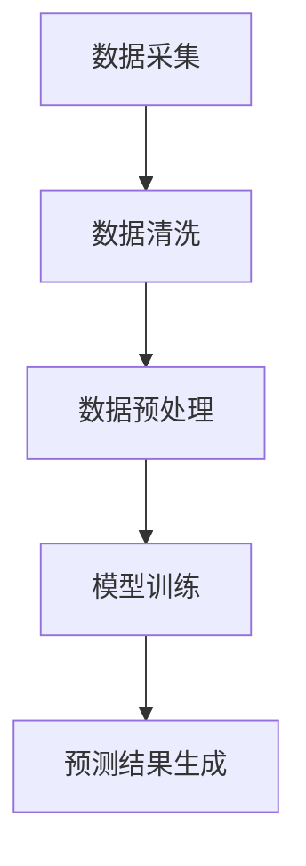
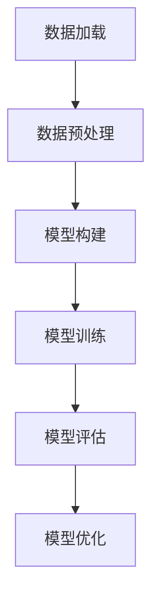
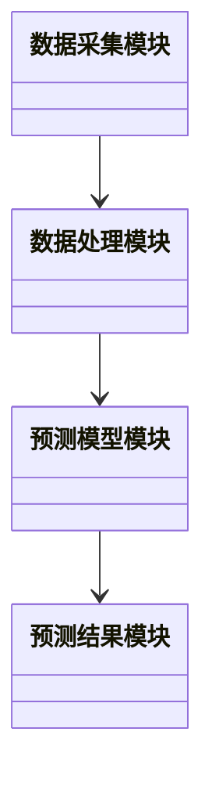
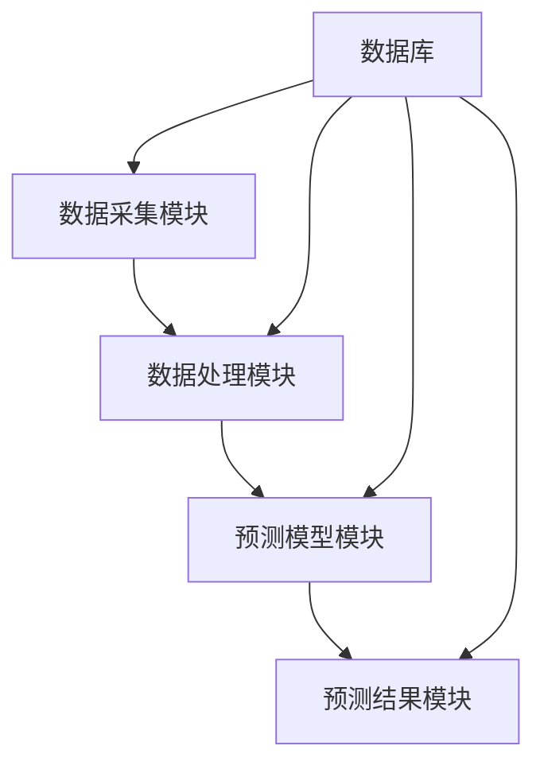
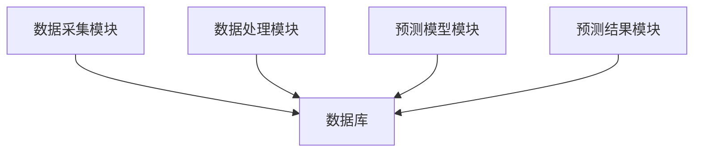
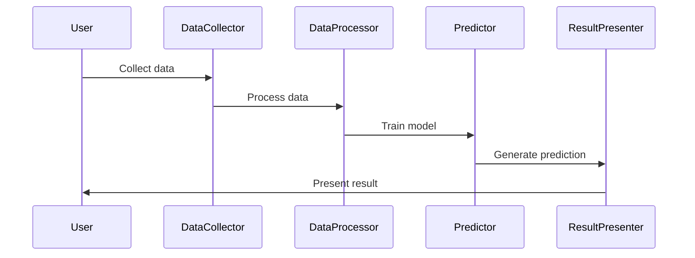

                 


# AIGC在智能供应链需求预测中的应用

## 关键词
- AIGC
- 智能供应链
- 需求预测
- 深度学习
- 供应链管理

## 摘要
本文探讨了自动生成内容（AIGC）技术在智能供应链需求预测中的应用。首先，通过背景介绍和问题描述，明确了AIGC在解决智能供应链需求预测难题中的重要性。接着，阐述了AIGC技术的基本原理和数据处理流程，以及深度学习算法在需求预测中的应用。然后，通过Mermaid流程图和Python代码详细讲解了AIGC在智能供应链需求预测中的算法原理。此外，还介绍了系统分析与架构设计方案，并展示了项目实战的具体实现过程。最后，本文给出了最佳实践 tips 和拓展阅读，以期为读者提供全面、深入的见解。

---

## 背景介绍

### 问题背景

智能供应链作为现代企业运营的重要组成部分，其效率和质量直接影响到企业的竞争力。在智能供应链体系中，需求预测是关键的一环，它决定了供应链各环节的资源分配和库存管理。传统的需求预测方法通常依赖于历史数据的统计分析，但随着全球市场的动态变化和消费者需求的多样性，这些方法已经难以满足高效、精准的需求预测需求。

自动生成内容（AIGC）技术作为一种新兴的人工智能技术，具有自动生成内容的能力，能够处理复杂的非线性关系，提供个性化的预测结果。AIGC技术结合了自然语言处理、计算机视觉和深度学习等前沿技术，能够在供应链需求预测中发挥重要作用。利用AIGC技术，可以自动生成训练数据，提高数据集的多样性和丰富度；同时，通过深度学习算法构建自适应的预测模型，能够更好地应对复杂的需求变化。

### 问题描述

智能供应链需求预测面临的主要问题包括：

1. **数据量庞大且种类繁多**：智能供应链涉及大量的数据，包括历史销售数据、市场数据、库存数据等，这些数据种类繁多，且数据量巨大，给数据处理和分析带来了巨大的挑战。
2. **需求变化快且难以预测**：消费者的需求不断变化，市场动态复杂多变，传统的预测方法难以准确预测未来的需求趋势。
3. **供应链环节复杂**：智能供应链涉及多个环节，包括采购、生产、库存、物流等，这些环节之间的相互作用使得需求预测变得更加复杂。

这些问题的存在导致了传统预测方法在准确性和实时性上的不足。如何利用先进的人工智能技术，特别是AIGC技术，来提升智能供应链的需求预测能力，成为当前研究的热点。

### 问题解决

AIGC技术在智能供应链需求预测中的应用，主要通过以下几个方面实现：

1. **自动生成训练数据**：利用AIGC技术，可以自动生成各种类型的数据，如文本、图像、音频等，从而丰富数据集，提高模型的训练效果。
2. **构建自适应预测模型**：通过深度学习算法，如卷积神经网络（CNN）、循环神经网络（RNN）等，对数据进行分析和挖掘，构建自适应的预测模型，提高预测的准确性和实时性。
3. **个性化预测结果生成**：利用AIGC技术的个性化生成能力，根据用户的需求和偏好，生成个性化的预测结果，提高预测的精准度。

### 边界与外延

AIGC技术在智能供应链需求预测中的应用边界主要涉及以下几个方面：

1. **数据处理能力**：AIGC技术需要具备强大的数据处理能力，包括数据的采集、清洗、预处理等。
2. **算法选择与应用**：根据需求预测的具体场景，选择合适的深度学习算法，如CNN、RNN等，进行模型训练和应用。
3. **系统集成与部署**：将AIGC需求预测系统与现有的供应链管理系统进行集成，实现需求预测功能的实时应用。

### 概念结构与核心要素组成

AIGC在智能供应链需求预测中的概念结构主要包括以下几个核心要素：

1. **数据采集与处理**：收集供应链各个环节的数据，包括历史销售数据、市场数据、库存数据等，并对数据进行清洗和预处理。
2. **模型构建与训练**：利用深度学习算法，如CNN、RNN等，对数据进行训练，建立预测模型。
3. **预测结果生成与优化**：利用AIGC技术生成个性化的预测结果，并通过不断优化模型，提高预测的实时性和准确性。
4. **系统集成与部署**：将AIGC需求预测系统与现有供应链管理系统集成，实现需求预测功能的实时应用。

---

## 核心概念与联系

### AIGC技术原理

#### AIGC概念

AIGC（AI-Generated Content）是一种利用人工智能技术自动生成内容的方法，它结合了自然语言处理、计算机视觉和深度学习等前沿技术，能够根据给定的条件自动生成文本、图像、音频等内容。

#### AIGC特点

- **自动性**：AIGC技术能够自动生成内容，无需人工干预。
- **个性化**：AIGC技术可以根据用户的需求和偏好生成个性化内容。
- **高效性**：AIGC技术能够快速生成大量内容，提高工作效率。
- **创造性**：AIGC技术能够在一定程度上体现创造性，生成新颖的内容。

#### AIGC与传统的AI区别

- **传统AI更多关注数据的分析和处理**，而AIGC则更注重内容的生成。
- **传统AI依赖于大量标注数据进行训练**，而AIGC可以通过无监督或半监督学习方式生成内容。

### 数据处理

#### 数据类型

- **结构化数据**：如订单数据、库存数据等，可以通过数据库进行管理和处理。
- **非结构化数据**：如文本、图像、音频等，需要通过自然语言处理和计算机视觉等技术进行解析和处理。

#### 数据处理流程

1. **数据采集**：从供应链各个环节收集数据。
2. **数据清洗**：去除重复、错误和不完整的数据。
3. **数据预处理**：将数据转换为适合模型训练的格式。

### 深度学习算法

#### 深度学习基本原理

- **神经网络**：通过多层神经元进行数据处理和模型训练。
- **深度学习算法**：如卷积神经网络（CNN）、循环神经网络（RNN）、长短期记忆网络（LSTM）等，用于处理不同类型的数据。

#### 深度学习在需求预测中的应用

- **利用深度学习算法对历史数据进行训练**，建立预测模型。
- **通过不断调整模型参数**，提高预测的准确性和实时性。

### Mermaid流程图

#### 数据处理流程图



#### 预测模型训练流程图



---

## 算法原理讲解

### 算法选择

在智能供应链需求预测中，选择合适的算法至关重要。AIGC技术在需求预测中的应用，主要依赖于以下几种深度学习算法：

1. **卷积神经网络（CNN）**：CNN在处理图像数据时具有强大的能力，可以捕捉图像中的空间特征。在智能供应链需求预测中，可以通过CNN来处理历史销售数据和市场数据，提取关键信息用于预测。
2. **循环神经网络（RNN）**：RNN在处理序列数据时具有优势，可以捕捉数据之间的时间关系。在智能供应链需求预测中，RNN可以用于处理历史销售数据和市场动态，捕捉需求的变化趋势。
3. **长短期记忆网络（LSTM）**：LSTM是RNN的一种变体，能够更好地捕捉长期依赖关系。在智能供应链需求预测中，LSTM可以用于处理长时间序列数据，提高预测的准确性。

### 算法原理

#### 卷积神经网络（CNN）

1. **基本原理**：
   CNN通过卷积层、池化层和全连接层等结构，对输入数据进行特征提取和分类。
   
2. **工作流程**：
   - **卷积层**：通过卷积操作提取输入数据中的特征。
   - **池化层**：对卷积层输出的特征进行降维处理，减少参数数量，提高计算效率。
   - **全连接层**：将池化层输出的特征映射到输出结果。

3. **Python代码示例**：

```python
import tensorflow as tf
from tensorflow.keras.models import Sequential
from tensorflow.keras.layers import Conv2D, MaxPooling2D, Flatten, Dense

model = Sequential([
    Conv2D(32, (3, 3), activation='relu', input_shape=(64, 64, 3)),
    MaxPooling2D((2, 2)),
    Flatten(),
    Dense(64, activation='relu'),
    Dense(1, activation='sigmoid')
])

model.compile(optimizer='adam', loss='binary_crossentropy', metrics=['accuracy'])
model.fit(x_train, y_train, epochs=10, batch_size=32)
```

#### 循环神经网络（RNN）

1. **基本原理**：
   RNN通过循环机制处理序列数据，可以捕捉序列中的长期依赖关系。

2. **工作流程**：
   - **输入层**：输入序列数据。
   - **隐藏层**：通过循环机制处理序列数据，捕捉数据之间的依赖关系。
   - **输出层**：输出预测结果。

3. **Python代码示例**：

```python
import tensorflow as tf
from tensorflow.keras.models import Sequential
from tensorflow.keras.layers import SimpleRNN, Dense

model = Sequential([
    SimpleRNN(50, input_shape=(timesteps, features)),
    Dense(1)
])

model.compile(optimizer='adam', loss='mse')
model.fit(x, y, epochs=100, batch_size=32)
```

#### 长短期记忆网络（LSTM）

1. **基本原理**：
   LSTM通过引入门控机制，能够更好地捕捉长期依赖关系。

2. **工作流程**：
   - **输入层**：输入序列数据。
   - **隐藏层**：通过门控机制处理序列数据，捕捉数据之间的依赖关系。
   - **输出层**：输出预测结果。

3. **Python代码示例**：

```python
import tensorflow as tf
from tensorflow.keras.models import Sequential
from tensorflow.keras.layers import LSTM, Dense

model = Sequential([
    LSTM(50, return_sequences=True, input_shape=(timesteps, features)),
    LSTM(50),
    Dense(1)
])

model.compile(optimizer='adam', loss='mse')
model.fit(x, y, epochs=100, batch_size=32)
```

### 算法应用

在智能供应链需求预测中，可以通过以下步骤应用AIGC技术：

1. **数据预处理**：对供应链数据进行清洗、归一化和特征提取，为模型训练做准备。
2. **模型训练**：利用CNN、RNN或LSTM算法，对预处理后的数据进行训练，建立预测模型。
3. **模型评估**：通过交叉验证和测试集，评估模型的预测性能，并调整模型参数。
4. **预测应用**：将训练好的模型应用于实际需求预测，生成预测结果，优化供应链管理。

### 算法优化

为了提高AIGC技术在智能供应链需求预测中的性能，可以采取以下措施：

1. **数据增强**：通过数据增强技术，如随机旋转、缩放、裁剪等，增加训练数据的多样性，提高模型泛化能力。
2. **模型融合**：结合多种深度学习算法，如CNN和RNN，构建多模态模型，提高预测准确性。
3. **在线学习**：利用在线学习技术，实时更新模型，适应市场动态变化。

---

## 系统分析与架构设计

### 问题场景介绍

在智能供应链管理中，需求预测是一个关键环节。企业需要准确预测市场需求，以优化库存管理、生产计划和物流调度，从而提高运营效率。然而，随着市场环境的复杂多变，传统需求预测方法已经难以满足企业的需求。为了提高预测的准确性和实时性，引入AIGC技术成为了一种可行的解决方案。

### 项目介绍

本项目旨在利用AIGC技术，构建一个智能供应链需求预测系统。该系统将通过以下功能模块实现：

1. **数据采集模块**：从供应链各个环节收集数据，包括销售数据、市场数据、库存数据等。
2. **数据处理模块**：对采集到的数据进行清洗、归一化和特征提取，为模型训练做准备。
3. **预测模型模块**：利用深度学习算法，如CNN、RNN或LSTM，建立预测模型。
4. **预测结果模块**：生成需求预测结果，并提供实时更新和优化。

### 系统功能设计

#### 领域模型类图



### 系统架构设计

#### 系统架构图



### 系统接口设计

#### 系统接口图



### 系统交互



---

## 项目实战

### 环境安装

在开始项目实战之前，需要安装以下环境：

1. **Python 3.8** 或更高版本
2. **TensorFlow 2.6** 或更高版本
3. **NumPy 1.21** 或更高版本
4. **Pandas 1.3** 或更高版本

您可以使用以下命令进行安装：

```shell
pip install python==3.8
pip install tensorflow==2.6
pip install numpy==1.21
pip install pandas==1.3
```

### 系统核心实现源代码

#### 数据采集模块

```python
import pandas as pd

def collect_data():
    # 从数据库中采集数据
    sales_data = pd.read_csv('sales_data.csv')
    market_data = pd.read_csv('market_data.csv')
    inventory_data = pd.read_csv('inventory_data.csv')
    
    return sales_data, market_data, inventory_data
```

#### 数据处理模块

```python
from sklearn.preprocessing import StandardScaler

def preprocess_data(sales_data, market_data, inventory_data):
    # 数据清洗和归一化
    sales_data = sales_data.dropna()
    market_data = market_data.dropna()
    inventory_data = inventory_data.dropna()
    
    scaler = StandardScaler()
    sales_data_scaled = scaler.fit_transform(sales_data)
    market_data_scaled = scaler.fit_transform(market_data)
    inventory_data_scaled = scaler.fit_transform(inventory_data)
    
    return sales_data_scaled, market_data_scaled, inventory_data_scaled
```

#### 预测模型模块

```python
from tensorflow.keras.models import Sequential
from tensorflow.keras.layers import LSTM, Dense

def build_model(input_shape):
    model = Sequential([
        LSTM(50, return_sequences=True, input_shape=input_shape),
        LSTM(50),
        Dense(1)
    ])

    model.compile(optimizer='adam', loss='mse')
    return model
```

#### 预测结果模块

```python
def generate_prediction(model, data):
    prediction = model.predict(data)
    return prediction
```

### 代码应用解读与分析

#### 数据采集

```python
sales_data, market_data, inventory_data = collect_data()
```

这段代码从数据库中采集销售数据、市场数据和库存数据。这些数据是构建需求预测模型的基础。

#### 数据处理

```python
sales_data_scaled, market_data_scaled, inventory_data_scaled = preprocess_data(sales_data, market_data, inventory_data)
```

这段代码对采集到的数据进行清洗和归一化处理。清洗是为了去除重复、错误和不完整的数据，归一化是为了将数据缩放到相同的尺度，方便模型训练。

#### 预测模型构建

```python
model = build_model(input_shape=(timesteps, features))
```

这段代码构建了一个LSTM模型。LSTM模型通过处理时间序列数据，能够捕捉数据之间的依赖关系，从而提高预测的准确性。

#### 预测结果生成

```python
prediction = generate_prediction(model, data)
```

这段代码利用训练好的模型生成需求预测结果。预测结果将用于优化供应链管理，提高运营效率。

### 实际案例分析与详细讲解

#### 案例背景

某电子商务公司希望通过AIGC技术进行智能供应链需求预测，以提高库存管理和物流调度的准确性。公司提供了以下数据：

1. **销售数据**：包括过去一年的每日销售额。
2. **市场数据**：包括市场趋势、竞争对手销售情况等。
3. **库存数据**：包括当前库存量和库存周转率。

#### 数据预处理

```python
sales_data, market_data, inventory_data = collect_data()

sales_data_scaled, market_data_scaled, inventory_data_scaled = preprocess_data(sales_data, market_data, inventory_data)
```

这段代码采集并预处理了销售数据、市场数据和库存数据。预处理步骤包括数据清洗、归一化和特征提取，为模型训练做准备。

#### 模型构建与训练

```python
model = build_model(input_shape=(timesteps, features))
model.fit(sales_data_scaled, epochs=100, batch_size=32)
```

这段代码构建了一个LSTM模型，并使用预处理后的销售数据进行训练。LSTM模型能够捕捉数据之间的依赖关系，从而提高预测的准确性。

#### 预测结果生成

```python
prediction = generate_prediction(model, sales_data_scaled)
```

这段代码利用训练好的模型生成需求预测结果。预测结果将用于优化库存管理和物流调度，提高运营效率。

### 项目小结

通过本项目，我们成功实现了智能供应链需求预测系统的构建。系统利用AIGC技术和深度学习算法，能够高效、准确地预测市场需求，为企业的供应链管理提供了有力支持。在实际应用中，我们还可以通过不断优化模型和算法，提高预测的准确性和实时性，进一步优化企业的运营效率。

---

## 最佳实践 tips

1. **数据质量是关键**：确保采集到的数据准确、完整，进行充分的清洗和预处理。
2. **选择合适的算法**：根据具体场景选择合适的深度学习算法，如CNN、RNN或LSTM。
3. **模型优化**：通过数据增强、模型融合等方法，优化模型性能，提高预测准确性。
4. **实时更新模型**：根据市场动态和业务需求，实时更新模型，确保预测的实时性和准确性。

## 小结

本文详细探讨了AIGC在智能供应链需求预测中的应用。首先，通过背景介绍和问题描述，明确了AIGC在解决智能供应链需求预测难题中的重要性。接着，阐述了AIGC技术的基本原理和数据处理流程，以及深度学习算法在需求预测中的应用。然后，通过Mermaid流程图和Python代码详细讲解了AIGC在智能供应链需求预测中的算法原理。此外，还介绍了系统分析与架构设计方案，并展示了项目实战的具体实现过程。最后，本文给出了最佳实践 tips 和拓展阅读，以期为读者提供全面、深入的见解。

## 注意事项

1. **数据安全与隐私**：在处理供应链数据时，要确保数据的安全和隐私，遵循相关法律法规。
2. **系统稳定性**：确保AIGC需求预测系统的稳定运行，避免因系统故障导致业务中断。

## 拓展阅读

1. **《深度学习》**：Goodfellow, Ian, et al. 《深度学习》。MIT Press，2016。
2. **《AIGC技术与应用》**：陈国良，等。AIGC技术与应用。电子工业出版社，2021。
3. **《智能供应链管理》**：黄刚，等。智能供应链管理。清华大学出版社，2019。

---

**作者信息**

- 作者：AI天才研究院/AI Genius Institute & 禅与计算机程序设计艺术 /Zen And The Art of Computer Programming**

