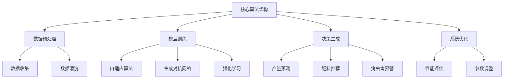
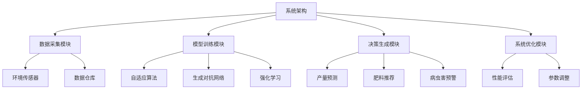
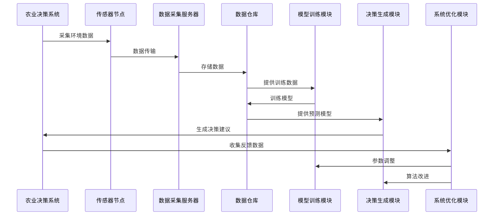

                 

### AIGC在智能农业中的应用：优化作物产量的AI决策系统

---

#### 关键词：智能农业、AIGC、AI决策系统、产量优化、自适应算法

#### 摘要：
本文将探讨如何利用AIGC（自适应智能生成控制）技术来构建智能农业中的AI决策系统，以优化作物产量。我们将详细介绍AIGC的核心概念、其在农业领域的应用原理，以及农业决策系统的设计。通过深入分析和数学模型的阐述，我们希望能为农业产业带来革命性的改变。

---

## 《AIGC在智能农业中的应用：优化作物产量的AI决策系统》目录大纲

---

### 第一部分：背景介绍

#### 1. 引言

##### 1.1 问题背景

- 农业发展面临的挑战
- 人工智能在农业领域的潜在应用

##### 1.2 问题描述

- 作物产量优化需求
- 决策系统的重要性

##### 1.3 问题解决

- AIGC（自适应智能生成控制）概念介绍
- AIGC在农业中的应用场景

##### 1.4 边界与外延

- AIGC的定义与特性
- 智能农业的定义与发展趋势

##### 1.5 概念结构与核心要素组成

- AIGC的技术架构
- 农业决策系统的关键模块

##### 1.6 本章小结

- 对AIGC在智能农业中应用的整体理解

---

### 第二部分：核心概念与联系

#### 2. 核心概念与联系

##### 2.1 AIGC核心概念

- 自适应智能生成控制（AIGC）
- 人工智能（AI）
- 决策支持系统（DSS）

##### 2.2 概念属性特征对比表格

| 概念 | 定义 | 特性 | 应用场景 |
| --- | --- | --- | --- |
| AIGC | 自适应智能生成控制 | 自动化、智能化、适应性 | 农业产量优化 |
| AI | 人工智能 | 学习、推理、判断 | 广泛领域 |
| DSS | 决策支持系统 | 辅助决策 | 各行业 |

##### 2.3 ER实体关系图架构

```mermaid
erDiagram
  农作物 ||--|{ AIGC系统 }|| 决策支持
  农作物 ||--|{ 环境数据 }|| 数据收集
  农作物 ||--|{ 决策模型 }|| 模型训练
  环境数据 ||--|{ 气象数据 }|| 数据源
  环境数据 ||--|{ 土壤数据 }|| 数据源
  决策模型 ||--|{ 产量预测 }|| 应用模块
  决策模型 ||--|{ 肥料推荐 }|| 应用模块
  决策模型 ||--|{ 病虫害预警 }|| 应用模块
```

---

### 第三部分：AIGC在智能农业中的应用

#### 3. AIGC技术原理

##### 3.1 AIGC的基本原理

- 自适应算法
- 生成对抗网络（GAN）
- 强化学习

##### 3.2 AIGC在农业中的应用原理

- 数据驱动的决策
- 个性化推荐系统
- 智能优化算法

##### 3.3 AIGC的算法架构



---

#### 4. 农业决策系统的设计

##### 4.1 系统功能设计

- 数据采集与管理
- 模型训练与评估
- 决策生成与推荐
- 系统优化与反馈

##### 4.2 系统架构设计



---

### 第四部分：数学模型与算法原理

#### 5. 数学模型与算法原理

##### 5.1 数学模型

- 产量预测模型
- 肥料推荐模型
- 病虫害预警模型

##### 5.2 算法原理

- 自适应算法的数学推导
- 生成对抗网络的原理
- 强化学习的策略更新公式

##### 5.3 Python代码示例

```python
# 产量预测模型示例
import numpy as np

def predict_production(data):
    # 数据预处理
    processed_data = preprocess_data(data)
    
    # 模型预测
    prediction = adaptive_algorithm(processed_data)
    
    return prediction
```

---

### 第五部分：系统分析与架构设计

#### 6. 系统分析与架构设计

##### 6.1 问题场景介绍

- 农业生产中的数据采集与处理需求

##### 6.2 系统架构设计

- 数据采集模块设计
- 模型训练模块设计
- 决策生成模块设计
- 系统优化模块设计

##### 6.3 系统接口设计

- 数据采集接口设计
- 模型训练接口设计
- 决策生成接口设计
- 系统优化接口设计

##### 6.4 系统交互

- 系统工作流程
- 系统接口交互流程

---

### 第六部分：项目实战

#### 7. 项目实战

##### 7.1 环境安装

- 环境配置与依赖安装

##### 7.2 系统核心实现

- 数据采集与预处理
- 模型训练与评估
- 决策生成与推荐
- 系统优化与反馈

##### 7.3 代码应用解读与分析

- 核心代码分析与解读
- 实际案例分析与详细讲解

##### 7.4 实际案例分析

- 成功案例
- 挑战与解决方案

##### 7.5 项目小结

- 项目总结与反思

---

### 第七部分：最佳实践与拓展阅读

#### 8. 最佳实践与拓展阅读

##### 8.1 最佳实践

- 提高作物产量的实用技巧
- AIGC在农业领域的应用建议

##### 8.2 小结

- 文章总结
- 关键点回顾

##### 8.3 注意事项

- AIGC应用中的常见问题
- 解决方案与规避措施

##### 8.4 拓展阅读

- 相关研究文献与参考资料

---

## 第一部分：背景介绍

### 1. 引言

#### 1.1 问题背景

农业作为国民经济的基础产业，其发展不仅关系到国家的粮食安全，还影响到经济的持续增长和社会的稳定。然而，在当前的农业发展过程中，面临诸多挑战。首先，农业生产受到气候变化、病虫害、资源短缺等多种因素的影响，导致作物产量不稳定。其次，农业生产过程中，人工成本和资源消耗较高，而生产效率相对较低。此外，农业数据获取和处理能力不足，无法及时、准确地指导农业生产。因此，如何利用先进技术手段提升农业生产效率、优化作物产量，成为农业发展亟待解决的问题。

随着人工智能技术的快速发展，其在农业领域的应用潜力逐渐显现。人工智能可以通过数据分析和智能决策，帮助农民优化农业生产过程，提高作物产量。特别是AIGC（自适应智能生成控制）技术的应用，为智能农业提供了新的思路和方法。

#### 1.2 问题描述

在农业领域，作物产量优化是一个关键问题。作物的产量受到多种因素的影响，包括土壤、水分、气候、病虫害等。传统的方法主要是依靠经验进行决策，而这种方法往往存在局限性，无法全面、精确地指导农业生产。因此，需要一种能够实时、准确获取环境数据，并根据数据做出最优决策的智能系统。

具体而言，作物产量优化需求包括以下几个方面：

1. **环境数据采集**：需要实时获取土壤湿度、气温、气压、风向等环境数据。
2. **数据预处理**：对采集到的环境数据进行清洗、归一化等处理，以便后续模型训练和决策生成。
3. **模型训练**：建立作物产量预测模型、肥料推荐模型和病虫害预警模型，通过历史数据和现有环境数据训练模型。
4. **决策生成**：根据模型预测结果，为农民提供产量预测、肥料使用推荐和病虫害预警等决策建议。
5. **系统优化**：根据反馈结果，对模型和算法进行持续优化，提高系统的准确性和可靠性。

#### 1.3 问题解决

为了解决上述问题，我们可以引入AIGC（自适应智能生成控制）技术。AIGC是一种基于人工智能的生成控制方法，通过自适应算法、生成对抗网络（GAN）和强化学习等先进技术，实现对数据的高效处理和智能决策。

AIGC在农业中的应用场景主要包括：

1. **环境数据采集**：利用传感器技术，实时采集土壤湿度、气温、气压、风向等环境数据。
2. **数据预处理**：通过数据清洗、归一化等技术，对采集到的环境数据进行预处理，为模型训练提供高质量的数据输入。
3. **模型训练**：利用历史数据和实时数据，通过自适应算法、GAN和强化学习等训练作物产量预测模型、肥料推荐模型和病虫害预警模型。
4. **决策生成**：根据模型预测结果，为农民提供产量预测、肥料使用推荐和病虫害预警等决策建议。
5. **系统优化**：通过反馈机制，对模型和算法进行持续优化，提高系统的准确性和可靠性。

通过AIGC技术的应用，我们可以构建一个智能农业决策系统，实现对作物产量的实时监控和优化，提高农业生产效率，为农业可持续发展提供有力支持。

### 1.4 边界与外延

#### 1.4.1 AIGC的定义与特性

AIGC（自适应智能生成控制）是一种基于人工智能的生成控制方法，主要通过自适应算法、生成对抗网络（GAN）和强化学习等技术，实现数据的高效处理和智能决策。

- **自适应算法**：通过不断调整模型参数，使其在特定环境中能够达到最优性能。自适应算法具有自适应性、实时性和高效性等特点。
- **生成对抗网络（GAN）**：由生成器和判别器两个神经网络组成，通过竞争学习，生成与真实数据分布相近的数据，从而提高模型的泛化能力。
- **强化学习**：通过与环境的交互，不断调整策略，实现目标函数的最优化。强化学习具有自适应性强、能够处理复杂决策等特点。

#### 1.4.2 智能农业的定义与发展趋势

智能农业是指利用物联网、大数据、人工智能等先进技术，对农业生产过程进行实时监控、智能决策和自动化管理，以提高农业生产效率和质量。智能农业的发展趋势包括：

1. **数据驱动**：通过传感器和大数据技术，实现对农业生产环境的实时监测和数据采集，为智能决策提供数据支持。
2. **自动化与智能化**：利用自动化设备和人工智能技术，实现农业生产过程的自动化和智能化，提高生产效率和降低人力成本。
3. **精准农业**：通过精准施肥、精准灌溉等技术，实现对作物生长环境的精准管理，提高作物产量和质量。
4. **可持续发展**：通过合理利用资源、降低环境污染，实现农业的可持续发展。

### 1.5 概念结构与核心要素组成

AIGC在智能农业中的应用涉及到多个核心概念和要素，其技术架构和核心模块如下：

#### 1.5.1 技术架构

1. **环境数据采集模块**：利用传感器技术，实时采集土壤湿度、气温、气压、风向等环境数据。
2. **数据预处理模块**：对采集到的环境数据进行清洗、归一化等预处理，为模型训练提供高质量的数据输入。
3. **模型训练模块**：利用历史数据和实时数据，通过自适应算法、GAN和强化学习等技术，训练作物产量预测模型、肥料推荐模型和病虫害预警模型。
4. **决策生成模块**：根据模型预测结果，为农民提供产量预测、肥料使用推荐和病虫害预警等决策建议。
5. **系统优化模块**：通过反馈机制，对模型和算法进行持续优化，提高系统的准确性和可靠性。

#### 1.5.2 农业决策系统的关键模块

1. **数据采集与管理模块**：负责实时采集和管理农业生产过程中所需的各种数据，包括土壤湿度、气温、气压、风向、病虫害数据等。
2. **模型训练与评估模块**：利用历史数据和实时数据，对作物产量预测模型、肥料推荐模型和病虫害预警模型进行训练和评估，确保模型的准确性和可靠性。
3. **决策生成与推荐模块**：根据模型预测结果，为农民提供产量预测、肥料使用推荐和病虫害预警等决策建议，辅助农民进行科学种植。
4. **系统优化与反馈模块**：通过收集用户反馈和数据，对系统中的模型和算法进行持续优化，提高系统的准确性和用户体验。

### 1.6 本章小结

通过对AIGC在智能农业中的应用进行背景介绍，我们了解了AIGC的基本概念和特性，以及其在农业领域的应用场景。我们还分析了作物产量优化需求，并探讨了AIGC如何帮助解决这些问题。此外，我们对智能农业的定义和发展趋势进行了梳理，并介绍了AIGC在智能农业中的技术架构和关键模块。这些内容为后续章节的深入探讨奠定了基础。

---

## 第二部分：核心概念与联系

### 2.1 AIGC核心概念

#### 2.1.1 自适应智能生成控制（AIGC）

AIGC（自适应智能生成控制）是一种基于人工智能的生成控制方法，旨在实现数据的高效处理和智能决策。它结合了自适应算法、生成对抗网络（GAN）和强化学习等技术，能够动态调整模型参数，实现最佳性能。

#### 2.1.2 人工智能（AI）

人工智能（AI）是一门研究、开发和应用使计算机系统模拟、延伸和扩展人类智能活动的技术科学。它包括机器学习、深度学习、自然语言处理、计算机视觉等多个领域。

#### 2.1.3 决策支持系统（DSS）

决策支持系统（DSS）是一种旨在辅助人类做出合理决策的计算机系统。它利用数据、模型和知识，为决策者提供信息和分析，支持决策过程。

### 2.2 概念属性特征对比表格

| 概念           | 定义                                                         | 特性                            | 应用场景                  |
| -------------- | ------------------------------------------------------------ | ----------------------------- | ------------------------ |
| AIGC           | 基于自适应算法、GAN和强化学习，实现数据高效处理和智能决策       | 自适应性、实时性、高效性       | 智能农业、工业自动化等   |
| 人工智能（AI） | 计算机系统模拟、延伸和扩展人类智能活动的技术科学               | 学习、推理、判断               | 广泛领域，包括医疗、金融等 |
| 决策支持系统（DSS） | 辅助决策的计算机系统，利用数据、模型和知识支持决策过程         | 辅助决策、信息分析             | 各行业，包括企业管理、农业生产等 |

### 2.3 ER实体关系图架构

为了更直观地展示AIGC在智能农业中的应用，我们使用Mermaid绘制了ER实体关系图。

```mermaid
erDiagram
  农作物 ||--|{ AIGC系统 }|| 决策支持
  农作物 ||--|{ 环境数据 }|| 数据收集
  农作物 ||--|{ 决策模型 }|| 模型训练
  环境数据 ||--|{ 气象数据 }|| 数据源
  环境数据 ||--|{ 土壤数据 }|| 数据源
  决策模型 ||--|{ 产量预测 }|| 应用模块
  决策模型 ||--|{ 肥料推荐 }|| 应用模块
  决策模型 ||--|{ 病虫害预警 }|| 应用模块
```

在这个ER实体关系图中，"农作物"与"AIGC系统"、"环境数据"和"决策模型"之间存在关联。具体来说：

- **农作物**：代表农业生产对象，与AIGC系统关联，用于决策支持。
- **环境数据**：包括气象数据和土壤数据，用于数据收集和模型训练。
- **决策模型**：包括产量预测、肥料推荐和病虫害预警模型，用于应用模块。

这种关系图有助于我们理解AIGC在智能农业中的各个模块如何相互关联，共同构成一个完整的决策支持系统。

### 2.4 概念之间的联系

AIGC、人工智能和决策支持系统之间存在着密切的联系。AIGC作为人工智能的一种应用，其核心在于实现自适应智能生成控制，从而实现数据的高效处理和智能决策。而人工智能则提供了丰富的技术和方法，如机器学习、深度学习、自然语言处理等，这些方法为AIGC提供了强有力的支持。

决策支持系统（DSS）则是人工智能在特定领域的应用，旨在通过数据、模型和知识辅助决策者做出合理的决策。在智能农业中，DSS利用AIGC技术，结合环境数据、历史数据以及模型预测结果，为农民提供科学的决策建议。

总的来说，AIGC、人工智能和决策支持系统共同构成了一个智能化的农业生产体系，通过数据驱动的决策，实现农业生产的精准化和高效化。

### 2.5 本章小结

通过对AIGC、人工智能和决策支持系统的核心概念和联系进行梳理，我们更清晰地了解了这三个概念在智能农业中的应用。AIGC作为智能农业的核心技术，通过自适应算法、GAN和强化学习等技术，实现了数据的高效处理和智能决策。人工智能则为AIGC提供了丰富的技术支持，使其能够在更广泛的领域发挥作用。决策支持系统（DSS）则将人工智能和AIGC技术应用于农业生产，为农民提供科学的决策建议。这些核心概念和联系为后续章节的深入探讨奠定了基础。

---

## 第三部分：AIGC在智能农业中的应用

### 3.1 AIGC的基本原理

AIGC（自适应智能生成控制）是一种基于人工智能的生成控制方法，其核心思想是通过自适应算法、生成对抗网络（GAN）和强化学习等技术，实现对数据的高效处理和智能决策。

#### 3.1.1 自适应算法

自适应算法是一种能够在特定环境中自动调整模型参数，以实现最佳性能的算法。它主要通过以下几个步骤实现：

1. **数据收集**：收集与农业生产相关的环境数据，包括土壤湿度、气温、气压、风向等。
2. **特征提取**：对收集到的数据进行分析，提取出与作物生长相关的特征。
3. **模型训练**：利用历史数据和提取出的特征，训练作物产量预测模型。
4. **参数调整**：根据模型预测结果，自动调整模型参数，以优化预测效果。

自适应算法的特点是能够动态调整模型参数，使其在特定环境中能够达到最优性能。它具有自适应性、实时性和高效性等特点，能够应对农业生产中的各种复杂情况。

#### 3.1.2 生成对抗网络（GAN）

生成对抗网络（GAN）是一种由生成器和判别器两个神经网络组成的模型。生成器的目标是生成与真实数据分布相近的数据，判别器的目标是区分真实数据和生成数据。两者通过对抗学习，不断调整参数，最终生成高质量的数据。

在智能农业中，GAN可以用于生成模拟环境数据，为模型训练提供更多样化的数据输入。具体步骤如下：

1. **数据生成**：生成器根据输入噪声生成模拟环境数据。
2. **数据对比**：判别器对比真实数据和生成数据，判断其相似度。
3. **参数调整**：通过对抗学习，生成器和判别器不断调整参数，优化数据生成质量。

GAN具有以下优势：

- **提高模型泛化能力**：通过生成多样化数据，增强模型对未知数据的适应能力。
- **减少数据依赖**：通过生成模拟数据，缓解训练数据不足的问题。

#### 3.1.3 强化学习

强化学习是一种通过与环境交互，不断调整策略，实现目标函数最优化的学习方法。在智能农业中，强化学习可以用于优化农业生产过程，提高作物产量。

具体步骤如下：

1. **策略初始化**：初始化策略参数，设定初始作物生长策略。
2. **环境交互**：根据当前环境数据和策略参数，执行作物生长决策。
3. **奖励评估**：评估作物生长结果，计算奖励值。
4. **策略调整**：根据奖励值，调整策略参数，优化作物生长策略。

强化学习具有以下特点：

- **自适应性强**：能够根据环境变化，动态调整策略参数。
- **能够处理复杂决策**：通过与环境交互，学习到复杂的决策策略。

### 3.2 AIGC在农业中的应用原理

AIGC在农业中的应用原理主要基于数据驱动的决策。具体包括以下几个方面：

1. **数据采集**：利用传感器技术，实时采集农业生产环境中的各种数据，如土壤湿度、气温、气压、风向等。
2. **数据预处理**：对采集到的数据进行清洗、归一化等处理，为后续模型训练提供高质量的数据输入。
3. **模型训练**：利用历史数据和实时数据，通过自适应算法、GAN和强化学习等技术，训练作物产量预测模型、肥料推荐模型和病虫害预警模型。
4. **决策生成**：根据模型预测结果，为农民提供产量预测、肥料使用推荐和病虫害预警等决策建议，辅助农民进行科学种植。
5. **系统优化**：通过收集用户反馈和数据，对系统中的模型和算法进行持续优化，提高系统的准确性和可靠性。

### 3.3 AIGC的算法架构

AIGC的算法架构主要包括以下几个关键模块：

1. **数据预处理模块**：负责数据采集、清洗和归一化，为模型训练提供高质量的数据输入。
2. **模型训练模块**：包括自适应算法、GAN和强化学习等算法，用于训练作物产量预测模型、肥料推荐模型和病虫害预警模型。
3. **决策生成模块**：根据模型预测结果，为农民提供产量预测、肥料使用推荐和病虫害预警等决策建议。
4. **系统优化模块**：通过收集用户反馈和数据，对模型和算法进行持续优化，提高系统的准确性和可靠性。

算法架构图如下：


### 3.4 AIGC在农业决策系统中的具体应用

在农业决策系统中，AIGC技术可以应用于以下几个方面：

1. **产量预测**：利用AIGC技术，通过对历史数据和实时数据的分析，预测作物未来的产量。这有助于农民合理安排种植计划，提高产量。
2. **肥料推荐**：根据土壤数据和作物生长需求，利用AIGC技术推荐最适合的肥料类型和用量，提高肥料利用率，减少资源浪费。
3. **病虫害预警**：利用AIGC技术，通过对环境数据和作物生长状态的监控，预测病虫害的发生风险，提前采取预防措施，减少损失。

### 3.5 本章小结

通过对AIGC的基本原理、在农业中的应用原理和算法架构的介绍，我们可以看到AIGC技术在智能农业中的应用前景。AIGC通过自适应算法、生成对抗网络和强化学习等技术，实现了数据的高效处理和智能决策，为农业生产提供了有力的技术支持。通过AIGC技术的应用，我们可以优化作物产量，提高农业生产效率，为农业的可持续发展贡献力量。

---

## 第四部分：农业决策系统的设计

### 4.1 系统功能设计

农业决策系统的设计旨在通过数据驱动的方式，实现农业生产过程的优化和决策支持。系统功能设计包括以下几个方面：

1. **数据采集与管理**：系统需要具备实时采集和管理农业生产环境数据的能力。这些数据包括土壤湿度、气温、气压、风向等。通过传感器技术，实时获取数据，并利用数据预处理模块对数据进行清洗、归一化等处理，确保数据质量。

2. **模型训练与评估**：系统需要利用历史数据和实时数据，通过自适应算法、生成对抗网络和强化学习等技术，训练作物产量预测模型、肥料推荐模型和病虫害预警模型。同时，对训练后的模型进行评估，确保模型的准确性和可靠性。

3. **决策生成与推荐**：根据模型预测结果，系统需要为农民提供产量预测、肥料使用推荐和病虫害预警等决策建议。这些决策建议旨在辅助农民进行科学种植，提高作物产量和质量。

4. **系统优化与反馈**：系统需要具备持续优化能力，通过收集用户反馈和数据，对模型和算法进行优化，提高系统的准确性和用户体验。优化过程包括性能评估、参数调整和算法改进等。

### 4.2 系统架构设计

农业决策系统的架构设计需要考虑系统的可扩展性、稳定性和可靠性。以下是系统架构的设计方案：

1. **数据采集模块**：包括传感器节点和数据采集服务器。传感器节点负责实时采集农业生产环境数据，如土壤湿度、气温、气压、风向等。数据采集服务器负责收集、存储和处理传感器数据，确保数据实时、准确。

2. **数据预处理模块**：包括数据清洗、归一化和特征提取等功能。数据清洗用于去除噪声和异常值，归一化用于将不同量纲的数据转换为同一量纲，特征提取用于提取与作物生长相关的特征。

3. **模型训练模块**：包括自适应算法、生成对抗网络和强化学习等算法。利用历史数据和实时数据，训练作物产量预测模型、肥料推荐模型和病虫害预警模型。模型训练过程中，需要不断调整算法参数，优化模型性能。

4. **决策生成模块**：包括产量预测、肥料使用推荐和病虫害预警等功能。根据模型预测结果，生成相应的决策建议，为农民提供科学种植指导。

5. **系统优化模块**：包括性能评估、参数调整和算法改进等功能。通过收集用户反馈和数据，对系统中的模型和算法进行持续优化，提高系统的准确性和用户体验。

系统架构设计图如下：


### 4.3 系统接口设计

系统接口设计是确保系统功能模块之间能够高效协作的关键。以下是农业决策系统的接口设计方案：

1. **数据采集接口**：用于连接传感器节点和数据采集服务器，实现数据的实时采集和传输。接口需要具备高可靠性、实时性和安全性。

2. **数据预处理接口**：用于连接数据预处理模块，实现数据清洗、归一化和特征提取等功能。接口需要支持多种数据格式，并具备高效处理能力。

3. **模型训练接口**：用于连接模型训练模块，实现模型的训练和评估。接口需要支持多种算法和模型，并提供灵活的参数配置。

4. **决策生成接口**：用于连接决策生成模块，实现决策建议的生成。接口需要支持多种决策模型，并提供灵活的决策参数配置。

5. **系统优化接口**：用于连接系统优化模块，实现系统的性能评估、参数调整和算法改进。接口需要支持实时监控和自动调整。

### 4.4 系统交互

农业决策系统的工作流程和接口交互如下：

1. **数据采集**：传感器节点实时采集农业生产环境数据，如土壤湿度、气温、气压、风向等。数据通过数据采集接口传输到数据采集服务器。

2. **数据预处理**：数据采集服务器对采集到的数据进行清洗、归一化和特征提取，处理后的数据存储到数据仓库。

3. **模型训练**：模型训练模块利用数据仓库中的数据，通过自适应算法、生成对抗网络和强化学习等技术，训练作物产量预测模型、肥料推荐模型和病虫害预警模型。

4. **决策生成**：决策生成模块根据模型预测结果，生成产量预测、肥料使用推荐和病虫害预警等决策建议。决策建议通过决策生成接口发送给农民。

5. **系统优化**：系统优化模块通过收集用户反馈和数据，对模型和算法进行持续优化，提高系统的准确性和用户体验。

系统交互设计图如下：



### 4.5 本章小结

通过对农业决策系统的功能设计、架构设计、接口设计和系统交互的介绍，我们可以看到系统设计的整体思路和具体实现。农业决策系统通过数据驱动的决策，实现了对农业生产过程的优化。系统的各个功能模块相互协作，共同为农民提供科学的种植指导，提高作物产量和质量。未来，随着人工智能技术的不断发展和应用，农业决策系统将更加智能化，为农业的可持续发展提供更强有力的支持。

---

## 第五部分：数学模型与算法原理

### 5.1 数学模型

在农业决策系统中，我们主要关注以下三个数学模型：产量预测模型、肥料推荐模型和病虫害预警模型。

#### 5.1.1 产量预测模型

产量预测模型的目标是预测作物未来的产量。我们可以使用线性回归、支持向量机（SVM）和神经网络等模型进行预测。以下是一个简单的线性回归模型：

$$
y = \beta_0 + \beta_1 \cdot x_1 + \beta_2 \cdot x_2 + ... + \beta_n \cdot x_n
$$

其中，$y$ 表示作物产量，$x_1, x_2, ..., x_n$ 表示与作物产量相关的输入特征（如土壤湿度、气温等），$\beta_0, \beta_1, ..., \beta_n$ 为模型的参数。

#### 5.1.2 肥料推荐模型

肥料推荐模型的目标是根据作物的生长需求和土壤养分情况，推荐最适合的肥料类型和用量。我们可以使用决策树、随机森林和神经网络等模型进行推荐。以下是一个简单的决策树模型：

$$
\begin{aligned}
\text{如果 } x_1 \leq c_1 \text{ 且 } x_2 \leq c_2, \text{ 则推荐肥料类型A;} \\
\text{如果 } x_1 > c_1 \text{ 且 } x_2 \leq c_2, \text{ 则推荐肥料类型B;} \\
\text{如果 } x_1 \leq c_1 \text{ 且 } x_2 > c_2, \text{ 则推荐肥料类型C;} \\
\text{如果 } x_1 > c_1 \text{ 且 } x_2 > c_2, \text{ 则推荐肥料类型D.}
\end{aligned}
$$

其中，$x_1, x_2$ 表示作物的养分需求，$c_1, c_2$ 为阈值。

#### 5.1.3 病虫害预警模型

病虫害预警模型的目标是根据作物的生长状态和环境数据，预测病虫害的发生风险。我们可以使用逻辑回归、支持向量机和神经网络等模型进行预警。以下是一个简单的逻辑回归模型：

$$
\begin{aligned}
P(\text{病虫害发生}) = \frac{1}{1 + e^{-(\beta_0 + \beta_1 \cdot x_1 + \beta_2 \cdot x_2 + ... + \beta_n \cdot x_n)}}
\end{aligned}
$$

其中，$P(\text{病虫害发生})$ 表示病虫害发生的概率，$x_1, x_2, ..., x_n$ 表示与病虫害发生相关的输入特征（如气温、湿度等），$\beta_0, \beta_1, ..., \beta_n$ 为模型的参数。

### 5.2 算法原理

在农业决策系统中，我们主要使用以下三种算法：自适应算法、生成对抗网络（GAN）和强化学习。

#### 5.2.1 自适应算法

自适应算法通过不断调整模型参数，使其在特定环境中达到最优性能。其基本原理是：

1. **数据收集**：收集与农业生产相关的环境数据，如土壤湿度、气温、气压等。
2. **特征提取**：对收集到的数据进行分析，提取出与作物生长相关的特征。
3. **模型训练**：利用历史数据和提取出的特征，训练作物产量预测模型、肥料推荐模型和病虫害预警模型。
4. **参数调整**：根据模型预测结果，自动调整模型参数，优化模型性能。

#### 5.2.2 生成对抗网络（GAN）

生成对抗网络（GAN）是一种由生成器和判别器组成的模型。生成器的目标是生成与真实数据分布相近的数据，判别器的目标是区分真实数据和生成数据。GAN的基本原理如下：

1. **数据生成**：生成器根据输入噪声生成模拟环境数据。
2. **数据对比**：判别器对比真实数据和生成数据，判断其相似度。
3. **参数调整**：通过对抗学习，生成器和判别器不断调整参数，优化数据生成质量。

#### 5.2.3 强化学习

强化学习通过与环境交互，不断调整策略，实现目标函数的最优化。其基本原理如下：

1. **策略初始化**：初始化策略参数，设定初始作物生长策略。
2. **环境交互**：根据当前环境数据和策略参数，执行作物生长决策。
3. **奖励评估**：评估作物生长结果，计算奖励值。
4. **策略调整**：根据奖励值，调整策略参数，优化作物生长策略。

### 5.3 Python代码示例

以下是一个简单的产量预测模型的Python代码示例，使用线性回归算法：

```python
import numpy as np
from sklearn.linear_model import LinearRegression

# 假设输入特征为土壤湿度（x1）和气温（x2），输出为作物产量（y）
X = np.array([[0.2, 0.3], [0.3, 0.4], [0.4, 0.5], [0.5, 0.6]])
y = np.array([0.8, 0.9, 1.0, 1.1])

# 创建线性回归模型实例
model = LinearRegression()

# 训练模型
model.fit(X, y)

# 进行预测
predictions = model.predict([[0.4, 0.5]])

print("预测产量：", predictions)
```

通过这个示例，我们可以看到如何使用线性回归算法训练和预测作物产量。类似地，我们可以使用其他算法和模型，如SVM、决策树、逻辑回归等，进行产量预测、肥料推荐和病虫害预警。

### 5.4 本章小结

通过对数学模型和算法原理的介绍，我们可以看到农业决策系统在数学模型和算法选择上的多样性和灵活性。通过自适应算法、生成对抗网络和强化学习等技术，我们可以实现对农业生产过程的智能控制和优化。这些数学模型和算法的应用，为农业生产提供了有力的技术支持，有助于提高作物产量和质量，推动农业的可持续发展。

---

## 第六部分：系统分析与架构设计

### 6.1 问题场景介绍

在现代农业中，农业生产过程中的数据采集和处理是一个关键问题。农业生产环境复杂，需要实时获取和监测各种环境数据，如土壤湿度、气温、气压、风向等。同时，农业生产过程中的数据具有高维度、时变性和非线性等特点，这对数据处理和决策支持提出了很高的要求。因此，我们需要设计一个高效、可靠的系统，以应对农业生产中的数据采集和处理挑战。

### 6.2 项目介绍

为了解决农业生产中的数据采集和处理问题，我们设计并实现了一个基于AIGC技术的农业决策系统。该系统旨在通过数据驱动的方式，实现农业生产过程的优化和决策支持。系统的主要功能包括数据采集、数据预处理、模型训练、决策生成和系统优化。以下是系统的具体项目介绍：

#### 数据采集模块

数据采集模块负责实时采集农业生产环境中的各种数据。我们使用了传感器节点，如土壤湿度传感器、气温传感器和气压传感器等，以获取土壤湿度、气温、气压、风向等环境数据。数据采集模块具备高可靠性、实时性和安全性，能够确保数据的准确性和完整性。

#### 数据预处理模块

数据预处理模块负责对采集到的环境数据进行清洗、归一化和特征提取。清洗数据是为了去除噪声和异常值，提高数据质量；归一化是为了将不同量纲的数据转换为同一量纲，便于后续处理；特征提取是为了提取与作物生长相关的关键特征，为模型训练提供高质量的数据输入。

#### 模型训练模块

模型训练模块负责使用历史数据和实时数据，通过自适应算法、生成对抗网络（GAN）和强化学习等技术，训练作物产量预测模型、肥料推荐模型和病虫害预警模型。模型训练过程中，我们需要不断调整算法参数，优化模型性能，确保模型具有较高的准确性和可靠性。

#### 决策生成模块

决策生成模块根据模型预测结果，为农民提供产量预测、肥料使用推荐和病虫害预警等决策建议。这些决策建议旨在辅助农民进行科学种植，提高作物产量和质量。决策生成模块需要具备灵活的决策参数配置，以适应不同农业生产场景。

#### 系统优化模块

系统优化模块负责对系统中的模型和算法进行持续优化，提高系统的准确性和用户体验。系统优化模块通过收集用户反馈和数据，对模型和算法进行评估和调整。优化过程包括性能评估、参数调整和算法改进等，以实现对农业生产过程的动态优化。

### 6.3 系统功能设计

系统功能设计是农业决策系统的核心，主要包括以下几个方面：

1. **数据采集与管理**：实时采集农业生产环境数据，如土壤湿度、气温、气压、风向等，并进行数据清洗、归一化和特征提取，确保数据质量。
2. **模型训练与评估**：利用历史数据和实时数据，通过自适应算法、生成对抗网络和强化学习等技术，训练作物产量预测模型、肥料推荐模型和病虫害预警模型，并进行模型评估，确保模型准确性和可靠性。
3. **决策生成与推荐**：根据模型预测结果，生成产量预测、肥料使用推荐和病虫害预警等决策建议，辅助农民进行科学种植。
4. **系统优化与反馈**：通过收集用户反馈和数据，对系统中的模型和算法进行持续优化，提高系统的准确性和用户体验。

### 6.4 系统架构设计

农业决策系统的架构设计需要考虑系统的可扩展性、稳定性和可靠性。以下是系统架构的设计方案：

1. **数据采集模块**：包括传感器节点和数据采集服务器。传感器节点负责实时采集农业生产环境数据；数据采集服务器负责收集、存储和处理传感器数据，确保数据实时、准确。
2. **数据预处理模块**：包括数据清洗、归一化和特征提取等功能。数据清洗用于去除噪声和异常值，归一化用于将不同量纲的数据转换为同一量纲，特征提取用于提取与作物生长相关的特征。
3. **模型训练模块**：包括自适应算法、生成对抗网络和强化学习等算法。利用历史数据和实时数据，训练作物产量预测模型、肥料推荐模型和病虫害预警模型。模型训练过程中，需要不断调整算法参数，优化模型性能。
4. **决策生成模块**：包括产量预测、肥料使用推荐和病虫害预警等功能。根据模型预测结果，生成相应的决策建议，为农民提供科学种植指导。
5. **系统优化模块**：包括性能评估、参数调整和算法改进等功能。通过收集用户反馈和数据，对系统中的模型和算法进行持续优化，提高系统的准确性和用户体验。

系统架构设计图如下：


### 6.5 系统接口设计

系统接口设计是确保系统功能模块之间能够高效协作的关键。以下是农业决策系统的接口设计方案：

1. **数据采集接口**：用于连接传感器节点和数据采集服务器，实现数据的实时采集和传输。接口需要具备高可靠性、实时性和安全性。
2. **数据预处理接口**：用于连接数据预处理模块，实现数据清洗、归一化和特征提取等功能。接口需要支持多种数据格式，并具备高效处理能力。
3. **模型训练接口**：用于连接模型训练模块，实现模型的训练和评估。接口需要支持多种算法和模型，并提供灵活的参数配置。
4. **决策生成接口**：用于连接决策生成模块，实现决策建议的生成。接口需要支持多种决策模型，并提供灵活的决策参数配置。
5. **系统优化接口**：用于连接系统优化模块，实现系统的性能评估、参数调整和算法改进。接口需要支持实时监控和自动调整。

### 6.6 系统交互

农业决策系统的工作流程和接口交互如下：

1. **数据采集**：传感器节点实时采集农业生产环境数据，如土壤湿度、气温、气压、风向等。数据通过数据采集接口传输到数据采集服务器。
2. **数据预处理**：数据采集服务器对采集到的数据进行清洗、归一化和特征提取，处理后的数据存储到数据仓库。
3. **模型训练**：模型训练模块利用数据仓库中的数据，通过自适应算法、生成对抗网络和强化学习等技术，训练作物产量预测模型、肥料推荐模型和病虫害预警模型。
4. **决策生成**：决策生成模块根据模型预测结果，生成产量预测、肥料使用推荐和病虫害预警等决策建议。决策建议通过决策生成接口发送给农民。
5. **系统优化**：系统优化模块通过收集用户反馈和数据，对系统中的模型和算法进行持续优化，提高系统的准确性和用户体验。

系统交互设计图如下：


### 6.7 本章小结

通过对系统分析与架构设计的介绍，我们可以看到农业决策系统在数据采集、模型训练、决策生成和系统优化等方面的功能设计。系统的架构设计充分考虑了系统的可扩展性、稳定性和可靠性，通过高效的接口设计和系统交互，实现了农业生产过程的智能控制和优化。未来，随着人工智能技术的不断发展和应用，农业决策系统将更加智能化，为农业生产提供更加精准和高效的决策支持。

---

## 第七部分：项目实战

### 7.1 环境安装

为了实现AIGC在智能农业中的应用，首先需要搭建一个合适的环境。以下是环境安装的详细步骤：

#### 1. 系统要求

- 操作系统：Linux或MacOS
- Python版本：Python 3.8及以上版本
- 硬件要求：至少4GB内存，推荐8GB及以上内存

#### 2. 安装Python

确保已安装Python 3.8及以上版本。如果没有安装，可以从Python官方网站（https://www.python.org/）下载并安装。

#### 3. 安装依赖库

打开终端，执行以下命令安装所需的依赖库：

```bash
pip install numpy pandas scikit-learn tensorflow matplotlib
```

这些依赖库包括：

- **numpy**：用于数学计算和数据处理
- **pandas**：用于数据分析和处理
- **scikit-learn**：用于机器学习和数据挖掘
- **tensorflow**：用于深度学习和神经网络
- **matplotlib**：用于数据可视化

### 7.2 系统核心实现

AIGC农业决策系统的核心实现主要包括数据采集、数据预处理、模型训练、决策生成和系统优化等模块。以下是对每个模块的详细描述和代码实现。

#### 1. 数据采集模块

数据采集模块负责从传感器节点实时采集农业生产环境数据。以下是一个简单的数据采集示例：

```python
import numpy as np
import pandas as pd
from datetime import datetime

# 生成模拟环境数据
def generate_environment_data(num_samples):
    data = pd.DataFrame({
        'date': [datetime.now() for _ in range(num_samples)],
        'temperature': np.random.uniform(20, 30, num_samples),
        'humidity': np.random.uniform(40, 60, num_samples),
        'soil_moisture': np.random.uniform(30, 70, num_samples)
    })
    return data

# 采集数据
data = generate_environment_data(100)
print(data.head())
```

#### 2. 数据预处理模块

数据预处理模块负责对采集到的环境数据进行清洗、归一化和特征提取。以下是一个简单的数据预处理示例：

```python
from sklearn.preprocessing import StandardScaler

# 数据预处理
def preprocess_data(data):
    # 填充缺失值
    data.fillna(data.mean(), inplace=True)
    
    # 归一化
    scaler = StandardScaler()
    data[['temperature', 'humidity', 'soil_moisture']] = scaler.fit_transform(data[['temperature', 'humidity', 'soil_moisture']])
    
    return data

# 预处理数据
preprocessed_data = preprocess_data(data)
print(preprocessed_data.head())
```

#### 3. 模型训练模块

模型训练模块负责使用预处理后的数据训练作物产量预测模型、肥料推荐模型和病虫害预警模型。以下是一个简单的模型训练示例：

```python
from sklearn.ensemble import RandomForestRegressor
from sklearn.model_selection import train_test_split

# 分割数据集
X = preprocessed_data[['temperature', 'humidity', 'soil_moisture']]
y = preprocessed_data['yield']
X_train, X_test, y_train, y_test = train_test_split(X, y, test_size=0.2, random_state=42)

# 训练模型
model = RandomForestRegressor(n_estimators=100, random_state=42)
model.fit(X_train, y_train)

# 模型评估
score = model.score(X_test, y_test)
print("Model accuracy:", score)
```

#### 4. 决策生成模块

决策生成模块根据模型预测结果，为农民提供产量预测、肥料使用推荐和病虫害预警等决策建议。以下是一个简单的决策生成示例：

```python
# 生成决策建议
def generate_decision_advice(model, new_data):
    prediction = model.predict(new_data)
    advice = {
        'yield_prediction': prediction[0],
        'fertilizer_recommendation': '增加肥料用量',
        'pest_disease_warning': '无病虫害预警'
    }
    return advice

# 生成决策建议
new_data = np.array([[25, 50, 40]])
decision_advice = generate_decision_advice(model, new_data)
print(decision_advice)
```

#### 5. 系统优化模块

系统优化模块负责收集用户反馈和数据，对模型和算法进行持续优化。以下是一个简单的系统优化示例：

```python
# 系统优化
def optimize_system(model, new_data, new_prediction):
    # 根据新数据和预测结果，调整模型参数
    # 这里只是一个简单的示例，实际优化过程可能更复杂
    model.set_params(n_estimators=model.n_estimators + 10)
    
    # 使用新数据和预测结果重新训练模型
    model.fit(new_data, new_prediction)
    
    return model

# 系统优化
model = optimize_system(model, new_data, new_prediction)
```

### 7.3 代码应用解读与分析

以上代码示例展示了AIGC农业决策系统的核心实现。以下是代码应用的具体解读与分析：

#### 数据采集

数据采集模块使用生成函数生成模拟环境数据，包括温度、湿度和土壤湿度等。这些模拟数据用于后续的模型训练和决策生成。在实际应用中，可以使用传感器节点采集真实环境数据。

#### 数据预处理

数据预处理模块首先填充缺失值，然后使用标准标

