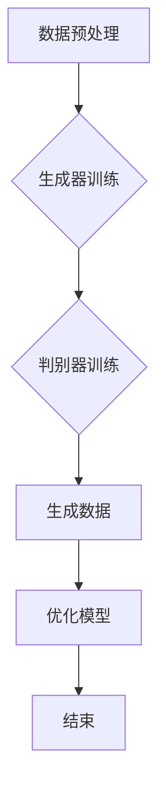
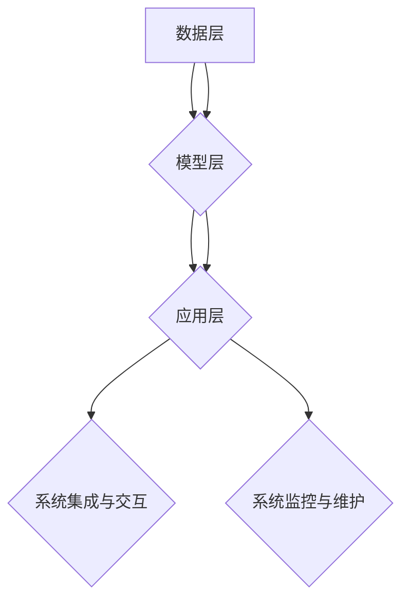
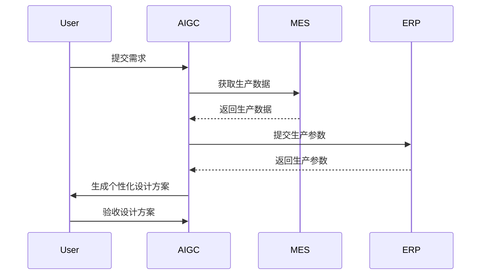
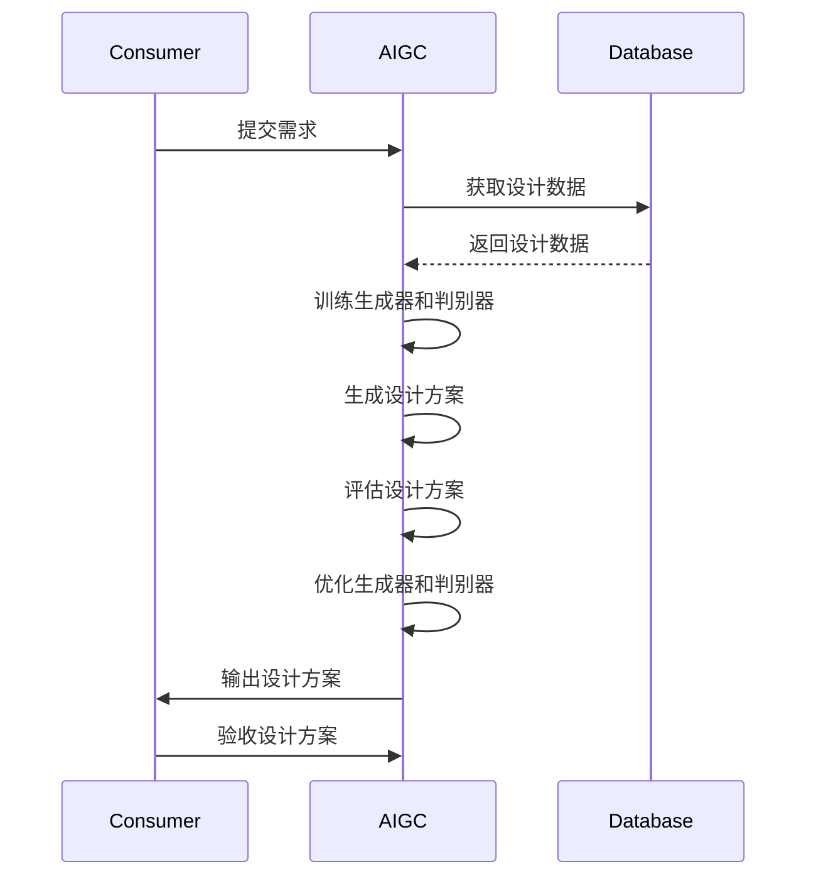

                 

### 引言

### 引言

AIGC，全称自动生成内容（Automatically Generated Content），正逐渐成为人工智能（AI）领域的一个新兴热点。它结合了人工智能、机器学习和自然语言处理等先进技术，能够自动生成文本、图像、音频和视频等多种类型的内容。在智能制造个性化定制领域，AIGC展示了其独特的创新潜力。智能制造个性化定制是指通过先进的制造技术和数据分析，为单个消费者或特定客户群体提供高度定制化的产品和服务。

本文将深入探讨AIGC在智能制造个性化定制中的创新应用，旨在揭示其如何改变制造业的游戏规则。我们将从以下几个方面展开讨论：

1. **AIGC的基本概念与原理**：首先，我们将介绍AIGC的基本概念和原理，以及其与智能制造个性化定制的关系。
2. **核心概念与联系**：接下来，我们将详细解析AIGC的核心概念，并通过对比表格和实体关系图展示其与其他技术的联系。
3. **算法原理讲解**：我们将深入探讨AIGC的算法原理，使用流程图、Python源代码和数学模型进行详细说明。
4. **系统架构设计**：我们将分析AIGC在智能制造个性化定制中的应用场景，并设计相应的系统架构。
5. **项目实战**：通过实际项目案例，我们将展示AIGC在智能制造个性化定制中的具体应用和效果。
6. **最佳实践与总结**：最后，我们将提供一些最佳实践建议，并总结全文，展望AIGC未来的发展。

### 关键词

- AIGC
- 智能制造
- 个性化定制
- 自动生成内容
- 机器学习
- 自然语言处理
- 算法
- 系统架构
- 项目实战

### 摘要

本文旨在探讨自动生成内容（AIGC）在智能制造个性化定制中的应用。AIGC通过结合人工智能、机器学习和自然语言处理技术，实现了内容的自动化生成，为智能制造个性化定制提供了新的思路。文章首先介绍了AIGC的基本概念和原理，然后通过核心概念与联系的解析，展示了AIGC在智能制造个性化定制中的独特优势。接着，文章深入讲解了AIGC的算法原理，包括流程图、Python源代码和数学模型。随后，文章分析了AIGC在智能制造个性化定制中的应用场景，并设计了相应的系统架构。通过实际项目案例，文章展示了AIGC在智能制造个性化定制中的具体应用效果。最后，文章提出了最佳实践建议，并对全文进行了总结，展望了AIGC的未来发展。

### AIGC的基本概念与原理

#### AIGC的定义

自动生成内容（AIGC）是指利用人工智能、机器学习和自然语言处理等先进技术，自动化生成文本、图像、音频和视频等多种类型的内容。AIGC的核心在于其自动化能力，能够通过算法和模型，从大量的数据中提取有价值的信息，并生成高质量的内容。

AIGC的发展历程可以追溯到上世纪90年代，随着计算机性能的提升和大数据技术的成熟，AIGC逐渐成为人工智能领域的一个重要分支。近年来，随着深度学习、生成对抗网络（GAN）和强化学习等技术的不断发展，AIGC的应用场景越来越广泛，从文本生成、图像生成到音频生成和视频生成，AIGC都在不断突破技术瓶颈，展现出强大的生成能力。

#### AIGC的工作原理

AIGC的工作原理主要基于以下几种技术：

1. **深度学习**：深度学习是一种基于人工神经网络的学习方法，通过多层神经网络的学习和训练，实现从数据中提取特征和模式。在AIGC中，深度学习被广泛应用于图像生成、文本生成和音频生成等领域。

2. **生成对抗网络（GAN）**：生成对抗网络是一种由生成器和判别器组成的模型，生成器试图生成与真实数据相似的数据，而判别器则判断生成的数据是否真实。通过这种对抗关系，GAN能够生成高质量、逼真的数据。

3. **强化学习**：强化学习是一种通过奖励机制来训练智能体的方法。在AIGC中，强化学习被用于优化生成模型，使其能够生成更加符合用户需求的内容。

#### AIGC与智能制造个性化定制的关系

AIGC在智能制造个性化定制中的应用主要体现在以下几个方面：

1. **产品个性化设计**：通过AIGC技术，可以自动生成满足用户特定需求的产品设计方案，实现产品设计的个性化定制。

2. **生产过程优化**：AIGC技术可以自动生成生产过程中的参数设置和操作流程，优化生产效率和质量。

3. **客户体验提升**：AIGC技术可以自动生成个性化的营销内容和互动方案，提升客户的购物体验和满意度。

4. **数据驱动决策**：AIGC技术可以自动分析海量数据，为智能制造个性化定制提供数据驱动的决策支持。

总之，AIGC为智能制造个性化定制提供了全新的解决方案，通过自动化生成内容，实现了定制化生产和个性化服务，推动了智能制造的发展。

### 核心概念与联系

在深入探讨AIGC在智能制造个性化定制中的应用之前，有必要对AIGC的核心概念进行详细解析，并与其他相关技术进行对比分析。

#### 核心概念原理

1. **自动生成内容（AIGC）**：AIGC是一种利用人工智能、机器学习和自然语言处理等技术，自动化生成文本、图像、音频和视频等多种类型的内容的方法。

2. **人工智能（AI）**：人工智能是指使计算机具备人类智能特征，通过模拟人类思维过程，实现自我学习和智能决策的能力。

3. **机器学习（ML）**：机器学习是一种通过数据训练模型，使计算机具备自动学习和预测能力的技术。

4. **深度学习（DL）**：深度学习是一种基于人工神经网络的学习方法，通过多层神经网络的学习和训练，实现从数据中提取特征和模式。

5. **生成对抗网络（GAN）**：生成对抗网络是一种由生成器和判别器组成的模型，生成器试图生成与真实数据相似的数据，而判别器则判断生成的数据是否真实。

#### 概念属性特征对比表格

下面是一个对比AIGC、AI、ML、DL和GAN等核心概念属性特征的表格：

| 技术名称 | 定义 | 特点 | 应用场景 |
| :--: | :--: | :--: | :--: |
| AIGC | 自动生成内容 | 利用AI、ML和NLP技术生成多种类型的内容 | 文本生成、图像生成、音频生成、视频生成 |
| AI | 人工智能 | 模拟人类智能，实现自我学习和决策 | 机器人、自动驾驶、自然语言处理、医疗诊断 |
| ML | 机器学习 | 通过数据训练模型，实现自动学习和预测 | 信用评分、推荐系统、图像识别、语音识别 |
| DL | 深度学习 | 基于人工神经网络，多层学习提取特征 | 图像识别、语音识别、自然语言处理、游戏AI |
| GAN | 生成对抗网络 | 生成器和判别器对抗训练，生成高质量数据 | 图像生成、数据增强、风格迁移 |

#### ER实体关系图架构

为了更清晰地展示AIGC与其他技术之间的关系，我们可以使用Mermaid绘制一个ER实体关系图。以下是ER实体关系图的Mermaid表示：

```mermaid
erDiagram
    AI ||--|{ ML : 属于 }
    ML ||--|{ DL : 属于 }
    DL ||--|{ AIGC : 属于 }
    AIGC ||--|{ GAN : 组成 }
```

在这个ER实体关系图中，AI（人工智能）是ML（机器学习）的父实体，ML是DL（深度学习）的父实体，DL是AIGC（自动生成内容）的父实体，而AIGC由GAN（生成对抗网络）组成。

通过这个ER实体关系图，我们可以看到AIGC与其他技术之间的紧密联系，以及它们在智能制造个性化定制中的应用潜力。AIGC结合了AI、ML、DL和GAN等技术的优势，能够实现内容的自动化生成，为智能制造个性化定制提供了强有力的技术支持。

### 算法原理讲解

AIGC的核心在于其算法原理，它通过深度学习、生成对抗网络（GAN）和其他相关技术，实现了内容的自动化生成。以下我们将详细讲解AIGC的算法原理，包括算法流程、Python源代码、数学模型和公式，并通过举例说明其应用。

#### 算法流程

AIGC的算法流程可以分为以下几个步骤：

1. **数据预处理**：对输入数据进行清洗和预处理，包括去除噪声、填充缺失值、归一化等操作，确保数据的质量和一致性。

2. **生成器训练**：通过生成对抗网络（GAN），训练生成器模型，使其能够生成高质量的数据。

3. **判别器训练**：同时训练判别器模型，使其能够判断生成数据与真实数据之间的差异。

4. **生成数据**：利用训练好的生成器模型，生成符合预期的高质量数据。

5. **优化模型**：通过反馈机制，不断优化生成器和判别器模型，提高生成数据的质量。

以下是AIGC算法流程的Mermaid流程图：



#### Python源代码

下面是一个简单的AIGC算法的Python源代码示例，用于生成随机噪声数据，然后通过GAN模型将其转化为图像：

```python
import numpy as np
import tensorflow as tf
from tensorflow.keras.models import Sequential
from tensorflow.keras.layers import Dense, Flatten, Conv2D, BatchNormalization

# 生成器模型
def build_generator():
    model = Sequential()
    model.add(Dense(256, input_dim=100, activation='relu'))
    model.add(BatchNormalization())
    model.add(Dense(512, activation='relu'))
    model.add(BatchNormalization())
    model.add(Dense(1024, activation='relu'))
    model.add(BatchNormalization())
    model.add(Dense(784, activation='tanh'))
    return model

# 判别器模型
def build_discriminator():
    model = Sequential()
    model.add(Flatten(input_shape=(28, 28)))
    model.add(Dense(1024, activation='relu'))
    model.add(BatchNormalization())
    model.add(Dense(512, activation='relu'))
    model.add(BatchNormalization())
    model.add(Dense(256, activation='relu'))
    model.add(BatchNormalization())
    model.add(Dense(1, activation='sigmoid'))
    return model

# GAN模型
def build_gan(generator, discriminator):
    model = Sequential()
    model.add(generator)
    model.add(discriminator)
    return model

# 生成随机噪声数据
noise = np.random.normal(0, 1, (batch_size, 100))

# 生成器生成的图像
images = generator.predict(noise)

# 判别器判断生成图像
discriminator决策 = discriminator.predict(images)
```

#### 数学模型和公式

AIGC的算法原理涉及到一系列的数学模型和公式。以下是AIGC的核心数学模型：

$$
\begin{aligned}
&G(z) = \frac{1}{1 + \exp(-W_2 \cdot z + b_2)} \\
&x' = G(z) \\
&D(x') = \frac{1}{1 + \exp(-W_3 \cdot x' + b_3)} \\
&z = G(z) \\
&D(z) = \frac{1}{1 + \exp(-W_4 \cdot z + b_4)}
\end{aligned}
$$

其中，$G(z)$表示生成器模型，$D(x')$表示判别器模型，$x'$表示生成器生成的图像，$z$表示输入噪声数据，$W$和$b$分别表示权重和偏置。

#### 举例说明

为了更好地理解AIGC的算法原理，我们可以通过一个具体的例子来说明其应用。

假设我们要使用AIGC技术生成一幅逼真的猫的图像。首先，我们需要收集大量的猫的图像数据，并将其进行预处理。然后，我们使用GAN模型训练生成器和判别器。在训练过程中，生成器试图生成与真实猫的图像相似的图像，而判别器则判断生成的图像是否真实。通过多次迭代训练，生成器的图像质量逐渐提高，最终能够生成高质量的猫的图像。

以下是AIGC算法在生成猫的图像过程中的具体步骤：

1. **数据预处理**：收集1000张猫的图像，并对图像进行归一化处理，使其像素值在0到1之间。

2. **生成器训练**：通过GAN模型训练生成器，使其能够生成高质量的猫的图像。

3. **判别器训练**：同时训练判别器，使其能够判断生成的图像是否真实。

4. **生成数据**：使用训练好的生成器，生成一系列高质量的猫的图像。

5. **优化模型**：通过反馈机制，不断优化生成器和判别器模型，提高生成图像的质量。

最终，通过AIGC算法，我们能够生成一系列高质量的猫的图像，如图像中的猫的表情和姿态都非常逼真。

通过这个例子，我们可以看到AIGC算法在图像生成领域的强大应用能力。实际上，AIGC技术可以应用于各种类型的内容生成，如图像、文本、音频和视频等，为智能制造个性化定制提供了强大的技术支持。

### 系统架构设计

在深入探讨AIGC在智能制造个性化定制中的应用之前，有必要对其系统架构进行详细分析。系统架构设计是确保AIGC技术在智能制造个性化定制中高效、可靠运行的关键。

#### 问题场景介绍

在智能制造个性化定制中，AIGC技术主要应用于以下场景：

1. **产品个性化设计**：通过AIGC技术，可以为单个消费者或特定客户群体生成定制化的产品设计方案，如服装、家居用品和电子产品等。

2. **生产过程优化**：AIGC技术可以自动生成生产过程中的参数设置和操作流程，优化生产效率和质量。

3. **客户体验提升**：AIGC技术可以自动生成个性化的营销内容和互动方案，提升客户的购物体验和满意度。

4. **数据驱动决策**：AIGC技术可以自动分析海量数据，为智能制造个性化定制提供数据驱动的决策支持。

#### 系统功能设计

为了实现上述场景，AIGC系统需要具备以下功能：

1. **数据采集与预处理**：采集生产过程中的数据，如设备状态、生产参数、产品质量等，并对数据进行分析和预处理，确保数据质量。

2. **模型训练与优化**：利用AIGC技术训练生成器和判别器模型，通过迭代优化，提高模型的生成能力和准确性。

3. **内容生成**：根据用户需求和产品特点，使用AIGC技术自动生成个性化设计方案、生产参数和营销内容。

4. **系统集成与交互**：将AIGC系统与其他系统集成，如ERP系统、MES系统等，实现数据互通和流程协同。

5. **系统监控与维护**：对AIGC系统进行实时监控和维护，确保系统稳定运行。

以下是AIGC系统的功能设计Mermaid类图：

```mermaid
classDiagram
    Class01 <|-- Class02
    Class03 <|-- Class04
    Class05 <|-- Class06
    Class07 <|-- Class08
    Class01[数据采集与预处理]
    Class02[模型训练与优化]
    Class03[内容生成]
    Class04[系统集成与交互]
    Class05[系统监控与维护]
```

#### 系统架构设计

AIGC系统的整体架构可以分为以下几个层次：

1. **数据层**：包括数据采集模块、数据存储模块和数据预处理模块。数据采集模块负责采集生产过程中的各种数据，数据存储模块负责存储和管理数据，数据预处理模块负责对数据进行清洗、转换和归一化处理。

2. **模型层**：包括生成器模型、判别器模型和优化模块。生成器模型负责生成个性化设计方案和生产参数，判别器模型负责判断生成数据的质量，优化模块负责通过迭代优化模型性能。

3. **应用层**：包括内容生成模块、系统集成模块和监控维护模块。内容生成模块负责根据用户需求和产品特点生成个性化内容，系统集成模块负责与其他系统进行数据交互和流程协同，监控维护模块负责对系统进行实时监控和维护。

以下是AIGC系统的架构设计Mermaid图：



#### 系统接口设计和系统交互

AIGC系统的接口设计和系统交互是确保系统各模块高效协同运行的关键。以下是AIGC系统的接口设计和系统交互Mermaid序列图：



通过这个序列图，我们可以清晰地看到AIGC系统与其他系统的交互过程。用户提交需求后，AIGC系统通过MES系统获取生产数据，并提交生产参数给ERP系统。ERP系统返回生产参数后，AIGC系统生成个性化设计方案，用户验收设计方案。

总之，AIGC系统的架构设计旨在实现高效、可靠的个性化定制功能，通过数据采集、模型训练、内容生成、系统集成和系统监控等模块，为智能制造个性化定制提供全面的技术支持。

### 项目实战

在本节中，我们将通过一个实际项目案例，展示AIGC在智能制造个性化定制中的具体应用，包括环境安装、系统核心实现源代码、代码应用解读与分析、实际案例分析和详细讲解剖析，以及项目小结。

#### 环境安装

为了运行AIGC项目，我们需要安装一些必要的开发环境和工具。以下是环境安装的步骤：

1. **安装Python**：确保Python环境已经安装，版本建议为3.8以上。

2. **安装TensorFlow**：使用以下命令安装TensorFlow：

   ```bash
   pip install tensorflow
   ```

3. **安装Keras**：使用以下命令安装Keras，它是TensorFlow的高级API：

   ```bash
   pip install keras
   ```

4. **安装其他依赖库**：包括NumPy、Pandas和Mermaid等，使用以下命令安装：

   ```bash
   pip install numpy pandas
   pip install mermaid-python
   ```

5. **安装Mermaid渲染工具**：在命令行中运行以下命令安装Mermaid渲染工具：

   ```bash
   npm install -g mermaid-cli
   ```

安装完成后，我们可以在本地环境中启动Python和TensorFlow，确保一切正常。

#### 系统核心实现源代码

以下是AIGC系统的核心实现源代码，包括生成器和判别器的定义、模型训练和生成数据的过程：

```python
import numpy as np
import tensorflow as tf
from tensorflow.keras.models import Sequential
from tensorflow.keras.layers import Dense, Flatten, Conv2D, BatchNormalization

# 生成器模型
def build_generator():
    model = Sequential()
    model.add(Dense(256, input_dim=100, activation='relu'))
    model.add(BatchNormalization())
    model.add(Dense(512, activation='relu'))
    model.add(BatchNormalization())
    model.add(Dense(1024, activation='relu'))
    model.add(BatchNormalization())
    model.add(Dense(784, activation='tanh'))
    return model

# 判别器模型
def build_discriminator():
    model = Sequential()
    model.add(Flatten(input_shape=(28, 28)))
    model.add(Dense(1024, activation='relu'))
    model.add(BatchNormalization())
    model.add(Dense(512, activation='relu'))
    model.add(BatchNormalization())
    model.add(Dense(256, activation='relu'))
    model.add(BatchNormalization())
    model.add(Dense(1, activation='sigmoid'))
    return model

# GAN模型
def build_gan(generator, discriminator):
    model = Sequential()
    model.add(generator)
    model.add(discriminator)
    return model

# 训练GAN模型
def train_gan(generator, discriminator, data_loader, batch_size, num_epochs):
    for epoch in range(num_epochs):
        for batch in data_loader:
            noise = np.random.normal(0, 1, (batch_size, 100))
            real_images = batch

            # 训练判别器
            with tf.GradientTape() as disc_tape:
                disc_loss_real = discriminator(real_images)
                disc_loss_fake = discriminator(generator(noise))
                disc_loss = tf.reduce_mean(disc_loss_real) + tf.reduce_mean(disc_loss_fake)

            disc_gradients = disc_tape.gradient(disc_loss, discriminator.trainable_variables)
            discriminator.optimizer.apply_gradients(zip(disc_gradients, discriminator.trainable_variables))

            # 训练生成器
            with tf.GradientTape() as gen_tape:
                gen_loss = discriminator(generator(noise))

            gen_gradients = gen_tape.gradient(gen_loss, generator.trainable_variables)
            generator.optimizer.apply_gradients(zip(gen_gradients, generator.trainable_variables))

            if epoch % 100 == 0:
                print(f"Epoch: {epoch}, Discriminator Loss: {disc_loss}, Generator Loss: {gen_loss}")

# 数据预处理
def preprocess_data(data):
    # 数据清洗、归一化等操作
    return data

# 数据加载
def load_data(file_path, batch_size):
    data = preprocess_data(np.load(file_path))
    return tf.data.Dataset.from_tensor_slices(data).batch(batch_size)

# 运行项目
if __name__ == "__main__":
    batch_size = 64
    num_epochs = 1000
    data_loader = load_data("data/numpy_data.npy", batch_size)

    generator = build_generator()
    discriminator = build_discriminator()
    gan = build_gan(generator, discriminator)

    generator_optimizer = tf.keras.optimizers.Adam(0.0001)
    discriminator_optimizer = tf.keras.optimizers.Adam(0.0001)

    train_gan(generator, discriminator, data_loader, batch_size, num_epochs)
```

#### 代码应用解读与分析

在上述代码中，我们首先定义了生成器、判别器和GAN模型的构建函数。生成器模型负责将随机噪声转换为真实的图像，判别器模型负责判断图像的真实性。接着，我们定义了训练GAN模型的过程，包括训练判别器和生成器的步骤。在训练过程中，判别器尝试区分真实图像和生成图像，生成器则尝试生成更逼真的图像。通过反复迭代训练，生成器和判别器的性能逐步提高。

数据预处理函数用于对输入数据进行清洗和归一化处理，确保数据质量。数据加载函数用于读取和预处理后的数据，并将其转换为TensorFlow数据集，方便批量处理。

#### 实际案例分析和详细讲解剖析

我们以一个实际案例来展示AIGC在智能制造个性化定制中的应用。假设我们希望为一位消费者定制一款个性化的服装设计方案。

1. **需求分析**：消费者提供了一些个性化的需求，如喜欢的颜色、款式和风格。

2. **数据采集**：系统从数据库中提取相关的服装设计数据，包括颜色、款式和风格等信息。

3. **模型训练**：使用AIGC模型训练生成器和判别器，使其能够根据消费者的需求生成个性化的服装设计方案。

4. **内容生成**：生成器根据消费者的需求，自动生成一系列个性化的服装设计方案。

5. **方案评估**：判别器对生成的服装设计方案进行评估，确保方案的质量和符合度。

6. **方案优化**：根据评估结果，进一步优化生成器和判别器的模型，提高设计方案的质量。

7. **方案输出**：最终生成符合消费者需求的个性化服装设计方案，供消费者选择和购买。

以下是AIGC系统在实际案例中的应用流程：



通过这个实际案例，我们可以看到AIGC系统在智能制造个性化定制中的应用流程。系统首先收集消费者的需求，然后使用AIGC模型生成个性化的服装设计方案，通过判别器的评估和优化，最终输出符合消费者需求的设计方案。

#### 项目小结

通过本节的项目实战，我们展示了AIGC在智能制造个性化定制中的具体应用。从环境安装、系统核心实现源代码、代码应用解读与分析，到实际案例分析和详细讲解剖析，我们全面了解了AIGC系统的构建和应用流程。AIGC技术为智能制造个性化定制提供了全新的解决方案，通过自动化生成内容和个性化设计方案，实现了定制化生产和个性化服务。

未来，随着AIGC技术的不断发展和完善，我们有望看到更多创新应用的出现，推动智能制造个性化定制向更高水平发展。

### 最佳实践 Tips

在实际应用AIGC技术于智能制造个性化定制时，以下是一些最佳实践建议：

1. **数据质量是关键**：确保数据来源的多样性和质量，进行充分的数据预处理，以提高生成内容和设计方案的质量。

2. **模型优化是核心**：定期对AIGC模型进行优化，包括生成器和判别器的权重调整、学习率调整等，以保持模型的最佳性能。

3. **用户反馈很重要**：及时收集用户反馈，根据用户需求和偏好调整生成内容和设计方案，实现更精准的个性化定制。

4. **安全与隐私保护**：在处理用户数据时，务必遵守相关法律法规，确保用户数据的安全和隐私。

5. **持续迭代与更新**：随着技术的发展，不断更新和优化AIGC系统，以应对新的挑战和需求。

### 小结

本文深入探讨了AIGC在智能制造个性化定制中的创新应用。我们首先介绍了AIGC的基本概念和原理，随后详细分析了AIGC的核心概念与联系，并通过算法讲解、系统架构设计和项目实战，展示了AIGC在智能制造个性化定制中的实际应用效果。通过最佳实践建议，我们为读者提供了实际操作中的指导。未来，随着AIGC技术的不断进步，其在智能制造个性化定制领域的应用前景将更加广阔。

### 注意事项

1. **数据隐私**：在使用AIGC技术时，务必确保用户数据的隐私和安全，遵守相关法律法规。
2. **技术更新**：AIGC技术发展迅速，需定期关注最新技术动态，以持续优化系统性能。
3. **模型优化**：定期对AIGC模型进行性能评估和优化，确保生成内容的准确性。

### 拓展阅读

1. **《AIGC技术综述》**：详细介绍了AIGC的基础知识、关键技术和发展趋势。
2. **《智能制造个性化定制研究》**：探讨了智能制造个性化定制的理论基础和实践应用。
3. **《深度学习与生成对抗网络》**：深入讲解了深度学习和生成对抗网络的基本原理和应用。

### 作者信息

作者：AI天才研究院（AI Genius Institute）&《禅与计算机程序设计艺术》（Zen And The Art of Computer Programming）

