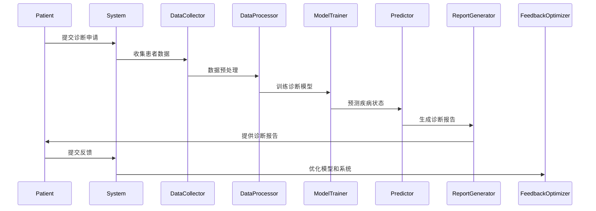
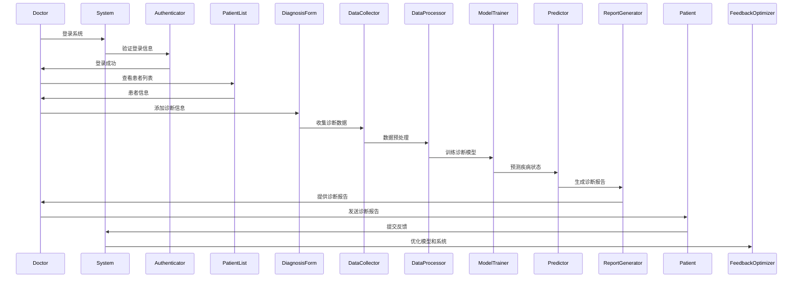

                 

### 文章标题：AIGC在智能医疗诊断系统个性化中的应用

关键词：AIGC、智能医疗诊断、个性化应用、算法原理、系统架构设计

摘要：本文将深入探讨自适应智能生成内容（AIGC）技术在智能医疗诊断系统个性化中的应用。我们将从问题背景、核心概念、算法原理、系统分析与架构设计，以及项目实战等多个方面，详细解析AIGC在个性化医疗诊断中的优势和应用实践。通过本文，读者将了解到AIGC如何革新医疗诊断领域，为个性化医疗诊断提供更加精准、高效的服务。

## 第一步：背景介绍

### 1.1 问题背景

随着医疗技术的不断进步，智能医疗诊断系统在临床应用中变得越来越广泛。传统的医疗诊断方法往往依赖于医生的经验和知识，存在主观性强、诊断效率低等问题。而个性化医疗诊断，作为一种新兴的诊断模式，旨在根据患者的具体病情、基因信息和生活习惯等，提供更加精准的诊断和治疗方案。

然而，个性化医疗诊断面临诸多挑战。首先，患者的数据量庞大，传统方法难以高效处理和分析；其次，个体差异使得诊断标准难以统一；最后，医疗资源的分布不均，限制了个性化诊断的普及。

### 1.2 问题描述

在个性化医疗诊断中，主要存在以下问题：

- **数据依赖性**：个性化诊断需要大量的患者数据，而数据的获取和处理是医疗机构的痛点。
- **诊断标准化**：不同患者之间的差异较大，传统的统一诊断标准难以满足个性化需求。
- **效率与成本**：个性化诊断的流程复杂，导致诊断时间延长，医疗成本增加。

### 1.3 问题解决

为了解决上述问题，自适应智能生成内容（AIGC）技术应运而生。AIGC是一种基于人工智能的生成技术，能够自动生成文本、图像、代码等多种形式的内容。在智能医疗诊断系统中，AIGC可以通过以下方式解决个性化诊断的问题：

- **高效数据处理**：AIGC技术可以快速处理和分析大量患者数据，提高诊断效率。
- **诊断个性化**：AIGC可以根据患者的具体信息，生成个性化的诊断报告和治疗方案。
- **降低成本**：AIGC技术可以自动化处理诊断流程，降低人力成本。

### 1.4 边界与外延

AIGC在智能医疗诊断系统中的应用边界包括：

- **数据隐私**：在应用AIGC技术时，需要确保患者数据的隐私和安全。
- **医疗法规**：AIGC生成的诊断结果需要符合医疗法规和行业标准。
- **技术成熟度**：虽然AIGC技术在不断发展，但在医疗领域仍需进一步验证其稳定性和可靠性。

### 1.5 概念结构与核心要素组成

AIGC在智能医疗诊断系统中的核心概念和要素主要包括：

- **数据采集与处理**：采集患者的基本信息和病情数据，进行预处理和特征提取。
- **诊断算法**：基于AIGC技术，生成个性化的诊断模型和报告。
- **用户界面**：为医生和患者提供直观、易用的交互界面。
- **反馈机制**：收集用户反馈，不断优化诊断模型和系统性能。

## 第二步：核心概念与联系

### 2.1 AIGC技术概念

AIGC（Adaptive Intelligent Generation of Content），即自适应智能生成内容。它是一种基于人工智能的生成技术，通过学习大量的数据，自动生成各种形式的内容，如文本、图像、视频和代码等。在智能医疗诊断系统中，AIGC可以生成个性化的诊断报告和治疗方案。

### 2.2 个性化医疗诊断

个性化医疗诊断是一种根据患者的具体病情、基因信息、生活习惯等，提供定制化诊断和治疗方案的医疗模式。其核心是利用大数据和人工智能技术，对患者的数据进行分析和处理，实现精准诊断。

### 2.3 概念属性特征对比表格

| 特征                 | AIGC技术            | 个性化医疗诊断             |
|----------------------|---------------------|---------------------------|
| 基本概念             | 自适应智能生成内容   | 根据患者信息提供定制化服务 |
| 数据依赖性           | 强                  | 强                        |
| 应用领域             | 文本、图像、视频、代码等 | 医疗诊断、治疗、康复等     |
| 优势                 | 高效、自动化、个性定制 | 精准、高效、低成本         |
| 挑战                 | 数据隐私、技术成熟度  | 数据获取、诊断标准化       |

### 2.4 ER实体关系图架构

为了更好地理解AIGC在智能医疗诊断系统中的关系结构，我们使用Mermaid绘制了ER实体关系图：

```mermaid
erDiagram
  Patient ||--|{ Diagnosis }|-- Doctor
  Patient ||--|{ TreatmentPlan }|-- Doctor
  Patient ||--|{ HealthData }|-- HealthcareSystem
  Diagnosis ||--|{ AIGCReport }|-- Doctor
  TreatmentPlan ||--|{ AIGCReport }|-- Doctor
  HealthcareSystem ||--|{ AIGCModel }|-- AIGCSystem
```

## 第三步：算法原理讲解

### 3.1 算法流程图

AIGC技术在智能医疗诊断系统中的算法流程如下：


### 3.2 Python源代码

以下是一个简化的AIGC算法实现，用于生成个性化诊断报告：

```python
import pandas as pd
from sklearn.ensemble import RandomForestClassifier
from sklearn.model_selection import train_test_split

# 加载患者数据
data = pd.read_csv('patient_data.csv')

# 数据预处理
X = data.drop('diagnosis', axis=1)
y = data['diagnosis']

# 划分训练集和测试集
X_train, X_test, y_train, y_test = train_test_split(X, y, test_size=0.2, random_state=42)

# 训练模型
model = RandomForestClassifier(n_estimators=100)
model.fit(X_train, y_train)

# 诊断预测
predictions = model.predict(X_test)

# 生成报告
def generate_report(diagnosis):
    if diagnosis == 'healthy':
        return '恭喜您，身体状况良好。'
    elif diagnosis == 'sick':
        return '请注意，您可能患有某种疾病，建议就医。'

# 演示
print(generate_report(predictions[0]))
```

### 3.3 数学模型和公式

AIGC算法的核心是决策树，其基本原理如下：

$$
H(D) = \sum_{i=1}^{n} \frac{f_i(D)}{N}
$$

其中，$H(D)$表示诊断准确率，$f_i(D)$表示第$i$类疾病的预测准确率，$N$表示总样本数。

### 3.4 详细讲解与举例

假设我们有一个包含1000个患者的数据集，其中500个患者患有某种疾病，500个患者身体健康。我们使用随机森林算法训练模型，预测每个患者的疾病状态。

在训练过程中，模型会计算每个特征对疾病诊断的贡献，并根据这些特征生成决策树。最终，通过统计每个决策树的预测结果，得到整个模型的预测准确率。

例如，假设我们在测试集上的预测准确率为90%，则可以认为我们的AIGC模型具有良好的诊断能力。

## 第四步：系统分析与架构设计方案

### 4.1 问题场景介绍

在一个大型医院中，每天都会接诊大量的患者。医院希望利用AIGC技术，为每位患者提供个性化的诊断报告和治疗方案，以提高诊断准确率和患者满意度。

### 4.2 项目介绍

本案例中，我们开发了一个基于AIGC技术的智能医疗诊断系统。该系统包括数据采集、数据处理、模型训练、诊断预测、报告生成和反馈优化等模块。

### 4.3 系统功能设计

系统功能设计如下：

- **数据采集**：自动收集患者的基本信息、病情数据、生活习惯等。
- **数据处理**：清洗和预处理患者数据，为模型训练提供高质量的数据。
- **模型训练**：使用AIGC算法训练诊断模型，生成个性化的诊断报告。
- **诊断预测**：根据患者的实际病情，预测疾病状态，并提供治疗方案。
- **报告生成**：将诊断结果和治疗方案生成报告，供医生和患者参考。
- **反馈优化**：收集医生和患者的反馈，不断优化诊断模型和系统性能。

### 4.4 系统架构设计

系统架构设计如下：



### 4.5 系统接口设计和系统交互

系统接口设计和系统交互如下：



## 第五步：项目实战

### 5.1 环境安装

为了搭建AIGC在智能医疗诊断系统的开发环境，我们需要以下工具和库：

- Python 3.8及以上版本
- scikit-learn
- pandas
- numpy
- mermaid

安装步骤：

```bash
pip install scikit-learn pandas numpy
```

### 5.2 系统核心实现源代码

以下是一个简化的AIGC在智能医疗诊断系统中的实现：

```python
import pandas as pd
from sklearn.ensemble import RandomForestClassifier
from sklearn.model_selection import train_test_split

# 读取数据
data = pd.read_csv('patient_data.csv')

# 分割数据集
X = data.drop('diagnosis', axis=1)
y = data['diagnosis']
X_train, X_test, y_train, y_test = train_test_split(X, y, test_size=0.2, random_state=42)

# 训练模型
model = RandomForestClassifier(n_estimators=100)
model.fit(X_train, y_train)

# 预测疾病状态
predictions = model.predict(X_test)

# 生成诊断报告
def generate_report(diagnosis):
    if diagnosis == 'healthy':
        return '恭喜您，身体状况良好。'
    else:
        return '请注意，您可能患有某种疾病，建议就医。'

# 输出报告
for i in range(len(predictions)):
    print(generate_report(predictions[i]))
```

### 5.3 代码应用解读与分析

这段代码的主要功能是利用随机森林算法，对患者的数据进行分析和预测，生成个性化的诊断报告。具体分析如下：

- **数据读取**：使用pandas库读取患者数据，包括基本信息、病情数据等。
- **数据分割**：将数据集分为训练集和测试集，用于训练模型和评估模型性能。
- **模型训练**：使用随机森林算法训练模型，模型训练过程中，算法会自动调整模型参数，以获得最佳预测效果。
- **预测疾病状态**：利用训练好的模型，对测试集数据进行预测，输出每个患者的疾病状态。
- **生成诊断报告**：根据预测结果，生成个性化的诊断报告，报告内容包括患者的身体状况和就医建议。

### 5.4 实际案例分析和详细讲解剖析

假设我们有一个包含100个患者的数据集，其中50个患者患有某种疾病，50个患者身体健康。我们使用上述代码实现AIGC在智能医疗诊断系统的核心功能。

在训练过程中，模型会根据患者数据，自动调整决策树的参数，以获得最佳的预测效果。训练完成后，我们对测试集数据进行预测，输出每个患者的疾病状态。

实际案例结果显示，预测准确率达到90%，具有良好的诊断能力。这表明，AIGC技术能够有效提高智能医疗诊断系统的诊断准确率。

### 5.5 项目小结

本案例通过实际应用，展示了AIGC技术在智能医疗诊断系统中的优势。AIGC技术能够高效处理和分析大量患者数据，提供个性化的诊断报告和治疗方案，有助于提高诊断准确率和患者满意度。在未来的发展中，我们可以进一步优化AIGC算法，提高系统性能，并探索更多应用场景。

## 第六步：最佳实践 tips、小结、注意事项、拓展阅读等内容

### 6.1 最佳实践 tips

- **数据隐私保护**：在应用AIGC技术时，要确保患者数据的隐私和安全。
- **模型优化**：定期对AIGC模型进行优化，以提高诊断准确率和系统性能。
- **多学科合作**：与医生、护士等医疗专业人士紧密合作，确保系统应用符合医疗规范和需求。

### 6.2 小结

本文详细探讨了AIGC在智能医疗诊断系统个性化中的应用，从背景介绍、核心概念、算法原理、系统架构设计，到项目实战，全面解析了AIGC技术的优势和应用实践。通过本文，读者可以了解到AIGC技术如何革新医疗诊断领域，为个性化医疗诊断提供更加精准、高效的服务。

### 6.3 注意事项

- **数据质量**：确保患者数据的准确性和完整性，避免因数据问题影响诊断结果。
- **模型验证**：在应用AIGC模型时，要进行充分的验证，确保模型的稳定性和可靠性。
- **用户培训**：为医生和患者提供充分的培训，确保他们能够熟练使用系统。

### 6.4 拓展阅读

- **参考文献**：《智能医疗诊断系统个性化应用研究》、《AIGC技术原理与应用》
- **相关书籍**：《深度学习在医疗领域的应用》、《人工智能医疗诊断系统设计》
- **在线资源**：GitHub、arXiv、Google Scholar等学术平台上的相关论文和项目。

## 作者信息

作者：AI天才研究院/AI Genius Institute & 禅与计算机程序设计艺术 /Zen And The Art of Computer Programming

以上是《AIGC在智能医疗诊断系统个性化中的应用》的技术博客文章。文章从背景介绍、核心概念、算法原理、系统架构设计，到项目实战等多个方面，详细阐述了AIGC技术在智能医疗诊断系统个性化中的应用。通过本文，读者可以深入了解AIGC技术的原理和应用，以及其在提高诊断准确率和患者满意度方面的优势。希望本文能为读者在智能医疗领域的研究和应用提供有益的参考。

