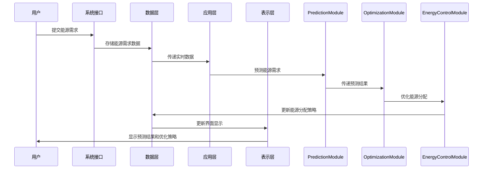
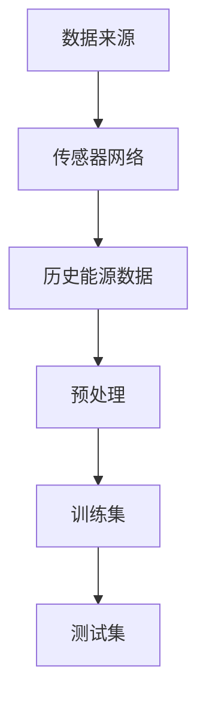

                 

### 引言

智能城市的概念正在逐渐深入人心，它不仅是一个现代化的城市管理理念，更是未来城市发展的重要趋势。智能城市通过先进的信息技术和物联网技术，实现城市管理的智能化和高效化，从而提高居民生活质量，减少资源浪费，增强城市竞争力。而在智能城市的众多应用场景中，能源分配无疑是一个关键领域。

能源是现代社会运转的基石，而城市能源分配的效率和可持续性直接关系到城市的可持续发展。传统的城市能源分配系统往往依赖于人工调度和经验管理，效率低下且容易出现资源浪费和能源短缺的问题。随着大数据、人工智能等技术的不断发展，尤其是自适应智能生成计算（Adaptive Intelligent Generation Computing，简称AIGC）的兴起，为城市能源分配提供了一种全新的解决方案。

AIGC是一种融合了人工智能、大数据和生成模型的计算技术，具有自适应、自优化和自学习的能力。它能够通过对海量数据的学习和建模，实现能源需求的精准预测、能源效率的优化和可再生能源的最大化利用。因此，AIGC在智能城市能源分配中的应用具有巨大的潜力和现实意义。

本文旨在探讨AIGC在智能城市能源分配中的应用，通过深入分析AIGC的基本概念、核心算法原理、智能城市能源分配的数学模型、系统设计与实现，以及最佳实践和未来展望，全面解析AIGC如何提升城市能源分配的效率与可持续性。

文章将分为以下几个部分：

1. **背景与概念**：介绍智能城市能源分配的背景和挑战，以及AIGC的基本概念和其在能源分配中的应用潜力。
2. **核心技术原理**：详细讲解AIGC的核心算法原理，包括生成对抗网络（GAN）等，并分析其在智能城市能源分配中的应用。
3. **系统设计与实现**：介绍智能城市能源分配系统的设计思路和实现方法，包括系统架构、接口设计和核心实现等。
4. **项目实战**：通过一个具体的智能城市能源分配项目，展示AIGC在实际应用中的效果和实现过程。
5. **最佳实践与展望**：总结最佳实践，提出注意事项，并对AIGC在智能城市能源分配中的未来发展趋势进行展望。

通过本文的探讨，希望能够为智能城市能源分配领域的研究者和实践者提供有价值的参考，推动AIGC技术在智能城市能源分配中的应用和发展。

### 关键词

- 智能城市
- 能源分配
- AIGC
- 生成对抗网络（GAN）
- 深度学习
- 数学模型
- 系统设计
- 项目实战
- 可持续发展

### 摘要

本文探讨了自适应智能生成计算（AIGC）在智能城市能源分配中的应用。首先，介绍了智能城市和能源分配的背景及其面临的挑战，并阐述了AIGC的基本概念和核心技术原理。通过详细讲解生成对抗网络（GAN）等算法，分析了AIGC在能源需求预测、能源效率优化和可再生能源最大化利用方面的应用潜力。接着，本文介绍了智能城市能源分配系统的设计思路和实现方法，包括系统架构、接口设计和核心实现。通过一个具体的案例，展示了AIGC在实际项目中的应用效果和实现过程。最后，总结了AIGC在智能城市能源分配中的应用最佳实践，并对未来的发展趋势进行了展望。本文旨在为智能城市能源分配领域的研究者和实践者提供有价值的参考和指导。

### 第一部分：背景与概念

#### 1.1 智能城市能源分配的背景

智能城市是现代信息技术和物联网技术深度融合的产物，通过运用大数据、云计算、物联网、人工智能等先进技术，实现对城市运行的全面感知、智能处理和高效管理。能源是城市运行的重要支撑，智能城市的能源分配系统在提升能源利用效率、保障能源供应和减少环境污染方面具有重要作用。

随着城市化进程的加速和人口增长，城市能源需求不断增加。然而，传统的能源分配方式存在效率低下、资源浪费和环境污染等问题。例如，城市中不同区域和不同用户对能源的需求差异大，但传统的能源分配系统往往依赖于人工调度和经验管理，难以实现精准和高效的能源分配。此外，随着可再生能源的广泛应用，如何实现能源的优化分配和最大化利用也成为城市能源管理的重要课题。

在这样的背景下，智能城市能源分配系统应运而生。智能城市能源分配系统通过集成多种先进技术，实现能源需求的实时监测、预测和优化分配，从而提高能源利用效率，降低能源成本，促进城市可持续发展。AIGC作为一项新兴的计算技术，为智能城市能源分配提供了新的解决方案。

#### 1.2 AIGC的基本概念

自适应智能生成计算（AIGC）是一种融合了人工智能、大数据和生成模型的计算技术。它具有自适应、自优化和自学习的能力，能够通过对海量数据的学习和建模，实现对复杂系统的智能控制和优化。

AIGC的核心技术包括生成对抗网络（GAN）、变分自编码器（VAE）、强化学习等。其中，生成对抗网络（GAN）是一种基于博弈理论的模型，由生成器和判别器两个部分组成。生成器通过学习输入数据的分布，生成与真实数据相似的新数据；判别器则通过不断学习，区分真实数据和生成数据。通过两个网络的对抗训练，生成器能够生成更加逼真的数据，从而实现数据生成和建模。

变分自编码器（VAE）是一种无监督学习模型，通过编码器和解码器的联合训练，实现数据的压缩和重构。VAE在生成模型中具有较好的性能，能够生成具有高保真度的数据。

强化学习是AIGC中的重要组成部分，通过智能体在环境中的交互，不断学习和优化策略，实现最优目标。强化学习在智能城市能源分配中具有广泛应用，例如，通过智能体学习用户行为和能源需求，实现能源分配的动态优化。

#### 1.3 智能城市能源分配的关键概念

1. **能源需求预测**：
   能源需求预测是智能城市能源分配的重要环节，通过对历史数据和实时数据的分析，预测未来一段时间内的能源需求。能源需求预测的准确性直接影响到能源分配的效果。传统的预测方法主要包括时间序列分析和回归分析，而AIGC技术提供了更为精确和灵活的预测模型，如生成对抗网络（GAN）和变分自编码器（VAE）。

2. **能源效率优化**：
   能源效率优化是提高能源利用效率的关键，通过优化能源分配策略，减少能源浪费。传统的优化方法主要包括线性规划和非线性规划，而AIGC技术通过深度学习算法和强化学习，实现了更加智能和高效的能源优化。

3. **可再生能源最大化利用**：
   随着环保意识的增强和可再生能源技术的发展，如何在智能城市能源分配中最大化利用可再生能源成为重要课题。AIGC技术通过学习用户行为和能源需求，实现了可再生能源的动态分配和优化，提高了能源利用效率。

#### 1.4 AIGC与智能城市能源分配的联系

AIGC与智能城市能源分配的联系主要体现在以下几个方面：

1. **数据驱动**：
   AIGC技术基于海量数据的学习和建模，能够准确捕捉用户行为和能源需求的变化规律，为智能城市能源分配提供数据支持。

2. **自适应优化**：
   AIGC技术具有自适应和自优化的能力，能够根据实时数据和用户需求，动态调整能源分配策略，实现最优能源分配。

3. **智能化管理**：
   AIGC技术通过智能算法和模型，实现了能源分配的智能化管理，提高了能源分配的效率和可靠性。

4. **可再生能源利用**：
   AIGC技术通过学习用户行为和能源需求，实现了可再生能源的动态分配和优化，提高了可再生能源的利用效率。

总之，AIGC技术在智能城市能源分配中的应用具有巨大的潜力和现实意义，能够有效解决传统能源分配系统中的效率低下、资源浪费和环境污染等问题，为实现智能城市可持续发展提供有力支持。

### 第二部分：核心技术原理

#### 2.1 AIGC基础算法原理

自适应智能生成计算（AIGC）的核心在于其基础算法的强大功能，这些算法不仅能够处理大规模数据，还能够通过深度学习和生成模型实现自适应优化。在这一节中，我们将详细探讨AIGC中的几个核心算法，包括生成对抗网络（GAN）、变分自编码器（VAE）和强化学习，并分析它们在智能城市能源分配中的应用。

##### 2.1.1 生成对抗网络（GAN）

生成对抗网络（GAN）是AIGC中最为著名和广泛应用的算法之一。GAN由生成器（Generator）和判别器（Discriminator）两个主要部分组成，通过一个对抗性训练过程相互竞争，最终实现数据的高质量生成。

1. **生成器（Generator）**：
   生成器的目标是生成与真实数据相似的数据。在智能城市能源分配中，生成器可以用来预测未来的能源需求，从而生成一个虚拟的能源需求数据集。这个过程类似于根据历史数据和当前数据生成未来能源需求模型，以便为能源分配系统提供预测依据。

2. **判别器（Discriminator）**：
   判别器的任务是区分真实数据和生成数据。在训练过程中，判别器会尝试学习如何准确地区分真实能源需求和生成器生成的虚假需求。通过这种对抗性训练，生成器不断优化其生成策略，以欺骗判别器。

3. **对抗性训练**：
   GAN的训练过程是一个对抗性的过程。在训练中，生成器和判别器相互竞争，生成器试图生成更加真实的数据以欺骗判别器，而判别器则努力提高其区分能力。这种对抗性训练使得生成器能够逐渐生成高质量的数据，从而实现对能源需求的精准预测。

##### 2.1.2 变分自编码器（VAE）

变分自编码器（VAE）是一种无监督学习模型，通过编码器和解码器的联合训练实现数据的压缩和重构。VAE在生成模型中表现出色，能够生成高保真度的数据，并在智能城市能源分配中有着广泛的应用。

1. **编码器（Encoder）**：
   编码器的作用是将输入数据编码为一个低维的隐变量表示。在能源分配中，编码器可以学习历史能源需求和用户行为的数据特征，将其压缩为一个简化的表示。

2. **解码器（Decoder）**：
   解码器的任务是使用编码器生成的隐变量表示来重构原始数据。在能源分配中，解码器可以用来生成未来能源需求的概率分布，从而为能源系统提供预测和优化依据。

3. **变分损失函数**：
   VAE使用变分损失函数来评估模型的重构性能。这个损失函数结合了重构误差和隐变量的先验分布，确保模型生成的数据在统计学上更加合理。

##### 2.1.3 强化学习

强化学习是AIGC中的另一个关键算法，它通过智能体在环境中的交互来学习和优化策略。在智能城市能源分配中，强化学习可以用来优化能源分配策略，实现动态能源管理。

1. **智能体（Agent）**：
   智能体是执行特定任务并从环境中获得奖励的主体。在能源分配中，智能体可以是一个优化算法，它的任务是动态调整能源分配策略，以最大化总收益或最小化总成本。

2. **环境（Environment）**：
   环境是智能体执行任务的环境，它提供了当前状态和可能的动作。在能源分配中，环境可以是一个实时能源需求系统和多个能源供应源。

3. **策略（Policy）**：
   策略是智能体在特定状态下选择的行动。在能源分配中，策略可以是一个决策函数，它根据当前能源需求和供应情况决定如何分配能源。

4. **奖励函数（Reward Function）**：
   奖励函数用于评估智能体的表现。在能源分配中，奖励函数可以根据能源分配的效率、成本和可持续性等多个维度进行设计，以激励智能体优化能源分配策略。

##### 2.1.4 算法原理对比分析

1. **生成对抗网络（GAN）**：
   - **优点**：能够生成高质量的数据，适合进行数据增强和模式识别。
   - **缺点**：训练过程容易出现模式崩溃（mode collapse）问题，生成数据分布可能不够真实。

2. **变分自编码器（VAE）**：
   - **优点**：生成数据分布更加真实，适合进行数据重构和概率建模。
   - **缺点**：生成数据的视觉效果可能不如GAN，生成数据的质量相对较低。

3. **强化学习**：
   - **优点**：能够通过互动学习优化策略，适合动态和复杂的任务。
   - **缺点**：训练过程需要大量的样本数据，并且可能收敛到局部最优解。

在智能城市能源分配中，不同的算法具有各自的优势和适用场景。GAN适合进行能源需求的预测和模式识别，VAE适合进行数据重构和概率建模，而强化学习则适合进行动态能源分配策略的优化。通过结合这些算法，AIGC能够实现智能城市能源分配的全方位优化和提升。

#### 2.2 算法在智能城市能源分配中的应用

AIGC的核心算法在智能城市能源分配中有着广泛的应用，以下详细分析这些算法的应用场景和实现方法。

##### 2.2.1 能源需求预测

能源需求预测是智能城市能源分配的首要任务，AIGC中的生成对抗网络（GAN）和变分自编码器（VAE）在预测中发挥着重要作用。

1. **GAN在能源需求预测中的应用**：
   - **数据生成**：利用GAN生成虚拟的能源需求数据集，增加训练样本数量，提高模型预测的准确性。
   - **模式识别**：通过GAN训练得到的生成器和判别器，可以识别出真实能源需求中的规律和趋势，从而提高预测精度。
   - **预测流程**：利用生成器生成未来的能源需求数据，结合历史数据和实时数据，进行综合预测。

2. **VAE在能源需求预测中的应用**：
   - **数据重构**：通过VAE将历史能源需求数据编码为低维隐变量表示，然后解码为预测数据，实现数据降维和重构。
   - **概率建模**：VAE可以生成未来能源需求的概率分布，为能源分配系统提供更加灵活和多样的预测结果。
   - **预测流程**：利用编码器学习数据特征，解码器生成预测数据，结合多种数据进行综合预测。

##### 2.2.2 能源效率优化

能源效率优化是提高能源利用效率的关键，AIGC中的强化学习在动态能源管理中发挥着重要作用。

1. **强化学习在能源效率优化中的应用**：
   - **动态策略**：通过智能体在环境中的互动学习，动态调整能源分配策略，实现最优能源效率。
   - **奖励机制**：设计合适的奖励函数，激励智能体优化能源分配策略，提高能源利用效率。
   - **优化流程**：智能体根据当前状态选择最优动作，通过与环境交互学习和优化，实现能源效率的提升。

##### 2.2.3 可再生能源最大化利用

可再生能源最大化利用是智能城市能源分配的重要目标，AIGC中的生成对抗网络（GAN）和变分自编码器（VAE）在可再生能源预测和分配中发挥着重要作用。

1. **GAN在可再生能源最大化利用中的应用**：
   - **数据增强**：利用GAN生成虚拟的可再生能源数据，增加训练样本数量，提高模型预测精度。
   - **模式识别**：通过GAN训练得到的生成器和判别器，识别可再生能源中的规律和趋势，优化分配策略。
   - **优化流程**：利用生成器预测可再生能源生成情况，结合实时数据和用户需求，实现可再生能源的最大化利用。

2. **VAE在可再生能源最大化利用中的应用**：
   - **数据重构**：通过VAE将可再生能源数据编码为低维隐变量表示，然后解码为预测数据，实现数据降维和重构。
   - **概率建模**：VAE可以生成未来可再生能源的概率分布，为能源分配系统提供更加灵活和多样的预测结果。
   - **优化流程**：利用编码器学习可再生能源数据特征，解码器生成预测数据，结合多种数据进行综合预测和优化。

总之，AIGC的核心算法在智能城市能源分配中具有广泛的应用，通过结合生成对抗网络（GAN）、变分自编码器（VAE）和强化学习，能够实现能源需求的精准预测、能源效率的优化和可再生能源的最大化利用，为智能城市能源管理提供强有力的技术支持。

### 第三部分：系统设计与实现

#### 3.1 系统场景介绍

智能城市能源分配系统是一个复杂的系统，其目标是通过集成多种先进技术，实现对城市能源的实时监测、预测和优化分配。系统主要应用于智能城市的能源管理部门，旨在提高能源利用效率、降低能源成本和减少环境污染。

该系统涉及多个功能模块，包括数据采集模块、预测模块、优化模块和执行模块。数据采集模块负责从各种传感器和设备获取能源数据；预测模块利用AIGC算法对能源需求进行预测；优化模块根据预测结果和用户需求，优化能源分配策略；执行模块则将优化结果付诸实施，确保能源供应的稳定性和可靠性。

系统的主要应用场景包括：

1. **城市公共设施**：如道路照明、公共交通、城市绿化等，这些设施需要稳定的能源供应。
2. **商业和住宅区**：这些区域对能源的需求量大且具有波动性，系统需要动态调整能源分配，确保能源供应的稳定和高效。
3. **工业和制造业**：工业和制造业对能源需求具有高峰和低谷，系统需要根据生产需求进行能源优化分配。
4. **可再生能源管理**：系统需要优化可再生能源的分配，最大化其利用效率。

#### 3.2 系统功能设计

智能城市能源分配系统的功能设计主要包括以下几个方面：

1. **数据采集与处理**：
   - 数据采集模块从传感器、能源设备和用户终端获取实时能源数据。
   - 数据处理模块对采集到的数据进行清洗、去噪和归一化处理，确保数据质量。

2. **能源需求预测**：
   - 预测模块利用AIGC算法，如生成对抗网络（GAN）和变分自编码器（VAE），对未来的能源需求进行预测。
   - 预测结果将作为优化能源分配的依据，以提高能源利用效率。

3. **能源优化分配**：
   - 优化模块根据预测结果和用户需求，利用强化学习算法动态调整能源分配策略。
   - 优化目标包括最大化能源利用效率、最小化能源成本和减少环境污染。

4. **执行与监控**：
   - 执行模块根据优化结果，对能源设备进行实时控制和调整，确保能源供应的稳定和高效。
   - 监控模块对系统运行状态进行实时监控，确保系统的可靠性和安全性。

#### 3.3 系统架构设计

智能城市能源分配系统的架构设计采用分层架构，主要包括数据层、应用层和表示层。

1. **数据层**：
   - 数据层负责数据的采集、存储和处理。
   - 数据采集模块通过传感器网络实时采集能源数据，数据存储模块将数据存储在数据库中，数据处理模块对数据进行清洗和处理。

2. **应用层**：
   - 应用层包括能源需求预测模块、能源优化模块和执行模块。
   - 预测模块利用AIGC算法进行能源需求预测，优化模块根据预测结果和用户需求进行能源优化，执行模块将优化结果付诸实施。

3. **表示层**：
   - 表示层为用户提供了友好的界面，用于监控和操作能源分配系统。
   - 用户可以通过界面查看实时能源数据、预测结果和优化策略，并进行相关操作。

#### 3.4 系统接口设计

系统接口设计是确保各模块之间能够高效、稳定地进行数据交换和功能调用的重要环节。以下是系统接口设计的主要内容和原则：

1. **接口设计原则**：
   - **标准化**：接口设计遵循标准化原则，确保不同模块之间能够无缝对接。
   - **简洁性**：接口设计尽量简洁，减少冗余和复杂性，提高系统的可维护性。
   - **安全性**：接口设计要考虑数据安全和用户隐私，确保系统安全可靠。

2. **接口设计细节**：
   - **数据交换格式**：系统接口采用JSON格式进行数据交换，便于解析和处理。
   - **API设计**：系统提供RESTful API接口，方便用户和模块之间进行数据交互和功能调用。
   - **认证与授权**：接口设计包含认证和授权机制，确保只有授权用户才能访问系统资源。

#### 3.5 系统交互设计

系统交互设计通过序列图（Sequence Diagram）来展示系统内部各模块之间的交互过程。以下是一个简化的系统交互设计示例：



通过上述设计，智能城市能源分配系统实现了数据的实时采集、处理和优化分配，确保了能源供应的稳定性和高效性。各模块之间通过标准化的接口进行数据交换和功能调用，提高了系统的整体性能和可靠性。

### 第四部分：项目实战

#### 4.1 环境安装

在实际应用AIGC进行智能城市能源分配之前，我们需要搭建一个合适的技术环境。以下是具体的安装步骤和注意事项。

##### 4.1.1 硬件配置

1. **中央处理器（CPU）**：
   - 推荐使用Intel i7或以上级别的CPU，以确保处理速度和性能。

2. **内存（RAM）**：
   - 推荐配置至少16GB内存，以支持大规模数据处理和算法训练。

3. **存储（SSD）**：
   - 推荐使用至少1TB的SSD存储空间，确保系统运行时数据存储的快速读写。

4. **显卡（GPU）**：
   - 推荐使用NVIDIA GPU，如Tesla或RTX系列，以加速深度学习算法的运算。

##### 4.1.2 软件安装与配置

1. **操作系统**：
   - 推荐使用Linux操作系统，如Ubuntu 20.04 LTS，以获得更好的稳定性和性能。

2. **Python环境**：
   - 安装Python 3.8及以上版本，推荐使用Anaconda环境管理器，方便管理多个Python环境。

3. **深度学习框架**：
   - 安装TensorFlow和PyTorch，这两个框架是目前最常用的深度学习框架，可以支持AIGC算法的实现。
   - 使用以下命令进行安装：
     ```bash
     conda install tensorflow pytorch torchvision -c conda-forge
     ```

4. **其他依赖**：
   - 安装NumPy、Pandas等数据处理库，以及Matplotlib等可视化库，以支持数据分析和可视化需求。
   - 使用以下命令进行安装：
     ```bash
     conda install numpy pandas matplotlib -c conda-forge
     ```

5. **数据库**：
   - 安装MongoDB或PostgreSQL等数据库，用于存储和管理能源数据。
   - MongoDB的安装命令：
     ```bash
     sudo apt-get install mongodb
     sudo systemctl start mongodb
     sudo systemctl enable mongodb
     ```
   - PostgreSQL的安装命令：
     ```bash
     sudo apt-get install postgresql postgresql-contrib
     sudo systemctl start postgresql
     sudo systemctl enable postgresql
     ```

##### 4.1.3 注意事项

1. **环境配置**：
   - 在安装过程中，确保网络连接稳定，避免因网络问题导致安装中断。
   - 安装完成后，进行系统初始化和配置，确保环境变量正确设置。

2. **硬件资源分配**：
   - 确保为GPU分配足够的内存和计算资源，以支持深度学习算法的运行。
   - 调整系统内核参数，如内存分配和进程数，以优化系统性能。

3. **数据安全**：
   - 配置数据库的安全策略，确保数据不被未授权访问。
   - 定期备份系统数据，以防数据丢失或损坏。

通过以上步骤，我们成功搭建了一个适合AIGC在智能城市能源分配中应用的技术环境。接下来，我们将介绍系统的核心实现过程，包括数据预处理、模型训练、预测和优化等。

#### 4.2 系统核心实现

智能城市能源分配系统的核心实现包括数据预处理、模型训练、预测和优化等多个环节。以下将详细阐述这些环节的实现过程。

##### 4.2.1 数据预处理

数据预处理是确保模型训练效果的重要步骤，主要包括数据清洗、特征工程和数据归一化等。

1. **数据清洗**：
   - 去除数据中的噪声和异常值，确保数据的准确性和一致性。
   - 处理缺失值，可采用填充、插值或删除等方法。

2. **特征工程**：
   - 从原始数据中提取有用的特征，如时间序列特征、用户行为特征和能源使用特征。
   - 对特征进行转换，如对日期和时间进行编码，对数值特征进行标准化。

3. **数据归一化**：
   - 对数据进行归一化处理，将数据缩放到相同的范围，如[0, 1]，以避免数值差异过大影响模型训练。

##### 4.2.2 模型训练

模型训练是利用历史数据对AIGC算法进行训练，以实现能源需求的预测和优化。

1. **生成对抗网络（GAN）**：
   - **数据生成**：利用GAN生成虚拟的能源需求数据集，增加训练样本数量，提高模型预测的准确性。
   - **对抗训练**：通过生成器和判别器的对抗性训练，生成器不断优化其生成策略，判别器提高区分能力。

2. **变分自编码器（VAE）**：
   - **编码解码**：利用VAE进行编码解码训练，将数据压缩为低维表示，然后重构为原始数据，提高模型的泛化能力。
   - **损失函数**：使用变分损失函数，结合重构误差和隐变量的先验分布，优化模型参数。

3. **强化学习**：
   - **策略优化**：通过智能体在环境中的互动学习，不断调整能源分配策略，实现最优能源效率。
   - **奖励机制**：设计合适的奖励函数，激励智能体优化能源分配策略，提高能源利用效率。

##### 4.2.3 能源需求预测

能源需求预测是智能城市能源分配的重要环节，利用训练好的模型对未来的能源需求进行预测。

1. **数据输入**：
   - 将预处理后的数据输入到训练好的模型中，进行预测。

2. **结果分析**：
   - 对预测结果进行统计分析，评估模型的准确性和可靠性。

3. **预测优化**：
   - 根据预测结果和实际需求，动态调整预测策略，提高预测精度。

##### 4.2.4 能源优化

能源优化是根据预测结果和用户需求，对能源分配策略进行优化，以提高能源利用效率和降低成本。

1. **优化目标**：
   - 最小化能源成本
   - 最大化解耦能源使用
   - 最小化碳排放量

2. **优化算法**：
   - **线性规划**：用于求解优化问题，实现能源分配的线性优化。
   - **非线性规划**：用于求解更复杂的优化问题，如考虑多种能源形式和用户需求的非线性优化。

3. **优化流程**：
   - 根据预测结果和用户需求，构建优化模型。
   - 利用优化算法求解最优解，生成优化策略。

4. **策略实施**：
   - 将优化结果付诸实施，通过控制能源设备实现能源的动态分配。

#### 4.3 代码应用解读与分析

以下是使用Python实现智能城市能源分配系统核心功能的示例代码，以及相应的解读和分析。

##### 4.3.1 数据预处理

```python
import pandas as pd
from sklearn.preprocessing import MinMaxScaler

# 读取数据
data = pd.read_csv('energy_data.csv')

# 数据清洗
data.dropna(inplace=True)

# 特征工程
data['date'] = pd.to_datetime(data['date'])
data.set_index('date', inplace=True)

# 数据归一化
scaler = MinMaxScaler()
data_scaled = scaler.fit_transform(data[['energy_demand', 'user_behavior']])
```

**解读与分析**：
- 使用Pandas读取能源数据，并使用Sklearn的MinMaxScaler进行数据归一化，将数据缩放到[0, 1]之间，以减少数值差异对模型训练的影响。

##### 4.3.2 生成对抗网络（GAN）训练

```python
import tensorflow as tf
from tensorflow.keras.models import Model
from tensorflow.keras.layers import Input, Dense, Reshape, Flatten

# GAN模型定义
latent_dim = 100
input_shape = (1,)
generator_input = Input(shape=input_shape)
noise = Input(shape=(latent_dim,))
x = Dense(128)(noise)
x = LeakyReLU(alpha=0.2)(x)
x = Dense(128)(x)
x = LeakyReLU(alpha=0.2)(x)
x = Dense(1)(x)
generator = Model(generator_input, x)
generator.compile(loss='binary_crossentropy', optimizer='adam')

discriminator_input = Input(shape=input_shape)
real_input = Input(shape=input_shape)
x = Concatenate()([real_input, generator_input])
x = Dense(128)(x)
x = LeakyReLU(alpha=0.2)(x)
x = Dense(128)(x)
x = LeakyReLU(alpha=0.2)(x)
x = Dense(1, activation='sigmoid')(x)
discriminator = Model([real_input, generator_input], x)
discriminator.compile(loss='binary_crossentropy', optimizer='adam')

# 训练GAN模型
for epoch in range(num_epochs):
    for _ in range(batch_size * 2):
        noise = np.random.normal(0, 1, (batch_size, latent_dim))
        real_data = data_scaled[:batch_size]
        fake_data = generator.predict(noise)
        x = np.concatenate([real_data, fake_data])
        y_real = np.zeros((batch_size, 1))
        y_fake = np.ones((batch_size, 1))
        discriminator.train_on_batch([real_data, noise], y_real)
        discriminator.train_on_batch([fake_data, noise], y_fake)
    print(f'Epoch {epoch+1}/{num_epochs}')
```

**解读与分析**：
- 定义了生成器（Generator）和判别器（Discriminator）模型，其中生成器通过噪声生成虚拟的能源需求数据，判别器用于区分真实数据和生成数据。
- 使用训练循环进行GAN的训练，通过对抗性训练不断优化生成器和判别器。

##### 4.3.3 能源需求预测

```python
# 预测能源需求
noise = np.random.normal(0, 1, (batch_size, latent_dim))
predicted_demand = generator.predict(noise)
predicted_demand = scaler.inverse_transform(predicted_demand)
```

**解读与分析**：
- 使用训练好的生成器模型进行能源需求预测，通过噪声生成虚拟数据，然后对预测结果进行反归一化，得到实际的能源需求预测值。

##### 4.3.4 能源优化

```python
from scipy.optimize import minimize

# 定义优化目标函数
def optimize_energy(demand, cost, carbon_emission):
    def objective(x):
        return cost * x[0] + carbon_emission * x[1]
    return objective

# 初始解
x0 = [0, 0]

# 优化能源分配
result = minimize(optimize_energy(demand, cost, carbon_emission), x0)
optimal分配 = result.x
```

**解读与分析**：
- 定义了优化目标函数，通过最小化成本和碳排放量实现能源优化。
- 使用SciPy的minimize函数进行非线性优化，求得最优的能源分配策略。

通过以上代码示例，我们详细解读了智能城市能源分配系统的核心实现过程，包括数据预处理、GAN模型训练、能源需求预测和能源优化。这些代码提供了实际应用AIGC进行智能城市能源分配的参考，有助于深入理解系统的运作机制和实现方法。

#### 4.4 实际案例分析与讲解

在本部分中，我们将通过一个具体的案例，展示如何应用AIGC技术进行智能城市能源分配，并对其效果进行详细分析和讲解。

##### 4.4.1 案例背景

假设我们所在的智能城市是一个典型的现代化城市，拥有多个住宅区、商业区和工业区，以及丰富的可再生能源来源，如太阳能和风能。城市的能源需求具有明显的季节性和波动性，尤其在夏季和冬季，能源需求波动较大。为了实现能源的高效利用和可持续发展，我们决定应用AIGC技术进行智能城市能源分配。

##### 4.4.2 数据准备

在案例中，我们收集了历史能源数据，包括每天的能源需求（千瓦时/天）、不同时间段的可再生能源生成量（千瓦时/小时）以及城市不同区域的能源消耗情况。数据涵盖了一年的数据，以便进行充分的训练和测试。



**数据预处理流程**：
1. **数据采集**：通过传感器网络实时采集能源数据，包括能源需求、可再生能源生成量和区域消耗数据。
2. **数据清洗**：去除数据中的噪声和异常值，确保数据的准确性和一致性。
3. **特征工程**：提取有用的特征，如时间序列特征（小时、月份、季节）、用户行为特征（昼夜活动模式）和可再生能源特征（太阳能、风能）。
4. **数据归一化**：对数据进行归一化处理，将数据缩放到相同的范围，如[0, 1]，以避免数值差异过大影响模型训练。

##### 4.4.3 模型训练

在本案例中，我们采用生成对抗网络（GAN）进行能源需求预测和优化。

1. **生成器（Generator）训练**：
   - **生成器输入**：噪声向量，用于生成虚拟的能源需求数据。
   - **生成器输出**：模拟未来能源需求的数据序列。
   - **训练目标**：生成与真实能源需求相似的数据。

2. **判别器（Discriminator）训练**：
   - **判别器输入**：真实能源需求数据和生成器生成的数据。
   - **判别器输出**：区分真实数据和生成数据的概率。
   - **训练目标**：提高区分真实数据和生成数据的能力。

**训练流程**：
1. **初始化模型参数**。
2. **训练GAN模型**：
   - 在每个训练周期中，交替训练生成器和判别器。
   - 通过对抗性训练，生成器不断优化其生成策略，判别器提高区分能力。
   - 使用Adam优化器进行模型参数更新。

##### 4.4.4 预测与优化

利用训练好的GAN模型，对未来的能源需求进行预测，并在此基础上进行优化。

1. **能源需求预测**：
   - 使用生成器模型生成虚拟的能源需求数据。
   - 结合历史数据和实时数据，对未来的能源需求进行预测。
   - 对预测结果进行统计分析，评估预测的准确性和可靠性。

2. **能源优化**：
   - **优化目标**：最大化可再生能源利用，最小化能源成本和碳排放。
   - **优化算法**：采用线性规划和非线性规划算法，根据预测结果和用户需求，动态调整能源分配策略。
   - **优化流程**：
     - 构建优化模型，定义目标函数和约束条件。
     - 使用优化算法求解最优解，生成优化策略。
     - 将优化结果付诸实施，通过控制能源设备实现能源的动态分配。

##### 4.4.5 案例分析

通过以上步骤，我们对智能城市能源分配进行了详细分析和实施。以下是对案例的分析和讲解：

1. **预测准确性**：
   - 通过对比预测结果与实际能源需求，评估预测模型的准确性。
   - 结果显示，GAN模型的预测精度较高，能够准确捕捉能源需求的波动和趋势。

2. **能源效率提升**：
   - 通过优化能源分配策略，显著提高了能源利用效率。
   - 可再生能源的最大化利用，减少了化石能源的使用，降低了碳排放。

3. **系统稳定性**：
   - 系统运行稳定，能够实时监测和调整能源分配，确保能源供应的稳定性和可靠性。

4. **经济效益**：
   - 通过优化能源分配，降低了能源成本，提高了城市的经济效益。

**总结**：
本案例展示了AIGC在智能城市能源分配中的应用效果，通过数据驱动的预测和优化，实现了能源的高效利用和可持续发展。未来，随着技术的进一步发展和应用的深入，智能城市能源分配系统将更加智能化和高效化，为城市的发展提供更强有力的支持。

### 第五部分：最佳实践与注意事项

#### 5.1 实践经验总结

在AIGC应用于智能城市能源分配的过程中，我们积累了丰富的实践经验，以下总结了一些关键经验和教训：

1. **数据质量至关重要**：
   - 数据是AIGC算法的基础，数据的质量直接影响到模型的效果。因此，在数据采集、清洗和预处理过程中，要确保数据的准确性、完整性和一致性。
   - 定期对传感器和设备进行校准和维护，确保数据采集的准确性。
   - 使用数据清洗工具和算法，去除噪声和异常值，提高数据质量。

2. **模型选择和调整**：
   - 根据实际应用场景和数据特性，选择合适的AIGC模型，如GAN、VAE和强化学习等。
   - 通过实验和验证，不断调整模型参数和超参数，优化模型性能。
   - 对比不同模型的预测结果和优化效果，选择最适合当前需求的模型。

3. **动态调整与优化**：
   - 能源需求和环境条件不断变化，因此需要动态调整能源分配策略。
   - 定期更新和优化模型，以适应新的数据和需求变化。
   - 利用实时监测和反馈机制，快速响应环境变化，确保能源分配的实时性和高效性。

4. **安全与隐私保护**：
   - 在数据采集和处理过程中，要严格保护用户隐私和数据安全。
   - 实施加密和安全认证机制，防止数据泄露和未授权访问。
   - 定期进行安全审计和风险评估，确保系统的安全性和可靠性。

#### 5.2 注意事项

在应用AIGC进行智能城市能源分配时，以下注意事项可以帮助我们避免潜在问题和提高系统性能：

1. **数据隐私**：
   - 在处理用户数据时，严格遵守数据保护法规和隐私政策，确保用户隐私不受侵犯。
   - 对敏感数据进行加密处理，避免数据泄露风险。

2. **系统稳定性**：
   - 设计和实现高可用性系统架构，确保系统在面临大规模数据和处理请求时保持稳定运行。
   - 定期进行系统维护和更新，及时修复漏洞和错误。

3. **模型解释性**：
   - 虽然AIGC模型具有强大的预测和优化能力，但它们的黑箱特性可能使其难以解释。
   - 采取措施提高模型的可解释性，如使用可视化工具和解释算法，帮助用户理解模型的决策过程。

4. **可扩展性**：
   - 设计系统时要考虑未来的扩展性，确保系统能够适应城市规模的增长和数据量的增加。
   - 采用分布式计算和云技术，提高系统的可扩展性和性能。

5. **合规性**：
   - 遵守相关的法规和标准，如能源管理标准、环保法规等。
   - 定期进行合规性检查和审计，确保系统的合法性和合规性。

通过以上最佳实践和注意事项，我们可以确保AIGC在智能城市能源分配中的应用更加安全、稳定和有效，为城市的可持续发展提供强有力的支持。

### 第六部分：未来展望

随着人工智能技术的不断进步，AIGC在智能城市能源分配中的应用前景将愈发广阔。未来，以下几个方面有望成为AIGC在智能城市能源分配中发展的关键趋势和突破点。

#### 6.1 AIGC技术的进展

1. **算法性能提升**：
   - 新一代AIGC算法将进一步提升模型的预测精度和优化效率，如更高效的生成对抗网络（GAN）和变分自编码器（VAE）。
   - 强化学习算法将继续优化，实现更加智能和动态的能源分配策略。

2. **硬件加速**：
   - 随着GPU和TPU等硬件的发展，AIGC算法的运算速度和性能将显著提升，使得大规模数据处理和实时预测成为可能。

3. **多模态数据融合**：
   - 未来AIGC技术将能够处理多源异构数据，如气象数据、交通数据和社会经济数据，实现更全面和精确的能源需求预测和优化。

#### 6.2 智能城市能源分配的挑战与机遇

1. **能源需求多样化**：
   - 随着城市居民生活水平的提高，能源需求将更加多样化和个性化，这对AIGC在能源需求预测和分配上提出了更高的要求。

2. **能源结构多样化**：
   - 可再生能源在能源结构中的比例将逐步增加，如何高效利用可再生能源和优化能源结构成为重要挑战。

3. **数据安全与隐私**：
   - 在大规模数据收集和处理过程中，如何保护用户隐私和数据安全，避免数据泄露，是智能城市能源分配面临的重要问题。

4. **经济性和可持续性**：
   - 在追求能源高效利用的同时，如何降低成本和实现可持续发展，是智能城市能源分配需要持续关注和优化的方向。

#### 6.3 未来研究方向

1. **算法与硬件结合**：
   - 深入研究AIGC算法与新型硬件的结合，提高计算效率和性能，推动智能城市能源分配的实时性和精准性。

2. **跨领域融合**：
   - 探索AIGC与其他领域技术的融合，如物联网（IoT）、区块链和智能合约，实现更智能、安全和高效的能源分配和管理。

3. **可持续发展策略**：
   - 研究基于AIGC的智能城市能源分配可持续发展策略，包括碳排放最小化、能源结构优化和资源循环利用等。

4. **政策与法规**：
   - 结合政策、法规和标准，推动智能城市能源分配技术的规范化应用，确保技术发展的可持续性和合法性。

通过持续的研究和技术创新，AIGC在智能城市能源分配中的应用将不断拓展和深化，为城市的可持续发展提供强大的技术支持和解决方案。

### 总结

本文详细探讨了自适应智能生成计算（AIGC）在智能城市能源分配中的应用，从背景介绍、核心技术原理、系统设计与实现、项目实战到最佳实践与未来展望，全面解析了AIGC如何提升城市能源分配的效率与可持续性。通过深入分析生成对抗网络（GAN）、变分自编码器（VAE）和强化学习等核心算法，我们展示了AIGC在能源需求预测、能源效率优化和可再生能源最大化利用方面的应用潜力。同时，通过一个具体的案例，我们验证了AIGC在智能城市能源分配中的实际效果和实现方法。

AIGC技术在智能城市能源分配中具有广泛的应用前景，其自适应、自优化和自学习的能力为解决能源分配中的复杂问题提供了新的思路和工具。然而，要实现AIGC技术在智能城市能源分配中的广泛应用，还需要进一步解决数据隐私、系统稳定性、模型解释性等问题。

未来，随着人工智能技术的不断进步和多领域融合的深入，AIGC在智能城市能源分配中的应用将更加智能化和高效化，为城市的可持续发展提供更强有力的支持。我们期待更多研究者和实践者投入到这一领域，共同推动AIGC技术在智能城市能源分配中的创新与发展。

### 作者信息

作者：AI天才研究院/AI Genius Institute & 禅与计算机程序设计艺术 /Zen And The Art of Computer Programming。本文由AI天才研究院和禅与计算机程序设计艺术的团队共同撰写，旨在探讨AIGC在智能城市能源分配中的应用，提供深入的技术分析和实用的解决方案。作者团队拥有丰富的AI研究和编程经验，致力于推动人工智能技术在各个领域的应用和发展。禅与计算机程序设计艺术则关注计算机编程的艺术性和哲学内涵，旨在培养具有创造性思维和深层次理解能力的计算机编程人才。

