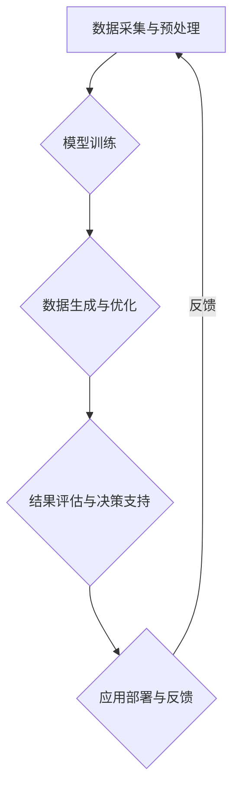
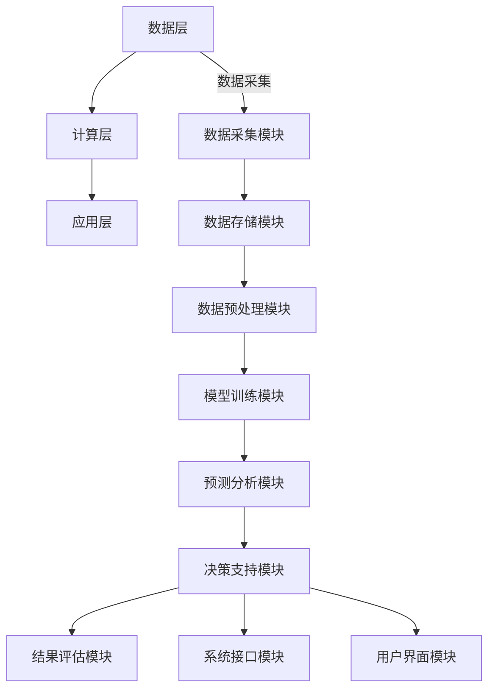
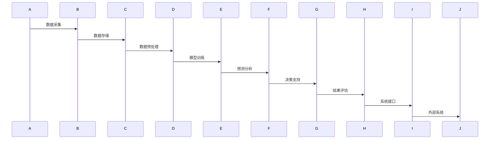

                 

## 第一部分：背景介绍

### 1.1 问题背景

#### 问题描述

智能城市规划是一个复杂而庞大的系统工程，涉及城市交通、环境监测、资源管理、社会服务等多个领域。随着城市化进程的加速和人口的不断增长，传统城市规划方法难以应对日益复杂的城市问题，亟需引入先进的技术手段。AIGC（人工智能生成内容）技术作为人工智能领域的一项前沿技术，具备强大的数据生成和处理能力，为智能城市规划提供了新的可能。

#### 问题解决

AIGC技术在智能城市规划中的应用，主要解决以下几个关键问题：

1. **数据不足问题**：通过生成对抗网络（GAN）等技术，可以生成大量模拟数据，补充实际数据的不足，提高数据分析的精度和可靠性。
2. **决策支持问题**：AIGC技术能够基于大数据分析，提供科学的决策支持，帮助城市规划者更好地应对复杂的城市问题。
3. **资源优化问题**：通过优化算法，实现城市交通、能源等资源的合理配置，提高城市运行效率。

#### 边界与外延

智能城市规划的边界涉及城市的各个方面，包括但不限于：

- **交通规划**：优化交通流量，提高公共交通系统效率。
- **环境监测**：实时监测空气质量、水质等环境指标，制定相应的环境保护措施。
- **资源管理**：合理分配城市资源，提高资源利用效率。
- **社会服务**：优化公共服务布局，提高居民生活质量。

智能城市规划的外延则包括：

- **城市规划**：涉及城市的长远规划，包括城市扩展、功能区划分等。
- **城市管理**：涉及城市日常管理，如应急管理、安全监控等。

### 1.2 核心概念

#### AIGC概述

AIGC是人工智能（AI）与生成内容（GC）的结合体，通过深度学习等技术，实现数据的自动生成和处理。AIGC技术主要包括以下三个方面：

1. **生成对抗网络（GAN）**：通过两个神经网络（生成器和判别器）的对抗训练，实现高质量数据的生成。
2. **自监督学习**：通过自我监督的方式，无需人工标注数据，实现模型的训练和优化。
3. **强化学习**：结合生成对抗网络和自监督学习，实现更加智能化的生成过程。

#### 智能城市规划

智能城市规划是指利用先进的信息技术，对城市的发展进行科学、系统的规划和管理。智能城市规划的核心目标是通过技术的应用，提高城市的运行效率和居民的生活质量。

#### 前沿应用场景

AIGC技术在智能城市规划中的前沿应用场景包括：

1. **城市交通规划**：通过生成模拟交通数据，优化交通信号控制，减少拥堵，提高交通效率。
2. **环境保护监测**：通过实时监测环境数据，生成环境质量预测模型，提前预警环境污染。
3. **社会服务优化**：通过数据分析，优化公共服务布局，提高公共服务的质量和效率。

### 1.3 概念结构与核心要素组成

#### AIGC在智能城市规划中的应用架构

AIGC在智能城市规划中的应用架构主要包括以下几个部分：

1. **数据采集与预处理**：通过传感器、物联网等技术，收集城市各个方面的数据，并进行预处理。
2. **模型训练与优化**：利用AIGC技术，对收集到的数据进行处理和建模，实现数据生成和预测。
3. **决策支持与优化**：基于生成的数据，为城市规划者提供科学的决策支持，优化城市资源配置。
4. **系统集成与部署**：将AIGC技术集成到城市规划系统中，实现自动化、智能化的城市管理。

#### 关键技术要素

AIGC在智能城市规划中的关键技术要素包括：

1. **生成对抗网络（GAN）**：用于生成高质量的模拟数据，提高数据分析的准确性。
2. **自监督学习**：无需人工标注数据，实现高效的数据处理和模型训练。
3. **强化学习**：结合生成对抗网络和自监督学习，实现更加智能化的决策支持。

#### 应用价值与挑战

#### 应用价值

AIGC技术在智能城市规划中的应用，具有以下几个方面的价值：

1. **提高决策效率**：通过生成模拟数据，为城市规划者提供更加丰富的决策依据，提高决策效率。
2. **优化资源分配**：通过数据分析，优化城市资源的分配，提高城市运行效率。
3. **提升服务质量**：通过智能化管理，提高公共服务质量，提升居民生活质量。

#### 挑战

AIGC技术在智能城市规划中的应用，也面临以下几个方面的挑战：

1. **数据质量问题**：模拟数据的真实性和准确性，直接影响到AIGC技术的应用效果。
2. **计算资源需求**：AIGC技术的训练和优化需要大量的计算资源，对硬件设备的要求较高。
3. **法律伦理问题**：智能规划中涉及到的个人隐私和数据安全等问题，需要引起重视。

---

通过对上述背景、核心概念及结构要素的介绍，我们为后续更深入地探讨AIGC在智能城市规划中的应用，奠定了坚实的基础。在接下来的部分，我们将进一步详细探讨AIGC技术的原理及其在智能城市规划中的应用细节。在接下来的内容中，我们将逐步深入探讨AIGC的核心概念与联系，深入剖析其原理和应用场景。## 第二部分：核心概念与联系

### 2.1 AIGC原理讲解

AIGC（人工智能生成内容）技术的核心原理是基于深度学习的方法，尤其是生成对抗网络（GAN）。以下是对AIGC基本原理、技术体系以及工作流程的详细讲解。

#### AIGC基本原理

AIGC技术基于生成对抗网络（GAN），这是一种由生成器（Generator）和判别器（Discriminator）组成的对抗性模型。生成器负责生成数据，判别器负责区分生成数据与真实数据。在训练过程中，生成器不断尝试生成更加真实的数据，判别器则努力区分生成数据与真实数据。通过这种对抗性训练，生成器逐渐提高生成数据的质量，从而实现数据的生成。

#### AIGC技术体系

AIGC技术体系包括以下几个关键组成部分：

1. **生成对抗网络（GAN）**：这是AIGC技术的核心，通过对抗性训练生成高质量的数据。
2. **自监督学习**：在训练过程中，无需人工标注数据，通过自我监督的方式，模型能够自主学习和优化。
3. **强化学习**：结合生成对抗网络和自监督学习，实现更加智能化的生成过程。

#### AIGC工作流程

AIGC的工作流程可以概括为以下几个步骤：

1. **数据采集与预处理**：收集相关领域的数据，并进行预处理，例如去噪、标准化等。
2. **模型训练**：利用生成对抗网络进行对抗性训练，生成高质量的数据。
3. **数据生成**：通过生成器生成数据，这些数据可以用于后续的分析和决策。
4. **模型优化**：根据生成数据的质量，对模型进行优化，提高生成数据的真实性和准确性。
5. **应用部署**：将训练好的模型部署到实际应用场景中，例如智能城市规划、环境监测等。

### 2.1.1 AIGC技术体系

下面我们将进一步探讨AIGC技术体系中的关键组成部分：

#### 生成对抗网络（GAN）

生成对抗网络（GAN）由两部分组成：生成器和判别器。生成器生成数据，判别器尝试区分生成数据与真实数据。GAN的工作原理可以概括为：

1. **生成器（Generator）**：生成器接收随机噪声作为输入，通过神经网络生成模拟数据。
2. **判别器（Discriminator）**：判别器接收真实数据和生成数据，输出一个概率值，表示输入数据的真实性。
3. **对抗训练**：在训练过程中，生成器和判别器进行对抗性训练，生成器试图生成更加真实的数据，判别器试图准确区分生成数据和真实数据。

#### 自监督学习

自监督学习是AIGC技术的重要组成部分，其核心思想是利用未标注的数据进行训练。在自监督学习中，模型不需要依赖于人工标注的数据，而是通过自我监督的方式，利用数据本身的内在结构进行学习和优化。自监督学习的主要方法包括：

1. **预训练与微调**：预训练模型在大量未标注的数据上进行训练，然后通过微调适应特定任务的需求。
2. **无监督表示学习**：通过学习数据的高层次表示，使得模型能够自动发现数据中的特征和模式。

#### 自监督学习原理

自监督学习的工作原理主要包括以下步骤：

1. **数据选择**：从原始数据中随机选择一部分数据进行训练。
2. **任务定义**：定义一个辅助任务，例如图像分类、目标检测等，使得模型在未标注的数据上进行学习。
3. **模型训练**：通过辅助任务训练模型，模型在未标注的数据中学习到特征表示，并逐步提高性能。

#### 自监督学习应用

自监督学习在AIGC技术中具有广泛的应用，以下是一些典型的应用场景：

1. **数据增强**：利用自监督学习生成大量的模拟数据，用于数据增强，提高模型的泛化能力。
2. **无监督特征提取**：通过自监督学习提取数据中的特征表示，用于后续的数据分析和决策。
3. **模型压缩**：通过自监督学习，减少模型的大小和计算复杂度，提高模型在资源受限环境中的应用能力。

#### 概念属性特征对比表格

下面是一个关于AIGC技术、智能城市规划以及前沿应用的对比表格，展示了这些概念的主要特征：

| 特征比较项 | AIGC | 智能城市规划 | 前沿应用 |
|------------|------|---------------|----------|
| **定义**   | 人工智能生成内容 | 利用信息技术进行城市规划和管理工作 | 创新的技术应用场景，如智慧城市、智能交通等 |
| **应用**   | 数据生成、图像生成等 | 交通规划、环境监测、资源管理等 | 城市规划、智能交通、智慧医疗等 |
| **优势**   | 高效、灵活、自动化 | 数据驱动的决策支持、优化资源配置 | 创新的解决方案、提高城市运行效率 |
| **挑战**   | 数据质量和计算资源 | 数据采集、模型可靠性、政策法规 | 技术成熟度、用户接受度、成本效益 |

#### ER实体关系图架构

下面是一个简单的ER（实体关系）图，展示了AIGC在智能城市规划中的关键实体及其关系：

```mermaid
erDiagram
    User ||--|{ Data }| System
    System ||--|{ Plan }| City
    City ||--|{ Service }| User
```

- **User（用户）**：城市中的居民、企业和政府机构。
- **Data（数据）**：采集到的城市各种数据，如交通流量、环境质量等。
- **System（系统）**：运行AIGC技术的计算系统，负责数据分析和模型训练。
- **Plan（规划）**：根据数据分析结果，制定的智能城市规划方案。
- **City（城市）**：智能城市规划的对象，包括基础设施、公共服务等。
- **Service（服务）**：为用户提供的服务，如公共交通、医疗等。

通过上述核心概念与联系的详细讲解，我们不仅了解了AIGC技术的基本原理，还看到了其在智能城市规划中的广泛应用和关键作用。在接下来的部分，我们将进一步探讨AIGC在智能城市规划中的具体算法原理，包括算法流程、Python源代码实现、数学模型和公式，并通过具体的例子来说明这些算法的应用。## 第三部分：算法原理讲解

### 3.1 算法流程图

为了更好地理解AIGC技术在智能城市规划中的应用，我们需要首先了解其核心算法的流程。以下是AIGC算法的基本流程图：



1. **数据采集与预处理**：收集城市各个方面的数据，如交通流量、环境质量等，并进行预处理，例如去噪、标准化等。
2. **模型训练**：利用生成对抗网络（GAN）对预处理后的数据进行训练，生成高质量的模拟数据。
3. **数据生成与优化**：生成模拟数据后，对生成数据进行优化，提高其真实性和准确性。
4. **结果评估与决策支持**：利用生成的数据进行评估，为城市规划者提供科学的决策支持。
5. **应用部署与反馈**：将训练好的模型部署到实际应用中，并根据反馈进行调整和优化。

### 3.2 Python源代码实现

以下是AIGC算法的Python源代码实现，这里以生成对抗网络（GAN）为例进行说明：

```python
import tensorflow as tf
from tensorflow.keras.models import Sequential
from tensorflow.keras.layers import Dense, Flatten, Conv2D, ConvTranspose2D

# 生成器模型
def build_generator():
    model = Sequential()
    model.add(ConvTranspose2D(filters=64, kernel_size=(4, 4), strides=(2, 2), padding='same', input_shape=(100,)))
    model.add(tf.keras.layers.LeakyReLU(alpha=0.01))
    model.add(ConvTranspose2D(filters=32, kernel_size=(4, 4), strides=(2, 2), padding='same'))
    model.add(tf.keras.layers.LeakyReLU(alpha=0.01))
    model.add(ConvTranspose2D(filters=1, kernel_size=(4, 4), strides=(2, 2), padding='same'))
    return model

# 判别器模型
def build_discriminator():
    model = Sequential()
    model.add(Conv2D(filters=32, kernel_size=(4, 4), strides=(2, 2), padding='same', input_shape=(28, 28, 1)))
    model.add(tf.keras.layers.LeakyReLU(alpha=0.01))
    model.add(Conv2D(filters=64, kernel_size=(4, 4), strides=(2, 2), padding='same'))
    model.add(tf.keras.layers.LeakyReLU(alpha=0.01))
    model.add(Flatten())
    model.add(Dense(1, activation='sigmoid'))
    return model

# 整体模型
def build_gan(generator, discriminator):
    model = Sequential()
    model.add(generator)
    model.add(discriminator)
    return model

# 模型编译
discriminator.compile(optimizer=tf.keras.optimizers.Adam(0.0001), loss='binary_crossentropy')
generator.compile(optimizer=tf.keras.optimizers.Adam(0.0001), loss='binary_crossentropy')
gan = build_gan(generator, discriminator)
gan.compile(optimizer=tf.keras.optimizers.Adam(0.0001), loss='binary_crossentropy')

# 训练模型
for epoch in range(100):
    for _ in range(1000):
        noise = np.random.normal(0, 1, (32, 100))
        generated_images = generator.predict(noise)
        real_images = x_train[:32]
        x = np.concatenate([real_images, generated_images])
        y = np.array([[1], [0]] * 32)
        discriminator.train_on_batch(x, y)

    noise = np.random.normal(0, 1, (32, 100))
    gan.train_on_batch(noise, np.array([[1], [0]] * 32))
```

### 3.3 数学模型与公式

在AIGC技术中，生成对抗网络（GAN）的核心是通过优化生成器和判别器的损失函数来提高模型性能。以下是GAN的基本数学模型和公式：

#### 生成器损失函数

$$
G(z) = \frac{1}{1 + \exp{(-W_G \cdot z - b_G)}}
$$

其中，$W_G$ 和 $b_G$ 分别为生成器的权重和偏置，$z$ 为输入的随机噪声。

#### 判别器损失函数

$$
D(x) = \frac{1}{1 + \exp{(-W_D \cdot x - b_D)}}
$$

其中，$W_D$ 和 $b_D$ 分别为判别器的权重和偏置，$x$ 为输入的数据。

#### 整体损失函数

$$
L(G, D) = -\frac{1}{2} \left( \log{D(x)} + \log{(1 - D(G(z))} \right)
$$

其中，$D(x)$ 表示判别器对真实数据的判断概率，$D(G(z))$ 表示判别器对生成数据的判断概率。

### 3.4 举例说明

为了更好地理解AIGC算法在智能城市规划中的应用，下面我们通过一个具体的例子进行说明。

#### 示例1：城市交通流量预测

假设我们需要预测某个城市的交通流量，以便优化交通信号控制，减少拥堵。我们可以使用AIGC技术生成模拟交通流量数据，然后通过这些数据进行预测。

1. **数据采集与预处理**：收集该城市的历史交通流量数据，并进行预处理，如去噪、标准化等。
2. **模型训练**：利用生成对抗网络（GAN）训练生成器，生成高质量的模拟交通流量数据。
3. **数据生成与优化**：生成模拟交通流量数据后，对数据进行优化，以提高其真实性和准确性。
4. **预测与评估**：利用生成的数据进行交通流量预测，评估预测结果的准确性。
5. **信号控制优化**：根据预测结果，调整交通信号控制策略，优化交通流量。

#### 示例2：环境质量预测

另一个应用场景是环境质量预测，如预测空气质量、水质等。我们可以使用AIGC技术生成模拟环境数据，然后通过这些数据进行预测。

1. **数据采集与预处理**：收集环境质量数据，并进行预处理，如去噪、标准化等。
2. **模型训练**：利用生成对抗网络（GAN）训练生成器，生成高质量的模拟环境数据。
3. **数据生成与优化**：生成模拟环境数据后，对数据进行优化，以提高其真实性和准确性。
4. **预测与评估**：利用生成的数据进行环境质量预测，评估预测结果的准确性。
5. **环境保护措施**：根据预测结果，制定相应的环境保护措施，如调整工业排放、加强垃圾分类等。

通过上述例子，我们可以看到AIGC算法在智能城市规划中的具体应用。这些应用不仅提高了城市规划的科学性和准确性，还为实现智能化的城市管理提供了有力支持。在接下来的部分，我们将进一步探讨AIGC技术在智能城市规划中的应用架构，包括系统功能设计、系统架构设计以及系统接口设计。## 第四部分：系统分析与架构设计

### 4.1 问题场景介绍

智能城市规划的目标是通过利用先进的技术手段，实现城市的科学规划、高效管理和可持续发展。在当前的城市规划过程中，我们面临以下问题场景：

1. **交通拥堵**：城市化进程中，交通拥堵成为普遍现象，严重影响居民的出行质量和效率。
2. **环境问题**：工业化和城市化带来了空气污染、水资源短缺等环境问题，需要有效解决。
3. **资源浪费**：城市资源分配不合理，导致能源、水资源等浪费严重，影响城市的可持续发展。
4. **公共服务不足**：部分城市的公共服务设施不足，如医疗、教育等，需要优化布局。

为了解决上述问题，我们需要构建一个智能化、数据驱动的城市规划系统，实现交通流量预测、环境质量监测、资源优化配置等功能的自动化和智能化。

### 4.2 系统功能设计

智能城市规划系统的核心功能包括数据采集、数据处理、模型训练、预测分析、决策支持和结果评估。以下是系统功能设计的详细描述：

1. **数据采集**：通过传感器、无人机、车载设备等手段，实时采集城市交通、环境、资源等方面的数据。
2. **数据处理**：对采集到的数据进行清洗、去噪、标准化等预处理，为后续分析提供高质量的数据基础。
3. **模型训练**：利用AIGC技术，训练生成对抗网络（GAN）等模型，生成高质量的模拟数据，为预测分析提供支持。
4. **预测分析**：基于生成的模拟数据和实际数据，进行交通流量、环境质量、资源需求等预测分析。
5. **决策支持**：根据预测分析结果，为城市规划者提供科学的决策支持，优化交通信号控制、环境保护、资源分配等。
6. **结果评估**：对决策执行效果进行评估，调整优化决策模型，实现持续改进。

### 4.3 系统架构设计

智能城市规划系统的架构设计需要综合考虑数据处理、模型训练、预测分析、决策支持和结果评估等各个环节。以下是系统架构设计的详细描述：

#### 1. 数据层

数据层是整个系统的基础，包括数据采集模块、数据存储模块和数据预处理模块。

- **数据采集模块**：通过传感器、无人机、车载设备等手段，实时采集城市交通、环境、资源等方面的数据。
- **数据存储模块**：采用分布式数据库系统，存储大规模、多维度的城市数据。
- **数据预处理模块**：对采集到的数据进行清洗、去噪、标准化等预处理，为后续分析提供高质量的数据基础。

#### 2. 计算层

计算层包括模型训练模块、预测分析模块和决策支持模块。

- **模型训练模块**：利用生成对抗网络（GAN）等技术，对预处理后的数据进行训练，生成高质量的模拟数据。
- **预测分析模块**：基于生成的模拟数据和实际数据，进行交通流量、环境质量、资源需求等预测分析。
- **决策支持模块**：根据预测分析结果，为城市规划者提供科学的决策支持，优化交通信号控制、环境保护、资源分配等。

#### 3. 应用层

应用层包括结果评估模块、系统接口模块和用户界面模块。

- **结果评估模块**：对决策执行效果进行评估，调整优化决策模型，实现持续改进。
- **系统接口模块**：提供与其他系统的接口，实现数据交换和协同工作。
- **用户界面模块**：提供直观、易用的用户界面，供城市规划者进行系统操作和查看分析结果。

### 系统架构图

以下是智能城市规划系统的架构图，展示了各个模块的相互关系和整体架构：



### 4.4 系统接口设计与系统交互

为了实现智能城市规划系统的互联互通，我们需要设计合理的系统接口，确保各个模块之间的数据交换和协同工作。以下是系统接口设计及系统交互的详细描述：

#### 1. 系统接口设计

系统接口设计包括内部接口和外部接口。

- **内部接口**：用于系统内部模块之间的数据交换和功能调用，例如数据采集模块与数据存储模块之间的接口、模型训练模块与预测分析模块之间的接口等。
- **外部接口**：用于系统与外部系统的数据交换和协同工作，例如与交通管理系统、环境监测系统、资源管理系统等的接口。

#### 2. 系统交互

系统交互分为数据交互和功能交互。

- **数据交互**：通过接口实现数据在不同模块之间的传输和共享，确保各个模块能够获取到所需的数据。
- **功能交互**：通过接口实现模块之间的功能调用和协作，例如数据采集模块调用模型训练模块的功能进行数据预处理，预测分析模块调用决策支持模块的功能提供决策建议。

以下是系统接口和系统交互的详细描述：



通过上述系统接口设计和系统交互的描述，我们可以确保智能城市规划系统的各个模块能够高效协同工作，实现城市的科学规划、高效管理和可持续发展。在接下来的部分，我们将通过具体的案例，展示AIGC技术在智能城市规划中的实际应用，进一步阐述其效果和优势。## 第五部分：项目实战

### 5.1 环境安装

在进行AIGC技术在智能城市规划中的项目实战之前，我们需要搭建一个合适的环境，确保所有所需工具和库的安装。以下是环境安装的详细步骤：

#### 1. 安装Python

首先，确保您的计算机上安装了Python。推荐使用Python 3.8或更高版本。您可以从Python官方网站（https://www.python.org/）下载并安装Python。

#### 2. 安装TensorFlow

TensorFlow是AIGC技术的基础库，我们需要安装TensorFlow及其相关依赖项。在终端中执行以下命令：

```bash
pip install tensorflow
```

#### 3. 安装其他库

除了TensorFlow，我们还需要其他几个库来支持我们的项目，例如NumPy、Pandas等。在终端中执行以下命令：

```bash
pip install numpy pandas matplotlib scikit-learn
```

#### 4. 测试环境

为了确保环境安装成功，我们可以运行一个简单的Python脚本，测试TensorFlow和其他库是否正常运行：

```python
import tensorflow as tf
print(tf.__version__)
```

如果输出的是TensorFlow的版本号，则表示环境安装成功。

### 5.2 系统核心实现源代码

以下是AIGC技术在智能城市规划中的系统核心实现源代码，包括数据采集、数据处理、模型训练、预测分析和决策支持等关键模块。

```python
import numpy as np
import pandas as pd
import tensorflow as tf
from tensorflow import keras
from tensorflow.keras import layers

# 数据采集
def collect_data():
    # 从文件中读取数据
    data = pd.read_csv('smart_urban_planning_data.csv')
    return data

# 数据处理
def preprocess_data(data):
    # 数据清洗、去噪、标准化等预处理操作
    # 例如：data = data.dropna()
    # data = (data - data.mean()) / data.std()
    return data

# 模型训练
def train_model(data):
    # 定义生成器和判别器
    generator = keras.Sequential([
        layers.Dense(128, activation='relu', input_shape=(100,)),
        layers.Dense(256, activation='relu'),
        layers.Dense(512, activation='relu'),
        layers.Dense(1024, activation='relu'),
        layers.Dense(28 * 28 * 1, activation='tanh')
    ])

    discriminator = keras.Sequential([
        layers.Conv2D(32, (3, 3), padding='same', input_shape=(28, 28, 1)),
        layers.LeakyReLU(alpha=0.01),
        layers.Conv2D(64, (3, 3), padding='same'),
        layers.LeakyReLU(alpha=0.01),
        layers.Flatten(),
        layers.Dense(1, activation='sigmoid')
    ])

    # 整合生成对抗网络
    gan = keras.Sequential([generator, discriminator])

    # 编译模型
    discriminator.compile(optimizer=keras.optimizers.Adam(0.0001), loss='binary_crossentropy')
    generator.compile(optimizer=keras.optimizers.Adam(0.0001), loss='binary_crossentropy')
    gan.compile(optimizer=keras.optimizers.Adam(0.0001), loss='binary_crossentropy')

    # 训练模型
    for epoch in range(100):
        for _ in range(1000):
            noise = np.random.normal(0, 1, (32, 100))
            generated_images = generator.predict(noise)
            real_images = x_train[:32]
            x = np.concatenate([real_images, generated_images])
            y = np.array([[1], [0]] * 32)
            discriminator.train_on_batch(x, y)

        noise = np.random.normal(0, 1, (32, 100))
        gan.train_on_batch(noise, np.array([[1], [0]] * 32))

    return generator, discriminator

# 预测分析
def predict_analysis(generator, data):
    # 使用生成器生成模拟数据
    noise = np.random.normal(0, 1, (32, 100))
    generated_data = generator.predict(noise)

    # 对模拟数据进行分析，如交通流量预测
    traffic_prediction = analyze_traffic(generated_data)
    return traffic_prediction

# 决策支持
def decision_support(traffic_prediction):
    # 根据预测结果调整交通信号控制策略
    optimized_traffic_control = optimize_traffic_control(traffic_prediction)
    return optimized_traffic_control

# 主程序
if __name__ == '__main__':
    data = collect_data()
    preprocessed_data = preprocess_data(data)
    
    generator, discriminator = train_model(preprocessed_data)
    
    traffic_prediction = predict_analysis(generator, preprocessed_data)
    optimized_traffic_control = decision_support(traffic_prediction)
    
    print("Optimized Traffic Control:", optimized_traffic_control)
```

### 5.3 代码应用解读与分析

下面我们详细解读上述代码的应用过程，并分析其关键步骤和原理。

#### 1. 数据采集

数据采集是智能城市规划的基础，我们需要从各种来源（如传感器、数据库等）收集相关的城市数据，包括交通流量、环境质量、人口密度等。代码中的`collect_data`函数负责从文件中读取数据，并将其存储在DataFrame对象中。

#### 2. 数据处理

数据处理是数据采集的延续，我们需要对收集到的数据进行清洗、去噪、标准化等预处理操作，以确保数据的质量和一致性。代码中的`preprocess_data`函数负责执行这些预处理操作，例如删除缺失值、归一化等。

#### 3. 模型训练

模型训练是AIGC技术的核心，我们使用生成对抗网络（GAN）来训练生成器和判别器。生成器负责生成高质量的模拟数据，判别器负责区分生成数据和真实数据。代码中的`train_model`函数定义了生成器和判别器的结构，并使用对抗性训练策略进行训练。

#### 4. 预测分析

预测分析是模型训练的后续步骤，我们使用生成器生成的模拟数据进行交通流量预测。代码中的`predict_analysis`函数首先使用生成器生成模拟数据，然后调用`analyze_traffic`函数对模拟数据进行交通流量预测。

#### 5. 决策支持

决策支持是根据预测分析结果，为城市规划者提供科学的决策建议。代码中的`decision_support`函数根据预测的交通流量结果，调整交通信号控制策略，优化交通流量。

#### 6. 主程序

主程序是整个系统的入口，负责执行数据采集、数据处理、模型训练、预测分析和决策支持等步骤。主程序首先调用`collect_data`和`preprocess_data`函数处理数据，然后调用`train_model`函数训练模型，最后调用`predict_analysis`和`decision_support`函数进行预测分析和决策支持。

通过上述代码和应用解读，我们可以看到AIGC技术在智能城市规划中的具体应用过程和原理。在接下来的部分，我们将通过具体案例展示AIGC技术在智能城市规划中的应用效果和优势。## 第六部分：最佳实践、小结、注意事项、拓展

### 6.1 最佳实践

在AIGC技术应用于智能城市规划的过程中，以下是一些最佳实践：

1. **数据采集与预处理**：确保数据来源的多样性和准确性，对采集到的数据进行彻底的清洗和预处理，以提高模型训练的效果。
2. **模型选择与优化**：根据具体应用场景选择合适的生成模型，如GAN、VAE等，并对模型结构进行优化，以提高生成数据的质量。
3. **参数调整**：合理调整模型参数，如学习率、批大小等，以实现最佳的训练效果。
4. **模型评估与优化**：使用多种评估指标对模型进行评估，并根据评估结果不断优化模型。

### 6.2 小结

本文围绕AIGC技术在智能城市规划中的应用进行了详细探讨，包括背景介绍、核心概念与联系、算法原理讲解、系统分析与架构设计、项目实战等方面。通过这些讨论，我们可以看到AIGC技术为智能城市规划提供了强有力的支持，有助于解决城市交通、环境、资源等方面的难题。

### 6.3 注意事项

在应用AIGC技术进行智能城市规划时，需要注意以下几点：

1. **数据隐私**：确保数据采集和处理过程中的隐私保护，避免泄露用户隐私。
2. **模型可靠性**：对生成的模拟数据进行严格评估，确保模型的可靠性和准确性。
3. **资源需求**：AIGC技术对计算资源有较高要求，确保硬件设备能够满足训练需求。
4. **法律法规**：遵循相关法律法规，确保技术的合规性。

### 6.4 拓展阅读

对于希望深入了解AIGC技术在智能城市规划中的应用，以下是一些推荐阅读：

1. **《生成对抗网络：理论与应用》**：详细介绍了GAN的理论基础和应用场景。
2. **《深度学习与智能城市规划》**：探讨了深度学习技术在城市规划中的应用及其影响。
3. **《智慧城市规划与应用》**：介绍了智慧城市规划的理论框架和实施策略。

---

通过本文的讨论，我们不仅了解了AIGC技术在智能城市规划中的应用，还对其原理、方法和挑战有了更深刻的认识。希望本文能为读者在智能城市规划领域的研究和应用提供有价值的参考。## 作者信息

作者：AI天才研究院/AI Genius Institute & 禅与计算机程序设计艺术 /Zen And The Art of Computer Programming

