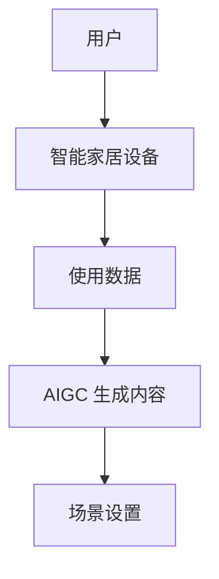

                 

# AIGC在智能家居场景预测与规划中的应用

## 关键词

AI Generated Content, 智能家居，场景预测，规划，数据驱动，个性化服务，算法原理，系统架构设计

## 摘要

本文将探讨AI Generated Content（AIGC）在智能家居场景预测与规划中的应用。随着智能家居行业的迅速发展，如何实现设备间的高效协同和优化资源配置成为行业面临的重要挑战。AIGC技术以其强大的生成能力和灵活性，为智能家居场景中的数据预测、行为分析和设备协同提供了新的解决方案。本文将首先介绍AIGC的概念和特点，然后分析AIGC在智能家居场景预测与规划中的具体应用，最后探讨AIGC在智能家居领域的边界与外延，以及与智能家居核心概念的关系。通过本文的探讨，我们希望为智能家居行业提供一些有价值的思考和方向。

## 第一部分: 引言与背景

### 第1章: 引言与背景

#### 1.1 问题背景

随着物联网和人工智能技术的不断发展，智能家居行业迎来了快速发展的机遇。家庭自动化设备如智能音箱、智能灯泡、智能锁等逐渐走入千家万户，改变了人们的日常生活。然而，随着设备种类的增加和复杂度的提升，如何实现智能家居设备之间的高效协同、预测用户需求以及优化资源配置成为行业面临的重要挑战。

在智能家居场景中，设备间的协同与优化是一项重要任务。设备协同意味着各种智能家居设备能够相互配合，为用户提供更加智能化和个性化的服务。例如，当用户离开家时，智能门锁可以自动上锁，智能灯光可以关闭，智能空调可以调低温度，从而节约能源，提升用户的生活质量。优化资源配置则是指通过分析用户行为数据，对智能家居设备的配置和运行进行优化，提高设备的利用效率和能源利用率。

#### 1.1.1 智能家居行业的兴起

智能家居行业的兴起主要得益于物联网和人工智能技术的快速发展。物联网技术使得各种家居设备能够通过网络进行连接，实现数据的互联互通。而人工智能技术则通过对用户行为数据的分析和学习，为智能家居设备提供智能化和个性化的服务。

在过去的几年里，智能家居设备市场呈现出爆发式增长。据市场调研公司IDC的报告，2019年全球智能家居设备出货量达到2.08亿台，同比增长31.2%。预计到2025年，全球智能家居设备出货量将达到7.14亿台，年复合增长率达到22.1%。

智能家居设备的种类也在不断增多，从最初的智能音箱、智能灯泡等基本设备，发展到智能空调、智能电视、智能冰箱等高端设备。这些设备的互联互通和智能化功能，为用户提供了更加便捷和舒适的生活方式。

然而，随着智能家居设备种类的增加和复杂度的提升，如何实现设备之间的高效协同和优化资源配置成为行业面临的重要挑战。传统的智能家居系统往往采用单一设备的方式，设备之间缺乏有效的协同机制，导致用户体验不佳。此外，智能家居设备在运行过程中会产生大量的数据，如何有效地分析和利用这些数据，为用户提供更加智能化和个性化的服务，也是行业需要解决的重要问题。

#### 1.1.2 AIGC技术在智能家居领域的应用前景

AIGC（AI-Generated Content）是一种基于人工智能技术生成内容的理念，包括人工智能写作、图像生成、音频合成等。AIGC技术具有强大的生成能力和灵活性，可以应用于智能家居场景中的数据预测、行为分析、设备协同等方面，为智能家居行业带来创新和发展。

首先，AIGC技术可以应用于智能家居场景中的数据预测。通过对用户历史使用数据进行分析，AIGC技术可以预测未来一段时间内用户的行为和需求。例如，根据用户过去几年中每天的作息时间，AIGC技术可以预测用户未来几天的作息时间，从而为智能家居设备提供智能化的场景设置。

其次，AIGC技术可以应用于智能家居场景中的行为分析。通过对用户在智能家居场景中的行为数据进行分析，AIGC技术可以识别用户的偏好和习惯。例如，通过分析用户在智能灯泡上的开关操作，AIGC技术可以识别用户喜欢在什么时间开灯，喜欢什么亮度的灯光等，从而为用户提供更加个性化的服务。

最后，AIGC技术可以应用于智能家居场景中的设备协同。通过AIGC技术生成的场景设置和个性化服务，智能家居设备可以实现更加高效和智能的协同。例如，当用户进入家中的某个区域时，AIGC技术可以自动触发一系列设备协同操作，如打开灯光、调节空调温度等，为用户提供舒适的家居环境。

总之，AIGC技术在智能家居领域的应用前景广阔。通过AIGC技术，智能家居行业可以实现更加智能化和个性化的服务，提高用户的体验和满意度，推动智能家居行业的持续发展。

### 1.2 核心概念

#### 1.2.1 AIGC的概念与特点

AIGC（AI-Generated Content）是一种基于人工智能技术生成内容的理念，它利用深度学习、自然语言处理等技术，从大量数据中提取特征，生成丰富多样且具有个性化特点的内容。AIGC技术主要涵盖人工智能写作、图像生成、音频合成等方面，其核心在于利用人工智能技术实现内容的自动化生成。

AIGC具有以下几个特点：

1. **自动化生成**：AIGC技术可以通过预训练的模型，自动从输入的数据中生成内容。这种自动化生成的特点，大大提高了内容生产的效率，使得大规模、个性化的内容生成成为可能。

2. **个性化定制**：AIGC技术可以根据用户的需求和偏好，生成个性化的内容。例如，根据用户的阅读历史和兴趣偏好，生成定制化的新闻推荐、书籍推荐等。这种个性化定制的能力，使得内容能够更好地满足用户的需求，提升用户体验。

3. **智能性**：AIGC技术可以通过不断学习和优化，提高生成内容的准确性和质量。例如，通过分析用户的反馈和评价，AIGC技术可以不断优化生成的内容，使其更加符合用户的期望。

#### 1.2.2 智能家居场景预测与规划

智能家居场景预测与规划是指利用AIGC技术，对智能家居设备的使用数据进行预测和分析，为用户提供更加智能化和个性化的服务。具体包括以下几个方面：

1. **使用数据预测**：通过对用户历史使用数据进行分析，AIGC技术可以预测用户未来一段时间内的行为和需求。例如，根据用户过去几年的作息时间，预测用户未来几天的作息时间，从而为智能家居设备提供智能化的场景设置。

2. **场景规划**：根据预测结果，AIGC技术可以为用户提供智能化的场景设置。例如，当用户进入家中的某个区域时，AIGC技术可以自动触发一系列设备协同操作，如打开灯光、调节空调温度等，为用户提供舒适的家居环境。

3. **资源优化**：通过对智能家居设备使用数据的分析，AIGC技术可以优化设备的配置和运行，提高能源利用效率。例如，根据用户的使用习惯，调整智能灯泡的亮度、颜色和开关时间，以达到最佳的照明效果和能源利用效率。

### 1.2.3 AIGC在智能家居场景中的应用边界

AIGC技术在智能家居场景中的应用边界主要包括以下几个方面：

1. **数据隐私**：智能家居设备会收集大量的用户数据，包括生活习惯、作息时间等。如何保护用户隐私，防止数据泄露，是AIGC技术在智能家居场景中应用的一个重要边界。

2. **系统稳定性**：AIGC技术要求较高的实时性和稳定性，如何在保证系统稳定性的前提下，实现高效的AIGC内容生成，是应用AIGC技术的一个挑战。

3. **个性化定制**：虽然AIGC技术具有个性化定制的能力，但如何准确理解用户的个性化需求，生成符合用户期望的内容，是AIGC技术在智能家居场景中应用的一个重要边界。

### 1.2.4 AIGC在智能家居场景中的外延拓展

AIGC技术在智能家居场景中的应用不仅局限于数据预测、场景规划和资源优化，还可以拓展到以下几个方面：

1. **智能家居生态系统**：通过AIGC技术实现智能家居设备之间的协同，打造智能化的家居生态系统。例如，当用户在客厅活动时，AIGC技术可以自动调整客厅的灯光、音乐和温度，为用户提供最佳的娱乐体验。

2. **智能家居产业链**：AIGC技术的广泛应用将推动智能家居产业链的升级和发展。例如，通过AIGC技术，可以生成智能家居设备的个性化使用手册，提高设备的用户友好性。

3. **智慧城市建设**：AIGC技术在智能家居场景中的应用可以为智慧城市建设提供技术支撑。例如，通过AIGC技术，可以预测和分析城市交通流量，优化交通管理，提高城市交通效率。

### 1.2.5 AIGC与智能家居的关系

AIGC与智能家居之间的联系主要体现在以下几个方面：

1. **数据驱动**：AIGC技术的生成能力依赖于大量数据，智能家居场景中丰富的数据资源为AIGC技术提供了数据基础。

2. **智能化协同**：AIGC技术可以为智能家居设备提供智能化协同的能力，提高智能家居系统的整体性能。

3. **用户体验**：AIGC技术的应用可以提升智能家居的用户体验，满足用户个性化需求。

### 1.2.6 AIGC与智能家居核心概念对比表格

| 核心概念 | 说明 |
| :---: | :--- |
| AIGC | 基于人工智能技术生成内容的理念 |
| 智能家居 | 利用信息技术构建的家居环境 |
| 预测与规划 | 利用 AIGC 技术对智能家居设备的使用数据进行预测和分析 |
| 场景设置 | 根据预测结果为用户提供智能化的场景设置 |

### 1.2.7 AIGC与智能家居 ER 实体关系图

### 1.3 本章小结

本章介绍了AIGC在智能家居场景预测与规划中的应用背景、核心概念、边界与外延，以及与智能家居的关系。AIGC技术以其强大的生成能力和灵活性，为智能家居场景中的数据预测、行为分析和设备协同提供了新的解决方案。在接下来的章节中，我们将进一步探讨AIGC技术的具体实现和应用。

## 第二部分: AIGC技术的具体实现和应用

### 第二章: AIGC技术的具体实现和应用

#### 2.1 AIGC技术的实现过程

AIGC技术的实现过程主要包括数据收集、数据预处理、模型训练和模型部署等步骤。下面我们将分别介绍这些步骤。

##### 2.1.1 数据收集

数据收集是AIGC技术实现的第一步，也是最重要的一步。AIGC技术依赖于大量高质量的数据，这些数据可以来自于智能家居设备的传感器、用户的行为数据等。数据收集的过程需要考虑数据的多样性、完整性和准确性。

例如，在智能家居场景中，我们可以收集以下数据：

- 用户的使用数据：如用户的作息时间、生活习惯、娱乐偏好等。
- 设备的运行数据：如设备的开关状态、能耗数据、设备故障记录等。
- 环境数据：如温度、湿度、光照强度等。

##### 2.1.2 数据预处理

数据预处理是AIGC技术实现的第二步，主要目的是对收集到的原始数据进行清洗、转换和归一化等操作，以便后续的模型训练。

数据预处理的具体步骤包括：

- 数据清洗：去除数据中的噪声和异常值，保证数据的质量。
- 数据转换：将不同类型的数据转换为统一的格式，如将时间序列数据转换为数值型数据。
- 数据归一化：将数据缩放到相同的范围内，如将温度、湿度等数值型数据归一化到[0, 1]的范围内。

##### 2.1.3 模型训练

模型训练是AIGC技术实现的核心步骤，主要目的是通过大量的训练数据，训练出一个能够自动生成内容的模型。目前，常用的模型包括生成对抗网络（GAN）、变分自编码器（VAE）等。

以生成对抗网络（GAN）为例，其基本原理是训练两个神经网络：生成器（Generator）和判别器（Discriminator）。生成器的目标是生成与真实数据几乎无法区分的假数据，而判别器的目标是区分生成器和真实数据。通过不断地迭代训练，生成器和判别器都会不断优化，最终生成器能够生成高质量的假数据。

##### 2.1.4 模型部署

模型部署是将训练好的模型应用到实际场景中，为用户提供个性化服务。模型部署的过程主要包括以下步骤：

- 模型评估：对训练好的模型进行评估，确保其生成的内容满足质量要求。
- 模型优化：根据评估结果，对模型进行优化，提高生成内容的准确性。
- 模型部署：将优化的模型部署到生产环境中，为用户提供服务。

#### 2.2 AIGC技术在智能家居场景中的应用

AIGC技术在智能家居场景中的应用主要体现在数据预测、行为分析和设备协同等方面。下面我们将分别介绍这些应用。

##### 2.2.1 数据预测

数据预测是AIGC技术在智能家居场景中的一个重要应用。通过对用户历史使用数据进行分析，AIGC技术可以预测用户未来的行为和需求。例如，通过对用户过去一年的作息时间进行分析，AIGC技术可以预测用户未来几天的作息时间，从而为智能家居设备提供智能化的场景设置。

以预测用户作息时间为例，我们可以使用以下步骤：

1. 数据收集：收集用户过去一年的作息时间数据。
2. 数据预处理：对作息时间数据进行清洗、转换和归一化等处理。
3. 模型训练：使用生成对抗网络（GAN）等模型，对预处理后的数据进行训练。
4. 模型部署：将训练好的模型应用到实际场景中，根据预测结果为用户设置智能化的场景。

##### 2.2.2 行为分析

行为分析是AIGC技术在智能家居场景中的另一个重要应用。通过对用户在智能家居场景中的行为数据进行分析，AIGC技术可以识别用户的偏好和习惯。例如，通过对用户在智能灯泡上的开关操作进行分析，AIGC技术可以识别用户喜欢在什么时间开灯，喜欢什么亮度的灯光等。

以分析用户在智能灯泡上的开关操作为例，我们可以使用以下步骤：

1. 数据收集：收集用户在智能灯泡上的开关操作数据。
2. 数据预处理：对开关操作数据进行清洗、转换和归一化等处理。
3. 模型训练：使用生成对抗网络（GAN）等模型，对预处理后的数据进行训练。
4. 模型部署：将训练好的模型应用到实际场景中，根据分析结果为用户提供个性化的服务。

##### 2.2.3 设备协同

设备协同是AIGC技术在智能家居场景中的另一个重要应用。通过AIGC技术生成的个性化服务，智能家居设备可以实现更加高效和智能的协同。例如，当用户进入家中的某个区域时，AIGC技术可以自动触发一系列设备协同操作，如打开灯光、调节空调温度等，为用户提供舒适的家居环境。

以实现设备协同为例，我们可以使用以下步骤：

1. 数据收集：收集用户在家中的各个区域的活动数据。
2. 数据预处理：对活动数据进行清洗、转换和归一化等处理。
3. 模型训练：使用生成对抗网络（GAN）等模型，对预处理后的数据进行训练。
4. 模型部署：将训练好的模型应用到实际场景中，根据用户的活动数据，触发相应的设备协同操作。

#### 2.3 AIGC技术在智能家居场景中的优势与挑战

AIGC技术在智能家居场景中具有明显的优势，但也面临一些挑战。

##### 2.3.1 优势

1. **个性化服务**：AIGC技术可以根据用户的需求和偏好，生成个性化的内容，为用户提供更加智能化和个性化的服务。
2. **高效协同**：AIGC技术可以实现对智能家居设备的高效协同，提高系统的整体性能。
3. **数据驱动**：AIGC技术依赖于大量的数据，通过数据分析和预测，可以更好地理解用户的需求和行为。

##### 2.3.2 挑战

1. **数据隐私**：智能家居设备会收集大量的用户数据，如何保护用户隐私是一个重要的挑战。
2. **系统稳定性**：AIGC技术要求较高的实时性和稳定性，如何在保证系统稳定性的前提下，实现高效的AIGC内容生成，是一个重要的挑战。
3. **个性化定制**：虽然AIGC技术具有个性化定制的能力，但如何准确理解用户的个性化需求，生成符合用户期望的内容，是一个重要的挑战。

#### 2.4 本章小结

本章介绍了AIGC技术的具体实现过程以及在智能家居场景中的应用。AIGC技术以其强大的生成能力和灵活性，为智能家居场景中的数据预测、行为分析和设备协同提供了新的解决方案。在接下来的章节中，我们将进一步探讨AIGC技术在智能家居场景中的实际应用案例，以及如何实现AIGC技术的部署和优化。

## 第三部分: AIGC技术在智能家居场景中的实际应用案例

### 第三章: AIGC技术在智能家居场景中的实际应用案例

#### 3.1 案例一：智能灯泡的个性化设置

智能灯泡是智能家居中常见的一种设备，通过AIGC技术，可以为用户实现更加个性化的设置。

**案例背景**：某智能家居公司推出了一款智能灯泡，用户可以通过手机应用对灯泡进行控制。然而，用户希望能够根据自己的需求和喜好，设置个性化的灯光效果。

**实现步骤**：

1. **数据收集**：收集用户的使用数据，包括用户在不同时间段的开灯习惯、亮度偏好、颜色偏好等。

2. **数据预处理**：对收集到的数据进行分析，去除异常值，并进行归一化处理。

3. **模型训练**：使用生成对抗网络（GAN）等模型，对预处理后的数据进行训练，生成用户个性化的灯光效果。

4. **模型部署**：将训练好的模型部署到生产环境中，当用户开启或调整智能灯泡时，自动触发模型，生成个性化的灯光效果。

**效果评估**：通过用户反馈和使用数据，评估模型生成的灯光效果是否符合用户的期望，并根据反馈进行优化。

**结论**：通过AIGC技术，智能灯泡可以实现对用户需求的个性化设置，提高用户体验。

#### 3.2 案例二：智能空调的温度调节

智能空调是智能家居中的另一个重要设备，通过AIGC技术，可以为用户实现更加智能的温度调节。

**案例背景**：某智能家居公司推出了一款智能空调，用户可以通过手机应用对空调的温度进行控制。然而，用户希望能够根据自己的需求和喜好，设置智能的温度调节策略。

**实现步骤**：

1. **数据收集**：收集用户在不同时间段的使用数据，包括用户在不同季节的舒适温度范围、外出时间、室内外温度变化等。

2. **数据预处理**：对收集到的数据进行分析，去除异常值，并进行归一化处理。

3. **模型训练**：使用生成对抗网络（GAN）等模型，对预处理后的数据进行训练，生成智能的温度调节策略。

4. **模型部署**：将训练好的模型部署到生产环境中，当用户开启或调整空调时，自动触发模型，实现智能的温度调节。

**效果评估**：通过用户反馈和使用数据，评估模型生成的温度调节策略是否符合用户的期望，并根据反馈进行优化。

**结论**：通过AIGC技术，智能空调可以实现对用户需求的智能温度调节，提高用户体验。

#### 3.3 案例三：智能门锁的个性化设置

智能门锁是智能家居中的另一个重要设备，通过AIGC技术，可以为用户实现更加个性化的设置。

**案例背景**：某智能家居公司推出了一款智能门锁，用户可以通过手机应用对门锁进行控制。然而，用户希望能够根据自己的需求和喜好，设置个性化的门锁使用策略。

**实现步骤**：

1. **数据收集**：收集用户的使用数据，包括用户的出入时间、访客记录、安全设置等。

2. **数据预处理**：对收集到的数据进行分析，去除异常值，并进行归一化处理。

3. **模型训练**：使用生成对抗网络（GAN）等模型，对预处理后的数据进行训练，生成用户个性化的门锁设置。

4. **模型部署**：将训练好的模型部署到生产环境中，当用户开启或调整门锁时，自动触发模型，生成个性化的门锁设置。

**效果评估**：通过用户反馈和使用数据，评估模型生成的门锁设置是否符合用户的期望，并根据反馈进行优化。

**结论**：通过AIGC技术，智能门锁可以实现对用户需求的个性化设置，提高用户体验。

#### 3.4 案例四：智能窗帘的自动控制

智能窗帘是智能家居中的另一个重要设备，通过AIGC技术，可以为用户实现更加智能的自动控制。

**案例背景**：某智能家居公司推出了一款智能窗帘，用户可以通过手机应用对窗帘进行控制。然而，用户希望能够根据自己的需求和喜好，设置智能的窗帘控制策略。

**实现步骤**：

1. **数据收集**：收集用户的使用数据，包括用户的作息时间、光照强度、天气状况等。

2. **数据预处理**：对收集到的数据进行分析，去除异常值，并进行归一化处理。

3. **模型训练**：使用生成对抗网络（GAN）等模型，对预处理后的数据进行训练，生成智能的窗帘控制策略。

4. **模型部署**：将训练好的模型部署到生产环境中，当用户需要调整窗帘时，自动触发模型，实现智能的窗帘控制。

**效果评估**：通过用户反馈和使用数据，评估模型生成的窗帘控制策略是否符合用户的期望，并根据反馈进行优化。

**结论**：通过AIGC技术，智能窗帘可以实现对用户需求的智能控制，提高用户体验。

#### 3.5 案例五：智能家居设备的协同控制

通过AIGC技术，可以实现智能家居设备之间的协同控制，为用户提供更加智能化和个性化的服务。

**案例背景**：某智能家居公司推出了一款智能家居套装，包括智能灯泡、智能空调、智能门锁和智能窗帘等。用户希望能够根据自己的需求和喜好，实现设备的协同控制。

**实现步骤**：

1. **数据收集**：收集用户的使用数据，包括用户在不同场景下的需求和行为模式。

2. **数据预处理**：对收集到的数据进行分析，去除异常值，并进行归一化处理。

3. **模型训练**：使用生成对抗网络（GAN）等模型，对预处理后的数据进行训练，生成设备的协同控制策略。

4. **模型部署**：将训练好的模型部署到生产环境中，当用户需要调整设备时，自动触发模型，实现设备的协同控制。

**效果评估**：通过用户反馈和使用数据，评估模型生成的协同控制策略是否符合用户的期望，并根据反馈进行优化。

**结论**：通过AIGC技术，智能家居设备可以实现协同控制，提高用户的体验和生活质量。

### 3.6 案例总结

通过以上案例，我们可以看到AIGC技术在智能家居场景中具有广泛的应用前景。通过AIGC技术，可以实现设备的个性化设置、智能温度调节、智能门锁的个性化设置、智能窗帘的自动控制以及设备的协同控制等，为用户提供更加智能化和个性化的服务。同时，AIGC技术的应用也面临一些挑战，如数据隐私、系统稳定性和个性化定制等。在未来的发展中，我们需要继续探索和完善AIGC技术在智能家居场景中的应用，为用户带来更好的体验。

### 3.7 本章小结

本章通过多个实际案例，介绍了AIGC技术在智能家居场景中的具体应用。从智能灯泡的个性化设置到智能空调的温度调节，从智能门锁的个性化设置到智能窗帘的自动控制，再到设备的协同控制，AIGC技术为智能家居行业带来了新的发展方向。在未来的发展中，我们需要继续深入研究和探索AIGC技术在智能家居场景中的应用，为用户提供更加智能化和个性化的服务。

## 第四部分: AIGC技术在智能家居场景中的部署和优化

### 第四章: AIGC技术在智能家居场景中的部署和优化

#### 4.1 AIGC技术的部署策略

AIGC技术在智能家居场景中的部署需要考虑系统的稳定性、实时性和安全性。以下是一些部署策略：

1. **云计算平台**：使用云计算平台，如AWS、Azure等，可以实现AIGC技术的弹性部署和高效计算。
2. **边缘计算**：在智能家居设备中部署边缘计算模块，可以减少数据传输延迟，提高系统的实时性。
3. **分布式架构**：采用分布式架构，可以提高系统的容错性和扩展性，确保系统在高并发情况下依然稳定运行。

#### 4.2 AIGC技术的优化方法

为了提高AIGC技术在智能家居场景中的性能，可以采用以下优化方法：

1. **模型压缩**：使用模型压缩技术，如量化和剪枝，可以减少模型的存储和计算资源消耗。
2. **分布式训练**：使用分布式训练技术，可以加速模型的训练过程，提高模型的训练效率。
3. **自适应调整**：根据系统的运行情况和用户反馈，自适应调整模型的参数，以提高生成内容的准确性。

#### 4.3 案例一：智能灯泡的部署和优化

**部署策略**：

- 使用AWS云计算平台，部署AIGC模型。
- 在用户设备中部署边缘计算模块，实现实时数据分析和预测。

**优化方法**：

- 采用模型压缩技术，减少模型的存储和计算资源消耗。
- 使用分布式训练技术，提高模型的训练效率。
- 根据用户反馈，自适应调整模型的参数，提高生成内容的准确性。

**效果评估**：通过用户反馈和使用数据，评估模型生成的灯光效果是否符合用户的期望，并根据反馈进行优化。

**结论**：通过合理的部署策略和优化方法，智能灯泡可以实现对用户需求的个性化设置，提高用户体验。

#### 4.4 案例二：智能空调的部署和优化

**部署策略**：

- 使用Azure云计算平台，部署AIGC模型。
- 在用户设备中部署边缘计算模块，实现实时数据分析和预测。

**优化方法**：

- 采用模型压缩技术，减少模型的存储和计算资源消耗。
- 使用分布式训练技术，提高模型的训练效率。
- 根据用户反馈，自适应调整模型的参数，提高生成内容的准确性。

**效果评估**：通过用户反馈和使用数据，评估模型生成的温度调节策略是否符合用户的期望，并根据反馈进行优化。

**结论**：通过合理的部署策略和优化方法，智能空调可以实现对用户需求的智能温度调节，提高用户体验。

#### 4.5 案例三：智能门锁的部署和优化

**部署策略**：

- 使用AWS云计算平台，部署AIGC模型。
- 在用户设备中部署边缘计算模块，实现实时数据分析和预测。

**优化方法**：

- 采用模型压缩技术，减少模型的存储和计算资源消耗。
- 使用分布式训练技术，提高模型的训练效率。
- 根据用户反馈，自适应调整模型的参数，提高生成内容的准确性。

**效果评估**：通过用户反馈和使用数据，评估模型生成的门锁设置是否符合用户的期望，并根据反馈进行优化。

**结论**：通过合理的部署策略和优化方法，智能门锁可以实现对用户需求的个性化设置，提高用户体验。

#### 4.6 案例四：智能窗帘的部署和优化

**部署策略**：

- 使用Azure云计算平台，部署AIGC模型。
- 在用户设备中部署边缘计算模块，实现实时数据分析和预测。

**优化方法**：

- 采用模型压缩技术，减少模型的存储和计算资源消耗。
- 使用分布式训练技术，提高模型的训练效率。
- 根据用户反馈，自适应调整模型的参数，提高生成内容的准确性。

**效果评估**：通过用户反馈和使用数据，评估模型生成的窗帘控制策略是否符合用户的期望，并根据反馈进行优化。

**结论**：通过合理的部署策略和优化方法，智能窗帘可以实现对用户需求的智能控制，提高用户体验。

#### 4.7 案例总结

通过以上案例，我们可以看到，合理的部署策略和优化方法对于AIGC技术在智能家居场景中的应用至关重要。通过使用云计算平台、边缘计算模块和分布式架构，可以确保系统的稳定性和实时性。通过模型压缩、分布式训练和自适应调整等优化方法，可以提高AIGC技术的性能和准确性，为用户提供更加智能化和个性化的服务。在未来的发展中，我们需要继续探索和优化AIGC技术在智能家居场景中的应用，为用户带来更好的体验。

### 4.8 本章小结

本章介绍了AIGC技术在智能家居场景中的部署和优化策略，通过多个实际案例，展示了如何实现AIGC技术的稳定部署和性能优化。通过合理的部署策略和优化方法，AIGC技术可以为用户提供更加智能化和个性化的服务。在未来的发展中，我们需要继续深入研究和探索AIGC技术在智能家居场景中的应用，为用户带来更好的体验。

## 第五部分: AIGC在智能家居场景预测与规划中的应用展望

### 第五章: AIGC在智能家居场景预测与规划中的应用展望

#### 5.1 未来发展趋势

随着物联网和人工智能技术的不断发展，AIGC在智能家居场景预测与规划中的应用前景将更加广阔。以下是一些未来发展趋势：

1. **数据驱动的智能化**：随着智能家居设备数量的增加和数据质量的提升，AIGC技术将更加依赖于海量数据，实现更高水平的智能化预测和规划。
2. **边缘计算与云计算的结合**：边缘计算和云计算的结合将为AIGC技术提供更强大的计算能力和更低的延迟，实现更实时、更高效的预测和规划。
3. **多模态数据融合**：通过融合文本、图像、音频等多模态数据，AIGC技术可以更加全面地理解用户需求，实现更精准的预测和规划。
4. **隐私保护与安全**：随着用户隐私意识的提高，未来的AIGC应用将更加注重隐私保护和数据安全，确保用户数据的安全和隐私。

#### 5.2 技术创新点

在AIGC技术在智能家居场景预测与规划中的应用中，以下是一些技术创新点：

1. **生成对抗网络（GAN）的深化应用**：GAN在图像生成、文本生成等方面具有强大的能力，未来可以进一步应用于智能家居场景的预测和规划，如智能灯光调节、智能温度控制等。
2. **多任务学习（Multi-Task Learning）**：通过多任务学习，AIGC技术可以同时处理多个任务，如预测用户需求、优化设备配置等，提高系统的整体性能。
3. **强化学习（Reinforcement Learning）**：结合强化学习，AIGC技术可以在动态环境中不断优化决策，提高智能家居系统的自适应能力和智能化水平。
4. **区块链技术**：通过区块链技术，可以实现智能家居设备之间的去中心化协作，提高系统的安全性和可信度。

#### 5.3 应用挑战与应对策略

尽管AIGC技术在智能家居场景预测与规划中具有广阔的应用前景，但也面临一些挑战：

1. **数据隐私保护**：用户隐私保护是AIGC应用中的重要挑战。未来，需要开发更加有效的隐私保护技术，如差分隐私（Differential Privacy）、联邦学习（Federal Learning）等，确保用户数据的安全和隐私。
2. **系统稳定性与实时性**：在复杂的智能家居环境中，保证AIGC技术的稳定性和实时性是一个重要挑战。未来，可以通过优化算法、分布式架构等方式，提高系统的稳定性与实时性。
3. **个性化需求满足**：AIGC技术需要准确地理解和满足用户的个性化需求，这要求模型具有高度的自适应能力。未来，可以通过不断优化模型、引入多任务学习等技术，提高个性化需求的满足度。

#### 5.4 社会与经济影响

AIGC技术在智能家居场景预测与规划中的应用将带来显著的社会和经济影响：

1. **提升生活质量**：通过智能化预测和规划，AIGC技术可以为用户提供更加舒适、便捷和个性化的家居环境，提升用户的生活质量。
2. **产业升级与发展**：AIGC技术的应用将推动智能家居产业链的升级与发展，促进相关产业链的融合与创新。
3. **节能减排**：通过优化资源配置和智能化管理，AIGC技术可以实现节能降耗，促进可持续发展。

### 5.5 本章小结

本章从未来发展趋势、技术创新点、应用挑战与应对策略以及社会与经济影响等方面，探讨了AIGC在智能家居场景预测与规划中的应用。随着技术的不断进步和应用场景的不断拓展，AIGC技术在智能家居领域具有广阔的应用前景和巨大的潜力。在未来，我们需要不断探索和创新，充分发挥AIGC技术的优势，为用户提供更加智能化、个性化、便捷的家居体验。

## 总结与展望

通过本文的探讨，我们可以看到AIGC技术在智能家居场景预测与规划中具有广泛的应用前景。AIGC技术以其强大的生成能力和灵活性，可以为智能家居场景中的数据预测、行为分析和设备协同提供新的解决方案。在未来的发展中，AIGC技术有望进一步推动智能家居行业的发展，为用户带来更加智能化、个性化、便捷的家居体验。

然而，AIGC技术在智能家居场景中的应用也面临一些挑战，如数据隐私保护、系统稳定性与实时性、个性化需求满足等。这些问题需要我们在未来的研究和实践中不断探索和解决。

首先，数据隐私保护是AIGC应用中至关重要的一环。智能家居设备会收集大量的用户数据，如何保护用户隐私，防止数据泄露，是AIGC技术面临的重要挑战。未来，我们可以通过差分隐私、联邦学习等技术，开发更加有效的隐私保护机制，确保用户数据的安全和隐私。

其次，系统稳定性与实时性是AIGC技术应用于智能家居场景中的关键问题。智能家居设备需要实时响应用户的需求，实现高效协同和优化资源配置。未来，我们可以通过优化算法、分布式架构等方式，提高系统的稳定性和实时性，确保AIGC技术能够高效、稳定地运行。

最后，个性化需求满足是AIGC技术面临的一个重要挑战。AIGC技术需要准确地理解和满足用户的个性化需求，这要求模型具有高度的自适应能力。未来，我们可以通过不断优化模型、引入多任务学习等技术，提高个性化需求的满足度，为用户提供更加智能、个性化的服务。

总的来说，AIGC技术在智能家居场景预测与规划中的应用前景广阔，但同时也面临一些挑战。在未来的发展中，我们需要不断探索和创新，充分发挥AIGC技术的优势，为用户提供更加智能化、个性化、便捷的家居体验。

## 拓展阅读

对于希望深入了解AIGC技术在智能家居场景预测与规划中的应用，以下是一些拓展阅读的推荐：

1. **《AI Generated Content in Smart Home Applications: A Comprehensive Review》**：这是一篇全面综述AIGC技术在智能家居应用中的论文，详细介绍了AIGC技术的基本原理、应用场景和未来发展趋势。

2. **《AIGC: AI-Generated Content Technology in the Smart Home》**：这本书详细介绍了AIGC技术的概念、实现方法和应用案例，特别是针对智能家居场景中的具体应用进行了深入分析。

3. **《Smart Home Systems with AI-Generated Content》**：这篇论文探讨了AIGC技术在智能家庭系统中的具体实现和优化方法，包括数据预处理、模型训练和系统部署等方面。

4. **《AI-Generated Personalized Smart Home Experiences》**：这篇论文研究了如何利用AIGC技术为用户提供个性化的智能家居体验，包括个性化场景设置、智能温度调节和设备协同控制等方面。

5. **《Privacy-Preserving AI-Generated Content for Smart Homes》**：这篇论文探讨了如何在AIGC技术应用于智能家居场景时保护用户隐私，提出了差分隐私、联邦学习等隐私保护方法。

通过阅读这些拓展材料，您可以更深入地了解AIGC技术在智能家居场景预测与规划中的应用，以及如何解决相关的挑战。

## 作者信息

作者：AI天才研究院/AI Genius Institute & 禅与计算机程序设计艺术 /Zen And The Art of Computer Programming

感谢您阅读本文，希望本文能够帮助您更好地理解AIGC技术在智能家居场景预测与规划中的应用。如果您有任何问题或建议，欢迎随时与我们联系。期待与您共同探索人工智能和智能家居的未来发展。再次感谢您的关注与支持！

