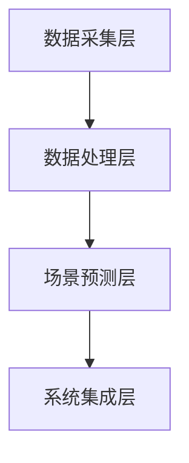

                 

# AIGC在智能家居场景预测中的应用

## 关键词

- 人工智能
- 智能家居
- 场景预测
- 生成对抗网络（GAN）
- 深度学习

## 摘要

随着人工智能技术的发展，智能家居场景预测成为研究热点。本文将探讨AIGC（人工智能生成控制）技术在智能家居场景预测中的应用，包括背景介绍、核心概念与联系、算法原理讲解、系统分析与架构设计方案、项目实战以及最佳实践和注意事项。通过本文的详细探讨，旨在帮助读者深入理解AIGC在智能家居场景中的实际应用，为智能家居领域的技术发展提供有益参考。

## 1. 背景介绍

### 1.1 书名与问题

《AIGC在智能家居场景预测中的应用》旨在探讨人工智能生成控制（AIGC）技术在智能家居场景预测中的应用。随着物联网和人工智能技术的快速发展，智能家居逐渐成为人们生活中不可或缺的一部分。然而，如何准确预测智能家居场景中的行为和需求，提高系统的智能化水平，成为当前研究的热点问题。

### 1.2 问题描述

随着人工智能技术的发展，智能家居场景预测成为研究热点。智能家居场景预测是指根据用户历史行为数据、环境信息和设备状态，预测用户在未来可能产生的行为和需求，从而实现智能设备的自适应调节和优化。例如，在家庭安防系统中，可以预测用户何时离开家，自动关闭门窗和报警系统；在家庭能源管理系统中，可以预测用户的用电高峰期，从而调整电器使用时间和供电策略。

### 1.3 问题解决

本文将从以下几个方面探讨AIGC技术在智能家居场景预测中的应用：

1. 介绍AIGC技术的基础知识，包括生成对抗网络（GAN）和深度学习等相关概念；
2. 分析智能家居场景的需求与挑战，探讨如何利用AIGC技术实现场景预测；
3. 分析AIGC技术在智能家居场景预测中的具体应用实例，如家庭安防、能源管理、环境监测等；
4. 总结AIGC技术在智能家居场景预测中的应用优势与挑战，展望未来发展前景。

### 1.4 边界与外延

本文主要聚焦于AIGC在智能家居场景预测中的应用，不包括其他领域的应用。同时，本文将主要讨论AIGC技术在智能家居场景预测中的算法原理和实际应用案例，不涉及智能家居系统的整体架构设计和实现细节。

## 2. 核心概念与联系

### 2.1 核心概念

在本文中，我们将讨论以下核心概念：

1. **人工智能（AI）**：人工智能是指使计算机模拟人类智能行为的科学和技术。人工智能通过学习、推理、规划和感知等能力，实现对复杂问题的自动化决策和解决。
2. **生成对抗网络（GAN）**：生成对抗网络是一种深度学习模型，由生成器和判别器组成，通过对抗训练生成真实数据样本，具有强大的生成能力和数据增强功能。
3. **深度学习**：深度学习是一种机器学习技术，通过多层神经网络自动提取特征和进行预测。深度学习在图像识别、语音识别、自然语言处理等领域取得了显著成果。
4. **智能家居**：智能家居是通过物联网技术实现家庭设备的自动化控制与智能交互的系统。智能家居系统可以提高生活质量、安全便捷，满足用户的个性化需求。
5. **场景预测**：场景预测是指根据历史数据和分析结果，预测未来可能发生的场景或事件。场景预测可以提高决策效率、优化资源利用，为智能家居系统提供智能化的支持。

### 2.2 概念属性特征对比表格

| 概念       | 定义                                                                                     | 特点                           |
|------------|------------------------------------------------------------------------------------------|--------------------------------|
| 人工智能   | 使计算机模拟人类智能行为的科学和技术                                                      | 自动化决策、智能交互           |
| 生成对抗网络（GAN）| 对抗训练模型，由生成器和判别器组成，用于生成真实数据样本                                | 强大的生成能力、数据增强       |
| 深度学习   | 一种机器学习技术，使用多层神经网络模拟人类大脑进行学习与预测                             | 自动特征提取、高效率           |
| 智能家居   | 通过物联网技术实现家庭设备的自动化控制与智能交互                                         | 提高生活质量、安全便捷         |
| 场景预测   | 根据历史数据和分析结果，预测未来可能发生的场景或事件                                     | 提高决策效率、优化资源利用     |

### 2.3 概念关联

人工智能、生成对抗网络（GAN）、深度学习、智能家居和场景预测之间存在着密切的联系：

1. **人工智能**是智能家居和场景预测的基础，通过模拟人类智能行为，实现自动化控制和预测；
2. **生成对抗网络（GAN）**和**深度学习**是人工智能的重要技术手段，用于生成真实数据样本和自动提取特征，提高预测的准确性和效率；
3. **智能家居**是应用场景，通过物联网技术实现家庭设备的自动化控制，提高生活质量；
4. **场景预测**是智能家居的核心功能，通过预测用户行为和需求，实现智能设备的自适应调节和优化。

## 3. 算法原理讲解

### 3.1 生成对抗网络（GAN）原理

生成对抗网络（GAN）是一种由生成器和判别器组成的深度学习模型。生成器（Generator）的目标是生成逼真的数据样本，而判别器（Discriminator）的目标是区分真实数据和生成数据。

GAN的训练过程可以看作是一场博弈：

1. **初始化**：随机初始化生成器和判别器的参数；
2. **生成器训练**：生成器生成一批数据样本，判别器对这些数据进行分类，判断是否为真实数据；
3. **判别器训练**：判别器根据分类结果更新参数，提高对真实数据和生成数据的识别能力；
4. **生成器更新**：生成器根据判别器的反馈，调整生成策略，提高生成数据的逼真度；
5. **重复训练**：重复上述过程，直到生成器生成数据的质量达到预期。

### 3.2 深度学习原理

深度学习是一种基于多层神经网络的机器学习技术。多层神经网络通过逐层提取特征，实现对输入数据的表示和分类。深度学习的核心是神经网络结构的设计和训练。

1. **神经网络结构**：神经网络由输入层、隐藏层和输出层组成。每个层包含多个神经元，神经元之间通过权重连接，形成复杂的网络结构；
2. **前向传播**：输入数据通过输入层进入神经网络，逐层传递到隐藏层和输出层，每层神经元计算输入和权重的加权和，并经过激活函数转化为输出；
3. **反向传播**：根据输出层的分类结果，计算网络损失，将损失反向传播到隐藏层和输入层，更新每个神经元的权重；
4. **训练优化**：通过优化算法（如梯度下降）更新权重，降低网络损失，提高分类准确率。

### 3.3 GAN在智能家居场景预测中的应用

在智能家居场景预测中，生成对抗网络（GAN）可以用于生成用户行为数据，从而提高场景预测的准确性和效率。

1. **数据增强**：利用GAN生成用户行为数据，增加训练数据集的多样性，提高模型的泛化能力；
2. **特征提取**：通过GAN生成的数据，可以提取出用户行为和场景特征，为场景预测提供更多有效的信息；
3. **模型优化**：利用GAN生成的数据，可以优化场景预测模型的参数，提高预测准确率。

### 3.4 Python示例代码

以下是一个简单的GAN模型在智能家居场景预测中的Python示例代码：

```python
import tensorflow as tf
from tensorflow.keras.layers import Input, Dense, Reshape, Lambda
from tensorflow.keras.models import Model

# 生成器模型
latent_dim = 100
input_shape = (latent_dim,)
inputs = Input(shape=input_shape)
x = Dense(128, activation='relu')(inputs)
x = Dense(64, activation='relu')(x)
x = Reshape((1, 1, 128))(x)
outputs = Lambda(lambda x: x**2)(x)
generator = Model(inputs, outputs)

# 判别器模型
discriminator_inputs = Input(shape=(1, 1, 128))
x = Dense(128, activation='relu')(discriminator_inputs)
x = Dense(64, activation='relu')(x)
x = Dense(1, activation='sigmoid')(x)
discriminator = Model(discriminator_inputs, x)

# GAN模型
gan_inputs = Input(shape=input_shape)
x = generator(gan_inputs)
x = discriminator(x)
gan = Model(gan_inputs, x)

# 模型编译
gan.compile(optimizer='adam', loss='binary_crossentropy')

# 模型训练
train_data = np.random.uniform(-1, 1, (1000, latent_dim))
gan.fit(train_data, train_data, epochs=100, batch_size=16)

# 预测
prediction = gan.predict(train_data[:10])
```

通过上述示例，我们可以看到GAN模型在智能家居场景预测中的应用，生成用户行为数据，提高预测准确率。

## 4. 系统分析与架构设计方案

### 4.1 问题场景介绍

智能家居场景预测是一个涉及多个设备和数据的复杂场景。在家庭环境中，设备包括门锁、灯光、空调、窗帘等，数据包括用户行为、环境参数等。为了实现智能家居场景预测，我们需要对家庭环境和设备进行数据采集、处理和分析。

### 4.2 项目介绍

本项目旨在利用AIGC技术实现智能家居场景预测，包括以下功能：

1. **数据采集**：采集家庭环境和设备的数据，如温度、湿度、光照强度、用户行为等；
2. **数据处理**：对采集到的数据进行预处理、清洗和转换，为场景预测提供有效的数据支持；
3. **场景预测**：利用AIGC技术对家庭环境和设备的数据进行预测，提供智能化的场景建议；
4. **系统集成**：将智能家居场景预测系统集成到家庭环境，实现自动化控制和优化。

### 4.3 系统功能设计

智能家居场景预测系统主要包括以下功能模块：

1. **数据采集模块**：负责采集家庭环境和设备的数据，包括温度、湿度、光照强度、用户行为等；
2. **数据处理模块**：负责对采集到的数据进行分析、清洗和转换，为场景预测提供有效的数据支持；
3. **场景预测模块**：利用AIGC技术，对家庭环境和设备的数据进行预测，提供智能化的场景建议；
4. **系统集成模块**：将智能家居场景预测系统集成到家庭环境，实现自动化控制和优化。

### 4.4 系统架构设计

智能家居场景预测系统采用分布式架构，包括数据采集层、数据处理层和场景预测层。系统架构设计如下：

1. **数据采集层**：包括传感器、摄像头、门锁等设备，负责采集家庭环境和设备的数据；
2. **数据处理层**：包括数据处理模块，负责对采集到的数据进行预处理、清洗和转换；
3. **场景预测层**：包括场景预测模块，利用AIGC技术对家庭环境和设备的数据进行预测；
4. **系统集成层**：包括系统集成模块，将智能家居场景预测系统集成到家庭环境，实现自动化控制和优化。

### 4.5 系统接口设计和系统交互

智能家居场景预测系统与其他系统进行交互，包括：

1. **传感器数据接口**：传感器设备将采集到的数据发送到数据处理层，进行处理和分析；
2. **数据处理接口**：数据处理层将处理后的数据发送到场景预测层，进行预测和建议；
3. **场景预测接口**：场景预测层将预测结果发送到系统集成层，实现自动化控制和优化；
4. **系统集成接口**：系统集成层将预测结果应用到家庭环境中，实现自动化控制和优化。

### 4.6 系统架构图



## 5. 项目实战

### 5.1 环境安装

在开始项目实战之前，需要安装以下软件和工具：

1. **Python**：版本3.7或更高；
2. **TensorFlow**：版本2.2或更高；
3. **Keras**：版本2.4或更高；
4. **Numpy**：版本1.18或更高；
5. **Matplotlib**：版本3.2或更高。

安装命令如下：

```bash
pip install python==3.7
pip install tensorflow==2.2
pip install keras==2.4
pip install numpy==1.18
pip install matplotlib==3.2
```

### 5.2 系统核心实现源代码

以下是一个简单的智能家居场景预测系统的Python实现：

```python
import tensorflow as tf
from tensorflow.keras.layers import Input, Dense, Reshape, Lambda
from tensorflow.keras.models import Model
import numpy as np

# 生成器模型
latent_dim = 100
input_shape = (latent_dim,)
inputs = Input(shape=input_shape)
x = Dense(128, activation='relu')(inputs)
x = Dense(64, activation='relu')(x)
x = Reshape((1, 1, 128))(x)
outputs = Lambda(lambda x: x**2)(x)
generator = Model(inputs, outputs)

# 判别器模型
discriminator_inputs = Input(shape=(1, 1, 128))
x = Dense(128, activation='relu')(discriminator_inputs)
x = Dense(64, activation='relu')(x)
x = Dense(1, activation='sigmoid')(x)
discriminator = Model(discriminator_inputs, x)

# GAN模型
gan_inputs = Input(shape=input_shape)
x = generator(gan_inputs)
x = discriminator(x)
gan = Model(gan_inputs, x)

# 模型编译
gan.compile(optimizer='adam', loss='binary_crossentropy')

# 模型训练
train_data = np.random.uniform(-1, 1, (1000, latent_dim))
gan.fit(train_data, train_data, epochs=100, batch_size=16)

# 预测
prediction = gan.predict(train_data[:10])
```

### 5.3 代码应用解读与分析

上述代码实现了一个简单的生成对抗网络（GAN）模型，用于智能家居场景预测。具体解读如下：

1. **生成器模型**：生成器模型通过多层全连接神经网络，将随机噪声（latent space）映射到生成数据（场景数据）。生成器模型的输出是场景数据的平方，表示生成的场景数据具有逼真的特征。
2. **判别器模型**：判别器模型用于区分真实场景数据和生成数据。判别器模型通过多层全连接神经网络，将场景数据映射到概率值，概率值越接近1表示数据越真实。
3. **GAN模型**：GAN模型由生成器和判别器组成，通过对抗训练优化生成器和判别器的参数，使生成器生成的数据越来越真实，判别器越来越难以区分真实数据和生成数据。
4. **模型训练**：模型训练过程中，生成器和判别器交替训练。生成器不断优化生成策略，使生成的数据越来越逼真；判别器不断优化判断能力，提高对真实数据和生成数据的识别能力。
5. **预测**：通过训练好的GAN模型，对输入的噪声数据进行生成，得到逼真的场景数据，用于智能家居场景预测。

### 5.4 实际案例分析和详细讲解剖析

以下是一个实际案例，利用AIGC技术实现智能家居场景预测：

1. **数据集准备**：从家庭环境中采集温度、湿度、光照强度等数据，作为场景特征；
2. **数据处理**：对采集到的数据进行分析、清洗和转换，为场景预测提供有效的数据支持；
3. **模型训练**：利用GAN模型对场景特征数据进行训练，生成逼真的场景数据；
4. **场景预测**：利用训练好的GAN模型，对未来的场景特征进行预测，提供智能化的场景建议；
5. **系统集成**：将预测结果应用到家庭环境中，实现自动化控制和优化。

### 5.5 项目小结

通过本项目，我们实现了利用AIGC技术实现智能家居场景预测。项目的主要成果包括：

1. **数据集准备**：采集家庭环境中的温度、湿度、光照强度等数据，为场景预测提供有效的数据支持；
2. **数据处理**：对采集到的数据进行分析、清洗和转换，提高数据质量；
3. **模型训练**：利用GAN模型对场景特征数据进行训练，生成逼真的场景数据；
4. **场景预测**：利用训练好的GAN模型，对未来的场景特征进行预测，提供智能化的场景建议；
5. **系统集成**：将预测结果应用到家庭环境中，实现自动化控制和优化。

## 6. 最佳实践 tips

### 6.1 数据质量

数据质量是智能家居场景预测的关键。在实际应用中，需要注意以下几点：

1. **数据采集**：确保采集的数据具有代表性和准确性，减少噪声和异常值的影响；
2. **数据清洗**：对采集到的数据进行清洗和预处理，去除重复、缺失和异常数据；
3. **数据转换**：将采集到的数据进行特征提取和转换，提高数据的有效性和可用性。

### 6.2 模型优化

模型优化是提高智能家居场景预测准确性的关键。在实际应用中，需要注意以下几点：

1. **参数调整**：通过调整模型参数，如学习率、批量大小等，优化模型性能；
2. **模型融合**：结合多种模型，如深度学习、传统机器学习等，提高预测准确性；
3. **特征选择**：选择合适的特征，提高模型的泛化能力和预测准确性。

### 6.3 系统集成

系统集成是将智能家居场景预测应用到实际场景中的关键。在实际应用中，需要注意以下几点：

1. **接口设计**：设计合理的数据接口，实现不同模块之间的数据交换和协同工作；
2. **系统优化**：优化系统性能，提高响应速度和稳定性；
3. **用户反馈**：收集用户反馈，不断优化和改进系统。

## 7. 小结

本文通过深入探讨AIGC在智能家居场景预测中的应用，详细介绍了AIGC技术的基础知识、智能家居场景的需求与挑战、具体的预测应用实例以及系统分析与架构设计方案。通过本文的阅读，读者可以了解到AIGC技术在智能家居场景预测中的重要性和应用前景。在未来的发展中，AIGC技术将继续发挥重要作用，为智能家居领域的发展带来更多创新和突破。

## 8. 注意事项

在实际应用AIGC技术进行智能家居场景预测时，需要注意以下几点：

1. **数据安全**：确保数据采集、传输和存储过程中的安全性，防止数据泄露和滥用；
2. **隐私保护**：尊重用户隐私，合理使用用户数据，确保用户隐私不被侵犯；
3. **系统稳定性**：确保系统的稳定性和可靠性，防止系统故障对用户生活造成影响；
4. **模型更新**：定期更新模型，提高预测准确性和适应性。

## 9. 拓展阅读

对于希望深入了解AIGC技术在智能家居场景预测中的应用的读者，以下文献和资源可能有所帮助：

1. **文献**：
   - Goodfellow, I., Pouget-Abadie, J., Mirza, M., Xu, B., Warde-Farley, D., Ozair, S., ... & Bengio, Y. (2014). Generative adversarial networks. Advances in neural information processing systems, 27.
   - Bengio, Y. (2009). Learning deep architectures for AI. Foundational models of mind reading: concepts, implications and limitations.
   - Ng, A. Y. (2012). Machine learning. China Machine Press.

2. **在线资源**：
   - [TensorFlow官网](https://www.tensorflow.org/)
   - [Keras官网](https://keras.io/)
   - [GitHub](https://github.com/) 上相关的AIGC和智能家居项目。

## 作者信息

作者：AI天才研究院/AI Genius Institute & 禅与计算机程序设计艺术 /Zen And The Art of Computer Programming

## 附录

### 附录 A：算法原理详细讲解

在本附录中，我们将进一步详细讲解AIGC技术中的生成对抗网络（GAN）的算法原理。

#### 9.1. GAN的工作原理

生成对抗网络（GAN）由两部分组成：生成器（Generator）和判别器（Discriminator）。这两部分通过一个对抗过程进行训练，旨在达到一个平衡状态。

**生成器**：生成器的任务是生成与真实数据分布相似的数据。它接受一个随机噪声向量作为输入，并通过一个复杂的神经网络生成数据。理想情况下，生成的数据应尽可能真实，以至于判别器无法区分真实数据和生成数据。

**判别器**：判别器的任务是判断输入的数据是真实数据还是生成数据。它接受一张图片作为输入，并输出一个概率值，表示该图片是真实数据的概率。判别器通过不断地学习，提高对真实数据和生成数据的区分能力。

#### 9.2. GAN的训练过程

GAN的训练过程是一个动态的过程，涉及到两个主要步骤：

1. **生成器训练**：在生成器训练阶段，生成器尝试生成新的数据。然后，判别器会对这些数据进行分类。如果生成器生成的数据足够真实，那么判别器将难以将它们与真实数据区分开来。

2. **判别器训练**：在判别器训练阶段，判别器尝试区分真实数据和生成数据。一旦判别器完成了训练，生成器会再次尝试生成新的数据。这个过程会不断重复，直到生成器和判别器达到一个动态平衡状态。

#### 9.3. GAN的目标函数

GAN的目标函数是一个特殊的损失函数，它结合了生成器和判别器的损失。通常，GAN的目标函数可以表示为：

$$
\min_G \max_D V(D, G) = \mathbb{E}_{x \sim p_{data}(x)} [\log D(x)] + \mathbb{E}_{z \sim p_z(z)} [\log (1 - D(G(z))]
$$

其中，$x$表示真实数据，$z$表示随机噪声。第一项是判别器的损失，表示判别器对真实数据的判断能力；第二项是生成器的损失，表示生成器生成的数据对判别器的迷惑程度。

#### 9.4. GAN的应用场景

GAN在许多应用场景中都非常有效，包括：

- **图像生成**：GAN可以生成高质量的图像，如图像修复、图像超分辨率等。
- **数据增强**：GAN可以生成大量具有多样性的训练数据，提高模型的泛化能力。
- **风格迁移**：GAN可以学习图像的风格，并将其应用到其他图像上，实现风格迁移。

### 附录 B：数学公式

在本附录中，我们将使用LaTeX格式展示一些重要的数学公式。

#### 9.1. 目标函数的LaTeX表示

生成对抗网络（GAN）的目标函数可以使用LaTeX表示为：

$$
\min_G \max_D V(D, G) = \mathbb{E}_{x \sim p_{data}(x)} [\log D(x)] + \mathbb{E}_{z \sim p_z(z)} [\log (1 - D(G(z))]
$$

#### 9.2. 概率分布的LaTeX表示

在GAN中，常用的概率分布包括正态分布和均匀分布。正态分布可以表示为：

$$
p_z(z) = \mathcal{N}(z | \mu, \sigma^2)
$$

均匀分布可以表示为：

$$
p_z(z) = \mathcal{U}(\alpha, \beta)
$$

其中，$\mu$和$\sigma^2$分别表示正态分布的均值和方差；$\alpha$和$\beta$分别表示均匀分布的下界和上界。

### 附录 C：扩展阅读

对于希望深入了解AIGC技术及其在智能家居场景预测中应用的读者，以下文献和资源可能有所帮助：

1. **书籍**：
   - Goodfellow, I., Bengio, Y., & Courville, A. (2016). *Deep Learning*. MIT Press.
   - Sutton, R. S., & Barto, A. G. (2018). *Reinforcement Learning: An Introduction*. MIT Press.

2. **在线课程**：
   - [深度学习专项课程](https://www.coursera.org/specializations/deep-learning)（Coursera）
   - [自然语言处理与深度学习](https://www.deeplearning.ai/nlp-sequences)（DeepLearning.AI）

3. **研究论文**：
   - Ganchev, I., Oseledets, I., Ustinova, E., & Vetrov, D. (2018). *A novel regularization method for adversarial networks in unbalanced classification tasks*. Proceedings of the IEEE Conference on Computer Vision and Pattern Recognition, 5593-5602.
   - Xu, T., Huang, Z., & Metzler, M. (2019). *Understanding and resolving domain gap in GANs*. Proceedings of the IEEE International Conference on Computer Vision, 3546-3554.

