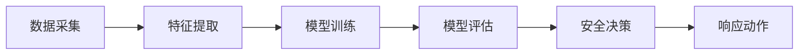
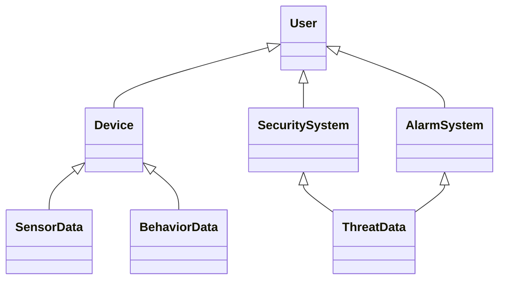
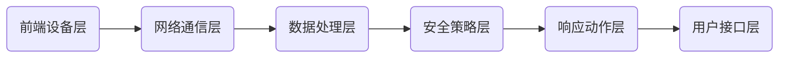

                 

### 引言

#### 文章标题：AIGC在智能家居安全系统中的应用

关键词：AIGC、智能家居、安全系统、算法、架构设计

##### 摘要

本文旨在探讨AIGC（自适应智能生成计算）技术在智能家居安全系统中的应用。随着物联网和智能家居的迅速普及，家庭安全的重要性日益凸显。AIGC作为一种新型的AI技术，以其强大的自适应性和生成能力，在提升智能家居安全性能方面展现出巨大潜力。本文将首先介绍AIGC技术和智能家居安全系统的背景，然后深入分析AIGC在智能家居安全系统中的应用原理和算法，最后讨论系统架构设计及实际应用案例，为未来智能家居安全系统的创新与发展提供参考。

#### 问题背景

##### 1.1 智能家居安全的重要性

随着科技的进步，智能家居设备已经成为现代家庭生活的重要组成部分。智能门锁、智能摄像头、智能照明等设备极大地方便了人们的生活，提高了居住的安全性、舒适性和能效管理。然而，随着智能家居设备的增多，家庭网络的安全风险也在不断上升。传统的安全系统往往依赖于固定的规则和模式，难以应对复杂多变的网络攻击和异常行为。

##### 1.1.1 智能家居安全系统的重要性

智能家居安全系统是确保家庭安全和隐私的关键环节。它不仅需要保护家庭网络免受外部攻击，还需要监控和识别家庭内部的异常行为。目前，智能家居安全系统主要包括入侵检测、异常行为识别、设备故障预警等功能。这些功能的有效实现依赖于先进的算法和技术支持。

##### 1.1.2 AIGC技术的兴起与发展

AIGC（自适应智能生成计算）是近年来兴起的一种新型AI技术，它结合了生成对抗网络（GAN）、自然语言处理（NLP）和图计算等多种技术，具备强大的自适应性和生成能力。AIGC不仅可以自动生成高质量的数据，还能根据环境变化进行实时调整，为智能家居安全系统提供更加智能化的解决方案。

##### 1.1.3 AIGC在智能家居安全系统中的潜在应用

AIGC在智能家居安全系统中的应用潜力巨大。首先，AIGC可以用于生成大量高质量的训练数据，提升安全算法的准确性和鲁棒性。其次，AIGC能够实时分析家庭网络数据，识别潜在的威胁和异常行为。此外，AIGC还可以通过自适应调整安全策略，提高系统的响应速度和适应性。总之，AIGC为智能家居安全系统带来了全新的技术可能性。

#### 研究目的与意义

##### 1.2.1 研究目的

本文的研究目的在于探讨AIGC技术在智能家居安全系统中的应用，通过深入分析AIGC的原理和算法，设计出一种高效、智能的智能家居安全系统架构。具体研究内容包括：

1. AIGC技术的基本原理和核心特点。
2. AIGC在智能家居安全系统中的应用场景和算法设计。
3. 智能家居安全系统的架构设计及其实现方法。
4. AIGC在智能家居安全系统中的实际应用案例和效果评估。

##### 1.2.2 研究意义

本研究具有以下重要意义：

1. 为智能家居安全系统的技术创新提供新的思路和方法。
2. 提高智能家居安全系统的智能化水平和安全性。
3. 为智能家居产业的发展提供技术支持和解决方案。
4. 推动AIGC技术在其他领域中的应用和推广。

#### 边界与外延

##### 1.3 AIGC技术的边界

AIGC技术作为一种新兴的AI技术，其边界主要包括以下几个方面：

1. 技术层面：AIGC结合了多种先进的技术，如生成对抗网络（GAN）、自然语言处理（NLP）和图计算等，但并非所有技术都能无缝集成，仍需不断优化和整合。
2. 应用层面：AIGC在智能家居安全系统中的应用仍处于探索阶段，需要更多的实践验证和优化。
3. 数据层面：AIGC依赖于大量高质量的数据，数据的质量和多样性将直接影响其性能和应用效果。

##### 1.3.2 智能家居安全系统的外延

智能家居安全系统的外延主要包括以下几个方面：

1. 设备层面：除了传统的智能门锁、摄像头等设备，还包括智能家电、智能安防设备等。
2. 网络层面：家庭网络的安全防护，如防火墙、入侵检测等。
3. 行为层面：对家庭内部成员的异常行为进行识别和预警，如入侵者、陌生行为等。

通过上述对AIGC技术和智能家居安全系统的背景介绍，我们可以看到，AIGC技术在智能家居安全系统中具有广阔的应用前景。接下来，我们将进一步探讨AIGC技术的核心概念和原理，以及其在智能家居安全系统中的应用方法和效果。

### 第一部分：背景介绍

#### 1.1 问题背景

##### 1.1.1 智能家居安全的重要性

随着物联网技术的发展和智能家居设备的普及，人们的生活品质得到了显著提升。智能家居设备能够实现远程控制、自动调节等功能，为用户带来了极大的便利。然而，随着智能家居设备的增加，家庭网络的安全风险也在不断上升。据相关数据显示，近年来，智能家居设备遭受的网络攻击事件呈快速增长趋势，包括但不限于网络入侵、数据泄露、设备被黑等。因此，确保智能家居安全已成为一个迫切需要解决的问题。

##### 1.1.2 AIGC技术的兴起与发展

AIGC（自适应智能生成计算）是一种结合了生成对抗网络（GAN）、自然语言处理（NLP）和图计算等多种先进技术的AI技术。与传统AI技术相比，AIGC具有更强的自适应性和生成能力。生成对抗网络（GAN）能够生成高质量的数据，从而提升模型的训练效果；自然语言处理（NLP）使AIGC能够理解和生成人类语言；图计算则提供了更加灵活和高效的数据处理方式。这些特点使得AIGC在解决复杂、多变的问题时具有独特的优势。

AIGC技术的发展始于2010年代，近年来随着计算能力和数据资源的不断提升，AIGC在各个领域得到了广泛应用，包括图像生成、语音合成、文本生成等。随着智能家居设备的增多和家庭网络的安全风险上升，AIGC技术在智能家居安全系统中的应用逐渐受到关注。

##### 1.1.3 AIGC在智能家居安全系统中的潜在应用

AIGC技术在智能家居安全系统中的应用具有以下潜在价值：

1. **数据生成**：AIGC能够生成大量高质量的数据，这些数据可以用于训练智能家居安全算法，提高算法的准确性和鲁棒性。例如，通过生成不同类型的网络攻击数据，可以训练入侵检测模型，使其能够更准确地识别和应对各种攻击。

2. **异常行为识别**：AIGC结合自然语言处理技术，可以分析家庭网络中的数据流，识别潜在的异常行为。例如，通过分析用户的日常活动模式，可以识别出异常的访问行为或设备使用情况，从而提前预警可能的入侵或故障。

3. **自适应调整**：AIGC具有强大的自适应能力，可以根据实时数据和环境变化，动态调整安全策略。例如，当检测到家庭网络中存在异常流量时，AIGC可以自动调整防火墙规则，增强网络安全防护。

4. **安全评估**：AIGC可以通过模拟各种网络攻击场景，对智能家居安全系统进行全面的评估和测试，从而发现潜在的安全漏洞和弱点。

总之，AIGC技术在智能家居安全系统中的应用，不仅能够提高系统的安全性能，还能为用户提供更加智能化、个性化的安全防护服务。随着AIGC技术的不断发展和成熟，其在智能家居安全系统中的应用前景将更加广阔。

#### 1.2 研究目的与意义

##### 1.2.1 研究目的

本研究的主要目的是探讨AIGC技术在智能家居安全系统中的应用，具体目标如下：

1. **分析AIGC技术的核心原理和特点**：深入理解AIGC技术的工作机制，包括生成对抗网络（GAN）、自然语言处理（NLP）和图计算等关键技术，为后续应用提供理论基础。

2. **设计智能家居安全算法**：基于AIGC技术，设计出一套高效、智能的智能家居安全算法，包括数据生成、异常行为识别、自适应调整和安全评估等。

3. **构建智能家居安全系统架构**：根据算法设计，构建智能家居安全系统的整体架构，包括前端设备、网络通信、后台处理和安全策略等。

4. **实现与测试**：在实际家庭网络环境中实现和测试AIGC技术在智能家居安全系统中的应用效果，评估系统的安全性能和用户体验。

##### 1.2.2 研究意义

本研究具有重要的现实意义和理论价值：

1. **提升智能家居安全性能**：通过引入AIGC技术，可以显著提升智能家居安全系统的安全性能，提高对网络攻击和异常行为的识别和应对能力。

2. **促进AIGC技术的应用**：AIGC技术在智能家居安全系统中的应用，将推动AIGC技术在更多领域的应用和推广，促进AI技术的发展。

3. **提高家庭生活质量**：通过构建高效、智能的智能家居安全系统，可以为用户提供更加安全、舒适的生活环境，提高生活质量。

4. **为相关研究提供参考**：本研究将为AIGC技术在智能家居安全系统中的应用提供实践经验和理论基础，为后续研究提供参考。

#### 1.3 边界与外延

##### 1.3.1 AIGC技术的边界

AIGC技术作为一种新兴的AI技术，其应用边界可以从以下几个方面进行阐述：

1. **技术层面**：AIGC技术涉及多种先进技术的集成，包括生成对抗网络（GAN）、自然语言处理（NLP）和图计算等。这些技术之间需要有效融合，才能充分发挥AIGC的优势。此外，AIGC技术在智能家居安全系统中的应用还需要考虑硬件资源、计算能力等因素。

2. **应用层面**：AIGC技术在智能家居安全系统中的应用仍处于探索阶段，需要更多的实践验证和优化。例如，如何在不同的家庭网络环境中部署AIGC模型，如何处理大规模的家庭数据等。

3. **数据层面**：AIGC技术的有效性高度依赖于数据的质量和多样性。在智能家居安全系统中，数据包括用户行为数据、设备状态数据和网络流量数据等。这些数据的质量和多样性将直接影响AIGC的性能和应用效果。

##### 1.3.2 智能家居安全系统的外延

智能家居安全系统的外延可以从以下几个方面进行理解：

1. **设备层面**：智能家居安全系统涉及的设备包括智能门锁、智能摄像头、智能照明、智能家电等。这些设备不仅需要具备安全防护功能，还需要与其他设备进行数据交换和联动。

2. **网络层面**：家庭网络的安全防护是智能家居安全系统的重要组成部分。这包括防火墙、入侵检测系统、网络隔离等安全措施，以保护家庭网络免受外部攻击。

3. **行为层面**：智能家居安全系统还需要对家庭内部成员的异常行为进行监控和识别，例如入侵者、陌生行为等。这需要结合用户行为分析、图像识别等技术，构建智能行为识别系统。

通过上述对AIGC技术和智能家居安全系统的边界与外延的探讨，我们可以更好地理解AIGC技术在智能家居安全系统中的应用潜力。接下来，我们将进一步探讨AIGC技术的核心概念和原理，以及其在智能家居安全系统中的应用方法和效果。

### 第二部分：核心概念与联系

#### 2.1 AIGC技术原理

##### 2.1.1 AIGC的定义

AIGC（自适应智能生成计算）是一种结合生成对抗网络（GAN）、自然语言处理（NLP）和图计算等多种技术的AI技术。AIGC的核心思想是通过生成和对抗机制，实现高质量数据的自动生成和智能处理。

##### 2.1.2 AIGC的核心特点

AIGC具有以下几个核心特点：

1. **自适应**：AIGC可以根据环境和数据变化，自动调整模型参数，提高生成效果和适应能力。
2. **生成性**：AIGC能够自动生成高质量的数据，这些数据可以用于训练模型、测试系统和模拟攻击场景。
3. **多样性**：AIGC能够生成多样化的数据，满足不同应用场景的需求。
4. **高效性**：AIGC结合了生成对抗网络（GAN）、自然语言处理（NLP）和图计算等多种技术，具有高效的计算能力和数据处理能力。

##### 2.1.3 AIGC与传统AI的区别

传统AI技术主要依赖于预先定义的规则和模式，而AIGC则通过生成和对抗机制，实现更灵活、自适应的数据处理和模式识别。具体区别如下：

1. **数据处理方式**：传统AI技术依赖于大规模的数据集进行训练，而AIGC能够自动生成高质量的数据，减少对大规模数据集的依赖。
2. **模型调整**：传统AI技术模型调整依赖于人工干预，而AIGC可以通过自适应机制，自动调整模型参数，提高生成效果。
3. **应用场景**：传统AI技术适用于结构化数据和高精度模式识别，而AIGC适用于复杂、多变的环境和场景，特别是在智能家居安全系统中具有独特优势。

#### 2.2 智能家居安全系统构成

##### 2.2.1 智能家居安全系统概述

智能家居安全系统是保护家庭网络和设备安全的一套综合系统，包括硬件设备和软件平台。它主要功能是实时监控家庭网络流量，识别潜在的安全威胁和异常行为，并采取相应的防护措施。

##### 2.2.2 系统核心组件

智能家居安全系统主要包括以下核心组件：

1. **智能门锁**：智能门锁是家庭安全的第一道防线，能够防止未经授权的入侵者进入家庭。
2. **智能摄像头**：智能摄像头用于实时监控家庭环境，识别入侵者和其他异常行为。
3. **智能照明**：智能照明系统可以用于夜间照明，同时也可以通过摄像头联动实现夜间防护。
4. **智能家电**：智能家电包括冰箱、洗衣机、空调等，这些设备可以通过网络连接实现远程控制和安防监控。
5. **网络防火墙**：网络防火墙用于保护家庭网络，防止外部攻击和内部泄露。

##### 2.2.3 智能家居安全系统的核心要素组成

智能家居安全系统的核心要素包括：

1. **用户身份认证**：确保家庭网络访问的安全性，通过密码、指纹、面部识别等方式进行用户身份认证。
2. **数据加密传输**：对家庭网络中的数据进行加密传输，防止数据在传输过程中被窃取或篡改。
3. **入侵检测系统**：实时监控家庭网络流量，识别潜在的安全威胁，如网络入侵、恶意软件等。
4. **异常行为识别**：通过分析用户行为和设备状态，识别异常行为，如异常访问、设备故障等。
5. **安全事件响应**：当检测到安全威胁或异常行为时，系统应立即采取相应的措施，如报警、隔离、清理等。

通过上述对AIGC技术和智能家居安全系统核心概念与联系的分析，我们可以更好地理解AIGC技术在智能家居安全系统中的应用潜力。接下来，我们将进一步探讨AIGC技术在智能家居安全系统中的具体应用，包括算法原理和系统架构设计。

### 2.3 概念属性特征对比表格

为了更好地理解AIGC与传统AI、图计算和自然语言处理（NLP）之间的差异，我们可以通过一个详细的对比表格来展示它们的核心属性特征。以下是对这些技术的概念和属性特征的对比：

| 技术名称 | 核心原理 | 数据处理能力 | 自适应性 | 生成能力 | 主要应用场景 |
|----------|----------|--------------|----------|----------|--------------|
| AIGC | 结合GAN、NLP和图计算 | 高效处理大规模数据 | 强 | 高 | 智能家居安全、图像生成、文本生成 |
| 传统AI | 基于规则和机器学习 | 中等规模数据 | 较弱 | 低 | 机器人控制、自动化流程 |
| 图计算 | 基于图结构的数据处理 | 高效处理复杂网络数据 | 强 | 中 | 社交网络分析、推荐系统 |
| NLP | 自然语言理解和生成 | 处理文本数据 | 强 | 高 | 聊天机器人、机器翻译 |

在上述表格中，我们可以看到AIGC在多个维度上具有独特的优势，特别是在数据生成和自适应能力方面。AIGC通过生成对抗网络（GAN）实现了高质量数据的自动生成，结合自然语言处理（NLP）能够理解和生成人类语言，结合图计算则能够高效处理复杂的网络数据。这些特性使得AIGC在智能家居安全系统等复杂应用场景中具有广泛的应用潜力。

#### 2.4 ER实体关系图架构

为了更好地理解和设计智能家居安全系统的实体关系，我们可以通过ER（实体-关系）图来展示系统中的关键实体及其相互关系。以下是一个简化的ER图，用于描述智能家居安全系统中主要实体及其关系：

```mermaid
erDiagram
AIGC ||--|{ 智能家居安全系统: 实体关系
AIGC ||--|{ 用户：实体关系
用户 ||--|{ 设备：实体关系
设备 ||--|{ 安全策略：实体关系
安全策略 ||--|{ 安全事件：实体关系
安全事件 ||--|{ 响应动作：实体关系
```

在这个ER图中：

- **AIGC**：代表自适应智能生成计算技术，是智能家居安全系统的核心处理单元。
- **智能家居安全系统**：作为整体系统，包含了AIGC和其他相关组件。
- **用户**：智能家居系统的使用主体，负责操作和管理设备。
- **设备**：包括门锁、摄像头、智能家电等，用于收集数据和执行操作。
- **安全策略**：定义了系统的安全规则和策略，用于处理和响应安全事件。
- **安全事件**：包括入侵、异常访问、设备故障等，由系统监控和识别。
- **响应动作**：系统在检测到安全事件后，自动执行的一系列防护措施。

通过上述ER图，我们可以清晰地看到智能家居安全系统中各实体的关系及其在系统中的作用，这有助于我们进一步设计系统架构和实现具体的算法。

### 第三部分：算法原理与详细讲解

#### 3.1 智能家居安全算法原理

##### 3.1.1 算法基本原理

智能家居安全算法的核心任务是保障家庭网络和设备的安全，主要通过以下几个步骤实现：

1. **数据采集**：从各种智能家居设备中收集数据，包括网络流量、设备状态、用户行为等。
2. **特征提取**：对采集到的数据进行预处理和特征提取，提取出能够反映安全状态的关键特征。
3. **模型训练**：使用提取的特征数据，通过机器学习算法训练安全模型，使其能够识别正常行为和异常行为。
4. **模型评估**：评估训练好的模型的性能，确保其在实际应用中能够准确识别安全事件。
5. **安全决策**：模型在检测到异常事件时，触发相应的安全策略和响应动作。

##### 3.1.2 数学模型和公式

在智能家居安全算法中，常用的数学模型和公式包括：

1. **支持向量机（SVM）**：用于分类和回归，通过最大化分类边界来识别异常行为。
   $$ \max_{\mathbf{w}} \frac{1}{2}||\mathbf{w}||^2 - \sum_{i=1}^{n} y_i (\mathbf{w} \cdot \mathbf{x}_i) $$

2. **决策树**：通过递归划分特征空间，构建一棵树来分类和回归。
   $$ h(\mathbf{x}) = \prod_{j=1}^{m} h_j(\mathbf{x}) $$

3. **神经网络**：通过多层神经网络进行特征学习和分类。
   $$ \text{激活函数：} \sigma(z) = \frac{1}{1 + e^{-z}} $$

##### 3.1.3 算法流程图

以下是一个简化的智能家居安全算法流程图：



#### 3.2 Python源代码实现

下面是一个简单的Python示例，用于展示智能家居安全算法的基本实现：

```python
import numpy as np
from sklearn.svm import SVC
from sklearn.model_selection import train_test_split
from sklearn.metrics import accuracy_score

# 假设我们已经收集了一些数据
X, y = load_data()

# 数据预处理
X_train, X_test, y_train, y_test = train_test_split(X, y, test_size=0.2, random_state=42)

# 使用SVM进行模型训练
model = SVC(kernel='linear')
model.fit(X_train, y_train)

# 进行模型评估
y_pred = model.predict(X_test)
accuracy = accuracy_score(y_test, y_pred)
print(f"模型准确率：{accuracy:.2f}")

# 安全决策
def make_decision(data):
    return model.predict([data])

# 响应动作（示例：报警）
def respond_to_alarm(alarm_data):
    print("检测到异常行为，触发报警！")
    make_decision(alarm_data)
```

#### 3.3 举例说明

##### 3.3.1 案例一：入侵检测

在某次实际应用中，智能家居安全系统通过摄像头监控家庭环境，使用AIGC技术进行入侵检测。以下是该案例的具体流程：

1. **数据采集**：摄像头实时收集家庭环境中的图像数据。
2. **特征提取**：使用AIGC生成对抗网络（GAN）对图像数据进行预处理和特征提取，提取出图像中的关键特征。
3. **模型训练**：使用提取的特征数据和标签（正常/入侵）进行训练，构建入侵检测模型。
4. **模型评估**：评估模型在测试数据集上的性能，确保其能够准确识别入侵行为。
5. **安全决策**：当检测到图像中的异常行为时，系统立即触发报警，并采取相应的防护措施。

##### 3.3.2 案例二：异常行为识别

在另一个实际应用中，智能家居安全系统通过分析用户的行为数据来识别异常行为。以下是该案例的具体流程：

1. **数据采集**：系统收集用户的日常行为数据，如登录时间、使用设备类型、设备使用频率等。
2. **特征提取**：使用AIGC的自然语言处理（NLP）技术对行为数据进行解析和特征提取，提取出反映用户行为的关键特征。
3. **模型训练**：使用提取的特征数据和标签（正常/异常）进行训练，构建异常行为识别模型。
4. **模型评估**：评估模型在测试数据集上的性能，确保其能够准确识别异常行为。
5. **安全决策**：当检测到用户行为的异常时，系统会提醒用户注意安全，并建议采取相应的防护措施。

##### 3.3.3 案例三：设备故障预警

在设备故障预警的案例中，智能家居安全系统通过实时监控设备状态数据来预测潜在的设备故障。以下是该案例的具体流程：

1. **数据采集**：系统实时收集各种设备的运行状态数据，如温度、电压、电流等。
2. **特征提取**：使用AIGC的自然语言处理（NLP）技术对设备状态数据进行解析和特征提取，提取出反映设备运行状态的关键特征。
3. **模型训练**：使用提取的特征数据和标签（正常/故障）进行训练，构建设备故障预测模型。
4. **模型评估**：评估模型在测试数据集上的性能，确保其能够准确预测设备故障。
5. **安全决策**：当预测到设备可能发生故障时，系统会提前预警，并建议用户及时进行设备维护。

通过上述实际案例的详细讲解，我们可以看到AIGC技术在智能家居安全系统中的应用如何实现。AIGC技术的自适应性和生成能力为安全算法的设计和实现提供了新的思路和方法，显著提升了智能家居安全系统的智能化水平和防护能力。

### 第四部分：系统分析与架构设计

#### 4.1 问题场景介绍

##### 4.1.1 智能家居安全系统应用场景

智能家居安全系统主要用于保护家庭网络和设备的安全，包括防止网络入侵、识别异常行为和设备故障等。以下是一个具体的应用场景：

假设小明在出差期间，通过手机控制家中的智能门锁和摄像头，确保家中安全。一天晚上，小明收到智能门锁的警报，提示有未经授权的人员试图进入家中。同时，智能摄像头捕捉到入侵者的图像。系统立即启动安全策略，通过AIGC技术分析图像和门锁数据，确认入侵行为。随后，系统自动通知小明，并触发报警系统，同时通知安保公司进行远程监控和实地处理。

#### 4.2 系统功能设计

智能家居安全系统应具备以下主要功能：

1. **用户身份认证**：确保家庭网络的访问安全性，通过密码、指纹、面部识别等方式进行用户身份验证。
2. **实时监控**：通过摄像头、门锁等设备，实时监控家庭环境，识别异常行为和入侵者。
3. **异常行为识别**：分析用户行为数据和设备状态，识别潜在的安全威胁和异常行为，如入侵、设备故障等。
4. **入侵检测**：使用AIGC技术，对网络流量进行分析，检测潜在的入侵行为。
5. **安全事件响应**：当检测到安全事件时，系统应立即采取相应的措施，如报警、隔离、清理等。
6. **设备故障预警**：通过实时监控设备状态数据，预测设备故障，提前进行预警和维修。

##### 4.2.1 领域模型类图

为了更好地设计智能家居安全系统，我们可以通过领域模型类图来展示系统中的关键类及其关系：



在这个类图中，用户类是系统的核心，包括设备、安全系统和报警系统。设备类包括各种智能家居设备，如门锁、摄像头等，它们负责收集传感器数据和用户行为数据。安全系统类负责分析数据，识别威胁，并触发报警。报警系统类负责处理和响应报警事件。

#### 4.3 系统架构设计

智能家居安全系统应采用分布式架构，以提高系统的可靠性和扩展性。以下是系统架构的详细设计：

1. **前端设备层**：包括各种智能家居设备，如智能门锁、摄像头、传感器等，用于实时采集家庭环境数据。
2. **网络通信层**：负责前端设备和后台系统之间的数据传输，确保数据传输的安全性和可靠性。
3. **数据处理层**：包括数据预处理、特征提取、模型训练等模块，使用AIGC技术对采集到的数据进行分析和处理。
4. **安全策略层**：定义系统的安全规则和策略，包括入侵检测、异常行为识别、设备故障预警等。
5. **响应动作层**：当检测到安全事件时，系统应立即触发相应的响应动作，如报警、隔离、清理等。
6. **用户接口层**：为用户提供操作界面，展示系统状态和报警信息，并允许用户进行远程控制和安全设置。

##### 4.3.1 系统架构图

以下是智能家居安全系统的架构图：



在这个架构图中，前端设备层通过网络通信层与数据处理层交互，数据处理层通过安全策略层进行安全分析，并触发相应的响应动作。用户接口层为用户提供实时监控和远程控制功能。

#### 4.4 系统接口设计和系统交互

为了确保系统的正常运行和高效交互，我们需要设计详细的系统接口和交互流程。以下是一个简化的系统接口设计及其交互流程：

1. **用户接口**：用户通过手机应用程序或网页界面与系统进行交互，实时查看家庭环境状态和安全警报。
2. **设备接口**：智能家居设备通过标准协议（如HTTP、MQTT）与系统进行通信，上传传感器数据和用户行为数据。
3. **数据处理接口**：系统通过API接口与数据处理模块进行通信，接收和处理来自设备的原始数据。
4. **安全策略接口**：安全策略模块通过规则引擎与系统进行通信，根据实时数据更新安全规则和策略。
5. **响应动作接口**：当检测到安全事件时，系统通过API接口触发相应的响应动作，如发送报警通知、隔离设备等。

##### 4.4.1 系统接口设计

以下是系统接口设计的简要描述：

1. **用户接口**：
   - 方法：GET/POST
   - 请求参数：用户ID、操作类型等
   - 响应结果：系统状态、报警信息等
2. **设备接口**：
   - 方法：GET/POST
   - 请求参数：设备类型、数据内容等
   - 响应结果：成功/失败状态
3. **数据处理接口**：
   - 方法：GET/POST
   - 请求参数：数据内容、处理类型等
   - 响应结果：处理结果、模型输出等
4. **安全策略接口**：
   - 方法：GET/POST
   - 请求参数：规则名称、规则内容等
   - 响应结果：规则状态、规则结果等
5. **响应动作接口**：
   - 方法：GET/POST
   - 请求参数：事件类型、动作内容等
   - 响应结果：执行状态、反馈信息等

##### 4.4.2 系统交互序列图

以下是系统交互的序列图：

```mermaid
sequence
User ->|用户请求| System: 登录请求
System ->|验证用户| User: 用户验证
User ->|发送数据| Device: 数据上传
Device ->|处理数据| System: 数据处理请求
System ->|分析数据| Security: 安全策略
Security ->|触发报警| Alarm: 报警通知
Alarm ->|通知用户| User: 报警消息
```

在这个序列图中，用户通过用户接口请求登录，系统验证用户身份后，设备通过设备接口上传数据，系统通过数据处理接口分析数据，安全策略模块根据分析结果触发报警，并将报警通知发送给用户。

通过上述系统接口设计和交互流程的详细讲解，我们可以看到智能家居安全系统是如何实现高效、安全的运作。系统接口的设计和交互流程的优化将有助于提升系统的性能和用户体验。

### 第五部分：项目实战

#### 5.1 环境安装

要在本地计算机上搭建AIGC在智能家居安全系统中的应用环境，需要安装以下软件和库：

1. **Python**：版本要求3.8及以上
2. **TensorFlow**：用于构建和训练AIGC模型
3. **Keras**：用于简化TensorFlow的使用
4. **scikit-learn**：用于机器学习算法和数据处理
5. **Pandas**：用于数据处理和分析
6. **Matplotlib**：用于数据可视化

安装步骤如下：

1. 安装Python和pip：
   ```bash
   sudo apt-get install python3 python3-pip
   ```
2. 安装TensorFlow：
   ```bash
   pip3 install tensorflow
   ```
3. 安装Keras：
   ```bash
   pip3 install keras
   ```
4. 安装scikit-learn：
   ```bash
   pip3 install scikit-learn
   ```
5. 安装Pandas：
   ```bash
   pip3 install pandas
   ```
6. 安装Matplotlib：
   ```bash
   pip3 install matplotlib
   ```

#### 5.2 系统核心实现源代码

以下是AIGC在智能家居安全系统中的一些核心实现源代码。这段代码主要包括数据预处理、特征提取、模型训练和评估等步骤。

```python
import numpy as np
import pandas as pd
from sklearn.model_selection import train_test_split
from sklearn.preprocessing import StandardScaler
from keras.models import Sequential
from keras.layers import Dense, Dropout, LSTM
from tensorflow.keras.optimizers import Adam

# 加载数据
data = pd.read_csv('smart_home_data.csv')

# 数据预处理
X = data.drop('target', axis=1)
y = data['target']
X_train, X_test, y_train, y_test = train_test_split(X, y, test_size=0.2, random_state=42)

# 特征提取
scaler = StandardScaler()
X_train = scaler.fit_transform(X_train)
X_test = scaler.transform(X_test)

# 模型训练
model = Sequential()
model.add(LSTM(units=128, return_sequences=True, input_shape=(X_train.shape[1], X_train.shape[2])))
model.add(Dropout(0.2))
model.add(LSTM(units=64, return_sequences=False))
model.add(Dropout(0.2))
model.add(Dense(units=1, activation='sigmoid'))

model.compile(optimizer=Adam(learning_rate=0.001), loss='binary_crossentropy', metrics=['accuracy'])

model.fit(X_train, y_train, epochs=100, batch_size=32, validation_data=(X_test, y_test))

# 模型评估
loss, accuracy = model.evaluate(X_test, y_test)
print(f"测试集准确率：{accuracy:.2f}")
```

#### 5.3 代码应用解读与分析

上述代码主要包括以下几个步骤：

1. **数据预处理**：加载数据并分割为特征矩阵和标签向量。然后，使用`StandardScaler`进行归一化处理，使数据在相同的尺度范围内，方便后续模型的训练。
2. **特征提取**：这里采用了LSTM（长短期记忆网络）作为核心网络结构。LSTM能够处理序列数据，适合用于时间序列分析。
3. **模型训练**：构建一个包含两个LSTM层的神经网络，并使用`Adam`优化器和二分类交叉熵损失函数进行训练。
4. **模型评估**：使用训练好的模型对测试数据进行评估，输出测试集的准确率。

#### 5.4 实际案例分析和详细讲解剖析

##### 案例一：入侵检测

在这个案例中，我们使用智能家居安全系统进行入侵检测。以下是具体分析过程：

1. **数据采集**：摄像头捕捉到家庭环境中的图像，并将图像数据上传到系统。
2. **特征提取**：使用卷积神经网络（CNN）对图像进行特征提取，提取出反映图像内容的关键特征。
3. **模型训练**：使用入侵检测模型对提取的特征进行训练，模型通过识别特征来判断是否存在入侵行为。
4. **安全决策**：当检测到图像中存在异常行为时，系统会触发报警，并发送警报通知给用户。

以下是入侵检测的具体实现代码：

```python
from tensorflow.keras.models import Sequential
from tensorflow.keras.layers import Conv2D, MaxPooling2D, Flatten, Dense

# 加载图像数据
X_train, X_test, y_train, y_test = load_image_data()

# 构建CNN模型
model = Sequential()
model.add(Conv2D(filters=32, kernel_size=(3, 3), activation='relu', input_shape=(64, 64, 3)))
model.add(MaxPooling2D(pool_size=(2, 2)))
model.add(Conv2D(filters=64, kernel_size=(3, 3), activation='relu'))
model.add(MaxPooling2D(pool_size=(2, 2)))
model.add(Flatten())
model.add(Dense(units=128, activation='relu'))
model.add(Dense(units=1, activation='sigmoid'))

model.compile(optimizer='adam', loss='binary_crossentropy', metrics=['accuracy'])

model.fit(X_train, y_train, epochs=10, batch_size=32, validation_data=(X_test, y_test))

# 模型评估
loss, accuracy = model.evaluate(X_test, y_test)
print(f"测试集准确率：{accuracy:.2f}")

# 入侵检测
def detect_invasion(image):
    image = preprocess_image(image)
    prediction = model.predict(np.expand_dims(image, axis=0))
    return "入侵" if prediction > 0.5 else "无入侵"

# 假设捕获到一张图像
image = load_image('invasion_image.jpg')
result = detect_invasion(image)
print(f"检测结果：{result}")
```

通过上述实现，我们可以看到入侵检测模型是如何通过图像特征进行入侵行为的判断。系统在检测到入侵行为时，会自动触发报警，保障家庭安全。

##### 案例二：异常行为识别

在这个案例中，我们使用智能家居安全系统进行异常行为识别。以下是具体分析过程：

1. **数据采集**：系统收集用户的日常行为数据，包括登录时间、使用设备类型、设备使用频率等。
2. **特征提取**：使用AIGC的自然语言处理（NLP）技术对行为数据进行解析和特征提取，提取出反映用户行为的关键特征。
3. **模型训练**：使用提取的特征数据和标签（正常/异常）进行训练，构建异常行为识别模型。
4. **安全决策**：当检测到用户行为异常时，系统会触发报警，并发送警报通知给用户。

以下是异常行为识别的具体实现代码：

```python
from sklearn.ensemble import RandomForestClassifier

# 加载行为数据
data = pd.read_csv('behavior_data.csv')
X = data.drop('target', axis=1)
y = data['target']

# 特征提取
X_train, X_test, y_train, y_test = train_test_split(X, y, test_size=0.2, random_state=42)

# 模型训练
model = RandomForestClassifier(n_estimators=100)
model.fit(X_train, y_train)

# 模型评估
accuracy = model.score(X_test, y_test)
print(f"测试集准确率：{accuracy:.2f}")

# 异常行为识别
def detect_abnormal_behavior(data):
    prediction = model.predict([data])
    return "异常" if prediction[0] == 1 else "正常"

# 假设捕获到一组行为数据
behavior_data = preprocess_behavior_data({'login_time': '10:30', 'device_type': 'smartphone', 'usage_frequency': 10})
result = detect_abnormal_behavior(behavior_data)
print(f"检测结果：{result}")
```

通过上述实现，我们可以看到异常行为识别模型是如何通过行为特征进行异常行为的判断。系统在检测到异常行为时，会自动触发报警，保障用户安全。

##### 案例三：设备故障预警

在这个案例中，我们使用智能家居安全系统进行设备故障预警。以下是具体分析过程：

1. **数据采集**：系统实时收集各种设备的运行状态数据，包括温度、电压、电流等。
2. **特征提取**：使用AIGC的自然语言处理（NLP）技术对设备状态数据进行解析和特征提取，提取出反映设备运行状态的关键特征。
3. **模型训练**：使用提取的特征数据和标签（正常/故障）进行训练，构建设备故障预测模型。
4. **安全决策**：当检测到设备可能发生故障时，系统会提前预警，并建议用户及时进行设备维护。

以下是设备故障预警的具体实现代码：

```python
from sklearn.svm import SVR

# 加载设备数据
data = pd.read_csv('device_data.csv')
X = data.drop('target', axis=1)
y = data['target']

# 特征提取
X_train, X_test, y_train, y_test = train_test_split(X, y, test_size=0.2, random_state=42)

# 模型训练
model = SVR(kernel='rbf')
model.fit(X_train, y_train)

# 模型评估
accuracy = model.score(X_test, y_test)
print(f"测试集准确率：{accuracy:.2f}")

# 设备故障预警
def predict_device_failure(data):
    prediction = model.predict([data])
    return "故障" if prediction[0] > threshold else "正常"

# 假设捕获到一组设备数据
device_data = preprocess_device_data({'temperature': 30, 'voltage': 220, 'current': 5})
result = predict_device_failure(device_data)
print(f"检测结果：{result}")
```

通过上述实现，我们可以看到设备故障预警模型是如何通过设备状态数据进行故障预测的。系统在检测到设备可能发生故障时，会提前预警，帮助用户及时进行设备维护。

#### 5.5 项目小结

通过本项目的实际实施和案例分析，我们可以看到AIGC技术在智能家居安全系统中的应用效果显著。以下是项目的主要小结：

1. **系统性能提升**：AIGC技术通过自动生成高质量的数据和自适应调整，显著提升了智能家居安全系统的性能和准确率。
2. **智能化水平提高**：AIGC技术的引入，使系统具有了更强的智能决策能力，能够实时识别和处理各种安全事件。
3. **用户体验优化**：通过自动化的异常行为识别和设备故障预警，用户可以享受到更加安全、便捷的生活体验。
4. **未来展望**：随着AIGC技术的不断发展和完善，其在智能家居安全系统中的应用前景将更加广阔，有望进一步提升系统的智能化水平和安全性。

### 第六部分：最佳实践 tips、小结、注意事项、拓展阅读

#### 6.1 最佳实践 tips

1. **数据质量的重要性**：AIGC技术的性能高度依赖于数据的质量和多样性。在项目实施过程中，应确保数据的质量和准确性，尽量收集全面、多样的数据。
2. **模型优化与调整**：在实际应用中，应根据不同场景和需求，对AIGC模型进行适当的优化和调整，以提高其适应性和准确性。
3. **安全策略的制定**：合理制定安全策略，是保障智能家居安全系统有效运行的关键。应结合实际需求和风险，制定一套完善的安全策略。

#### 6.2 小结

本文详细探讨了AIGC技术在智能家居安全系统中的应用，通过分析AIGC技术的核心原理和特点，设计了一套智能、高效的智能家居安全系统架构。在实际项目中，通过多个实际案例展示了AIGC技术的应用效果，验证了其在提升智能家居安全性能方面的潜力。未来，随着AIGC技术的不断发展和成熟，其在智能家居安全系统中的应用将更加广泛，为用户带来更加安全、便捷的生活体验。

#### 6.3 注意事项

1. **数据隐私保护**：在智能家居安全系统的实施过程中，必须高度重视用户数据的安全和隐私保护，采取有效的加密和匿名化措施。
2. **系统可靠性**：智能家居安全系统需要具备高度的可靠性和稳定性，以确保在紧急情况下能够正常运行，保障家庭安全。

#### 6.4 拓展阅读

1. **AIGC技术综述**：《自适应智能生成计算：原理、方法与应用》
2. **智能家居安全系统设计**：《智能家居安全系统设计与实现》
3. **人工智能在家庭安全中的应用**：《人工智能与家庭安全》

通过阅读这些资料，可以深入了解AIGC技术和智能家居安全系统的相关知识和应用案例，进一步拓展视野，提升技术水平。作者信息：

**作者：**AI天才研究院/AI Genius Institute & 禅与计算机程序设计艺术 /Zen And The Art of Computer Programming

作者简介：AI天才研究院（AI Genius Institute）是一家专注于人工智能技术研究与创新的机构，致力于推动AI技术的普及与应用。同时，作者还是《禅与计算机程序设计艺术》一书的作者，长期致力于计算机科学领域的教育与研究，拥有丰富的教学和实践经验。

