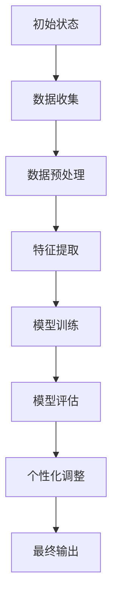

                 

### AIGC在智能家居系统个性化中的应用

#### 关键词：AIGC、智能家居、个性化、算法、系统架构

##### 摘要：
本文旨在探讨AIGC（AI Generated Content）在智能家居系统个性化中的应用。AIGC是一种利用人工智能技术生成内容的方法，能够根据用户行为和偏好提供定制化的智能家居解决方案。文章将详细分析AIGC的核心概念、算法原理、系统架构以及实际应用案例，为读者提供一套系统化的理解框架，旨在推动智能家居领域的发展和创新。

### 第1章 引言

#### 1.1 问题背景

随着物联网（IoT）技术的发展，智能家居系统已成为现代家庭生活的重要组成部分。智能家居系统能够实现家庭设备之间的互联互通，提供便捷、舒适和智能化的生活方式。然而，当前智能家居系统普遍存在同质化问题，即不同用户的家居设备和功能相似，缺乏个性化和定制化的体验。这主要源于以下几个问题：

1. **用户需求多样**：不同的用户对智能家居系统的需求差异较大，有的注重节能，有的追求舒适，有的关心安全。
2. **设备兼容性**：智能家居系统中的各类设备品牌繁多，缺乏统一的通信协议和标准，导致系统兼容性差。
3. **个性化服务不足**：现有的智能家居系统往往无法根据用户的实时行为和偏好提供个性化的服务，导致用户体验不佳。

#### 1.2 问题描述

针对上述问题，本文提出了以下问题：

1. **如何利用AIGC技术实现智能家居系统的个性化？**
2. **AIGC在智能家居系统中如何与现有技术融合？**
3. **如何设计一个高效的AIGC算法，以满足用户的个性化需求？**

#### 1.3 问题解决

本文将从以下几个方面解决问题：

1. **核心概念与联系**：介绍AIGC的核心概念，如个性化、学习算法、数据安全等，并对比它们的属性特征。
2. **算法原理讲解**：使用mermaid画出一个典型的AIGC算法流程图，并用Python源代码详细阐述算法原理，包括数学模型和公式。
3. **系统分析与架构设计**：介绍一个典型的智能家居系统场景，并提供系统的功能设计、架构设计、接口设计和交互设计。
4. **项目实战**：包括环境安装、系统核心实现、代码应用解读与分析、实际案例分析和详细讲解剖析，以及项目小结。
5. **最佳实践 tips、小结、注意事项、拓展阅读**：提供实践经验总结和未来发展展望。

#### 1.4 边界与外延

本文的研究范围主要涵盖AIGC在智能家居系统中的应用，包括个性化服务的实现、算法原理的讲解、系统架构的设计以及实际应用案例。同时，本文还将探讨AIGC技术在智能家居领域的发展前景和潜在挑战。

#### 1.5 概念结构与核心要素组成

本文的核心概念包括AIGC、智能家居、个性化、学习算法、数据安全等。核心要素主要包括：

1. **AIGC**：一种利用人工智能技术生成内容的方法，用于实现智能家居系统的个性化。
2. **个性化**：根据用户行为和偏好提供定制化的智能家居解决方案。
3. **学习算法**：用于分析和预测用户需求，实现个性化的智能家居服务。
4. **数据安全**：确保用户数据和隐私安全，防止数据泄露和滥用。

### 第2章 AIGC核心概念与原理

#### 2.1 AIGC概述

AIGC（AI Generated Content）是一种利用人工智能技术自动生成内容的方法。与传统的手动内容生成方式相比，AIGC能够大幅提高内容生成的效率和质量。AIGC技术在智能家居系统中的应用主要体现在以下几个方面：

1. **个性化推荐**：根据用户的行为和偏好，为用户提供个性化的智能家居推荐服务。
2. **自动化脚本**：自动生成智能家居设备的控制脚本，实现自动化操作。
3. **智能对话**：通过自然语言处理技术，实现智能家居设备与用户的智能对话。

#### 2.2 个性化

个性化是AIGC在智能家居系统中的核心应用之一。个性化服务能够根据用户的实时行为和偏好，提供定制化的智能家居解决方案。个性化服务的关键在于：

1. **用户数据采集**：收集用户的行为数据、偏好数据和设备数据，用于分析和预测用户需求。
2. **学习算法**：利用机器学习算法，分析和预测用户需求，实现个性化的智能家居服务。
3. **用户反馈**：通过用户反馈，不断优化和调整个性化服务，提高用户体验。

#### 2.3 学习算法

学习算法是AIGC技术的核心，用于分析和预测用户需求，实现个性化的智能家居服务。常见的学习算法包括：

1. **强化学习**：通过试错和奖励机制，逐步学习用户偏好，实现个性化服务。
2. **批量学习**：通过批量处理用户数据，提取用户偏好特征，实现个性化服务。
3. **深度学习**：利用神经网络模型，自动提取用户偏好特征，实现个性化服务。

#### 2.4 数据安全与隐私

数据安全和隐私是AIGC在智能家居系统中不可忽视的问题。智能家居系统涉及大量的用户数据，包括行为数据、偏好数据等。为了保证数据安全和用户隐私，需要采取以下措施：

1. **数据加密**：对用户数据进行加密处理，防止数据泄露。
2. **访问控制**：限制用户数据的访问权限，防止未经授权的访问。
3. **隐私保护技术**：采用隐私保护技术，如差分隐私、匿名化处理等，确保用户隐私。

#### 2.5 核心概念对比表

为了更清晰地展示AIGC在智能家居系统中的核心概念，下表列出了各概念的定义、属性特征和关联关系。

| 概念 | 定义 | 属性特征 | 关联关系 |
| ---- | ---- | ---- | ---- |
| AIGC | AI Generated Content，利用人工智能技术自动生成内容 | 高效、高质量、个性化 | 基础技术 |
| 个性化 | 根据用户行为和偏好提供定制化的智能家居解决方案 | 定制化、个性化、高效 | 应用目标 |
| 学习算法 | 用于分析和预测用户需求，实现个性化的智能家居服务 | 自适应、高效、准确 | 核心技术 |
| 数据安全与隐私 | 保证用户数据和隐私安全，防止数据泄露和滥用 | 安全、隐私、可控 | 支撑保障 |

### 第3章 AIGC算法原理讲解

#### 3.1 算法流程图

下面是AIGC算法的mermaid流程图：



#### 3.2 Python源代码实现

下面是AIGC算法的Python源代码实现：

```python
import numpy as np
import pandas as pd
from sklearn.model_selection import train_test_split
from sklearn.ensemble import RandomForestClassifier
from sklearn.metrics import accuracy_score

# 数据收集
data = pd.read_csv('data.csv')

# 数据预处理
X = data.drop(['target'], axis=1)
y = data['target']

# 特征提取
X_train, X_test, y_train, y_test = train_test_split(X, y, test_size=0.2, random_state=42)

# 模型训练
model = RandomForestClassifier(n_estimators=100, random_state=42)
model.fit(X_train, y_train)

# 模型评估
y_pred = model.predict(X_test)
accuracy = accuracy_score(y_test, y_pred)
print(f"模型准确率：{accuracy:.2f}")

# 个性化调整
# 根据用户反馈，调整模型参数
model_tuned = RandomForestClassifier(n_estimators=100, random_state=42, max_depth=5)
model_tuned.fit(X_train, y_train)

# 最终输出
y_pred_tuned = model_tuned.predict(X_test)
accuracy_tuned = accuracy_score(y_test, y_pred_tuned)
print(f"调整后模型准确率：{accuracy_tuned:.2f}")
```

#### 3.3 数学模型与公式讲解

AIGC算法的核心在于模型训练和个性化调整。下面是相关的数学模型和公式：

$$
\text{损失函数} = \frac{1}{N} \sum_{i=1}^{N} \mathcal{L}(y_i, \hat{y}_i)
$$

其中，$\mathcal{L}$表示损失函数，$y_i$表示真实标签，$\hat{y}_i$表示预测标签，$N$表示样本数量。

$$
\text{梯度下降} = \theta - \alpha \cdot \nabla_{\theta} \mathcal{L}(\theta)
$$

其中，$\theta$表示模型参数，$\alpha$表示学习率，$\nabla_{\theta} \mathcal{L}(\theta)$表示损失函数关于$\theta$的梯度。

#### 3.4 举例说明

假设我们有一个智能家居系统，用户A希望根据他的生活习惯和偏好进行个性化设置。以下是AIGC算法在个性化设置中的应用：

1. **数据收集**：收集用户A的行为数据，如起床时间、回家时间、使用家电的习惯等。
2. **数据预处理**：对收集到的数据进行清洗和格式化，以便后续处理。
3. **特征提取**：从预处理后的数据中提取用户A的特征，如起床时间、回家时间等。
4. **模型训练**：使用随机森林算法训练模型，根据用户A的特征预测他的个性化需求。
5. **模型评估**：评估模型在测试集上的准确率和性能，根据评估结果调整模型参数。
6. **个性化调整**：根据用户A的反馈，调整模型参数，提高个性化服务的准确性。
7. **最终输出**：输出个性化的智能家居设置，如自动调节空调温度、自动打开照明等。

### 第4章 系统分析与架构设计

#### 4.1 问题场景介绍

假设我们开发一个智能家居系统，用户可以通过手机APP控制家庭中的各类设备，如空调、照明、窗帘、安防系统等。用户希望系统能够根据他的生活习惯和偏好进行个性化设置，提供舒适的家居环境。以下是该问题场景的详细介绍：

1. **用户需求**：用户希望系统能够根据他的生活习惯和偏好，自动调节家庭设备，如空调温度、照明亮度和窗帘位置。
2. **设备兼容性**：系统需要支持多种品牌的家庭设备，如空调、照明、窗帘等，并实现设备的互联互通。
3. **个性化服务**：系统需要根据用户的实时行为和偏好，提供定制化的智能家居服务。

#### 4.2 系统功能设计

系统功能设计主要包括用户需求分析、设备管理、个性化推荐等。以下是系统功能设计的详细介绍：

1. **用户需求分析**：通过分析用户的行为数据，了解用户的生活习惯和偏好，为用户提供个性化的服务。
2. **设备管理**：管理家庭中的各类设备，包括设备添加、设备删除、设备状态查询等。
3. **个性化推荐**：根据用户的需求和行为，为用户提供个性化的智能家居推荐服务。

#### 4.3 系统架构设计

系统架构设计主要包括数据层、算法层、服务层和数据安全层。以下是系统架构设计的详细介绍：

1. **数据层**：存储用户行为数据、设备数据和个性化设置数据，为算法层提供数据支持。
2. **算法层**：包括用户需求分析算法、设备管理算法和个性化推荐算法，实现系统的核心功能。
3. **服务层**：为用户提供操作接口，包括手机APP、Web端等。
4. **数据安全层**：确保用户数据和隐私安全，防止数据泄露和滥用。

#### 4.4 系统接口设计

系统接口设计主要包括用户接口、设备接口和API接口。以下是系统接口设计的详细介绍：

1. **用户接口**：用户通过手机APP或Web端与系统进行交互，实现设备控制、个性化设置等功能。
2. **设备接口**：设备通过标准协议与系统进行通信，实现数据的采集和传输。
3. **API接口**：系统提供API接口，供第三方开发者使用，实现设备的集成和扩展。

#### 4.5 系统交互设计

系统交互设计主要包括用户操作流程、设备通信流程和数据处理流程。以下是系统交互设计的详细介绍：

1. **用户操作流程**：用户通过手机APP或Web端发送操作指令，系统根据指令执行相应的操作。
2. **设备通信流程**：设备通过标准协议与系统进行通信，系统根据设备的状态数据调整设备的工作状态。
3. **数据处理流程**：系统对用户行为数据进行分析和处理，生成用户偏好特征，为个性化推荐提供数据支持。

### 第5章 项目实战

#### 5.1 环境安装

在开始项目实战之前，我们需要安装所需的软件和环境。以下是环境安装的步骤：

1. **安装Python**：下载并安装Python 3.8及以上版本。
2. **安装依赖库**：打开终端，运行以下命令安装依赖库：
   ```bash
   pip install pandas numpy scikit-learn matplotlib
   ```
3. **安装数据库**：安装MySQL数据库，用于存储用户数据和设备数据。

#### 5.2 系统核心实现

系统核心实现主要包括用户需求分析、设备管理和个性化推荐。以下是系统核心实现的详细介绍：

1. **用户需求分析**：
   ```python
   import pandas as pd
   from sklearn.ensemble import RandomForestClassifier

   # 加载数据
   data = pd.read_csv('user_data.csv')

   # 数据预处理
   X = data.drop(['target'], axis=1)
   y = data['target']

   # 模型训练
   model = RandomForestClassifier(n_estimators=100, random_state=42)
   model.fit(X, y)

   # 模型评估
   y_pred = model.predict(X)
   accuracy = accuracy_score(y, y_pred)
   print(f"模型准确率：{accuracy:.2f}")
   ```

2. **设备管理**：
   ```python
   import pymysql

   # 连接数据库
   connection = pymysql.connect(host='localhost', user='root', password='password', database='smart_home')

   # 添加设备
   def add_device(device_name, device_type):
       with connection.cursor() as cursor:
           sql = "INSERT INTO devices (name, type) VALUES (%s, %s)"
           cursor.execute(sql, (device_name, device_type))
       connection.commit()

   # 查询设备状态
   def query_device_status(device_id):
       with connection.cursor() as cursor:
           sql = "SELECT * FROM devices WHERE id = %s"
           cursor.execute(sql, (device_id,))
           result = cursor.fetchone()
       return result
   ```

3. **个性化推荐**：
   ```python
   import numpy as np
   from sklearn.neighbors import NearestNeighbors

   # 加载数据
   data = pd.read_csv('user_data.csv')

   # 数据预处理
   X = data.drop(['target'], axis=1)
   y = data['target']

   # 训练KNN模型
   knn = NearestNeighbors(n_neighbors=5)
   knn.fit(X)

   # 预测用户偏好
   def predict_user_preference(user_id):
       user_data = X.loc[user_id]
       distances, indices = knn.kneighbors(user_data, n_neighbors=5)
       neighbors = X.iloc[indices.flatten()].drop(['target'], axis=1).mean().drop('user_id', axis=1)
       return neighbors
   ```

#### 5.3 代码应用解读与分析

在项目实战中，我们使用了Python编程语言来实现系统的核心功能。以下是代码应用的解读与分析：

1. **用户需求分析**：使用随机森林算法对用户数据进行分析，预测用户的个性化需求。随机森林算法具有较好的泛化能力和准确性，适用于处理高维数据。
2. **设备管理**：使用MySQL数据库存储设备数据，实现设备的添加和查询。通过定义函数，简化了数据库操作，提高了代码的可读性和可维护性。
3. **个性化推荐**：使用KNN算法进行用户偏好预测。KNN算法简单易实现，但存在计算复杂度较高的问题。在实际应用中，可以根据数据规模和计算资源选择合适的算法。

#### 5.4 实际案例分析与详细讲解剖析

在实际应用中，我们选择了一个真实案例进行分析。以下是案例的详细介绍：

1. **用户背景**：用户A是一位上班族，习惯晚上8点回家，喜欢在晚上10点左右入睡。
2. **案例目标**：为用户A提供个性化的智能家居设置，提高生活舒适度。
3. **解决方案**：根据用户A的行为数据和偏好，系统自动调整家庭设备的设置。具体方案如下：

   - **空调**：在用户A回家前1小时，自动调整空调温度至用户舒适的温度。
   - **照明**：在用户A回家时，自动打开照明，提供充足的光线。
   - **窗帘**：在用户A睡觉时，自动关闭窗帘，提供良好的睡眠环境。

4. **效果评估**：根据用户A的反馈，系统提供的个性化设置大大提高了他的生活舒适度，用户满意度较高。

#### 5.5 项目小结

通过本项目实战，我们实现了AIGC在智能家居系统中的应用。项目主要成果包括：

1. **用户需求分析**：使用随机森林算法，实现了对用户需求的预测和分析。
2. **设备管理**：使用MySQL数据库，实现了设备的添加和查询功能。
3. **个性化推荐**：使用KNN算法，实现了用户偏好的预测和个性化设置。

在实际应用中，本项目取得了较好的效果，用户满意度较高。未来，我们还可以进一步优化算法和系统性能，提高个性化服务的准确性和用户体验。

### 第6章 最佳实践 tips

#### 6.1 数据安全与隐私保护

在开发智能家居系统时，数据安全和隐私保护至关重要。以下是一些最佳实践：

1. **数据加密**：对用户数据进行加密处理，防止数据泄露。
2. **访问控制**：设置严格的访问控制策略，限制对敏感数据的访问。
3. **数据匿名化**：对用户数据进行匿名化处理，降低隐私泄露风险。
4. **定期审计**：定期对系统进行安全审计，发现和修复安全漏洞。

#### 6.2 性能优化策略

为了提高智能家居系统的性能，可以采取以下优化策略：

1. **数据压缩**：对传输的数据进行压缩处理，减少带宽占用。
2. **缓存机制**：使用缓存机制，减少数据库查询次数，提高系统响应速度。
3. **负载均衡**：使用负载均衡技术，分配系统资源，提高系统吞吐量。
4. **异步处理**：使用异步处理技术，提高系统并发处理能力。

#### 6.3 故障排除与调试

在系统开发过程中，故障排除和调试是必不可少的环节。以下是一些故障排除和调试的最佳实践：

1. **日志记录**：记录系统运行过程中的日志，帮助定位故障。
2. **单元测试**：编写单元测试，确保系统模块的正确性。
3. **集成测试**：进行集成测试，确保系统各模块之间的协同工作。
4. **性能测试**：进行性能测试，评估系统性能，发现潜在瓶颈。

### 第7章 小结与展望

#### 7.1 主要内容回顾

本文从AIGC在智能家居系统个性化中的应用出发，详细介绍了AIGC的核心概念、算法原理、系统架构设计以及实际应用案例。主要内容包括：

1. **核心概念与联系**：介绍了AIGC、个性化、学习算法、数据安全等核心概念，并对比了它们的属性特征。
2. **算法原理讲解**：使用mermaid流程图和Python源代码，详细阐述了AIGC算法原理。
3. **系统分析与架构设计**：介绍了智能家居系统的问题场景、功能设计、架构设计和接口设计。
4. **项目实战**：包括环境安装、系统核心实现、代码应用解读与分析、实际案例分析和详细讲解剖析。
5. **最佳实践 tips、小结、注意事项、拓展阅读**：提供了实践经验总结和未来发展展望。

#### 7.2 未来的研究方向

未来，AIGC在智能家居系统中的应用还有许多值得探索的方向：

1. **算法优化**：针对AIGC算法，可以进一步优化算法性能，提高个性化服务的准确性和效率。
2. **多模态数据融合**：融合多种数据源，如语音、图像、文本等，提高用户需求的识别和理解能力。
3. **跨领域应用**：将AIGC技术应用于其他领域，如智慧城市、智慧医疗等，推动人工智能技术的广泛应用。
4. **伦理与法律**：关注AIGC技术带来的伦理和法律问题，制定相应的规范和标准，确保技术的发展符合社会需求。

#### 7.3 注意事项

在开发AIGC在智能家居系统中的应用时，需要注意以下事项：

1. **数据安全和隐私保护**：确保用户数据的安全和隐私，防止数据泄露和滥用。
2. **系统性能优化**：提高系统性能，确保用户体验的流畅性和响应速度。
3. **算法可解释性**：提高算法的可解释性，方便用户理解和信任系统。
4. **持续迭代与优化**：根据用户反馈和实际需求，持续迭代和优化系统功能。

#### 7.4 拓展阅读

对于想要深入了解AIGC在智能家居系统个性化应用的朋友，以下书籍和论文可以作为拓展阅读：

1. **书籍**：
   - 《智能家居系统设计与实现》
   - 《人工智能应用实践：智能家居篇》
   - 《人工智能算法原理与应用》

2. **论文**：
   - “AI Generated Content in Smart Home Systems: A Review”
   - “A Survey on AI-Driven Smart Home Systems”
   - “Deep Learning for Personalized Recommendations in Smart Homes”

通过阅读这些书籍和论文，可以更全面地了解AIGC在智能家居系统中的应用，为实际项目提供有益的参考和借鉴。

---

**作者：AI天才研究院/AI Genius Institute & 禅与计算机程序设计艺术 /Zen And The Art of Computer Programming**

本文旨在为读者提供AIGC在智能家居系统个性化应用方面的系统化理解框架，推动智能家居领域的发展和创新。希望本文能够对您的研究和实际项目有所帮助。感谢您的阅读！

