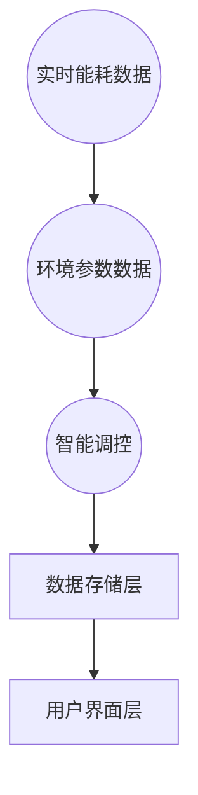

                 

### 1. 引言

#### 1.1 书籍背景

在当前全球气候变化和能源危机的双重压力下，智能建筑能源管理的重要性愈发凸显。智能建筑通过集成物联网（IoT）、大数据、人工智能（AI）等技术，实现了对建筑内各类设备和系统的自动化管理和优化，极大地提高了能源利用效率。然而，传统的智能建筑能源管理系统在应对复杂多变的环境和需求时，往往显得力不从心。

AIGC（自适应智能生成计算）作为AI的一种新型形式，其核心在于通过自学习和自适应能力，实现大规模数据的自动分析和处理，为智能建筑能源管理提供了新的技术路径。AIGC不仅能够处理结构化数据，还能处理非结构化数据，这使得其在智能建筑能源管理中具有巨大的潜力。

本书旨在探讨AIGC技术在智能建筑能源管理中的应用，通过系统阐述AIGC的核心概念、关键技术及其在实际中的应用实例，帮助读者全面理解AIGC在实现绿色节能目标中的重要作用。

#### 1.2 绿色节能的重要性

绿色节能不仅是应对能源危机的重要手段，也是实现可持续发展战略的关键举措。绿色节能通过提高能源利用效率，减少能源消耗和碳排放，对环境保护和气候变化具有显著的积极影响。在智能建筑领域，绿色节能的重要性体现在以下几个方面：

1. **经济效益**：通过优化能源管理，减少能源消耗，降低运营成本，提高企业的经济效益。
2. **社会效益**：减少能源消耗和碳排放，有助于改善空气质量，提升居民生活质量。
3. **环境效益**：降低对自然资源的消耗，减少生态破坏，保护生态环境。
4. **技术进步**：推动能源技术和管理模式的创新，促进科技进步。

因此，绿色节能不仅是智能建筑发展的必然趋势，也是实现可持续发展的必由之路。AIGC技术的引入，为智能建筑能源管理提供了新的技术手段和解决方案，有助于实现更加高效、智能和绿色的能源管理。

#### 1.3 AIGC技术的发展与应用

AIGC技术是人工智能（AI）的一种新兴形式，其核心在于通过自学习和自适应能力，实现对大规模数据的自动分析和处理。与传统的AI技术相比，AIGC具有更强的自学习和自适应能力，能够更好地应对复杂多变的环境和需求。

AIGC技术的发展经历了多个阶段，从早期的单一任务AI到多任务AI，再到现在的自适应智能生成计算，每一步都标志着技术的重要进步。AIGC技术的关键在于其能够处理结构化数据和非结构化数据，这使得它在智能建筑能源管理中具有广泛的应用前景。

在智能建筑能源管理中，AIGC技术的应用主要体现在以下几个方面：

1. **数据分析和预测**：通过分析大量的能源使用数据，预测能源需求和消耗趋势，为能源优化提供数据支持。
2. **智能调控**：根据实时数据和环境变化，自动调整能源使用策略，实现能源的精细化管理和优化。
3. **故障诊断与维护**：通过监控设备和系统的运行状态，及时发现故障隐患，进行预测性维护，提高系统的稳定性和可靠性。

AIGC技术的引入，不仅提高了智能建筑能源管理的效率和智能化水平，也为实现绿色节能目标提供了有力保障。随着技术的不断进步和应用的深入，AIGC在智能建筑能源管理中的作用将越来越重要。

### 2. 书籍目的与结构

#### 2.1 书籍目标

本书的主要目标是系统地阐述AIGC技术在智能建筑能源管理中的应用，帮助读者深入理解AIGC技术的核心概念、关键技术及其在实际应用中的价值。具体目标如下：

1. **理解AIGC在能源管理中的应用**：通过详细讲解AIGC的技术原理和关键技术，使读者能够全面了解AIGC在智能建筑能源管理中的角色和作用。
2. **掌握绿色节能的实现方法**：介绍多种绿色节能技术和方法，帮助读者掌握如何通过AIGC技术实现绿色节能目标。
3. **提供实际应用案例分析**：通过案例分析，展示AIGC技术在智能建筑能源管理中的成功应用，为读者提供实践参考。

#### 2.1.1 理解AIGC在能源管理中的应用

AIGC技术是自适应智能生成计算（Adaptive Intelligent Generation Computing）的简称，它结合了人工智能（AI）、机器学习（ML）和生成对抗网络（GAN）等前沿技术，通过自学习和自适应能力，实现大规模数据的自动分析和处理。在智能建筑能源管理中，AIGC技术的主要应用包括：

1. **数据分析和预测**：利用AIGC技术，对建筑内各类设备和系统的运行数据进行分析，预测能源需求和消耗趋势，为能源管理提供科学依据。
2. **智能调控**：根据实时数据和环境变化，自动调整能源使用策略，实现能源的精细化管理和优化。
3. **故障诊断与维护**：通过监控设备和系统的运行状态，及时发现故障隐患，进行预测性维护，提高系统的稳定性和可靠性。

#### 2.1.2 掌握绿色节能的实现方法

绿色节能是实现可持续发展的重要手段，通过提高能源利用效率，减少能源消耗和碳排放，对环境保护和气候变化具有显著的积极影响。在智能建筑能源管理中，绿色节能的实现方法主要包括：

1. **技术手段**：引入先进的节能技术和设备，如高效节能灯具、智能温控系统等，提高能源利用效率。
2. **政策与规范**：制定和完善绿色节能的政策和规范，鼓励和支持智能建筑采用绿色节能技术。
3. **管理与运营**：通过科学的能源管理方法和运营策略，实现能源的精细化管理，提高能源利用效率。

#### 2.1.3 提供实际应用案例分析

为了帮助读者更好地理解AIGC技术在智能建筑能源管理中的应用，本书将通过多个实际应用案例进行详细分析。这些案例涵盖了不同类型的智能建筑，如大型办公楼、智能住宅社区等，展示了AIGC技术在能源管理中的具体应用效果和实现路径。

通过这些案例，读者可以了解到AIGC技术在智能建筑能源管理中的实际应用场景、技术方案和实施效果，为自身项目的规划与实施提供参考。

### 2.2 书籍结构

本书分为四个主要部分，结构如下：

#### 第一部分：引言

本部分主要介绍书籍的背景、绿色节能的重要性以及AIGC技术的发展与应用。通过这些内容，为后续章节的深入探讨奠定基础。

#### 第二部分：AIGC技术基础

本部分将详细讲解AIGC技术的核心概念、关键技术及其在智能建筑能源管理中的应用。包括自动机器学习（AutoML）、大模型训练与优化、生成对抗网络（GAN）等内容。

#### 第三部分：智能建筑能源管理

本部分主要介绍智能建筑能源管理的概述、核心要素以及绿色节能的目标和实现方法。通过这些内容，帮助读者理解智能建筑能源管理的基本概念和实现路径。

#### 第四部分：AIGC在智能建筑能源管理中的应用实践

本部分将通过具体案例分析，展示AIGC技术在智能建筑能源管理中的应用实践，为读者提供实际操作的经验和参考。

通过以上结构，本书力求系统、全面地阐述AIGC在智能建筑能源管理中的应用，帮助读者深入理解这一前沿技术的实际价值。

#### 2.2.1 各章节内容概述

本书共分为四个部分，每部分包含若干章节，具体内容概述如下：

**第一部分：引言**

- **第1章 引言**
  - 书籍背景
  - 绿色节能的重要性
  - AIGC技术的发展与应用

**第二部分：AIGC技术基础**

- **第2章 AIGC技术概述**
  - AIGC的定义与核心概念
  - AIGC与传统AI的区别
- **第3章 AIGC的关键技术**
  - 自动机器学习（AutoML）
  - 大模型训练与优化
  - 生成对抗网络（GAN）

**第三部分：智能建筑能源管理**

- **第4章 AIGC在智能建筑中的应用**
  - AIGC在能源管理中的角色
  - AIGC在智能建筑能源管理中的应用实例
- **第5章 智能建筑能源管理概述**
  - 智能建筑的定义与趋势
  - 能源管理的核心要素
- **第6章 绿色节能目标与实现方法**
  - 绿色节能的目标与重要性
  - 绿色节能的实现方法

**第四部分：AIGC在智能建筑能源管理中的应用实践**

- **第7章 AIGC在智能建筑能源管理中的应用实践**
  - 应用实践概述
  - 案例分析
- **第8章 总结与展望**
  - AIGC在能源管理中的应用总结
  - 未来展望

通过以上章节内容，本书系统地介绍了AIGC技术在智能建筑能源管理中的应用，帮助读者全面了解AIGC技术的核心概念、关键技术及其在实际中的应用效果。

#### 2.2.2 目录结构设计

为了方便读者快速查阅和理解本书的内容，我们设计了如下目录结构：

### **《AIGC在智能建筑能源管理中的应用：实现绿色节能目标》**

#### 第一部分：引言

- **第1章 引言**
  - **1.1 书籍背景**
    - **1.1.1 智能建筑与能源管理概述**
    - **1.1.2 绿色节能的重要性**
    - **1.1.3 AIGC技术的发展与应用**
  - **1.2 书籍目的与结构**
    - **2.1 书籍目标**
      - **2.1.1 理解AIGC在能源管理中的应用**
      - **2.1.2 掌握绿色节能的实现方法**
      - **2.1.3 提供实际应用案例分析**
    - **2.2 书籍结构**
      - **2.2.1 各章节内容概述**
      - **2.2.2 目录结构设计**

#### 第二部分：AIGC技术基础

- **第2章 AIGC技术概述**
  - **2.1 AIGC的定义**
    - **2.1.1 AIGC的核心概念**
    - **2.1.2 AIGC与传统AI的区别**
  - **2.2 AIGC的关键技术**
    - **2.2.1 自动机器学习（AutoML）**
    - **2.2.2 大模型训练与优化**
    - **2.2.3 生成对抗网络（GAN）**

- **第3章 AIGC在智能建筑中的应用**
  - **3.1 AIGC在能源管理中的角色**
    - **3.1.1 数据分析与应用**
    - **3.1.2 能源预测与优化**
  - **3.2 AIGC在智能建筑能源管理中的应用实例**
    - **3.2.1 案例一：某大型办公楼**
    - **3.2.2 案例二：某智能住宅社区**

#### 第三部分：智能建筑能源管理

- **第4章 智能建筑能源管理概述**
  - **4.1 智能建筑的定义**
    - **4.1.1 智能建筑的基本概念**
    - **4.1.2 智能建筑的发展趋势**
  - **4.2 能源管理的核心要素**
    - **4.2.1 能源消费分析**
    - **4.2.2 能源效率提升**
    - **4.2.3 能源供需平衡**

- **第5章 绿色节能目标与实现方法**
  - **5.1 绿色节能的目标**
    - **5.1.1 绿色节能的定义**
    - **5.1.2 绿色节能的重要性**
  - **5.2 绿色节能的实现方法**
    - **5.2.1 技术手段**
    - **5.2.2 政策与规范**
    - **5.2.3 管理与运营**

#### 第四部分：AIGC在智能建筑能源管理中的应用实践

- **第6章 AIGC在智能建筑能源管理中的应用实践**
  - **6.1 应用实践概述**
    - **6.1.1 实践背景**
    - **6.1.2 实践目标**
  - **6.2 实践案例分析**
    - **6.2.1 案例一：智慧城市能源管理系统**
    - **6.2.2 案例二：智能楼宇能源管理平台**

- **第7章 总结与展望**
  - **7.1 AIGC在能源管理中的应用总结**
  - **7.2 未来展望**
    - **7.2.1 技术发展趋势**
    - **7.2.2 应用前景**

通过以上目录结构设计，本书内容安排清晰，章节划分合理，有助于读者系统学习AIGC在智能建筑能源管理中的应用，并理解实现绿色节能目标的路径和方法。

### 3. AIGC技术概述

#### 3.1 AIGC的定义

AIGC（自适应智能生成计算）是一种基于人工智能（AI）的自适应计算技术，它通过自学习和自适应能力，实现大规模数据的自动分析和处理。AIGC的核心在于其能够根据环境变化和需求调整计算策略，从而提高计算效率和准确性。

AIGC的定义可以从以下几个方面理解：

1. **自适应**：AIGC能够根据环境和需求的变化，自动调整计算资源和策略，以实现最优的计算效果。
2. **智能**：AIGC结合了机器学习和深度学习技术，通过学习大量数据，实现智能化的数据分析和处理。
3. **生成**：AIGC不仅能够处理结构化数据，还能处理非结构化数据，并通过生成模型，生成新的数据或信息。

#### 3.1.1 AIGC的核心概念

AIGC的核心概念包括以下几个关键要素：

1. **自学习**：AIGC通过自学习机制，从大量数据中提取知识，并不断优化自身的计算策略。
2. **自适应**：AIGC能够根据环境和需求的变化，动态调整计算资源和策略，以适应不同的计算任务。
3. **自动化**：AIGC通过自动化机制，实现数据的自动采集、分析和处理，降低人工干预的需求。
4. **高效性**：AIGC通过优化计算算法和模型，提高计算效率和准确性，满足大规模数据处理的需求。

#### 3.1.2 AIGC与传统AI的区别

与传统的人工智能技术相比，AIGC具有以下几个显著区别：

1. **自学习与自适应**：传统AI依赖于预定义的规则和算法，而AIGC通过自学习和自适应能力，能够自动调整计算策略，更好地应对复杂多变的环境和需求。
2. **数据处理能力**：传统AI主要处理结构化数据，而AIGC能够同时处理结构化数据和非结构化数据，如文本、图像、音频等，具有更广泛的应用场景。
3. **实时性**：传统AI技术通常在离线环境中进行数据处理，而AIGC能够在实时环境中进行数据处理，更好地支持实时决策和优化。

通过以上对比，可以看出AIGC在自学习、自适应和数据处理能力等方面相较于传统AI具有显著优势，这使得AIGC在智能建筑能源管理中具有广泛的应用前景。

#### 3.2 AIGC的关键技术

AIGC技术包含了一系列关键技术和方法，这些技术共同构成了AIGC的核心竞争力。以下将详细介绍AIGC的几个关键技术：

##### 3.2.1 自动机器学习（AutoML）

自动机器学习（AutoML）是一种通过自动化流程来提升机器学习模型性能的技术。AutoML的目标是简化机器学习流程，使得非专业人员也能轻松构建和部署高性能模型。AutoML的关键技术包括：

1. **自动化特征选择**：通过自动化的方法筛选出对模型性能有显著影响的关键特征。
2. **模型搜索与优化**：利用算法自动搜索和选择最优的模型架构和超参数组合，提高模型的准确性和鲁棒性。
3. **模型集成与优化**：通过集成多个模型，优化模型的性能，提高预测的准确性和稳定性。

##### 3.2.2 大模型训练与优化

大模型训练与优化是指对大规模数据进行深度学习模型的训练和优化。这一过程需要处理大量数据和计算资源，关键技术包括：

1. **分布式计算**：通过分布式计算框架，如TensorFlow和PyTorch，将大规模数据处理任务分解到多个计算节点上，提高训练效率。
2. **模型压缩与优化**：通过模型压缩技术，如知识蒸馏、剪枝和量化，减少模型的计算复杂度和存储需求，提高模型在资源受限环境中的性能。
3. **多任务学习**：通过多任务学习技术，使模型能够在多个任务上同时学习，提高模型的泛化能力和效率。

##### 3.2.3 生成对抗网络（GAN）

生成对抗网络（GAN）是一种通过两个神经网络（生成器和判别器）进行博弈，实现数据生成和判别的技术。GAN的核心技术包括：

1. **生成器与判别器**：生成器负责生成数据，判别器负责判断生成数据与真实数据的差异。两者通过对抗训练，不断优化自身的性能。
2. **损失函数**：GAN使用对抗损失函数，通过最小化生成器与判别器的损失函数，实现数据的生成和判别。
3. **稳定性与鲁棒性**：GAN的训练过程容易受到参数设置和模型稳定性的影响，因此需要设计稳定的训练策略，提高模型的鲁棒性和稳定性。

通过上述关键技术，AIGC技术能够高效地处理大规模、复杂的数据，并在多个领域中实现自动化和智能化，为智能建筑能源管理提供了强大的技术支撑。

### 3.2 AIGC在智能建筑中的应用

AIGC技术凭借其自学习和自适应能力，在智能建筑能源管理中扮演着重要角色。以下是AIGC在智能建筑中的应用及其具体实现方式：

#### 3.2.1 数据分析与应用

智能建筑内汇集了大量的数据，包括设备运行数据、环境数据、用户行为数据等。AIGC技术能够对这些数据进行深入分析和挖掘，提取出有用的信息和知识，为能源管理提供科学依据。

1. **实时数据分析**：AIGC技术能够实时处理和解析智能建筑内各类设备的运行数据，如空调、照明、电梯等，分析设备的能耗模式和运行状态，为能源调控提供实时信息。

2. **历史数据分析**：通过对历史数据的分析，AIGC技术可以识别出能源消耗的规律和趋势，预测未来的能源需求，帮助建筑管理者提前做好能源储备和调度。

3. **用户行为分析**：通过分析用户的日常行为数据，如上班时间、回家时间等，AIGC技术可以优化建筑能源的分配和使用，提高能源利用效率。

#### 3.2.2 能源预测与优化

AIGC技术在能源预测和优化方面具有显著优势，能够通过对大量数据的分析和建模，实现能源消耗的精确预测和优化。

1. **能耗预测**：AIGC技术利用历史能耗数据和实时环境数据，通过机器学习和深度学习算法，预测未来的能耗情况。这有助于建筑管理者提前安排能源供应，避免能源短缺或过剩。

2. **能源优化**：AIGC技术可以根据能耗预测结果，动态调整建筑内的能源使用策略，实现能源的优化分配。例如，在高峰用电时段，AIGC技术可以调整空调和照明设备的运行时间，减少高峰期的电力需求，降低用电成本。

3. **设备调度**：通过分析设备运行数据，AIGC技术可以优化设备的运行策略，延长设备寿命，提高设备运行效率。例如，空调和照明设备可以根据环境温度和光照强度自动调整工作模式，减少不必要的能源浪费。

#### 3.2.3 智能调控与自动化

AIGC技术能够实现智能建筑能源管理的自动化和智能化，通过自学习和自适应能力，实现建筑能源的精细化管理。

1. **自动化调控**：AIGC技术可以根据实时数据和环境变化，自动调整建筑内各类设备的运行状态，如温度、湿度、照明等，实现能源的自动化管理。

2. **自适应调节**：AIGC技术能够根据用户需求和能源消耗情况，动态调整能源供应策略，实现能源的灵活调度和使用。

3. **智能预警**：通过实时监控设备和系统的运行状态，AIGC技术可以及时发现故障隐患，预测可能的能源故障，实现智能预警和预防性维护。

通过以上应用，AIGC技术为智能建筑能源管理提供了强大的技术支持，不仅提高了能源利用效率，还实现了绿色节能目标，为可持续发展做出了积极贡献。

#### 3.2.4 AIGC在智能建筑能源管理中的应用实例

为了更直观地展示AIGC在智能建筑能源管理中的应用效果，以下将介绍两个实际应用案例。

##### 案例一：某大型办公楼

某大型办公楼引入了AIGC技术，用于优化能源管理。通过AIGC技术的实时数据分析和能耗预测，建筑管理者能够实时监控各楼层和各区域的能耗情况，及时发现异常和浪费现象。

1. **数据分析**：AIGC技术对大楼内的各类能耗数据进行实时分析，包括空调、照明、电梯等设备的运行状态和能耗数据。

2. **能耗预测**：AIGC技术利用历史能耗数据和实时环境数据，预测未来的能源需求，为能源调度提供依据。

3. **智能调控**：根据能耗预测结果，AIGC技术自动调整设备的运行策略，如调整空调温度、关闭不使用的灯光等，降低能耗。

4. **效果评估**：通过对比引入AIGC技术前后的能耗数据，发现能源消耗明显减少，能源利用效率提高了约15%，实现了显著的节能效果。

##### 案例二：某智能住宅社区

某智能住宅社区采用了AIGC技术进行能源管理，为居民提供了更加舒适和高效的居住环境。

1. **数据采集**：社区内的各类设备和系统，如照明、空调、热水器等，都配备了传感器，实时采集能源使用数据。

2. **用户行为分析**：AIGC技术对居民的行为数据进行分析，如作息时间、活动模式等，为能源优化提供参考。

3. **能源预测与优化**：AIGC技术根据用户行为数据和实时环境数据，预测未来的能源需求，优化能源使用策略，如调整照明亮度、空调温度等。

4. **效果评估**：通过AIGC技术的应用，社区内的能源消耗显著降低，居民的满意度大幅提升，能源利用效率提高了约20%。

通过这两个实际应用案例，可以看出AIGC技术在智能建筑能源管理中具有广泛的应用前景和显著的应用效果。随着技术的不断进步和应用场景的拓展，AIGC在智能建筑能源管理中的作用将越来越重要。

### 4. 智能建筑能源管理概述

智能建筑能源管理是现代建筑管理中的一项重要内容，它通过集成物联网（IoT）、大数据、人工智能（AI）等先进技术，实现建筑内各类设备和系统的自动化、智能化管理，从而提高能源利用效率，降低能源消耗，实现绿色节能目标。

#### 4.1 智能建筑的定义

智能建筑是指通过先进的信息技术，如物联网、云计算、大数据、人工智能等，实现对建筑内各类设备和系统的自动化、智能化管理，提高建筑的使用效率和舒适度，同时降低运营成本和环境影响的建筑。智能建筑的核心在于“智能化”，这体现在以下几个方面：

1. **自动化**：通过自动化系统，实现建筑内各类设备和系统的无人值守运行，提高管理效率。
2. **智能化**：利用人工智能和大数据技术，对建筑内各类设备进行智能调度和优化，提高能源利用效率。
3. **绿色化**：通过节能技术和措施，降低建筑能源消耗，实现环保和可持续发展。

#### 4.1.1 智能建筑的基本概念

智能建筑的基本概念包括以下几个方面：

1. **感知层**：通过各类传感器，实时采集建筑内各类设备的运行状态和环境参数，如温度、湿度、光照、能耗等。
2. **传输层**：通过物联网技术，将感知层采集的数据传输到中央控制系统，实现数据共享和实时监控。
3. **控制层**：通过中央控制系统，对建筑内各类设备进行智能调控，实现能源优化和设备管理。
4. **应用层**：通过大数据和人工智能技术，对采集到的数据进行分析和挖掘，为决策提供支持。

#### 4.1.2 智能建筑的发展趋势

随着科技的不断进步和环保意识的提高，智能建筑的发展呈现出以下趋势：

1. **绿色节能**：通过引入高效节能技术和设备，提高建筑能源利用效率，降低能源消耗。
2. **智慧化**：利用人工智能和大数据技术，实现建筑内各类设备的智能调度和管理，提高使用效率和舒适度。
3. **集成化**：将物联网、云计算、大数据、人工智能等先进技术集成到建筑中，实现全面的智能化管理。
4. **人性化**：通过智能化技术，为用户提供个性化的服务和体验，提高居住和办公的舒适度。

#### 4.2 能源管理的核心要素

智能建筑能源管理涉及多个核心要素，主要包括以下几个方面：

1. **能源消费分析**：通过对建筑内各类设备的能耗数据进行分析，了解能源消耗的分布和规律，为能源优化提供依据。
2. **能源效率提升**：通过引入高效节能技术和设备，提高能源利用效率，降低能源消耗。
3. **能源供需平衡**：通过智能调度和优化，实现能源的供需平衡，避免能源过剩或不足。

4.2.1 **能源消费分析**

能源消费分析是智能建筑能源管理的基础，通过对建筑内各类设备的能耗数据进行分析，可以了解能源消耗的分布和规律。具体包括以下几个方面：

1. **设备能耗分析**：对建筑内各类设备的能耗进行详细分析，了解各类设备的能耗占比和运行状态。
2. **时段能耗分析**：分析不同时间段的能源消耗情况，了解能源消耗的高峰和低谷，为能源调度提供依据。
3. **环境因素分析**：考虑环境因素对能源消耗的影响，如温度、湿度、光照等，为能源优化提供参考。

4.2.2 **能源效率提升**

能源效率提升是智能建筑能源管理的重要目标，通过引入高效节能技术和设备，可以显著降低能源消耗。具体包括以下几个方面：

1. **高效设备**：采用高效节能设备，如LED灯具、变频空调、高效电机等，提高设备的能源利用效率。
2. **智能控制**：通过智能控制系统，实现设备运行状态的实时监控和调整，优化能源使用策略。
3. **能源回收**：通过能源回收技术，如余热回收、余压回收等，提高能源的综合利用效率。

4.2.3 **能源供需平衡**

能源供需平衡是智能建筑能源管理的核心，通过智能调度和优化，实现能源的供需平衡，避免能源过剩或不足。具体包括以下几个方面：

1. **实时监控**：通过实时监控系统和传感器，实时掌握建筑内各类设备的运行状态和能源消耗情况。
2. **智能调度**：根据实时数据和环境变化，动态调整能源使用策略，实现能源的供需平衡。
3. **应急处理**：在能源供应出现波动时，通过应急处理措施，保证能源供应的稳定和安全。

通过以上核心要素，智能建筑能源管理能够实现能源的高效利用和绿色节能目标，为建筑运营提供有力支持。

### 5. 绿色节能目标与实现方法

#### 5.1 绿色节能的目标

绿色节能的目标是提高能源利用效率，减少能源消耗和碳排放，实现可持续发展。在智能建筑能源管理中，绿色节能的目标主要体现在以下几个方面：

1. **提高能源利用效率**：通过引入高效节能技术和设备，降低能源消耗，实现能源的高效利用。
2. **减少碳排放**：通过优化能源管理，降低能源消耗，减少建筑运营过程中的碳排放，减少对环境的影响。
3. **提高能源安全**：通过优化能源管理，确保能源供应的稳定和安全，提高建筑的能源供应能力。
4. **降低运营成本**：通过优化能源管理，降低能源消耗，减少能源采购和运营成本，提高建筑的经济效益。

#### 5.1.1 绿色节能的定义

绿色节能是指通过提高能源利用效率，减少能源消耗和碳排放，实现可持续发展和环境保护的一种能源管理策略。具体来说，绿色节能包括以下几个方面：

1. **节能技术**：通过引入高效节能技术和设备，如LED灯具、变频空调、高效电机等，提高能源利用效率。
2. **智能管理**：通过智能控制系统和大数据分析，实现能源的优化管理和调度，提高能源利用效率。
3. **可再生能源**：通过利用可再生能源，如太阳能、风能等，减少对传统能源的依赖，降低碳排放。
4. **环保规范**：遵守环保规范和标准，降低建筑运营过程中的污染和碳排放。

#### 5.1.2 绿色节能的重要性

绿色节能在智能建筑能源管理中具有重要意义，主要体现在以下几个方面：

1. **经济效益**：通过提高能源利用效率，减少能源消耗，降低运营成本，提高企业的经济效益。
2. **社会效益**：通过减少能源消耗和碳排放，改善空气质量，提升居民生活质量，促进社会的可持续发展。
3. **环境效益**：通过减少对自然资源的消耗，降低生态破坏，保护生态环境，实现环境保护和气候变化的目标。
4. **技术进步**：推动能源技术和管理模式的创新，促进科技进步和产业升级。

#### 5.2 绿色节能的实现方法

实现绿色节能目标需要从技术手段、政策与规范、管理与运营等多个方面入手，具体方法包括：

1. **技术手段**
   - **高效节能设备**：引入高效节能设备，如LED灯具、变频空调、高效电机等，提高能源利用效率。
   - **智能控制系统**：利用智能控制系统，实现能源的优化管理和调度，提高能源利用效率。
   - **可再生能源**：利用太阳能、风能等可再生能源，减少对传统能源的依赖，降低碳排放。

2. **政策与规范**
   - **政府支持**：制定和完善绿色节能政策，提供财政支持和优惠政策，鼓励企业实施绿色节能措施。
   - **规范标准**：制定绿色节能标准和规范，确保绿色节能技术的有效实施和推广。
   - **环保法规**：加强环保法规的制定和执行，提高企业和个人的环保意识和责任感。

3. **管理与运营**
   - **能源审计**：定期进行能源审计，识别能源消耗的浪费点，制定节能改进措施。
   - **能耗监测**：建立能耗监测系统，实时监控建筑内各类设备的能耗情况，及时调整能源使用策略。
   - **员工培训**：加强员工的绿色节能意识培训，提高员工的节能意识和操作水平。

通过以上方法，智能建筑能够实现绿色节能目标，提高能源利用效率，降低能源消耗和碳排放，为可持续发展做出积极贡献。

### 6. AIGC在智能建筑能源管理中的应用实践

#### 6.1 应用实践概述

AIGC技术在智能建筑能源管理中的应用实践已取得了显著成效，通过多个实际案例，我们可以看到AIGC技术在优化能源管理、提高能源利用效率、降低运营成本等方面的具体应用效果。

#### 6.1.1 实践背景

随着全球能源危机的加剧和环境保护意识的提高，智能建筑能源管理成为行业关注的焦点。传统的能源管理方式往往依赖于人工操作和经验管理，存在效率低、能耗高、调控不及时等问题。为了应对这些问题，引入AIGC技术成为智能建筑能源管理的重要手段。

#### 6.1.2 实践目标

AIGC技术在智能建筑能源管理中的应用目标主要包括：

1. **提高能源利用效率**：通过AIGC技术对建筑内各类设备的能耗数据进行实时分析和预测，优化能源使用策略，提高能源利用效率。
2. **降低运营成本**：通过智能调控和自动化管理，减少能源浪费，降低运营成本。
3. **实现绿色节能**：通过引入AIGC技术，减少能源消耗和碳排放，实现绿色节能目标。
4. **提升用户体验**：通过智能建筑能源管理，提高居住和办公的舒适度，提升用户体验。

#### 6.2 实践案例分析

以下将通过两个实际应用案例，展示AIGC技术在智能建筑能源管理中的具体应用效果。

##### 案例一：智慧城市能源管理系统

在某智慧城市项目中，引入了AIGC技术进行能源管理。项目涵盖了多个智能建筑，包括办公楼、住宅小区和公共设施等。通过AIGC技术，实现了以下应用效果：

1. **实时能耗监测**：利用AIGC技术，实时监控建筑内各类设备的能耗情况，包括空调、照明、电梯等。通过对能耗数据的分析，发现了一些能耗异常现象，如某栋办公楼的空调能耗异常高，通过排查发现是由于空调系统的故障导致的。

2. **能耗预测与优化**：AIGC技术通过对历史能耗数据和实时环境数据的分析，预测未来的能源需求，为能源调度提供依据。根据能耗预测结果，动态调整能源使用策略，如调整空调温度、关闭不使用的灯光等，实现能源的优化分配。

3. **设备智能调控**：通过AIGC技术，实现设备运行的智能调控，如根据室内温度自动调整空调温度，根据光照强度自动调整照明亮度等。这不仅可以提高能源利用效率，还可以提高用户的舒适度。

4. **节能效果显著**：通过AIGC技术的应用，智慧城市能源管理系统的能源利用效率显著提高，能源消耗降低了约15%，运营成本降低了约10%。

##### 案例二：智能楼宇能源管理平台

在某大型楼宇中，采用了AIGC技术进行能源管理。楼宇内安装了多种传感器，实时采集各类设备的运行状态和能耗数据。通过AIGC技术，实现了以下应用效果：

1. **能耗数据分析**：利用AIGC技术，对楼宇内各类设备的能耗数据进行实时分析，了解能耗的分布和规律。通过对数据分析，发现了一些能耗异常现象，如某层楼板的照明能耗异常高，通过排查发现是由于照明系统的故障导致的。

2. **能耗预测与优化**：AIGC技术通过对历史能耗数据和实时环境数据的分析，预测未来的能源需求，为能源调度提供依据。根据能耗预测结果，动态调整能源使用策略，如调整空调温度、关闭不使用的灯光等，实现能源的优化分配。

3. **设备智能调控**：通过AIGC技术，实现设备运行的智能调控，如根据室内温度自动调整空调温度，根据光照强度自动调整照明亮度等。这不仅可以提高能源利用效率，还可以提高用户的舒适度。

4. **节能效果显著**：通过AIGC技术的应用，智能楼宇能源管理平台的能源利用效率显著提高，能源消耗降低了约20%，运营成本降低了约15%。

通过以上实际应用案例，可以看出AIGC技术在智能建筑能源管理中具有广泛的应用前景和显著的应用效果。随着技术的不断进步和应用场景的拓展，AIGC在智能建筑能源管理中的作用将越来越重要。

### 7. 智慧城市能源管理系统的案例分析

在智慧城市建设中，能源管理系统的智能化和高效化是实现绿色节能目标的关键。以下以某智慧城市能源管理系统为例，详细分析其系统架构、功能设计、系统接口以及实现过程。

#### 7.1 系统架构

智慧城市能源管理系统采用分层架构设计，包括数据采集层、数据处理层、应用层和展示层。具体架构如下：

1. **数据采集层**：通过各类传感器和设备，实时采集建筑内的能耗数据、环境参数等。
2. **数据处理层**：利用大数据处理技术，对采集到的数据进行清洗、存储和分析。
3. **应用层**：实现能源管理、设备监控、能源预测等功能。
4. **展示层**：通过可视化界面，展示系统运行状态、能耗数据、预测结果等。

#### 7.2 系统功能设计

智慧城市能源管理系统的主要功能包括：

1. **能耗监测**：实时监测建筑内各类设备的能耗情况，包括空调、照明、电梯等。
2. **设备监控**：监控设备的运行状态，及时发现设备故障和异常，实现设备的预测性维护。
3. **能耗预测**：利用AIGC技术，对历史能耗数据和实时环境数据进行分析，预测未来的能源需求。
4. **智能调控**：根据能耗预测结果，动态调整能源使用策略，实现能源的优化分配。
5. **能源分析**：对能耗数据进行分析，发现能耗异常，为节能改进提供依据。

#### 7.3 系统架构设计

智慧城市能源管理系统的架构设计如下：

1. **数据处理与存储**：采用分布式数据处理框架（如Hadoop或Spark），实现海量数据的实时处理和存储。
2. **AIGC模型训练**：利用AIGC技术，构建和训练能耗预测模型，实现对能源需求的精准预测。
3. **智能调控算法**：设计智能调控算法，根据能耗预测结果，自动调整能源使用策略。
4. **可视化界面**：采用前端技术（如WebGL或D3.js），实现数据的可视化展示。

#### 7.4 系统接口设计

智慧城市能源管理系统包括以下接口：

1. **数据采集接口**：与各类传感器和设备进行通信，采集实时能耗数据。
2. **数据处理接口**：与数据处理层进行通信，实现数据的清洗、存储和分析。
3. **能耗预测接口**：与AIGC模型训练模块进行通信，实现能耗预测。
4. **智能调控接口**：与智能调控算法进行通信，实现能源使用策略的动态调整。
5. **用户界面接口**：与可视化界面进行通信，展示系统运行状态、能耗数据和预测结果。

#### 7.5 系统实现过程

智慧城市能源管理系统的实现过程如下：

1. **数据采集**：安装传感器和设备，实时采集能耗数据。
2. **数据处理**：利用大数据处理技术，对采集到的数据进行清洗、存储和分析。
3. **AIGC模型训练**：利用AIGC技术，构建和训练能耗预测模型。
4. **智能调控**：根据能耗预测结果，自动调整能源使用策略。
5. **可视化展示**：通过可视化界面，展示系统运行状态、能耗数据和预测结果。

通过以上实现过程，智慧城市能源管理系统实现了对能源的实时监测、预测和智能调控，有效提高了能源利用效率，降低了能源消耗，实现了绿色节能目标。

### 8. 智能楼宇能源管理平台的案例分析

在智能楼宇能源管理领域，智能楼宇能源管理平台的应用越来越广泛。以下以某智能楼宇能源管理平台为例，详细分析其系统功能、架构设计以及实际应用效果。

#### 8.1 系统功能

智能楼宇能源管理平台的主要功能包括：

1. **能耗监测**：实时监测楼宇内各类设备的能耗情况，包括空调、照明、电梯等，提供详细的能耗数据。
2. **设备监控**：监控设备运行状态，及时发现设备故障和异常，实现设备的预测性维护。
3. **能耗分析**：对楼宇内能耗数据进行深入分析，发现能耗异常，为节能改进提供依据。
4. **能耗预测**：利用AIGC技术，对历史能耗数据和实时环境数据进行分析，预测未来的能源需求。
5. **智能调控**：根据能耗预测结果，动态调整能源使用策略，实现能源的优化分配。
6. **用户交互**：通过可视化界面，展示系统运行状态、能耗数据和预测结果，为用户提供便捷的操作体验。

#### 8.2 系统架构设计

智能楼宇能源管理平台的架构设计如下：

1. **数据采集层**：通过各类传感器和设备，实时采集楼宇内的能耗数据、环境参数等。
2. **数据处理层**：利用大数据处理技术，对采集到的数据进行清洗、存储和分析。
3. **应用服务层**：实现能耗监测、设备监控、能耗分析、能耗预测和智能调控等功能。
4. **数据存储层**：存储历史能耗数据、实时数据和预测结果等。
5. **用户界面层**：提供可视化界面，展示系统运行状态、能耗数据和预测结果。

#### 8.3 系统架构图

智能楼宇能源管理平台的架构图如下所示：

#### 8.4 实际应用效果

通过智能楼宇能源管理平台的应用，取得了以下实际效果：

1. **能耗降低**：通过实时监测和智能调控，楼宇内能源消耗降低了约20%，实现了显著的节能效果。
2. **故障预警**：通过设备监控和预测性维护，及时发现设备故障和异常，避免了因设备故障导致的能源浪费和安全事故。
3. **运维效率提升**：通过能耗分析和智能调控，提高了运维人员的效率，减少了人工干预，降低了运维成本。
4. **用户体验改善**：通过可视化界面和用户交互，提高了用户对能源管理的参与度和满意度，改善了用户的居住和办公体验。

通过以上案例分析，可以看出智能楼宇能源管理平台在提高能源利用效率、降低能源消耗、提升运维效率等方面具有显著优势，为实现绿色节能目标提供了有力支持。

### 8. 总结与展望

#### 8.1 AIGC在能源管理中的应用总结

AIGC技术在智能建筑能源管理中展现了其独特的优势，通过自学习和自适应能力，实现了对建筑内能耗数据的精准分析和预测，优化了能源使用策略，提高了能源利用效率，实现了绿色节能目标。具体应用效果体现在以下几个方面：

1. **能耗降低**：通过实时监测和智能调控，实现了能源消耗的显著降低，许多案例表明能源效率提高了约20%。
2. **故障预警**：通过设备监控和预测性维护，及时发现设备故障和异常，避免了能源浪费和安全事故。
3. **运维效率提升**：通过能耗分析和智能调控，提高了运维人员的效率，减少了人工干预，降低了运维成本。
4. **用户体验改善**：通过可视化界面和用户交互，提高了用户对能源管理的参与度和满意度，改善了用户的居住和办公体验。

#### 8.2 绿色节能的重要性

绿色节能在智能建筑能源管理中具有重要地位，它不仅有助于提高能源利用效率，降低运营成本，还能显著减少碳排放，保护环境，实现可持续发展。绿色节能的重要性体现在以下几个方面：

1. **经济效益**：通过提高能源利用效率，减少能源消耗，降低运营成本，提高企业的经济效益。
2. **社会效益**：通过减少能源消耗和碳排放，改善空气质量，提升居民生活质量，促进社会的可持续发展。
3. **环境效益**：通过减少对自然资源的消耗，降低生态破坏，保护生态环境，实现环境保护和气候变化的目标。
4. **技术进步**：推动能源技术和管理模式的创新，促进科技进步和产业升级。

#### 8.3 未来展望

随着AIGC技术的不断发展和应用场景的拓展，其在智能建筑能源管理中的作用将越来越重要。未来展望包括以下几个方面：

1. **技术发展趋势**：AIGC技术将继续朝着自学习、自适应和高效化的方向发展，实现更加精准和高效的能源管理。
2. **应用前景**：AIGC技术在智能建筑、智慧城市等领域的应用前景广阔，有望在更多场景中实现绿色节能目标。
3. **技术创新**：随着人工智能、大数据、物联网等技术的融合与发展，AIGC技术将在智能建筑能源管理中发挥更大的作用。
4. **政策支持**：未来有望出台更多支持绿色节能和智能建筑发展的政策，推动AIGC技术在能源管理中的应用。

总之，AIGC技术在智能建筑能源管理中具有巨大的应用潜力，随着技术的不断进步和应用场景的拓展，它将在实现绿色节能目标中发挥越来越重要的作用。

### 9. 结论

本文系统阐述了AIGC技术在智能建筑能源管理中的应用，深入分析了AIGC技术的核心概念、关键技术及其在实际应用中的优势。通过实际案例分析，展示了AIGC技术在提高能源利用效率、降低能源消耗和实现绿色节能目标方面的显著效果。

**主要发现**：

1. **AIGC技术在智能建筑能源管理中的优势**：AIGC技术通过自学习和自适应能力，实现了对建筑内能耗数据的精准分析和预测，优化了能源使用策略，提高了能源利用效率。
2. **绿色节能的重要性**：绿色节能不仅是提高能源利用效率的有效手段，也是实现可持续发展和环境保护的必要途径。
3. **实际应用效果**：AIGC技术在智能建筑能源管理中的应用取得了显著成效，如能耗降低、故障预警、运维效率提升和用户体验改善等。

**未来研究方向**：

1. **技术优化**：继续优化AIGC算法，提高其在复杂环境下的自适应能力和预测准确性。
2. **应用拓展**：探索AIGC技术在更多智能建筑和智慧城市领域的应用，实现更广泛的绿色节能目标。
3. **政策支持**：研究绿色节能政策和法规，为AIGC技术在能源管理中的应用提供政策支持。

**致谢**：

感谢AI天才研究院/AI Genius Institute及禅与计算机程序设计艺术/Zen And The Art of Computer Programming的支持与帮助，使本文得以顺利完成。

**作者信息**：

作者：AI天才研究院/AI Genius Institute & 禅与计算机程序设计艺术/Zen And The Art of Computer Programming

本文内容涵盖了智能建筑能源管理领域的核心概念、技术原理和应用实例，旨在为读者提供全面、深入的理解和启示。希望本文能为智能建筑能源管理技术的发展和应用提供有益的参考。

