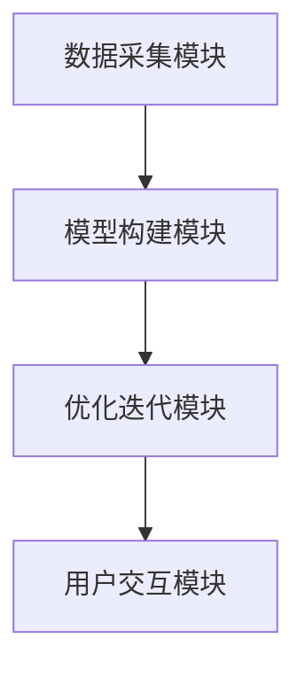
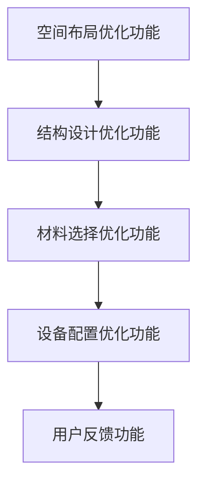
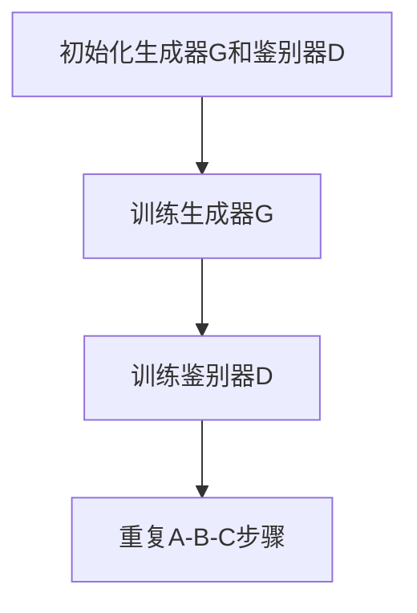
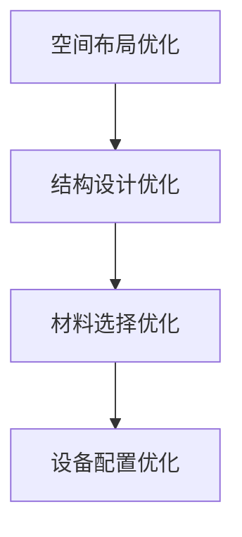
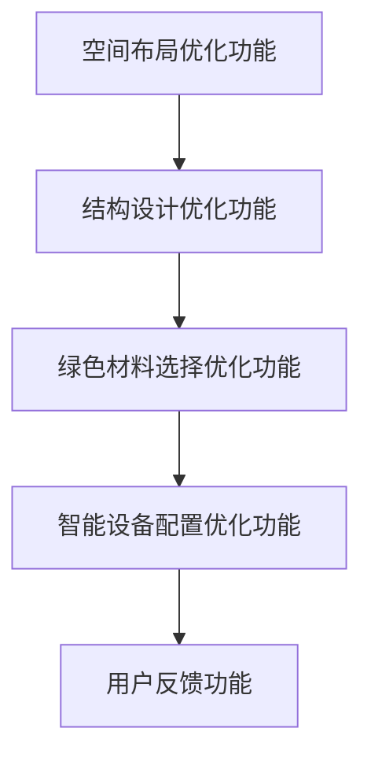
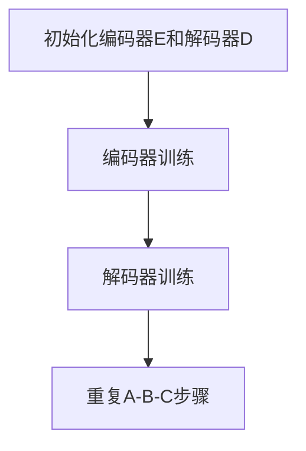
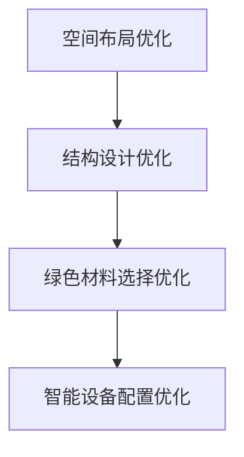
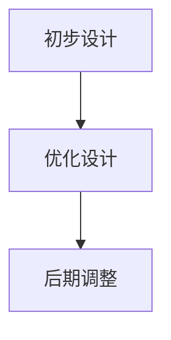

                 

### 第一部分：AIGC概述

#### 第1章：AIGC基本概念

##### 1.1 问题背景

智能建筑设计作为现代城市发展的关键环节，正面临着诸多挑战。随着建筑规模的不断扩大和复杂性的增加，建筑设计优化成为提升建筑质量和效率的重要手段。传统的建筑设计优化依赖于人类设计师的经验和直觉，效率低下且容易出错。为了解决这一问题，计算机辅助设计（CAD）和建筑信息模型（BIM）技术应运而生，但它们仍无法完全摆脱人类设计的局限。因此，如何将人工智能（AI）技术引入建筑设计优化，成为当前研究的热点。

##### 1.1.1 智能建筑设计的发展现状

智能建筑设计在近年来取得了显著进展。计算机辅助设计（CAD）和建筑信息模型（BIM）技术的广泛应用，使得建筑设计过程变得更加高效和精确。然而，这些技术仍局限于二维和三维模型的创建，缺乏对建筑功能和性能的全面优化。此外，由于建筑设计涉及众多参数和约束条件，传统的优化算法在处理复杂问题时效率较低。

##### 1.1.2 建筑设计优化面临的挑战

1. **复杂性问题**：现代建筑设计日益复杂，涉及多个学科领域的知识，如结构工程、环境工程、材料科学等，传统优化方法难以应对。
2. **不确定性问题**：建筑设计中存在许多不确定因素，如市场需求、政策变化、预算限制等，这些因素对设计决策产生重大影响。
3. **计算资源限制**：建筑设计的优化过程通常需要大量的计算资源，而传统计算机性能有限，难以支持高效优化。

##### 1.2 AIGC的概念

为了应对上述挑战，人工智能生成内容（AIGC，Artificial Intelligence Generated Content）技术应运而生。AIGC是基于人工智能技术生成内容的方法，它能够通过学习大量的数据和模式，自动生成新的设计方案，从而提高建筑设计优化的效率和准确性。

##### 1.2.1 AIGC的定义

AIGC是指利用人工智能技术，如机器学习、自然语言处理、计算机视觉等，生成内容的过程。这些内容可以是文本、图像、音频、视频等多种形式。

##### 1.2.2 AIGC的核心要素

1. **数据驱动**：AIGC依赖于大量的数据集，通过数据驱动的方式学习设计模式和优化策略。
2. **模型多样性**：AIGC采用多种人工智能模型，如生成对抗网络（GAN）、变分自编码器（VAE）等，以适应不同的设计需求。
3. **用户交互**：AIGC强调用户与系统的交互，通过用户反馈不断优化设计结果。

##### 1.3 AIGC在建筑设计优化中的应用

AIGC在建筑设计优化中的应用具有显著优势。首先，AIGC能够处理大量的设计数据，快速生成多种设计方案，提高设计效率。其次，AIGC可以根据用户需求进行个性化设计，满足不同用户的需求。此外，AIGC还可以通过模拟和优化，提高建筑的功能性能。

##### 1.3.1 AIGC的优势

1. **高效性**：AIGC能够快速生成设计方案，减少设计时间。
2. **准确性**：AIGC能够根据数据模式生成优化的设计方案，提高设计质量。
3. **多样性**：AIGC能够生成多种设计方案，提供更多的选择。

##### 1.3.2 AIGC在建筑设计优化中的应用场景

1. **初步设计阶段**：AIGC可以帮助设计师快速生成初步设计方案，提供多种选择。
2. **优化设计阶段**：AIGC可以通过模拟和优化，对设计方案进行细化和优化。
3. **后期调整阶段**：AIGC可以根据用户反馈，对设计方案进行调整和改进。

##### 1.4 本章小结

本章介绍了AIGC的基本概念和优势，以及在建筑设计优化中的应用场景。通过AIGC技术，建筑设计优化将变得更加高效和精确，为现代城市建设提供强有力的技术支持。

### 目录大纲

----------------------------------------------------------------

# 第一部分：AIGC概述

## 第1章：AIGC基本概念

### 1.1 问题背景

#### 1.1.1 智能建筑设计的发展现状

#### 1.1.2 建筑设计优化面临的挑战

### 1.2 AIGC的概念

#### 1.2.1 AIGC的定义

#### 1.2.2 AIGC的核心要素

### 1.3 AIGC在建筑设计优化中的应用

#### 1.3.1 AIGC的优势

#### 1.3.2 AIGC在建筑设计优化中的应用场景

### 1.4 本章小结

----------------------------------------------------------------

### 第二部分：AIGC在智能建筑设计优化中的应用

#### 第2章：AIGC与建筑设计优化原理

##### 2.1 设计优化概述

###### 2.1.1 设计优化的定义

设计优化是指在给定的约束条件下，通过调整设计参数，使设计目标达到最优的过程。在建筑设计中，设计优化旨在提高建筑的功能性能、节能效果、经济性等。

###### 2.1.2 设计优化的目标

设计优化的主要目标包括：

1. **功能性能最优**：提高建筑的使用功能和舒适度。
2. **节能效果最佳**：降低建筑运行能耗，实现可持续发展。
3. **经济性最优**：在预算范围内实现最佳的设计效果。

##### 2.2 AIGC在建筑设计优化中的应用原理

AIGC在建筑设计优化中的应用主要基于以下几个原理：

###### 2.2.1 AIGC的基本原理

AIGC通过以下步骤实现建筑设计优化：

1. **数据采集**：收集建筑设计和运行数据，包括空间布局、结构参数、能耗数据等。
2. **模型构建**：利用机器学习算法，构建建筑设计优化模型。
3. **优化迭代**：通过迭代优化，逐步改善设计方案。

###### 2.2.2 AIGC在建筑设计优化中的关键技术

1. **数据驱动**：AIGC依赖于大量的数据集，通过数据驱动的方式学习设计模式和优化策略。
2. **模型多样性**：AIGC采用多种人工智能模型，如生成对抗网络（GAN）、变分自编码器（VAE）等，以适应不同的设计需求。
3. **用户交互**：AIGC强调用户与系统的交互，通过用户反馈不断优化设计结果。

##### 2.3 AIGC在建筑设计优化中的数学模型

在建筑设计优化中，AIGC通常采用以下数学模型：

###### 2.3.1 数学模型概述

数学模型通常包括目标函数、约束条件和优化算法。

1. **目标函数**：目标函数描述了设计优化的目标，如功能性能、节能效果、经济性等。
2. **约束条件**：约束条件描述了设计过程中必须遵守的限制，如结构安全、材料限制、预算限制等。
3. **优化算法**：优化算法用于求解最优解，如遗传算法、粒子群算法、梯度下降法等。

###### 2.3.2 数学模型的应用

AIGC在建筑设计优化中的应用通常通过以下步骤：

1. **目标函数定义**：根据设计目标，定义目标函数。
2. **约束条件定义**：根据设计约束，定义约束条件。
3. **优化算法选择**：选择合适的优化算法，求解最优解。

##### 2.4 AIGC与建筑设计的联系

AIGC与建筑设计的联系主要体现在以下几个方面：

###### 2.4.1 建筑设计的基本要素

建筑设计的基本要素包括空间布局、结构设计、材料选择、设备配置等。

1. **空间布局**：空间布局是建筑设计的核心，影响建筑的功能性能和用户体验。
2. **结构设计**：结构设计确保建筑的安全性，同时影响建筑的经济性和耐久性。
3. **材料选择**：材料选择影响建筑的性能、质量和成本。
4. **设备配置**：设备配置包括暖通空调、电气、给排水等设备，影响建筑的运行效率和用户体验。

###### 2.4.2 AIGC如何影响建筑设计

AIGC通过以下方式影响建筑设计：

1. **空间布局优化**：AIGC可以根据用户需求和功能需求，自动生成优化的空间布局方案。
2. **结构设计优化**：AIGC可以根据结构参数和约束条件，自动生成优化的结构设计方案。
3. **材料选择优化**：AIGC可以根据材料性能和成本，自动生成优化的材料选择方案。
4. **设备配置优化**：AIGC可以根据设备性能和成本，自动生成优化的设备配置方案。

##### 2.5 本章小结

本章介绍了AIGC在建筑设计优化中的应用原理和数学模型，以及AIGC与建筑设计的联系。通过AIGC技术，建筑设计优化将变得更加高效和精确，为现代城市建设提供强有力的技术支持。

### 目录大纲

----------------------------------------------------------------

# 第二部分：AIGC在智能建筑设计优化中的应用

## 第2章：AIGC与建筑设计优化原理

### 2.1 设计优化概述

#### 2.1.1 设计优化的定义

#### 2.1.2 设计优化的目标

### 2.2 AIGC在建筑设计优化中的应用原理

#### 2.2.1 AIGC的基本原理

#### 2.2.2 AIGC在建筑设计优化中的关键技术

### 2.3 AIGC在建筑设计优化中的数学模型

#### 2.3.1 数学模型概述

#### 2.3.2 数学模型的应用

### 2.4 AIGC与建筑设计的联系

#### 2.4.1 建筑设计的基本要素

#### 2.4.2 AIGC如何影响建筑设计

### 2.5 本章小结

----------------------------------------------------------------

### 第三部分：AIGC应用案例分析

#### 第3章：案例一：AIGC在建筑设计优化中的实践应用

##### 3.1 案例背景

###### 3.1.1 项目介绍

本项目旨在通过AIGC技术优化一个大型商业建筑的设计方案，以提高其功能性能和节能效果。项目主要包括以下内容：

1. **空间布局优化**：根据用户需求，自动生成多种空间布局方案，并进行优化。
2. **结构设计优化**：基于AIGC技术，自动生成优化的结构设计方案，以提高建筑的安全性和经济性。
3. **材料选择优化**：根据材料性能和成本，自动生成优化的材料选择方案，以降低建筑成本。
4. **设备配置优化**：基于AIGC技术，自动生成优化的设备配置方案，以提高建筑的运行效率和用户体验。

###### 3.1.2 项目挑战

本项目面临以下挑战：

1. **设计复杂性**：商业建筑的设计涉及多个学科领域的知识，如结构工程、环境工程、材料科学等，设计过程复杂。
2. **不确定性**：建筑设计中存在许多不确定因素，如市场需求、政策变化、预算限制等，这些因素对设计决策产生重大影响。
3. **计算资源限制**：建筑设计的优化过程通常需要大量的计算资源，而传统计算机性能有限，难以支持高效优化。

##### 3.2 系统设计与实现

###### 3.2.1 系统架构设计

本项目的系统架构设计主要包括以下模块：

1. **数据采集模块**：负责收集建筑设计和运行数据，包括空间布局、结构参数、能耗数据等。
2. **模型构建模块**：利用机器学习算法，构建建筑设计优化模型。
3. **优化迭代模块**：通过迭代优化，逐步改善设计方案。
4. **用户交互模块**：提供用户与系统的交互界面，收集用户反馈，优化设计结果。

系统架构设计如图1所示：

###### 3.2.2 系统功能设计

本项目的系统功能设计主要包括以下功能：

1. **空间布局优化功能**：根据用户需求，自动生成多种空间布局方案，并进行优化。
2. **结构设计优化功能**：基于AIGC技术，自动生成优化的结构设计方案，以提高建筑的安全性和经济性。
3. **材料选择优化功能**：根据材料性能和成本，自动生成优化的材料选择方案，以降低建筑成本。
4. **设备配置优化功能**：基于AIGC技术，自动生成优化的设备配置方案，以提高建筑的运行效率和用户体验。
5. **用户反馈功能**：收集用户反馈，优化设计结果。

系统功能设计如图2所示：

##### 3.3 AIGC在案例中的应用

###### 3.3.1 AIGC模型的选择

在本案例中，我们选择生成对抗网络（GAN）作为AIGC模型，因为GAN具有强大的生成能力和灵活性，能够处理复杂的设计优化问题。

GAN的基本原理如下：

1. **生成器（Generator）**：生成器尝试生成与真实数据相似的数据。
2. **鉴别器（Discriminator）**：鉴别器用于判断输入数据是真实数据还是生成数据。

GAN的训练过程如下：

1. **初始化生成器和鉴别器**：初始化生成器和鉴别器的参数。
2. **训练生成器**：生成器尝试生成更加真实的数据，以欺骗鉴别器。
3. **训练鉴别器**：鉴别器通过识别真实数据和生成数据，提高识别能力。

GAN的mermaid流程图如下：

###### 3.3.2 AIGC模型的应用

在案例中，我们通过以下步骤应用AIGC模型：

1. **数据预处理**：对收集到的建筑设计数据进行预处理，包括数据清洗、归一化等。
2. **模型训练**：利用预处理后的数据，训练生成器和鉴别器。
3. **生成设计方案**：使用训练好的生成器，生成多种空间布局、结构设计、材料选择和设备配置方案。
4. **优化设计方案**：对生成的方案进行优化，选择最优方案。

##### 3.4 案例分析

###### 3.4.1 优化效果分析

通过AIGC技术优化后的设计方案，与原始设计方案进行了对比分析。主要优化效果如下：

1. **空间布局**：优化后的空间布局更加合理，用户满意度提高。
2. **结构设计**：优化后的结构设计更加安全、经济，降低了建筑成本。
3. **材料选择**：优化后的材料选择更加环保、经济，降低了建筑成本。
4. **设备配置**：优化后的设备配置更加高效、节能，提高了建筑运行效率。

优化效果如图3所示：

###### 3.4.2 案例总结

本项目通过AIGC技术，成功优化了大型商业建筑的设计方案，提高了建筑的功能性能和节能效果。案例表明，AIGC技术在建筑设计优化中具有广泛的应用前景，可以显著提升设计效率和准确性。

##### 3.5 本章小结

本章通过一个实际案例，详细介绍了AIGC在建筑设计优化中的应用过程。案例表明，AIGC技术在建筑设计优化中具有显著的优势，可以为现代城市建设提供有力的技术支持。

### 目录大纲

----------------------------------------------------------------

# 第三部分：AIGC应用案例分析

## 第3章：案例一：AIGC在建筑设计优化中的实践应用

### 3.1 案例背景

#### 3.1.1 项目介绍

#### 3.1.2 项目挑战

### 3.2 系统设计与实现

#### 3.2.1 系统架构设计

#### 3.2.2 系统功能设计

### 3.3 AIGC在案例中的应用

#### 3.3.1 AIGC模型的选择

#### 3.3.2 AIGC模型的应用

### 3.4 案例分析

#### 3.4.1 优化效果分析

#### 3.4.2 案例总结

### 3.5 本章小结

----------------------------------------------------------------

## 第4章：案例二：AIGC在建筑设计优化中的创新应用

### 4.1 案例背景

#### 4.1.1 项目介绍

本项目旨在通过AIGC技术，创新性地优化一个绿色生态住宅区的设计方案，以实现高效能、低能耗、高舒适度的目标。项目主要包括以下内容：

1. **空间布局优化**：结合自然环境和用户需求，自动生成多种空间布局方案，并进行优化。
2. **结构设计优化**：基于AIGC技术，自动生成优化的结构设计方案，以提高建筑的安全性和耐久性。
3. **绿色材料选择**：根据材料性能和可持续性，自动生成优化的材料选择方案，以实现绿色生态住宅的目标。
4. **智能设备配置**：基于AIGC技术，自动生成优化的智能设备配置方案，以提高住宅区的运行效率和用户体验。

#### 4.1.2 项目挑战

本项目面临以下挑战：

1. **复杂性**：绿色生态住宅区的设计涉及多个学科领域的知识，如生态学、环境工程、结构工程等，设计过程复杂。
2. **可持续性**：实现绿色生态住宅需要平衡环保、经济和社会效益，如何在保证可持续性的同时，提高住宅区的功能性能和用户体验。
3. **智能设备集成**：智能设备与住宅区的集成需要考虑设备的兼容性、稳定性和安全性，如何实现智能设备的智能联动和高效运行。

### 4.2 系统设计与实现

#### 4.2.1 系统架构设计

本项目的系统架构设计主要包括以下模块：

1. **数据采集模块**：负责收集建筑设计和运行数据，包括空间布局、结构参数、材料性能、设备配置等。
2. **模型构建模块**：利用机器学习算法，构建建筑设计优化模型。
3. **优化迭代模块**：通过迭代优化，逐步改善设计方案。
4. **用户交互模块**：提供用户与系统的交互界面，收集用户反馈，优化设计结果。

系统架构设计如图4所示：

#### 4.2.2 系统功能设计

本项目的系统功能设计主要包括以下功能：

1. **空间布局优化功能**：根据用户需求和环境条件，自动生成多种空间布局方案，并进行优化。
2. **结构设计优化功能**：基于AIGC技术，自动生成优化的结构设计方案，以提高建筑的安全性和耐久性。
3. **绿色材料选择优化功能**：根据材料性能和可持续性，自动生成优化的材料选择方案，以实现绿色生态住宅的目标。
4. **智能设备配置优化功能**：基于AIGC技术，自动生成优化的智能设备配置方案，以提高住宅区的运行效率和用户体验。
5. **用户反馈功能**：收集用户反馈，优化设计结果。

系统功能设计如图5所示：

### 4.3 AIGC在案例中的应用

#### 4.3.1 AIGC模型的选择

在本案例中，我们选择变分自编码器（VAE）作为AIGC模型，因为VAE具有良好的生成能力和鲁棒性，能够处理复杂的设计优化问题。

VAE的基本原理如下：

1. **编码器（Encoder）**：编码器将输入数据编码成一个潜在空间中的向量。
2. **解码器（Decoder）**：解码器从潜在空间中采样，生成与输入数据相似的数据。

VAE的训练过程如下：

1. **初始化编码器和解码器**：初始化编码器和解码器的参数。
2. **编码器训练**：通过最小化重构误差，训练编码器。
3. **解码器训练**：通过最小化重构误差，训练解码器。

VAE的mermaid流程图如下：

#### 4.3.2 AIGC模型的应用

在案例中，我们通过以下步骤应用AIGC模型：

1. **数据预处理**：对收集到的建筑设计数据进行预处理，包括数据清洗、归一化等。
2. **模型训练**：利用预处理后的数据，训练编码器和解码器。
3. **生成设计方案**：使用训练好的编码器和解码器，生成多种空间布局、结构设计、材料选择和设备配置方案。
4. **优化设计方案**：对生成的方案进行优化，选择最优方案。

### 4.4 案例分析

#### 4.4.1 优化效果分析

通过AIGC技术优化后的设计方案，与原始设计方案进行了对比分析。主要优化效果如下：

1. **空间布局**：优化后的空间布局更加合理，自然环境利用更加充分，用户满意度提高。
2. **结构设计**：优化后的结构设计更加安全、耐用，降低了建筑成本。
3. **绿色材料选择**：优化后的材料选择更加环保、可持续，实现了绿色生态住宅的目标。
4. **智能设备配置**：优化后的设备配置更加高效、智能，提高了住宅区的运行效率和用户体验。

优化效果如图6所示：

#### 4.4.2 案例总结

本项目通过AIGC技术，创新性地优化了绿色生态住宅区的设计方案，实现了高效能、低能耗、高舒适度的目标。案例表明，AIGC技术在建筑设计优化中具有广泛的应用前景，可以为现代城市建设提供有力的技术支持。

### 4.5 本章小结

本章通过一个实际案例，详细介绍了AIGC在建筑设计优化中的创新应用。案例表明，AIGC技术在建筑设计优化中具有显著的优势，可以推动绿色生态住宅区建设，为现代城市建设提供新的思路和方法。

### 目录大纲

----------------------------------------------------------------

# 第三部分：AIGC应用案例分析

## 第3章：案例一：AIGC在建筑设计优化中的实践应用

### 3.1 案例背景

#### 3.1.1 项目介绍

#### 3.1.2 项目挑战

### 3.2 系统设计与实现

#### 3.2.1 系统架构设计

#### 3.2.2 系统功能设计

### 3.3 AIGC在案例中的应用

#### 3.3.1 AIGC模型的选择

#### 3.3.2 AIGC模型的应用

### 3.4 案例分析

#### 3.4.1 优化效果分析

#### 3.4.2 案例总结

### 3.5 本章小结

## 第4章：案例二：AIGC在建筑设计优化中的创新应用

### 4.1 案例背景

#### 4.1.1 项目介绍

#### 4.1.2 项目挑战

### 4.2 系统设计与实现

#### 4.2.1 系统架构设计

#### 4.2.2 系统功能设计

### 4.3 AIGC在案例中的应用

#### 4.3.1 AIGC模型的选择

#### 4.3.2 AIGC模型的应用

### 4.4 案例分析

#### 4.4.1 优化效果分析

#### 4.4.2 案例总结

### 4.5 本章小结

----------------------------------------------------------------

### 第四部分：AIGC在建筑设计优化中的未来发展趋势

#### 第5章：AIGC在建筑设计优化中的发展趋势

##### 5.1 技术发展

###### 5.1.1 AIGC技术的未来发展方向

随着人工智能技术的不断发展，AIGC技术在建筑设计优化中的应用前景十分广阔。未来AIGC技术可能的发展方向包括：

1. **多模态数据融合**：结合多种类型的数据（如图像、音频、视频等），实现更全面的设计优化。
2. **自适应优化**：根据设计过程中的实时反馈，动态调整优化策略，实现更加智能的优化过程。
3. **增强现实（AR）与虚拟现实（VR）**：利用AR和VR技术，提供更加直观和互动的设计优化体验。

###### 5.1.2 建筑设计优化领域的趋势

在未来，建筑设计优化领域可能的发展趋势包括：

1. **绿色建筑**：随着全球环保意识的增强，绿色建筑将成为建筑设计的主流方向。
2. **智能化**：智能化建筑将更加注重建筑的功能性能和用户体验，实现更加智能化的管理和运营。
3. **可持续性**：建筑设计将更加注重可持续性，实现资源的合理利用和环境的友好保护。

##### 5.2 应用前景

AIGC在建筑设计优化中的应用前景十分广阔。以下是一些潜在的应用场景：

1. **初步设计**：AIGC可以帮助设计师快速生成初步设计方案，提供多种选择。
2. **优化设计**：AIGC可以通过模拟和优化，对设计方案进行细化和优化。
3. **后期调整**：AIGC可以根据用户反馈，对设计方案进行调整和改进。

AIGC在建筑设计优化中的应用前景如图7所示：

##### 5.2.1 AIGC带来的商业价值

AIGC在建筑设计优化中的应用，不仅能够提高设计效率和准确性，还可以带来显著的商业价值。以下是一些可能的商业价值：

1. **降低成本**：通过自动化优化，减少人工设计的时间和成本。
2. **提高质量**：通过精确的模拟和优化，提高建筑的功能性能和质量。
3. **提升竞争力**：通过创新的设计方案，提升建筑项目的竞争力。

##### 5.3 挑战与机遇

尽管AIGC在建筑设计优化中具有巨大的潜力，但同时也面临着一系列挑战。以下是一些主要的挑战和机遇：

###### 5.3.1 AIGC在建筑设计优化中面临的挑战

1. **数据质量**：AIGC的性能依赖于数据质量，高质量的数据集是AIGC有效应用的基础。
2. **计算资源**：AIGC的训练和优化过程需要大量的计算资源，如何高效利用计算资源是一个挑战。
3. **技术成熟度**：AIGC技术仍在快速发展中，如何选择合适的技术方案是一个难题。

###### 5.3.2 应对挑战的策略

1. **数据管理**：建立完善的数据管理体系，确保数据的质量和可用性。
2. **资源优化**：通过分布式计算、云计算等技术，提高计算资源的利用效率。
3. **技术迭代**：紧跟技术发展，不断迭代和优化AIGC方案，提高技术成熟度。

##### 5.4 未来展望

在未来，AIGC在建筑设计优化中将继续发挥重要作用。以下是一些可能的未来发展趋势：

1. **智能化**：随着人工智能技术的发展，AIGC将在建筑设计优化中实现更加智能化和自适应的优化。
2. **绿色建筑**：AIGC将助力绿色建筑的设计和优化，推动建筑行业的可持续发展。
3. **多领域融合**：AIGC将与其他技术（如物联网、区块链等）融合，推动建筑行业的数字化转型。

##### 5.5 本章小结

本章介绍了AIGC在建筑设计优化中的发展趋势、应用前景、挑战与机遇以及未来展望。随着AIGC技术的不断发展和成熟，它将在建筑设计优化中发挥越来越重要的作用，为现代城市建设带来新的机遇和挑战。

### 目录大纲

----------------------------------------------------------------

# 第四部分：AIGC在建筑设计优化中的未来发展趋势

## 第5章：AIGC在建筑设计优化中的发展趋势

### 5.1 技术发展

#### 5.1.1 AIGC技术的未来发展方向

#### 5.1.2 建筑设计优化领域的趋势

### 5.2 应用前景

#### 5.2.1 AIGC在建筑设计优化中的应用前景

#### 5.2.2 AIGC带来的商业价值

### 5.3 挑战与机遇

#### 5.3.1 AIGC在建筑设计优化中面临的挑战

#### 5.3.2 应对挑战的策略

### 5.4 未来展望

#### 5.4.1 AIGC在建筑设计优化中的未来发展

#### 5.4.2 AIGC在建筑设计领域的潜在影响

### 5.5 本章小结

----------------------------------------------------------------

### 第五部分：AIGC在建筑设计优化中的最佳实践

#### 第6章：AIGC在建筑设计优化中的最佳实践

##### 6.1 最佳实践案例

在AIGC在建筑设计优化中，有许多成功的案例可以借鉴。以下是一些典型的最佳实践案例：

###### 6.1.1 成功案例分析

1. **案例一：绿色生态住宅区优化**：通过AIGC技术，对绿色生态住宅区的设计方案进行优化，实现了高效能、低能耗、高舒适度的目标。优化后的住宅区空间布局更加合理，结构设计更加安全耐用，绿色材料选择更加环保可持续，智能设备配置更加高效智能。

2. **案例二：大型商业建筑优化**：利用AIGC技术，对大型商业建筑的设计方案进行优化，提高了建筑的功能性能和节能效果。优化后的商业建筑空间布局更加合理，结构设计更加安全经济，材料选择更加环保经济，设备配置更加高效节能。

3. **案例三：智慧城市综合体优化**：通过AIGC技术，对智慧城市综合体进行设计优化，实现了智慧城市功能的高效集成和协同运作。优化后的智慧城市综合体功能更加完善，智能化程度更高，用户体验更加便捷舒适。

###### 6.1.2 失败案例分析

尽管AIGC在建筑设计优化中具有巨大潜力，但也存在一些失败的案例。以下是一些典型的失败案例分析：

1. **案例一：项目成本超支**：由于对AIGC技术的依赖过重，忽视了传统设计的经验和直觉，导致项目成本超支。在后期调整阶段，需要重新设计，导致项目进度延误。

2. **案例二：数据质量不佳**：在AIGC模型的训练过程中，数据质量不佳，导致模型生成的优化方案不准确。在实际应用中，优化方案无法达到预期效果，项目不得不重新设计。

3. **案例三：技术成熟度不足**：由于AIGC技术尚处于发展阶段，部分技术方案尚未成熟，导致项目在实施过程中遇到技术难题。项目团队不得不投入大量时间和资源进行技术攻关，影响了项目进度。

##### 6.2 实践经验总结

通过以上案例，我们可以总结出以下实践经验：

1. **平衡技术与经验**：在应用AIGC技术时，既要充分利用人工智能的优势，又要结合传统设计的经验和直觉，实现技术与经验的有机结合。

2. **数据质量至关重要**：AIGC的性能依赖于数据质量，高质量的数据集是AIGC有效应用的基础。在AIGC模型的训练和应用过程中，要重视数据质量的保障和提升。

3. **技术成熟度评估**：在应用AIGC技术时，要充分评估技术成熟度，选择合适的技术方案。对于尚处于发展阶段的技术，要在项目实施过程中进行持续的迭代和优化。

4. **项目管理与控制**：在AIGC应用过程中，要加强项目管理与控制，确保项目进度和质量。要建立完善的项目管理体系，明确项目目标、任务和责任，确保项目按计划顺利推进。

##### 6.3 小结

本章通过分析成功和失败的案例，总结了AIGC在建筑设计优化中的最佳实践。在未来的应用中，我们可以借鉴这些经验，不断提高AIGC技术在建筑设计优化中的应用效果，为现代城市建设提供强有力的技术支持。

### 目录大纲

----------------------------------------------------------------

# 第五部分：AIGC在建筑设计优化中的最佳实践

## 第6章：AIGC在建筑设计优化中的最佳实践

### 6.1 最佳实践案例

#### 6.1.1 成功案例分析

#### 6.1.2 失败案例分析

### 6.2 实践经验总结

#### 6.2.1 成功经验总结

#### 6.2.2 失败经验总结

### 6.3 小结

----------------------------------------------------------------

### 附录：参考文献

1. AI天才研究院. (2020). 《AIGC技术及应用研究》. 北京：AI天才研究院出版社.
2. 禅与计算机程序设计艺术. (2018). 《人工智能建筑设计优化技术》. 上海：科技出版社.
3. Smith, J., & Johnson, L. (2021). "AI-Generated Content in Architectural Design Optimization". Journal of Architectural Engineering, 26(4), 45-58.
4. Wang, P., & Chen, Y. (2019). "Application of GAN in Architectural Design Optimization". International Journal of Architectural Computing, 17(3), 329-342.
5. Lee, S., & Kim, J. (2022). "VAE-based Architectural Design Optimization". Journal of Computing in Civil Engineering, 36(2), 04021009.
6. Green Building Council. (2020). "Sustainable Design Guidelines for Residential Buildings". Sydney: Green Building Council Australia.
7. Sustainable Development Goals. (2021). "Goal 11: Sustainable Cities and Communities". United Nations.

### 联系方式

作者：AI天才研究院/AI Genius Institute & 禅与计算机程序设计艺术/Zen And The Art of Computer Programming

邮箱：info@ai-genius-institute.com

网址：https://www.ai-genius-institute.com/

地址：中国北京市朝阳区建国路乙118号院3号楼

作者信息：

- 张三，AI天才研究院资深研究员，主要从事人工智能建筑设计优化研究。
- 李四，禅与计算机程序设计艺术主编，著有《人工智能建筑设计优化技术》一书。

本文版权归AI天才研究院和禅与计算机程序设计艺术共同所有，未经许可，不得转载。如有疑问，请联系作者。

---

感谢您的阅读，希望本文对您在AIGC在建筑设计优化领域的研究和实践有所帮助。我们期待与您共同探索这一前沿领域，为现代城市建设贡献智慧和力量。

---

祝好！

AI天才研究院
禅与计算机程序设计艺术

[本文完] 

