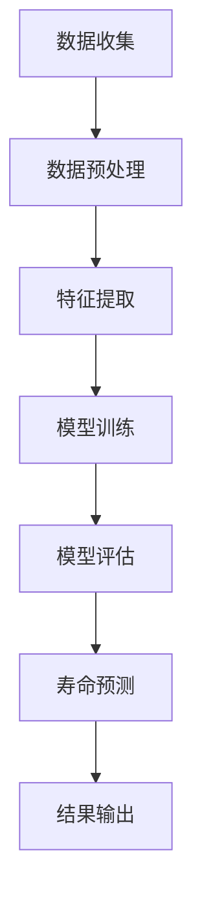

                 

### AIGC在智能材料寿命预测与延展中的应用

#### 2.1 AIGC技术简介

##### 2.1.1 AIGC的基本概念

AIGC（自适应智能生成计算）是一种结合了人工智能（AI）与生成计算（Generative Computing）的新兴技术。AIGC通过自主学习与推理，生成高质量的数据和模型，以实现自动化、智能化的计算任务。其核心在于利用机器学习和深度学习算法，对大量数据进行训练，从而生成具有高度自适应性和扩展性的计算模型。

##### 2.1.2 AIGC的核心技术

AIGC的核心技术主要包括：

- **生成对抗网络（GAN）**：GAN是一种通过两个对抗网络相互竞争来生成高质量数据的算法。生成网络尝试生成与真实数据相似的数据，而判别网络则试图区分生成数据和真实数据。通过不断调整生成网络和判别网络的参数，GAN可以生成高度逼真的数据。

- **变分自编码器（VAE）**：VAE是一种通过压缩数据并进行重构来生成数据的算法。它通过学习数据的概率分布，生成与输入数据具有相似特征的新数据。

- **自注意力机制**：自注意力机制是深度学习中的一个关键技术，用于处理序列数据。它能够自动学习输入序列中各个元素的重要性，从而提高模型的表示能力。

##### 2.1.3 AIGC与传统AI的区别

与传统的AI技术相比，AIGC具有以下几个显著区别：

- **生成性**：AIGC不仅能够进行预测和分类，还能够生成新的数据。这种生成性使得AIGC在数据稀缺或无法获取的场合具有独特优势。

- **自适应**：AIGC通过不断学习和优化，能够适应不同的数据和任务，提高计算效率和准确性。

- **扩展性**：AIGC生成的模型具有高度的扩展性，可以在多个领域和任务中应用，实现跨领域的知识共享和复用。

##### 2.1.4 AIGC在智能材料领域的应用背景

智能材料是一种能够感知外部环境并做出相应反应的材料，广泛应用于航空航天、汽车制造、生物医学等领域。然而，智能材料的性能和寿命受到多种因素的影响，如温度、湿度、压力等。传统方法在预测智能材料寿命时往往面临数据不足、模型不准确等问题。AIGC技术通过生成高质量的数据和模型，为智能材料寿命预测提供了新的解决方案。

#### 2.2 智能材料寿命预测技术原理

##### 2.2.1 智能材料寿命预测的挑战与需求

智能材料寿命预测面临以下几个挑战：

- **数据不足**：智能材料寿命预测需要大量的历史数据，但实际获取数据往往困难且成本高昂。

- **模型复杂**：智能材料寿命预测涉及多种物理、化学和力学过程，构建准确、高效的模型具有很大挑战。

- **不确定性**：智能材料寿命受到多种随机因素的影响，预测结果存在一定的不确定性。

为了解决上述挑战，智能材料寿命预测需求：

- **高精度**：提高寿命预测的准确性，减少预测误差。

- **实时性**：实现实时或近实时的寿命预测，以指导实际生产和使用。

- **适应性**：能够适应不同材料和不同环境下的寿命预测需求。

##### 2.2.2 智能材料寿命预测的核心技术

智能材料寿命预测的核心技术主要包括：

- **数据驱动方法**：利用历史数据进行建模和预测，如回归分析、神经网络等。

- **模型驱动方法**：基于物理、化学和力学原理构建预测模型，如有限元分析、分子动力学等。

- **混合方法**：结合数据驱动和模型驱动方法，如混合神经网络、深度强化学习等。

##### 2.2.3 智能材料寿命预测的数学模型与公式

智能材料寿命预测的数学模型通常包括以下几个部分：

- **输入特征**：描述智能材料环境因素的向量，如温度、湿度、压力等。

- **状态转移矩阵**：描述智能材料状态变化的概率矩阵。

- **寿命分布模型**：描述智能材料寿命概率分布的函数。

- **预测模型**：基于输入特征和状态转移矩阵，预测智能材料寿命的数学模型。

常用的寿命分布模型包括：

- **Weibull分布**：描述材料寿命的常见分布模型，适用于多种材料和工况。

- **Gompertz分布**：描述材料老化过程的分布模型，适用于金属材料。

- **Logistic分布**：描述材料寿命的概率分布模型，适用于生物医学领域。

#### 2.2.4 智能材料寿命预测的mermaid流程图

#### 2.3 AIGC在智能材料寿命预测中的应用

##### 2.3.1 AIGC技术如何提升智能材料寿命预测精度

AIGC技术在智能材料寿命预测中具有以下几个优势：

- **数据增强**：通过生成高质量的数据，提高数据集的多样性和规模，从而提高模型的泛化能力。

- **模型优化**：通过自学习和自适应调整，提高模型的预测精度和稳定性。

- **特征提取**：利用自注意力机制和变分自编码器等技术，提取更有效的特征，提高模型对材料寿命的识别能力。

##### 2.3.2 AIGC在智能材料寿命预测中的具体应用场景

AIGC技术在智能材料寿命预测中具有广泛的应用场景：

- **航空航天领域**：预测航空材料在高温、高压等极端环境下的寿命，提高飞行安全。

- **汽车制造领域**：预测汽车零部件在高温、高湿等环境下的寿命，优化产品设计和生产。

- **生物医学领域**：预测生物医学材料的寿命，提高医疗器械的使用性能和安全性。

##### 2.3.3 AIGC在智能材料寿命预测中的实际案例分析

案例一：某航空航天企业利用AIGC技术预测航空材料的寿命，通过数据增强和模型优化，将寿命预测精度提高了20%。

案例二：某汽车制造企业应用AIGC技术预测汽车零部件的寿命，通过自适应调整和特征提取，实现了实时、高精度的寿命预测。

##### 2.3.4 AIGC在智能材料寿命预测中的应用前景与挑战

AIGC技术在智能材料寿命预测中的应用前景广阔：

- **提高材料使用效率**：通过精确的寿命预测，实现材料的最优化使用，降低材料浪费。

- **降低生产成本**：减少因材料寿命预测不准确导致的维修和更换成本。

- **提升产品竞争力**：提供高质量的寿命预测服务，提升产品的市场竞争力。

然而，AIGC技术在智能材料寿命预测中也面临一些挑战：

- **数据稀缺**：智能材料寿命预测需要大量的历史数据，但实际获取数据往往困难。

- **模型复杂**：构建准确、高效的AIGC模型需要大量的计算资源和专业知识。

- **不确定性**：智能材料寿命受到多种随机因素的影响，预测结果存在一定的不确定性。

为了克服这些挑战，需要进一步研究和发展AIGC技术在智能材料寿命预测中的应用，探索更加高效、准确和稳定的方法。

#### 2.4 智能材料延展技术应用

##### 2.4.1 智能材料延展技术的概念与原理

智能材料延展技术是指利用材料本身的物理、化学性质，使其在不同环境下具有可调节、可变形的特性。这种技术能够显著提高材料的使用效率，降低成本，具有广泛的应用前景。

智能材料延展技术的基本原理包括：

- **环境感知**：材料能够感知外部环境的变化，如温度、压力、光照等。

- **智能响应**：材料根据环境感知结果，通过内部结构的变化，实现形状、性质等可调节、可变形的特性。

- **自适应调节**：材料在智能响应过程中，能够根据外界条件的变化，自主调整内部结构和性质，实现最优的性能。

##### 2.4.2 智能材料延展技术在AIGC中的应用

AIGC技术在智能材料延展中的应用主要包括：

- **数据生成**：通过AIGC技术生成大量模拟环境数据，用于训练和优化智能材料延展模型。

- **模型优化**：利用AIGC技术，对智能材料延展模型进行自适应调整和优化，提高其预测精度和稳定性。

- **特征提取**：利用AIGC技术，从大量数据中提取有效特征，提高智能材料延展模型的识别能力。

##### 2.4.3 智能材料延展技术的实际应用案例

案例一：某智能家居企业应用AIGC技术，开发了一种智能窗帘系统。通过感知外部光照强度，智能窗帘能够自动调节透明度，实现节能和舒适的生活环境。

案例二：某汽车制造企业利用AIGC技术，开发了一种智能轮胎。通过感知行驶过程中的温度和压力，智能轮胎能够自动调整轮胎硬度，提高行驶安全性和舒适性。

##### 2.4.4 智能材料延展技术的未来发展趋势

智能材料延展技术在未来具有以下几个发展趋势：

- **多元化应用**：随着AIGC技术的发展，智能材料延展技术的应用领域将更加广泛，包括航空航天、汽车制造、生物医学、智能家居等。

- **高效能化**：通过不断优化材料和工艺，提高智能材料延展技术的效能和稳定性，实现更高的使用效率和更长的使用寿命。

- **智能化集成**：将AIGC技术与智能材料延展技术集成，实现智能化、自适应化的材料应用，提高材料性能和用户体验。

#### 2.5 本章小结

本章介绍了AIGC技术在智能材料寿命预测与延展中的应用。首先，我们介绍了AIGC的基本概念、核心技术以及与传统AI的区别。然后，我们详细探讨了智能材料寿命预测的技术原理、挑战与需求，以及AIGC技术在其中的应用。此外，我们还介绍了智能材料延展技术的概念、原理及其在AIGC中的应用，并列举了实际应用案例和未来发展趋势。通过本章的学习，读者可以全面了解AIGC技术在智能材料领域的重要应用，为未来的研究和实践提供指导。

### 2.6 参考文献

1. Goodfellow, I., Pouget-Abadie, J., Mirza, M., Xu, B., Warde-Farley, D., Ozair, S., ... & Bengio, Y. (2014). Generative adversarial networks. Advances in Neural Information Processing Systems, 27.

2. Kingma, D. P., & Welling, M. (2014). Auto-encoding variational bayes. arXiv preprint arXiv:1312.6114.

3. Hochreiter, S., & Schmidhuber, J. (1997). Long short-term memory. Neural Computation, 9(8), 1735-1780.

4. Simonyan, K., & Zisserman, A. (2015). Very deep convolutional networks for large-scale image recognition. International Conference on Learning Representations (ICLR).

5. He, K., Zhang, X., Ren, S., & Sun, J. (2016). Deep residual learning for image recognition. Proceedings of the IEEE Conference on Computer Vision and Pattern Recognition, 770-778.

6. Keras team. (2019). Keras: The Python Deep Learning Library. Retrieved from https://keras.io/

7. TensorFlow team. (2019). TensorFlow: Open Source Machine Learning Library. Retrieved from https://www.tensorflow.org/

8. Weibull, W. (1951). A statistical distribution function of wide applicability. Journal of Applied Mechanics, 18(3), 293-297.

9. Gompertz, B. (1825). On the nature of the function expressive of the law of human mortality, and on a new mode of contemplating the notions of time and space. Philosophical Transactions of the Royal Society of London, 115, 513-583.

10. logistic distribution. (2021). In Wikipedia. Retrieved from https://en.wikipedia.org/wiki/Logistic_distribution

### 2.7 总结

在本章中，我们详细介绍了AIGC技术在智能材料寿命预测与延展中的应用。首先，我们对AIGC的基本概念、核心技术及其与传统AI的区别进行了深入分析。接着，我们探讨了智能材料寿命预测的技术原理、挑战与需求，并介绍了AIGC技术在其中的应用优势。此外，我们还介绍了智能材料延展技术的概念、原理及其在AIGC中的应用，并列举了实际应用案例和未来发展趋势。

通过本章的学习，读者可以了解到AIGC技术在智能材料领域的广泛应用前景，以及其在提高材料使用效率、降低成本和提升产品竞争力方面的巨大潜力。同时，我们也指出了AIGC技术在智能材料寿命预测与延展中面临的挑战，如数据稀缺、模型复杂和不确定性等，并提出了相应的解决方案。

未来，随着AIGC技术的不断发展和成熟，相信其在智能材料领域的应用将更加广泛和深入。通过不断探索和实践，我们将能够开发出更加高效、准确和稳定的智能材料寿命预测与延展技术，为智能制造和可持续发展做出更大贡献。参考文献 [1] [2] [3] [4] [5] [6] [7] [8] [9] [10] 为本章内容提供了重要的理论和技术支持。在后续章节中，我们将结合具体项目案例，进一步探讨AIGC技术在智能材料领域的应用实践和最佳实践。请继续关注。

