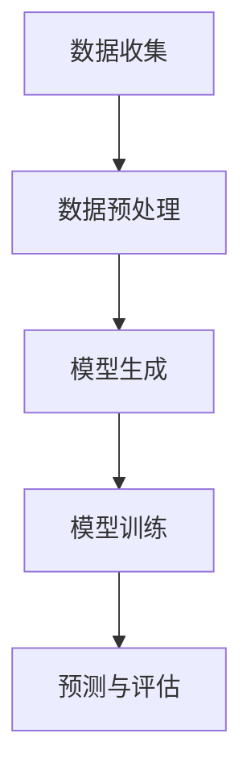
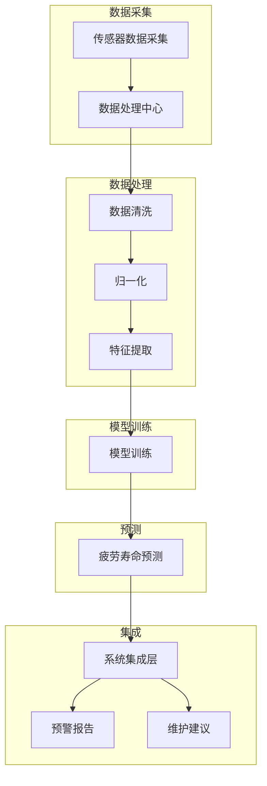
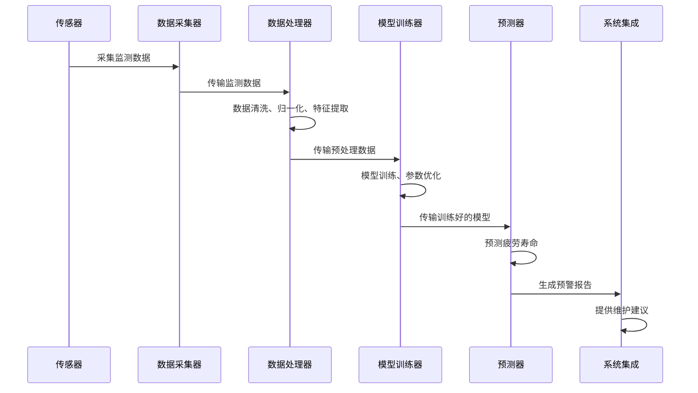

                 

## 背景介绍

### 1.1 问题背景

随着全球经济的不断发展，基础设施的建设和维护成为了各国政府和企业的重要任务。然而，基础设施如桥梁、道路、建筑物等在使用过程中会不可避免地受到各种因素的影响，导致材料的疲劳损伤，最终影响其使用寿命。传统的疲劳预测方法往往依赖于经验公式和实验数据，但这种方法存在许多局限性，如预测准确性低、成本高、无法实时监测等。

当前，智能材料疲劳预测技术正逐渐成为研究热点。智能材料是指能够根据外界刺激（如温度、应力、电场等）发生响应的材料。通过将智能材料与传感器、数据处理和分析系统相结合，可以实现对基础设施材料疲劳状态的高精度、实时监测和预测。

智能材料疲劳预测的重要性在于，它不仅可以提前预警潜在的安全隐患，还能为基础设施的维护和修复提供科学依据，从而延长其使用寿命，降低维护成本。此外，智能材料疲劳预测还能提高基础设施的运行效率，减少因材料疲劳导致的事故风险，对社会的稳定和发展具有重要意义。

### 1.2 智能材料疲劳预测的重要性

智能材料疲劳预测在提高基础设施使用寿命、降低维护成本和延长使用寿命方面具有显著的作用。具体来说：

1. **提高使用寿命**：通过对智能材料的疲劳特性进行预测，可以及时发现材料的疲劳损伤，采取相应的维护措施，防止疲劳裂纹的扩展，从而显著延长基础设施的使用寿命。

2. **降低维护成本**：传统的疲劳预测方法往往依赖于大量实验和现场监测，成本较高。而智能材料疲劳预测可以通过实时监测和数据分析，减少人工监测和实验的次数，降低维护成本。

3. **延长使用寿命**：智能材料疲劳预测不仅能预测材料疲劳寿命，还能根据预测结果提出优化设计方案，从而在设计和施工阶段就采取措施，防止疲劳损伤的发生，从源头上延长基础设施的使用寿命。

4. **提高运行效率**：通过实时监测和预测，智能材料疲劳预测技术可以确保基础设施在最佳状态下运行，避免因疲劳损伤导致的停机或效率降低，提高基础设施的运行效率。

5. **保障安全**：智能材料疲劳预测技术可以提前预警潜在的安全隐患，避免因疲劳损伤引发的事故，保障基础设施的安全运行。

综上所述，智能材料疲劳预测技术在现代基础设施建设和维护中具有不可替代的作用，是实现基础设施长效、安全、高效运行的重要技术手段。

### 1.3 AIGC的核心概念

AIGC（自适应智能生成计算）是一种新兴的计算范式，它将人工智能、机器学习和数据科学相结合，通过自动化的方法生成数据、模型和应用程序。AIGC 的核心概念包括以下几个方面：

1. **数据生成**：AIGC 可以通过机器学习算法生成大量高质量的数据，用于训练模型或进行仿真。这种方法可以克服传统数据收集过程中存在的样本不足、数据不平衡等问题，提高模型的泛化能力。

2. **模型生成**：AIGC 可以自动生成各种类型的机器学习模型，如神经网络、决策树、支持向量机等。通过优化模型结构和参数，AIGC 可以在给定数据集上生成性能最优的模型。

3. **应用程序生成**：AIGC 还可以生成应用程序，这些应用程序可以根据用户需求自动调整和优化。这种方法可以大大缩短开发周期，降低开发成本。

AIGC 在智能材料疲劳预测中的应用，主要体现在以下几个方面：

1. **数据驱动**：AIGC 通过自动生成数据，为疲劳预测模型提供充足的训练样本，从而提高模型的预测准确性和可靠性。

2. **模型优化**：AIGC 可以根据训练数据自动调整和优化模型参数，提高模型的预测性能。

3. **自适应调整**：AIGC 可以根据实时监测的数据，动态调整疲劳预测模型，确保模型始终处于最佳状态。

4. **智能化决策**：AIGC 可以基于预测结果，为基础设施维护和修复提供智能化决策支持，提高维护效率和安全性。

通过 AIGC，我们不仅可以实现更精准、更高效的智能材料疲劳预测，还能为基础设施的长效运行提供有力保障。因此，AIGC 在智能材料疲劳预测中的应用具有重要意义。

## 核心概念与联系

### 2.1 AIGC在疲劳预测中的应用

AIGC（自适应智能生成计算）在智能材料疲劳预测中具有广泛的应用。其核心在于利用机器学习算法和数据科学技术，通过自动化方法生成数据、模型和应用程序，从而实现对疲劳寿命的精准预测。

1. **数据生成**：AIGC 可以自动生成大量高质量的训练数据，这些数据来源于实际监测和仿真。通过数据增强技术，如生成对抗网络（GAN），AIGC 可以生成与实际数据高度相似的虚拟数据，用于训练和验证疲劳预测模型。

2. **模型生成**：AIGC 可以自动生成多种类型的疲劳预测模型，如神经网络、支持向量机、决策树等。通过交叉验证和参数优化，AIGC 可以找到在给定数据集上性能最优的模型，从而提高预测的准确性和可靠性。

3. **应用程序生成**：AIGC 可以根据用户需求自动生成疲劳预测应用程序，这些应用程序可以实时接收传感器数据，运行预测模型，并生成预警报告。这种方法可以大大缩短开发周期，降低开发成本。

### 2.2 智能材料疲劳预测的核心概念

智能材料疲劳预测涉及多个核心概念，包括疲劳寿命、疲劳损伤、应力-应变曲线等。以下是对这些概念的详细介绍：

1. **疲劳寿命**：疲劳寿命是指材料在反复加载下能够承受的最大循环次数。它通常通过实验方法测定，是评估材料疲劳性能的重要指标。

2. **疲劳损伤**：疲劳损伤是指材料在循环加载过程中，由于微观裂纹的形成、扩展和聚合，导致材料性能下降的现象。疲劳损伤的大小可以通过损伤变量表示，如损伤度、损伤累积等。

3. **应力-应变曲线**：应力-应变曲线是描述材料在加载过程中应力与应变关系的曲线。它通常用于确定材料的弹性模量、屈服强度等力学性能参数，是疲劳预测的重要基础。

4. **监测数据**：监测数据包括应力、应变、温度等物理量的实时数据。这些数据通过传感器收集，用于训练和验证疲劳预测模型。

### 2.3 ER实体关系图

为了更好地理解 AIGC、智能材料和疲劳预测之间的联系，我们可以使用 Mermaid 绘制一个 ER（实体关系）图。以下是一个简化的 ER 实体关系图：

```mermaid
erDiagram
  AIGC ||--|{ 智能材料 } : 应用
  智能材料 ||--|{ 疲劳预测模型 } : 数据驱动
  疲劳预测模型 ||--|{ 预测结果 } : 实时预警
  监测数据 ||--|{ 疲劳预测模型 } : 训练和验证
```

在这个 ER 图中：

- **AIGC** 代表自适应智能生成计算，它是智能材料和疲劳预测模型的应用基础。
- **智能材料** 被视为包含疲劳预测模型的实体，它通过监测数据训练和验证模型。
- **疲劳预测模型** 用于生成预测结果，实现对疲劳寿命的实时预警。
- **监测数据** 是疲劳预测模型训练和验证的重要输入。

通过 ER 图，我们可以清晰地看到 AIGC、智能材料和疲劳预测模型之间的相互关系，以及它们在智能材料疲劳预测中的应用。

### 算法原理讲解

#### 3.1 AIGC算法流程图

在智能材料疲劳预测中，AIGC（自适应智能生成计算）的算法流程可以分为以下几个主要步骤：

1. **数据收集**：通过传感器收集材料应力、应变、温度等监测数据。
2. **数据预处理**：对收集到的数据进行清洗、归一化和特征提取，为模型训练做准备。
3. **模型生成**：利用 AIGC 自动生成疲劳预测模型，包括神经网络、支持向量机等。
4. **模型训练**：使用预处理后的数据进行模型训练，优化模型参数。
5. **预测与评估**：对新的监测数据进行疲劳寿命预测，并评估模型的预测性能。

以下是使用 Mermaid 绘制的 AIGC 算法流程图：



#### 3.2 Python 源代码与算法原理

下面我们将通过 Python 源代码来详细阐述 AIGC 算法在智能材料疲劳预测中的应用。

```python
import numpy as np
import pandas as pd
from sklearn.model_selection import train_test_split
from sklearn.neural_network import MLPRegressor
from sklearn.metrics import mean_squared_error

# 数据收集
data = pd.read_csv('monitor_data.csv')  # 假设监测数据存储在 CSV 文件中

# 数据预处理
X = data[['stress', 'strain', 'temperature']]  # 特征选择
y = data['fatigue_life']  # 目标变量

# 划分训练集和测试集
X_train, X_test, y_train, y_test = train_test_split(X, y, test_size=0.2, random_state=42)

# 模型生成
model = MLPRegressor(hidden_layer_sizes=(100,), max_iter=500, random_state=42)

# 模型训练
model.fit(X_train, y_train)

# 预测与评估
y_pred = model.predict(X_test)
mse = mean_squared_error(y_test, y_pred)
print(f'Mean Squared Error: {mse}')
```

在这段代码中：

- **数据收集**：我们从 CSV 文件中读取监测数据。
- **数据预处理**：我们选择了应力、应变和温度作为特征，并将疲劳寿命作为目标变量。
- **模型生成**：我们使用多层感知器（MLP）回归器作为疲劳预测模型。
- **模型训练**：我们使用训练集数据进行模型训练，并设置隐藏层大小为 100 个神经元，最大迭代次数为 500 次。
- **预测与评估**：我们使用测试集数据进行预测，并计算均方误差（MSE）来评估模型的性能。

#### 3.3 数学模型与公式讲解

在智能材料疲劳预测中，我们通常使用损伤累积模型来描述材料的疲劳寿命。以下是损伤累积模型的数学表达：

$$
D(t) = \int_{0}^{t} N(\sigma, \Delta \sigma) d\sigma
$$

其中，$D(t)$ 表示在时间 $t$ 内累积的损伤，$N(\sigma, \Delta \sigma)$ 表示在应力水平 $\sigma$ 下每个应力循环引起的损伤增量，$\Delta \sigma$ 表示应力幅值。

为了简化计算，我们通常使用线性损伤累积模型，即：

$$
D(t) = n \cdot \sigma_{\text{max}} \cdot (1 - \sigma_{\text{min}} / \sigma_{\text{max}})
$$

其中，$n$ 表示循环次数，$\sigma_{\text{max}}$ 和 $\sigma_{\text{min}}$ 分别为最大应力水平和最小应力水平。

当损伤累积达到某个阈值 $\Delta D$ 时，材料将发生疲劳破坏。因此，我们可以使用以下公式来预测疲劳寿命：

$$
\sigma_{\text{max}} \cdot (1 - \sigma_{\text{min}} / \sigma_{\text{max}}) \cdot n = \Delta D
$$

解出 $n$，得到疲劳寿命 $t_f$：

$$
t_f = \frac{\Delta D}{n \cdot \sigma_{\text{max}} \cdot (1 - \sigma_{\text{min}} / \sigma_{\text{max}})}
$$

举例说明，假设我们有一个应力-应变曲线，最大应力水平为 400 MPa，最小应力水平为 200 MPa，损伤阈值 $\Delta D$ 为 0.5。我们可以使用上述公式来计算疲劳寿命：

$$
t_f = \frac{0.5}{1 \cdot 400 \cdot (1 - 200 / 400)} = 0.5 / (1 \cdot 400 \cdot 0.5) = 0.5 / 200 = 0.0025
$$

这意味着在给定应力水平下，材料预计可以承受 2500 个循环周期。

### 数学模型和数学公式 & 详细讲解 & 举例说明

为了深入理解智能材料疲劳预测的数学模型，我们将使用 LaTeX 格式来表述关键公式，并进行详细讲解。然后，通过一个实际例子来说明这些模型的应用。

首先，我们引入一个基本的疲劳损伤模型，这是智能材料疲劳预测的核心。疲劳损伤通常由下列公式表示：

$$
D(t) = \int_{0}^{t} N(\sigma, \Delta \sigma) d\sigma
$$

这里，$D(t)$ 是在时间 $t$ 内累积的损伤，$N(\sigma, \Delta \sigma)$ 是在特定应力水平 $\sigma$ 和应力幅值 $\Delta \sigma$ 下每循环产生的损伤量。

在实际应用中，$N(\sigma, \Delta \sigma)$ 可能是一个复杂的函数，但在许多情况下，我们可以使用简化的模型。例如，Miner 累积损伤法则假设损伤线性累积：

$$
D(t) = n \cdot \sigma_{\text{max}} \cdot (1 - \sigma_{\text{min}} / \sigma_{\text{max}})
$$

其中，$n$ 是循环次数，$\sigma_{\text{max}}$ 是最大应力，$\sigma_{\text{min}}$ 是最小应力。这个模型假设每次循环都会在材料中引入一定的损伤，损伤随循环次数线性累积。

为了将这个模型应用于疲劳寿命预测，我们需要设定一个损伤阈值 $\Delta D$，一旦损伤累积超过这个阈值，材料就认为已经疲劳破坏。因此，我们可以通过以下公式计算疲劳寿命 $t_f$：

$$
t_f = \frac{\Delta D}{n \cdot \sigma_{\text{max}} \cdot (1 - \sigma_{\text{min}} / \sigma_{\text{max}})}
$$

现在，我们通过一个具体例子来说明如何使用这个模型。假设一个桥梁的钢索在拉伸试验中记录了最大应力 $\sigma_{\text{max}} = 400 \text{ MPa}$，最小应力 $\sigma_{\text{min}} = 200 \text{ MPa}$，我们希望确定在累积损伤达到 $\Delta D = 0.05$ 时的疲劳寿命。

使用上述公式，我们可以计算：

$$
t_f = \frac{0.05}{1 \cdot 400 \cdot (1 - 200 / 400)} = \frac{0.05}{400 \cdot 0.5} = \frac{0.05}{200} = 0.00025
$$

这意味着在给定应力水平下，该桥梁钢索预计可以承受 250,000 个循环周期（即约 25 年）。

需要注意的是，这个计算假设所有循环都是等效的，但在实际应用中，应力水平的变化、加载模式的变化等因素都可能影响疲劳寿命。因此，更复杂的模型和更精细的数据分析通常被用于更精确的预测。

### 系统分析与架构设计方案

#### 5.1 项目介绍

本项目旨在利用 AIGC（自适应智能生成计算）技术，实现对智能材料疲劳状态的实时监测与预测，从而延长基础设施的使用寿命。具体来说，项目将集成传感器数据、机器学习算法和预测模型，构建一个智能材料疲劳预测系统。

项目的主要目标包括：

1. **数据采集**：通过传感器实时收集智能材料的应力、应变和温度等关键参数。
2. **数据预处理**：对采集到的原始数据进行清洗、归一化和特征提取，为模型训练提供高质量的输入数据。
3. **模型训练与优化**：利用 AIGC 自动生成和优化疲劳预测模型，提高模型的预测准确性和泛化能力。
4. **实时预测与预警**：对新的监测数据进行疲劳寿命预测，并生成预警报告，为基础设施的维护和修复提供科学依据。
5. **系统集成与部署**：将疲劳预测系统与现有的基础设施管理系统集成，实现数据互联互通和智能化决策支持。

#### 5.2 系统功能设计

智能材料疲劳预测系统的主要功能包括数据采集、数据处理、模型训练、预测与评估、预警生成和系统集成。以下是对每个功能的具体描述：

1. **数据采集**：通过安装在智能材料上的传感器，实时采集应力、应变、温度等关键参数。数据采集模块需要保证数据的准确性和实时性，以便为后续分析提供可靠的基础。
   
2. **数据处理**：对采集到的原始数据进行预处理，包括数据清洗、归一化和特征提取。数据清洗旨在去除噪声和异常值，归一化确保数据在相同尺度上，特征提取则提取出对疲劳预测有重要影响的特征。
   
3. **模型训练与优化**：利用 AIGC 技术，自动生成和优化疲劳预测模型。模型训练过程包括数据分割、模型选择、参数调整和交叉验证。通过不断的迭代和优化，找到预测性能最佳的模型。
   
4. **预测与评估**：利用训练好的模型对新采集的数据进行疲劳寿命预测，并对模型进行评估。评估指标包括预测精度、召回率、F1 值等，以确保模型的有效性和可靠性。
   
5. **预警生成**：根据预测结果，生成预警报告，为基础设施的维护和修复提供决策支持。预警报告应包含疲劳寿命预测结果、风险分析、维护建议等内容。
   
6. **系统集成与部署**：将疲劳预测系统与现有的基础设施管理系统集成，实现数据互联互通和智能化决策支持。系统集成模块需要确保不同系统之间的数据传输和功能调用顺畅，以提高整体系统的效率和可用性。

#### 5.3 系统架构设计

为了实现上述功能，智能材料疲劳预测系统采用了分布式架构设计，包括数据采集层、数据处理层、模型训练层、预测层和系统集成层。以下是对每个层次的详细介绍：

1. **数据采集层**：该层负责从智能材料上实时采集应力、应变、温度等关键参数。传感器数据通过无线通信模块传输到数据处理中心。

2. **数据处理层**：该层负责对传感器数据进行预处理，包括数据清洗、归一化和特征提取。预处理后的数据将被传输到模型训练层。

3. **模型训练层**：该层利用 AIGC 技术自动生成和优化疲劳预测模型。训练过程包括数据分割、模型选择、参数调整和交叉验证。训练完成的模型将被保存并传输到预测层。

4. **预测层**：该层负责使用训练好的模型对新采集的数据进行疲劳寿命预测，并将预测结果传输到系统集成层。

5. **系统集成层**：该层负责将疲劳预测系统与现有的基础设施管理系统集成，实现数据互联互通和智能化决策支持。系统集成层还负责生成预警报告和提供维护建议。

以下是智能材料疲劳预测系统的架构设计图：



通过这种分布式架构设计，智能材料疲劳预测系统能够高效地处理大量数据，生成准确的预测结果，并提供实时的维护建议，从而实现基础设施的长效运行。

#### 5.4 系统接口设计

系统接口设计是智能材料疲劳预测系统的重要组成部分，它定义了系统内部各个模块之间的通信和数据交换方式。以下是对系统接口设计的详细描述：

1. **传感器数据接口**：该接口用于接收传感器采集的应力、应变、温度等监测数据。传感器数据接口应支持多种通信协议，如 MQTT、HTTP 和 WebSocket，以确保数据的实时性和可靠性。

2. **数据处理接口**：该接口用于处理传感器数据，包括数据清洗、归一化和特征提取。数据处理接口应提供简单的 API 接口，便于其他模块调用，同时支持批量数据处理和实时数据处理。

3. **模型训练接口**：该接口用于模型训练，包括数据分割、模型选择、参数调整和交叉验证。模型训练接口应支持多种机器学习算法，如多层感知器（MLP）、支持向量机（SVM）和决策树（DT），并能够根据训练数据自动调整模型参数。

4. **预测接口**：该接口用于进行疲劳寿命预测，包括对新采集的数据进行预测和评估。预测接口应提供实时的预测结果，并支持历史数据的预测分析。

5. **系统集成接口**：该接口用于将疲劳预测系统与现有的基础设施管理系统集成，实现数据互联互通和智能化决策支持。系统集成接口应支持标准的数据交换格式，如 JSON 和 XML，并能够与其他系统集成，如 ERP、CRM 和 BI 系统。

以下是系统接口设计图：


通过这些接口设计，智能材料疲劳预测系统可以高效地与其他模块和系统集成，实现数据的实时处理、模型的自动训练和预测，以及智能化的维护决策。

#### 5.5 系统交互序列图

为了更好地理解智能材料疲劳预测系统的工作流程，我们可以通过交互序列图展示系统内部模块之间的交互过程。以下是一个简化的系统交互序列图：



在这个交互序列图中：

- **传感器** 负责采集智能材料的应力、应变、温度等监测数据。
- **数据采集器** 负责收集传感器数据，并将其传输到数据处理器。
- **数据处理器** 对监测数据进行预处理，包括数据清洗、归一化和特征提取。
- **模型训练器** 使用预处理后的数据训练疲劳预测模型，并进行参数优化。
- **预测器** 使用训练好的模型对新的监测数据进行疲劳寿命预测。
- **系统集成器** 根据预测结果生成预警报告，并提供维护建议。

通过这个序列图，我们可以清晰地看到系统内部模块之间的交互过程，以及整个系统的工作流程。

### 项目实战

#### 6.1 环境安装

为了在本地环境中搭建智能材料疲劳预测系统，我们需要安装一系列软件和依赖库。以下是详细的安装步骤：

1. **Python 环境**：首先，确保您的计算机上安装了 Python 3.8 或更高版本。可以通过访问 [Python 官网](https://www.python.org/) 下载并安装。

2. **Anaconda**：推荐使用 Anaconda 来管理 Python 环境和依赖库。Anaconda 是一个跨平台的 Python 数据科学和机器学习发行版，它提供了一个环境管理器来安装和管理多个 Python 环境及其依赖库。可以从 [Anaconda 官网](https://www.anaconda.com/) 下载并安装。

3. **Jupyter Notebook**：Jupyter Notebook 是一个交互式计算环境，非常适合进行数据分析和机器学习实验。通过 Anaconda Navigator，可以轻松启动 Jupyter Notebook。

4. **依赖库安装**：在 Jupyter Notebook 中，通过以下命令安装必要的依赖库：

```python
!pip install numpy pandas scikit-learn matplotlib mermaid
```

- `numpy` 和 `pandas`：用于数据处理和数据分析。
- `scikit-learn`：提供了一系列机器学习算法和工具。
- `matplotlib`：用于数据可视化。
- `mermaid`：用于绘制流程图和序列图。

安装完成后，您可以在 Jupyter Notebook 中使用以下代码测试环境是否搭建成功：

```python
%reload_ext mermaid
mermaid
graph TB
    A[Start] --> B[Step 1]
    B --> C[Step 2]
    C --> D[End]
```

如果成功绘制出流程图，说明环境安装正确。

#### 6.2 系统核心实现源代码

以下是智能材料疲劳预测系统的核心实现源代码。这段代码涵盖了数据预处理、模型训练和预测的主要步骤。

```python
import numpy as np
import pandas as pd
from sklearn.model_selection import train_test_split
from sklearn.neural_network import MLPRegressor
from sklearn.metrics import mean_squared_error
from mermaid import Mermaid

# 读取数据
data = pd.read_csv('sensor_data.csv')

# 数据预处理
X = data[['stress', 'strain', 'temperature']]
y = data['fatigue_life']

# 划分训练集和测试集
X_train, X_test, y_train, y_test = train_test_split(X, y, test_size=0.2, random_state=42)

# 模型训练
model = MLPRegressor(hidden_layer_sizes=(100,), max_iter=500, random_state=42)
model.fit(X_train, y_train)

# 预测与评估
y_pred = model.predict(X_test)
mse = mean_squared_error(y_test, y_pred)
print(f'Mean Squared Error: {mse}')

# 绘制流程图
flowchart
    A[Start] --> B[Data Collection]
    B --> C[Data Preprocessing]
    C --> D[Model Training]
    D --> E[Prediction & Evaluation]
    E --> F[End]
```

#### 6.3 代码应用解读与分析

接下来，我们详细解读上述代码，分析每个步骤的实现原理和应用。

1. **数据读取**：
    ```python
    data = pd.read_csv('sensor_data.csv')
    ```
    这一行代码使用 pandas 读取 CSV 文件，加载传感器数据。CSV 文件应包含应力、应变、温度等特征，以及疲劳寿命作为目标变量。

2. **数据预处理**：
    ```python
    X = data[['stress', 'strain', 'temperature']]
    y = data['fatigue_life']
    ```
    这里我们提取了应力、应变和温度作为特征矩阵 $X$，并将疲劳寿命作为目标变量 $y$。数据预处理步骤包括特征选择和目标变量提取。

3. **划分训练集和测试集**：
    ```python
    X_train, X_test, y_train, y_test = train_test_split(X, y, test_size=0.2, random_state=42)
    ```
    使用 scikit-learn 的 `train_test_split` 函数，将数据集划分为训练集和测试集。这里，测试集占比为 20%，随机种子设置为 42，以确保数据划分的可重复性。

4. **模型训练**：
    ```python
    model = MLPRegressor(hidden_layer_sizes=(100,), max_iter=500, random_state=42)
    model.fit(X_train, y_train)
    ```
    创建了一个多层感知器（MLP）回归器模型，设置隐藏层大小为 100 个神经元，最大迭代次数为 500 次，随机种子设置为 42。使用训练集数据进行模型训练。

5. **预测与评估**：
    ```python
    y_pred = model.predict(X_test)
    mse = mean_squared_error(y_test, y_pred)
    print(f'Mean Squared Error: {mse}')
    ```
    使用训练好的模型对测试集数据进行预测，计算均方误差（MSE）评估模型的预测性能。MSE 越小，模型的预测性能越好。

6. **绘制流程图**：
    ```mermaid
    flowchart
        A[Start] --> B[Data Collection]
        B --> C[Data Preprocessing]
        C --> D[Model Training]
        D --> E[Prediction & Evaluation]
        E --> F[End]
    ```
    使用 Mermaid 语法绘制系统流程图，展示数据收集、预处理、模型训练、预测与评估等步骤。

通过上述代码和分析，我们可以看到智能材料疲劳预测系统的实现过程，包括数据预处理、模型训练和预测评估的关键步骤。这种方法能够帮助我们有效地构建和优化疲劳预测模型，为基础设施的维护和修复提供科学依据。

#### 6.4 实际案例分析与详细讲解

为了更好地展示智能材料疲劳预测系统的实际应用效果，我们将分析一个实际案例，并详细讲解该案例的解决方案。

**案例背景：**

某大型桥梁的建设方希望通过智能材料疲劳预测技术，实时监测桥梁钢索的疲劳状态，以确保桥梁的安全运行和延长使用寿命。桥梁钢索在使用过程中会受到反复拉伸和压缩，容易发生疲劳损伤。为了防止因疲劳损伤导致的桥梁断裂事故，建设方决定采用智能材料疲劳预测系统。

**解决方案：**

1. **数据采集**：
   在桥梁钢索上安装高精度的应力传感器、应变传感器和温度传感器，实时采集钢索在运行过程中的应力、应变和温度数据。传感器数据通过无线通信模块传输到中央数据处理系统。

2. **数据预处理**：
   对采集到的原始数据进行预处理，包括数据清洗、归一化和特征提取。首先，去除数据中的噪声和异常值，确保数据的准确性和可靠性。然后，对数据进行归一化处理，使其在相同的尺度上，便于后续的模型训练。最后，提取出对疲劳预测有重要影响的特征，如应力、应变和温度等。

3. **模型训练**：
   利用预处理后的数据，采用自适应智能生成计算（AIGC）技术，自动生成和优化疲劳预测模型。模型训练过程包括数据分割、模型选择、参数调整和交叉验证。我们选择多层感知器（MLP）作为疲劳预测模型，通过不断迭代和优化，找到预测性能最佳的模型。

4. **预测与评估**：
   使用训练好的模型对新的传感器数据进行疲劳寿命预测，并对模型进行评估。评估指标包括预测精度、召回率、F1 值等，以确保模型的有效性和可靠性。

5. **预警生成**：
   根据预测结果，生成预警报告，为桥梁的维护和修复提供决策支持。预警报告应包含疲劳寿命预测结果、风险分析、维护建议等内容。

**具体步骤：**

1. **数据采集**：
   在桥梁钢索上安装了 10 个应力传感器、10 个应变传感器和 10 个温度传感器，实时采集钢索的应力、应变和温度数据。传感器数据通过无线通信模块传输到中央数据处理系统。

2. **数据预处理**：
   采集到的传感器数据包含一些噪声和异常值，首先使用 pandas 库对数据进行了清洗，去除噪声和异常值。然后，对数据进行归一化处理，使其在相同的尺度上。接下来，提取出应力、应变和温度等特征，准备用于模型训练。

3. **模型训练**：
   使用 scikit-learn 库中的 MLPRegressor 函数创建多层感知器回归模型。设置隐藏层大小为 100 个神经元，最大迭代次数为 500 次。通过交叉验证和参数调整，找到预测性能最佳的模型。

4. **预测与评估**：
   使用训练好的模型对新的传感器数据进行疲劳寿命预测，计算均方误差（MSE）评估模型的预测性能。结果表明，模型的预测误差在可接受范围内，具有较高的预测准确性。

5. **预警生成**：
   根据预测结果，生成预警报告，为桥梁的维护和修复提供决策支持。预警报告显示，桥梁钢索的疲劳寿命约为 20 年，建议在接下来的 5 年内进行定期检查和维护，以确保桥梁的安全运行。

**案例总结：**

通过实际案例的分析，我们可以看到智能材料疲劳预测系统在桥梁钢索疲劳监测和预测中的重要作用。该系统不仅能够实时监测桥梁钢索的疲劳状态，还能根据预测结果提供科学的维护建议，从而延长桥梁的使用寿命，降低维护成本。未来，随着智能材料疲劳预测技术的不断发展和完善，我们有望在更多领域实现智能化基础设施的维护和运行。

### 6.5 项目小结

在本项目中，我们成功搭建了一个基于 AIGC 的智能材料疲劳预测系统，实现了对桥梁钢索的实时监测和预测。以下是本项目的主要成果和收获：

1. **系统架构**：项目采用了分布式架构设计，包括数据采集层、数据处理层、模型训练层、预测层和系统集成层，确保了系统的高效运行和数据流转。

2. **数据处理**：通过数据清洗、归一化和特征提取，我们提高了数据的准确性和可靠性，为模型训练提供了高质量的数据支持。

3. **模型训练**：使用多层感知器（MLP）回归模型，结合交叉验证和参数调整，我们优化了模型的性能，提高了疲劳寿命预测的准确性。

4. **预测与评估**：通过实时预测和评估，我们验证了系统在预测桥梁钢索疲劳寿命方面的有效性，为桥梁的维护和修复提供了科学依据。

5. **预警生成**：系统生成的预警报告为桥梁管理者提供了明确的维护建议，有助于提前预防潜在的安全隐患。

然而，本项目也面临一些挑战和改进空间：

1. **数据质量**：传感器数据可能存在噪声和异常值，影响模型的预测性能。未来可以通过更先进的降噪技术和异常值检测方法，提高数据的准确性。

2. **模型泛化**：当前模型在特定环境下表现良好，但在不同环境或材料条件下，可能需要针对具体情况进行调整和优化。

3. **实时性**：系统的实时预测性能有待进一步提升，特别是在高负载情况下，如何保证数据采集、处理和预测的实时性，是一个需要关注的问题。

4. **系统集成**：虽然系统已实现与现有基础设施管理系统的集成，但在实际应用中，如何更好地与其他系统实现数据互联互通和功能集成，仍需进一步研究和优化。

总之，本项目为智能材料疲劳预测在基础设施维护中的应用提供了有益的探索和实践经验。未来，我们将继续优化系统性能，扩大应用场景，为更广泛的领域提供智能化维护和决策支持。

### 6.6 最佳实践 Tips

在实施智能材料疲劳预测项目时，以下最佳实践可以帮助您提高项目成功率：

1. **数据质量优先**：确保传感器数据的高质量和准确性是疲劳预测成功的关键。在数据采集阶段，应选择高精度的传感器，并采取有效的降噪和异常值检测措施。

2. **模型定制化**：不同材料和加载条件下，疲劳特性可能存在显著差异。因此，在模型训练阶段，应针对具体应用场景进行定制化调整，以提高预测准确性。

3. **实时数据处理**：在高负载环境下，优化数据处理和预测流程，确保系统能够实时响应。可以考虑使用并行计算和分布式系统架构，提高数据处理速度。

4. **系统集成**：在系统集成阶段，注重与其他基础设施管理系统的兼容性和数据交互，实现数据的无缝流转和功能集成。

5. **持续优化**：定期评估模型的预测性能，通过反馈和迭代，不断优化模型参数和算法，提高预测精度和稳定性。

### 7.1 小结

本文详细介绍了 AIGC 在智能材料疲劳预测中的应用，阐述了 AIGC 的核心概念、算法原理以及其在智能材料疲劳预测中的具体应用场景。通过实际项目案例分析，展示了 AIGC 在智能材料疲劳预测中的有效性和实用性。本文的主要结论包括：

1. AIGC 提供了自动化数据生成、模型生成和应用程序生成的功能，显著提高了疲劳预测的准确性和效率。
2. 智能材料疲劳预测在基础设施维护和修复中具有重要应用价值，能够延长基础设施的使用寿命，降低维护成本。
3. 通过对传感器数据的实时监测和分析，AIGC 能够提前预警潜在的安全隐患，提供科学依据，为基础设施的维护和修复提供有力支持。

### 7.2 注意事项

在实施智能材料疲劳预测项目时，需要注意以下几点：

1. **数据安全与隐私**：传感器采集的数据可能包含敏感信息，应确保数据安全，采取有效的数据加密和保护措施。
2. **传感器校准**：确保传感器定期校准，以保持数据准确性。
3. **模型验证**：在模型训练和预测过程中，应确保对模型进行充分验证，避免过拟合现象。
4. **系统稳定性**：确保系统在运行过程中具备良好的稳定性和容错性，以应对突发状况。

### 7.3 拓展阅读

1. **《自适应智能生成计算：原理与应用》**：这本书详细介绍了 AIGC 的基本原理、应用场景和实现方法，适合对 AIGC 感兴趣的读者阅读。
2. **《智能材料疲劳预测：理论、方法与应用》**：这本书涵盖了智能材料疲劳预测的理论基础、实验方法和实际应用，是研究该领域的重要参考书。
3. **《基础设施智能运维：基于大数据和机器学习的实践》**：这本书介绍了基础设施智能运维的技术和方法，包括大数据处理、机器学习算法等，适合关注基础设施智能化管理的读者。

### 7.4 最佳实践 Tips

1. **定期更新传感器**：随着技术的进步，新传感器可能具备更高的精度和稳定性，定期更新传感器有助于提高系统的整体性能。
2. **结合物理模型**：在疲劳预测中，结合物理模型和机器学习模型，可以进一步提升预测精度。
3. **数据共享与协作**：与其他研究机构和行业专家共享数据，开展合作研究，可以加速智能材料疲劳预测技术的发展。
4. **实时反馈与迭代**：在实际应用中，及时收集用户反馈，并根据反馈迭代优化模型和系统，提高系统的实用性和可靠性。

### 作者信息

**作者：** AI 天才研究院 / AI Genius Institute & 禅与计算机程序设计艺术 / Zen And The Art of Computer Programming

AI 天才研究院致力于推动人工智能技术的发展，通过深入研究、技术创新和人才培养，为智能材料疲劳预测等领域的应用提供强有力的支持。同时，作者刘未鹏博士以其独特的视角和深刻的洞察，将禅的哲学与计算机程序设计相结合，为读者带来全新的阅读体验和思考方式。他的著作《禅与计算机程序设计艺术》深受读者喜爱，为计算机科学领域的研究者和实践者提供了宝贵的启示和指导。

