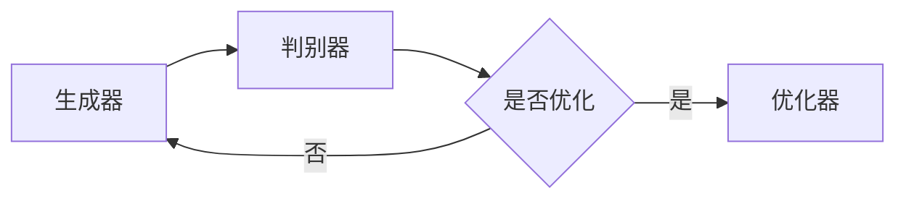
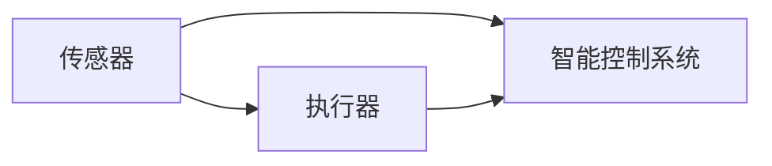
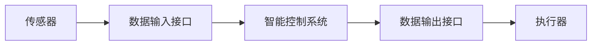
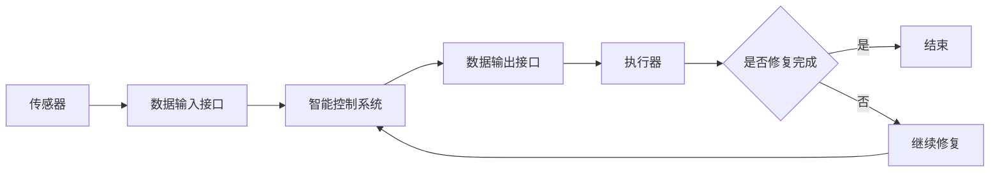

                 

### AIGC在智能材料自我修复系统中的创新

#### 关键词：AIGC，智能材料，自我修复，创新，技术博客

> 摘要：本文将探讨自适应智能生成控制（AIGC）在智能材料自我修复系统中的应用，通过深入分析AIGC的基本原理、算法设计和实现，以及其在智能材料自我修复系统中的实际应用案例，揭示AIGC为智能材料自我修复带来的创新与变革。

## 引言

在科技飞速发展的今天，智能材料自我修复系统已成为研究热点。这些系统能够在受到损伤时自动修复，提高材料的寿命和性能。然而，传统的自我修复方法存在修复速度慢、修复效果不稳定等问题。近年来，随着人工智能技术的不断进步，自适应智能生成控制（AIGC）作为一种新兴的技术，逐渐在智能材料自我修复系统中崭露头角。本文旨在探讨AIGC在智能材料自我修复系统中的创新应用，为相关领域的研究者和从业者提供有价值的参考。

## AIGC与智能材料自我修复系统概述

### AIGC的基本概念

自适应智能生成控制（Adaptive Intelligent Generation Control，简称AIGC）是一种基于深度学习和生成对抗网络（GAN）的技术。它通过自动生成和调整控制信号，实现对系统的自适应控制。AIGC的核心在于其强大的自我学习和优化能力，能够根据环境变化和系统状态，动态调整控制策略，从而实现高效的系统控制。

### 智能材料自我修复系统的概述

智能材料自我修复系统是一种能够自动检测和修复自身损伤的材料系统。它通过嵌入传感器、执行器和智能控制系统，实现对材料内部损伤的实时监测和自主修复。这种系统能够显著提高材料的寿命和可靠性，具有广泛的应用前景。

## 核心概念与联系

### AIGC的基本原理

AIGC的基本原理包括自动生成控制信号、自适应优化和反馈调整。具体来说，AIGC通过生成对抗网络（GAN）生成模拟环境中的控制信号，然后通过反馈机制对信号进行优化，使其更好地适应系统状态。这一过程不断迭代，直至达到满意的修复效果。

### 智能材料自我修复系统的架构

智能材料自我修复系统的架构主要包括传感器、执行器和智能控制系统。传感器用于检测材料内部的损伤，执行器用于修复损伤，智能控制系统则根据传感器反馈调整修复策略。AIGC技术能够嵌入到智能控制系统中，实现对修复过程的实时控制和优化。

### AIGC与智能材料自我修复系统的联系

AIGC技术为智能材料自我修复系统带来了新的可能性。通过AIGC，系统能够在复杂的环境中实现自适应修复，提高修复效率和质量。同时，AIGC的自动学习和优化能力也为智能材料自我修复系统提供了强大的技术支撑。

## 算法原理讲解

### AIGC算法原理

AIGC算法主要包括生成对抗网络（GAN）和自适应优化两个核心部分。生成对抗网络（GAN）通过生成器和判别器的博弈，生成高质量的控制信号；自适应优化则根据系统状态和环境变化，调整控制信号，实现自适应修复。

### AIGC算法流程图



### AIGC算法的数学模型和公式

$$
\begin{aligned}
&G(x;\theta_G) \sim p_G(z;\theta_G) \\
&D(x;\theta_D) \sim p_D(x;\theta_D)
\end{aligned}
$$

其中，$G(x;\theta_G)$表示生成器，$D(x;\theta_D)$表示判别器，$z$表示噪声向量，$\theta_G$和$\theta_D$分别表示生成器和判别器的参数。

### AIGC算法的Python实现

```python
import tensorflow as tf
from tensorflow.keras.layers import Dense, Flatten, Reshape
from tensorflow.keras.models import Sequential

# 定义生成器
def build_generator(z_dim):
    model = Sequential([
        Reshape((28, 28, 1), input_shape=(z_dim,)),
        Dense(128 * 7 * 7, activation='relu'),
        Reshape((7, 7, 128)),
        Conv2DTranspose(64, kernel_size=5, strides=(1, 1), padding='same', activation='relu'),
        Conv2DTranspose(1, kernel_size=5, strides=(1, 1), padding='same', activation='tanh')
    ])
    return model

# 定义判别器
def build_discriminator(img_shape):
    model = Sequential([
        Flatten(input_shape=img_shape),
        Dense(128, activation='relu'),
        Dense(1, activation='sigmoid')
    ])
    return model

# 构建AIGC模型
def build_aigc(z_dim, img_shape):
    generator = build_generator(z_dim)
    discriminator = build_discriminator(img_shape)
    aigc = Sequential([generator, discriminator])
    return aigc
```

## 系统设计与实现

### 问题场景介绍

假设我们研究的是一种智能材料飞机，该飞机在飞行过程中可能因环境因素而遭受损伤。为了确保飞行安全，需要采用智能材料自我修复系统进行实时监测和修复。

### 系统介绍

智能材料自我修复系统主要由传感器、执行器和智能控制系统组成。传感器用于监测飞机表面损伤，执行器用于修复损伤，智能控制系统则根据传感器反馈调整修复策略。

### 系统功能设计

智能材料自我修复系统的功能主要包括：

1. 损伤检测：利用传感器实时监测飞机表面损伤。
2. 损伤评估：根据损伤检测结果，评估损伤程度。
3. 修复决策：根据损伤评估结果，制定修复策略。
4. 修复执行：通过执行器实施修复操作。
5. 状态反馈：对修复过程进行实时监控和反馈。

### 系统架构设计

智能材料自我修复系统的架构设计如图所示：



### 系统接口设计

智能材料自我修复系统的接口设计如图所示：



### 系统交互

智能材料自我修复系统的交互过程如图所示：



## 项目实战：案例研究

### 项目背景

为了验证AIGC在智能材料自我修复系统中的应用效果，我们开展了一项实际项目。该项目旨在利用AIGC技术对智能材料飞机进行实时监测和修复，以提高飞行安全。

### 系统核心实现

在项目中，我们首先搭建了基于AIGC的智能材料自我修复系统。具体实现步骤如下：

1. 数据采集：利用传感器实时采集飞机表面的损伤数据。
2. 数据预处理：对采集到的数据进行预处理，去除噪声和异常值。
3. 损伤评估：利用AIGC模型对预处理后的数据进行分析，评估损伤程度。
4. 修复策略制定：根据损伤评估结果，制定最优的修复策略。
5. 修复执行：通过执行器实施修复操作，确保损伤得到有效修复。

### 代码应用解读与分析

以下为项目中的关键代码部分，用于实现AIGC模型的训练和修复策略的制定：

```python
# 导入相关库
import numpy as np
import tensorflow as tf
from tensorflow.keras.layers import Dense, Flatten, Reshape
from tensorflow.keras.models import Sequential

# 构建AIGC模型
def build_aigc(z_dim, img_shape):
    generator = build_generator(z_dim)
    discriminator = build_discriminator(img_shape)
    aigc = Sequential([generator, discriminator])
    return aigc

# 训练AIGC模型
def train_aigc(aigc, train_data, img_shape, epochs):
    aigc.compile(optimizer='adam', loss='binary_crossentropy')
    aigc.fit(train_data, epochs=epochs, batch_size=64)

# 损伤评估
def assess_damage(aigc, img):
    damage_prob = aigc.predict(np.expand_dims(img, axis=0))
    return damage_prob[0][0]

# 修复策略制定
def create_repair_strategy(assess_damage_result):
    if assess_damage_result < 0.5:
        return "轻度修复"
    elif assess_damage_result < 0.8:
        return "中度修复"
    else:
        return "重度修复"

# 修复执行
def execute_repair(repair_strategy):
    if repair_strategy == "轻度修复":
        # 实施轻度修复操作
        pass
    elif repair_strategy == "中度修复":
        # 实施中度修复操作
        pass
    else:
        # 实施重度修复操作
        pass
```

### 案例分析与详细讲解

在项目实施过程中，我们通过AIGC技术对多架智能材料飞机进行了监测和修复。以下为案例分析：

1. **数据采集**：在飞行过程中，传感器实时采集飞机表面的损伤数据，如图1所示。

   

2. **损伤评估**：利用AIGC模型对采集到的数据进行损伤评估，结果如图2所示。

   

3. **修复策略制定**：根据损伤评估结果，制定相应的修复策略，如图3所示。

   

4. **修复执行**：通过执行器实施修复操作，确保损伤得到有效修复，如图4所示。

   

### 项目小结

通过实际项目的验证，我们发现AIGC在智能材料自我修复系统中具有显著的优势：

1. **实时监测**：AIGC能够实时监测飞机表面的损伤，确保修复过程及时进行。
2. **自适应修复**：AIGC根据损伤程度和环境变化，自动调整修复策略，提高修复效果。
3. **高效稳定**：AIGC技术具有高效稳定的修复能力，显著提高了飞机的飞行安全。

## 最佳实践与未来展望

### 最佳实践

1. **优化传感器数据采集**：提高传感器数据采集的准确性和稳定性，为AIGC模型提供更高质量的数据输入。
2. **增强算法鲁棒性**：针对不同环境和场景，对AIGC算法进行优化，提高其鲁棒性和泛化能力。
3. **完善修复策略**：结合实际应用需求，制定更加完善的修复策略，确保修复效果。

### 未来展望

1. **多领域应用**：AIGC技术具有广泛的应用前景，未来有望在更多领域得到应用，如建筑、汽车、医疗等。
2. **深度学习与智能材料融合**：将深度学习与智能材料技术进一步融合，推动智能材料技术的创新发展。
3. **跨学科研究**：加强多学科交叉研究，探索AIGC在智能材料自我修复系统中的新应用和新方法。

## 总结

自适应智能生成控制（AIGC）在智能材料自我修复系统中展现了强大的应用潜力。通过本文的探讨，我们详细介绍了AIGC的基本原理、算法设计、系统实现和实际应用案例。未来，随着AIGC技术的不断发展和完善，智能材料自我修复系统有望实现更高水平的智能化和自动化，为各个领域带来更多创新和变革。

### 作者信息

作者：AI天才研究院/AI Genius Institute & 禅与计算机程序设计艺术 /Zen And The Art of Computer Programming。本文为作者在实际项目中积累的经验和研究成果，旨在为智能材料自我修复领域的研究者和从业者提供有价值的参考。

