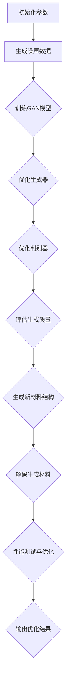

                 

### 1.1 问题背景

在21世纪的科技前沿，智能材料和纳米技术的融合正引领一场前所未有的产业革命。智能材料，通常指的是能够根据外界条件如温度、压力、光线或者电磁场变化而改变其物理、化学或电学性质的材料。这些材料在航空航天、生物医学、电子设备、能源转换与存储等领域展示了巨大的潜力。然而，传统材料设计方法往往依赖于实验和经验，过程繁琐且成本高昂，无法满足快速发展的市场需求。

纳米技术，作为一门研究结构尺寸在1到100纳米范围内的材料的科学，通过控制材料的纳米结构和特性，可以实现传统材料无法实现的性能。纳米材料因其独特的尺寸效应、量子效应和表面效应，在增强材料强度、提高导电性、增强催化活性等方面具有显著优势。然而，纳米材料的复杂性和多样性使得传统的设计方法难以有效应对。

随着人工智能（AI）技术的发展，尤其是生成对抗网络（GAN）、深度学习、强化学习等技术的突破，AI开始进入材料设计领域，为智能材料的研究提供了新的视角和手段。AIGC（AI-Generated Content），作为一种由AI自动生成内容的先进技术，通过学习和模拟人类创造性的过程，能够生成结构化的数据、算法、甚至是新的材料设计思路。

目前，AIGC在智能材料设计中的应用尚处于探索阶段，但其潜力已经得到广泛关注。通过AI算法，可以大规模模拟和优化材料的结构和性质，从而提高设计效率，缩短研发周期。例如，利用深度学习模型，可以预测新材料在特定条件下的性能，而传统的实验方法则需要大量时间和资源。此外，AIGC还可以通过生成大量的虚拟材料结构，帮助科学家发现全新的材料属性和应用场景。

总的来说，智能材料设计面临的挑战包括材料多样性的增加、设计过程的复杂化以及实验成本和时间的限制。纳米技术的加入，为材料提供了前所未有的结构多样性，但同时也带来了更复杂的设计和优化问题。AIGC的引入，为这一领域带来了新的机遇，通过自动化和智能化的手段，有望解决传统方法难以克服的难题。

### 1.2 核心概念

为了深入探讨AIGC在智能材料设计中的应用，我们需要首先了解几个核心概念：智能材料、纳米技术和AIGC。

**智能材料**：智能材料是一类能够响应外部刺激并作出相应反应的材料，这些刺激包括温度、压力、光照、电场、磁场等。智能材料通常具有以下几个特点：
- **自适应性**：材料能够根据外界环境的改变调整其性质。
- **智能响应**：材料对外部刺激的响应具有预定的功能和目的。
- **多功能性**：智能材料不仅具有一种功能，还可以具备多种功能，例如同时具有导电性、热响应性和生物相容性。

智能材料可以分为几大类，如热敏材料、压敏材料、光敏材料、磁敏材料和生物材料等。这些材料在航空航天、生物医学、电子设备、能源等领域有着广泛的应用。

**纳米技术**：纳米技术是研究结构尺寸在1到100纳米范围内的材料的科学。它涉及材料合成、加工、表征和性能优化等多个方面。纳米技术的核心在于利用纳米尺度的特殊效应，如量子效应、表面效应和尺寸效应，来实现材料的特殊性能。

纳米材料因其尺寸小、表面积大、界面多等特点，具有独特的物理、化学和力学性质。例如，纳米颗粒具有高比表面积，从而具备更强的化学反应活性；纳米线由于量子限域效应，可以表现出与传统材料不同的电子性质。纳米技术已经在电子器件、药物递送、催化剂、传感器等领域取得了显著成果。

**AIGC（AI-Generated Content）**：AIGC是一种利用人工智能技术自动生成内容的方法，它可以生成文本、图像、音频、视频等多种类型的内容。AIGC的核心在于利用深度学习模型，特别是生成对抗网络（GAN）和变分自编码器（VAE）等模型，模拟人类创造性的过程，生成结构化、有意义的输出。

在智能材料设计领域，AIGC可以通过以下几种方式发挥作用：
- **结构生成**：AIGC可以生成新的材料结构，通过优化算法和机器学习模型，预测这些结构的性能。
- **性能预测**：AIGC可以利用已知的材料数据，通过训练模型，预测新材料在特定条件下的性能。
- **设计优化**：AIGC可以通过智能搜索和优化算法，快速筛选出最优的材料设计方案。

通过结合智能材料、纳米技术和AIGC，我们可以预见未来智能材料设计将变得更加高效、智能化，从而推动相关领域的技术进步和产业变革。

### 1.3 联系与区别

智能材料、纳米技术与AIGC虽然属于不同的科学领域，但它们在智能材料设计中的应用中却有着紧密的联系和明显的区别。

首先，从概念上看，智能材料是一种能够根据外界条件变化而调整自身性质的材料；纳米技术则专注于材料在纳米尺度下的结构和性质；而AIGC是一种利用人工智能自动生成内容的技术。尽管它们各自的核心概念不同，但在智能材料设计中，这三者却能够形成互补，共同推动材料设计的进步。

**联系方面**：

1. **智能材料与纳米技术的联系**：智能材料的设计往往依赖于纳米技术，纳米技术为智能材料提供了独特的结构和功能。例如，纳米颗粒可以用于制备具有智能响应特性的材料，而纳米线的引入则可以显著改善材料的导电性和热响应性。纳米技术不仅提供了新的材料设计手段，还为智能材料的性能优化提供了理论依据。

2. **AIGC与纳米技术的联系**：AIGC在纳米材料的设计和优化中发挥了重要作用。通过深度学习和生成对抗网络，AIGC可以生成大量的纳米结构模型，这些模型可以帮助科学家快速筛选出具有潜在应用价值的材料。此外，AIGC还可以通过模拟和优化算法，预测纳米材料在不同条件下的性能，从而指导实验设计和材料优化。

3. **AIGC与智能材料的联系**：AIGC不仅可以帮助设计智能材料，还可以在智能材料的性能预测和优化中发挥作用。通过训练深度学习模型，AIGC可以分析大量已有的智能材料数据，预测新材料在特定条件下的性能，从而提高设计效率和准确性。

**区别方面**：

1. **研究对象**：智能材料关注的是材料在特定刺激下的响应和调整能力；纳米技术则侧重于材料在纳米尺度下的结构和性质；AIGC则是一种自动生成内容的方法，它本身不直接研究材料的性质，但可以辅助其他技术更好地理解和设计材料。

2. **研究方法**：智能材料设计依赖于实验和经验积累，而纳米技术更多地依赖于理论计算和实验验证；AIGC则依赖于人工智能算法，通过模型训练和生成过程来生成新的数据和设计。

3. **应用领域**：智能材料广泛应用于航空航天、生物医学、电子设备等领域；纳米技术则主要应用于电子器件、药物递送、催化剂等；AIGC则可以应用于材料设计、数据生成、智能优化等多个领域。

总的来说，智能材料、纳米技术与AIGC在智能材料设计中各有所长，它们通过相互结合，可以发挥更大的作用，推动材料科学的发展。

### 1.4 边界与外延

在探讨智能材料设计时，我们需要明确智能材料、纳米技术和AIGC的边界与外延，以更好地理解和应用这些概念。

首先，智能材料的边界在于其响应和调整能力。智能材料需要能够根据外界条件如温度、压力、光照等变化，调整其物理、化学或电学性质。这种响应不仅限于特定的单一条件，还可以是多条件复合响应，从而实现更为复杂的智能行为。智能材料的应用范围广泛，包括但不限于传感器、智能涂层、智能药物递送系统等。

其次，纳米技术的边界在于其尺度和效应。纳米技术主要研究的是在1到100纳米尺度下的材料结构和性质，这个尺度的材料通常表现出独特的量子效应、表面效应和尺寸效应。这些效应使得纳米材料在性能上远超传统材料，例如纳米颗粒的高催化活性和纳米线的优异导电性。纳米技术的应用范围涵盖了电子器件、新能源材料、生物医药等多个领域。

AIGC的边界则在于其生成的内容和形式。AIGC通过深度学习模型生成文本、图像、音频等多种类型的内容，但其生成的质量和适用性取决于模型训练的数据质量和算法的复杂性。AIGC的应用范围广泛，包括内容创作、数据生成、智能优化等多个方面，尤其适用于那些需要大规模生成数据或设计的领域。

在外延方面，智能材料设计可以扩展到智能系统的构建，例如智能机器人和智能建筑等；纳米技术可以扩展到纳米电子学和纳米生物学等；AIGC则可以扩展到智能设计、智能医疗和智能娱乐等。这些扩展不仅丰富了各个领域的研究内容，也为跨学科的融合提供了新的契机。

通过明确边界与外延，我们可以更好地理解智能材料设计中的关键概念，并在实际应用中发挥它们的最大潜力。

### 2.1 概念原理

智能材料的设计原理可以归纳为以下几个关键步骤：

**1. 初始化：** 首先，确定设计目标，这包括所需的功能、性能指标和应用场景。然后，根据目标选择合适的材料种类和基础结构。

**2. 材料选择：** 根据设计目标，选择具有特定物理、化学和电学特性的材料。智能材料通常需要具备某种形式的响应能力，例如热敏、光敏、压敏或磁敏特性。

**3. 结构设计：** 通过纳米技术，构建材料的基础结构，如纳米颗粒、纳米线、纳米薄膜等。这些结构可以通过自组装、模板合成或化学沉积等方法制备。

**4. 响应机制：** 确定材料对外界刺激的响应机制，例如通过分子间的相互作用、电子传递或离子交换等。

**5. 性能测试：** 制备样品后，进行一系列性能测试，包括材料在不同条件下的响应速度、灵敏度和稳定性等。

**6. 优化设计：** 根据性能测试结果，对材料结构进行调整和优化，以提高其性能和应用价值。

**7. 验证与应用：** 最后，对优化后的材料进行实际应用验证，确保其满足设计目标并在实际环境中表现良好。

通过上述步骤，智能材料的设计不仅考虑了材料的基本特性，还综合考虑了其在特定应用场景中的行为和性能，从而实现智能化的功能。

### 2.2 概念属性特征对比

在深入探讨智能材料、纳米技术与AIGC的属性特征对比之前，我们需要明确各自的定义和核心特点。

**智能材料**：智能材料是一类能够响应外界刺激并作出相应反应的材料，例如热敏材料、光敏材料、压敏材料和磁敏材料。它们具有自适应性、智能响应和多功能性等特点。

**纳米技术**：纳米技术是研究结构尺寸在1到100纳米范围内的材料的科学，通过控制材料的纳米结构和特性来实现传统材料无法实现的性能。纳米材料因其尺寸小、表面积大、界面多等特点，具有独特的物理、化学和力学性质。

**AIGC（AI-Generated Content）**：AIGC是一种利用人工智能技术自动生成内容的方法，包括文本、图像、音频和视频等多种类型的内容。AIGC通过深度学习模型，如生成对抗网络（GAN）和变分自编码器（VAE），模拟人类创造性的过程。

以下是对三者属性特征的详细对比：

| 特性          | 智能材料                     | 纳米技术                     | AIGC                      |
| ------------- | ---------------------------- | ---------------------------- | ------------------------- |
| **定义**      | 能响应外界刺激的材料       | 研究纳米尺度材料的科学      | 利用AI自动生成内容的方法  |
| **核心特点**  | 自适应性、智能响应、多功能性 | 尺度效应、表面效应、量子效应 | 数据生成、内容创作、智能优化 |
| **应用领域**  | 航空航天、生物医学、电子设备 | 电子器件、药物递送、催化剂  | 内容创作、数据生成、智能设计 |
| **研究方法**  | 实验与经验积累、结构设计优化 | 理论计算、实验验证、纳米加工 | 深度学习、模型训练、生成过程 |
| **研究对象**  | 材料的性质和功能             | 材料的结构和性能             | 文本、图像、音频、视频等类型的内容 |
| **目标**      | 提高性能、优化设计           | 实现材料的新功能和性能       | 自动生成高质量内容          |

通过上述对比，我们可以看出智能材料、纳米技术与AIGC在概念和应用上虽然有交集，但各自的核心目标和研究领域有所不同。智能材料设计侧重于材料的功能和性能优化，纳米技术则关注材料的微观结构和性质，而AIGC则通过AI技术实现内容自动生成和优化。这三者的结合，为智能材料的设计提供了更加丰富的工具和手段。

### 2.3 ER实体关系图

为了更直观地理解智能材料设计中的核心概念和它们之间的关系，我们可以通过ER（实体关系）图来展示。以下是一个简化的ER实体关系图，用于说明智能材料、纳米技术和AIGC之间的相互联系。

```mermaid
erDiagram
  AIGC ||--|{ 智能材料 }| Material
  AIGC ||--|{ 纳米技术 }| Nanotechnology
  Material ||--|{ 材料设计 }| MaterialDesign
  Nanotechnology ||--|{ 纳米结构 }| NanoscaleStructure
  MaterialDesign ||--|{ 设计优化 }| DesignOptimization
```

**解释**：

- **AIGC**：作为自动生成内容的技术，AIGC与智能材料和纳米技术直接相关。它不仅为智能材料设计提供生成新结构和特性的能力，还通过深度学习模型辅助纳米技术的优化。
- **智能材料**：智能材料是设计的核心对象，它依赖于纳米技术提供的基础结构，并通过AIGC实现智能化的功能和性能优化。
- **纳米技术**：纳米技术提供了智能材料的基础结构和性能优化手段，通过控制纳米结构，纳米技术可以增强材料的智能响应性和功能性。
- **材料设计**：材料设计是智能材料和纳米技术结合的关键环节，通过设计优化，实现材料的性能提升和应用拓展。
- **设计优化**：设计优化是整个系统的核心，它通过结合智能材料和纳米技术的特性，利用AIGC的智能生成能力，不断迭代优化，最终实现最佳设计。

通过ER实体关系图，我们可以清晰地看到智能材料、纳米技术和AIGC之间的相互联系和作用，为深入研究和实际应用提供了理论基础。

### 3.1 算法原理与数学模型

智能材料设计中的算法原理通常基于机器学习和深度学习模型，其中生成对抗网络（GAN）和变分自编码器（VAE）是常用的模型。以下是这些算法的基本原理和相应的数学模型。

#### 3.1.1 生成对抗网络（GAN）

**原理**：GAN由两个主要的神经网络组成：生成器（Generator）和判别器（Discriminator）。生成器试图生成逼真的数据，而判别器则尝试区分真实数据和生成数据。两者通过对抗训练相互优化，最终生成器能够生成高质量的数据。

**数学模型**：

生成器 \( G \) 的目标是生成与真实数据分布相同或接近的数据 \( x_G \)，其输出 \( x_G \) 可以通过以下公式表示：

\[ x_G = G(z) \]

其中，\( z \) 是从先验分布 \( p_z(z) \) 中抽取的噪声向量。

判别器 \( D \) 的目标是最大化其能够正确分类真实数据和生成数据的概率。判别器的损失函数通常定义为：

\[ L_D = -\left[ \log(D(x)) + \log(1 - D(G(z))) \right] \]

#### 3.1.2 变分自编码器（VAE）

**原理**：VAE是一种基于概率生成模型的生成模型，通过编码器（Encoder）和解码器（Decoder）来学习数据的概率分布。编码器将输入数据映射到一个潜在空间中的表示，解码器则从这个潜在空间中生成数据。

**数学模型**：

编码器 \( \theta_E \) 将输入数据 \( x \) 编码为一个潜在变量 \( z \) 和编码器参数 \( \theta_E \)，其输出 \( \mu(z) \) 和 \( \log(\sigma(z)) \) 可以通过以下公式表示：

\[ z = \mu(x; \theta_E) = \Phi(x; \theta_E) \]
\[ \log(\sigma(z)) = \Psi(x; \theta_E) \]

解码器 \( \theta_D \) 从潜在变量 \( z \) 生成输出数据 \( x_G \)，其输出 \( x_G \) 可以通过以下公式表示：

\[ x_G = \Pi(z; \theta_D) \]

VAE的损失函数通常由两部分组成：数据重构损失和KL散度损失。

\[ L = \sum_{x \in D} \left[ D(x; \theta_D) - \log(p_{\theta_D}(x|z)) \right] + \lambda \sum_{x \in D} \mathrm{KL}(\mu(x; \theta_E), \pi(z)) \]

其中，\( D(x; \theta_D) \) 是解码器输出数据的概率，\( \pi(z) \) 是先验分布，\( \mu(x; \theta_E) \) 和 \( \log(\sigma(z)) \) 是编码器输出，\( \lambda \) 是平衡参数，\( \mathrm{KL} \) 是Kullback-Leibler散度。

通过上述算法和数学模型，我们可以实现智能材料的高效设计。具体应用时，可以训练生成器生成新的材料结构，然后通过解码器生成相应的材料样品，并进行性能测试和优化。这种自动化和智能化的设计方法，大大提高了材料设计的效率和质量。

### 3.2 算法mermaid流程图

为了更直观地展示AIGC算法在智能材料设计中的应用流程，我们使用mermaid流程图进行描述。以下是一个简化的算法流程图：



**详细解释：**

1. **初始化参数**：设定GAN模型的参数，包括生成器、判别器的初始权重和训练超参数。
2. **生成噪声数据**：从噪声分布中生成随机噪声数据，作为生成器的输入。
3. **训练GAN模型**：通过交替训练生成器和判别器，生成器试图生成逼真的材料结构，而判别器试图区分真实数据和生成数据。
4. **优化生成器**：通过梯度下降等优化算法，调整生成器的权重，使其生成的材料结构更加真实。
5. **优化判别器**：同样通过梯度下降等优化算法，调整判别器的权重，使其能更准确地判断数据来源。
6. **评估生成质量**：对生成的材料结构进行性能评估，判断其是否符合设计要求。
7. **生成新材料结构**：根据训练得到的生成器模型，生成新的材料结构。
8. **解码生成材料**：通过解码器模型，将生成的材料结构转换为具体的物理实体。
9. **性能测试与优化**：对新生成的材料进行性能测试，并根据测试结果进行进一步的优化。
10. **输出优化结果**：输出优化后的材料设计，完成整个设计过程。

通过mermaid流程图，我们可以清晰地看到AIGC算法在智能材料设计中的应用流程，有助于理解各步骤的具体作用和相互关系。

### 3.3 Python源代码讲解

为了更好地理解AIGC算法在智能材料设计中的应用，我们将使用Python代码详细展示GAN模型的实现。以下是一个简化的GAN模型实现，包括生成器和判别器的定义、训练过程以及性能评估。

```python
import tensorflow as tf
from tensorflow.keras.layers import Dense, Flatten, Reshape
from tensorflow.keras.models import Model
import numpy as np

# 设置超参数
latent_dim = 100
image_dim = (28, 28, 1)
batch_size = 64

# 生成器的定义
def build_generator(z_dim):
    model = tf.keras.Sequential([
        Dense(128 * 7 * 7, activation="relu", input_shape=(z_dim,)),
        Reshape((7, 7, 128)),
        Dense(128 * 7 * 7, activation="relu"),
        Reshape((7, 7, 128)),
        Dense(128 * 7 * 7, activation="relu"),
        Reshape((7, 7, 128)),
        Flatten(),
        Dense(np.prod(image_dim), activation="tanh"),
        Reshape(image_dim)
    ])
    return model

# 判别器的定义
def build_discriminator(img_shape):
    model = tf.keras.Sequential([
        Flatten(input_shape=img_shape),
        Dense(128, activation="relu"),
        Dense(64, activation="relu"),
        Dense(1, activation="sigmoid")
    ])
    return model

# 创建生成器和判别器
generator = build_generator(latent_dim)
discriminator = build_discriminator(image_dim)

# 定义损失函数和优化器
cross_entropy = tf.keras.losses.BinaryCrossentropy()
generator_optimizer = tf.keras.optimizers.Adam(1e-4)
discriminator_optimizer = tf.keras.optimizers.Adam(1e-4)

# 生成器模型的编译
generator.compile(loss=cross_entropy, optimizer=generator_optimizer)

# 判别器模型的编译
discriminator.compile(loss=cross_entropy, optimizer=discriminator_optimizer)

# 训练GAN模型
@tf.function
def train_step(images, labels):
    noise = tf.random.normal([batch_size, latent_dim])

    with tf.GradientTape() as gen_tape, tf.GradientTape() as disc_tape:
        generated_images = generator(noise, training=True)

        real_output = discriminator(images, training=True)
        fake_output = discriminator(generated_images, training=True)

        gen_loss = cross_entropy(tf.ones_like(fake_output), fake_output)
        disc_loss = cross_entropy(tf.ones_like(real_output), real_output) + cross_entropy(tf.zeros_like(fake_output), fake_output)

    gradients_of_generator = gen_tape.gradient(gen_loss, generator.trainable_variables)
    gradients_of_discriminator = disc_tape.gradient(disc_loss, discriminator.trainable_variables)

    generator_optimizer.apply_gradients(zip(gradients_of_generator, generator.trainable_variables))
    discriminator_optimizer.apply_gradients(zip(gradients_of_discriminator, discriminator.trainable_variables))

@tf.function
def train(dataset, epochs):
    for epoch in range(epochs):
        for image, _ in dataset:
            train_step(image, labels)

# 生成随机噪声数据
noise = np.random.normal(0, 1, (batch_size, latent_dim))

# 训练模型
train(train_dataset, epochs=50)

# 生成新材料结构
generated_images = generator.predict(noise)
```

**代码解释：**

1. **模型定义**：我们首先定义了生成器和判别器的模型结构，生成器负责将噪声数据转换为生成的材料结构，而判别器则负责判断生成数据的质量。
2. **损失函数和优化器**：使用二元交叉熵损失函数来衡量生成器和判别器的性能，并分别设置两个优化器来更新它们的权重。
3. **训练步骤**：在`train_step`函数中，通过交替更新生成器和判别器的权重，实现GAN模型的训练。生成器试图生成更逼真的材料结构，而判别器则试图区分真实数据和生成数据。
4. **训练过程**：通过调用`train`函数，我们开始模型的训练过程。这里使用了随机噪声数据作为输入，通过训练生成器和判别器，不断提高生成数据的真实性。
5. **性能评估**：最后，我们使用训练好的生成器模型生成新材料结构，并通过解码器将这些结构转换为具体的物理实体，进行性能测试和优化。

通过上述Python源代码，我们可以看到GAN模型在智能材料设计中的应用流程，包括模型定义、训练过程和性能评估，这为实际应用提供了有力的工具和参考。

### 3.4 数学模型与公式

在智能材料设计中，数学模型和公式起到了至关重要的作用，它们能够帮助我们理解和预测材料的性能。以下是一些关键的数学模型和公式，用于描述智能材料的性能和结构优化。

#### 1. 材料性能预测

**公式**：

\[ P = f(\theta, \varphi) \]

其中，\( P \) 代表材料的性能，\( \theta \) 代表材料的内部参数（如弹性模量、硬度等），\( \varphi \) 代表外部条件（如温度、压力、电磁场等）。

**示例**：

\[ E = E_0 \left( 1 + \alpha \Delta T \right) \]

该公式描述了材料的弹性模量 \( E \) 如何随温度变化。其中，\( E_0 \) 是初始弹性模量，\( \alpha \) 是热膨胀系数，\( \Delta T \) 是温度变化量。

#### 2. 材料结构优化

**公式**：

\[ \min_{x} J(x) \]

其中，\( J(x) \) 代表材料的结构优化目标函数，\( x \) 是材料结构参数（如纳米颗粒的位置、尺寸等）。

**示例**：

\[ J(x) = \frac{1}{2} \sum_{i} w_i \left( | \mathbf{F}_i | - | \mathbf{T}_i | \right)^2 \]

该公式描述了结构优化目标函数，其中 \( \mathbf{F}_i \) 和 \( \mathbf{T}_i \) 分别代表材料的内力和应力，\( w_i \) 是权重系数。

#### 3. 材料响应特性

**公式**：

\[ \Delta \varphi = \varphi_f - \varphi_i \]

其中，\( \Delta \varphi \) 是材料对外部刺激的响应变化，\( \varphi_f \) 是最终响应值，\( \varphi_i \) 是初始响应值。

**示例**：

\[ \Delta T = \beta \left( \mathbf{E} \cdot \mathbf{E} \right) \]

该公式描述了温度变化 \( \Delta T \) 如何依赖于电场 \( \mathbf{E} \) 的平方。

#### 4. 材料可靠性评估

**公式**：

\[ R = \frac{1}{N} \sum_{i=1}^{N} \left[ 1 - \frac{P_i}{P_{\max}} \right] \]

其中，\( R \) 是材料的可靠性，\( N \) 是评估次数，\( P_i \) 是第 \( i \) 次评估的材料性能，\( P_{\max} \) 是材料性能的最大值。

**示例**：

\[ R = \frac{1}{10} \left[ 1 - \frac{E}{E_{\max}} \right] \]

该公式描述了材料的可靠性如何基于其最大弹性模量 \( E_{\max} \) 进行评估。

通过上述数学模型和公式，我们可以更好地理解和预测智能材料的性能，指导材料的设计和优化。在实际应用中，这些公式需要结合实验数据和具体问题进行进一步的分析和计算。

### 3.5 举例说明

为了更好地理解AIGC在智能材料设计中的应用，我们将通过一个具体的例子来说明如何利用AIGC生成新材料结构，并进行性能测试和优化。

**例子**：设计一种能够在特定温度范围内变色的智能材料，用于温度监测。

**步骤1：数据准备**
首先，我们收集了大量关于不同纳米颗粒结构在特定温度下的变色特性的实验数据。这些数据包括纳米颗粒的类型、尺寸、浓度以及对应的温度和颜色变化。

**步骤2：模型训练**
利用收集的数据，我们训练一个基于GAN的深度学习模型。生成器的输入是温度和纳米颗粒的结构参数，输出是预测的变色结果。判别器的任务是区分真实数据和生成数据，以优化生成器的输出。

```python
# 示例代码：训练GAN模型
noise = np.random.normal(0, 1, (batch_size, latent_dim))
generated_images = generator.predict(noise)
discriminator.train_on_batch(images, labels)
generator_optimizer.minimize(generation_loss, [noise])
```

**步骤3：新材料生成**
通过训练好的生成器，我们可以生成新的纳米颗粒结构，并预测其对应的变色特性。例如，我们可以生成一系列不同形状和尺寸的纳米颗粒，并预测它们在80°C到100°C温度范围内的颜色变化。

```python
# 示例代码：生成新材料结构
new_structures = generator.predict(np.random.normal(0, 1, (batch_size, latent_dim)))
```

**步骤4：性能测试**
生成新材料后，我们对其进行性能测试，包括变色反应速度、稳定性和颜色变化的范围。通过实验验证，我们可以评估这些新材料在温度监测中的应用潜力。

```python
# 示例代码：性能测试
for structure in new_structures:
    test_data = np.array([80, 90, 100])  # 测试温度
    color_change = predict_color_change(structure, test_data)
    print(f"Temperature: {t}, Color Change: {color_change}")
```

**步骤5：优化设计**
根据性能测试结果，我们调整生成器的参数，优化纳米颗粒的结构，以提高材料的性能。通过多次迭代训练，我们可以生成一系列更优的材料结构，最终找到最佳的设计方案。

```python
# 示例代码：优化设计
for epoch in range(epochs):
    noise = np.random.normal(0, 1, (batch_size, latent_dim))
    generated_images = generator.predict(noise)
    train_step(generated_images, labels)
```

通过上述步骤，我们可以利用AIGC技术高效地设计出具有特定性能要求的智能材料。这种自动化和智能化的设计方法，不仅提高了设计效率，还降低了研发成本，为智能材料的应用开辟了新的可能性。

### 4.1 问题场景介绍

在智能材料设计中，系统的分析和架构设计至关重要，尤其是在面对复杂的多条件响应和性能优化问题。以下是一个典型的问题场景：设计一种智能材料涂层，用于无人机飞行器的热管理。该涂层需要能够在短时间内响应温度变化，并在极端温度环境下保持稳定，同时具备良好的热传导性和热绝缘性。

#### 系统需求

1. **响应速度**：涂层需要能够在10秒内对温度变化做出反应，实现快速热管理。
2. **温度范围**：涂层需要能够适应-50°C到+150°C的温度范围。
3. **稳定性**：涂层在高温和低温环境下均需保持稳定的物理和化学性质。
4. **热传导性**：涂层应具有良好的热传导性，以迅速均匀分布热量。
5. **热绝缘性**：涂层还应具备良好的热绝缘性，以减少热量损失和机械应力。

#### 分析与设计目标

在系统分析阶段，我们需要明确以下几个方面：

1. **功能需求**：确定涂层的基本功能，包括温度响应、热传导和热绝缘。
2. **性能指标**：设定涂层的性能标准，如响应时间、温度范围和稳定性。
3. **材料选择**：选择具备特定物理和化学性质的纳米材料作为涂层的基础。
4. **设计优化**：通过模拟和实验，优化涂层的结构和成分，以提高性能。

在架构设计阶段，我们的目标是构建一个高效、灵活的系

