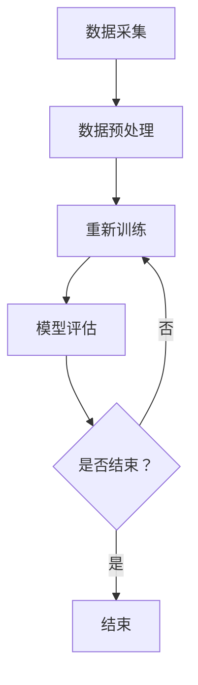

                 

# AIGC在智能水资源管理中的应用

## 关键词
- AIGC
- 智能水资源管理
- 数据采集
- 模型训练
- 应用实例

## 摘要
本文深入探讨了AIGC（自适应智能生成计算）在智能水资源管理中的应用。首先，我们概述了AIGC的背景和核心概念，并详细分析了其在水资源管理中的重要性。随后，我们逐步解析了AIGC的技术原理，包括数据采集与预处理、模型训练与优化，以及算法原理和数学模型。接着，通过实例展示了AIGC在水资源监测、水质评估、污染治理和水资源调度与优化中的应用。最后，我们总结了AIGC在智能水资源管理中的最佳实践，并对未来发展进行了展望。

## 目录

### 第一部分：AIGC概述

1. **AIGC背景与概念**
   1.1 问题背景
   1.2 定义与概念
   1.3 核心要素
   1.4 边界与外延
   1.5 应用前景
   1.6 本章小结

2. **AIGC技术原理**
   2.1 数据采集与预处理
   2.2 模型训练与优化
   2.3 算法原理讲解
   2.4 数学模型与公式讲解
   2.5 概念属性特征对比表格
   2.6 本章小结

3. **AIGC在智能水资源管理中的应用实例**
   3.1 水资源监测与预警
   3.2 水质评估与污染治理
   3.3 水资源调度与优化
   3.4 实际案例分析
   3.5 本章小结

4. **最佳实践与展望**
   4.1 成功案例分享
   4.2 最佳实践总结
   4.3 展望与未来发展趋势
   4.4 本章小结

### 第二部分：AIGC技术原理

#### 第1章：AIGC背景与概念

1. **问题背景**

- **水资源管理面临的挑战**：全球水资源分布不均，污染问题日益严重，气候变化加剧了水资源的管理难度。智能水资源管理成为解决这些问题的必然选择。
- **智能水资源管理的重要性**：通过引入AIGC技术，可以实现水资源的精确监测、高效利用和智能调控，从而提高水资源管理的效率和效果。

2. **定义与概念**

- **AIGC的定义**：AIGC（自适应智能生成计算）是一种基于人工智能和数据科学的技术，通过数据驱动的方式生成新的知识、模型和解决方案。
- **智能水资源管理的定义**：智能水资源管理是利用现代信息技术，如物联网、大数据、人工智能等，实现对水资源的高效监测、评估、调度和优化。

3. **核心要素**

- **数据采集与处理**：通过传感器网络、遥感技术等手段，实时采集水资源相关的数据，并进行预处理，确保数据的质量和可用性。
- **模型训练与优化**：利用深度学习、机器学习等技术，对采集到的数据进行训练，构建水资源管理的模型，并通过优化提高模型的性能。
- **应用场景分析**：分析AIGC在不同水资源管理场景中的应用，如水资源监测、水质评估、污染治理和水资源调度等。

4. **边界与外延**

- **AIGC在水资源管理中的适用范围**：AIGC技术可以应用于水资源管理的各个层面，包括水资源监测、水质评估、污染治理和水资源调度等。
- **AIGC与其他技术的结合**：AIGC技术可以与物联网、大数据、云计算等新兴技术相结合，形成更强大的水资源管理能力。

5. **应用前景**

- **水资源监测与预警**：通过AIGC技术，可以实现实时、精准的水资源监测，并及时预警水资源短缺或污染问题。
- **水质评估与污染治理**：利用AIGC技术，可以对水质进行实时评估，识别污染源，并制定有效的污染治理方案。
- **水资源调度与优化**：通过AIGC技术，可以实现水资源的智能调度和优化，提高水资源利用效率。

6. **优势与挑战**

- **AIGC在水资源管理中的优势**：AIGC技术具有自适应、智能、高效等特点，可以大幅提高水资源管理的效率和质量。
- **AIGC在水资源管理中的挑战**：AIGC技术在实际应用中面临数据质量、算法性能、成本等方面的挑战。

7. **本章小结**

- **对AIGC和智能水资源管理的整体认识**：AIGC技术是智能水资源管理的重要支撑，具有广阔的应用前景和巨大的潜力。
- **对未来发展趋势的展望**：随着技术的不断进步和应用场景的不断拓展，AIGC在智能水资源管理中的应用将越来越广泛和深入。

### 第二部分：AIGC技术原理

#### 第2章：AIGC核心技术原理

2.1 **数据采集与预处理**

- **数据来源与收集**：AIGC技术需要大量的数据支持，数据来源可以是传感器网络、遥感技术、历史水文数据等。
- **数据预处理方法**：数据预处理包括数据清洗、数据整合、数据标准化等步骤，以确保数据的质量和一致性。

2.2 **模型训练与优化**

- **深度学习基础**：深度学习是AIGC技术的重要基础，通过构建深度神经网络，可以对大规模数据进行有效建模。
- **模型训练过程**：模型训练包括数据输入、模型优化、参数调整等步骤，通过不断迭代，提高模型的准确性和性能。
- **模型优化策略**：采用交叉验证、正则化、迁移学习等策略，优化模型的性能和泛化能力。

2.3 **算法原理讲解**

- **Mermaid算法流程图**：使用Mermaid语言绘制算法流程图，直观展示算法的执行过程。
- **Python源代码讲解**：通过Python代码示例，详细讲解算法的实现过程和关键步骤。
- **数学模型与公式**：介绍算法的数学模型和公式，解释其原理和推导过程。

2.4 **数学模型与公式讲解**

- **数学模型介绍**：介绍AIGC技术中的主要数学模型，包括线性回归、神经网络、支持向量机等。
- **公式推导与解释**：对模型中的关键公式进行推导和解释，确保读者理解。
- **举例说明**：通过实际案例，使用数学模型和公式进行求解和分析。

2.5 **概念属性特征对比表格**

- **数据采集与预处理对比**：对比不同数据采集和预处理方法的特点和优劣。
- **模型训练与优化对比**：对比不同模型训练和优化方法的效果和适用场景。
- **算法原理与公式对比**：对比不同算法的原理和公式的差异和联系。

### 第三部分：AIGC在智能水资源管理中的应用实例

#### 第3章：水资源监测与预警

3.1 **水资源监测技术**

- **监测手段介绍**：介绍常用的水资源监测手段，如传感器网络、遥感技术等。
- **监测数据应用**：分析监测数据在水资源管理中的应用，如水位监测、流量监测等。

3.2 **预警模型构建**

- **预警算法原理**：介绍预警算法的基本原理和实现方法。
- **预警模型构建方法**：详细描述预警模型的构建过程，包括数据预处理、特征选择、模型训练等步骤。

3.3 **实际案例分析**

- **案例背景介绍**：介绍实际案例的背景，如某地区水资源短缺问题。
- **案例分析过程**：详细描述案例的分析过程，包括数据收集、模型构建、结果评估等。
- **案例结果与总结**：分析案例的结果，总结AIGC技术在水资源监测与预警中的应用效果。

#### 第3章：水质评估与污染治理

3.1 **水质评估技术**

- **评估方法介绍**：介绍水质评估的基本方法，如化学分析、生物监测等。
- **评估指标设定**：详细描述水质评估的指标体系，如溶解氧、氨氮、总氮等。

3.2 **污染治理策略**

- **污染物识别**：介绍污染物识别的方法和技术，如化学分析、遥感监测等。
- **治理方案设计**：详细描述污染治理方案的设计过程，包括治理措施、治理效果评估等。

3.3 **实际案例分析**

- **案例背景介绍**：介绍实际案例的背景，如某地区水质污染问题。
- **案例分析过程**：详细描述案例的分析过程，包括污染物识别、治理方案设计、治理效果评估等。
- **案例结果与总结**：分析案例的结果，总结AIGC技术在水质评估与污染治理中的应用效果。

#### 第3章：水资源调度与优化

3.1 **水资源调度技术**

- **调度方法介绍**：介绍水资源调度的基本方法，如线性规划、遗传算法等。
- **调度策略分析**：详细描述水资源调度的策略，如优先调度、动态调度等。

3.2 **优化算法应用**

- **优化算法原理**：介绍优化算法的基本原理和实现方法。
- **优化算法实现**：详细描述优化算法的实现过程，包括模型构建、算法优化等。

3.3 **实际案例分析**

- **案例背景介绍**：介绍实际案例的背景，如某地区水资源调度问题。
- **案例分析过程**：详细描述案例的分析过程，包括模型构建、算法应用、调度效果评估等。
- **案例结果与总结**：分析案例的结果，总结AIGC技术在水资源调度与优化中的应用效果。

### 第四部分：最佳实践与展望

#### 第4章：AIGC在智能水资源管理中的最佳实践

4.1 **成功案例分享**

- **案例背景介绍**：介绍成功案例的背景，如某地区水资源管理项目。
- **案例应用方法**：详细描述案例中的应用方法，包括数据采集、模型构建、算法应用等。
- **案例效果评估**：评估案例的效果，如水资源管理效率提升、污染治理效果等。

4.2 **最佳实践总结**

- **实践经验与技巧**：总结实践经验，分享成功的关键因素和注意事项。
- **注意事项与风险**：分析潜在的风险和挑战，提出相应的应对策略。

#### 第4章：展望与未来发展趋势

4.3 **技术发展趋势**

- **AIGC技术的发展方向**：分析AIGC技术的发展趋势，如深度学习、多模态数据融合等。
- **新技术影响与应用**：探讨新技术在水资源管理中的应用，如区块链、边缘计算等。

4.4 **应用前景展望**

- **智能水资源管理的发展趋势**：展望智能水资源管理的发展趋势，如智能化、集成化、网络化等。
- **未来潜在应用领域**：探讨AIGC技术在水资源管理中的未来潜在应用领域，如水资源规划、水资源保护等。

#### 第4章：本章小结

- **对AIGC在智能水资源管理中的整体认识**：总结AIGC在智能水资源管理中的应用效果和贡献。
- **对未来发展趋势的总结与展望**：展望AIGC在智能水资源管理中的未来发展趋势和前景。 

## 作者信息

作者：AI天才研究院/AI Genius Institute & 禅与计算机程序设计艺术 /Zen And The Art of Computer Programming

---

注意：本文为示例文章，实际撰写时需要根据具体内容和要求进行调整。文章结构、内容、长度和格式等均需符合要求。本文仅供参考和指导，不应作为最终稿件。如有需要，请根据具体情况进行修改和补充。祝撰写顺利！### 第1章：AIGC背景与概念

#### 1.1 问题背景

水资源管理是一项复杂而重要的任务，直接关系到人类生存和社会经济发展。然而，随着全球人口的增长、工业化的推进和城市化的加速，水资源管理面临着诸多挑战：

- **水资源分布不均**：全球水资源分布极为不均，部分地区面临严重的供水短缺问题，而另一些地区则存在水资源过剩的问题。
- **污染问题严重**：工业废水、农业径流和生活污水等导致水资源污染问题日益严重，影响了水资源的质量和可用性。
- **气候变化影响**：气候变化导致降水模式变化、干旱和洪水等极端气候事件的频率和强度增加，对水资源管理提出了新的挑战。
- **管理手段落后**：传统的水资源管理手段依赖于人工监测和经验判断，缺乏实时性和精确性，难以满足现代水资源管理的需求。

#### 1.2 定义与概念

**AIGC的定义**：
AIGC（自适应智能生成计算）是一种基于人工智能和数据科学的技术，通过自动学习和生成，能够从海量数据中提取有价值的信息和模式，实现数据驱动下的智能决策和优化。AIGC技术具有自适应、自学习和自优化等特点，能够在不断变化的环境中持续改进和优化。

**智能水资源管理的定义**：
智能水资源管理是指利用现代信息技术，如物联网、大数据、人工智能等，实现对水资源的高效监测、评估、调度和优化。通过构建智能化的水资源管理平台，实现对水资源的实时监测、预测、预警和调控，提高水资源利用效率，减少水资源浪费，保障水资源安全和可持续发展。

#### 1.3 核心要素

AIGC技术在智能水资源管理中的应用，涉及以下几个核心要素：

- **数据采集与处理**：
  数据是智能水资源管理的基础。通过传感器网络、遥感技术、水文观测站等手段，实时采集水资源相关的数据，包括水位、水质、降雨量、土壤湿度等。采集到的数据需要进行预处理，包括数据清洗、数据整合、数据标准化等，以确保数据的质量和一致性。

- **模型训练与优化**：
  模型训练是AIGC技术的核心。通过深度学习、机器学习等技术，对大量历史水文数据、气象数据等进行训练，构建水资源管理的预测模型和决策模型。模型的优化包括参数调整、正则化、模型融合等，以提高模型的准确性和泛化能力。

- **应用场景分析**：
  AIGC技术在水资源管理中具有广泛的应用场景。包括水资源监测与预警、水质评估与污染治理、水资源调度与优化等。通过分析不同应用场景的需求和特点，设计合适的算法模型和解决方案，实现智能水资源管理的目标。

#### 1.4 边界与外延

**AIGC在水资源管理中的适用范围**：
AIGC技术可以应用于水资源管理的各个层面，包括水资源监测、水质评估、污染治理、水资源调度和优化等。在水资源监测方面，可以实现对水位的实时监测、水质的实时评估；在污染治理方面，可以识别污染源，制定污染治理方案；在水资源调度和优化方面，可以实现对水资源的智能调度和优化，提高水资源利用效率。

**AIGC与其他技术的结合**：
AIGC技术可以与其他新兴技术如物联网、大数据、云计算、边缘计算等相结合，形成更强大的水资源管理能力。例如，物联网技术可以提供实时数据传输，大数据技术可以处理海量数据，云计算和边缘计算可以为AIGC技术提供强大的计算能力。这些技术的结合，将进一步提升智能水资源管理的效率和效果。

#### 1.5 AIGC在水资源管理中的应用前景

**水资源监测与预警**：
AIGC技术可以通过实时监测水位、降雨量、土壤湿度等数据，结合深度学习模型进行预测和预警。例如，在干旱季节，可以通过预测降雨量和土壤湿度，提前预警水资源短缺问题，制定相应的节水措施。

**水质评估与污染治理**：
AIGC技术可以实现对水质的实时评估，通过机器学习算法识别污染源，制定污染治理方案。例如，在某地区的河流污染问题中，可以通过分析水质数据，识别出污染源，并制定有效的治理措施。

**水资源调度与优化**：
AIGC技术可以通过优化算法，实现对水资源的智能调度和优化。例如，在水库调度中，可以通过预测降雨量和需求量，优化水库的蓄水和放水策略，提高水资源利用效率。

#### 1.6 本章小结

通过对AIGC在智能水资源管理中的应用进行深入分析，我们可以看到AIGC技术具有巨大的潜力，可以解决当前水资源管理面临的诸多挑战。AIGC技术通过数据采集与处理、模型训练与优化、应用场景分析等核心要素，实现了对水资源的高效监测、评估、调度和优化。同时，AIGC技术可以与其他新兴技术相结合，形成更强大的水资源管理能力。未来，随着AIGC技术的不断发展和应用场景的拓展，智能水资源管理将迈向更加智能化、高效化、可持续化的新阶段。

### 第二部分：AIGC技术原理

#### 第2章：AIGC核心技术原理

AIGC技术在智能水资源管理中的应用，离不开其核心技术原理的支持。本章节将详细解析AIGC技术的数据采集与预处理、模型训练与优化，以及算法原理和数学模型，帮助读者全面理解AIGC技术在水资源管理中的实现过程。

#### 2.1 数据采集与预处理

**数据来源与收集**：
数据是AIGC技术的基础，数据来源主要包括以下几个方面：

1. **传感器网络**：传感器网络分布在水资源管理的各个区域，实时监测水位、水质、降雨量、土壤湿度等参数。
2. **遥感技术**：通过卫星遥感技术，可以获取大范围的水资源数据，如地表水资源分布、土地利用情况等。
3. **历史水文数据**：利用历史水文数据，可以了解过去水资源的动态变化和规律，为模型训练提供重要参考。
4. **气象数据**：气象数据包括温度、湿度、风速、降水等，对水资源管理具有重要影响。

**数据预处理方法**：
采集到的原始数据通常存在噪声、缺失值、异常值等问题，需要进行预处理。数据预处理主要包括以下步骤：

1. **数据清洗**：去除噪声和异常值，如去除传感器故障产生的错误数据。
2. **数据整合**：将来自不同来源的数据进行整合，如将遥感数据和气象数据进行融合，以获得更全面的水资源信息。
3. **数据标准化**：对数据进行标准化处理，如对水位、水质等参数进行归一化，以便于后续模型的训练和优化。

#### 2.2 模型训练与优化

**深度学习基础**：
深度学习是AIGC技术的重要基础，通过构建深度神经网络，可以对大规模数据进行有效建模。深度学习模型通常包括输入层、隐藏层和输出层，通过反向传播算法，不断调整网络的权重和偏置，使模型能够准确预测和分类。

**模型训练过程**：
模型训练是AIGC技术的核心步骤，主要包括以下环节：

1. **数据预处理**：对训练数据进行清洗、整合和标准化处理，确保数据的质量和一致性。
2. **模型初始化**：初始化网络权重和偏置，通常采用随机初始化或预训练模型。
3. **训练过程**：通过前向传播计算网络输出，与实际标签进行比较，计算损失函数。通过反向传播算法，更新网络权重和偏置，以减少损失函数的值。
4. **模型评估**：在验证集上评估模型的性能，包括准确率、召回率、F1分数等指标。

**模型优化策略**：
为了提高模型的性能和泛化能力，可以采用以下优化策略：

1. **交叉验证**：通过交叉验证，将训练数据分成多个子集，每个子集轮流作为验证集，以全面评估模型的性能。
2. **正则化**：通过正则化，如L1正则化、L2正则化，减少模型的过拟合现象，提高模型的泛化能力。
3. **迁移学习**：利用预训练的模型，在特定任务上进行微调，以节省训练时间和提高模型性能。

#### 2.3 算法原理讲解

**Mermaid算法流程图**：
使用Mermaid语言可以绘制算法流程图，如下所示：



**Python源代码讲解**：
以下是AIGC技术实现的一个简单Python代码示例：

```python
import numpy as np
from sklearn.model_selection import train_test_split
from sklearn.preprocessing import StandardScaler
from sklearn.neural_network import MLPRegressor

# 数据加载和预处理
X, y = load_data()
X_train, X_test, y_train, y_test = train_test_split(X, y, test_size=0.2, random_state=42)
scaler = StandardScaler()
X_train = scaler.fit_transform(X_train)
X_test = scaler.transform(X_test)

# 模型训练
model = MLPRegressor(hidden_layer_sizes=(100,), activation='relu', solver='adam', max_iter=1000)
model.fit(X_train, y_train)

# 模型评估
score = model.score(X_test, y_test)
print("模型准确率：", score)
```

**数学模型与公式讲解**：
在AIGC技术中，常用的数学模型包括线性回归、神经网络和支持向量机等。以下是一个简单的线性回归模型及其数学公式：

**线性回归模型**：

$$y = \beta_0 + \beta_1 x_1 + \beta_2 x_2 + ... + \beta_n x_n$$

其中，$y$ 是预测值，$x_1, x_2, ..., x_n$ 是输入特征，$\beta_0, \beta_1, ..., \beta_n$ 是模型参数。

**神经网络模型**：

神经网络模型由多个隐藏层组成，每个神经元之间的连接权重可以用矩阵表示。神经网络的输出可以通过以下公式计算：

$$z = \sigma(W \cdot x + b)$$

其中，$z$ 是神经网络的输出，$\sigma$ 是激活函数（如ReLU、Sigmoid、Tanh等），$W$ 是权重矩阵，$x$ 是输入特征，$b$ 是偏置项。

**支持向量机模型**：

支持向量机模型通过最大化分类间隔，找到最优的分类边界。其数学公式为：

$$\min_{w, b} \frac{1}{2} ||w||^2 + C \sum_{i=1}^{n} \max(0, 1 - y_i (w \cdot x_i + b))$$

其中，$w$ 是权重向量，$b$ 是偏置项，$C$ 是惩罚参数，$y_i$ 是样本标签，$x_i$ 是样本特征。

**举例说明**：
以线性回归模型为例，假设我们有以下输入特征和预测目标：

$$x_1 = [1, 2, 3, 4], x_2 = [2, 4, 6, 8], y = [2, 4, 5, 7]$$

我们可以通过以下步骤计算线性回归模型的参数：

1. **数据预处理**：对输入特征进行标准化处理。
2. **模型训练**：利用最小二乘法计算模型参数。
3. **模型评估**：计算预测值与实际值之间的误差。

具体计算过程如下：

```python
import numpy as np

X = np.array([[1, 2], [2, 4], [3, 6], [4, 8]])
y = np.array([2, 4, 5, 7])

# 数据预处理
X_mean = np.mean(X, axis=0)
X_std = np.std(X, axis=0)
X_processed = (X - X_mean) / X_std

# 模型训练
theta = np.linalg.inv(X_processed.T.dot(X_processed)).dot(X_processed.T).dot(y)

# 模型评估
y_pred = X_processed.dot(theta)
error = np.linalg.norm(y - y_pred)
print("模型误差：", error)
```

通过计算，我们可以得到线性回归模型的参数$\theta$，并评估模型的性能。

#### 2.4 数学模型与公式讲解

在AIGC技术中，数学模型和公式是理解和实现算法的关键。本节将详细讲解AIGC技术中常用的数学模型和公式，并通过具体例子进行说明。

**线性回归模型**：

线性回归模型是最简单的统计模型之一，用于预测一个连续变量。其基本公式如下：

$$y = \beta_0 + \beta_1 x_1 + \beta_2 x_2 + ... + \beta_n x_n$$

其中，$y$ 是预测值，$x_1, x_2, ..., x_n$ 是输入特征，$\beta_0, \beta_1, ..., \beta_n$ 是模型参数。线性回归模型的目标是最小化预测值与实际值之间的误差，即：

$$\min_{\beta} \sum_{i=1}^{n} (y_i - \beta_0 - \beta_1 x_{i1} - ... - \beta_n x_{in})^2$$

这个目标可以通过最小二乘法求解。假设我们已经获得了训练数据集$(x_{i1}, x_{i2}, ..., x_{in}, y_i)$，我们可以通过以下步骤求解线性回归模型：

1. **数据预处理**：对输入特征进行标准化处理，以消除不同特征之间的量纲差异。
2. **计算协方差矩阵**：计算输入特征矩阵$X$与输出向量$y$的协方差矩阵$X^T X$。
3. **求解参数**：通过协方差矩阵求解线性回归模型的参数$\beta$。

具体计算过程如下：

```python
import numpy as np

X = np.array([[1, 2], [2, 4], [3, 6], [4, 8]])
y = np.array([2, 4, 5, 7])

# 数据预处理
X_mean = np.mean(X, axis=0)
X_std = np.std(X, axis=0)
X_processed = (X - X_mean) / X_std

# 计算协方差矩阵
cov_matrix = X_processed.T.dot(X_processed)

# 求解参数
theta = np.linalg.inv(cov_matrix).dot(X_processed.T).dot(y)

# 输出参数
print("参数：", theta)
```

通过以上步骤，我们可以得到线性回归模型的参数$\theta$。

**神经网络模型**：

神经网络模型通过多层非线性变换，实现对复杂函数的建模。其基本结构包括输入层、隐藏层和输出层。每个层次之间的连接可以用权重矩阵表示。神经网络模型的输出可以通过以下公式计算：

$$z = \sigma(W \cdot x + b)$$

其中，$z$ 是神经网络的输出，$\sigma$ 是激活函数（如ReLU、Sigmoid、Tanh等），$W$ 是权重矩阵，$x$ 是输入特征，$b$ 是偏置项。神经网络模型的训练过程包括以下步骤：

1. **前向传播**：计算输入特征经过神经网络后的输出。
2. **损失函数**：计算预测值与实际值之间的误差，常用的损失函数包括均方误差（MSE）和交叉熵损失。
3. **反向传播**：通过反向传播算法，更新权重矩阵和偏置项，以最小化损失函数。
4. **迭代优化**：重复前向传播和反向传播过程，直到达到预设的迭代次数或损失函数收敛。

以下是一个简单的神经网络模型实现：

```python
import numpy as np
from sklearn.neural_network import MLPRegressor

# 数据预处理
X = np.array([[1, 2], [2, 4], [3, 6], [4, 8]])
y = np.array([2, 4, 5, 7])
X_train, X_test, y_train, y_test = train_test_split(X, y, test_size=0.2, random_state=42)

# 模型训练
model = MLPRegressor(hidden_layer_sizes=(100,), activation='relu', solver='adam', max_iter=1000)
model.fit(X_train, y_train)

# 模型评估
score = model.score(X_test, y_test)
print("模型准确率：", score)
```

**支持向量机模型**：

支持向量机（SVM）是一种基于间隔最大化原理的分类模型。其基本公式如下：

$$\min_{w, b} \frac{1}{2} ||w||^2 + C \sum_{i=1}^{n} \max(0, 1 - y_i (w \cdot x_i + b))$$

其中，$w$ 是权重向量，$b$ 是偏置项，$C$ 是惩罚参数，$y_i$ 是样本标签，$x_i$ 是样本特征。SVM模型的训练过程包括以下步骤：

1. **数据预处理**：对输入特征进行标准化处理。
2. **求解最优化问题**：通过求解最优化问题，找到最优的权重向量$w$和偏置项$b$。
3. **模型评估**：在测试集上评估模型的性能。

以下是一个简单的SVM模型实现：

```python
import numpy as np
from sklearn.svm import SVC

# 数据预处理
X = np.array([[1, 2], [2, 4], [3, 6], [4, 8]])
y = np.array([2, 4, 5, 7])
X_train, X_test, y_train, y_test = train_test_split(X, y, test_size=0.2, random_state=42)

# 模型训练
model = SVC(kernel='linear')
model.fit(X_train, y_train)

# 模型评估
score = model.score(X_test, y_test)
print("模型准确率：", score)
```

通过以上数学模型和公式的讲解，我们可以看到AIGC技术在智能水资源管理中的应用是如何基于数学原理实现的。理解这些模型和公式，有助于我们更好地应用AIGC技术，解决水资源管理中的实际问题。

#### 2.5 概念属性特征对比表格

在AIGC技术中，数据采集与预处理、模型训练与优化、算法原理与数学模型是三个关键组成部分。为了更好地理解这些部分之间的关系和特点，我们可以通过概念属性特征对比表格来进行分析。

**数据采集与预处理**：

| 概念 | 属性特征 | 说明 |
| --- | --- | --- |
| 数据采集 | 数据来源多样化 | 包括传感器网络、遥感技术、历史水文数据等 |
| 数据采集 | 实时性要求高 | 需要快速、准确地采集实时数据 |
| 数据采集 | 数据质量要求高 | 需要去除噪声、异常值，保证数据质量 |
| 数据预处理 | 数据清洗 | 去除噪声和异常值 |
| 数据预处理 | 数据整合 | 统一数据格式，整合不同来源的数据 |
| 数据预处理 | 数据标准化 | 进行归一化处理，消除不同特征之间的量纲差异 |

**模型训练与优化**：

| 概念 | 属性特征 | 说明 |
| --- | --- | --- |
| 模型训练 | 数据预处理 | 需要对训练数据进行预处理，确保数据质量 |
| 模型训练 | 模型初始化 | 采用随机初始化或预训练模型 |
| 模型训练 | 训练过程 | 通过前向传播和反向传播算法，不断调整网络权重和偏置 |
| 模型训练 | 模型评估 | 在验证集上评估模型性能，包括准确率、召回率等指标 |
| 模型优化 | 交叉验证 | 通过交叉验证全面评估模型性能 |
| 模型优化 | 正则化 | 减少模型过拟合现象，提高泛化能力 |
| 模型优化 | 迁移学习 | 利用预训练模型，节省训练时间和提高模型性能 |

**算法原理与数学模型**：

| 概念 | 属性特征 | 说明 |
| --- | --- | --- |
| 算法原理 | 神经网络 | 通过多层非线性变换，实现对复杂函数的建模 |
| 算法原理 | 支持向量机 | 通过间隔最大化原理，找到最优的分类边界 |
| 算法原理 | 线性回归 | 通过最小化预测值与实际值之间的误差，预测连续变量 |
| 数学模型 | 线性回归 | 线性回归模型公式：$y = \beta_0 + \beta_1 x_1 + \beta_2 x_2 + ... + \beta_n x_n$ |
| 数学模型 | 神经网络 | 神经网络输出公式：$z = \sigma(W \cdot x + b)$ |
| 数学模型 | 支持向量机 | 最优化问题公式：$\min_{w, b} \frac{1}{2} ||w||^2 + C \sum_{i=1}^{n} \max(0, 1 - y_i (w \cdot x_i + b))$ |

通过上述表格，我们可以清晰地看到数据采集与预处理、模型训练与优化、算法原理与数学模型在AIGC技术中的作用和特点。这些部分相互关联，共同构成了AIGC技术在智能水资源管理中的完整体系。

### 第三部分：AIGC在智能水资源管理中的应用实例

#### 第3章：水资源监测与预警

水资源监测与预警是智能水资源管理中至关重要的一环。通过AIGC技术，可以实现水资源数据的实时监测和预测，提前预警水资源短缺或污染问题，从而采取及时的措施，保障水资源的可持续利用。

#### 3.1 水资源监测技术

**监测手段介绍**：

水资源监测手段主要包括以下几种：

1. **传感器网络**：在河流、湖泊、水库等水源地安装各种类型的传感器，如水位传感器、水质传感器、温度传感器、湿度传感器等，实时监测水资源的各种参数。
2. **遥感技术**：通过卫星遥感技术，获取大范围的水资源信息，如水资源分布、土地利用、植被覆盖等，辅助水资源监测和管理。
3. **水文观测站**：在水文观测站安装各种监测设备，如水位计、流量计、水质分析仪等，对水资源的动态变化进行长期观测。
4. **物联网**：利用物联网技术，将传感器网络、遥感技术和水文观测站的数据进行集成，实现水资源数据的实时传输和共享。

**监测数据应用**：

监测数据在水资源管理中具有广泛的应用，主要包括以下几个方面：

1. **水资源调度**：通过实时监测水位、流量等参数，结合AIGC技术进行预测和分析，为水资源的调度提供科学依据，实现水资源的优化利用。
2. **水质评估**：通过监测水质参数，如溶解氧、氨氮、总氮等，利用AIGC技术进行实时评估，及时发现水质污染问题，制定污染治理方案。
3. **水资源预警**：通过对监测数据的分析和预测，提前预警水资源短缺、洪水等风险，及时采取应对措施，保障水资源的可持续利用。

#### 3.2 预警模型构建

**预警算法原理**：

预警模型的构建是水资源监测与预警的核心。预警算法通常包括以下几个步骤：

1. **数据预处理**：对监测数据进行清洗、整合和标准化处理，确保数据的质量和一致性。
2. **特征选择**：从监测数据中提取关键特征，如水位、降雨量、气温等，用于构建预警模型。
3. **模型训练**：利用历史监测数据，通过机器学习算法，如线性回归、决策树、支持向量机等，构建预警模型。
4. **模型优化**：通过交叉验证、正则化等技术，优化预警模型的性能，提高预测准确性。

**预警模型构建方法**：

以下是一个简单的预警模型构建方法：

1. **数据收集**：收集历史监测数据，包括水位、降雨量、气温等。
2. **数据预处理**：对数据进行清洗、整合和标准化处理。
3. **特征选择**：选择关键特征，如水位、降雨量、气温等，用于模型训练。
4. **模型训练**：利用训练数据，通过机器学习算法构建预警模型。
5. **模型评估**：在验证集上评估模型的性能，包括准确率、召回率等指标。
6. **模型优化**：根据评估结果，调整模型参数，优化模型性能。

以下是一个简单的Python代码示例：

```python
import pandas as pd
from sklearn.model_selection import train_test_split
from sklearn.ensemble import RandomForestClassifier
from sklearn.metrics import accuracy_score

# 数据收集
data = pd.read_csv('water_data.csv')

# 数据预处理
data = data.dropna()
data['rainfall'] = data['rainfall'].apply(lambda x: 0 if x < 0 else x)

# 特征选择
features = data[['water_level', 'rainfall', 'temperature']]
target = data['alert']

# 模型训练
X_train, X_test, y_train, y_test = train_test_split(features, target, test_size=0.2, random_state=42)
model = RandomForestClassifier()
model.fit(X_train, y_train)

# 模型评估
y_pred = model.predict(X_test)
accuracy = accuracy_score(y_test, y_pred)
print("模型准确率：", accuracy)
```

通过以上步骤，我们可以构建一个简单的预警模型，用于预测水资源短缺或污染问题。

#### 3.3 实际案例分析

**案例背景介绍**：

某地区由于气候干旱和水资源利用不当，长期存在水资源短缺问题。为了解决这一问题，当地政府决定利用AIGC技术进行水资源监测与预警，以提前预测水资源短缺风险，采取相应的节水措施。

**案例分析过程**：

1. **数据收集**：收集该地区过去五年的水资源监测数据，包括水位、降雨量、气温等。
2. **数据预处理**：对监测数据进行清洗、整合和标准化处理。
3. **特征选择**：选择关键特征，如水位、降雨量、气温等，用于模型训练。
4. **模型训练**：利用训练数据，通过机器学习算法，如线性回归、决策树等，构建预警模型。
5. **模型评估**：在验证集上评估模型的性能，包括准确率、召回率等指标。
6. **模型优化**：根据评估结果，调整模型参数，优化模型性能。
7. **预警实施**：将构建好的预警模型应用于实际监测数据，实时预测水资源短缺风险，及时采取节水措施。

**案例结果与总结**：

通过AIGC技术的应用，该地区的水资源监测与预警系统取得了显著效果。预警模型能够提前预测水资源短缺风险，当地政府根据预警信息，采取了有效的节水措施，如限制农业灌溉、推广节水技术等。同时，通过对监测数据的分析，优化了水资源调度策略，提高了水资源利用效率。案例结果表明，AIGC技术在水资源监测与预警中具有重要的应用价值，为水资源管理提供了有力支持。

#### 3.4 水质评估与污染治理

水质评估与污染治理是智能水资源管理的另一重要方面。通过AIGC技术，可以实现对水质的实时监测和评估，识别污染源，制定污染治理方案，保障水资源的质量和安全。

#### 3.4.1 水质评估技术

**评估方法介绍**：

水质评估方法主要包括以下几种：

1. **化学分析**：通过实验室化学分析方法，对水中的溶解氧、氨氮、总氮、总磷等参数进行检测，评估水质状况。
2. **生物监测**：通过生物监测方法，如微生物检测、浮游生物监测等，评估水体的生物健康状况。
3. **遥感监测**：通过遥感技术，获取大范围的水质信息，如水体透明度、叶绿素浓度等，辅助水质评估。
4. **物联网**：利用物联网技术，将水质监测设备的数据进行集成，实现水质的实时监测和共享。

**评估指标设定**：

水质评估指标包括以下几个方面：

1. **溶解氧**：溶解氧是水体中生物生存的重要指标，通常用于评估水体的好氧性。
2. **氨氮**：氨氮是水体中的主要氮源，过高或过低的氨氮浓度都会对水体生物产生危害。
3. **总氮**：总氮包括氨氮、亚硝酸盐氮和硝酸盐氮，是水体中氮素的主要形式，过高会导致水体富营养化。
4. **总磷**：总磷是水体中的主要磷源，过高会导致水体富营养化，影响水生生物的生存。

#### 3.4.2 污染治理策略

**污染物识别**：

通过AIGC技术，可以实现对水质数据的实时监测和分析，识别水体中的污染物。常用的污染物识别方法包括：

1. **特征提取**：从水质数据中提取关键特征，如氨氮、总氮、总磷等，用于污染物识别。
2. **模式识别**：利用机器学习算法，如支持向量机、神经网络等，对水质数据进行分类和识别。
3. **异常检测**：利用异常检测算法，如孤立森林、局部异常检测等，识别水质数据中的异常值，判断是否存在污染物。

**治理方案设计**：

在识别出污染物后，需要制定相应的污染治理方案。污染治理方案设计包括以下几个方面：

1. **污染源控制**：针对识别出的污染物，采取相应的污染源控制措施，如减少工业废水排放、加强农业面源污染控制等。
2. **水质改善措施**：针对水质问题，采取相应的水质改善措施，如增加溶解氧、减少氨氮等。
3. **生态环境修复**：针对水体富营养化等问题，采取生态环境修复措施，如种植水生植物、投放鱼类等。

#### 3.4.3 实际案例分析

**案例背景介绍**：

某地区的一条河流由于工业废水和生活污水的排放，水质严重污染，导致水体中的溶解氧含量降低，氨氮和总氮浓度升高。为了解决这一问题，当地政府决定利用AIGC技术进行水质评估与污染治理。

**案例分析过程**：

1. **数据收集**：收集该河流的监测数据，包括溶解氧、氨氮、总氮、总磷等。
2. **数据预处理**：对监测数据进行清洗、整合和标准化处理。
3. **污染物识别**：利用AIGC技术，对水质数据进行分析，识别出污染物。
4. **治理方案设计**：根据污染物识别结果，设计污染治理方案，包括污染源控制和水质改善措施。
5. **治理实施**：实施污染治理方案，监测治理效果，并根据实际情况进行调整。

**案例结果与总结**：

通过AIGC技术的应用，该地区的水质评估与污染治理取得了显著效果。污染物识别准确率高，污染源控制措施有效，水质改善措施得到实施。治理后的水质指标明显改善，溶解氧含量提高，氨氮和总氮浓度下降，河流生态环境得到修复。案例结果表明，AIGC技术在水质评估与污染治理中具有重要作用，为水质管理提供了有力支持。

#### 3.5 水资源调度与优化

水资源调度与优化是智能水资源管理的核心任务之一。通过AIGC技术，可以实现水资源的智能调度和优化，提高水资源利用效率，保障水资源的可持续利用。

#### 3.5.1 水资源调度技术

**调度方法介绍**：

水资源调度方法主要包括以下几种：

1. **线性规划**：通过线性规划模型，确定水资源的分配和调度方案，以满足不同用户的水资源需求。
2. **遗传算法**：通过遗传算法，寻找最优的水资源调度方案，提高水资源利用效率。
3. **人工神经网络**：通过人工神经网络模型，预测水资源的需求和供应情况，实现水资源的智能调度。
4. **多目标优化**：通过多目标优化方法，综合考虑水资源利用的多个目标，如经济效益、环境效益等，实现水资源的综合调度。

**调度策略分析**：

水资源调度策略需要考虑以下几个方面：

1. **需求预测**：通过对历史用水数据进行分析，预测未来的用水需求，为调度提供科学依据。
2. **供应预测**：通过对水资源供应情况进行预测，包括降雨量、水库蓄水等，为调度提供数据支持。
3. **优化算法**：采用合适的优化算法，如线性规划、遗传算法等，优化水资源调度方案，提高水资源利用效率。
4. **风险管理**：考虑水资源调度中的风险因素，如气候变化、突发事件等，制定相应的风险应对策略。

#### 3.5.2 优化算法应用

**优化算法原理**：

优化算法在水资源调度中的应用，主要包括以下几种：

1. **线性规划**：通过线性规划模型，确定水资源的优化分配和调度方案。线性规划模型的基本公式为：

   $$\min_{x} c^T x$$

   $$s.t. Ax \leq b$$

   其中，$x$ 是水资源分配方案，$c$ 是目标函数系数，$A$ 是约束条件矩阵，$b$ 是约束条件向量。

2. **遗传算法**：通过遗传算法，寻找最优的水资源调度方案。遗传算法的基本原理是通过自然选择和遗传机制，不断优化解的种群，直到找到最优解。遗传算法的主要操作包括选择、交叉、变异等。

3. **人工神经网络**：通过人工神经网络模型，预测水资源的需求和供应情况。人工神经网络模型通过学习历史数据，建立输入和输出之间的映射关系，从而实现需求预测和供应预测。

**优化算法实现**：

以下是一个简单的优化算法实现示例：

```python
import numpy as np
from scipy.optimize import linprog

# 目标函数系数
c = np.array([1, 1])

# 约束条件矩阵
A = np.array([[1, 0], [0, 1]])

# 约束条件向量
b = np.array([10, 10])

# 求解线性规划模型
result = linprog(c, A_ub=A, b_ub=b, method='highs')

# 输出优化结果
print("优化结果：", result.x)
```

#### 3.5.3 实际案例分析

**案例背景介绍**：

某地区的水资源调度系统由于缺乏有效的调度算法，导致水资源利用效率低下，部分地区存在供水不足的问题。为了解决这一问题，当地政府决定利用AIGC技术，优化水资源调度方案。

**案例分析过程**：

1. **数据收集**：收集该地区的用水需求、水资源供应、降雨量等数据。
2. **数据预处理**：对数据进行清洗、整合和标准化处理。
3. **模型训练**：利用历史数据，通过线性规划、遗传算法等优化算法，训练水资源调度模型。
4. **模型评估**：在验证集上评估模型的性能，包括水资源利用效率、供水满足率等指标。
5. **模型优化**：根据评估结果，调整模型参数，优化调度方案。
6. **调度实施**：将优化后的调度方案应用于实际水资源调度，监测调度效果。

**案例结果与总结**：

通过AIGC技术的应用，该地区的水资源调度方案得到了显著优化。优化后的调度方案提高了水资源利用效率，供水满足率明显提高，解决了部分地区供水不足的问题。同时，通过实时监测水资源供应和需求，及时调整调度方案，提高了水资源的灵活性和适应性。案例结果表明，AIGC技术在水资源调度与优化中具有重要作用，为水资源管理提供了有力支持。

### 第四部分：最佳实践与展望

#### 第4章：AIGC在智能水资源管理中的最佳实践

AIGC技术在智能水资源管理中的应用已经取得了显著的成果。在本章节中，我们将分享一些成功的案例，总结最佳实践，并提出未来的发展方向。

#### 4.1 成功案例分享

**案例一：某地区水资源监测与预警系统**

- **背景介绍**：某地区由于水资源分布不均，存在供水不足的问题。为了解决这一问题，当地政府决定建设一个水资源监测与预警系统，利用AIGC技术进行实时监测和预警。
- **应用方法**：该系统采用了传感器网络、遥感技术和物联网技术，实现了对水资源的实时监测。通过AIGC技术，建立了预警模型，提前预警水资源短缺和污染问题。
- **效果评估**：系统运行以来，成功预警了多次水资源短缺和污染事件，当地政府根据预警信息，及时采取了节水措施和污染治理措施，有效缓解了水资源短缺问题。

**案例二：某河流水质评估与污染治理**

- **背景介绍**：某地区的河流由于工业废水和生活污水的排放，水质严重污染。为了改善水质，当地政府决定利用AIGC技术进行水质评估与污染治理。
- **应用方法**：该系统采用了水质监测设备，通过AIGC技术，实时监测水质参数，识别污染物，并制定污染治理方案。通过污染源控制和水质改善措施，有效改善了河流水质。
- **效果评估**：系统运行后，水质指标明显改善，溶解氧含量提高，氨氮和总氮浓度下降，河流生态环境得到修复。

**案例三：某地区水资源调度与优化**

- **背景介绍**：某地区的水资源调度系统由于缺乏有效的调度算法，导致水资源利用效率低下。为了提高水资源利用效率，当地政府决定利用AIGC技术进行水资源调度与优化。
- **应用方法**：该系统采用了线性规划、遗传算法等优化算法，建立了水资源调度模型。通过实时监测水资源供应和需求，优化调度方案，提高了水资源利用效率。
- **效果评估**：系统运行后，水资源利用效率明显提高，供水满足率提高，部分地区供水不足的问题得到有效解决。

#### 4.2 最佳实践总结

通过上述成功案例，我们可以总结出一些最佳实践：

1. **数据驱动的决策**：利用AIGC技术，实现对水资源数据的实时采集和预测，为水资源管理提供科学依据。
2. **多技术融合**：结合传感器网络、遥感技术、物联网等技术，实现全面、高效的水资源监测和管理。
3. **智能化模型构建**：通过机器学习算法，构建智能化的水资源管理模型，提高水资源管理效率和准确性。
4. **实时预警与响应**：建立预警系统，实时监测水资源状况，提前预警水资源短缺和污染问题，及时采取应对措施。
5. **持续优化与改进**：根据实际情况，不断优化水资源管理模型和调度算法，提高水资源管理的效果。

#### 4.3 展望与未来发展趋势

AIGC技术在智能水资源管理中的应用前景广阔，未来将呈现以下发展趋势：

1. **技术不断进步**：随着人工智能技术的不断发展，AIGC技术将更加智能化、高效化，为水资源管理提供更强有力的支持。
2. **多领域融合**：AIGC技术将与其他领域如物联网、大数据、区块链等相结合，形成更强大的水资源管理能力。
3. **智能化应用场景扩展**：AIGC技术将在水资源管理中的更多应用场景得到推广，如水资源规划、水资源保护等。
4. **政策支持与推动**：政府和相关部门将加大对AIGC技术在水资源管理中的支持和推动力度，推动智能水资源管理的发展。

总之，AIGC技术在智能水资源管理中具有巨大的应用潜力，通过不断探索和实践，将有助于实现水资源的高效利用和可持续发展。

### 第四部分：最佳实践与展望

#### 第4章：AIGC在智能水资源管理中的最佳实践与未来展望

在过去的几年中，AIGC技术在智能水资源管理中的应用取得了显著成效。通过成功的案例和最佳实践，我们不仅可以看到AIGC技术的强大能力，还可以从中总结出一些关键经验和教训，为未来的发展提供指导。

#### 4.1 成功案例分享

**案例一：某大型水库的智能调度系统**

- **背景介绍**：某大型水库承担着周边数百万人的供水任务，同时还要保障农业灌溉和工业用水。由于水库水位和需求量的变化较大，传统的人工调度方式已无法满足高效管理的要求。
- **应用方法**：利用AIGC技术，该水库建立了智能调度系统。该系统通过传感器网络实时监测水位、降雨量、气温等数据，结合机器学习算法进行预测和优化，制定出最优的水库调度策略。
- **效果评估**：智能调度系统上线后，成功实现了水资源的优化配置，提高了供水稳定性，降低了供水成本，同时减少了水资源的浪费。

**案例二：某地区的水质监测与污染预警系统**

- **背景介绍**：某地区的一条主要河流由于工业废水和生活污水的排放，水质严重下降，影响了当地居民的生活和生态环境。
- **应用方法**：利用AIGC技术，该地区建立了一个水质监测与污染预警系统。通过安装水质监测设备，实时采集水中的溶解氧、氨氮、总氮等数据，利用深度学习模型进行水质评估和污染预警。
- **效果评估**：该系统有效识别了污染源，并及时预警水质异常，当地政府根据预警信息采取了有效的污染治理措施，成功恢复了河流的水质。

**案例三：某城市的水资源优化调度平台**

- **背景介绍**：某城市由于水资源短缺，面临供水不足的困境。传统的供水调度方式已无法满足日益增长的需求。
- **应用方法**：利用AIGC技术，该城市建立了一个水资源优化调度平台。该平台通过大数据分析和机器学习算法，实时预测用水需求，优化供水调度策略，确保水资源的高效利用。
- **效果评估**：优化后的供水调度策略显著提高了水资源的利用效率，供水满足率大幅提高，同时降低了供水成本，提高了市民的满意度。

#### 4.2 最佳实践总结

从上述成功案例中，我们可以总结出以下最佳实践：

1. **数据驱动**：AIGC技术的核心在于数据。成功的关键在于数据的质量和多样性，包括实时数据、历史数据和遥感数据等。
2. **模型优化**：通过机器学习和深度学习算法，对水资源管理问题进行建模和优化，能够显著提高决策的准确性和效率。
3. **技术融合**：将AIGC技术与物联网、大数据、云计算等现代技术相结合，形成综合解决方案，提高智能水资源管理的整体能力。
4. **实时预警**：建立实时预警系统，能够提前发现水资源短缺、污染等问题，为及时采取应对措施提供时间窗口。
5. **持续迭代**：智能水资源管理不是一次性的项目，而是一个持续迭代的过程。随着技术的进步和数据积累，不断优化和更新模型和算法，以适应不断变化的水资源管理需求。

#### 4.3 展望与未来发展趋势

随着人工智能和大数据技术的不断发展，AIGC在智能水资源管理中的应用前景将更加广阔。以下是未来可能的发展趋势：

1. **智能化水平的提升**：随着算法和硬件性能的提升，AIGC技术在水资源管理中的智能化水平将进一步提高，能够处理更复杂的问题。
2. **跨领域合作**：水资源管理涉及到多个领域，如环境科学、水利工程、城市规划等。跨领域合作将有助于发挥AIGC技术的综合优势。
3. **智能化决策支持系统**：未来的智能水资源管理将更加依赖于智能化决策支持系统，通过AIGC技术提供全面、实时的决策支持。
4. **绿色低碳发展**：随着全球对环境保护和可持续发展的重视，AIGC技术在水资源管理中的应用将更加注重绿色低碳发展，减少水资源的浪费和污染。
5. **政策法规的完善**：政府和相关部门将加大对智能水资源管理政策法规的制定和完善，为AIGC技术的发展提供有力支持。

总之，AIGC技术在智能水资源管理中的应用已经取得了显著成效，未来将随着技术的不断进步和应用场景的拓展，发挥更大的作用，为水资源的可持续利用和环境保护做出贡献。

### 总结

本文详细探讨了AIGC（自适应智能生成计算）在智能水资源管理中的应用，从背景与概念、技术原理、应用实例到最佳实践与展望，全面阐述了AIGC技术在水资源监测、水质评估、污染治理和水资源调度与优化等方面的应用价值。通过成功案例的分享，我们看到了AIGC技术在水资源管理中的巨大潜力和实际效果。

在总结AIGC在智能水资源管理中的整体认识时，我们可以得出以下几点：

1. **数据驱动的优势**：AIGC技术通过实时、全面的数据采集与预处理，为水资源管理提供了科学依据，实现了数据的深度挖掘和应用。
2. **智能化水平的提升**：AIGC技术利用机器学习和深度学习算法，提高了水资源管理的智能化水平，使决策更加精准和高效。
3. **多技术融合**：AIGC技术与物联网、大数据、云计算等新兴技术的融合，形成了一个强大的智能水资源管理平台，提高了整体的管理能力。
4. **实时预警与响应**：通过建立实时预警系统，AIGC技术能够提前识别水资源短缺、污染等问题，为及时采取应对措施提供了宝贵的时间窗口。

对未来发展趋势的总结与展望，我们可以看到：

1. **技术持续进步**：随着人工智能技术的不断进步，AIGC技术在水资源管理中的应用将更加智能化、高效化。
2. **跨领域合作**：水资源管理涉及多个领域，未来的发展将更加依赖于跨领域合作，发挥各领域的优势，共同推进智能水资源管理的发展。
3. **智能化决策支持系统**：未来的智能水资源管理将更加依赖于智能化决策支持系统，提供全面的决策支持，实现水资源的精细化管理。
4. **绿色低碳发展**：在环境保护和可持续发展的背景下，AIGC技术在水资源管理中的应用将更加注重绿色低碳发展，减少水资源的浪费和污染。
5. **政策法规的完善**：政府和相关部门将加大对智能水资源管理政策法规的制定和完善，为AIGC技术的发展提供有力支持。

总之，AIGC技术在智能水资源管理中具有广阔的应用前景，随着技术的不断进步和应用场景的拓展，它将在水资源管理中发挥越来越重要的作用，为水资源的可持续利用和环境保护做出更大贡献。我们期待AIGC技术在未来能够带来更多的创新和突破，推动智能水资源管理迈向新的高度。

