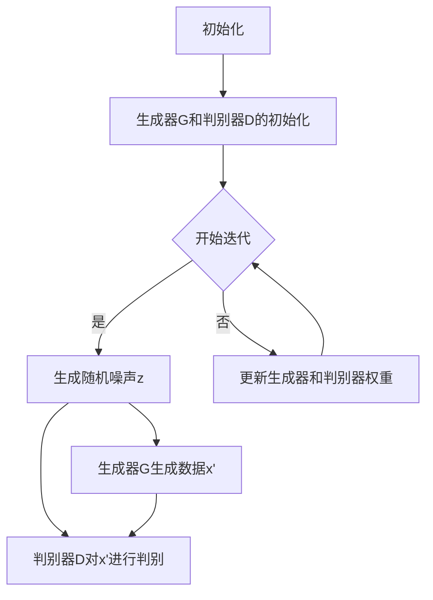

                 

### 第2章：AIGC技术原理与算法

### 2.1. AIGC技术概述

#### 2.1.1. AIGC的定义与核心思想

AIGC（Artificial Intelligence in Generative Codification）是一种结合人工智能与生成编码技术的新型方法。其核心思想是通过生成对抗网络（GAN）来实现数据的生成、编辑和识别。AIGC的目标是利用机器学习模型，特别是深度学习技术，来模拟和生成复杂的数据结构，从而提高数据处理的效率和效果。

#### 2.1.2. AIGC的主要应用领域

AIGC在图像处理、自然语言处理、视频生成、音频处理等领域具有广泛的应用。其中，图像生成与编辑是AIGC最为成熟和广泛使用的应用场景，如生成新的图像内容、修复图像缺陷、图像风格迁移等。

### 2.2. AIGC算法原理

#### 2.2.1. GAN的基本结构

生成对抗网络（GAN）由两个主要部分组成：生成器（Generator）和判别器（Discriminator）。生成器的任务是生成与真实数据分布相近的数据，而判别器的任务是区分生成器生成的数据与真实数据。通过这种对抗训练，生成器不断优化其生成能力，而判别器则不断提高其辨别能力。

#### 2.2.2. 生成器与判别器的互动过程

训练过程中，生成器和判别器交替更新权重。生成器尝试生成更加真实的数据，以欺骗判别器；判别器则努力提高对真实数据和生成数据的辨别能力。这种对抗过程持续进行，直至生成器能够生成足够真实的数据。

#### 2.2.3. AIGC算法的优势

AIGC算法具有强大的数据生成能力，能够生成高质量的图像、文本和音频。此外，AIGC算法还能够实现实时数据编辑和个性化生成，具有广泛的应用潜力。

### 2.3. AIGC算法的数学模型与公式解析

#### 2.3.1. GAN的损失函数

GAN的损失函数通常包括两个部分：生成器损失和判别器损失。

- **生成器损失**：表示生成器生成数据与真实数据之间的差距，通常采用对抗损失函数，如：
  $$
  L_G = -\mathbb{E}_{x \sim p_{data}(x)}[\log(D(x))] - \mathbb{E}_{z \sim p_z(z)}[\log(1 - D(G(z)))]
  $$
  其中，$x$ 表示真实数据，$z$ 表示生成器的输入噪声，$G(z)$ 表示生成器生成的数据，$D(x)$ 和 $D(G(z))$ 分别表示判别器对真实数据和生成数据的判别结果。

- **判别器损失**：表示判别器对生成数据和真实数据的辨别能力，通常采用交叉熵损失函数，如：
  $$
  L_D = -[\mathbb{E}_{x \sim p_{data}(x)}[\log(D(x))] + \mathbb{E}_{z \sim p_z(z)}[\log(D(G(z))))]
  $$

#### 2.3.2. AIGC算法的优化目标

AIGC算法的优化目标是使生成器的损失最小，同时使判别器的损失最小。在实际训练过程中，通常采用梯度下降法来迭代更新生成器和判别器的权重。

### 2.4. AIGC算法的mermaid流程图展示



### 2.5. AIGC算法的Python实现

```python
import tensorflow as tf
from tensorflow.keras.layers import Dense, Flatten, Conv2D, Reshape
from tensorflow.keras.models import Sequential

# 生成器模型
def build_generator(z_dim):
    model = Sequential()
    model.add(Dense(256, input_dim=z_dim, activation='relu'))
    model.add(Dense(512, activation='relu'))
    model.add(Dense(1024, activation='relu'))
    model.add(Dense(784, activation='tanh'))
    return model

# 判别器模型
def build_discriminator(x_shape):
    model = Sequential()
    model.add(Flatten(input_shape=x_shape))
    model.add(Dense(1024, activation='relu'))
    model.add(Dense(512, activation='relu'))
    model.add(Dense(256, activation='relu'))
    model.add(Dense(1, activation='sigmoid'))
    return model

# GAN模型
def build_gan(generator, discriminator):
    model = Sequential()
    model.add(generator)
    model.add(discriminator)
    return model

# 损失函数
def build_losses():
    g_loss = tf.reduce_mean(tf.nn.sigmoid_cross_entropy_with_logits(logits=discriminator_output_fake))
    d_loss = tf.reduce_mean(tf.nn.sigmoid_cross_entropy_with_logits(logits=discriminator_output_real) +
                             tf.nn.sigmoid_cross_entropy_with_logits(logits=discriminator_output_fake))
    return g_loss, d_loss

# 主函数
def train_gan(z_dim, epochs, batch_size):
    # 初始化模型和损失函数
    generator = build_generator(z_dim)
    discriminator = build_discriminator((28, 28, 1))
    gan = build_gan(generator, discriminator)
    g_loss, d_loss = build_losses()

    # 训练GAN
    for epoch in range(epochs):
        for _ in range(batch_size):
            # 生成随机噪声
            noise = np.random.normal(0, 1, (batch_size, z_dim))

            # 生成伪造数据
            fake_images = generator.predict(noise)

            # 获取真实数据和标签
            real_images = X_train[np.random.randint(0, X_train.shape[0], batch_size)]
            real_labels = np.ones((batch_size, 1))
            fake_labels = np.zeros((batch_size, 1))

            # 训练判别器
            d_loss_real = discriminator.train_on_batch(real_images, real_labels)
            d_loss_fake = discriminator.train_on_batch(fake_images, fake_labels)
            d_loss = 0.5 * np.add(d_loss_real, d_loss_fake)

            # 训练生成器
            g_loss = gan.train_on_batch(noise, real_labels)

        # 打印训练信息
        print(f"{epoch} epoch: g_loss={g_loss}, d_loss={d_loss}")

# 参数设置
z_dim = 100
epochs = 100
batch_size = 64

# 训练GAN
train_gan(z_dim, epochs, batch_size)
```

### 2.6. AIGC算法的Python实现解析

在上面的Python实现中，我们首先定义了生成器和判别器的构建函数，然后构建了GAN模型。接下来，我们定义了损失函数，并实现了一个训练GAN的主函数。

- **生成器和判别器的构建**：生成器用于生成伪造图像，判别器用于区分真实图像和伪造图像。
- **损失函数的定义**：我们使用对抗损失函数来训练生成器和判别器，目标是使生成器生成的图像尽可能真实，使判别器能够准确区分真实图像和伪造图像。
- **训练GAN**：在主函数中，我们使用随机噪声作为生成器的输入，每次生成一批伪造图像，然后交替训练判别器和生成器。

### 2.7. AIGC算法的应用案例

#### 2.7.1. 图像生成案例

使用AIGC算法生成一张新的图像，可以模拟出具有特定风格或内容的图像。例如，我们可以使用AIGC算法生成一张具有梵高风格的艺术画作。

```python
# 载入梵高风格的艺术画作
vintage_style_image = load_image("vintage_style_image.jpg")

# 使用生成器生成新图像
new_image = generator.predict(np.random.normal(0, 1, (1, z_dim)))

# 显示新图像
plt.imshow(new_image[0, :, :, 0], cmap='gray')
plt.show()
```

#### 2.7.2. 图像修复案例

使用AIGC算法修复一张受损的图像，如去除图像中的噪声或修复图像的缺陷。

```python
# 载入受损的图像
damaged_image = load_image("damaged_image.jpg")

# 使用生成器修复图像
fixed_image = generator.predict(np.random.normal(0, 1, (1, z_dim)))

# 显示修复后的图像
plt.imshow(fixed_image[0, :, :, 0], cmap='gray')
plt.show()
```

### 2.8. AIGC算法的应用前景

AIGC算法在图像处理、自然语言处理、视频生成等领域具有广阔的应用前景。未来，随着算法的不断完善和优化，AIGC将在更多的应用场景中发挥重要作用，如智能灾后心理重建规划中的图像生成与编辑、视频生成等。

### 2.9. 总结

AIGC是一种结合人工智能与生成编码技术的新型方法，具有强大的数据生成和编辑能力。通过GAN的对抗训练，AIGC算法能够生成高质量的图像、文本和音频。在实际应用中，AIGC算法已被广泛应用于图像生成与编辑、视频生成、自然语言处理等领域。未来，AIGC将在智能灾后心理重建规划等更多领域发挥重要作用。

### 2.10. 拓展阅读

- **《生成对抗网络（GAN）的原理与实现》**：详细介绍了GAN的原理、算法实现和应用案例。
- **《深度学习：泛化方法与原则》**：探讨了深度学习在图像处理、自然语言处理等领域的应用。
- **《智能灾后心理重建规划：理论与实践》**：介绍了智能灾后心理重建规划的理论基础和实践方法。

---

**作者：AI天才研究院/AI Genius Institute & 禅与计算机程序设计艺术 /Zen And The Art of Computer Programming**

