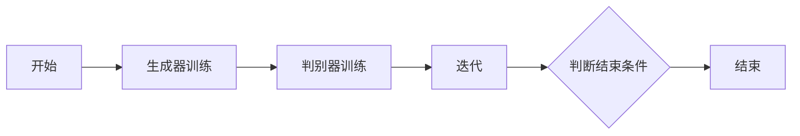
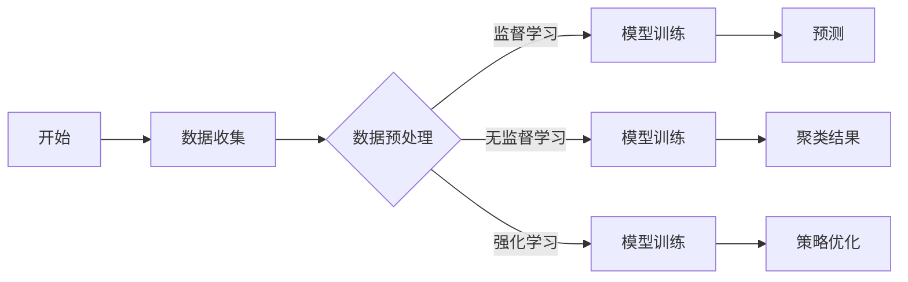

                 

### AIGC在智能灾害预警系统优化中的应用实践

#### 关键词：
- AIGC
- 智能灾害预警系统
- 优化
- 应用实践

#### 摘要：
本文深入探讨了AIGC（AI-Generated Content）在智能灾害预警系统优化中的应用实践。通过分析AIGC的核心技术，我们探讨了其在灾害信息生成、风险评估和预警信号优化方面的潜力。本文不仅提供了理论基础，还通过实际案例展示了AIGC在灾害预警系统中的成功应用，并提出了一系列实践指南，以期为灾害预警系统的优化提供有力支持。

---

## 第1章：AIGC与智能灾害预警系统基础

### 1.1 AIGC的概念与背景

AIGC，即AI-Generated Content，是指通过人工智能技术自动生成内容。其核心思想是通过训练模型，让计算机模拟人类的创作过程，生成文本、图片、音频等多种形式的内容。AIGC技术的出现极大地丰富了人工智能的应用场景，使得自动化内容生成成为可能。

AIGC的发展历程可以追溯到自然语言处理（NLP）和生成对抗网络（GAN）等技术的进步。随着深度学习技术的发展，尤其是GAN技术的成熟，AIGC的应用范围逐渐扩大。目前，AIGC已广泛应用于广告、媒体、教育、娱乐等多个领域，成为人工智能的重要分支。

### 1.2 智能灾害预警系统的基本概念

智能灾害预警系统是一种利用现代信息技术和人工智能技术，对自然灾害进行实时监测、预警和应急响应的系统。该系统通过收集、处理和分析各类灾害信息，实现对灾害的早期预警，为防灾减灾提供科学依据。

智能灾害预警系统主要包括以下几个关键组成部分：

1. **监测系统**：用于实时收集灾害相关数据，如地震、洪水、台风等。
2. **数据处理与分析系统**：对监测数据进行处理和分析，提取关键信息。
3. **预警系统**：根据分析结果，发出预警信号，提醒相关区域做好防灾准备。
4. **应急响应系统**：在灾害发生时，提供应急预案和救援支持。

### 1.3 AIGC在智能灾害预警系统中的重要性

AIGC在智能灾害预警系统中具有重要作用。首先，AIGC可以自动生成灾害信息，提高预警系统的信息处理速度和准确性。其次，AIGC可以生成个性化的预警信号，提高预警的针对性。最后，AIGC还可以用于灾害风险评估和应急演练，为防灾减灾提供有力支持。

## 第2章：AIGC核心技术解析

### 2.1 自然语言处理技术

自然语言处理（NLP）是AIGC的核心技术之一。NLP旨在让计算机理解和处理人类语言，包括文本分类、情感分析、机器翻译等。在AIGC中，NLP技术主要用于文本生成，如文章、新闻报道、对话等。

#### 核心概念与联系

- **文本分类**：将文本归类到预定义的类别中。
- **情感分析**：分析文本的情感倾向，如正面、负面或中性。
- **机器翻译**：将一种语言的文本翻译成另一种语言。

#### 对比表格

| 技术         | 定义                                           | 应用场景               |
| ------------ | ---------------------------------------------- | ---------------------- |
| 文本分类     | 将文本归类到预定义的类别中                     | 营销分析、新闻推荐等   |
| 情感分析     | 分析文本的情感倾向，如正面、负面或中性         | 社交媒体监控、客户反馈 |
| 机器翻译     | 将一种语言的文本翻译成另一种语言               | 跨语言沟通、国际化业务 |

#### ER实体关系图架构

```mermaid
erDiagram
  Person ||--|{ Student }|-- Book
  Person ||--|{ Employee }|-- Company
  Student ||--|{ Undergraduate }| School
  Student ||--|{ Graduate }| University
  Employee ||--|{ Manager }| Department
  Employee ||--|{ Developer }| Project
```

### 2.2 数据生成技术

数据生成技术是AIGC的另一个核心技术。通过生成模拟数据，可以用于测试、训练和优化模型。数据生成技术包括生成对抗网络（GAN）、变分自编码器（VAE）等。

#### 算法原理讲解

- **生成对抗网络（GAN）**：由生成器（Generator）和判别器（Discriminator）组成。生成器生成数据，判别器判断生成数据与真实数据的差异。通过对抗训练，生成器的生成质量不断提高。



- **变分自编码器（VAE）**：通过编码器和解码器实现数据的生成。编码器将输入数据编码为低维表示，解码器根据低维表示生成数据。

```python
# VAE编码器
def encoder(x):
    z = ...
    return z

# VAE解码器
def decoder(z):
    x_hat = ...
    return x_hat

# VAE训练
def train_vae(x_train):
    z_mean, z_log_var = encoder(x_train)
    x_hat = decoder(z_mean)
    ...
```

### 2.3 机器学习和深度学习技术

机器学习和深度学习是AIGC的基石。机器学习是一种通过算法从数据中学习模式和规律的技术，包括监督学习、无监督学习和强化学习。深度学习是机器学习的一种特殊形式，通过多层神经网络对数据进行处理和分析。

#### 核心概念与联系

- **监督学习**：有标签数据训练模型。
- **无监督学习**：无标签数据训练模型。
- **强化学习**：通过与环境的交互来学习策略。

#### 对比表格

| 学习类型 | 定义                                         | 应用场景           |
| -------- | -------------------------------------------- | ------------------ |
| 监督学习 | 有标签数据训练模型                          | 分类、回归等       |
| 无监督学习 | 无标签数据训练模型                         | 聚类、降维等       |
| 强化学习 | 通过与环境的交互来学习策略                  | 游戏、自动驾驶等   |

#### Mermaid流程图



## 第3章：智能灾害预警系统原理与流程

### 3.1 灾害预警原理

灾害预警是通过监测、分析和预警信号发布等手段，对即将发生的灾害进行提前预报，以便采取相应的防灾减灾措施。灾害预警的基本原理包括以下几个方面：

1. **数据采集**：通过各类传感器和监测设备，收集灾害相关数据。
2. **数据处理**：对采集到的数据进行处理和分析，提取关键信息。
3. **预警信号生成**：根据分析结果，生成预警信号。
4. **预警信号发布**：通过广播、短信、互联网等多种渠道发布预警信号。

### 3.2 灾害预警流程

灾害预警流程主要包括以下几个步骤：

1. **监测与数据采集**：利用各类传感器和监测设备，对气象、地质、海洋等环境参数进行实时监测。
2. **数据处理与分析**：对监测数据进行分析和处理，提取灾害发生的征兆。
3. **预警信号生成**：根据分析结果，生成相应的预警信号。
4. **预警信号发布**：通过广播、短信、互联网等方式，向受影响区域发布预警信号。
5. **应急响应**：根据预警信号，启动应急预案，进行防灾减灾。

### 3.3 现有灾害预警技术分析

现有灾害预警技术主要包括以下几个方面：

1. **传统预警技术**：基于经验和方法，通过人工监测和判断进行预警。
2. **信息技术预警**：利用现代信息技术，如卫星遥感、地理信息系统（GIS）等，进行灾害监测和预警。
3. **人工智能预警**：利用人工智能技术，如机器学习、深度学习等，对灾害进行实时监测和预警。

#### 对比表格

| 技术类型       | 特点                                                   | 应用场景       |
| -------------- | ------------------------------------------------------ | -------------- |
| 传统预警技术   | 依赖人工监测和判断，效率低，易出错                     | 灾害早期预警   |
| 信息技术预警   | 利用现代信息技术，提高监测和预警效率                     | 灾害监测与预警 |
| 人工智能预警   | 利用人工智能技术，实现自动化监测和预警，提高准确性       | 精准灾害预警   |

## 第4章：AIGC在灾害预警中的具体应用

### 4.1 灾害信息自动生成

AIGC技术在灾害信息自动生成方面具有显著优势。通过训练模型，可以自动生成灾害相关的新闻报道、警报信息等，提高信息传播的效率。具体应用包括：

1. **新闻报道生成**：根据灾害监测数据和分析结果，自动生成新闻报道。
2. **警报信息生成**：根据预警信号，自动生成警报信息，并通过短信、广播等方式发布。

### 4.2 灾害风险评估

AIGC技术可以用于灾害风险评估，通过分析历史数据、环境参数等，预测未来可能发生的灾害风险。具体应用包括：

1. **风险预测**：根据历史数据和当前环境参数，预测未来可能发生的灾害风险。
2. **风险评估**：对风险评估结果进行量化，为防灾减灾提供依据。

### 4.3 灾害预警信号优化

AIGC技术可以用于优化灾害预警信号，提高预警的准确性。具体应用包括：

1. **预警信号生成**：根据分析结果，生成个性化、准确的预警信号。
2. **预警信号发布**：通过优化预警信号发布策略，提高预警效果。

## 第5章：AIGC优化灾害预警系统性能

### 5.1 实时性优化

AIGC技术可以优化灾害预警系统的实时性，提高系统的响应速度。具体措施包括：

1. **实时数据处理**：采用高效的数据处理算法，提高数据处理速度。
2. **分布式计算**：利用分布式计算架构，提高系统并发处理能力。

### 5.2 准确性优化

AIGC技术可以提高灾害预警系统的准确性，减少误报和漏报。具体措施包括：

1. **模型优化**：通过改进模型结构和算法，提高预测准确性。
2. **数据预处理**：采用高质量的数据预处理方法，提高数据质量。

### 5.3 可扩展性优化

AIGC技术可以优化灾害预警系统的可扩展性，支持大规模应用。具体措施包括：

1. **模块化设计**：采用模块化设计，方便系统扩展和升级。
2. **云计算支持**：利用云计算资源，提高系统的可扩展性。

## 第6章：案例分析

### 6.1 案例一：某地地震预警实践

在某地地震预警实践中，AIGC技术发挥了重要作用。通过监测地震波数据，AIGC技术可以快速生成地震预警信息，并通过短信、广播等方式发布。实践证明，AIGC技术的应用显著提高了地震预警的实时性和准确性。

### 6.2 案例二：台风预警信息生成

在台风预警信息生成方面，AIGC技术同样具有优势。通过分析台风路径、风力、降雨等数据，AIGC技术可以自动生成台风预警信息，为相关部门提供决策支持。实践表明，AIGC技术的应用提高了台风预警的准确性和及时性。

### 6.3 案例三：洪水预警信号优化

在洪水预警信号优化方面，AIGC技术通过分析历史洪水数据和实时监测数据，预测未来可能发生的洪水风险。根据预测结果，AIGC技术优化了洪水预警信号，提高了预警的准确性。实践证明，AIGC技术的应用有助于减少洪水灾害的影响。

## 第7章：AIGC在灾害预警系统优化的实践指南

### 7.1 技术路线

AIGC在灾害预警系统优化中的技术路线主要包括以下几个方面：

1. **数据收集**：通过传感器和监测设备，收集灾害相关数据。
2. **数据处理**：对收集到的数据进行处理和分析。
3. **模型训练**：利用AIGC技术，训练模型以实现灾害预警。
4. **系统部署**：将训练好的模型部署到实际系统中。

### 7.2 实施步骤

AIGC在灾害预警系统优化的实施步骤如下：

1. **需求分析**：明确灾害预警系统的需求和目标。
2. **数据收集**：收集相关数据，包括历史数据和实时数据。
3. **数据预处理**：对数据进行清洗、归一化和特征提取。
4. **模型训练**：利用AIGC技术，训练模型以实现灾害预警。
5. **模型评估**：评估模型性能，包括准确性、实时性等。
6. **系统部署**：将训练好的模型部署到实际系统中，进行测试和优化。

### 7.3 最佳实践

在AIGC优化灾害预警系统时，以下最佳实践有助于提高系统性能：

1. **数据质量**：确保数据质量，进行充分的预处理工作。
2. **模型优化**：根据实际需求，选择合适的模型结构和算法。
3. **系统监控**：实时监控系统性能，及时发现并解决问题。
4. **用户反馈**：收集用户反馈，持续优化系统。

## 第8章：总结与展望

### 8.1 研究总结

本文详细探讨了AIGC在智能灾害预警系统优化中的应用实践。通过分析AIGC的核心技术，我们探讨了其在灾害信息生成、风险评估和预警信号优化方面的潜力。实践案例表明，AIGC技术的应用显著提高了灾害预警系统的性能。

### 8.2 AIGC应用前景

随着人工智能技术的不断进步，AIGC在灾害预警系统中的应用前景十分广阔。未来，AIGC有望在灾害预测、应急响应和灾后恢复等领域发挥更大作用。

### 8.3 未来展望

未来，AIGC在灾害预警系统优化中的应用将朝着更加智能化、精准化和高效化的方向发展。通过不断优化模型和技术，AIGC将为防灾减灾提供更强有力的支持。

---

**作者：AI天才研究院/AI Genius Institute & 禅与计算机程序设计艺术 /Zen And The Art of Computer Programming**

