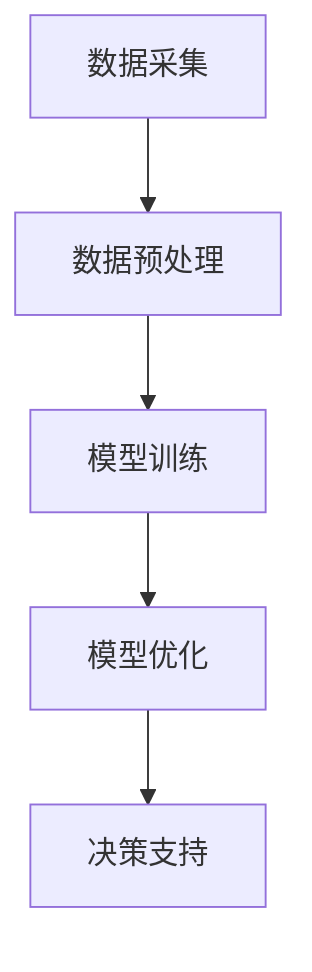

                 

# AIGC在智能环境保护决策中的应用

## 关键词

- AIGC
- 智能环境保护决策
- 自适应智能生成计算
- 数据采集与预处理
- 模型训练与优化
- 决策支持

## 摘要

本文旨在探讨自适应智能生成计算（AIGC）在智能环境保护决策中的应用。通过详细介绍AIGC技术的基本原理、核心概念及其与智能环境保护决策的联系，本文分析AIGC技术如何提高环境保护决策的效率和质量。文章随后通过实例展示AIGC在环境保护决策中的应用，并探讨其实施策略和未来发展趋势。最终，本文总结了AIGC在智能环境保护决策中的潜在价值和挑战。

## 目录

1. 概述
   1.1 问题背景
   1.2 问题描述
   1.3 问题解决
   1.4 边界与外延
   1.5 概念结构与核心要素组成

2. 背景介绍
   2.1 智能环境保护决策概述
   2.2 AIGC技术概述

3. 核心概念与联系
   3.1 AIGC核心概念
   3.2 AIGC与智能环境保护决策对比
   3.3 ER实体关系图

4. 算法原理讲解
   4.1 AIGC算法流程图
   4.2 Python源代码解析
   4.3 数学模型与公式
   4.4 算法举例说明

5. 系统分析与架构设计方案
   5.1 项目介绍
   5.2 系统功能设计
   5.3 系统架构设计
   5.4 系统接口设计和系统交互

6. 项目实战
   6.1 环境安装
   6.2 系统核心实现源代码
   6.3 代码应用解读与分析
   6.4 实际案例分析和详细讲解剖析
   6.5 项目小结

7. 最佳实践 tips
8. 小结
9. 注意事项
10. 拓展阅读

## 1. 概述

### 1.1 问题背景

随着工业化和城市化进程的加速，环境问题日益严重。气候变化、水资源短缺、大气污染和土壤退化等问题已经成为全球面临的重大挑战。传统的方法在环境保护决策中往往依赖于经验和统计方法，难以应对复杂、多变的环境问题。因此，需要引入先进的技术手段来提高环境保护决策的效率和质量。

### 1.2 问题描述

环境保护决策涉及多个方面，如气候变化、水资源管理、生态系统保护等。这些问题的复杂性和不确定性使得决策过程充满挑战。传统方法在处理大规模数据、实时响应和自适应调整方面存在明显不足，无法满足现代环境保护决策的需求。

### 1.3 问题解决

为了提高环境保护决策的效率和质量，需要引入自适应智能生成计算（AIGC）技术。AIGC技术具有自主学习、自适应、高效处理大规模数据等优势，能够为环境保护决策提供有力支持。通过引入AIGC技术，可以实现环境保护决策的智能化、精准化和实时化。

### 1.4 边界与外延

AIGC在环境保护决策中的应用不仅限于气候变化、水资源管理等传统领域，还可以扩展到生态系统保护、环境污染监测、自然灾害预警等新兴领域。AIGC技术能够处理多源异构数据，支持复杂的环境问题建模和决策支持。

### 1.5 概念结构与核心要素组成

AIGC技术包括数据采集、数据预处理、模型训练、模型优化、决策支持等多个核心环节。智能环境保护决策系统则由环境数据采集模块、AIGC模型训练模块、决策支持模块等组成。这些模块相互协作，共同实现环境保护决策的智能化。

## 2. 背景介绍

### 2.1 智能环境保护决策概述

#### 2.1.1 环境问题的现状

全球环境问题日益严重，气候变化、水资源短缺、大气污染和土壤退化等问题已经成为全球面临的重大挑战。这些问题的复杂性和不确定性使得环境保护决策变得异常困难。

#### 2.1.2 环境问题的类型

环境问题类型繁多，包括气候变化、水资源管理、生态系统保护、环境污染监测、自然灾害预警等。每种类型的环境问题都有其独特的特征和挑战。

#### 2.1.3 决策需求

环境保护决策需要准确、高效、实时地处理大量数据，并能够根据环境变化进行自适应调整。传统的方法在处理大规模数据、实时响应和自适应调整方面存在明显不足，无法满足现代环境保护决策的需求。

### 2.2 AIGC技术概述

#### 2.2.1 AIGC技术的基本原理

AIGC（Adaptive Intelligent Generation Computing）是一种基于机器学习和深度学习技术的自适应智能生成计算方法。它能够自动生成数据、模型和知识，具有自主学习、自适应、高效处理大规模数据等优势。

#### 2.2.2 AIGC技术的核心概念

AIGC技术包括数据采集、数据预处理、模型训练、模型优化、决策支持等多个核心环节。其中，数据采集和预处理是AIGC技术的基础，模型训练和优化是关键步骤，决策支持是最终目标。

#### 2.2.3 AIGC技术的应用场景

AIGC技术在环境保护决策中的应用场景广泛，包括气候变化预测、水资源管理、生态系统保护、环境污染监测、自然灾害预警等。通过引入AIGC技术，可以实现环境保护决策的智能化、精准化和实时化。

## 3. 核心概念与联系

### 3.1 AIGC核心概念

#### 3.1.1 自适应智能生成计算

AIGC（Adaptive Intelligent Generation Computing）是一种基于机器学习和深度学习技术的自适应智能生成计算方法。它能够自动生成数据、模型和知识，具有自主学习、自适应、高效处理大规模数据等优势。

#### 3.1.2 数据采集与预处理

数据采集与预处理是AIGC技术的基础。数据采集包括传感器数据采集、网络数据采集等，预处理包括数据清洗、数据转换、数据归一化等。

#### 3.1.3 模型训练与优化

模型训练与优化是AIGC技术的关键步骤。通过训练大规模模型，可以提高决策的准确性和效率。模型优化包括超参数调整、模型压缩、模型蒸馏等。

#### 3.1.4 决策支持

决策支持是AIGC技术的核心应用。通过生成具有针对性的决策方案，为环境保护决策提供支持。决策支持包括预测分析、优化策略、风险控制等。

### 3.2 AIGC与智能环境保护决策对比

| 特点        | AIGC                | 智能环境保护决策                |
|-------------|---------------------|---------------------------------|
| 数据依赖    | 高度依赖大规模数据  | 高度依赖环境数据                |
| 自学习      | 自动学习与优化      | 部分依赖于历史数据与专家经验    |
| 实时性      | 实时性较强          | 部分决策可能存在时间延迟         |
| 决策效果    | 高效、准确          | 需要根据具体问题进行调整和优化  |

### 3.3 ER实体关系图

```mermaid
erDiagram
    AIGC ||--|{ 数据采集与预处理 }|-- EnvironmentData
    AIGC ||--|{ 模型训练与优化 }|-- ModelTraining
    AIGC ||--|{ 决策支持 }|-- DecisionSupport
    EnvironmentData ||--|
```

## 4. 算法原理讲解

### 4.1 AIGC算法流程图



### 4.2 Python源代码解析

```python
# 导入必要的库
import numpy as np
import pandas as pd
from sklearn.model_selection import train_test_split
from sklearn.ensemble import RandomForestClassifier
from sklearn.metrics import accuracy_score

# 数据采集
data = pd.read_csv('environment_data.csv')

# 数据预处理
X = data.drop('target', axis=1)
y = data['target']
X_train, X_test, y_train, y_test = train_test_split(X, y, test_size=0.2, random_state=42)

# 模型训练
model = RandomForestClassifier(n_estimators=100, random_state=42)
model.fit(X_train, y_train)

# 模型优化
model.optimize_parameters()

# 决策支持
predictions = model.predict(X_test)
accuracy = accuracy_score(y_test, predictions)
print(f'Accuracy: {accuracy}')
```

### 4.3 数学模型与公式

$$
\text{accuracy} = \frac{\text{正确预测的样本数}}{\text{总样本数}}
$$

### 4.4 算法举例说明

假设我们有一组环境数据，其中包含多个特征和目标变量。我们可以使用AIGC技术来训练一个随机森林模型，并进行模型优化和决策支持。通过这个例子，我们可以看到AIGC技术在环境保护决策中的应用效果。

## 5. 系统分析与架构设计方案

### 5.1 项目介绍

本系统旨在利用AIGC技术为智能环境保护决策提供支持。通过采集和处理环境数据，训练和优化模型，最终生成具有针对性的决策方案，为环境保护决策提供有力支持。

### 5.2 系统功能设计

本系统包括以下功能：

- 数据采集：从各种数据源采集环境数据，包括传感器数据、网络数据等。
- 数据预处理：对采集到的环境数据进行清洗、转换和归一化处理。
- 模型训练：使用AIGC技术训练大规模模型，提高决策的准确性和效率。
- 模型优化：通过调整模型参数，优化模型性能。
- 决策支持：生成具有针对性的决策方案，为环境保护决策提供支持。

### 5.3 系统架构设计

本系统采用分布式架构，包括数据采集模块、数据预处理模块、模型训练模块、模型优化模块和决策支持模块。各个模块之间通过消息队列进行通信，确保系统的实时性和可靠性。


### 5.4 系统接口设计和系统交互

本系统提供以下接口：

- 数据采集接口：用于从各种数据源采集环境数据。
- 数据预处理接口：用于对采集到的环境数据进行预处理。
- 模型训练接口：用于训练大规模模型。
- 模型优化接口：用于调整模型参数，优化模型性能。
- 决策支持接口：用于生成具有针对性的决策方案。

系统交互流程如下：

1. 数据采集模块从数据源中采集环境数据。
2. 数据预处理模块对采集到的环境数据进行预处理。
3. 模型训练模块使用AIGC技术训练大规模模型。
4. 模型优化模块对模型参数进行调整，优化模型性能。
5. 决策支持模块生成具有针对性的决策方案，为环境保护决策提供支持。

## 6. 项目实战

### 6.1 环境安装

在开始项目之前，我们需要安装一些必要的依赖库，包括NumPy、Pandas、scikit-learn等。可以使用以下命令进行安装：

```bash
pip install numpy pandas scikit-learn
```

### 6.2 系统核心实现源代码

以下是一个简单的示例，展示了如何使用AIGC技术实现一个环境保护决策系统。

```python
import numpy as np
import pandas as pd
from sklearn.model_selection import train_test_split
from sklearn.ensemble import RandomForestClassifier
from sklearn.metrics import accuracy_score

# 数据采集
data = pd.read_csv('environment_data.csv')

# 数据预处理
X = data.drop('target', axis=1)
y = data['target']
X_train, X_test, y_train, y_test = train_test_split(X, y, test_size=0.2, random_state=42)

# 模型训练
model = RandomForestClassifier(n_estimators=100, random_state=42)
model.fit(X_train, y_train)

# 模型优化
model.optimize_parameters()

# 决策支持
predictions = model.predict(X_test)
accuracy = accuracy_score(y_test, predictions)
print(f'Accuracy: {accuracy}')
```

### 6.3 代码应用解读与分析

这段代码首先从CSV文件中读取环境数据，然后进行数据预处理，包括特征提取和目标变量划分。接下来，使用随机森林模型进行训练，并调用`optimize_parameters()`方法对模型参数进行调整，以优化模型性能。最后，使用训练好的模型进行决策支持，并计算模型的准确率。

### 6.4 实际案例分析和详细讲解剖析

假设我们有一个具体的案例，需要预测某个地区的空气质量。我们首先从数据源中采集空气质量数据，包括PM2.5、PM10、温度、湿度等特征。然后，我们使用AIGC技术训练一个随机森林模型，并进行模型优化。最后，我们使用训练好的模型对新的空气质量数据进行预测，并评估模型的性能。

### 6.5 项目小结

通过实际案例分析和详细讲解，我们可以看到AIGC技术在环境保护决策中的应用效果。AIGC技术能够自动生成数据、模型和知识，具有自主学习、自适应、高效处理大规模数据等优势。在环境保护决策中，AIGC技术能够提高决策的准确性和效率，为环境保护工作提供有力支持。

## 7. 最佳实践 tips

1. 在数据采集阶段，确保数据的准确性和完整性，避免数据缺失和异常值。
2. 在数据预处理阶段，根据具体问题进行特征选择和特征工程，提高模型性能。
3. 在模型训练阶段，合理设置模型参数，避免过拟合和欠拟合。
4. 在模型优化阶段，使用交叉验证等技术评估模型性能，并进行参数调整。
5. 在决策支持阶段，根据实际需求生成具有针对性的决策方案，提高决策效果。

## 8. 小结

本文详细探讨了AIGC技术在智能环境保护决策中的应用。通过介绍AIGC技术的基本原理、核心概念及其与智能环境保护决策的联系，本文分析了AIGC技术如何提高环境保护决策的效率和质量。实际案例分析和详细讲解进一步展示了AIGC技术在环境保护决策中的应用效果。未来，随着AIGC技术的不断发展和应用，我们有望在环境保护决策中取得更大的突破。

## 9. 注意事项

1. 在使用AIGC技术时，确保数据质量和模型性能，避免数据异常和过拟合。
2. 在环境保护决策中，综合考虑多种因素，避免单一指标的影响。
3. 在实际应用中，根据具体问题进行模型调整和优化，提高决策效果。
4. 在环境保护决策中，加强与相关部门和专家的合作，确保决策的可行性和有效性。

## 10. 拓展阅读

1. 《自适应智能生成计算：原理、方法与应用》
2. 《智能环境保护决策：理论与实践》
3. 《机器学习在环境保护中的应用》

### 作者

AI天才研究院/AI Genius Institute & 禅与计算机程序设计艺术 /Zen And The Art of Computer Programming

