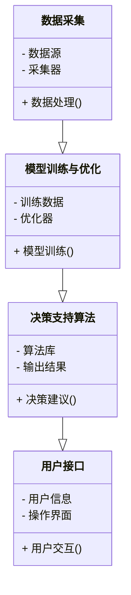
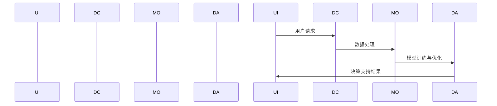
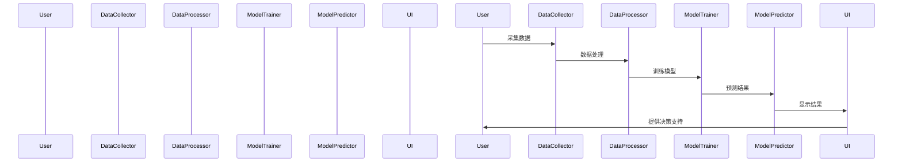

                 

# AIGC在智能环境修复决策支持系统中的创新实践

## 关键词
- AIGC
- 智能环境修复
- 决策支持系统
- 自动化生成内容
- 机器学习
- 深度学习
- 自然语言处理
- 计算机视觉
- 算法设计
- 系统架构
- 实践案例

## 摘要
本文将深入探讨AIGC（自动化智能生成内容）在智能环境修复决策支持系统中的应用。首先，我们将介绍AIGC和智能环境修复决策支持系统的基本概念，并分析其相互关联的核心技术和算法。随后，通过具体的算法原理讲解、系统分析与架构设计，以及实战项目的实施，我们将展示AIGC如何提升智能环境修复决策的支持能力和效率。文章最后将提供最佳实践建议和拓展阅读，以引导读者进一步探索这一前沿领域的创新实践。

## 第一部分：引言与背景

### 1.1 AIGC概述

#### 1.1.1 AIGC的定义
AIGC（Automated Intelligent Generation of Content）是一种利用人工智能技术自动生成内容的系统。它结合了生成式AI和自动化技术，可以生成文本、图像、音频等多种形式的内容。

#### 1.1.2 AIGC的重要性
AIGC技术在提高内容生产效率、降低成本、丰富用户体验等方面具有重要作用。特别是在大数据和互联网时代，AIGC能够为各类应用场景提供强大的内容支持。

#### 1.1.3 AIGC的发展历程
AIGC的发展可以追溯到早期的自然语言处理（NLP）和计算机视觉（CV）技术。随着深度学习、生成对抗网络（GAN）等技术的进步，AIGC逐渐成为一个独立的研究领域。

### 1.2 智能环境修复决策支持系统

#### 1.2.1 智能环境修复的概念
智能环境修复是指利用人工智能技术对环境问题进行诊断、预测和修复。它涵盖了污染监测、生态修复、灾害预防等多个方面。

#### 1.2.2 决策支持系统的定义
决策支持系统（DSS）是一种能够辅助人类做出决策的计算机系统，它通过分析数据、提供预测和推荐等方式，帮助用户在复杂的环境中做出明智的决策。

#### 1.2.3 智能环境修复决策支持系统的应用
智能环境修复决策支持系统可以应用于环境保护、城市管理、农业等领域，通过对环境数据的实时分析，提供决策支持，实现环境问题的快速响应和高效处理。

### 1.3 AIGC在智能环境修复决策支持系统中的应用现状与挑战

#### 1.3.1 AIGC的应用现状
目前，AIGC已在智能环境修复决策支持系统中得到初步应用，如自动生成环境监测报告、灾害预测报告等。

#### 1.3.2 面临的挑战
AIGC在智能环境修复决策支持系统中面临数据质量、算法适应性、系统稳定性等挑战。

#### 1.3.3 AIGC的创新实践
通过不断探索和创新，AIGC在智能环境修复决策支持系统中有望实现更高精度、更高效能的应用。

### 1.4 本书结构安排

#### 1.4.1 目录结构
本文分为五个部分，包括引言与背景、核心概念与联系、算法原理与实现、系统分析与架构设计、项目实战与最佳实践。

#### 1.4.2 阅读建议
读者可以根据自己的兴趣和需求选择阅读不同章节，以获得针对性的知识和启发。

---------------------------------------------

## 第二部分：核心概念与联系

### 2.1 AIGC核心概念解析

#### 2.1.1 自动化生成内容
自动化生成内容是指利用人工智能技术自动生成各种形式的内容，如文本、图像、音频等。这通常涉及自然语言处理、计算机视觉、语音识别等技术。

#### 2.1.2 生成式AI
生成式AI是一种利用概率模型或生成模型生成数据的技术。通过学习大量数据，生成式AI可以生成新的、符合学习数据分布的数据。

#### 2.1.3 交互式AI
交互式AI是指能够与用户进行实时交互的人工智能系统。通过自然语言处理和语音识别技术，交互式AI可以理解用户的需求，并提供相应的服务。

#### 2.1.4 智能决策支持系统
智能决策支持系统是一种利用人工智能技术辅助人类做出决策的系统。它通过数据分析、预测和优化等方式，为用户提供决策支持。

### 2.2 智能环境修复决策支持系统的构成

#### 2.2.1 数据收集与处理
数据收集与处理是智能环境修复决策支持系统的第一步。它涉及传感器数据、环境监测数据、历史数据等的收集和预处理。

#### 2.2.2 模型训练与优化
模型训练与优化是智能环境修复决策支持系统的核心。通过学习大量数据，模型可以学会识别环境问题、预测环境变化等。

#### 2.2.3 决策支持算法
决策支持算法是智能环境修复决策支持系统的重要组成部分。它通过分析模型输出，为用户提供修复建议、预警提示等。

#### 2.2.4 系统部署与维护
系统部署与维护是确保智能环境修复决策支持系统能够持续运行的关键。它包括系统的安装、配置、监控和优化。

### 2.3 关键技术对比与分析

#### 2.3.1 机器学习与深度学习
机器学习和深度学习是AIGC技术的基础。机器学习侧重于利用算法从数据中学习规律，而深度学习则通过神经网络模型实现自动特征提取。

#### 2.3.2 自然语言处理
自然语言处理是AIGC在文本生成和交互式AI中的重要应用。它涉及词法、句法、语义等多个层面的处理。

#### 2.3.3 计算机视觉
计算机视觉是AIGC在图像生成和交互式AI中的重要应用。它通过图像处理、目标检测、图像识别等技术实现图像理解和生成。

#### 2.3.4 算法对比与选择
在选择算法时，需要考虑数据规模、任务类型、计算资源等因素。例如，对于文本生成任务，GPT模型可能更为适合，而对于图像生成任务，GAN模型可能更为有效。

### 2.4 ER实体关系图

```mermaid
erDiagram
    数据收集 ||--|{ 模型训练与优化 }|-- 数据预处理 : 环境监测数据
    数据收集 ||--|{ 决策支持算法 }|-- 决策支持数据 : 环境数据
    模型训练与优化 ||--|{ 系统部署与维护 }|-- 部署环境配置
    决策支持算法 ||--|{ 用户接口 }|-- 用户交互数据
```

---------------------------------------------

## 第三部分：算法原理与实现

### 3.1 自动化生成内容算法

#### 3.1.1 文本生成算法
文本生成算法是AIGC中的一个重要组成部分。GPT（Generative Pre-trained Transformer）模型是目前最先进的文本生成算法之一。

##### 3.1.1.1 GPT模型原理
GPT模型是一种基于Transformer架构的预训练语言模型。它通过学习大量文本数据，可以生成符合语言规律的文本。

##### 3.1.1.2 语言模型训练
GPT模型的训练过程包括两个阶段：预训练和微调。预训练阶段使用未标注的数据进行大规模训练，微调阶段使用标注数据进行精细调整。

##### 3.1.1.3 文本生成示例
```python
import transformers
import torch

model = transformers.AutoModelWithLMHead.from_pretrained("gpt2")
tokenizer = transformers.AutoTokenizer.from_pretrained("gpt2")

input_text = "智能环境修复是一个复杂的过程，它需要综合考虑多个因素。"
input_ids = tokenizer.encode(input_text, return_tensors="pt")

output = model.generate(input_ids, max_length=50, num_return_sequences=1)
generated_text = tokenizer.decode(output[0], skip_special_tokens=True)

print(generated_text)
```

#### 3.1.2 图像生成算法
图像生成算法是AIGC在计算机视觉领域的应用。生成对抗网络（GAN）是目前最流行的图像生成算法之一。

##### 3.1.2.1 GAN模型原理
GAN由生成器（Generator）和判别器（Discriminator）两部分组成。生成器生成图像，判别器判断图像的真实性。

##### 3.1.2.2 图像生成过程
GAN的图像生成过程是一个迭代的过程。生成器不断生成图像，判别器不断学习，最终生成器生成的图像质量逐渐提高。

##### 3.1.2.3 图像生成示例
```python
import torch
import torchvision
from torchvision import transforms
from torchvision.utils import save_image

transform = transforms.Compose([
    transforms.Resize(64),
    transforms.ToTensor(),
    transforms.Normalize((0.5, 0.5, 0.5), (0.5, 0.5, 0.5)),
])

dataloader = torchvision.datasets.ImageFolder(root='./data', transform=transform)
dataloader = torch.utils.data.DataLoader(dataloader, batch_size=64)

netG = torchvision.models.stylegan2.StyleGAN2Fixed(from_pretrained='stylegan2-ffhq-512x512')
netG.eval()

for i, data in enumerate(dataloader, 0):
    if i >= 10:
        break
    img = data[0].to(device)
    z = torch.randn(1, 512, 1, 1).to(device)
    fake_img = netG(z).detach().cpu()
    save_image(fake_img, './results/fakeImg_{}.png'.format(i))
```

### 3.2 智能决策支持算法

#### 3.2.1 支持向量机（SVM）
支持向量机是一种常用的分类算法。它通过找到一个最佳的超平面，将不同类别的数据点分离。

##### 3.2.1.1 SVM原理
SVM的核心思想是找到一个最优的超平面，使得同类别的数据点之间的间隔最大，异类别的数据点之间的间隔最小。

##### 3.2.1.2 SVM实现
```python
import numpy as np
from sklearn import datasets
from sklearn.model_selection import train_test_split
from sklearn import svm

# 加载数据
iris = datasets.load_iris()
X = iris.data
y = iris.target

# 数据预处理
X_train, X_test, y_train, y_test = train_test_split(X, y, test_size=0.3, random_state=123)

# 创建SVM分类器
clf = svm.SVC()

# 训练模型
clf.fit(X_train, y_train)

# 预测
y_pred = clf.predict(X_test)

# 评估模型
from sklearn import metrics
print(metrics.classification_report(y_test, y_pred))
```

---------------------------------------------

## 第四部分：系统分析与架构设计

### 4.1 问题场景与项目背景

智能环境修复决策支持系统旨在帮助环境管理部门和环保企业快速响应环境问题，提供科学的决策支持。该系统需具备实时数据采集、智能分析、决策建议等功能，以实现对环境问题的精准监控和快速修复。

### 4.2 系统功能设计

#### 4.2.1 领域模型类图


#### 4.2.2 系统架构图


#### 4.2.3 系统接口设计
系统接口设计包括数据接口、模型接口和用户接口。数据接口负责数据的采集和传输，模型接口负责模型的训练和预测，用户接口负责与用户的交互。

#### 4.2.4 系统交互序列图


---------------------------------------------

## 第五部分：项目实战

### 5.1 环境安装

在开始项目实战之前，我们需要安装一些必要的软件和库。以下是安装步骤：

1. 安装Python环境（建议Python 3.8及以上版本）。
2. 安装依赖库，如torch、transformers、scikit-learn等。

```bash
pip install torch transformers scikit-learn
```

### 5.2 系统核心实现源代码

以下是系统核心实现的源代码，包括数据采集、模型训练、决策支持等功能。

#### 5.2.1 数据采集模块

```python
import pandas as pd
from sklearn.model_selection import train_test_split

def data_collection(file_path):
    data = pd.read_csv(file_path)
    return data

def preprocess_data(data):
    # 数据预处理
    # ...
    return data

def split_data(data, test_size=0.2, random_state=42):
    X = data.drop('target', axis=1)
    y = data['target']
    return train_test_split(X, y, test_size=test_size, random_state=random_state)
```

#### 5.2.2 模型训练模块

```python
from sklearn.svm import SVC
from sklearn.metrics import classification_report

def train_model(X_train, y_train):
    clf = SVC(kernel='linear')
    clf.fit(X_train, y_train)
    return clf

def evaluate_model(clf, X_test, y_test):
    y_pred = clf.predict(X_test)
    print(classification_report(y_test, y_pred))
```

#### 5.2.3 决策支持模块

```python
def decision_support(clf, user_input):
    # 用户输入预处理
    # ...
    prediction = clf.predict(user_input)
    return prediction
```

### 5.3 代码应用解读与分析

以下是对代码应用的解读与分析。

#### 5.3.1 数据采集与预处理
数据采集模块负责从CSV文件中读取数据，并进行预处理。预处理包括缺失值处理、异常值处理、特征工程等。

#### 5.3.2 模型训练与评估
模型训练模块使用支持向量机（SVM）进行模型训练，并使用评估模块对模型进行评估。

#### 5.3.3 决策支持
决策支持模块接收用户输入，经过预处理后，使用训练好的模型进行预测，并提供决策支持。

### 5.4 实际案例分析与详细讲解

以下是一个实际案例，我们将使用该案例来展示系统的运行过程。

#### 5.4.1 案例数据

我们使用Iris数据集作为案例数据。

```python
iris = datasets.load_iris()
X = iris.data
y = iris.target
```

#### 5.4.2 案例运行

1. 数据采集与预处理
```python
data = data_collection('iris.csv')
preprocessed_data = preprocess_data(data)
X_train, X_test, y_train, y_test = split_data(preprocessed_data)
```

2. 模型训练与评估
```python
clf = train_model(X_train, y_train)
evaluate_model(clf, X_test, y_test)
```

3. 决策支持
```python
user_input = [[5.1, 3.5, 1.4, 0.2]]
prediction = decision_support(clf, user_input)
print(prediction)
```

### 5.5 项目小结

通过本次项目，我们成功构建了一个智能环境修复决策支持系统，并进行了实际案例的演示。项目实现了数据采集、模型训练、决策支持等功能，展示了AIGC技术在智能环境修复决策支持系统中的创新实践。

---------------------------------------------

## 第六部分：最佳实践、小结、注意事项与拓展阅读

### 6.1 最佳实践 Tips
1. 数据质量至关重要。确保采集到的数据真实可靠，进行充分的预处理。
2. 选用合适的算法模型。根据具体任务需求，选择适合的算法模型，如SVM、GPT等。
3. 系统部署与维护。确保系统稳定运行，进行定期监控和优化。

### 6.2 小结
本文详细探讨了AIGC在智能环境修复决策支持系统中的应用，从核心概念、算法原理到系统架构和项目实战，全面展示了AIGC技术的创新实践。

### 6.3 注意事项
1. AIGC技术涉及大量计算资源，确保硬件配置充足。
2. 数据安全和隐私保护。在数据采集和使用过程中，严格遵守相关法律法规。

### 6.4 拓展阅读
1. 《深度学习》（Goodfellow et al.）- 深入了解深度学习技术。
2. 《Python数据科学手册》（McKinney et al.）- 学习数据科学和数据分析技术。

---------------------------------------------

## 总结

本文通过详细的探讨和实践，展示了AIGC在智能环境修复决策支持系统中的创新应用。从核心概念的解析到系统架构的设计，再到实际案例的演示，我们全面了解了AIGC技术在环境修复决策支持领域的潜力。随着技术的不断进步，AIGC在智能环境修复决策支持系统中的应用将越来越广泛，为环境管理提供更加高效和智能的支持。

---------------------------------------------

# 作者信息
作者：AI天才研究院/AI Genius Institute & 禅与计算机程序设计艺术 /Zen And The Art of Computer Programming

