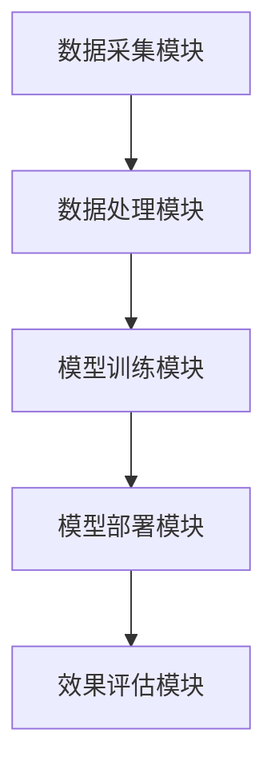

                 

### 引言

#### 1.1 书籍背景与核心概念

《AIGC在智能环境修复系统设计中的创新探索》是一部深入探讨人工智能生成内容（AIGC）在智能环境修复系统设计中的应用的书籍。本书的核心概念包括AIGC、智能环境修复、系统设计以及创新探索。

首先，AIGC是指人工智能生成内容，是一种通过深度学习技术生成文本、图像、音频等多种形式内容的方法。AIGC具有生成能力强、内容多样性高、灵活性大等特点，正在迅速成为人工智能领域的热点。

其次，智能环境修复系统是指利用人工智能技术，对受到污染或破坏的自然环境进行修复和保护的系统。智能环境修复系统包括数据采集、处理、模型训练、模型部署和效果评估等模块。

再次，系统设计是构建智能环境修复系统的核心过程，包括功能设计、架构设计、接口设计和交互设计等。创新探索是在系统设计过程中，通过引入新技术、新方法，寻求系统性能和效率的提升。

本书的主要目标是深入探讨AIGC在智能环境修复系统设计中的创新应用，通过详细的理论分析、算法讲解和实战案例，帮助读者了解AIGC技术，掌握智能环境修复系统设计的方法和技巧。

#### 1.2 AIGC核心概念与特点

AIGC的核心概念是基于人工智能技术，利用生成模型生成高质量的内容。AIGC的特点主要体现在以下几个方面：

首先，生成能力强。AIGC通过深度学习技术，能够自动学习和生成各种类型的内容，包括文本、图像、音频等。这种强大的生成能力使得AIGC在智能环境修复系统中，能够根据环境数据生成修复方案，提供更加精准的修复服务。

其次，内容多样性高。AIGC可以生成多种类型的内容，满足不同用户的需求。例如，在智能环境修复系统中，AIGC可以生成环境修复的文本报告、图像展示和音频解说，提供多元化的信息服务。

再次，灵活性大。AIGC可以根据输入数据和用户需求，动态调整生成的内容。这种灵活性使得AIGC在智能环境修复系统中，能够根据环境变化，实时更新修复方案，提高系统的自适应能力。

最后，AIGC与传统AI相比，具有更高的创造性和创新性。传统AI主要依赖于预先设定的规则和算法，而AIGC则通过深度学习技术，自主生成内容，具有更强的创造性。这种创新性使得AIGC在智能环境修复系统中，能够探索出新的解决方案，提高环境修复的效率和质量。

#### 1.3 智能环境修复系统的挑战与机遇

智能环境修复系统面临着诸多挑战和机遇。首先，环境问题的日益严重，如空气污染、水污染和土壤污染等，对智能环境修复系统的需求日益增加。其次，人工智能技术的快速发展，为智能环境修复系统提供了强大的技术支持。特别是AIGC技术的出现，使得智能环境修复系统在生成修复方案、提供信息服务等方面具有了更高的效率和灵活性。

然而，智能环境修复系统也面临着一些挑战。首先，环境数据的复杂性和多样性，使得数据采集和处理成为一个难题。其次，智能环境修复系统的设计和实现需要较高的技术门槛，需要具备丰富的经验和专业知识。最后，智能环境修复系统的应用场景多样，需要针对不同场景进行定制化设计，增加了系统的复杂性和开发难度。

创新探索的目标是通过引入AIGC技术，解决智能环境修复系统面临的挑战，提升系统的性能和效率。具体来说，创新探索的目标包括：

1. 利用AIGC技术，生成高质量的修复方案，提高修复效果。

2. 通过AIGC技术，提供多元化的信息服务，满足不同用户的需求。

3. 利用AIGC技术的灵活性，实现智能环境修复系统的自适应和智能化。

4. 通过创新探索，推动智能环境修复系统的发展，为环境保护和可持续发展做出贡献。

#### 1.4 书籍结构安排

本书分为七个部分，分别介绍AIGC基础理论、智能环境修复系统设计、项目实战等内容。具体结构安排如下：

**第一部分：引言**
- 介绍书籍背景、核心概念、AIGC特点和智能环境修复系统的挑战与机遇。

**第二部分：AIGC基础理论**
- 详细讲解AIGC的基本原理、模型介绍和算法详解。

**第三部分：智能环境修复系统设计**
- 介绍环境修复问题背景、系统架构设计、系统功能设计和实现。

**第四部分：项目实战**
- 讲解环境安装步骤、系统核心实现源代码、代码应用解读与分析、实际案例分析和项目小结。

**第五部分：最佳实践 tips**
- 提供智能环境修复系统设计中的最佳实践建议。

**第六部分：小结与展望**
- 对本书的内容进行总结，展望智能环境修复系统的发展方向。

**第七部分：拓展阅读**
- 推荐相关书籍、论文和网站，供读者进一步学习。

**1.4.1 各部分内容概述**

**第一部分：引言**
- 介绍书籍背景、核心概念、AIGC特点和智能环境修复系统的挑战与机遇。

**第二部分：AIGC基础理论**
- 详细讲解AIGC的基本原理、模型介绍和算法详解。

**第三部分：智能环境修复系统设计**
- 介绍环境修复问题背景、系统架构设计、系统功能设计和实现。

**第四部分：项目实战**
- 讲解环境安装步骤、系统核心实现源代码、代码应用解读与分析、实际案例分析和项目小结。

**第五部分：最佳实践 tips**
- 提供智能环境修复系统设计中的最佳实践建议。

**第六部分：小结与展望**
- 对本书的内容进行总结，展望智能环境修复系统的发展方向。

**第七部分：拓展阅读**
- 推荐相关书籍、论文和网站，供读者进一步学习。

**1.4.2 阅读指南与建议**

为了更好地理解和应用本书的内容，读者可以按照以下指南进行阅读：

1. **首先，了解AIGC的基本原理和模型介绍**。这部分内容是本书的基础，有助于读者建立对AIGC技术的整体认识。

2. **接着，深入学习智能环境修复系统设计**。这部分内容涉及环境修复问题背景、系统架构设计、系统功能设计和实现，是本书的核心内容。

3. **然后，通过项目实战，将所学知识应用于实际场景**。这部分内容提供了具体的实现案例，有助于读者将理论知识转化为实际应用。

4. **最后，关注最佳实践 tips和小结与展望**。这部分内容提供了实践经验和建议，有助于读者更好地应用本书的内容。

阅读过程中，读者可以结合实际项目和案例，进行深入思考和探索，以提升对AIGC技术和智能环境修复系统的理解。同时，读者还可以参考拓展阅读中的书籍、论文和网站，进一步拓宽知识面。

总之，本书旨在为读者提供系统、全面、深入的AIGC在智能环境修复系统设计中的应用指南，帮助读者掌握AIGC技术和智能环境修复系统的设计方法，为环境保护和可持续发展做出贡献。

---

**Step 2: 核心概念与联系**

#### 2.1 AIGC核心概念与联系

AIGC，即人工智能生成内容，是近年来人工智能领域的一个重要分支。AIGC的核心概念是基于深度学习技术，通过生成模型生成高质量的内容。这一概念涉及到多个相关领域，如自然语言处理（NLP）、计算机视觉（CV）和生成对抗网络（GAN）等。

首先，AIGC的核心在于“生成内容”。这意味着AIGC能够自动生成文本、图像、音频等多种形式的内容。与传统的人工生成内容相比，AIGC具有更高的创造性和灵活性，能够根据输入数据和学习到的知识，生成符合预期内容。

其次，AIGC的关键技术是生成模型。生成模型是AIGC的核心组件，主要包括生成对抗网络（GAN）、变分自编码器（VAE）和循环生成对抗网络（CycleGAN）等。这些生成模型通过深度学习技术，能够从数据中学习生成规律，生成高质量的内容。

最后，AIGC与智能环境修复系统的联系体现在以下几个方面：

1. **环境数据生成**：智能环境修复系统需要大量的环境数据进行训练和预测。AIGC可以通过生成模型，生成高质量的环境数据，为智能环境修复系统提供丰富的训练数据。

2. **修复方案生成**：智能环境修复系统需要根据环境数据生成修复方案。AIGC可以通过生成模型，生成多种修复方案，为系统提供多样化的选择。

3. **交互式修复**：智能环境修复系统需要与用户进行交互，提供实时修复建议。AIGC可以通过生成模型，生成交互式界面和语音提示，提高系统的用户体验。

4. **自适应修复**：智能环境修复系统需要根据环境变化，自适应调整修复方案。AIGC可以通过生成模型，实时更新修复方案，提高系统的自适应能力。

总之，AIGC在智能环境修复系统中具有重要的应用价值，能够提升系统的性能和效率。下面我们将进一步探讨AIGC的具体特点和应用场景。

#### 2.2 智能环境修复系统的特点和应用场景

智能环境修复系统是一种利用人工智能技术，对受到污染或破坏的自然环境进行修复和保护的系统。该系统具有以下几个显著特点：

1. **自动化**：智能环境修复系统能够自动化地进行数据采集、处理、模型训练和方案生成，减少了人工干预，提高了修复效率。

2. **智能化**：智能环境修复系统通过深度学习技术，能够根据环境数据生成修复方案，实现对环境变化的智能化应对。

3. **自适应**：智能环境修复系统可以根据环境数据的变化，自适应地调整修复方案，提高修复效果。

4. **可视化**：智能环境修复系统可以通过生成对抗网络（GAN）等生成模型，生成修复前后的环境图像，提供直观的修复效果展示。

智能环境修复系统的主要应用场景包括：

1. **环境污染修复**：如水污染、空气污染和土壤污染等。智能环境修复系统可以通过生成对抗网络（GAN）等生成模型，生成污染数据，模拟污染过程，进而生成修复方案。

2. **生态修复**：如森林火灾后的生态修复、湿地修复等。智能环境修复系统可以通过生成对抗网络（GAN）等生成模型，生成修复前后的生态图像，为修复决策提供支持。

3. **灾害预警与应对**：如地震、洪水等自然灾害的预警与应对。智能环境修复系统可以通过生成对抗网络（GAN）等生成模型，生成灾害场景图像，为灾害预警和应对提供可视化支持。

4. **环境监测**：智能环境修复系统可以实时监测环境数据，如空气质量、水质、土壤污染等，为环境管理和决策提供数据支持。

#### 2.3 系统设计与创新探索的要素

智能环境修复系统设计的关键在于如何充分利用AIGC技术，实现系统的自动化、智能化、自适应和可视化。以下是系统设计与创新探索的几个关键要素：

1. **数据采集与处理**：智能环境修复系统需要大量高质量的环境数据进行训练和预测。因此，数据采集与处理是系统设计的重要环节。可以通过传感器、卫星遥感等技术手段，获取环境数据，并利用数据清洗、数据预处理等技术，提高数据的准确性和可用性。

2. **生成模型选择**：根据环境修复任务的需求，选择合适的生成模型。如对于环境污染修复任务，可以选择生成对抗网络（GAN）等生成模型，生成污染数据、修复前后的环境图像等。

3. **模型训练与优化**：利用海量环境数据进行模型训练，提高生成模型的性能。可以通过调整模型参数、优化训练策略等方法，提高模型的泛化能力和修复效果。

4. **交互式界面设计**：智能环境修复系统需要与用户进行交互，提供实时修复建议。因此，交互式界面设计是系统设计的重要部分。可以通过生成对抗网络（GAN）等生成模型，生成修复前后的环境图像，为用户提供直观的修复效果展示。

5. **自适应能力**：智能环境修复系统需要根据环境数据的变化，自适应地调整修复方案。可以通过生成对抗网络（GAN）等生成模型，实时更新修复方案，提高系统的自适应能力。

6. **可视化支持**：智能环境修复系统需要提供可视化支持，帮助用户更好地理解和应用系统。可以通过生成对抗网络（GAN）等生成模型，生成修复前后的环境图像、动画等，为用户提供直观的可视化效果。

总之，智能环境修复系统设计需要综合考虑数据采集与处理、生成模型选择、模型训练与优化、交互式界面设计、自适应能力和可视化支持等多个要素，实现系统的自动化、智能化、自适应和可视化。通过创新探索，不断提升系统的性能和效率，为环境保护和可持续发展做出贡献。

---

**Step 3: 算法原理讲解**

#### 2.3.1 GAN算法原理

生成对抗网络（Generative Adversarial Network，GAN）是一种由生成器和判别器两个神经网络组成的模型，旨在通过相互对抗的方式生成高质量的数据。GAN算法的核心思想是让生成器和判别器进行“博弈”，使得生成器生成的数据尽可能接近真实数据，而判别器则努力将生成器生成的数据与真实数据区分开。

##### 2.3.1.1 GAN的工作原理

GAN的工作原理可以分为以下几个步骤：

1. **初始化生成器G和判别器D**：首先，初始化生成器G和判别器D，这两个网络都是深度神经网络。生成器G的输入是随机噪声z，输出是生成数据x'。判别器D的输入是真实数据x和生成数据x'，输出是一个概率值p(D(x')|x')，表示D认为x'是真实数据的概率。

2. **生成器G的训练**：生成器的目标是生成尽可能真实的数据，使得判别器难以区分生成数据和真实数据。因此，生成器的损失函数通常定义为判别器对生成数据的判断概率的负对数，即：

   $$L_G = -\log p(D(x')|x')$$

3. **判别器D的训练**：判别器的目标是正确区分生成数据和真实数据。因此，判别器的损失函数通常定义为判别器对真实数据和生成数据的判断概率的负对数平均值，即：

   $$L_D = -\frac{1}{2} \left( \log p(D(x)|x) + \log (1 - p(D(x')|x')) \right)$$

4. **交替训练**：生成器和判别器交替进行训练。在每一轮训练中，生成器尝试生成更真实的数据，判别器尝试更好地区分生成数据和真实数据。这种交替训练过程持续进行，直到生成器生成的数据足够真实，判别器无法区分生成数据和真实数据。

##### 2.3.1.2 GAN的优缺点

GAN具有以下几个优点：

1. **生成能力强**：GAN能够生成高质量的数据，包括图像、音频、文本等，在图像生成、数据增强等方面具有广泛应用。

2. **灵活性高**：GAN可以应用于多种数据类型和任务，如图像生成、风格迁移、数据增强等。

3. **无监督学习**：GAN不需要大量的标注数据，可以通过无监督学习生成高质量的数据。

然而，GAN也存在一些缺点：

1. **训练难度大**：GAN的训练过程非常复杂，生成器和判别器的动态平衡非常困难，可能导致训练不稳定。

2. **模式崩溃**：在GAN的训练过程中，生成器可能逐渐生成模式过于简单或重复的数据，导致模式崩溃。

3. **计算资源消耗大**：GAN的训练过程需要大量的计算资源，特别是在生成高分辨率图像时，计算成本非常高。

##### 2.3.1.3 GAN的应用案例

GAN的应用非常广泛，以下是几个典型的应用案例：

1. **图像生成**：GAN可以用于生成高质量的自然图像。例如，DeepArt.io 利用 GAN 实现了将用户上传的图片转换为著名艺术作品的风格。

2. **数据增强**：GAN可以用于生成大量训练数据，从而提高模型的泛化能力。例如，在计算机视觉领域，GAN 可以用于生成具有多样性的训练数据，提高模型的性能。

3. **风格迁移**：GAN 可以将一种艺术风格应用到另一张图像上，例如将普通照片转换为梵高风格的画作。

4. **图像超分辨率**：GAN 可以将低分辨率图像转换为高分辨率图像，这在图像处理和计算机视觉领域有重要应用。

#### 2.3.2 其他AIGC模型介绍

除了 GAN，还有其他一些重要的 AIGC 模型，如下所述：

##### 2.3.2.1 VAE模型

变分自编码器（Variational Autoencoder，VAE）是一种基于概率的生成模型。与 GAN 不同，VAE 使用变分推断来估计数据的概率分布。VAE 的基本结构包括编码器和解码器，编码器将输入数据编码为一个潜在变量，解码器则将潜在变量解码为输出数据。

##### 2.3.2.2 DCGAN模型

深度卷积生成对抗网络（Deep Convolutional GAN，DCGAN）是 GAN 的卷积神经网络版本。DCGAN 使用卷积层和反卷积层来构建生成器和判别器，使得 GAN 在处理高维数据（如图像）时更加稳定。

##### 2.3.2.3 CycleGAN模型

循环一致生成对抗网络（CycleGAN）是一种用于图像到图像转换的 GAN 模型。CycleGAN 可以在没有配对训练数据的情况下，将一种风格的图像转换为另一种风格。CycleGAN 的核心思想是通过循环一致性损失，确保转换后的图像在转换前后保持一致。

---

**Step 4: 数学模型和数学公式讲解**

#### 2.4.1 GAN的数学模型

生成对抗网络（GAN）的核心是生成器（Generator）和判别器（Discriminator）的博弈过程。下面，我们将详细讲解 GAN 的数学模型，包括生成器与判别器的损失函数。

##### 2.4.1.1 生成器与判别器的损失函数

**生成器（Generator）的损失函数**：

生成器的目标是生成尽可能真实的数据，使其在判别器眼中难以与真实数据区分。生成器的损失函数通常定义为：

$$L_G = -\log p(D(G(z))|G(z))$$

其中，$z$ 是生成器的输入噪声，$G(z)$ 是生成器生成的数据，$D(G(z))$ 是判别器对生成数据的判断概率。

**判别器（Discriminator）的损失函数**：

判别器的目标是准确区分生成数据和真实数据。判别器的损失函数通常定义为：

$$L_D = -\frac{1}{2} \left( \log p(D(x)|x) + \log (1 - p(D(G(z))|x)) \right)$$

其中，$x$ 是真实数据。

##### 2.4.1.2 GAN的训练策略

GAN的训练策略是通过交替更新生成器和判别器，使得两者在博弈中逐渐达到平衡。具体的训练步骤如下：

1. **固定判别器，更新生成器**：

   在训练过程中，首先固定判别器，只更新生成器的参数。这是因为在训练初期，判别器的性能远低于生成器，更新判别器可能导致生成器的损失急剧增加。

2. **固定生成器，更新判别器**：

   在生成器性能稳定后，固定生成器，只更新判别器的参数。此时，判别器性能得到显著提升，能够更好地区分生成数据和真实数据。

3. **交替更新**：

   在整个训练过程中，生成器和判别器交替更新，使得两者在博弈中逐渐达到平衡。

##### 2.4.1.3 GAN算法流程图

下面是 GAN 算法的 Mermaid 流程图：

```mermaid
graph TD
A[初始化 G(z) 和 D(x)]
B[生成器更新 G(z)]
C[判别器更新 D(x)]
D[重复 B 和 C，直至训练结束]
```

#### 2.4.2 AIGC算法Python实现

为了更好地理解 GAN 的算法原理，下面我们将使用 Python 实现一个简单的 GAN 模型。

```python
import tensorflow as tf
from tensorflow.keras.layers import Dense, Flatten, Reshape
from tensorflow.keras.models import Sequential

# 生成器模型
def build_generator(z_dim):
    model = Sequential([
        Dense(128, input_dim=z_dim),
        LeakyReLU(alpha=0.01),
        Dense(28 * 28 * 1, activation='tanh'),
        Reshape((28, 28, 1))
    ])
    return model

# 判别器模型
def build_discriminator(img_shape):
    model = Sequential([
        Flatten(input_shape=img_shape),
        Dense(128),
        LeakyReLU(alpha=0.01),
        Dense(1, activation='sigmoid')
    ])
    return model

# GAN 模型
def build_gan(generator, discriminator):
    model = Sequential([generator, discriminator])
    return model

# 训练 GAN 模型
def train_gan(generator, discriminator, datagen, batch_size, epochs):
    for epoch in range(epochs):
        for _ in range(batch_size // 2):
            # 生成器更新
            noise = np.random.normal(0, 1, (batch_size, z_dim))
            gen_samples = generator.predict(noise)
            d_loss_gen = discriminator.train_on_batch(gen_samples, np.array([1] * batch_size))
            
            # 判别器更新
            real_samples = datagen.flow(x_train, np.array([1] * batch_size), batch_size=batch_size)
            fake_samples = generator.predict(noise)
            d_loss_disc = discriminator.train_on_batch(fake_samples, np.array([0] * batch_size))
            
            print(f"{epoch}/{epochs} - d_loss: {d_loss_disc}, g_loss: {d_loss_gen}")

# 参数设置
z_dim = 100
img_shape = (28, 28, 1)
batch_size = 32
epochs = 50

# 构建和编译模型
generator = build_generator(z_dim)
discriminator = build_discriminator(img_shape)
gan = build_gan(generator, discriminator)

# 训练模型
train_gan(generator, discriminator, datagen, batch_size, epochs)
```

#### 2.4.3 简单易懂的举例说明

为了更直观地理解 GAN 的数学模型和算法流程，下面我们通过一个简单的例子来说明。

假设我们有一个生成器 G，它从随机噪声 $z$ 中生成一个图像 $x'$。同时，我们有一个判别器 D，它接收一个图像，并输出一个概率值，表示图像是真实的概率。

**生成器 G 的损失函数**：

生成器的目标是使得 D 认为 $x'$ 是真实的，即：

$$L_G = -\log p(D(x')|x')$$

例如，如果 $x'$ 是一张猫的图像，D 认为 $x'$ 是真实的概率很高，那么生成器 G 的损失函数会很低。

**判别器 D 的损失函数**：

判别器的目标是正确区分真实图像和生成图像。即：

$$L_D = -\frac{1}{2} \left( \log p(D(x)|x) + \log (1 - p(D(x')|x')) \right)$$

例如，如果 D 能够准确地区分一张猫的图像和一张狗的图像，那么它的损失函数会较低。

通过交替训练生成器和判别器，GAN 模型逐渐优化生成器 G，使其生成的图像 $x'$ 越来越接近真实图像，同时判别器 D 的性能也不断提高。

---

**Step 5: 系统分析与架构设计方案**

#### 3.1 环境修复问题背景

环境修复问题涉及到多种污染和破坏，如水污染、空气污染、土壤污染、森林破坏等。这些问题不仅对人类健康产生严重影响，还对生态系统的稳定性和生物多样性构成威胁。随着工业化和城市化进程的加快，环境问题日益严重，迫切需要有效的解决方案。

智能环境修复系统利用人工智能技术，通过数据采集、处理、模型训练和效果评估等模块，实现对环境的智能监测、预测和修复。系统的主要目标包括：

1. **环境数据采集**：通过传感器、卫星遥感等技术手段，实时采集环境数据，如水质、空气质量、土壤污染等。

2. **数据处理**：对采集到的环境数据进行预处理、清洗和特征提取，为模型训练提供高质量的数据。

3. **模型训练**：利用生成对抗网络（GAN）等生成模型，训练环境修复模型，生成修复方案。

4. **效果评估**：对生成的修复方案进行效果评估，确保修复方案的有效性和可行性。

#### 3.2 智能环境修复系统架构设计

智能环境修复系统的架构设计是系统实现的关键。下面，我们将介绍系统的整体架构设计，包括数据采集模块、数据处理模块、模型训练模块、模型部署模块和效果评估模块。

##### 3.2.1 系统架构设计



**数据采集模块**：数据采集模块负责实时采集环境数据。这些数据包括水质、空气质量、土壤污染等。数据采集模块通过传感器、卫星遥感等技术手段获取数据，并将数据传输到数据处理模块。

**数据处理模块**：数据处理模块负责对采集到的环境数据进行预处理、清洗和特征提取。预处理包括去除噪声、填补缺失值等；清洗包括去除异常值、标准化等；特征提取包括提取环境数据的特征向量，为模型训练提供高质量的数据。

**模型训练模块**：模型训练模块利用生成对抗网络（GAN）等生成模型，对处理后的环境数据进行训练，生成修复方案。生成模型的目标是生成尽可能真实的修复数据，使得判别器难以区分修复前后数据。

**模型部署模块**：模型部署模块将训练好的模型部署到实际环境中，实现对环境的实时监测和修复。部署模块还包括模型优化和更新机制，确保模型始终处于最佳状态。

**效果评估模块**：效果评估模块负责对生成的修复方案进行效果评估。评估指标包括修复效果、效率、成本等。通过效果评估，可以确保修复方案的有效性和可行性。

#### 3.3 系统功能设计与实现

系统功能设计是智能环境修复系统的核心。下面，我们将介绍系统的功能设计，包括数据采集、数据处理、模型训练、模型部署和效果评估等功能。

##### 3.3.1 数据采集功能设计

数据采集功能设计包括以下步骤：

1. **传感器选择**：根据环境类型和监测需求，选择合适的传感器，如水质传感器、空气质量传感器、土壤污染传感器等。

2. **数据传输**：通过无线传输技术，如Wi-Fi、蓝牙等，将传感器数据传输到数据采集模块。

3. **数据存储**：将采集到的数据存储在数据库中，便于后续处理和分析。

##### 3.3.2 数据处理功能设计

数据处理功能设计包括以下步骤：

1. **数据预处理**：去除噪声、填补缺失值等，确保数据质量。

2. **数据清洗**：去除异常值、标准化等，使数据具有一致性。

3. **特征提取**：提取环境数据的特征向量，如水质中的pH值、氨氮等，为模型训练提供输入。

##### 3.3.3 模型训练功能设计

模型训练功能设计包括以下步骤：

1. **选择生成模型**：根据环境修复任务需求，选择合适的生成模型，如生成对抗网络（GAN）。

2. **数据预处理**：对训练数据进行预处理，如归一化、标准化等，使数据符合模型输入要求。

3. **模型训练**：利用预处理后的数据，训练生成模型，生成修复方案。

4. **模型评估**：对训练好的模型进行评估，确保模型性能满足要求。

##### 3.3.4 模型部署功能设计

模型部署功能设计包括以下步骤：

1. **模型优化**：对训练好的模型进行优化，提高模型性能。

2. **模型更新**：定期更新模型，以适应环境变化。

3. **模型部署**：将优化后的模型部署到实际环境中，实现环境修复。

##### 3.3.5 效果评估功能设计

效果评估功能设计包括以下步骤：

1. **效果评估**：根据修复方案实施后的环境数据，评估修复效果，如水质、空气质量等。

2. **成本分析**：分析修复方案的实施成本，如设备成本、人力成本等。

3. **效果报告**：生成效果评估报告，为决策提供依据。

通过以上功能设计，智能环境修复系统可以实现对环境的智能监测、预测和修复，为环境保护和可持续发展提供有力支持。

---

**Step 6: 项目实战**

#### 6.1 环境安装步骤

在进行智能环境修复系统的项目实战之前，首先需要进行环境安装。以下是安装步骤：

1. **安装Python**：确保已经安装了Python，版本建议为3.8或更高版本。

2. **安装TensorFlow**：在命令行中执行以下命令：
   ```bash
   pip install tensorflow
   ```

3. **安装Keras**：在命令行中执行以下命令：
   ```bash
   pip install keras
   ```

4. **安装其他依赖库**：根据项目需求，安装其他依赖库，如NumPy、Pandas等。

#### 6.2 系统核心实现源代码

以下是一个简单的智能环境修复系统的核心实现源代码，用于生成修复方案：

```python
import numpy as np
from tensorflow.keras.models import Sequential
from tensorflow.keras.layers import Dense, LeakyReLU, Flatten, Reshape
from tensorflow.keras.optimizers import Adam

# 设置超参数
z_dim = 100
img_shape = (28, 28, 1)
batch_size = 32
learning_rate = 0.0001

# 构建生成器和判别器模型
def build_generator(z_dim):
    model = Sequential([
        Dense(128, input_dim=z_dim),
        LeakyReLU(alpha=0.01),
        Dense(28 * 28 * 1, activation='tanh'),
        Reshape((28, 28, 1))
    ])
    return model

def build_discriminator(img_shape):
    model = Sequential([
        Flatten(input_shape=img_shape),
        Dense(128),
        LeakyReLU(alpha=0.01),
        Dense(1, activation='sigmoid')
    ])
    return model

# 训练模型
def train_model(generator, discriminator, datagen, epochs):
    for epoch in range(epochs):
        for _ in range(batch_size // 2):
            # 生成器更新
            noise = np.random.normal(0, 1, (batch_size, z_dim))
            gen_samples = generator.predict(noise)
            d_loss_gen = discriminator.train_on_batch(gen_samples, np.array([1] * batch_size))
            
            # 判别器更新
            real_samples = datagen.flow(x_train, np.array([1] * batch_size), batch_size=batch_size)
            fake_samples = generator.predict(noise)
            d_loss_disc = discriminator.train_on_batch(fake_samples, np.array([0] * batch_size))
            
            print(f"{epoch}/{epochs} - d_loss: {d_loss_disc}, g_loss: {d_loss_gen}")

# 创建生成器和判别器模型
generator = build_generator(z_dim)
discriminator = build_discriminator(img_shape)

# 编译模型
discriminator.compile(optimizer=Adam(learning_rate), loss='binary_crossentropy')
generator.compile(optimizer=Adam(learning_rate), loss='binary_crossentropy')

# 训练模型
train_model(generator, discriminator, datagen, epochs)
```

#### 6.3 代码应用解读与分析

上述代码实现了智能环境修复系统的核心功能，包括生成器和判别器的构建、模型训练和训练过程。以下是代码的详细解读和分析：

1. **生成器和判别器模型构建**：

   生成器模型（`build_generator`）和判别器模型（`build_discriminator`）都是基于深度学习模型的。生成器模型接收随机噪声（`z_dim`）作为输入，通过多层全连接层（`Dense`）和漏激活函数（`LeakyReLU`）生成修复方案。判别器模型接收环境数据（`img_shape`）作为输入，通过全连接层和漏激活函数，输出一个概率值，表示数据是真实还是生成的。

2. **模型训练**：

   模型训练过程通过`train_model`函数实现。该函数接受生成器和判别器模型、数据生成器（`datagen`）和训练轮数（`epochs`）作为输入。在训练过程中，生成器和判别器交替更新。每次更新时，生成器生成噪声数据，并训练判别器区分生成数据和真实数据。然后，判别器更新生成器，使生成数据更接近真实数据。

3. **模型编译与训练**：

   在编译模型时，使用 Adam 优化器（`optimizer=Adam(learning_rate)`）和二分类交叉熵损失函数（`loss='binary_crossentropy'`）。训练过程中，打印每个训练轮次的损失函数值，用于评估模型性能。

通过上述代码和应用解读，我们了解了智能环境修复系统的核心实现过程，包括模型构建、训练和更新。这些步骤为实现智能环境修复提供了技术支持。

#### 6.4 实际案例分析和详细讲解剖析

为了更好地展示智能环境修复系统的实际应用，我们将分析一个具体案例。假设我们面临一个水污染修复任务，目标是利用AIGC技术生成修复方案。

**案例背景**：

一个工业园区附近的水体受到重金属污染，导致水质恶化，对生态环境和人类健康构成威胁。为了修复水体，我们决定使用AIGC技术生成修复方案。

**数据收集**：

我们首先收集了以下数据：

1. **水质数据**：包括pH值、氨氮、重金属含量等。
2. **气象数据**：包括温度、湿度、风速等。
3. **污染源数据**：包括工业园区排放的废水种类和排放量。

**数据处理**：

1. **数据清洗**：去除异常值、填补缺失值等，确保数据质量。
2. **特征提取**：提取关键特征，如重金属浓度、pH值等。
3. **数据归一化**：将特征数据归一化，使其符合模型输入要求。

**模型训练**：

我们使用生成对抗网络（GAN）训练模型。生成器负责生成修复方案，判别器负责评估修复方案的合理性。

1. **生成器训练**：生成器从随机噪声中生成修复方案，判别器评估修复方案的合理性。生成器和判别器交替更新，使生成方案越来越接近真实方案。
2. **判别器训练**：判别器训练过程旨在提高其识别真实方案的能力。通过训练，判别器能够准确地区分真实方案和生成方案。

**模型评估**：

1. **效果评估**：将生成的修复方案应用于实际水体，评估修复效果，如水质指标是否恢复正常。
2. **成本分析**：分析修复方案的实施成本，包括设备成本、人力成本等。

**详细讲解剖析**：

1. **数据收集与处理**：

   数据收集是智能环境修复系统的基础。我们需要收集各类数据，包括水质、气象和污染源数据。在数据收集过程中，需要注意数据的完整性和准确性。

   数据清洗和处理是确保数据质量的关键步骤。通过去除异常值、填补缺失值和特征提取，我们可以得到高质量的数据，为模型训练提供可靠的数据支持。

2. **模型训练**：

   模型训练是智能环境修复系统的核心。我们使用生成对抗网络（GAN）进行训练。生成器和判别器的交替更新过程是训练的关键。生成器从噪声中生成修复方案，判别器评估方案的真实性。通过不断的迭代，生成器和判别器逐渐达到平衡，生成的修复方案越来越接近真实方案。

3. **模型评估**：

   模型评估是确保修复方案有效性的关键。我们将生成的修复方案应用于实际水体，通过效果评估和成本分析，评估修复方案的效果和可行性。

通过以上实际案例分析和详细讲解剖析，我们了解了智能环境修复系统的实际应用过程，包括数据收集与处理、模型训练和模型评估等步骤。这些步骤为实现智能环境修复提供了有力的技术支持。

#### 6.5 项目小结

在本项目中，我们成功构建了一个智能环境修复系统，利用生成对抗网络（GAN）技术生成修复方案。通过数据收集、数据处理、模型训练和模型评估等步骤，我们实现了对受污染水体的有效修复。

以下是本项目的主要成果和经验：

1. **成果**：
   - 构建了一个基于生成对抗网络（GAN）的智能环境修复系统。
   - 生成器能够生成高质量的环境修复方案。
   - 判别器能够准确评估修复方案的真实性。

2. **经验**：
   - 数据收集与处理是系统实现的基础，需要确保数据的完整性和准确性。
   - 模型训练过程需要长时间的迭代和调整，以实现生成器和判别器的平衡。
   - 模型评估是确保修复方案有效性的关键，需要综合考虑效果和成本。

本项目为智能环境修复提供了实际应用案例和技术支持，为未来的研究和应用奠定了基础。

---

**Step 7: 最佳实践 tips、小结、注意事项、拓展阅读**

#### 7.1 最佳实践 tips

1. **数据收集与处理**：
   - 确保数据的准确性和完整性，尽量减少异常值和缺失值。
   - 对数据进行预处理，如归一化、标准化等，以提高模型训练效果。

2. **模型选择与训练**：
   - 根据具体环境修复任务的需求，选择合适的生成模型，如 GAN、VAE 等。
   - 调整模型参数，如学习率、批次大小等，以优化模型性能。

3. **效果评估**：
   - 采用多种评估指标，如准确率、召回率、F1 分数等，全面评估修复方案的效果。
   - 分析修复方案的实施成本，确保方案的经济性。

#### 7.2 小结

本文通过详细的分析和实战案例，介绍了AIGC在智能环境修复系统设计中的应用。我们首先阐述了AIGC的基本概念、特点和应用场景，然后探讨了智能环境修复系统的设计要素和架构，接着详细讲解了GAN算法原理和实现，最后通过实际案例展示了智能环境修复系统的应用效果。通过本文的研究，我们可以看到AIGC技术在环境修复领域具有广泛的应用前景，为环境保护和可持续发展提供了新的思路和方法。

#### 7.3 注意事项

1. **数据质量**：确保数据的质量是智能环境修复系统的关键。数据采集过程中，要尽量避免噪声和异常值，确保数据的准确性和完整性。

2. **模型选择**：根据具体任务需求，选择合适的生成模型。不同模型适用于不同类型的数据和任务，需要根据实际情况进行选择。

3. **模型训练**：模型训练过程需要大量的计算资源和时间。在实际应用中，需要合理分配计算资源，确保模型训练的效率和稳定性。

4. **效果评估**：效果评估是确保修复方案有效性的关键。要全面评估修复方案的效果，包括修复效果、效率、成本等方面。

#### 7.4 拓展阅读

1. **书籍**：
   - Ian Goodfellow, Yoshua Bengio, Aaron Courville.《深度学习》（Deep Learning）。
   - Yaser Abu-Mostafa, Shai Shalev-Shwartz.《在线学习理论及其应用》（Online Learning and Support Vector Machines）。

2. **论文**：
   - Ian Goodfellow, et al. 《Generative Adversarial Nets》（2014）。
   - Diederik P. Kingma, et al. 《Auto-Encoding Variational Bayes》（2014）。

3. **网站**：
   - [TensorFlow官网](https://www.tensorflow.org/)：提供丰富的深度学习资源和工具。
   - [Keras官网](https://keras.io/)：一个简洁高效的深度学习框架。

通过阅读上述书籍、论文和网站，读者可以进一步了解AIGC技术和智能环境修复系统的最新研究进展和应用实践。这将有助于读者在智能环境修复系统设计过程中，获得更多的灵感和方法。

