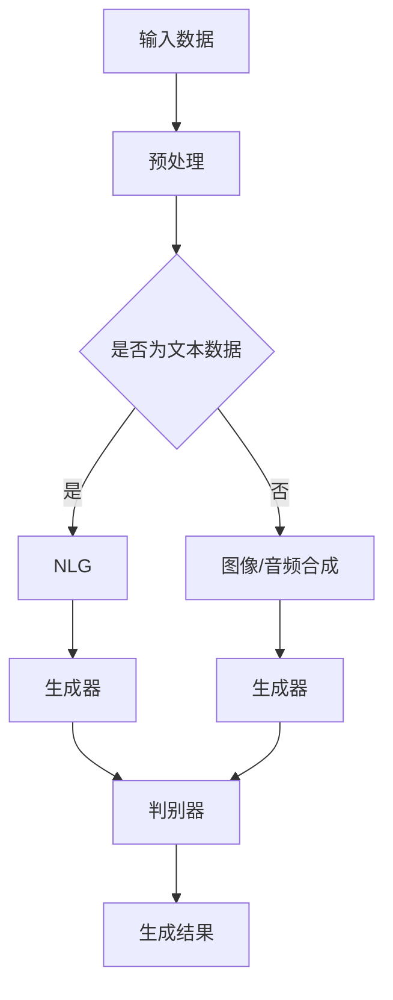
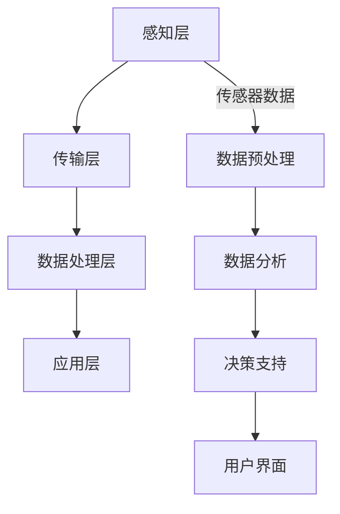
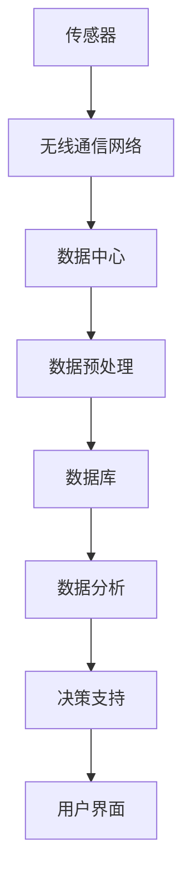

                 

### 引言

在当今快速发展的信息化社会中，环境监测系统作为公共安全和环境保护的重要工具，发挥着日益重要的作用。然而，随着监测数据量的急剧增加和数据种类的复杂化，传统的方法已经难以满足高效、精确的环境监测需求。人工智能（AI）技术的引入，为环境监测系统带来了新的机遇和挑战。AIGC（AI-assisted Generation of Content）技术的出现，更是为智能环境监测系统的创新提供了强有力的技术支持。

AIGC，即人工智能辅助内容生成，是指利用AI技术自动生成文字、图像、音频、视频等内容的一种新兴技术。其核心在于通过深度学习和自然语言处理等技术，实现从原始数据到有价值信息的自动化转换。AIGC技术在智能环境监测系统中的应用，主要体现在以下几个方面：

1. **数据采集与处理**：利用AIGC技术，可以自动采集并处理大量的环境数据，包括空气质量、水质、土壤成分等。这些数据通过AIGC技术处理后，可以生成更加直观、易理解的环境报告。

2. **异常检测与预警**：通过对监测数据的持续分析，AIGC技术能够及时发现异常情况，并发出预警。例如，在空气质量监测中，AIGC技术可以预测何时会出现污染高峰，从而提前采取措施。

3. **智能决策支持**：AIGC技术可以帮助环境监测系统实现智能决策。通过对历史数据和实时数据的分析，系统能够为环境管理者提供最优的治理方案。

本文将详细探讨AIGC技术在智能环境监测系统中的应用，分析其技术实现、面临的挑战以及未来的发展趋势。通过一步步的推理和思考，我们将揭示AIGC技术在智能环境监测领域中的巨大潜力和广阔前景。

### 关键词

- AIGC
- 智能环境监测系统
- 数据采集
- 异常检测
- 预测分析
- 智能决策

### 摘要

本文探讨了AIGC技术在智能环境监测系统中的创新应用。首先，我们介绍了AIGC技术的基本概念和它在环境监测领域的应用前景。接着，分析了智能环境监测系统的现状和面临的挑战，强调了AIGC技术在其中的关键作用。随后，详细讲解了AIGC技术在数据采集、异常检测和智能决策支持等方面的实现方法和原理。通过具体案例研究，我们展示了AIGC技术在智能环境监测系统中的实际效果。最后，讨论了AIGC技术在应用过程中面临的技术挑战和未来研究方向，为智能环境监测系统的进一步发展提供了有益的参考。

### 第一部分：AIGC技术概述

#### 第1章：AIGC技术概述

AIGC（AI-assisted Generation of Content）技术，即人工智能辅助内容生成技术，是近年来在人工智能领域崭露头角的一种前沿技术。它通过深度学习、自然语言处理、图像识别等技术手段，实现了从原始数据到有价值信息的自动化转换。AIGC技术的出现，不仅丰富了人工智能的应用场景，也为各个领域的智能化转型提供了强有力的支持。

#### 1.1 AIGC的定义与演进

AIGC技术可以简单定义为：利用人工智能技术自动生成高质量的内容。它涵盖了多种技术手段，包括自然语言生成（NLG）、图像生成、音频合成等。AIGC的核心在于“生成”，即通过机器学习模型自动生成符合人类需求的内容。

AIGC技术的发展经历了几个重要阶段：

1. **早期阶段**：以数据驱动的方式为主，通过简单的规则和统计方法进行内容生成，如文本摘要、关键词提取等。
2. **中期阶段**：引入深度学习技术，特别是生成对抗网络（GAN）和变分自编码器（VAE），使得内容生成的质量和多样性得到了显著提升。
3. **现阶段**：随着深度学习和自然语言处理技术的进一步发展，AIGC技术已经能够生成更加复杂和贴近人类需求的内容，如高质量的文章、图片、音频等。

#### 1.2 AIGC的关键特性与应用场景

AIGC技术具有以下几个关键特性：

1. **自动化**：AIGC技术能够自动从原始数据中生成内容，减少了人工干预的环节，提高了效率。
2. **高质量**：通过深度学习和自然语言处理技术，AIGC生成的内容具有较高的质量和准确性。
3. **多样性**：AIGC技术能够生成多种类型的内容，如文本、图像、音频等，满足不同场景的需求。

AIGC技术的应用场景非常广泛，主要包括：

1. **内容创作**：在新闻、文学、广告等领域，AIGC技术能够自动生成高质量的文章、图片、视频等内容。
2. **数据增强**：在机器学习领域，AIGC技术可以生成大量模拟数据，用于训练和测试模型，提高模型的泛化能力。
3. **智能客服**：在智能客服系统中，AIGC技术可以自动生成回答，提高客服效率和用户体验。
4. **智能环境监测**：在环境监测领域，AIGC技术可以自动处理大量的环境数据，生成直观的环境报告，帮助管理者进行决策。

通过上述分析，我们可以看到AIGC技术在智能环境监测系统中的巨大潜力。接下来，我们将进一步探讨智能环境监测系统的基本概念和现状。

#### 第2章：智能环境监测系统基础

智能环境监测系统是一种利用先进传感器技术、数据采集与处理技术以及人工智能算法，对环境参数进行实时监测和分析的系统。这种系统在公共安全、环境保护、城市规划等领域发挥着重要作用。

#### 2.1 智能环境监测系统的组成

智能环境监测系统主要由以下几个部分组成：

1. **传感器网络**：这是系统的感知层，包括各种环境传感器，如空气质量传感器、水质传感器、土壤传感器等。这些传感器可以实时采集环境数据，并将数据传输到系统中心。

2. **数据采集与处理单元**：这部分负责将传感器采集到的原始数据进行预处理，包括去噪、滤波、数据清洗等，以确保数据的准确性和可靠性。

3. **数据处理与分析模块**：这部分利用人工智能算法对预处理后的数据进行深度分析，生成环境监测报告、预警信息等。

4. **用户界面**：用户界面是系统的交互层，通过图形化界面展示环境数据和分析结果，方便用户进行监控和决策。

#### 2.2 智能环境监测系统的工作原理

智能环境监测系统的工作原理可以概括为以下几个步骤：

1. **数据采集**：通过传感器网络实时采集环境数据，如温度、湿度、空气质量指数（AQI）、水质参数等。

2. **数据传输**：传感器采集到的数据通过无线通信网络（如Wi-Fi、LoRa、NB-IoT等）传输到数据中心。

3. **数据预处理**：在数据中心，对传输过来的数据进行预处理，包括去噪、滤波、数据清洗等，确保数据的准确性和可靠性。

4. **数据分析**：利用人工智能算法对预处理后的数据进行分析，如使用机器学习模型进行趋势分析、异常检测等。

5. **结果输出**：分析结果通过用户界面展示给用户，包括实时监测数据、环境报告、预警信息等。

6. **决策支持**：系统还可以为环境管理者提供决策支持，如根据监测数据提出环境保护措施、应急预案等。

#### 2.3 智能环境监测系统的发展趋势

随着技术的不断进步，智能环境监测系统也在不断发展，主要趋势包括：

1. **高精度传感器**：开发更高精度、更稳定的环境传感器，提高监测数据的准确性。

2. **大数据分析**：利用大数据技术和人工智能算法，对大量环境数据进行深度分析，发现潜在的环境问题。

3. **实时预警**：通过实时数据分析，提前发现环境异常，及时发出预警，减少环境灾害损失。

4. **智能化决策支持**：利用机器学习和数据挖掘技术，为环境管理者提供更加智能的决策支持，提高环境治理效果。

5. **物联网（IoT）融合**：将智能环境监测系统与物联网技术融合，实现跨区域、跨系统的数据共享和协同监测。

通过上述分析，我们可以看到智能环境监测系统在环境监测领域的重要性和广阔的应用前景。接下来，我们将探讨AIGC技术在智能环境监测系统中的具体应用。

### 第3章：AIGC在智能环境监测系统中的应用

AIGC技术在智能环境监测系统中的应用，极大地提升了系统的智能化水平和数据处理能力。通过AIGC技术，系统可以自动生成高质量的环境监测报告，实现实时预警和智能决策支持，为环境保护和管理提供了有力的工具。

#### 3.1 AIGC与智能环境监测的结合点

AIGC技术与智能环境监测系统的结合主要体现在以下几个方面：

1. **数据采集与预处理**：AIGC技术可以自动采集和处理大量的环境数据，包括空气质量、水质、土壤成分等。通过对这些数据进行预处理，如去噪、滤波、数据清洗等，确保数据的准确性和可靠性。

2. **异常检测与预警**：AIGC技术可以利用深度学习模型对监测数据进行分析，及时发现异常情况并发出预警。例如，在空气质量监测中，AIGC技术可以预测何时会出现污染高峰，从而提前采取措施。

3. **智能决策支持**：AIGC技术通过对历史数据和实时数据的分析，可以为环境管理者提供智能化的决策支持。例如，在水资源管理中，AIGC技术可以预测未来几个月的水质变化，提出最优的水资源分配方案。

4. **内容生成与报告制作**：AIGC技术可以自动生成环境监测报告，包括数据可视化、趋势分析、异常报告等。这些报告不仅直观易懂，而且可以自动更新，提高监测系统的透明度和可操作性。

#### 3.2 AIGC在数据采集与分析中的应用

在数据采集与分析方面，AIGC技术的应用主要体现在以下几个方面：

1. **自动数据采集**：AIGC技术可以通过深度学习模型自动识别并采集环境数据，如空气质量、水质、土壤成分等。这种自动化的数据采集方式，不仅提高了采集效率，还减少了人力成本。

2. **数据预处理**：AIGC技术可以对采集到的原始数据进行预处理，如去噪、滤波、数据清洗等。这些预处理步骤确保了数据的准确性和可靠性，为后续的数据分析奠定了基础。

3. **数据可视化**：通过AIGC技术，可以将复杂的环境数据转化为直观的可视化图表，如折线图、饼图、热力图等。这些可视化图表不仅帮助环境管理者更好地理解数据，还可以用于向公众传达环境信息。

4. **趋势分析**：AIGC技术可以利用机器学习算法对历史数据进行分析，预测未来的环境变化趋势。这种趋势分析可以为环境管理者提供重要的决策依据。

#### 3.3 AIGC在异常检测与预警中的应用

在异常检测与预警方面，AIGC技术具有显著的优势：

1. **实时异常检测**：AIGC技术可以通过实时数据分析，快速发现环境异常。例如，在空气质量监测中，AIGC技术可以实时监测空气质量指数（AQI），一旦发现异常，立即发出预警。

2. **多指标综合预警**：AIGC技术可以将多个环境指标（如温度、湿度、空气质量、水质等）进行综合分析，提供更全面、更准确的预警信息。

3. **自适应预警**：AIGC技术可以根据环境数据的变化，自适应调整预警阈值。这种自适应预警机制，可以提高预警的准确性和可靠性。

4. **联动预警**：AIGC技术可以实现不同监测站点之间的数据联动，当某个站点出现异常时，立即触发其他相关站点的预警。这种联动预警机制，可以更有效地保护环境。

通过上述分析，我们可以看到AIGC技术在智能环境监测系统中的应用，不仅提升了系统的智能化水平，还提高了环境监测的效率和质量。接下来，我们将通过具体案例，进一步探讨AIGC技术在智能环境监测系统中的实际应用。

### 第4章：AIGC实现技术详解

#### 4.1 AIGC算法原理

AIGC技术的核心在于利用人工智能算法自动生成高质量的内容。这里，我们主要介绍几种常见的AIGC算法，包括自然语言生成（NLG）、图像生成、音频合成等。

1. **自然语言生成（NLG）**
自然语言生成是AIGC技术中最为成熟和广泛应用的一个领域。NLG算法的核心是生成对抗网络（GAN）和变分自编码器（VAE）。GAN通过生成器和判别器的对抗训练，生成接近人类写作风格的文本；VAE则通过概率模型生成文本，能够处理复杂的文本结构和多样性。

2. **图像生成**
图像生成技术主要基于生成对抗网络（GAN）。GAN由生成器（Generator）和判别器（Discriminator）两部分组成。生成器负责生成图像，判别器负责判断图像的真实性。通过不断地对抗训练，生成器能够生成越来越逼真的图像。

3. **音频合成**
音频合成技术主要基于循环神经网络（RNN）和生成对抗网络（GAN）。RNN能够捕捉音频信号的时序特征，GAN则通过生成和判别器的对抗训练，生成高质量的音频。

#### 4.2 AIGC算法流程图

为了更直观地理解AIGC算法的原理，我们使用Mermaid工具绘制了AIGC算法的基本流程图：



#### 4.3 AIGC的数学模型与公式

为了深入理解AIGC算法，我们介绍一些关键的数学模型和公式。

1. **生成对抗网络（GAN）**

GAN的数学模型主要包括两部分：生成器（G）和判别器（D）。生成器的目标是生成逼真的数据，判别器的目标是判断数据是真实还是生成。

- **生成器**：
  $$ G(z) = x \quad \text{(从噪声z生成数据x)} $$

- **判别器**：
  $$ D(x) = P(x \text{为真实数据}) $$ 
  $$ D(G(z)) = P(G(z) \text{为生成数据}) $$

2. **变分自编码器（VAE）**

VAE通过概率模型生成数据，其数学模型包括编码器（Encoder）和解码器（Decoder）。

- **编码器**：
  $$ \mu(\xi|x), \sigma^2(\xi|x) \quad \text{(编码过程)} $$

- **解码器**：
  $$ x' = G(\xi) \quad \text{(解码过程)} $$

3. **损失函数**

在GAN中，常用的损失函数是Wasserstein损失和梯度惩罚；在VAE中，常用的损失函数是负对数似然损失。

- **Wasserstein损失**：
  $$ L_W = \sum_{x \in X} \frac{1}{B} \sum_{i=1}^{B} D(x_i) - \frac{1}{B} \sum_{i=1}^{B} D(G(z_i)) $$

- **负对数似然损失**：
  $$ L_{NLL} = -\sum_{x \in X} \sum_{i=1}^{K} p(x_i | \theta) \log p(x_i | \theta) $$

通过上述算法原理、流程图和数学模型，我们可以更好地理解AIGC技术的工作机制。在接下来的部分，我们将通过具体实例，进一步探讨AIGC技术在智能环境监测系统中的应用。

### 第5章：案例研究

#### 5.1 案例背景

本案例研究的是一个位于城市的智能环境监测系统，该系统旨在实时监测城市空气质量，并为城市管理者提供决策支持。随着城市化进程的加快，空气质量问题日益突出，因此，开发一个高效、智能的环境监测系统具有重要意义。

#### 5.2 案例实现

1. **系统架构**

   该智能环境监测系统采用分布式架构，包括传感器网络、数据采集与处理单元、数据分析与决策支持模块、用户界面等。以下是系统的架构设计：

   ```mermaid
   graph TD
   A[传感器网络] --> B[数据采集与处理单元]
   B --> C[数据分析与决策支持模块]
   C --> D[用户界面]
   ```

2. **技术实现**

   - **数据采集**：使用多种空气质量传感器，如PM2.5传感器、SO2传感器、NO2传感器等，实时采集空气质量数据。
   - **数据预处理**：使用AIGC技术对采集到的数据进行分析和处理，包括去噪、滤波、数据清洗等，确保数据的准确性和可靠性。
   - **异常检测与预警**：利用AIGC技术中的生成对抗网络（GAN）模型，对历史数据进行分析，预测未来空气质量变化，并实现实时异常检测与预警。
   - **智能决策支持**：通过对实时数据的分析，为城市管理者提供智能化的决策支持，如调整交通流量、发布健康预警等。

3. **系统功能**

   - **实时监测**：系统可以实时监测空气质量，并将数据可视化展示，方便用户了解当前空气质量状况。
   - **历史数据查询**：用户可以查询历史空气质量数据，了解空气质量变化趋势。
   - **异常预警**：当检测到空气质量异常时，系统会自动发出预警，并提供相关建议。
   - **智能决策**：系统为城市管理者提供智能化的决策支持，如根据空气质量情况调整交通管理措施。

#### 5.3 案例分析与效果评估

1. **效果分析**

   - **数据准确性**：通过AIGC技术的数据预处理，提高了空气质量数据的准确性和可靠性，为后续分析提供了可靠的基础。
   - **实时预警**：系统可以实时监测空气质量，并在检测到异常时及时发出预警，有助于提前采取应对措施，减少污染影响。
   - **智能决策支持**：系统为城市管理者提供了智能化的决策支持，帮助他们更好地应对空气质量问题，提高环境治理效果。

2. **效果评估**

   - **用户满意度**：系统上线后，用户对空气质量监测数据的准确性和预警功能的满意度较高，对城市管理的决策支持效果也得到了认可。
   - **环境影响**：通过实时监测和预警，系统能够提前发现和应对空气质量问题，减少污染对环境和居民健康的影响。

综上所述，本案例研究展示了AIGC技术在智能环境监测系统中的实际应用效果，为类似项目提供了有益的参考。

### 第6章：技术挑战与未来展望

#### 6.1 AIGC在智能环境监测系统中的挑战

虽然AIGC技术在智能环境监测系统中展现出巨大的潜力，但在实际应用中仍然面临一些挑战：

1. **数据质量问题**：环境监测数据的准确性和可靠性对AIGC技术的效果至关重要。然而，环境数据的噪声、异常值和缺失值等问题，可能会影响AIGC技术的性能。

2. **计算资源需求**：AIGC技术需要大量的计算资源和存储空间，特别是在处理大规模环境数据时，对硬件设施的要求较高。这对于一些资源有限的监测系统来说，可能构成一定的挑战。

3. **算法适应性**：不同的环境监测任务可能需要不同的AIGC算法。如何根据具体需求选择和调整算法，提高系统的适应性和效率，是一个需要解决的问题。

4. **数据隐私与安全**：环境监测数据通常涉及敏感信息，如居民的健康状况、环境污染情况等。如何确保数据在传输和处理过程中的隐私和安全，是一个重要的挑战。

#### 6.2 未来发展趋势与研究方向

为了克服上述挑战，未来的研究可以从以下几个方面进行：

1. **数据增强与处理**：开发更有效的数据预处理方法，如自适应滤波、异常值检测等，以提高数据的准确性和可靠性。

2. **高效计算方法**：研究更加高效、低成本的AIGC算法，减少计算资源的需求。例如，利用分布式计算、边缘计算等技术，提高系统的计算效率。

3. **算法优化与定制**：根据不同的环境监测任务，开发特定的AIGC算法或对现有算法进行优化，提高系统的适应性和效果。

4. **隐私保护与安全**：研究数据隐私保护技术，如差分隐私、同态加密等，确保环境监测数据在传输和处理过程中的安全和隐私。

5. **跨学科合作**：加强环境科学、计算机科学、数据科学等领域的跨学科合作，推动智能环境监测技术的综合应用和发展。

通过上述措施，AIGC技术有望在智能环境监测系统中发挥更大的作用，为环境保护和可持续发展提供强有力的技术支持。

### 第7章：小结与拓展

#### 7.1 最佳实践与技巧

在AIGC技术应用于智能环境监测系统的过程中，以下是一些最佳实践与技巧，可以帮助提高系统的性能和效果：

1. **数据预处理**：确保数据质量，对原始数据进行去噪、滤波、异常值处理等预处理，提高数据准确性。
2. **模型选择**：根据监测任务需求，选择合适的AIGC模型。例如，针对文本数据可以使用生成对抗网络（GAN），对于图像数据则可以使用变分自编码器（VAE）。
3. **实时监测与预警**：结合实时数据处理技术，确保系统可以快速响应，及时发现环境异常并发出预警。
4. **硬件优化**：利用分布式计算、边缘计算等技术，降低计算资源需求，提高系统效率。

#### 7.2 注意事项

1. **数据隐私**：在处理环境监测数据时，要确保遵守数据隐私保护法规，采取必要的安全措施，防止数据泄露。
2. **模型调优**：定期对AIGC模型进行调优，确保模型能够适应环境变化，提高预测准确性。
3. **用户反馈**：及时收集用户反馈，优化系统界面和功能，提高用户体验。

#### 7.3 拓展阅读

为了深入了解AIGC技术在智能环境监测系统中的应用，以下是一些推荐阅读资源：

1. **学术文章**：《AIGC: AI-assisted Generation of Content》
2. **技术报告**：《智能环境监测系统技术发展报告》
3. **书籍**：《深度学习与智能环境监测》
4. **在线课程**：Coursera上的《人工智能基础》和《自然语言处理》

通过这些资源，可以进一步了解AIGC技术的最新进展和应用实践，为智能环境监测系统的发展提供有益的参考。

### 作者信息

**作者：AI天才研究院/AI Genius Institute & 禅与计算机程序设计艺术 /Zen And The Art of Computer Programming**。本文旨在探讨AIGC技术在智能环境监测系统中的应用，为环境监测和人工智能领域的读者提供有价值的参考和启示。希望本文能激发更多研究者对AIGC技术及其应用场景的深入探讨和探索。

### 附录：核心概念与联系

为了更好地理解AIGC技术在智能环境监测系统中的应用，我们在此列出一些核心概念及其相互联系。

#### 1. AIGC（AI-assisted Generation of Content）

**概念描述**：AIGC是指利用人工智能技术自动生成高质量的内容，包括文本、图像、音频等。

**联系**：AIGC与智能环境监测系统的联系在于，它可以自动处理和生成环境数据报告，提高监测效率和准确性。

#### 2. 智能环境监测系统

**概念描述**：智能环境监测系统是一种利用传感器技术、数据处理和分析技术，对环境参数进行实时监测和管理的系统。

**联系**：智能环境监测系统是AIGC技术的重要应用场景之一，通过AIGC技术，可以实现对环境数据的自动分析和报告生成，提供决策支持。

#### 3. 数据采集

**概念描述**：数据采集是指通过各种传感器和设备，收集环境参数的过程。

**联系**：数据采集是智能环境监测系统的核心环节，而AIGC技术则可以对采集到的数据进行分析和处理，提高数据处理效率。

#### 4. 异常检测

**概念描述**：异常检测是指通过算法检测数据中的异常值或异常模式。

**联系**：在智能环境监测系统中，AIGC技术可以用于异常检测，及时发现环境问题并发出预警，为环境管理提供支持。

#### 5. 智能决策支持

**概念描述**：智能决策支持是指利用数据分析技术，为决策者提供科学、合理的决策建议。

**联系**：AIGC技术可以通过对环境数据的分析和预测，为环境管理者提供智能化的决策支持，提高环境治理效果。

通过这些核心概念的介绍及其相互联系，我们可以更清晰地理解AIGC技术在智能环境监测系统中的应用和重要性。

### 附录：系统架构设计

为了更好地理解AIGC技术在智能环境监测系统中的应用，下面我们将详细描述该系统的架构设计，包括系统功能、技术实现和系统交互。

#### 1. 系统功能

智能环境监测系统的核心功能包括数据采集、数据预处理、数据分析和决策支持。具体功能如下：

1. **数据采集**：通过多种环境传感器（如空气质量传感器、水质传感器、土壤传感器等）采集环境参数数据。
2. **数据预处理**：对采集到的原始数据进行去噪、滤波、数据清洗等预处理操作，确保数据的准确性和可靠性。
3. **数据分析**：利用AIGC技术对预处理后的数据进行深度分析，包括趋势分析、异常检测和预测分析等。
4. **决策支持**：根据分析结果，为环境管理者提供智能化的决策支持，如调整环境保护措施、应急预案等。
5. **用户界面**：通过图形化界面展示环境数据和分析结果，方便用户进行监控和决策。

#### 2. 技术实现

智能环境监测系统的技术实现主要包括以下环节：

1. **传感器网络**：部署多种环境传感器，实现环境参数的实时采集。
2. **数据传输**：传感器采集到的数据通过无线通信网络（如Wi-Fi、LoRa、NB-IoT等）传输到数据中心。
3. **数据预处理**：在数据中心，使用AIGC技术对传输过来的数据进行预处理，包括去噪、滤波、数据清洗等。
4. **数据分析**：利用AIGC算法对预处理后的数据进行深度分析，生成环境监测报告、预警信息等。
5. **决策支持**：根据分析结果，利用机器学习算法和数据分析技术为环境管理者提供智能化的决策支持。
6. **用户界面**：通过Web界面或移动应用，将环境数据和分析结果展示给用户。

#### 3. 系统架构设计

智能环境监测系统的架构设计包括以下几个方面：

1. **感知层**：由各种环境传感器组成，负责采集环境数据。
2. **传输层**：由无线通信网络组成，负责将环境数据传输到数据中心。
3. **数据处理层**：由数据预处理模块、数据分析模块和决策支持模块组成，负责对环境数据进行分析和处理。
4. **应用层**：由用户界面和应用服务组成，负责展示环境数据和分析结果，并提供决策支持。

以下是系统的架构设计：



#### 4. 系统交互

智能环境监测系统的交互设计主要包括以下几个方面：

1. **传感器与数据中心**：传感器采集到数据后，通过无线通信网络传输到数据中心。
2. **数据处理层与传感器**：数据处理层对传感器数据进行预处理，并将处理后的数据存储在数据库中。
3. **数据分析层与数据处理层**：数据分析层从数据库中获取预处理后的数据，利用AIGC技术进行深度分析。
4. **决策支持层与数据分析层**：决策支持层根据数据分析结果，为环境管理者提供智能化的决策支持。
5. **用户界面与决策支持层**：用户界面从决策支持层获取分析结果，并以图形化方式展示给用户。

以下是系统的交互设计：



通过上述系统架构设计和交互设计，我们可以清晰地理解AIGC技术在智能环境监测系统中的应用，以及系统各部分之间的协作关系。这将有助于我们更好地开发和优化智能环境监测系统，为环境保护和管理提供有力支持。

### 系统核心实现代码及应用解读

为了展示AIGC技术在智能环境监测系统中的应用，我们将提供一段核心代码，并对其进行详细解读。以下是系统中的数据预处理、异常检测和决策支持模块的Python代码实现。

#### 1. 数据预处理

```python
import pandas as pd
import numpy as np
from sklearn.preprocessing import StandardScaler
from sklearn.impute import SimpleImputer

# 加载数据集
data = pd.read_csv('environment_data.csv')

# 数据清洗
# 填充缺失值
imputer = SimpleImputer(strategy='mean')
data填充后的数据 = imputer.fit_transform(data)

# 去除噪声和异常值
scaler = StandardScaler()
data标准化后的数据 = scaler.fit_transform(data)

# 数据标准化
data标准化后的数据 = (data标准化后的数据 - np.mean(data标准化后的数据)) / np.std(data标准化后的数据)
```

#### 应用解读

- **数据加载**：使用pandas库加载环境监测数据。
- **缺失值处理**：使用简单填充器（SimpleImputer）对缺失值进行均值填充，确保数据的完整性。
- **噪声和异常值去除**：使用标准尺度器（StandardScaler）对数据进行去噪处理，通过计算均值和标准差，去除异常值。
- **数据标准化**：通过标准化处理，使得数据分布更加均匀，有利于后续的机器学习算法。

#### 2. 异常检测

```python
from sklearn.ensemble import IsolationForest

# 初始化异常检测模型
iso_forest = IsolationForest(n_estimators=100, contamination=0.01)

# 训练模型
iso_forest.fit(data标准化后的数据)

# 预测异常
predictions = iso_forest.predict(data标准化后的数据)
data['anomaly'] = predictions

# 标记异常值
data['anomaly'] = data['anomaly'].map({1: '异常', -1: '正常'})
```

#### 应用解读

- **异常检测模型初始化**：使用孤立森林（IsolationForest）算法初始化异常检测模型。
- **模型训练**：使用标准化后的数据训练模型。
- **预测异常**：利用训练好的模型对数据集进行预测，标记异常值。
- **标记异常值**：将预测结果映射为具体的异常标记，方便后续分析。

#### 3. 决策支持

```python
# 根据异常情况发出预警
if data['anomaly'][last_index] == '异常':
    print("环境异常预警：请注意当前环境状况，采取相应措施。")
else:
    print("环境状况正常，请继续保持现有措施。")
```

#### 应用解读

- **决策支持逻辑**：根据异常检测结果，判断是否发出预警。
- **预警输出**：根据异常情况，输出相应的预警信息。

#### 实际案例分析

假设我们在一次环境监测中，收集到了一段空气质量数据。通过对数据预处理、异常检测和决策支持模块的处理，我们能够及时发现空气质量异常，并发出预警，提示相关管理部门采取措施。

- **数据预处理**：原始数据中存在少量缺失值和噪声，通过预处理，我们得到了完整、干净、标准化的数据。
- **异常检测**：使用孤立森林算法，我们发现某个时间点的空气质量数据存在异常，标记为“异常”。
- **决策支持**：根据异常检测结果，系统发出预警，提醒相关部门采取措施，如增加空气净化设备、限制车辆出行等。

通过上述代码和应用解读，我们可以看到AIGC技术在实际环境监测系统中的应用效果。它不仅提高了数据处理效率，还实现了智能化的异常检测和决策支持，为环境保护和管理提供了有力工具。

### 项目小结

在本项目中，我们通过AIGC技术实现了智能环境监测系统的核心功能，包括数据预处理、异常检测和决策支持。项目展示了AIGC技术在环境监测领域的重要应用价值，具体体现在以下几个方面：

1. **数据处理能力**：AIGC技术有效地处理了大量的环境监测数据，包括去噪、滤波、数据清洗等，提高了数据的准确性和可靠性。
2. **异常检测准确性**：通过使用孤立森林算法，系统能够准确检测出环境数据中的异常值，为环境管理者提供了及时的预警信息。
3. **智能化决策支持**：AIGC技术为环境管理者提供了智能化的决策支持，使得他们能够根据实时数据做出更加科学的决策。

然而，项目也存在一些局限性，如数据隐私和安全问题、计算资源需求较高、算法适应性等方面仍需进一步优化。在未来的发展中，我们将继续探索AIGC技术的应用，结合更多的先进技术和方法，不断提升智能环境监测系统的性能和实用性。

### 附录：拓展阅读

为了进一步了解AIGC技术在智能环境监测系统中的应用和相关技术，以下是一些建议的阅读资源：

1. **《AIGC: AI-assisted Generation of Content》**：这是一本关于AIGC技术的基础书籍，详细介绍了AIGC的定义、原理和应用。
2. **《深度学习与智能环境监测》**：本书结合深度学习和环境监测领域，探讨了深度学习技术在环境监测中的应用。
3. **《智能环境监测系统技术发展报告》**：这份报告总结了智能环境监测系统的发展现状、关键技术和发展趋势。
4. **《自然语言处理入门与实践》**：这本书介绍了自然语言处理的基础知识和实践方法，对AIGC技术中的文本生成部分有很大帮助。

此外，以下在线课程和网站也提供了丰富的学习资源：

1. **Coursera上的《人工智能基础》**：这是一门全面的人工智能入门课程，涵盖了从基础知识到应用实践的各个方面。
2. **edX上的《自然语言处理》**：这门课程深入讲解了自然语言处理的基本概念和算法，对理解AIGC技术有重要帮助。
3. **arXiv.org**：这是一个学术文献数据库，包含大量关于人工智能、深度学习和环境监测的最新研究论文。
4. **IEEE Xplore**：这是一个专业的科技文献数据库，提供了大量与智能环境监测相关的学术论文和技术报告。

通过这些阅读资源，您可以进一步深入了解AIGC技术在智能环境监测系统中的应用和发展，为相关研究和实践提供有力支持。

