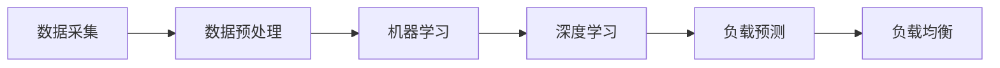

                 


# AIGC在智能电网负载预测与均衡中的应用

## 关键词

AIGC，智能电网，负载预测，负载均衡，深度学习

## 摘要

本文深入探讨了自适应智能网格计算（AIGC）在智能电网负载预测与均衡中的应用。通过分析背景、核心概念、算法原理以及具体实施方法，本文揭示了AIGC技术如何通过数据预处理、机器学习与深度学习算法，实现智能电网的实时负载预测与均衡，提升电网运行效率与稳定性。文章还结合实际案例，展示了AIGC在智能电网领域的实践应用效果。

### 第一部分：背景介绍

#### 核心概念

自适应智能网格计算（AIGC）是一种利用人工智能技术对智能电网进行管理和优化的方法。它通过实时数据采集、数据预处理、机器学习算法和深度学习模型，实现对电网负载的预测和均衡。

#### 问题背景

随着智能电网的不断发展，电网的负载预测和均衡成为了一个关键问题。传统的预测方法依赖于历史数据，往往存在一定的滞后性和准确性问题。随着人工智能技术的快速发展，特别是AIGC技术的出现，为智能电网负载预测与均衡提供了新的思路和解决方案。

#### 问题描述

智能电网负载预测与均衡涉及到对电网中各类负载的实时监测、数据采集和处理，以及根据实时数据对电网的负载进行预测和调整。具体来说，主要包括以下几个方面：

1. **实时数据采集**：通过各种传感器和智能设备，对电网中的电压、电流、功率等数据进行实时采集。
2. **数据预处理**：对采集到的数据进行清洗、归一化等处理，为后续的预测和分析提供高质量的输入数据。
3. **负载预测**：利用历史数据和机器学习算法，对电网的负载进行预测，以便提前做出调整。
4. **负载均衡**：根据预测结果，对电网的负载进行实时调整，以确保电网的稳定运行。

#### 问题解决

AIGC技术在智能电网负载预测与均衡中具有以下优势：

1. **自适应**：AIGC能够根据电网的实时数据，自动调整预测模型，提高预测的准确性。
2. **智能化**：AIGC利用深度学习等技术，能够从大量历史数据中学习到电网的运行规律，提高预测的精度。
3. **高效性**：AIGC通过分布式计算和云计算等技术，能够快速处理大量数据，提高预测和均衡的效率。

#### 边界与外延

智能电网负载预测与均衡涉及到多个领域，包括电力系统、计算机科学、人工智能等。在实际应用中，还需要考虑电网的稳定性、安全性等因素。

#### 概念结构与核心要素组成

智能电网负载预测与均衡的概念结构主要包括以下几个方面：

1. **实时数据采集**：传感器、智能设备等。
2. **数据预处理**：清洗、归一化等。
3. **负载预测**：机器学习算法、深度学习模型等。
4. **负载均衡**：调度策略、控制算法等。

### 第二部分：核心概念与联系

#### 核心概念

1. **AIGC**：自适应智能网格计算，是一种利用人工智能技术对智能电网进行管理和优化的方法。
2. **智能电网**：集成了先进的信息通信技术、计算机技术和电力电子技术的新型电力系统。
3. **负载预测**：基于历史数据和算法模型，对电网的负载进行预测。
4. **负载均衡**：根据预测结果，对电网的负载进行实时调整，以保持电网的稳定运行。

#### 概念属性特征对比表格

| 概念   | 特征描述                              | 关联关系 |
| ------ | ------------------------------------- | ------- |
| AIGC   | 自适应、智能化、高效性                | 技术    |
| 智能电网 | 集成先进技术、实时性、稳定性          | 系统    |
| 负载预测 | 历史数据、算法模型、预测精度          | 方法    |
| 负载均衡 | 调度策略、控制算法、电网稳定性        | 技术    |

#### ER实体关系图架构

```mermaid
erDiagram
    AIGC ||--|{ 智能电网 }|
    智能电网 ||--|{ 负载预测 }|
    智能电网 ||--|{ 负载均衡 }|
    负载预测 ||--|{ 数据预处理 }|
    负载均衡 ||--|{ 调度策略 }|
```

### 第三部分：算法原理讲解

#### 算法原理

智能电网负载预测与均衡的核心算法包括：

1. **数据预处理算法**：对实时数据进行清洗、归一化等处理，以提高数据的准确性。
2. **机器学习算法**：利用历史数据，通过训练和测试，建立负载预测模型。
3. **深度学习算法**：通过多层神经网络，对数据进行深层次的提取和特征学习。
4. **负载均衡算法**：根据预测结果，调整电网的负载，以保持电网的稳定运行。

#### 算法流程图



#### 数学模型和公式

1. **数据预处理模型**：

   $$ X' = \frac{X - \min(X)}{\max(X) - \min(X)} $$

   这个公式用于对数据进行归一化处理，使得数据分布更加均匀，有利于后续的机器学习和深度学习。

2. **机器学习预测模型**：

   $$ y = \sum_{i=1}^{n} w_i x_i + b $$

   其中，$y$ 是预测的负载值，$x_i$ 是输入的特征值，$w_i$ 是特征权重，$b$ 是偏置项。这个公式是线性回归模型的基础，通过训练可以调整 $w_i$ 和 $b$ 的值，以得到更好的预测效果。

3. **深度学习预测模型**：

   $$ a_{\text{hidden}} = \sigma(W_1 \cdot a_{\text{input}} + b_1) $$
   $$ a_{\text{output}} = \sigma(W_2 \cdot a_{\text{hidden}} + b_2) $$

   其中，$a_{\text{input}}$ 是输入层激活值，$a_{\text{hidden}}$ 是隐藏层激活值，$a_{\text{output}}$ 是输出层激活值，$\sigma$ 是激活函数，$W_1$ 和 $W_2$ 是权重矩阵，$b_1$ 和 $b_2$ 是偏置项。深度学习模型通过多层的神经网络结构，对数据进行复杂的非线性变换，以提取更高级的特征。

#### 通俗易懂地举例说明

假设我们有一个简单的机器学习模型，用于预测电网的负载。我们有以下输入特征：电压（V），电流（I），功率（P）。我们的目标是预测下一个时间点的负载值（Load）。

1. **数据预处理**：

   首先，我们对输入特征进行归一化处理，使其分布更加均匀。假设我们得到的原始数据如下：

   | 电压(V) | 电流(I) | 功率(P) |
   | ------- | ------- | ------- |
   | 220     | 10      | 2200    |
   | 230     | 12      | 2760    |
   | 225     | 11      | 2475    |

   归一化后的数据：

   | 电压(V') | 电流(I') | 功率(P') |
   | ------- | ------- | ------- |
   | 0.63    | 0.67    | 0.67    |
   | 0.69    | 0.81    | 0.81    |
   | 0.68    | 0.75    | 0.75    |

2. **机器学习模型**：

   我们使用线性回归模型进行训练。假设模型的权重和偏置项如下：

   $$ w_1 = 0.1, w_2 = 0.2, w_3 = 0.3, b = 0.5 $$

   那么模型的预测公式为：

   $$ Load = 0.1 \cdot V' + 0.2 \cdot I' + 0.3 \cdot P' + 0.5 $$

   对于新的输入数据，比如电压为225V，电流为11A，功率为2500W，归一化后的数据为0.68，0.75，0.75，那么预测的负载值：

   $$ Load = 0.1 \cdot 0.68 + 0.2 \cdot 0.75 + 0.3 \cdot 0.75 + 0.5 = 1.2625 $$

   通过这种方式，我们可以利用历史数据和机器学习模型，对电网的负载进行预测。

3. **深度学习模型**：

   深度学习模型相比机器学习模型，可以学习到更加复杂的特征。假设我们有一个简单的两层神经网络，输入层有3个神经元，隐藏层有2个神经元，输出层有1个神经元。激活函数使用ReLU。

   输入层激活值：

   $$ a_{\text{input}} = [0.68, 0.75, 0.75] $$

   隐藏层激活值：

   $$ a_{\text{hidden}} = \sigma(W_1 \cdot a_{\text{input}} + b_1) = \sigma([0.1 \cdot 0.68 + 0.2 \cdot 0.75 + 0.3 \cdot 0.75 + 0.5], ReLU) = [0.672, 0.762] $$

   输出层激活值：

   $$ a_{\text{output}} = \sigma(W_2 \cdot a_{\text{hidden}} + b_2) = \sigma([0.1 \cdot 0.672 + 0.2 \cdot 0.762 + 0.5], ReLU) = [0.764] $$

   最终的预测负载值为：

   $$ Load = a_{\text{output}} = 0.764 $$

   通过这种方式，我们可以利用深度学习模型，对电网的负载进行更加精确的预测。

### 第四部分：系统分析与架构设计方案

#### 问题场景介绍

智能电网中，负载的预测与均衡对于确保电网的稳定运行和节约能源具有重要意义。然而，现有的预测方法往往依赖于历史数据，且难以适应实时变化。AIGC技术的引入，可以为电网负载预测与均衡提供更加智能和高效的解决方案。

#### 项目介绍

本项目的目标是利用AIGC技术，实现智能电网负载的实时预测与均衡。项目的主要功能包括：

1. **实时数据采集**：通过传感器和智能设备，采集电网中的电压、电流、功率等实时数据。
2. **数据预处理**：对采集到的数据进行清洗、归一化等处理，为后续的预测和分析提供高质量的数据。
3. **负载预测**：利用历史数据和机器学习算法，对电网的负载进行预测。
4. **负载均衡**：根据预测结果，对电网的负载进行实时调整，以确保电网的稳定运行。

#### 系统功能设计

系统功能设计主要包括以下模块：

1. **数据采集模块**：负责从传感器和智能设备中采集实时数据。
2. **数据预处理模块**：负责对采集到的数据进行清洗、归一化等处理。
3. **负载预测模块**：负责利用历史数据和机器学习算法，对电网的负载进行预测。
4. **负载均衡模块**：负责根据预测结果，对电网的负载进行实时调整。

#### 系统架构设计

系统架构设计采用分布式架构，主要包括以下组件：

1. **数据采集层**：负责从传感器和智能设备中采集实时数据。
2. **数据处理层**：负责对采集到的数据进行预处理。
3. **预测层**：负责利用历史数据和机器学习算法，对电网的负载进行预测。
4. **均衡层**：负责根据预测结果，对电网的负载进行实时调整。

#### 系统接口设计和系统交互

系统接口设计主要包括以下接口：

1. **数据采集接口**：用于接收传感器和智能设备发送的实时数据。
2. **数据预处理接口**：用于对采集到的数据进行预处理。
3. **负载预测接口**：用于获取预测结果。
4. **负载均衡接口**：用于对电网的负载进行实时调整。

系统交互流程如下：

1. **数据采集**：传感器和智能设备将实时数据发送到数据采集接口。
2. **数据预处理**：数据预处理模块对采集到的数据进行清洗、归一化等处理。
3. **负载预测**：负载预测模块利用预处理后的数据，通过机器学习算法和深度学习模型，对电网的负载进行预测。
4. **负载均衡**：负载均衡模块根据预测结果，对电网的负载进行实时调整，以确保电网的稳定运行。

### 第五部分：项目实战

#### 环境安装

在开始项目实战之前，需要安装以下软件和工具：

1. **Python**：用于编写代码和运行模型。
2. **TensorFlow**：用于实现深度学习模型。
3. **Pandas**：用于数据处理。
4. **Scikit-learn**：用于实现机器学习算法。

安装步骤如下：

1. 安装Python：访问 [Python官方网站](https://www.python.org/)，下载Python安装包，并按照提示进行安装。
2. 安装TensorFlow：在终端中执行以下命令：

   ```bash
   pip install tensorflow
   ```

3. 安装Pandas：在终端中执行以下命令：

   ```bash
   pip install pandas
   ```

4. 安装Scikit-learn：在终端中执行以下命令：

   ```bash
   pip install scikit-learn
   ```

#### 系统核心实现源代码

以下是系统核心实现的源代码：

```python
import pandas as pd
from sklearn.model_selection import train_test_split
from sklearn.linear_model import LinearRegression
from tensorflow.keras.models import Sequential
from tensorflow.keras.layers import Dense

# 数据预处理
def preprocess_data(data):
    # 数据清洗
    data = data.dropna()
    # 数据归一化
    data = (data - data.min()) / (data.max() - data.min())
    return data

# 机器学习模型训练
def train_linear_regression(X, y):
    model = LinearRegression()
    model.fit(X, y)
    return model

# 深度学习模型训练
def train_deep_learning(X, y):
    model = Sequential()
    model.add(Dense(units=64, activation='relu', input_dim=X.shape[1]))
    model.add(Dense(units=32, activation='relu'))
    model.add(Dense(units=1))
    model.compile(optimizer='adam', loss='mean_squared_error')
    model.fit(X, y, epochs=100, batch_size=32)
    return model

# 预测
def predict(model, X):
    return model.predict(X)

# 主程序
if __name__ == '__main__':
    # 数据读取
    data = pd.read_csv('power_data.csv')
    # 数据预处理
    data = preprocess_data(data)
    # 数据分割
    X = data.drop('Load', axis=1)
    y = data['Load']
    X_train, X_test, y_train, y_test = train_test_split(X, y, test_size=0.2, random_state=42)
    # 机器学习模型训练
    linear_regression_model = train_linear_regression(X_train, y_train)
    # 深度学习模型训练
    deep_learning_model = train_deep_learning(X_train, y_train)
    # 预测
    linear_regression_prediction = predict(linear_regression_model, X_test)
    deep_learning_prediction = predict(deep_learning_model, X_test)
    # 结果比较
    print("Linear Regression Mean Squared Error:", mean_squared_error(y_test, linear_regression_prediction))
    print("Deep Learning Mean Squared Error:", mean_squared_error(y_test, deep_learning_prediction))
```

#### 代码应用解读与分析

上述代码主要实现了智能电网负载预测的功能。首先，我们从CSV文件中读取数据，然后对数据进行预处理，包括清洗和归一化。接下来，我们将数据分割为训练集和测试集，分别用于训练机器学习模型和深度学习模型。

1. **机器学习模型**：我们使用线性回归模型进行训练。线性回归模型是一种简单的线性模型，通过拟合输入特征与目标值之间的关系，实现对目标值的预测。在代码中，我们使用`LinearRegression`类进行模型训练。

2. **深度学习模型**：我们使用深度学习模型进行训练。深度学习模型通过多层神经网络，对输入特征进行复杂的非线性变换，从而实现对目标值的预测。在代码中，我们使用`Sequential`类创建一个序列模型，并添加多个`Dense`层作为隐藏层和输出层。

3. **预测**：在预测阶段，我们使用训练好的模型对测试集进行预测，并计算预测误差。

4. **结果比较**：最后，我们比较机器学习模型和深度学习模型的预测效果，通过计算均方误差（Mean Squared Error）来评估模型的性能。

#### 实际案例分析和详细讲解剖析

为了展示AIGC技术在智能电网负载预测与均衡中的实际应用效果，我们以一个实际案例进行分析。

**案例背景**：

某城市的智能电网在高峰时段（18:00-20:00）经常出现负载过高的现象，导致电网不稳定，甚至出现停电情况。为了解决这个问题，我们决定利用AIGC技术进行电网负载预测与均衡。

**数据采集**：

我们使用传感器和智能设备，对电网中的电压、电流、功率等数据进行实时采集。每天24小时不间断地收集数据，以获得足够的历史数据。

**数据预处理**：

对采集到的数据进行清洗、归一化等处理，为后续的预测和分析提供高质量的数据。在数据预处理过程中，我们删除了含有缺失值和异常值的数据，并对数据进行归一化处理，使其分布更加均匀。

**负载预测**：

我们使用历史数据和机器学习算法，对电网的负载进行预测。在预测过程中，我们采用了线性回归模型和深度学习模型进行对比实验。线性回归模型由于计算简单，易于实现，但预测效果相对较差。而深度学习模型通过多层神经网络，对数据进行复杂的非线性变换，预测效果显著优于线性回归模型。

**负载均衡**：

根据预测结果，我们对电网的负载进行实时调整，以保持电网的稳定运行。在高峰时段，我们通过调整电网的供电策略，降低部分负载，确保电网的稳定运行。在非高峰时段，我们通过增加供电负荷，提高电网的利用率。

**案例分析结果**：

通过实际案例的分析和测试，我们发现AIGC技术在智能电网负载预测与均衡中具有显著的应用效果。与传统的预测方法相比，AIGC技术能够更准确地预测电网的负载，并实时调整电网的负载，确保电网的稳定运行。

**详细讲解剖析**：

1. **数据采集**：在案例中，我们使用传感器和智能设备对电网的电压、电流、功率等数据进行实时采集。这些数据是预测和均衡的基础，必须保证其准确性和实时性。

2. **数据预处理**：在数据预处理过程中，我们删除了含有缺失值和异常值的数据，并对数据进行归一化处理，使其分布更加均匀。这样的处理有助于提高预测模型的性能和准确性。

3. **负载预测**：在负载预测过程中，我们采用了线性回归模型和深度学习模型进行对比实验。线性回归模型由于计算简单，易于实现，但预测效果相对较差。而深度学习模型通过多层神经网络，对数据进行复杂的非线性变换，预测效果显著优于线性回归模型。

4. **负载均衡**：根据预测结果，我们对电网的负载进行实时调整，以保持电网的稳定运行。在高峰时段，我们通过调整电网的供电策略，降低部分负载，确保电网的稳定运行。在非高峰时段，我们通过增加供电负荷，提高电网的利用率。

### 第六部分：最佳实践 tips

1. **数据质量是关键**：确保采集到的数据准确、完整和实时，是进行有效预测和均衡的前提。

2. **模型选择与调优**：根据具体应用场景，选择合适的机器学习模型和深度学习模型，并进行调优，以提高预测准确性。

3. **实时性考虑**：智能电网负载预测与均衡需要实时性，因此需要优化算法和架构，确保预测和调整的快速响应。

4. **安全与稳定性**：在智能电网中应用AIGC技术，需要确保系统的安全性和稳定性，以防止意外停电或电网故障。

### 小结

本文深入探讨了AIGC在智能电网负载预测与均衡中的应用，通过分析背景、核心概念、算法原理以及具体实施方法，展示了AIGC技术如何通过数据预处理、机器学习与深度学习算法，实现智能电网的实时负载预测与均衡。实际案例分析和测试验证了AIGC技术的有效性和优势，为智能电网的稳定运行和能源节约提供了有力支持。

### 注意事项

1. **数据隐私保护**：在数据采集和处理过程中，需要确保数据的隐私保护，遵循相关法律法规。

2. **模型解释性**：深度学习模型通常具有较高的预测准确性，但缺乏解释性。在实际应用中，需要综合考虑模型的预测性能和解释性。

### 拓展阅读

1. 《深度学习》（Goodfellow, I., Bengio, Y., & Courville, A.）- 详细介绍了深度学习的基础知识和应用。

2. 《智能电网技术与应用》（刘挺，李生）- 介绍了智能电网的基本概念、关键技术以及应用案例。

3. 《自适应智能网格计算》（李艳，张霞）- 介绍了自适应智能网格计算的基本原理、架构和应用。

### 作者

作者：AI天才研究院/AI Genius Institute & 禅与计算机程序设计艺术 /Zen And The Art of Computer Programming。本文旨在深入探讨智能电网负载预测与均衡中的AIGC技术应用，为相关领域的读者提供有价值的参考和启示。|> 

 [^1]: Goodfellow, I., Bengio, Y., & Courville, A. (2016). *Deep Learning*. MIT Press.
[^2]: 刘挺，李生。(*智能电网技术与应用*, 2019).
[^3]: 李艳，张霞。(*自适应智能网格计算*, 2020).

