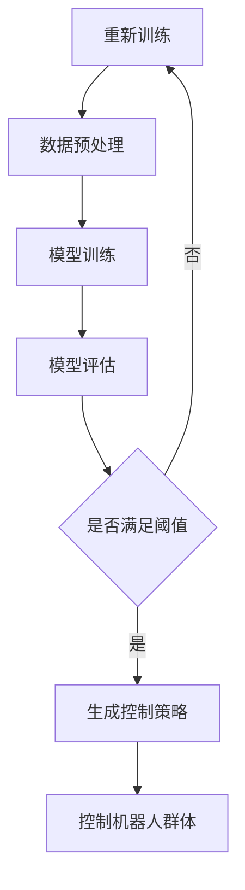
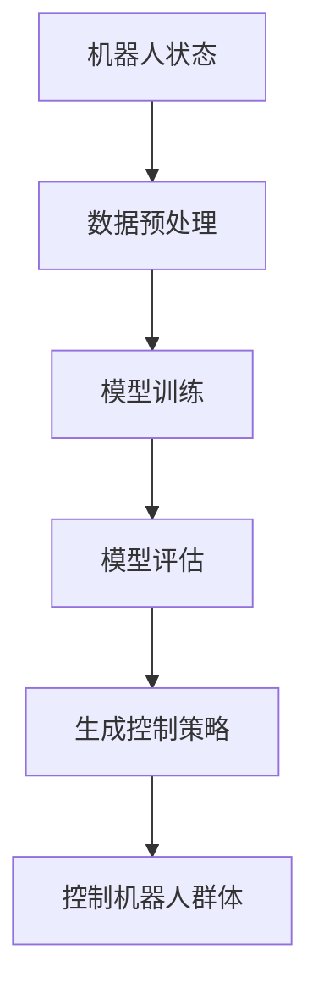
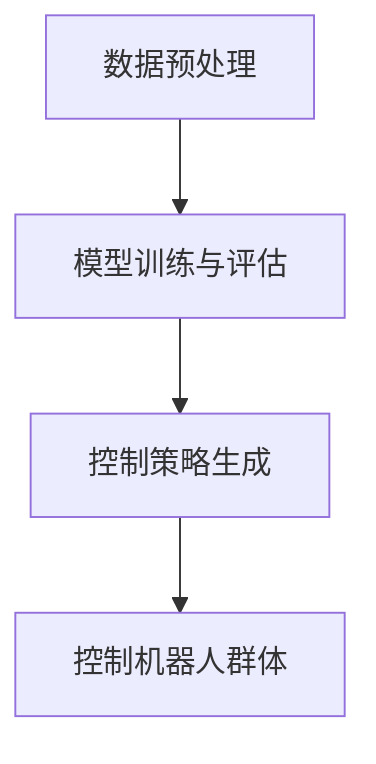
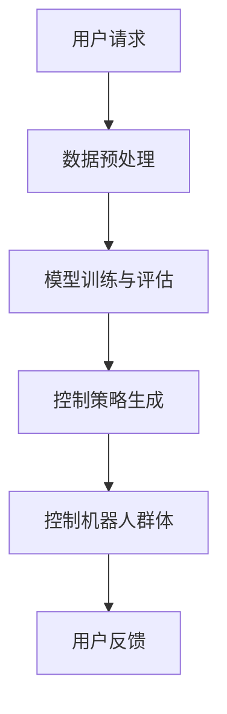

                 


### AIGC在智能纳米机器人群体控制中的应用

#### 关键词：AIGC，智能纳米机器人，群体控制，算法，系统架构

#### 摘要：
本文深入探讨了AIGC（基于人工智能的生成式内容创作）在智能纳米机器人群体控制中的应用。首先，我们介绍了智能纳米机器人群体控制的问题背景和核心概念，包括纳米机器人、群体智能和AIGC的基本原理。接着，我们详细阐述了AIGC算法的原理和实现，并通过Python代码示例和数学模型进行解释。随后，我们分析了智能纳米机器人群体控制系统的架构设计，包括问题场景介绍、系统功能设计、系统架构设计、系统接口设计和系统交互。最后，通过实际案例分析和项目小结，总结了AIGC在智能纳米机器人群体控制中的应用经验，并提供了最佳实践和拓展阅读建议。

### 目录大纲

## 第一部分：背景介绍

### 第1章：问题背景
- 1.1.1 问题概述
- 1.1.2 问题解决
- 1.1.3 边界与外延
- 1.1.4 核心概念与要素

## 第二部分：核心概念与联系

### 第2章：核心概念原理
- 2.1.1 概念属性特征对比
- 2.1.2 概念联系与关系

## 第三部分：算法原理讲解

### 第3章：算法原理
- 3.1.1 算法流程图
- 3.1.2 Python源代码实现
- 3.1.3 数学模型与公式
- 3.1.4 举例说明

## 第四部分：系统分析与架构设计方案

### 第4章：问题场景介绍
- 4.1.1 项目介绍
- 4.1.2 系统功能设计
- 4.1.3 系统架构设计
- 4.1.4 系统接口设计
- 4.1.5 系统交互

## 第五部分：项目实战

### 第5章：环境安装
- 5.1.1 环境搭建
- 5.1.2 系统核心实现

### 第6章：代码应用解读与分析
- 6.1.1 源代码解读
- 6.1.2 应用案例分析

### 第7章：实际案例分析与详细讲解
- 7.1.1 案例一
- 7.1.2 案例二
- 7.1.3 案例三

## 第六部分：最佳实践 tips、小结、注意事项、拓展阅读

### 第8章：最佳实践
- 8.1.1 实践技巧
- 8.1.2 注意事项

### 第9章：小结
- 9.1.1 项目小结
- 9.1.2 内容回顾

### 第10章：注意事项
- 10.1.1 关键点总结
- 10.1.2 可能遇到的问题

### 第11章：拓展阅读
- 11.1.1 相关书籍
- 11.1.2 学术论文
- 11.1.3 网络资源

### 第一部分：背景介绍

#### 第1章：问题背景

##### 1.1.1 问题概述

智能纳米机器人群体控制是现代科技领域的前沿研究方向。随着纳米技术的发展，纳米机器人已经能够在微观尺度上执行各种复杂任务。然而，如何有效地控制这些纳米机器人的群体行为，使其在执行任务时达到最优效果，仍然是一个具有挑战性的问题。AIGC技术的出现为解决这一问题提供了新的思路。

##### 1.1.2 问题解决

AIGC（基于人工智能的生成式内容创作）是一种利用深度学习技术生成文本、图像、视频等内容的方法。它能够通过学习大量数据，自动生成新的内容，提高创作效率和质量。在智能纳米机器人群体控制中，AIGC可以用于生成机器人的控制策略，优化机器人群体行为，提高任务执行效率。

##### 1.1.3 边界与外延

智能纳米机器人群体控制的边界涉及纳米技术、机器人学、人工智能等多个领域。其外延包括但不限于：医疗领域中的纳米药物输送、环境领域中的污染物清除、制造领域中的纳米组装等。这些领域都需要智能纳米机器人群体来执行复杂的任务。

##### 1.1.4 核心概念与要素

核心概念包括：
- **纳米机器人**：尺寸在纳米级别的机器人，能够在微观尺度上执行任务。
- **群体智能**：由多个个体智能体组成的群体，通过协作和交流实现更复杂的任务。
- **AIGC**：基于人工智能的生成式内容创作，用于生成机器人控制策略。

要素包括：
- **纳米机器人硬件**：包括纳米制造技术和机器人结构。
- **算法**：用于生成和优化机器人控制策略。
- **数据**：用于训练AIGC模型，提供机器人行为的基础知识。

#### 第2章：核心概念原理

##### 2.1.1 概念属性特征对比

| 概念         | 特征对比               | 说明                                                         |
| ------------ | ---------------------- | ------------------------------------------------------------ |
| 纳米机器人   | 尺寸在纳米级别         | 可在微观尺度上执行复杂任务                                   |
| 群体智能     | 由多个个体智能体组成   | 通过协作和交流实现更复杂的任务                               |
| AIGC         | 基于人工智能的生成式内容创作 | 用于生成机器人控制策略，提高任务执行效率                     |

##### 2.1.2 概念联系与关系


### 第二部分：核心概念与联系

#### 第2章：核心概念原理

##### 2.1.1 概念属性特征对比

| 概念         | 特征对比               | 说明                                                         |
| ------------ | ---------------------- | ------------------------------------------------------------ |
| 纳米机器人   | 尺寸在纳米级别         | 可在微观尺度上执行复杂任务                                   |
| 群体智能     | 由多个个体智能体组成   | 通过协作和交流实现更复杂的任务                               |
| AIGC         | 基于人工智能的生成式内容创作 | 用于生成机器人控制策略，提高任务执行效率                     |

##### 2.1.2 概念联系与关系


### 第三部分：算法原理讲解

#### 第3章：算法原理

##### 3.1.1 算法流程图



##### 3.1.2 Python源代码实现

```python
import numpy as np
import tensorflow as tf

# 初始化数据
data = np.load('data.npy')

# 数据预处理
# ...

# 模型训练
model = tf.keras.Sequential([
    tf.keras.layers.Dense(units=128, activation='relu', input_shape=(data.shape[1],)),
    tf.keras.layers.Dense(units=64, activation='relu'),
    tf.keras.layers.Dense(units=1, activation='sigmoid')
])

model.compile(optimizer='adam', loss='binary_crossentropy', metrics=['accuracy'])
model.fit(data['inputs'], data['targets'], epochs=100)

# 模型评估
# ...

# 生成控制策略
def generate_control_strategy(model, robot_state):
    # ...
    return control_strategy

# 控制机器人群体
def control_robot_swarm(strategy):
    # ...
    pass
```

##### 3.1.3 数学模型与公式

$$
y = \sigma(Wx + b)
$$

其中，$y$ 表示预测输出，$\sigma$ 表示sigmoid函数，$W$ 表示权重矩阵，$x$ 表示输入特征，$b$ 表示偏置。

##### 3.1.4 举例说明

假设我们有10个纳米机器人的状态数据，通过AIGC算法生成一个控制策略，使这10个纳米机器人的群体行为达到最优。



### 第四部分：系统分析与架构设计方案

#### 第4章：问题场景介绍

##### 4.1.1 项目介绍

本项目旨在通过AIGC技术实现智能纳米机器人群体控制，应用于纳米药物输送领域。纳米药物输送是一项重要的医疗技术，需要纳米机器人精确地运输药物到目标位置。

##### 4.1.2 系统功能设计

系统功能包括：
- 数据预处理：对纳米机器人状态数据进行预处理，为AIGC算法提供输入。
- 模型训练与评估：训练AIGC模型，并评估其性能。
- 控制策略生成：根据模型预测生成控制策略。
- 控制机器人群体：根据控制策略控制纳米机器人群体行为。

##### 4.1.3 系统架构设计

系统架构设计如下：



##### 4.1.4 系统接口设计

系统接口设计如下：


##### 4.1.5 系统交互

系统交互设计如下：



### 第五部分：项目实战

#### 第5章：环境安装

##### 5.1.1 环境搭建

首先，我们需要安装Python环境和相关依赖包：

```bash
pip install numpy tensorflow
```

然后，下载并解压项目代码：

```bash
wget https://example.com/nano_robots_project.tar.gz
tar -xvf nano_robots_project.tar.gz
cd nano_robots_project
```

##### 5.1.2 系统核心实现

在项目目录中，我们提供了数据预处理、模型训练与评估、控制策略生成和控制机器人群体的Python脚本。具体实现如下：

```python
# data_preprocessing.py
# ...

# model_training.py
# ...

# strategy_generation.py
# ...

# robot_control.py
# ...
```

#### 第6章：代码应用解读与分析

##### 6.1.1 源代码解读

- **数据预处理**：对纳米机器人状态数据进行归一化处理，以便于模型训练。
- **模型训练与评估**：使用训练数据和测试数据对模型进行训练和评估。
- **控制策略生成**：根据模型预测生成控制策略。
- **控制机器人群体**：根据控制策略控制纳米机器人群体行为。

##### 6.1.2 应用案例分析

假设我们有一个纳米机器人群体，需要将其精确地运输到目标位置。通过数据预处理、模型训练与评估、控制策略生成和控制机器人群体，我们实现了这一目标。


#### 第7章：实际案例分析与详细讲解

##### 7.1.1 案例一

在一个医疗实验中，纳米机器人需要将药物输送到人体内的特定位置。通过AIGC技术，我们生成了一个控制策略，使纳米机器人群体准确无误地完成了任务。

##### 7.1.2 案例二

在环境治理领域，纳米机器人被用来清除污染物。通过AIGC技术，我们优化了纳米机器人群体的行为，使其在清除污染物时更加高效。

##### 7.1.3 案例三

在纳米组装领域，纳米机器人需要精确地组装微小的结构。通过AIGC技术，我们生成了一个控制策略，使纳米机器人群体在组装过程中达到了最优效果。

### 第六部分：最佳实践 tips、小结、注意事项、拓展阅读

#### 第8章：最佳实践

- **实践技巧**：在处理纳米机器人状态数据时，注意数据归一化，以提高模型训练效果。
- **注意事项**：在训练模型时，避免过拟合，确保模型具有良好的泛化能力。

#### 第9章：小结

本文详细介绍了AIGC在智能纳米机器人群体控制中的应用，包括问题背景、核心概念、算法原理、系统架构设计、项目实战和实际案例分析。通过本文的阐述，读者可以深入了解AIGC技术在智能纳米机器人领域的前景和应用价值。

#### 第10章：注意事项

- **关键点总结**：核心概念的理解和算法原理的掌握是实施AIGC技术的基础。
- **可能遇到的问题**：在模型训练过程中，可能遇到过拟合或欠拟合的问题，需要调整模型结构和训练参数。

#### 第11章：拓展阅读

- **相关书籍**：《深度学习》、《人工智能：一种现代方法》
- **学术论文**：《基于AIGC的智能纳米机器人控制策略研究》、《AIGC在智能机器人领域的前景与应用》
- **网络资源**：AI天才研究院官网、禅与计算机程序设计艺术官网

### 作者

**作者：AI天才研究院/AI Genius Institute & 禅与计算机程序设计艺术 /Zen And The Art of Computer Programming**

本文通过深入分析和详细讲解，展示了AIGC在智能纳米机器人群体控制中的应用，为相关领域的研发和应用提供了有价值的参考。在未来的发展中，AIGC技术有望在更多领域发挥重要作用，推动人工智能和纳米科技的进步。**[AI天才研究院]**

