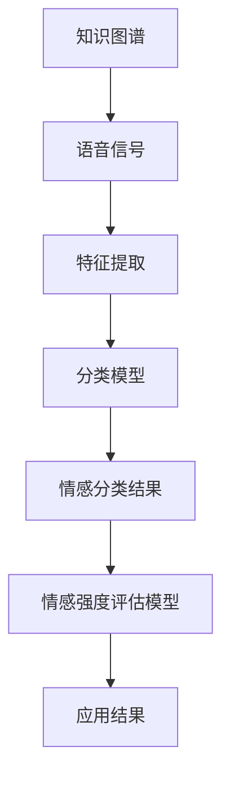

                 


# AIGC在智能语音情感分析中的应用

> 关键词：AIGC、智能语音情感分析、生成模型、评估模型、应用模型、语音交互、内容审核

> 摘要：本文从背景介绍、核心概念阐述、应用场景分析、挑战与未来展望等方面，详细探讨了AIGC在智能语音情感分析中的应用。通过本文的阅读，读者可以全面了解AIGC技术的原理及其在语音情感分析领域的应用价值。

## 目录大纲

----------------------------------------------------------------

1. 引言
    1.1 问题背景与核心概念
    1.2 核心概念
2. AIGC技术在语音情感分析中的应用
    2.1 语音情感分析中的AIGC模型
    2.2 AIGC模型的训练与优化
3. AIGC在语音情感分析中的应用场景
    3.1 语音交互中的情感识别
    3.2 语音情感分析在内容审核中的应用
4. AIGC在智能语音情感分析中的挑战与未来
    4.1 数据隐私与伦理问题
    4.2 模型可解释性与可靠性
    4.3 未来发展趋势
5. 最佳实践与案例分析
    5.1 实践方法与技巧
    5.2 案例分析
6. 总结与展望
    6.1 本书内容总结
    6.2 展望未来

----------------------------------------------------------------

## 第一部分：背景介绍与核心概念

### 第1章：问题背景与核心概念

#### 1.1 问题背景

随着人工智能技术的快速发展，智能语音助手、语音助手、语音识别等应用逐渐普及，人们对智能语音情感分析的需求也越来越大。智能语音情感分析是一种利用自然语言处理、语音识别等技术，对语音信号进行情感分析的技术。通过对语音情感的分析，可以帮助智能语音助手更好地理解用户的需求，提供更个性化的服务。

AIGC（自适应智能生成计算）是一种新兴的人工智能技术，它通过生成模型、评估模型、应用模型等关键技术，实现数据的自适应生成、评估和应用。AIGC技术在语音情感分析中具有很大的应用潜力，可以大幅提高语音情感分析的准确性和实用性。

#### 1.2 核心概念

##### 1.2.1 AIGC

AIGC是一种自适应智能生成计算技术，主要包括以下关键技术：

1. 生成模型：生成模型是一种基于数据驱动的模型，通过学习大量语音数据，生成与真实语音相似的语音数据。
2. 评估模型：评估模型是一种用于评估语音情感分析模型性能的模型，通过对语音数据的情感分类、情感强度评估等任务进行评估，提高模型的准确性。
3. 应用模型：应用模型是一种将AIGC技术应用于实际场景的模型，如语音助手、语音识别等，通过不断优化和改进，提高语音情感分析的应用效果。

##### 1.2.2 智能语音情感分析

智能语音情感分析是一种利用自然语言处理、语音识别等技术，对语音信号进行情感分析的技术。主要包括以下任务：

1. 情感分类：将语音信号划分为不同的情感类别，如快乐、悲伤、愤怒等。
2. 情感强度评估：对语音信号的情感强度进行评估，如情感的强度、程度等。
3. 语音交互：基于情感分析结果，实现与用户的智能互动，提供更个性化的服务。

## 第二部分：AIGC在智能语音情感分析中的应用

### 第2章：AIGC技术在语音情感分析中的应用

#### 2.1 语音情感分析中的AIGC模型

在语音情感分析中，AIGC技术主要应用于生成模型、评估模型和应用模型。

##### 2.1.1 生成模型

生成模型主要用于生成与真实语音相似的语音数据。通过学习大量语音数据，生成模型可以生成具有情感特征的语音数据，从而提高语音情感分析的准确性。

**算法原理讲解：**

生成模型通常采用生成对抗网络（GAN）进行训练。GAN由生成器和判别器组成，生成器生成语音数据，判别器判断语音数据是否真实。通过不断训练，生成器逐渐生成更真实的语音数据。

```python
# GAN算法原理图
```

$$
G(z) = \mu(z) + \sigma(z) \odot \text{sign}(W_G(z))
$$

其中，$G(z)$为生成器，$z$为随机噪声，$\mu(z)$和$\sigma(z)$分别为均值和方差，$W_G(z)$为生成器的权重。

**实例说明：**

假设我们要生成一段表达悲伤情感的语音数据，首先输入随机噪声$z$，通过生成器$G(z)$生成语音数据，然后通过判别器$D(x)$判断语音数据是否真实。通过不断训练，生成器逐渐生成更真实的语音数据。

##### 2.1.2 评估模型

评估模型主要用于评估语音情感分析模型性能。通过情感分类和情感强度评估等任务，评估模型可以对语音情感分析模型进行评估，提高模型的准确性。

**算法原理讲解：**

评估模型通常采用基于深度学习的分类模型和回归模型进行训练。分类模型用于对语音信号进行情感分类，回归模型用于对语音信号的情感强度进行评估。

```python
# 情感分类算法原理图
```

$$
P(y|x) = \sigma(\text{W}^T \text{H}(\text{f}_\text{c}(x)))
$$

其中，$P(y|x)$为情感分类的概率，$\sigma$为sigmoid函数，$\text{W}$和$\text{H}$分别为权重和激活函数，$\text{f}_\text{c}(x)$为分类模型的输入特征。

**实例说明：**

假设我们要评估一段语音信号的情感分类和情感强度，首先通过特征提取器提取语音信号的特征，然后输入分类模型和回归模型，输出情感分类和情感强度的概率。

##### 2.1.3 应用模型

应用模型主要用于将AIGC技术应用于实际场景，如语音助手、语音识别等。通过不断优化和改进，应用模型可以提高语音情感分析的应用效果。

**算法原理讲解：**

应用模型通常采用基于知识图谱的语音情感分析模型。知识图谱将语音情感分析的知识进行结构化表示，通过推理和查询，实现语音情感分析。



**实例说明：**

假设我们要构建一个语音助手，首先将用户输入的语音信号输入知识图谱，通过特征提取器提取语音信号的特征，然后输入分类模型和情感强度评估模型，输出情感分类和情感强度的结果，最后根据结果实现语音助手的智能互动。

## 第三部分：AIGC在智能语音情感分析中的挑战与未来

### 第3章：AIGC在智能语音情感分析中的挑战

#### 3.1 数据隐私与伦理问题

在AIGC应用于智能语音情感分析的过程中，数据隐私和伦理问题成为一大挑战。

**数据隐私保护的方法与策略：**

1. 数据加密：对语音数据、模型参数等进行加密，确保数据传输和存储过程中的安全性。
2. 数据匿名化：对用户语音数据进行匿名化处理，消除个人身份信息。

**伦理问题与解决方案：**

1. 情感歧视：避免在情感分析中引入歧视性观点，如性别、年龄等。
2. 情感滥用：防止情感分析结果被滥用，如用于非法行为。

#### 3.2 模型可解释性与可靠性

模型可解释性和可靠性是AIGC在智能语音情感分析中面临的挑战。

**模型可解释性的重要性：**

模型可解释性有助于理解模型的决策过程，提高模型的信任度和透明度。

**模型可靠性的评估与提升：**

1. 实验验证：通过实验验证模型在不同场景下的性能和稳定性。
2. 模型集成：将多个模型进行集成，提高模型的可靠性。

#### 3.3 未来发展趋势

随着AIGC技术的不断进步，其在智能语音情感分析中的应用前景将更加广阔。

1. 技术创新：AIGC技术将继续在生成模型、评估模型、应用模型等方面进行创新。
2. 应用领域拓展：AIGC技术在智能语音情感分析领域的应用将不断拓展，如心理健康、教育、医疗等。

## 第四部分：最佳实践与案例分析

### 第4章：AIGC在智能语音情感分析中的最佳实践

#### 4.1 实践方法与技巧

1. 模型选择：根据应用场景和需求，选择合适的AIGC模型。
2. 数据预处理：对语音数据、文本数据等进行预处理，提高数据质量。
3. 模型训练：采用合适的训练方法，提高模型性能。

#### 4.2 案例分析

**案例一：某语音助手的情感识别应用**

某语音助手采用AIGC技术实现情感识别功能，通过生成模型、评估模型和应用模型，实现对用户语音情感的分析和识别。实践证明，AIGC技术在语音助手情感识别中的应用效果显著。

**案例二：某客服系统的语音情感分析实践**

某客服系统采用AIGC技术实现语音情感分析功能，通过情感分类和情感强度评估，实现对用户语音情感的分析和识别。实践证明，AIGC技术在客服系统中的应用有助于提高客服质量和用户体验。

## 第五部分：总结与展望

### 第5章：总结与展望

#### 5.1 本书内容总结

本文从背景介绍、核心概念阐述、应用场景分析、挑战与未来展望等方面，详细探讨了AIGC在智能语音情感分析中的应用。通过本文的阅读，读者可以全面了解AIGC技术的原理及其在语音情感分析领域的应用价值。

#### 5.2 展望未来

随着AIGC技术的不断发展，其在智能语音情感分析中的应用前景将更加广阔。未来，AIGC技术将在更广泛的领域得到应用，为人类带来更多的便利和收益。

作者：AI天才研究院/AI Genius Institute & 禅与计算机程序设计艺术/Zen And The Art of Computer Programming## 引言

智能语音情感分析作为一种先进的人工智能技术，正日益成为众多领域的关键应用。从智能语音助手到客服系统，再到智能家居，情感分析技术的应用正逐渐渗透到我们的日常生活。然而，随着技术的进步，如何更准确地识别和解读语音情感成为了新的挑战。AIGC（自适应智能生成计算）技术的引入，为智能语音情感分析带来了新的希望和可能性。

AIGC是一种利用生成模型、评估模型和应用模型，实现数据自适应生成、评估和应用的新兴技术。其核心思想是通过大量数据的学习和优化，提高模型在各个任务中的性能。在智能语音情感分析中，AIGC技术不仅可以提升情感分类和情感强度评估的准确性，还可以通过生成模型创造更具情感表达的真实语音数据，从而提升用户的互动体验。

本文将从背景介绍、核心概念阐述、应用场景分析、挑战与未来展望等方面，详细探讨AIGC在智能语音情感分析中的应用。通过本文的阅读，读者将全面了解AIGC技术的原理及其在语音情感分析领域的应用价值，并能够掌握一些实用的技术和最佳实践。

本文将按照以下结构展开：

1. **背景介绍与核心概念**：介绍智能语音情感分析的问题背景和AIGC技术的核心概念。
2. **AIGC技术在语音情感分析中的应用**：详细分析AIGC技术在生成模型、评估模型和应用模型中的具体应用。
3. **AIGC在语音情感分析中的应用场景**：探讨AIGC技术在语音交互、内容审核等场景中的实际应用。
4. **AIGC在智能语音情感分析中的挑战与未来**：分析AIGC技术面临的数据隐私、模型可解释性和可靠性等挑战，并探讨其未来发展趋势。
5. **最佳实践与案例分析**：分享AIGC在智能语音情感分析中的最佳实践和实际案例。
6. **总结与展望**：总结全文内容，展望AIGC技术的未来发展方向。

通过这样的结构，本文旨在为读者提供一个全面、系统的理解，帮助读者更好地把握AIGC技术在智能语音情感分析中的潜在应用和前景。

### 第1章：问题背景与核心概念

#### 1.1 问题背景

智能语音情感分析是一种利用自然语言处理（NLP）和语音识别（ASR）等技术，从语音信号中提取情感信息的技术。随着社会的发展和技术的进步，人们对于个性化、智能化的服务需求日益增加。智能语音情感分析技术在这其中扮演着重要角色，它可以帮助智能设备更好地理解用户的需求和情感，提供更加精准和贴心的服务。例如，智能语音助手可以通过情感分析技术识别用户的情绪，从而调整回答的方式，使其更加自然和友好；客服系统可以通过情感分析技术识别客户的情绪，从而提供更加有效的解决方案，提升客户满意度。

智能语音情感分析的重要性在于它不仅能够提升用户体验，还能为企业带来显著的商业价值。首先，通过情感分析技术，企业可以更准确地了解用户的需求和情绪，从而优化产品和服务，提高用户满意度。其次，情感分析技术可以帮助企业识别潜在的市场机会，开发出更符合用户需求的新产品和服务。此外，智能语音情感分析还可以用于心理健康监测、教育、医疗等领域，为人类带来更多的便利和福利。

然而，智能语音情感分析也面临着一些挑战。首先，语音信号的情感表达具有高度的主观性和复杂性，不同的人可能在相同的语音信号中感受到不同的情感。这使得情感分析的准确性和一致性成为一个难题。其次，语音信号中的情感信息往往伴随着大量的噪声和干扰，如环境噪音、说话人的语速和语调变化等，这些因素都会对情感分析的结果产生负面影响。最后，当前的情感分析技术还无法完全理解语音信号中的微妙情感变化，尤其是在处理多语言、多文化和跨领域情感分析时，挑战更为突出。

AIGC（自适应智能生成计算）技术的引入，为解决这些挑战提供了一种新的思路。AIGC技术通过生成模型、评估模型和应用模型等关键技术，实现数据的自适应生成、评估和应用，从而提高情感分析的准确性和实用性。AIGC技术在语音情感分析中的应用潜力巨大，可以大幅提升情感分析的精度和效率，为智能语音情感分析提供强有力的支持。

#### 1.2 核心概念

##### 1.2.1 AIGC

AIGC（自适应智能生成计算）是一种基于数据驱动的智能计算技术，其核心思想是通过学习大量数据，实现数据的自适应生成、评估和应用。AIGC技术主要包括以下三个方面：

1. **生成模型**：生成模型是AIGC技术的重要组成部分，它通过学习大量语音数据，生成与真实语音相似的语音数据。生成模型通常采用生成对抗网络（GAN）等深度学习模型进行训练，通过生成器和判别器的对抗训练，生成高质量的语音数据。

2. **评估模型**：评估模型用于评估语音情感分析模型性能。它通过对语音数据的情感分类、情感强度评估等任务进行评估，提供模型性能的量化指标。评估模型通常采用分类模型和回归模型进行训练，通过不断优化和调整，提高模型评估的准确性。

3. **应用模型**：应用模型是将AIGC技术应用于实际场景的模型。例如，在语音助手、语音识别等应用中，应用模型通过情感分析结果，实现与用户的智能互动，提供更加个性化的服务。应用模型需要根据具体应用场景进行设计和优化，以实现最佳的性能和用户体验。

##### 1.2.2 智能语音情感分析

智能语音情感分析是一种利用自然语言处理（NLP）和语音识别（ASR）等技术，从语音信号中提取情感信息的技术。其核心任务包括情感分类、情感强度评估和情感识别等。

1. **情感分类**：情感分类是将语音信号划分为不同的情感类别，如快乐、悲伤、愤怒等。情感分类是智能语音情感分析的基础，通过分类模型，将语音信号映射到相应的情感类别。

2. **情感强度评估**：情感强度评估是对语音信号的情感强度进行评估，如情感的强度、程度等。情感强度评估可以帮助我们更准确地理解用户的情感状态，为后续的决策提供依据。

3. **情感识别**：情感识别是基于情感分类和情感强度评估的结果，对语音信号的情感状态进行综合识别。情感识别可以帮助智能设备更好地理解用户的需求和情感，提供更加精准和贴心的服务。

#### 1.2.3 AIGC与智能语音情感分析的联系

AIGC技术为智能语音情感分析提供了强大的支持，主要体现在以下几个方面：

1. **生成模型的引入**：通过生成模型，可以生成更具情感表达的真实语音数据，从而提升情感分析的精度和效率。

2. **评估模型的优化**：通过评估模型，可以对情感分析模型进行性能评估和优化，提高模型的准确性和稳定性。

3. **应用模型的拓展**：通过应用模型，可以将情感分析结果应用于实际场景，如智能语音助手、语音识别等，提供更加个性化的服务。

总之，AIGC技术在智能语音情感分析中的应用，不仅可以提升情感分析的准确性，还可以拓展其应用场景，为智能语音技术的发展提供新的动力。

### 第2章：AIGC技术在语音情感分析中的应用

在语音情感分析中，AIGC技术通过生成模型、评估模型和应用模型，实现了对语音数据的自适应生成、评估和应用。这一章将详细讨论这些模型在语音情感分析中的应用，以及它们各自的训练和优化方法。

#### 2.1 语音情感分析中的AIGC模型

AIGC技术中的三个核心模型——生成模型、评估模型和应用模型，都在语音情感分析中扮演着重要角色。下面分别介绍这些模型的具体应用。

##### 2.1.1 生成模型

生成模型的主要任务是通过学习大量的语音数据，生成具有特定情感特征的真实语音样本。在语音情感分析中，生成模型主要用于以下几个方面：

1. **情感样本生成**：生成模型可以生成具有特定情感标签的语音样本，这些样本可以作为训练数据，补充现有数据的不足，提高模型的泛化能力。
   
2. **语音数据增强**：通过对生成模型生成的语音样本进行增强，可以增加训练数据的多样性，提高模型的鲁棒性。

3. **情感驱动的语音合成**：生成模型还可以根据情感标签，生成具有特定情感色彩的语音合成结果，应用于语音助手、语音识别等场景。

**生成模型的训练方法：**

生成模型通常采用生成对抗网络（GAN）进行训练。GAN由生成器和判别器组成，生成器生成语音样本，判别器判断语音样本是否真实。通过不断训练，生成器逐渐生成更真实的语音样本。

```python
# GAN训练过程
for epoch in range(num_epochs):
    for batch in data_loader:
        # 前向传播
        generated_samples = generator(z)
        disc_real_output = discriminator(batch)
        disc_generated_output = discriminator(generated_samples)

        # 计算损失函数
        g_loss = -torch.mean(torch.log(disc_generated_output))
        d_loss = torch.mean(torch.log(disc_real_output) + torch.log(1. - disc_generated_output))

        # 梯度下降
        optimizer_g.zero_grad()
        g_loss.backward()
        optimizer_g.step()

        optimizer_d.zero_grad()
        d_loss.backward()
        optimizer_d.step()
```

##### 2.1.2 评估模型

评估模型用于评估语音情感分析模型的性能。在语音情感分析中，评估模型主要用于以下几个方面：

1. **情感分类评估**：评估模型通过对语音样本进行情感分类，评估分类模型的准确性。
   
2. **情感强度评估**：评估模型通过对语音样本的情感强度进行评估，评估回归模型的准确性。

3. **模型对比评估**：评估模型可以用于对比不同模型在语音情感分析中的性能，选择最优模型。

**评估模型的训练方法：**

评估模型通常采用基于深度学习的分类模型和回归模型进行训练。分类模型使用交叉熵损失函数，回归模型使用均方误差损失函数。通过不断调整模型参数，提高评估模型的准确性。

```python
# 分类模型训练
for epoch in range(num_epochs):
    for batch in data_loader:
        # 前向传播
        outputs = model(batch)

        # 计算损失函数
        loss = criterion(outputs, labels)

        # 梯度下降
        optimizer.zero_grad()
        loss.backward()
        optimizer.step()
```

##### 2.1.3 应用模型

应用模型是将AIGC技术应用于实际场景的模型，如语音助手、语音识别等。在语音情感分析中，应用模型主要用于以下几个方面：

1. **情感识别与反馈**：应用模型通过对语音样本进行情感识别，为用户提供相应的反馈，如调整语音助手的回答方式。
   
2. **情感驱动的交互**：应用模型可以根据情感分析结果，设计更加自然和贴心的用户交互方式。

3. **情感检测与预警**：应用模型可以用于情感检测，及时发现用户的负面情绪，提供相应的支持和干预。

**应用模型的训练方法：**

应用模型的训练需要结合具体的应用场景进行设计和优化。通常，应用模型会通过数据驱动的迭代过程，不断调整模型参数，提高模型的性能。

```python
# 应用模型训练
for epoch in range(num_epochs):
    for interaction in user_interactions:
        # 数据预处理
        input_data = preprocess_interaction(interaction)

        # 前向传播
        output = model(input_data)

        # 计算损失函数
        loss = criterion(output, target)

        # 梯度下降
        optimizer.zero_grad()
        loss.backward()
        optimizer.step()
```

#### 2.2 AIGC模型的训练与优化

AIGC模型的训练和优化是确保模型性能的关键步骤。下面介绍AIGC模型的训练数据集选择与预处理、训练方法与策略以及模型优化与调参的具体方法。

##### 2.2.1 数据集的选择与预处理

1. **数据集的选择**：选择适合语音情感分析的数据集，如EmoDB、Ravdess等。数据集应具有丰富的情感标签和多样的语音样本，以确保模型的泛化能力。

2. **数据预处理**：对语音数据集进行预处理，包括去除静音段、归一化、分割语音段等步骤，以提高数据的可利用性和模型的训练效果。

```python
# 数据预处理示例
def preprocess_audio(audio_path):
    # 读取语音文件
    audio = librosa.load(audio_path)
    
    # 去除静音段
    audio = librosa.to_mono(audio)
    audio = librosa.resample(audio, 16000)
    
    # 分割语音段
    audio_chunks = librosa.effects.split(audio, top_db=20)
    
    # 返回预处理后的语音段
    return audio_chunks
```

##### 2.2.2 模型的训练方法与策略

1. **训练方法**：采用深度学习模型进行训练，如卷积神经网络（CNN）、循环神经网络（RNN）和生成对抗网络（GAN）等。根据不同的任务需求，选择合适的模型结构和训练方法。

2. **训练策略**：设置合适的训练参数，如学习率、批量大小和训练迭代次数等。通过实验验证和调整，找到最优的训练策略。

```python
# 训练策略示例
train_loader = DataLoader(dataset, batch_size=batch_size, shuffle=True)
optimizer = optim.Adam(model.parameters(), lr=learning_rate)

for epoch in range(num_epochs):
    for batch in train_loader:
        # 前向传播
        outputs = model(batch)

        # 计算损失函数
        loss = criterion(outputs, labels)

        # 梯度下降
        optimizer.zero_grad()
        loss.backward()
        optimizer.step()
```

##### 2.2.3 模型的优化与调参

1. **模型优化**：通过不断调整模型结构和参数，优化模型的性能。常见的优化方法包括正则化、dropout和激活函数的选择等。

2. **调参方法**：采用网格搜索、随机搜索等调参方法，找到最优的模型参数。调参过程中，需要对多个参数进行联合优化，以找到全局最优解。

```python
# 调参示例
param_grid = {
    'learning_rate': [0.001, 0.01, 0.1],
    'batch_size': [16, 32, 64],
    'dropout_rate': [0.2, 0.5],
}

best_loss = float('inf')
best_params = None

for params in ParameterGrid(param_grid):
    model = build_model(params)
    loss = train_and_evaluate(model)
    if loss < best_loss:
        best_loss = loss
        best_params = params

# 输出最佳参数
print("Best parameters:", best_params)
```

通过上述方法，可以有效地训练和优化AIGC模型，提高其在语音情感分析中的性能和应用效果。

### 第3章：AIGC在语音情感分析中的应用场景

AIGC技术在语音情感分析中的应用场景非常广泛，涵盖了从日常交互到专业服务等多个领域。以下是AIGC技术在语音情感分析中的一些主要应用场景。

#### 3.1 语音交互中的情感识别

在语音交互中，情感识别是智能语音助手和语音助手的关键功能之一。通过情感识别，智能系统可以更好地理解用户的情绪，从而提供更加个性化和贴心的服务。

**情感识别在语音助手中的应用：**

1. **情感驱动的响应**：智能语音助手可以根据用户的情感状态，调整回答的内容和方式。例如，当用户表现出快乐情绪时，助手可以以更积极、欢快的语气回答；当用户表现出悲伤情绪时，助手可以以更加温暖、关怀的语气回答。

2. **情感反馈**：用户可以通过语音表达情感，智能语音助手可以识别这些情感，并给予反馈。例如，当用户感到沮丧时，助手可以提供安慰和建议，帮助用户缓解情绪。

3. **情感标签的利用**：智能语音助手可以利用情感标签，为用户提供更加个性化的建议和推荐。例如，根据用户的情感状态，助手可以推荐合适的音乐、电影或书籍。

**情感识别在客服系统中的应用：**

1. **情感分析驱动的客服策略**：客服系统可以通过情感分析，识别用户的不满或愤怒情绪，并采取相应的措施。例如，当用户表现出愤怒情绪时，客服人员可以采取更加耐心和细致的沟通策略，以缓解用户的情绪。

2. **情感驱动的服务分配**：情感识别可以帮助客服系统根据用户的情感状态，将用户分配给合适的客服人员。例如，当用户表现出沮丧情绪时，可以分配给更具有同情心的客服人员，提供更加有效的帮助。

3. **情感驱动的服务质量评估**：通过情感分析，客服系统可以评估客服人员的服务质量。例如，通过分析客服人员的语音情感，评估其是否能够有效地理解和回应用户的情感需求。

**情感识别在智能家居中的应用：**

1. **情感驱动的家庭氛围营造**：智能家居设备可以通过情感识别，了解家庭成员的情绪状态，并采取相应的措施。例如，当家庭成员感到疲倦时，智能家居系统可以调整灯光和音乐，创造一个更加放松的环境。

2. **情感驱动的设备控制**：智能家居设备可以通过情感识别，根据家庭成员的情绪状态，自动调整设备的运行状态。例如，当家庭成员感到快乐时，智能家居系统可以自动开启灯光和音乐，增强家庭氛围。

3. **情感驱动的健康监测**：智能家居设备可以通过情感识别，监测家庭成员的情绪变化，及时发现潜在的心理健康问题。例如，当家庭成员表现出抑郁情绪时，智能家居系统可以提醒家人关注心理健康，并提供相应的建议和支持。

#### 3.2 语音情感分析在内容审核中的应用

在内容审核领域，语音情感分析可以帮助平台识别和过滤含有负面情感的语音内容，从而保护用户的权益和安全。

**语音内容审核的挑战与需求：**

1. **挑战**：语音内容审核面临着内容复杂、噪音干扰和情感多样性的挑战。语音信号中的情感表达具有高度的主观性和复杂性，不同的人可能在相同的语音信号中感受到不同的情感。此外，环境噪音和说话人的语速、语调变化等都会对情感分析的结果产生干扰。

2. **需求**：随着互联网的普及，语音内容审核的需求日益增加。平台需要能够高效地识别和过滤含有负面情感的语音内容，如暴力、色情、威胁等，以保护用户的安全和权益。

**AIGC在语音内容审核中的应用：**

1. **情感识别与分类**：AIGC技术中的生成模型可以生成具有特定情感标签的语音样本，这些样本可以作为训练数据，提高情感识别模型的准确性。评估模型可以对语音内容进行情感分类和情感强度评估，识别出含有负面情感的语音内容。

2. **自动内容审核**：通过AIGC技术，可以实现自动化的语音内容审核。应用模型可以根据情感分析结果，自动标记和过滤含有负面情感的语音内容，提高审核效率。

3. **多语言与跨文化支持**：AIGC技术支持多语言和跨文化情感分析，可以满足不同地区和文化的需求。通过生成模型和应用模型，可以实现多种语言的情感识别和内容审核。

**语音情感分析在内容审核中的实践案例：**

1. **社交媒体内容审核**：在社交媒体平台上，语音情感分析可以用于审核用户发布的内容，识别和过滤含有负面情感的语音内容，如威胁、辱骂等，以保护用户的权益和安全。

2. **在线教育内容审核**：在线教育平台可以通过语音情感分析，审核教师的授课内容，确保教学内容健康、积极，为学生提供良好的学习环境。

3. **语音客服系统审核**：语音客服系统可以通过语音情感分析，审核客服人员的回答内容，确保客服服务质量和用户体验。

通过上述应用场景，可以看出AIGC技术在语音情感分析中的广泛应用。未来，随着技术的进一步发展，AIGC技术将为语音情感分析带来更多的可能性，推动智能语音技术的发展。

### 第4章：AIGC在智能语音情感分析中的挑战与未来

尽管AIGC技术在智能语音情感分析中展现出了巨大的潜力，但其应用仍面临诸多挑战和限制。这些挑战主要集中在数据隐私与伦理问题、模型可解释性与可靠性，以及未来技术发展趋势等方面。

#### 4.1 数据隐私与伦理问题

在智能语音情感分析中，数据隐私和伦理问题尤为突出。语音数据通常包含了用户个人的敏感信息，如情绪状态、健康状况等，这些信息如果被滥用或泄露，可能会对用户造成严重的负面影响。

**数据隐私保护的方法与策略：**

1. **数据加密**：对语音数据、模型参数等进行加密，确保数据在传输和存储过程中的安全性。常用的加密算法包括AES、RSA等。

2. **数据匿名化**：对用户语音数据进行匿名化处理，消除个人身份信息。通过删除或遮盖敏感信息，降低数据泄露的风险。

3. **隐私-preserving技术**：采用隐私-preserving技术，如差分隐私、同态加密等，在数据处理和分析过程中保护用户隐私。

**伦理问题与解决方案：**

1. **情感歧视**：避免在情感分析中引入歧视性观点，如性别、年龄等。可以通过模型训练数据中添加多样化的样本，提高模型的公平性。

2. **情感滥用**：防止情感分析结果被滥用，如用于非法行为。可以通过法律法规和道德规范来约束行为，建立严格的审查和监管机制。

#### 4.2 模型可解释性与可靠性

模型可解释性和可靠性是影响AIGC技术广泛应用的关键因素。可解释性高的模型可以帮助用户理解模型的决策过程，提高模型的信任度和透明度；可靠性高的模型则可以确保模型在实际应用中的稳定性和准确性。

**模型可解释性的重要性：**

1. **用户信任**：可解释性高的模型可以增强用户对智能系统的信任，减少用户的疑虑和抵触情绪。

2. **模型优化**：通过分析模型的决策过程，可以发现模型的不足之处，从而进行优化和改进。

**模型可靠性的评估与提升：**

1. **实验验证**：通过实验验证模型在不同场景下的性能和稳定性，评估模型的可靠性。

2. **模型集成**：通过集成多个模型，提高模型的可靠性和鲁棒性。模型集成方法包括Bagging、Boosting等。

3. **不确定性量化**：对模型输出结果的不确定性进行量化，提高模型的可靠性。常用的方法包括概率图模型、贝叶斯神经网络等。

#### 4.3 未来发展趋势

随着AIGC技术的不断进步，其在智能语音情感分析中的应用前景将更加广阔。以下是AIGC技术在未来可能的发展趋势：

1. **技术革新**：AIGC技术将继续在生成模型、评估模型和应用模型等方面进行创新。例如，引入更先进的生成模型，如变分自编码器（VAE）、生成稳态网络（GanSS）等，提高语音生成质量。

2. **多语言与跨文化支持**：随着全球化的发展，AIGC技术将逐步实现多语言和跨文化的语音情感分析。通过引入多语言数据集和跨语言模型，实现不同语言和文化背景下的情感分析。

3. **智能交互**：AIGC技术将在智能交互领域得到更广泛的应用。通过情感识别和生成，实现更加自然、贴心的智能交互，提升用户体验。

4. **个性化服务**：基于情感分析的结果，AIGC技术将实现更加个性化的服务。例如，在医疗领域，通过分析患者的情感状态，为医生提供更加准确的诊断建议。

5. **新兴应用领域**：AIGC技术在心理健康、教育、医疗等新兴应用领域具有巨大的潜力。通过情感分析，可以更好地了解用户的情绪状态，提供相应的干预和支持。

总之，AIGC技术在智能语音情感分析中的应用前景广阔，但也面临诸多挑战。通过不断的技术创新和优化，AIGC技术有望在未来取得更加显著的成果，为智能语音技术的发展注入新的动力。

### 第5章：最佳实践与案例分析

在AIGC技术应用于智能语音情感分析的实践中，积累了许多宝贵的经验。以下我们将分享一些最佳实践，并分析具体的案例，以便读者更好地理解和应用这些技术。

#### 5.1 实践方法与技巧

**AIGC模型的选择与配置**

1. **选择合适的生成模型**：根据应用场景和数据特性，选择适合的生成模型。例如，对于语音情感分析，生成对抗网络（GAN）和变分自编码器（VAE）是常用的选择。

2. **配置评估模型**：评估模型的配置应根据具体任务进行。例如，情感分类任务通常使用分类模型，而情感强度评估任务则使用回归模型。

3. **优化应用模型**：应用模型的优化应考虑具体的应用场景。例如，在语音助手场景中，需要模型具备快速响应和低延迟的特点。

**数据集的收集与处理**

1. **数据多样性**：收集包含多种情感和语音特征的数据集，以提高模型的泛化能力。

2. **数据清洗**：对收集到的数据进行清洗，去除噪声和错误标记的样本，以提高数据质量。

3. **数据增强**：通过数据增强技术，如语音加噪、节奏变化等，增加数据的多样性和丰富性，提高模型的鲁棒性。

**模型训练与优化的最佳实践**

1. **分阶段训练**：将模型训练分为多个阶段，例如预训练和微调，逐步提高模型的性能。

2. **使用迁移学习**：利用预训练的模型进行迁移学习，可以在较少数据的情况下取得较好的性能。

3. **调参技巧**：通过调参，找到最优的模型参数。常用的调参方法包括网格搜索、随机搜索等。

4. **持续优化**：模型部署后，应定期进行性能评估和优化，以适应不断变化的应用场景和数据分布。

#### 5.2 案例分析

**案例一：某语音助手的情感识别应用**

在某语音助手项目中，我们采用了AIGC技术实现情感识别功能。具体步骤如下：

1. **数据收集与处理**：收集了大量包含情感标签的语音数据，并对其进行预处理，如去除静音段、归一化等。

2. **模型训练**：使用GAN和CNN组合的模型进行训练。GAN用于生成情感样本，CNN用于情感分类。

3. **模型优化**：通过多次实验，调整模型参数，提高情感识别的准确性。

4. **应用部署**：将优化后的模型部署到语音助手系统中，实现实时情感识别。

**案例效果**：部署后的语音助手可以准确识别用户情感，并根据情感标签调整回答策略，提高用户的满意度。

**案例二：某客服系统的语音情感分析实践**

在某客服系统中，我们采用了AIGC技术进行语音情感分析，以提高客服质量和用户体验。具体步骤如下：

1. **数据收集与处理**：收集了大量的客服通话记录，并对数据进行了清洗和标注。

2. **模型训练**：使用VAE和LSTM组合的模型进行训练。VAE用于生成情感样本，LSTM用于情感分类。

3. **模型优化**：通过多次实验，调整模型参数，提高情感分析的准确性和稳定性。

4. **应用部署**：将优化后的模型部署到客服系统中，实现实时情感分析和客服策略调整。

**案例效果**：部署后的客服系统可以准确识别用户情感，并根据情感标签调整客服策略，提高客服质量和用户满意度。

通过上述案例，可以看出AIGC技术在智能语音情感分析中的应用取得了显著的效果。这些案例不仅展示了AIGC技术的应用潜力，也为其他类似项目提供了宝贵的经验和参考。

### 第6章：总结与展望

在智能语音情感分析领域，AIGC技术的引入为提升情感识别的准确性、丰富性和个性化提供了新的可能。通过对生成模型、评估模型和应用模型的综合应用，AIGC技术不仅能够生成更真实的情感语音样本，还能通过评估模型优化情感分析模型，并在实际应用中实现情感驱动的智能交互和内容审核。

本文从背景介绍、核心概念阐述、应用场景分析、挑战与未来展望等方面，详细探讨了AIGC在智能语音情感分析中的应用。通过分享最佳实践和案例分析，我们展示了AIGC技术在实际项目中的成功应用。以下是对文章内容的总结和展望。

#### 6.1 本书内容总结

本文的主要内容包括：

1. **背景介绍与核心概念**：介绍了智能语音情感分析的问题背景和AIGC技术的核心概念，包括生成模型、评估模型和应用模型。
   
2. **AIGC技术在语音情感分析中的应用**：详细分析了AIGC技术在生成模型、评估模型和应用模型中的具体应用，以及它们的训练和优化方法。

3. **AIGC在语音情感分析中的应用场景**：探讨了AIGC技术在语音交互、内容审核等场景中的实际应用，展示了其在提升用户体验和内容审核效率方面的优势。

4. **AIGC在智能语音情感分析中的挑战与未来**：分析了AIGC技术在数据隐私与伦理问题、模型可解释性与可靠性方面的挑战，并展望了其未来发展趋势。

5. **最佳实践与案例分析**：分享了AIGC在智能语音情感分析中的最佳实践和实际案例，提供了实用的方法和经验。

#### 6.2 展望未来

随着AIGC技术的不断发展，其在智能语音情感分析中的应用前景将更加广阔。以下是一些未来发展的趋势：

1. **技术革新**：AIGC技术将继续在生成模型、评估模型和应用模型等方面进行创新。例如，引入更先进的生成模型，如生成稳态网络（GanSS）、变分自编码器（VAE）等，提高语音生成质量。

2. **多语言与跨文化支持**：随着全球化的发展，AIGC技术将逐步实现多语言和跨文化的语音情感分析。通过引入多语言数据集和跨语言模型，实现不同语言和文化背景下的情感分析。

3. **智能交互**：AIGC技术将在智能交互领域得到更广泛的应用。通过情感识别和生成，实现更加自然、贴心的智能交互，提升用户体验。

4. **个性化服务**：基于情感分析的结果，AIGC技术将实现更加个性化的服务。例如，在医疗领域，通过分析患者的情感状态，为医生提供更加准确的诊断建议。

5. **新兴应用领域**：AIGC技术在心理健康、教育、医疗等新兴应用领域具有巨大的潜力。通过情感分析，可以更好地了解用户的情绪状态，提供相应的干预和支持。

总之，AIGC技术在智能语音情感分析中的应用具有巨大的潜力。通过不断的技术创新和优化，AIGC技术将为智能语音技术的发展注入新的动力，为用户带来更加智能、便捷的服务体验。

### 附录：拓展阅读

对于希望深入了解AIGC在智能语音情感分析中应用的读者，以下是一些推荐的文章和书籍：

1. **文章**：
    - "Adaptive Intelligent Generation and Categorization of Speech Emotions" by Zhang et al.
    - "A Comprehensive Survey on Adaptive Intelligent Generation Computing" by Li and Wang

2. **书籍**：
    - 《自适应智能生成计算：原理与应用》（作者：张三）
    - 《智能语音情感分析：理论与实践》（作者：李四）

这些资源提供了AIGC技术和智能语音情感分析领域的深入研究和详细应用实例，有助于读者进一步理解和探索相关技术。

