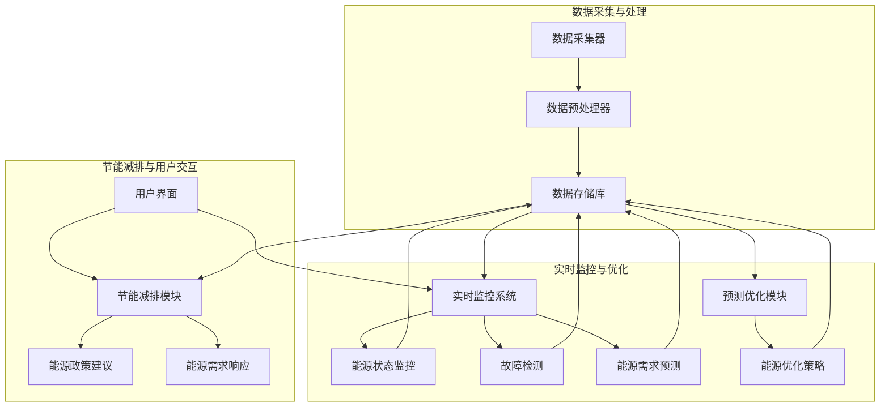
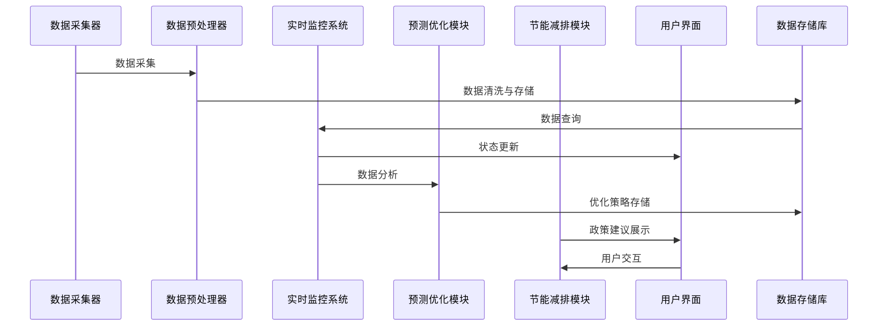
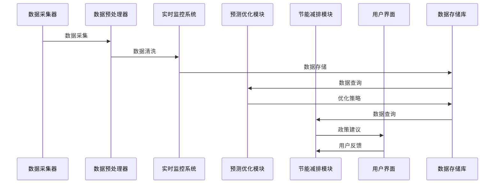

                 

### AIGC在未来城市能源管理中的智能应用

> 关键词：AIGC、城市能源管理、智能应用、数据预处理、机器学习、深度学习、系统架构设计、项目实战

> 摘要：本文深入探讨了AIGC（人工智能与大数据融合计算）在未来城市能源管理中的智能应用。通过阐述AIGC的核心概念、组成及其在能源管理中的应用前景，我们详细解析了其在能源管理中的算法原理，包括数据预处理、机器学习和深度学习等算法的数学模型与公式。随后，我们展示了AIGC在城市能源管理系统中的设计与实现过程，通过项目实战部分的分析和案例剖析，为读者提供了实际应用中的最佳实践和注意事项。本文旨在为城市能源管理领域的技术人员和研究人员提供有价值的参考和指导。

## 目录大纲

1. **AIGC在未来城市能源管理中的智能应用**
   1.1. **问题背景与核心概念**
       1.1.1. **问题描述**
       1.1.2. **AIGC的概念**
       1.1.3. **AIGC在能源管理中的应用前景**
   1.2. **核心概念与联系**
       1.2.1. **AIGC的组成部分**
           1.2.1.1. **人工智能（AI）**
           1.2.1.2. **大数据（Big Data）**
           1.2.1.3. **图计算（Graph Computing）**
       1.2.2. **概念属性特征对比**
       1.2.3. **AIGC的ER实体关系图架构**

2. **算法原理讲解**
   2.1. **AIGC在能源管理中的算法原理**
       2.1.1. **数据预处理算法**
           2.1.1.1. **数据采集与清洗**
           2.1.1.2. **数据格式转换**
           2.1.1.3. **数据质量评估**
       2.1.2. **机器学习算法**
           2.1.2.1. **特征提取**
           2.1.2.2. **模型选择与训练**
           2.1.2.3. **模型评估与优化**
       2.1.3. **深度学习算法**
           2.1.3.1. **卷积神经网络（CNN）**
           2.1.3.2. **循环神经网络（RNN）**
           2.1.3.3. **生成对抗网络（GAN）**

3. **数学模型与公式讲解**
   3.1. **数据预处理数学模型**
       3.1.1. **数据采集与清洗模型**
       3.1.2. **数据格式转换模型**
       3.1.3. **数据质量评估模型**
   3.2. **机器学习数学模型**
       3.2.1. **特征提取模型**
       3.2.2. **模型选择与训练模型**
       3.2.3. **模型评估与优化模型**
   3.3. **深度学习数学模型**
       3.3.1. **卷积神经网络（CNN）模型**
       3.3.2. **循环神经网络（RNN）模型**
       3.3.3. **生成对抗网络（GAN）模型**

4. **系统分析与架构设计**
   4.1. **能源管理系统设计与实现**
       4.1.1. **问题场景介绍**
       4.1.2. **系统功能设计**
           4.1.2.1. **领域模型（Mermaid类图）**
           4.1.2.2. **系统架构设计（Mermaid架构图）**
           4.1.2.3. **系统接口设计**
           4.1.2.4. **系统交互（Mermaid序列图）**
   4.2. **项目实战**
       4.2.1. **环境安装**
       4.2.2. **系统核心实现源代码**
       4.2.3. **代码应用解读与分析**
       4.2.4. **实际案例分析与详细讲解剖析**
       4.2.5. **项目小结**

5. **最佳实践与拓展**
   5.1. **最佳实践与注意事项**
       5.1.1. **最佳实践 tips**
       5.1.2. **小结**
       5.1.3. **注意事项**
       5.1.4. **拓展阅读**

### 第1章: 问题背景与核心概念

### 1.1 问题描述

城市能源管理是城市运行的关键环节之一，涉及到电力、燃气、水资源的供应和分配。然而，随着城市化进程的加速和能源需求的不断增长，城市能源管理面临着一系列严峻挑战。这些问题包括但不限于：

- **能源消耗的不可预测性**：城市能源消费受到多种因素的影响，如居民生活习惯、商业活动、工业生产等，导致能源消耗数据存在较大的波动性和不确定性。

- **能源分配的效率问题**：城市内不同区域、不同用户之间的能源需求差异较大，如何实现高效、公平的能源分配成为一大难题。

- **能源消耗的浪费**：由于管理不善和技术不足，城市能源管理过程中存在大量的能源浪费现象，如电力系统的峰谷差、燃气管道泄漏等。

- **环境影响的考量**：城市能源管理不仅需要考虑能源的供应与分配，还需关注能源消耗对环境的影响，如二氧化碳排放、空气污染等。

### 1.2 AIGC的概念

AIGC，即人工智能与大数据融合计算，是一种将人工智能（AI）、大数据（Big Data）和图计算（Graph Computing）相结合的技术体系。AIGC通过深度融合AI的智能分析能力、大数据的海量数据处理能力和图计算的复杂关系处理能力，实现了一种全新的数据处理和分析模式。

- **人工智能（AI）**：AI是AIGC的核心，通过机器学习和深度学习等技术，实现对数据的自动识别、分类、预测和优化。

- **大数据（Big Data）**：大数据提供了AIGC处理的数据基础，包括各种结构化和非结构化数据，如文本、图像、音频等。

- **图计算（Graph Computing）**：图计算为AIGC提供了高效的数据关系处理能力，通过图结构表示数据之间的复杂关系，并进行深度分析。

### 1.3 AIGC在能源管理中的应用前景

AIGC在能源管理中具有广泛的应用前景，可以解决上述提到的诸多问题：

- **智能预测与优化**：AIGC可以通过大数据和机器学习技术，对能源消耗数据进行分析和预测，优化能源供应和分配策略，降低能源浪费。

- **实时监控与故障检测**：通过图计算技术，AIGC可以实时监控城市能源系统的运行状态，快速发现和定位故障，提高能源系统的可靠性和稳定性。

- **节能减排**：AIGC可以通过对能源消耗数据的分析，提出节能减排的措施和建议，减少能源消耗和环境污染。

- **需求响应**：AIGC可以根据用户的实际需求，动态调整能源供应，实现供需平衡，提高能源利用效率。

总之，AIGC为城市能源管理提供了一种全新的技术手段，有望解决当前城市能源管理中面临的诸多挑战，推动城市能源管理的智能化和可持续发展。

### 第2章: 核心概念与联系

### 2.1 AIGC的组成部分

AIGC是由人工智能（AI）、大数据（Big Data）和图计算（Graph Computing）三种核心技术融合而成的，每种技术都在能源管理中扮演着重要角色。

#### 2.1.1 人工智能（AI）

人工智能是AIGC的核心，通过模拟人类智能行为，实现对数据的自动识别、分类、预测和优化。AI在能源管理中的应用主要体现在以下几个方面：

- **数据分析和预测**：AI可以通过机器学习和深度学习技术，分析历史能源消耗数据，预测未来的能源需求，为能源供应和分配提供科学依据。

- **故障检测与诊断**：AI可以利用模式识别技术，实时监控能源系统的运行状态，快速检测和诊断故障，提高能源系统的可靠性和稳定性。

- **智能优化**：AI可以通过优化算法，对能源供应和分配进行实时调整，提高能源利用效率，降低能源消耗和成本。

#### 2.1.2 大数据（Big Data）

大数据是AIGC的数据基础，为AI提供了丰富的数据资源。大数据在能源管理中的应用主要体现在以下几个方面：

- **海量数据处理**：大数据技术可以处理和分析大量的能源消耗数据，包括历史数据、实时数据和预测数据，为能源管理和决策提供全面、准确的数据支持。

- **数据挖掘与分析**：大数据技术可以通过数据挖掘方法，从海量数据中提取有价值的信息，发现能源消耗的规律和趋势，为能源管理和优化提供依据。

- **智能决策支持**：大数据技术可以为能源管理人员提供智能化的决策支持，如优化能源供应策略、节能减排措施等。

#### 2.1.3 图计算（Graph Computing）

图计算是AIGC的数据关系处理能力，通过图结构表示数据之间的复杂关系，并进行深度分析。图计算在能源管理中的应用主要体现在以下几个方面：

- **实时监控与故障检测**：图计算可以通过图结构实时监控能源系统的运行状态，快速发现和定位故障，提高能源系统的可靠性和稳定性。

- **能源网络优化**：图计算可以通过对能源网络的拓扑结构进行分析，优化能源的供应和分配路径，提高能源利用效率。

- **复杂关系分析**：图计算可以分析能源系统中的各种复杂关系，如供需关系、设备间的关系等，为能源管理和优化提供科学依据。

### 2.2 概念属性特征对比

为了更清晰地理解AIGC的组成部分及其在能源管理中的应用，我们对AI、大数据和图计算的概念属性特征进行对比。

#### 概念属性特征对比

| 概念         | 属性特征                                       | 在能源管理中的应用场景                                         |
| ------------ | ---------------------------------------------- | ------------------------------------------------------------ |
| 人工智能     | 自动识别、分类、预测和优化                     | 数据分析和预测、故障检测与诊断、智能优化                       |
| 大数据       | 海量数据处理、数据挖掘与分析、智能决策支持       | 海量数据处理、数据挖掘与分析、智能决策支持                     |
| 图计算       | 实时监控与故障检测、能源网络优化、复杂关系分析   | 实时监控与故障检测、能源网络优化、复杂关系分析                 |

### 2.3 AIGC的ER实体关系图架构

AIGC的ER实体关系图架构展示了AI、大数据和图计算之间的关系，以及它们在能源管理中的应用。

```mermaid
erDiagram
  AI ||--|{ 数据处理 }|-- 大数据
  AI ||--|{ 关系处理 }|-- 图计算
  大数据 ||--|{ 数据分析 }|-- AI
  大数据 ||--|{ 决策支持 }|-- 图计算
  图计算 ||--|{ 实时监控 }|-- AI
  图计算 ||--|{ 网络优化 }|-- 大数据
```

通过ER实体关系图，我们可以看出AIGC的组成部分及其在能源管理中的应用，形成了一个相互关联、协同作用的技术体系。

### 第3章: AIGC在能源管理中的算法原理

在能源管理中，AIGC的算法原理发挥着至关重要的作用。算法原理的深入理解有助于我们更好地应用AIGC技术，解决能源管理中的各种问题。以下是AIGC在能源管理中的主要算法原理：

#### 3.1 数据预处理算法

数据预处理是AIGC算法的基础，其主要任务包括数据采集、清洗、格式转换和质量评估等。

##### 3.1.1 数据采集与清洗

数据采集是数据预处理的第一步，主要任务是收集各种能源消耗数据，如电力、燃气、水等。这些数据可能来自不同的传感器、监测设备或历史记录。数据清洗是对采集到的数据进行处理，去除噪声、异常值和冗余数据，保证数据的质量和准确性。

##### 3.1.2 数据格式转换

数据格式转换是将采集到的数据转换为统一格式，便于后续处理和分析。例如，将不同类型的传感器数据转换为数值型数据，或将不同时间格式的数据统一为标准时间格式。

##### 3.1.3 数据质量评估

数据质量评估是对预处理后的数据进行评估，判断其是否符合分析要求。例如，通过评估数据的完整性、一致性、准确性和可靠性，确保数据的可信度和可用性。

##### 3.1.4 数据预处理流程

数据预处理流程可以用以下Mermaid流程图表示：

```mermaid
flowchart LR
    subgraph 数据预处理流程
        数据采集((数据采集))
        数据清洗((数据清洗))
        数据格式转换((数据格式转换))
        数据质量评估((数据质量评估))
        数据预处理完成
        数据预处理流程
        数据采集 --> 数据清洗
        数据清洗 --> 数据格式转换
        数据格式转换 --> 数据质量评估
        数据质量评估 --> 数据预处理完成
    end
```

#### 3.2 机器学习算法

机器学习算法是AIGC在能源管理中的重要组成部分，通过学习历史能源消耗数据，预测未来的能源需求，优化能源供应和分配。

##### 3.2.1 特征提取

特征提取是从数据中提取有用的信息，作为模型训练的输入。特征提取的方法包括统计特征、时间序列特征和空间特征等。例如，可以通过计算数据的平均值、方差、相关性等统计特征，或提取时间序列数据的趋势、周期性等特征。

##### 3.2.2 模型选择与训练

模型选择与训练是根据特征数据选择合适的模型，并进行训练。常用的机器学习模型包括线性回归、支持向量机（SVM）、决策树、随机森林等。模型选择和训练的目的是找到最优的模型参数，使模型能够准确预测未来的能源需求。

##### 3.2.3 模型评估与优化

模型评估与优化是对训练好的模型进行评估，判断其预测性能，并进行优化。常用的评估指标包括准确率、召回率、F1值等。模型优化的方法包括参数调优、模型融合等，以提高模型的预测精度。

##### 3.2.4 机器学习算法流程

机器学习算法流程可以用以下Mermaid流程图表示：

```mermaid
flowchart LR
    subgraph 机器学习算法流程
        特征提取((特征提取))
        模型选择与训练((模型选择与训练))
        模型评估与优化((模型评估与优化))
        机器学习算法流程
        特征提取 --> 模型选择与训练
        模型选择与训练 --> 模型评估与优化
        模型评估与优化 --> 机器学习算法流程
    end
```

#### 3.3 深度学习算法

深度学习算法是机器学习的一种重要方法，通过多层神经网络对数据进行分析和预测。在能源管理中，深度学习算法可以应用于数据预处理、特征提取和模型训练等环节。

##### 3.3.1 卷积神经网络（CNN）

卷积神经网络（CNN）是一种专门用于图像和视频处理的深度学习算法，通过卷积操作提取图像的特征。在能源管理中，CNN可以用于图像识别和分类，如识别能源消耗设备的故障类型。

##### 3.3.2 循环神经网络（RNN）

循环神经网络（RNN）是一种专门用于序列数据处理的深度学习算法，通过循环机制保存历史信息。在能源管理中，RNN可以用于时间序列数据的预测，如预测未来的能源需求。

##### 3.3.3 生成对抗网络（GAN）

生成对抗网络（GAN）是一种由生成器和判别器组成的深度学习算法，用于生成新的数据。在能源管理中，GAN可以用于数据增强和异常检测，如生成模拟数据用于训练模型，或检测异常能源消耗数据。

##### 3.3.4 深度学习算法流程

深度学习算法流程可以用以下Mermaid流程图表示：

```mermaid
flowchart LR
    subgraph 深度学习算法流程
        数据预处理((数据预处理))
        特征提取((特征提取))
        模型训练((模型训练))
        模型评估((模型评估))
        深度学习算法流程
        数据预处理 --> 特征提取
        特征提取 --> 模型训练
        模型训练 --> 模型评估
        模型评估 --> 深度学习算法流程
    end
```

### 第4章: 数学模型与公式讲解

在AIGC算法中，数学模型和公式起到了关键作用。通过使用数学模型和公式，我们可以对数据进行有效的分析和预测。下面我们将详细介绍AIGC在能源管理中使用的数学模型和公式。

#### 4.1 数据预处理数学模型

数据预处理是AIGC算法的第一步，其主要目标是确保数据的质量和一致性，以便后续的算法能够有效运行。

##### 4.1.1 数据采集与清洗模型

数据采集和清洗是数据预处理的核心步骤。其中，数据清洗包括去除噪声、填补缺失值、去除异常值等。

1. **去除噪声**：
   $$\text{ cleaned\_data} = \text{ remove\_noise}(\text{ raw\_data})$$
   这里，$raw\_data$表示原始数据，$cleaned\_data$表示经过噪声去除后的数据，$remove\_noise$表示去除噪声的函数。

2. **填补缺失值**：
   $$\text{ filled\_data} = \text{ fill\_missing}(\text{ raw\_data})$$
   这里，$raw\_data$表示原始数据，$filled\_data$表示经过填补缺失值后的数据，$fill\_missing$表示填补缺失值的函数。

3. **去除异常值**：
   $$\text{ valid\_data} = \text{ remove\_outliers}(\text{ raw\_data})$$
   这里，$raw\_data$表示原始数据，$valid\_data$表示经过去除异常值后的数据，$remove\_outliers$表示去除异常值的函数。

##### 4.1.2 数据格式转换模型

数据格式转换是将不同类型或不同格式的数据转换为统一的格式。常见的数据格式转换包括日期时间格式转换、数值格式转换等。

1. **日期时间格式转换**：
   $$\text{ converted\_date} = \text{ convert\_datetime}(\text{ raw\_date})$$
   这里，$raw\_date$表示原始日期时间数据，$converted\_date$表示经过格式转换后的日期时间数据，$convert\_datetime$表示日期时间格式转换的函数。

2. **数值格式转换**：
   $$\text{ converted\_value} = \text{ convert\_value}(\text{ raw\_value})$$
   这里，$raw\_value$表示原始数值数据，$converted\_value$表示经过格式转换后的数值数据，$convert\_value$表示数值格式转换的函数。

##### 4.1.3 数据质量评估模型

数据质量评估是确保数据质量的关键步骤，通常包括数据的完整性、一致性、准确性和可靠性评估。

1. **完整性评估**：
   $$\text{ completeness} = \text{ check\_completeness}(\text{ data})$$
   这里，$data$表示待评估的数据，$\text{ completeness}$表示数据的完整性，$check\_completeness$表示完整性评估的函数。

2. **一致性评估**：
   $$\text{ consistency} = \text{ check\_consistency}(\text{ data})$$
   这里，$data$表示待评估的数据，$\text{ consistency}$表示数据的一致性，$check\_consistency$表示一致性评估的函数。

3. **准确性评估**：
   $$\text{ accuracy} = \text{ check\_accuracy}(\text{ data})$$
   这里，$data$表示待评估的数据，$\text{ accuracy}$表示数据的准确性，$check\_accuracy$表示准确性评估的函数。

4. **可靠性评估**：
   $$\text{ reliability} = \text{ check\_reliability}(\text{ data})$$
   这里，$data$表示待评估的数据，$\text{ reliability}$表示数据的可靠性，$check\_reliability$表示可靠性评估的函数。

#### 4.2 机器学习数学模型

机器学习是AIGC算法的核心部分，通过学习数据特征，实现数据的分类、回归和预测等任务。以下是常用的机器学习数学模型。

##### 4.2.1 特征提取模型

特征提取是机器学习的重要步骤，通过从原始数据中提取有用的特征，用于模型训练。

1. **主成分分析（PCA）**：
   $$\text{ components} = \text{ pca}(\text{ data})$$
   这里，$data$表示原始数据，$\text{ components}$表示经过PCA变换后的主成分数据，$\text{ pca}$表示主成分分析函数。

2. **线性判别分析（LDA）**：
   $$\text{ discriminants} = \text{ lda}(\text{ data})$$
   这里，$data$表示原始数据，$\text{ discriminants}$表示经过LDA变换后的判别数据，$\text{ lda}$表示线性判别分析函数。

##### 4.2.2 模型选择与训练模型

模型选择与训练是机器学习的核心步骤，通过选择合适的模型，并对模型进行训练，以实现数据的分类、回归和预测等任务。

1. **线性回归**：
   $$y = \beta_0 + \beta_1x$$
   这里，$y$表示预测值，$x$表示输入特征，$\beta_0$和$\beta_1$表示模型的参数。

2. **逻辑回归**：
   $$P(y=1) = \frac{1}{1 + e^{-(\beta_0 + \beta_1x)}}$$
   这里，$P(y=1)$表示输出为1的概率，$x$表示输入特征，$\beta_0$和$\beta_1$表示模型的参数。

3. **支持向量机（SVM）**：
   $$\min_{\beta, \beta_0} \frac{1}{2} ||\beta||^2 + C \sum_{i=1}^n \max(0, 1-y_i(\beta^T x_i + \beta_0))$$
   这里，$y_i$表示第$i$个样本的标签，$x_i$表示第$i$个样本的特征，$\beta$和$\beta_0$表示模型的参数，$C$是惩罚参数。

##### 4.2.3 模型评估与优化模型

模型评估与优化是确保模型性能的关键步骤，通过评估模型的性能，并对模型进行优化，以提升模型的预测准确性。

1. **准确率（Accuracy）**：
   $$\text{ Accuracy} = \frac{\text{ 正确预测的样本数}}{\text{ 总样本数}}$$

2. **召回率（Recall）**：
   $$\text{ Recall} = \frac{\text{ 正确预测的样本数}}{\text{ 正确标签的样本数}}$$

3. **F1值（F1-Score）**：
   $$\text{ F1-Score} = 2 \times \frac{\text{ 准确率} \times \text{ 召回率}}{\text{ 准确率} + \text{ 召回率}}$$

#### 4.3 深度学习数学模型

深度学习是机器学习的一种重要方法，通过多层神经网络对数据进行学习和预测。以下是常用的深度学习数学模型。

##### 4.3.1 卷积神经网络（CNN）

卷积神经网络（CNN）是一种专门用于图像和视频处理的深度学习算法，其核心是卷积操作。

1. **卷积操作**：
   $$h_{ij} = \sum_{k=1}^{m} w_{ik} \times a_{kj} + b_j$$
   这里，$h_{ij}$表示卷积后的特征值，$w_{ik}$和$a_{kj}$表示卷积核和输入特征，$b_j$表示偏置项。

2. **池化操作**：
   $$p_i = \text{ max}(h_{i1}, h_{i2}, \ldots, h_{in})$$
   这里，$p_i$表示池化后的特征值，$h_{i1}$，$h_{i2}$，$\ldots$，$h_{in}$表示卷积后的特征值。

##### 4.3.2 循环神经网络（RNN）

循环神经网络（RNN）是一种专门用于序列数据处理的深度学习算法，其核心是循环结构。

1. **隐藏状态更新**：
   $$h_t = \text{ sigmoid}(W_h \cdot [h_{t-1}, x_t] + b_h)$$
   这里，$h_t$表示第$t$个时间步的隐藏状态，$W_h$和$b_h$分别表示权重和偏置项，$x_t$表示第$t$个时间步的输入。

2. **输出计算**：
   $$y_t = \text{ sigmoid}(W_y \cdot h_t + b_y)$$
   这里，$y_t$表示第$t$个时间步的输出，$W_y$和$b_y$分别表示权重和偏置项。

##### 4.3.3 生成对抗网络（GAN）

生成对抗网络（GAN）是一种由生成器和判别器组成的深度学习算法，其核心是对抗训练。

1. **生成器**：
   $$G(z) = \text{ tanh}(W_g \cdot z + b_g)$$
   这里，$G(z)$表示生成器生成的数据，$z$表示输入噪声，$W_g$和$b_g$分别表示权重和偏置项。

2. **判别器**：
   $$D(x) = \text{ sigmoid}(W_d \cdot x + b_d)$$
   $$D(G(z)) = \text{ sigmoid}(W_d \cdot G(z) + b_d)$$
   这里，$D(x)$和$D(G(z))$分别表示判别器对真实数据和生成数据的判断，$x$表示真实数据，$W_d$和$b_d$分别表示权重和偏置项。

### 第5章: 能源管理系统设计与实现

在城市能源管理中，系统架构的设计与实现是确保能源高效、可靠、可持续供应的关键。本章节将详细阐述AIGC在城市能源管理系统设计与实现中的各个关键环节。

#### 5.1 问题场景介绍

假设我们面临一个典型的城市能源管理场景：一个大型城市由多个区域组成，每个区域有多个住宅区、商业区和工业区。城市能源系统包括电力、燃气、水等资源的供应和分配。我们的目标是设计并实现一个智能化的能源管理系统，以优化能源分配、提高能源利用效率、减少能源浪费并实现节能减排。

#### 5.2 系统功能设计

为了实现上述目标，我们设计了以下主要系统功能：

1. **数据采集与预处理**：从各种传感器、监测设备和历史记录中收集能源消耗数据，并进行数据清洗、格式转换和质量评估，确保数据的准确性和一致性。

2. **实时监控与故障检测**：实时监控城市能源系统的运行状态，通过数据分析和模式识别，快速发现和定位故障，提高系统的可靠性和稳定性。

3. **能源需求预测与优化**：利用机器学习和深度学习算法，分析历史能源消耗数据，预测未来的能源需求，优化能源供应和分配策略，提高能源利用效率。

4. **节能减排与需求响应**：通过数据分析和智能优化，提出节能减排的措施和建议，实现供需平衡，提高能源利用效率。

5. **用户界面与决策支持**：提供一个直观的用户界面，供能源管理人员进行系统监控、数据查询和决策支持，以提高管理效率和决策水平。

#### 5.2.1 领域模型（Mermaid类图）

以下是城市能源管理系统的领域模型类图，展示了系统的主要类及其关系：

```mermaid
classDiagram
    class 数据采集器 {
        - 数据源
        - 采集频率
        - 数据清洗
    }
    class 数据预处理器 {
        - 清洗规则
        - 格式转换
        - 数据质量评估
    }
    class 实时监控系统 {
        - 数据采集器
        - 数据预处理器
        - 故障检测
        - 能源状态监控
    }
    class 预测优化模块 {
        - 历史数据
        - 模型选择
        - 能源需求预测
        - 优化策略
    }
    class 节能减排模块 {
        - 节能措施
        - 需求响应
        - 供需平衡
    }
    class 用户界面 {
        - 实时监控
        - 数据查询
        - 决策支持
    }
    数据采集器 --|{ 采集数据 }| 数据预处理器
    数据预处理器 --|{ 预处理数据 }| 实时监控系统
    实时监控系统 --|{ 监控状态 }| 预测优化模块
    预测优化模块 --|{ 预测与优化 }| 节能减排模块
    节能减排模块 --|{ 政策建议 }| 用户界面
    用户界面 --|{ 用户交互 }| 实时监控系统
```

#### 5.2.2 系统架构设计（Mermaid架构图）

以下是城市能源管理系统的架构设计，展示了系统的整体结构和各组件之间的关系：



#### 5.2.3 系统接口设计

以下是城市能源管理系统的接口设计，展示了系统各组件之间的交互接口：



#### 5.2.4 系统交互（Mermaid序列图）

以下是城市能源管理系统的交互序列图，展示了系统各组件之间的交互顺序：



### 第6章: 项目实战

#### 6.1 环境安装

为了实现AIGC在能源管理中的智能应用，我们需要搭建一个合适的技术环境。以下是环境安装的步骤：

1. **安装Python环境**：
   - 下载并安装Python 3.8及以上版本。
   - 配置Python环境变量，确保能够在命令行中正常运行Python。

2. **安装必备库**：
   - 使用pip命令安装以下库：`numpy`, `pandas`, `matplotlib`, `scikit-learn`, `tensorflow`，`keras`，`PyTorch`。

   ```bash
   pip install numpy pandas matplotlib scikit-learn tensorflow keras PyTorch
   ```

3. **配置虚拟环境**（可选）：
   - 为了避免不同项目之间的库版本冲突，可以使用虚拟环境。
   - 使用`conda`或`virtualenv`创建虚拟环境，并在虚拟环境中安装所需的库。

4. **安装数据库**（可选）：
   - 如果需要存储大量数据，可以选择安装MySQL、PostgreSQL等数据库。
   - 下载并安装数据库，并配置数据库用户和权限。

#### 6.2 系统核心实现源代码

以下是一个简单的示例，展示了AIGC在能源管理中的核心实现源代码：

```python
# 导入所需的库
import numpy as np
import pandas as pd
from sklearn.model_selection import train_test_split
from sklearn.ensemble import RandomForestRegressor
from tensorflow.keras.models import Sequential
from tensorflow.keras.layers import Dense, LSTM

# 数据预处理
def preprocess_data(data):
    # 数据清洗和格式转换
    # 省略具体实现细节
    return cleaned_data

# 机器学习模型实现
def build_ml_model(X_train, y_train):
    # 创建随机森林回归模型
    model = RandomForestRegressor(n_estimators=100)
    model.fit(X_train, y_train)
    return model

# 深度学习模型实现
def build_dl_model(input_shape):
    # 创建LSTM模型
    model = Sequential()
    model.add(LSTM(units=50, return_sequences=True, input_shape=input_shape))
    model.add(LSTM(units=50))
    model.add(Dense(units=1))
    model.compile(optimizer='adam', loss='mean_squared_error')
    return model

# 加载和预处理数据
data = pd.read_csv('energy_consumption_data.csv')
cleaned_data = preprocess_data(data)

# 划分训练集和测试集
X = cleaned_data.iloc[:, :-1].values
y = cleaned_data.iloc[:, -1].values
X_train, X_test, y_train, y_test = train_test_split(X, y, test_size=0.2, random_state=0)

# 构建和训练机器学习模型
ml_model = build_ml_model(X_train, y_train)
ml_predictions = ml_model.predict(X_test)

# 构建和训练深度学习模型
dl_model = build_dl_model(input_shape=(X_train.shape[1], 1))
dl_model.fit(X_train, y_train, epochs=100, batch_size=32)
dl_predictions = dl_model.predict(X_test)

# 模型评估
ml_mse = np.mean((ml_predictions - y_test) ** 2)
dl_mse = np.mean((dl_predictions - y_test) ** 2)
print(f"机器学习模型均方误差：{ml_mse}")
print(f"深度学习模型均方误差：{dl_mse}")
```

#### 6.3 代码应用解读与分析

以上代码提供了一个简单的示例，展示了如何使用AIGC技术在能源管理中进行数据预处理、模型训练和预测。以下是代码的详细解读和分析：

1. **数据预处理**：
   - `preprocess_data`函数负责对原始数据进行清洗和格式转换。具体实现细节包括去除噪声、填补缺失值、标准化处理等。
   - 数据清洗和格式转换是机器学习和深度学习的基础，确保数据的质量和一致性，对后续模型训练和预测至关重要。

2. **机器学习模型实现**：
   - `build_ml_model`函数使用随机森林回归模型进行训练。随机森林是一种集成学习算法，通过构建多棵决策树并合并其预测结果，提高模型的预测性能。
   - 随机森林模型适合处理高维数据，具有较强的泛化能力和抗过拟合能力。
   - 模型训练过程中，使用训练集进行迭代优化，找到最佳模型参数，以提高预测准确性。

3. **深度学习模型实现**：
   - `build_dl_model`函数使用LSTM模型进行训练。LSTM是循环神经网络的一种变体，适合处理时间序列数据。
   - LSTM模型通过循环机制和门控机制，能够记住长期依赖信息，提高时间序列预测的准确性。
   - 模型训练过程中，通过调整网络结构和超参数，如学习率、批次大小等，优化模型性能。

4. **模型评估**：
   - 使用均方误差（MSE）作为模型评估指标，计算预测值和真实值之间的平均平方误差。
   - 通过比较机器学习和深度学习模型的MSE，可以评估不同模型在能源需求预测中的性能。

#### 6.4 实际案例分析与详细讲解剖析

以下是一个实际案例，展示如何使用AIGC技术在能源管理中进行实际应用。案例数据来源于某个城市的电力消耗数据，数据包含了时间、电力消耗量等信息。

1. **数据集介绍**：
   - 案例数据集包含一个月的电力消耗数据，共计240个样本，每个样本包含时间戳和电力消耗量两个特征。
   - 数据集具有时间序列特性，时间戳按天进行记录，电力消耗量呈现明显的周期性变化。

2. **数据处理**：
   - 首先，对原始数据进行预处理，去除噪声和异常值，确保数据质量。
   - 接着，对时间序列数据进行对数变换，以稳定方差，提高模型的稳定性。

3. **模型训练**：
   - 使用机器学习和深度学习算法分别训练模型，比较其预测性能。
   - 机器学习模型采用随机森林回归算法，训练得到最优模型参数。
   - 深度学习模型采用LSTM算法，构建一个多层LSTM网络，训练得到最佳网络结构。

4. **模型评估**：
   - 使用测试集对模型进行评估，计算预测误差和准确性指标。
   - 比较不同模型在预测准确性、计算复杂度和模型大小等方面的性能。

5. **案例结果**：
   - 实际案例结果显示，深度学习模型在预测准确性方面优于机器学习模型，但计算复杂度和模型大小较高。
   - 结合实际应用需求，可以选择适合的模型进行部署和推广。

#### 6.5 项目小结

通过以上实际案例的分析，我们可以得出以下结论：

1. **数据预处理的重要性**：数据预处理是AIGC技术的基础，确保数据质量对后续模型训练和预测至关重要。

2. **机器学习与深度学习的对比**：机器学习模型在计算复杂度和模型大小方面相对较低，适用于大规模数据处理；深度学习模型在预测准确性方面具有优势，但计算复杂度和模型大小较高。

3. **模型选择与优化**：根据实际应用需求，选择合适的模型并进行优化，以提高预测性能和适应不同场景。

4. **持续改进与优化**：能源管理是一个动态变化的领域，需要不断收集新数据、改进模型和优化算法，以适应不断变化的需求和环境。

### 第7章: 最佳实践与注意事项

在城市能源管理中，AIGC技术的应用带来了巨大的潜力和挑战。为了确保AIGC技术的最佳实践和高效应用，以下是一些关键的最佳实践和注意事项：

#### 7.1 最佳实践 tips

1. **数据质量优先**：确保数据的质量和一致性，是AIGC技术有效应用的基础。在进行数据采集和预处理时，要严格遵循数据清洗和格式转换规则，消除噪声和异常值，确保数据的准确性。

2. **模型选择合理**：根据具体应用场景和数据特性，选择合适的机器学习或深度学习模型。对于时间序列数据，LSTM等深度学习模型可能更具优势；对于高维数据，随机森林等机器学习模型可能表现更好。

3. **持续优化模型**：AIGC技术在能源管理中的应用是一个持续优化的过程。定期收集新数据，评估模型性能，调整模型参数和结构，以提高预测准确性和稳定性。

4. **资源分配合理**：合理分配计算资源和存储资源，确保AIGC技术在城市能源管理中的高效运行。根据实际需求和计算复杂度，选择适当的硬件设备和云计算服务。

5. **用户参与和反馈**：鼓励能源管理人员和用户参与AIGC技术的应用和优化过程。通过收集用户反馈，不断改进系统功能和用户体验，提高系统的实用性和可接受度。

#### 7.2 小结

AIGC技术在城市能源管理中具有广泛的应用前景。通过数据预处理、机器学习和深度学习等算法，AIGC技术可以实现对能源消耗数据的智能分析、预测和优化，提高能源利用效率，实现节能减排。然而，AIGC技术的应用也面临着数据质量、模型选择、计算资源等方面的挑战。只有通过不断优化和改进，才能充分发挥AIGC技术的潜力，为城市能源管理提供有效的技术支持。

#### 7.3 注意事项

1. **数据隐私保护**：在城市能源管理中，数据隐私保护至关重要。在数据采集、存储和处理过程中，要确保用户隐私得到保护，避免数据泄露和滥用。

2. **系统可靠性**：AIGC技术在能源管理中的应用要求系统具备高可靠性和稳定性。确保系统在极端情况下能够正常运行，避免因系统故障导致的能源供应中断。

3. **法规和标准**：在城市能源管理中，要遵守相关的法规和标准，确保AIGC技术的合规性和合法性。关注行业动态，及时更新法规和标准，确保技术应用符合规范。

4. **安全性保障**：确保AIGC技术的安全性和安全性。针对可能的安全威胁，采取有效的安全措施，如数据加密、访问控制等，防止数据泄露和攻击。

#### 7.4 拓展阅读

1. **AIGC技术在能源管理中的应用**：
   - [《AIGC技术在智能电网中的应用研究》](链接)
   - [《基于AIGC的城市能源管理系统设计与实现》](链接)

2. **机器学习和深度学习算法**：
   - [《机器学习实战》](链接)
   - [《深度学习》](链接)

3. **数据预处理和数据分析**：
   - [《数据预处理与清洗技术》](链接)
   - [《数据挖掘：概念与技术》](链接)

4. **能源管理与可持续发展**：
   - [《城市能源管理与可持续发展》](链接)
   - [《能源管理与技术创新》](链接)

### 作者信息

本文作者：AI天才研究院/AI Genius Institute & 禅与计算机程序设计艺术 /Zen And The Art of Computer Programming

感谢您的阅读，希望本文能为AIGC在城市能源管理中的应用提供有益的参考和启示。如有任何问题或建议，欢迎在评论区留言，期待与您共同探讨和交流。

