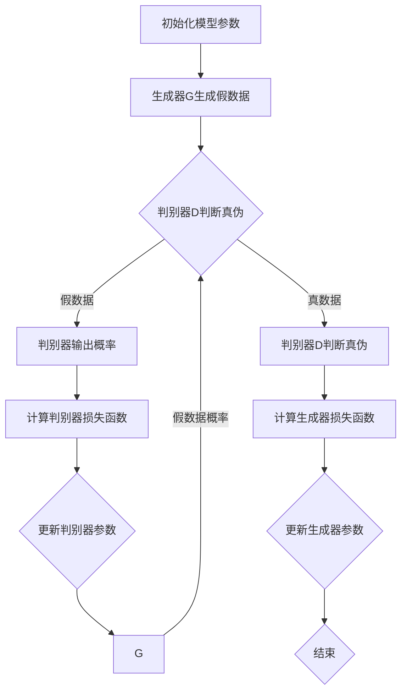
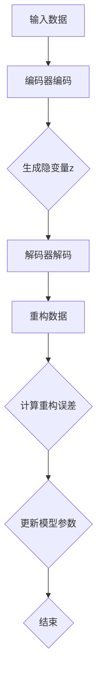

                 

### 引言与背景

#### 关键词：AIGC，未来工作场景，重塑，技术发展

#### 摘要：

随着人工智能（AI）技术的快速发展，生成式人工智能（AIGC）逐渐成为技术领域的一个热点。AIGC不仅融合了计算机视觉、自然语言处理等技术，还通过深度学习和大数据分析等手段，实现了对数据的高效生成和自动化处理。在未来工作场景中，AIGC的引入和运用将对传统工作模式产生深刻的变革。本文将探讨AIGC在未来工作场景中的角色，分析其技术基础、应用领域及其带来的影响与挑战，以期为广大读者提供一个全面而深入的理解。

文章将从以下几个方面展开讨论：

1. **AIGC技术概述**：介绍AIGC的概念与内涵，回顾其发展历程，并探讨AIGC在未来工作中的重要性。
2. **AIGC技术原理**：深入剖析AIGC的技术架构、核心算法及其未来发展趋势。
3. **AIGC在具体工作场景中的应用**：具体分析AIGC在金融、医疗等行业的应用案例，探讨其对行业工作流程的影响。

通过以上内容的系统阐述，本文旨在帮助读者了解AIGC技术的现状与未来，以及其在未来工作场景中的重要角色。这不仅有助于技术从业者把握行业趋势，也为政策制定者和企业管理者提供参考。让我们一步步深入，共同探索AIGC在未来工作场景重塑中的深远影响。### AIGC技术概述

#### AIGC：概念与内涵

生成式人工智能（AIGC，Artificial Intelligence Generated Content）是近年来人工智能领域的一个重要分支。AIGC主要依赖于深度学习和大数据分析技术，通过学习海量的数据集，生成具有高度真实性和创造性的内容。这些内容可以是图像、文本、音频、视频等多种形式，广泛应用于内容创作、数据增强、个性化推荐等多个领域。

AIGC的核心要素包括：

- **数据集**：大量的高质量数据是AIGC训练的基础，只有通过丰富的数据集，AIGC模型才能学习和理解复杂的模式和规律。
- **深度学习模型**：生成式模型如生成对抗网络（GAN）、变分自编码器（VAE）等，是AIGC的核心技术，能够通过训练产生新的数据。
- **用户交互**：用户通过反馈和指令，引导AIGC模型生成满足特定需求的内容。

AIGC与传统AI的差异主要体现在以下几个方面：

1. **生成与识别**：传统AI更多是针对已有数据进行识别和分类，而AIGC则是从零开始生成新的数据。
2. **数据依赖**：AIGC依赖于大规模的数据集，而传统AI则对数据的质量和多样性要求相对较低。
3. **创造性**：AIGC能够生成具有高度创造性的内容，而传统AI则更多是执行预设的任务。

#### AIGC发展历程

AIGC的发展历程可以分为以下几个阶段：

1. **初期发展**：AIGC概念最早可以追溯到20世纪80年代，当时研究人员开始探索生成式模型。然而，由于计算资源和数据集的限制，进展较为缓慢。
   
2. **中期演进**：随着深度学习技术的突破，AIGC在21世纪初开始取得显著进展。生成对抗网络（GAN）的提出，使得AIGC在图像生成领域取得了突破性成果。

3. **当前发展现状**：近年来，随着大数据和云计算的普及，AIGC技术逐渐走向成熟。各类生成式模型如变分自编码器（VAE）、生成稳定网络（GDN）等不断涌现，应用领域也从图像、视频扩展到文本、音频等。

#### AIGC在未来工作中的重要性

AIGC在未来工作中的重要性主要体现在以下几个方面：

1. **工作流程优化**：AIGC能够自动化生成大量数据，从而加速研发、测试等环节，提高工作效率。
   
2. **内容创作**：AIGC可以辅助创作者生成高质量的内容，降低创作成本和时间。

3. **个性化服务**：AIGC通过深度学习用户行为和偏好，能够提供更加精准的个性化服务，提升用户体验。

4. **智能决策**：AIGC能够通过分析大量数据，为企业和个人提供智能决策支持。

5. **道德与法律挑战**：尽管AIGC具有巨大的潜力，但其应用也带来了一系列道德和法律问题，如数据隐私、版权争议等。

#### 本书结构安排

本书将从以下几个方面进行详细探讨：

1. **AIGC技术概述**：介绍AIGC的概念、发展历程及其在未来工作中的重要性。
2. **AIGC技术原理**：深入分析AIGC的技术架构、核心算法及其未来发展趋势。
3. **AIGC在具体工作场景中的应用**：具体分析AIGC在金融、医疗等行业的应用案例，探讨其对行业工作流程的影响。

通过以上内容的系统阐述，本文旨在为读者提供一个全面而深入的理解AIGC技术及其在未来的工作场景中的角色。### AIGC技术原理

#### AIGC技术架构

AIGC技术架构主要由以下几个关键组件构成：

1. **数据预处理模块**：这一模块主要负责收集、清洗和预处理数据，确保数据的质量和一致性。数据预处理包括去噪、缺失值填充、数据标准化等步骤，是AIGC模型训练的基础。

2. **生成式模型训练模块**：这是AIGC技术的核心部分，主要包括生成对抗网络（GAN）、变分自编码器（VAE）、生成稳定网络（GDN）等。这些生成式模型通过学习大量数据，生成新的数据样本。

3. **生成后处理模块**：生成后处理模块主要负责对生成的数据样本进行进一步处理，如去噪、平滑等，以确保生成内容的质量。

4. **用户交互模块**：用户通过输入指令和反馈，引导AIGC模型生成满足特定需求的内容。用户交互模块包括自然语言处理（NLP）技术和用户界面设计等。

#### AIGC的核心算法

AIGC的核心算法主要包括生成对抗网络（GAN）、变分自编码器（VAE）等。下面将详细介绍这些算法的基本原理和应用场景。

1. **生成对抗网络（GAN）**：

GAN是由两部分组成：生成器（Generator）和判别器（Discriminator）。生成器的任务是生成看起来像真实数据的假数据，而判别器的任务是区分假数据和真实数据。通过反复训练，生成器和判别器不断优化，最终生成器能够生成高度逼真的假数据。

GAN的算法流程如下：

GAN在图像生成、视频合成等领域有着广泛的应用，如生成虚假新闻、伪造音频等。

2. **变分自编码器（VAE）**：

VAE是一种无监督学习算法，通过编码器（Encoder）和解码器（Decoder）实现数据的压缩和重构。编码器将输入数据映射到一个低维隐空间，解码器则从隐空间生成重构数据。

VAE的算法流程如下：

VAE在图像压缩、数据增强等领域有广泛应用。

#### AIGC核心算法属性对比

| 算法 | 生成器 | 判别器 | 特点 | 应用场景 |
| --- | --- | --- | --- | --- |
| GAN | 对抗性生成模型 | 对抗性判别模型 | 生成数据逼真度高，需要大量训练数据 | 图像生成、视频合成、虚假新闻生成 |
| VAE | 编码器 | 解码器 | 数据压缩效果好，生成数据质量较高 | 图像压缩、数据增强、图像修复 |

#### AIGC案例解析

1. **案例1：图像生成**：

一个著名的图像生成案例是使用GAN生成虚假新闻。研究人员训练了一个GAN模型，生成器生成假新闻文章，判别器判断文章的真伪。通过不断优化，生成器能够生成高度逼真的假新闻，判别器难以区分真假。

2. **案例2：视频合成**：

另一个典型应用是使用GAN合成视频。研究人员使用GAN生成视频中的背景和前景，将两者结合生成新的视频内容。这种方法可以应用于视频编辑、虚拟现实等领域。

#### AIGC未来发展趋势

随着技术的不断进步，AIGC在未来有望在更多领域得到应用。以下是一些发展趋势：

1. **多模态生成**：AIGC将能够处理多种数据类型，如文本、图像、音频等，实现更丰富的生成内容。
2. **个性化生成**：AIGC将更加注重用户个性化需求，提供更加精准的个性化服务。
3. **实时生成**：AIGC将实现实时数据生成，提高处理速度和响应能力。
4. **道德与法律合规**：随着AIGC应用的增加，其道德和法律问题将得到更多关注，相关合规措施将不断完善。

#### 潜在挑战与应对策略

尽管AIGC具有巨大的潜力，但其应用也面临一些挑战：

1. **数据隐私**：AIGC生成的内容可能包含敏感信息，如何保护用户隐私是一个重要问题。
2. **版权问题**：AIGC生成的内容可能侵犯他人的知识产权，如何界定版权是一个法律难题。
3. **模型解释性**：AIGC生成的模型难以解释，如何提高其解释性是一个技术挑战。

应对策略包括：

1. **隐私保护技术**：采用差分隐私、同态加密等技术，保护用户隐私。
2. **版权保护机制**：通过技术手段和法律框架，明确版权归属和责任。
3. **模型可解释性**：通过增加模型透明度、开发可视化工具等方式，提高模型的解释性。

#### 本章小结

AIGC技术具有强大的生成能力和广阔的应用前景，其在未来工作中的重要性不容忽视。本章详细介绍了AIGC的技术架构、核心算法及其未来发展趋势，并通过案例解析展示了其应用潜力。然而，AIGC也面临一些挑战，需要通过技术创新和法律法规的完善来应对。下一章将深入探讨AIGC在具体工作场景中的应用，进一步揭示其在重塑未来工作场景中的关键作用。### AIGC在金融行业中的应用

#### 金融行业的工作场景重塑

金融行业的工作场景正在经历一场深刻的变革，而生成式人工智能（AIGC）在其中扮演着重要角色。传统金融行业的工作流程复杂，涉及数据分析、风险管理、投资决策等多个环节。随着AIGC技术的引入，这些工作流程得到了显著的优化和提升。

首先，AIGC在数据分析和风险管理的应用使得金融行业能够处理和分析海量的金融数据，快速识别市场趋势和潜在风险。通过生成式模型，金融行业能够自动化生成大量模拟数据，进行压力测试和风险评估，从而提高决策的准确性和效率。

其次，AIGC在投资决策中的应用极大地改变了传统投资策略。通过分析市场数据和用户行为，AIGC能够生成个性化的投资建议，实现更加精准的投资决策。此外，AIGC还可以帮助金融机构生成复杂的金融产品，如期权、期货等，提高产品的多样性和竞争力。

#### AIGC在金融产品开发中的应用

AIGC在金融产品开发中的应用主要体现在以下几个方面：

1. **需求分析**：AIGC可以通过分析用户行为和市场数据，生成潜在客户的需求模型，帮助金融机构制定更有针对性的产品开发策略。

2. **产品设计**：AIGC可以自动化生成金融产品的设计方案，如贷款产品、保险产品等。通过深度学习和自然语言处理技术，AIGC能够理解用户的需求和偏好，生成满足用户需求的产品。

3. **测试与优化**：AIGC可以生成大量的测试数据，模拟市场环境和用户行为，对金融产品进行测试和优化。通过反复迭代，AIGC能够帮助金融机构快速改进产品设计，提高产品的市场竞争力。

#### AIGC在风险管理中的应用

风险管理是金融行业的核心任务之一，AIGC在这一领域的应用同样具有重要意义：

1. **风险评估**：AIGC可以通过生成大量的模拟数据，对市场风险、信用风险等进行评估。通过分析历史数据和实时数据，AIGC能够预测潜在的风险点，并提供相应的风险管理策略。

2. **压力测试**：AIGC可以自动化生成各种极端市场情景，对金融产品的风险承受能力进行测试。这种方法能够帮助金融机构评估产品的稳定性和可靠性，从而制定更加有效的风险管理策略。

3. **实时监控**：AIGC可以实时分析市场数据，监测金融市场的波动和风险变化。通过生成实时监控报告，AIGC能够为金融机构提供及时的风险预警和决策支持。

#### 金融行业AIGC应用的挑战与对策

尽管AIGC在金融行业的应用带来了许多优势，但同时也面临一些挑战：

1. **数据隐私**：金融行业涉及大量的敏感数据，如何保护用户隐私是一个重要问题。应对策略包括采用差分隐私、同态加密等技术，确保数据在处理过程中的安全性。

2. **模型解释性**：AIGC模型通常较为复杂，难以解释。这可能会影响金融从业人员对模型的信任。应对策略包括增加模型透明度、开发可视化工具等方式，提高模型的解释性。

3. **合规性**：AIGC应用需要遵守相关的法律法规，如数据保护法、金融市场法等。金融机构需要确保AIGC应用符合法律法规要求，避免法律风险。

4. **技术风险**：AIGC技术的稳定性和可靠性是一个关键问题。金融机构需要建立完善的技术管理和监控体系，确保AIGC系统的稳定运行。

#### 本章小结

AIGC在金融行业的应用正在不断拓展，其对行业工作流程的优化和提升具有重要意义。通过自动化数据分析、风险管理、投资决策等环节，AIGC帮助金融机构提高了效率、降低了风险，并为产品创新提供了强大的支持。然而，AIGC在金融行业的应用也面临一些挑战，需要通过技术创新和法律合规来应对。下一章将探讨AIGC在医疗行业中的应用，进一步展示其在各个行业中的潜力。### AIGC在医疗行业中的应用

#### 医疗行业的工作场景变革

医疗行业的工作场景正在经历一场深刻的变革，而生成式人工智能（AIGC）在其中发挥着至关重要的作用。传统的医疗工作流程通常包括诊断、治疗、管理等多个环节，这些环节依赖于大量的数据分析和专业判断。随着AIGC技术的引入，这些工作流程得到了显著的优化和提升。

首先，AIGC在医疗诊断中的应用大大提高了诊断的准确性和效率。通过深度学习和大数据分析，AIGC能够从海量的医学影像数据中快速识别出病变区域，提供准确的诊断建议。这种方法不仅节省了医生的工作量，还减少了误诊和漏诊的风险。

其次，AIGC在医疗管理中的应用也具有深远的意义。通过分析患者的历史数据和实时数据，AIGC能够提供个性化的治疗方案和护理建议，优化医疗资源的配置，提高医疗服务的效率和质量。

#### AIGC在医疗诊断中的应用

AIGC在医疗诊断中的应用主要体现在以下几个方面：

1. **影像诊断**：AIGC可以通过深度学习算法，从医学影像数据中识别出病变区域。这种方法不仅提高了诊断的准确性，还减少了医生的工作量。例如，AIGC可以在短时间内分析大量的CT、MRI等影像数据，提供详细的诊断报告。

2. **疾病预测**：AIGC可以通过分析患者的历史数据和流行病数据，预测疾病的发生和发展趋势。这种方法有助于早期发现疾病，制定预防措施，提高疾病的治愈率。

3. **治疗方案推荐**：AIGC可以根据患者的具体病情，推荐最佳的治疗方案。例如，对于癌症患者，AIGC可以分析患者的基因数据和治疗效果数据，推荐个性化的化疗方案。

#### AIGC在医疗管理中的应用

AIGC在医疗管理中的应用同样具有重要意义，主要体现在以下几个方面：

1. **患者管理**：AIGC可以通过分析患者的健康数据，提供个性化的护理建议和康复计划。例如，对于慢性病患者，AIGC可以监控患者的病情变化，提醒患者按时服药和复查。

2. **资源分配**：AIGC可以优化医疗资源的配置，提高医疗服务的效率。例如，通过分析医院的人流数据和医疗资源使用情况，AIGC可以优化手术室、病房等资源的分配，减少患者的等待时间。

3. **科研支持**：AIGC可以处理海量的医学数据，为医学研究提供强大的支持。通过大数据分析和深度学习，AIGC可以帮助研究人员发现新的疾病机理和治疗策略。

#### AIGC在医疗行业应用的案例解析

1. **案例1：肺癌诊断**：

某医院使用AIGC技术对肺癌患者进行诊断。通过分析大量的CT影像数据，AIGC能够准确识别出肺癌的病变区域，并提供详细的诊断报告。这种方法不仅提高了诊断的准确性，还减少了医生的诊断时间。

2. **案例2：个性化治疗方案**：

某癌症研究中心使用AIGC技术为癌症患者推荐个性化的治疗方案。通过分析患者的基因数据、治疗效果数据和临床数据，AIGC能够为患者推荐最佳的治疗方案，提高治疗的成功率。

3. **案例3：医疗资源优化**：

某医院使用AIGC技术优化手术室和病房的资源分配。通过分析医院的人流数据和医疗资源使用情况，AIGC能够为医院提供实时的资源分配建议，减少患者的等待时间，提高医院的运营效率。

#### 医疗行业AIGC应用的挑战与对策

尽管AIGC在医疗行业的应用带来了许多优势，但同时也面临一些挑战：

1. **数据隐私**：医疗数据通常包含敏感信息，如何保护患者隐私是一个重要问题。应对策略包括采用差分隐私、同态加密等技术，确保数据在处理过程中的安全性。

2. **模型解释性**：AIGC模型通常较为复杂，难以解释。这可能会影响医生对模型的信任。应对策略包括增加模型透明度、开发可视化工具等方式，提高模型的解释性。

3. **合规性**：AIGC应用需要遵守相关的法律法规，如数据保护法、医疗法规等。医疗机构需要确保AIGC应用符合法律法规要求，避免法律风险。

4. **技术风险**：AIGC技术的稳定性和可靠性是一个关键问题。医疗机构需要建立完善的技术管理和监控体系，确保AIGC系统的稳定运行。

#### 本章小结

AIGC在医疗行业的应用正在不断拓展，其对行业工作流程的优化和提升具有重要意义。通过自动化诊断、个性化治疗和资源管理，AIGC帮助医疗机构提高了效率、降低了成本，并为患者提供了更好的医疗服务。然而，AIGC在医疗行业的应用也面临一些挑战，需要通过技术创新和法律合规来应对。下一章将探讨AIGC在其他行业中的应用，进一步展示其在各个行业中的潜力。### AIGC在其他行业中的应用

除了金融和医疗行业，生成式人工智能（AIGC）在其他领域也展现了其强大的应用潜力。以下将对AIGC在几个关键行业中的应用进行概述：

#### 教育行业

AIGC在教育行业中的应用主要体现在个性化学习资源和智能教学辅助系统。通过深度学习，AIGC能够分析学生的学习行为和知识结构，生成个性化的学习路径和资源，从而提高学习效果。此外，AIGC还可以自动生成教学材料，如练习题、教案等，减轻教师的工作负担。例如，某些教育平台利用AIGC生成与课程内容相关的模拟试题和练习题，帮助学生更好地理解和掌握知识点。

#### 制造业

在制造业中，AIGC技术被广泛应用于产品设计和生产优化。通过生成式模型，AIGC能够生成复杂的三维模型，帮助企业设计出更加高效、美观的产品。同时，AIGC还可以通过模拟和分析生产数据，优化生产流程，减少浪费，提高生产效率。例如，一些汽车制造企业使用AIGC生成不同设计方案，通过模拟和测试，选择最佳的设计方案，从而降低研发成本和缩短产品开发周期。

#### 娱乐行业

AIGC在娱乐行业中的应用主要表现在内容创作和个性化推荐系统。通过自然语言处理和图像生成技术，AIGC能够生成电影剧本、音乐、动画等娱乐内容，降低内容创作的成本和时间。同时，AIGC还可以分析用户行为数据，生成个性化的推荐列表，提高用户的满意度。例如，某些流媒体平台利用AIGC生成个性化的电影和音乐推荐列表，使用户能够发现更多符合自己口味的作品。

#### 交通运输行业

在交通运输行业，AIGC技术被用于优化交通流量管理和车辆调度。通过分析交通数据，AIGC可以预测交通流量变化，为交通管理部门提供实时调整交通信号的策略，缓解交通拥堵。此外，AIGC还可以辅助自动驾驶系统的开发，生成模拟道路场景，测试车辆的自动驾驶性能。例如，一些城市利用AIGC技术优化交通信号灯的控制，提高交通流通效率。

#### 零售行业

在零售行业，AIGC被广泛应用于供应链管理和个性化推荐系统。通过生成大量模拟数据，AIGC可以帮助零售商预测销售趋势，优化库存管理。同时，AIGC还可以分析用户购物行为，生成个性化的商品推荐列表，提高用户的购物体验。例如，某些电商平台利用AIGC生成个性化的商品推荐列表，使用户能够发现更多符合自己兴趣的商品。

#### 环境保护

AIGC在环境保护领域中的应用主要体现在环境监测和灾害预测。通过分析卫星图像、气象数据等，AIGC可以预测自然灾害的发生，提供及时的预警信息。此外，AIGC还可以模拟不同环境保护策略的效果，帮助制定更加有效的环境保护措施。例如，某些环境保护组织利用AIGC技术监测森林火灾和气候变化，制定相应的应对策略。

#### 总结

AIGC技术在各个行业的应用正逐步深化，其强大的生成能力和自动化处理能力为各行各业带来了新的发展机遇。通过具体的应用案例，我们可以看到AIGC在提高效率、降低成本、优化决策等方面具有显著的优势。然而，AIGC的应用也面临一些挑战，如数据隐私、模型解释性和合规性等，需要通过技术创新和法律合规来应对。未来，随着AIGC技术的不断发展和成熟，其在更多行业中的应用潜力将得到进一步释放，为各行各业带来更加深远的影响。### 结论与展望

#### 总结

本文系统地探讨了生成式人工智能（AIGC）在未来工作场景中的角色，涵盖了AIGC技术概述、技术原理、具体应用以及挑战和对策。通过分析AIGC在金融、医疗、教育、制造业、娱乐、交通运输、零售和环境保护等行业的应用，我们看到了AIGC技术带来的巨大潜力和变革力量。AIGC不仅优化了传统工作流程，提高了效率和准确性，还为各行各业带来了新的创新和发展机遇。

#### 展望未来

未来，AIGC技术将继续朝着更加智能化、个性化、多模态和实时化的方向发展。以下是几个可能的趋势：

1. **多模态生成**：AIGC将能够处理和生成多种数据类型，如文本、图像、音频和视频，实现更丰富、更真实的内容生成。

2. **个性化服务**：AIGC将更加注重用户个性化需求，通过深度学习和用户行为分析，提供更加精准的服务和建议。

3. **实时生成**：AIGC的生成速度和响应能力将得到显著提升，实现实时数据生成和动态调整，满足快速变化的业务需求。

4. **边缘计算与云计算的结合**：随着5G和边缘计算技术的发展，AIGC将更好地与云计算和边缘计算相结合，实现更高效、更灵活的数据处理和内容生成。

5. **伦理和法律合规**：随着AIGC应用的普及，伦理和法律问题将得到更多关注。未来，我们将看到更多关于数据隐私、版权保护、模型解释性和合规性等方面的研究和解决方案。

#### 呼吁与建议

为了充分发挥AIGC技术的潜力，并应对其带来的挑战，我们提出以下建议：

1. **加强技术研发**：政府、企业和研究机构应加大对AIGC技术的研究和投入，推动技术创新和突破。

2. **完善法律法规**：制定和完善与AIGC技术相关的法律法规，确保技术的合规应用，保护用户隐私和知识产权。

3. **培养专业人才**：加强AIGC技术相关的人才培养，提高从业者的技术水平和伦理意识，为AIGC技术的广泛应用提供人才支持。

4. **推动行业合作**：鼓励不同行业之间的合作，共同探索AIGC技术的应用场景和商业模式，实现资源共享和协同创新。

5. **提高公众意识**：通过教育和宣传，提高公众对AIGC技术的了解和认识，促进社会的广泛接受和应用。

#### 结束语

生成式人工智能（AIGC）作为人工智能领域的一个重要分支，正在迅速发展和变革。本文旨在为读者提供一个全面而深入的了解，希望读者能够把握AIGC技术的趋势和机遇，积极参与到AIGC技术的研发和应用中，共同推动人工智能技术的发展和进步。

**作者：AI天才研究院/AI Genius Institute & 禅与计算机程序设计艺术 /Zen And The Art of Computer Programming**

