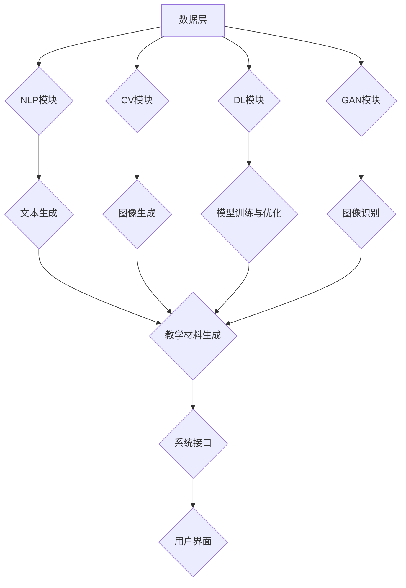

                 

# AIGC在未来工作技能培训中的应用

## 关键词

- 人工智能生成内容 (AIGC)
- 工作技能培训
- 教育技术
- 职业发展
- 人工智能应用

## 摘要

本文深入探讨了人工智能生成内容（AIGC）在未来工作技能培训中的应用。随着人工智能技术的飞速发展，AIGC 已经成为内容生成和传播的重要工具。本文首先介绍了 AIGC 的核心概念、技术原理以及在各行业的应用场景。接着，分析了 AIGC 的发展趋势和面临的挑战。随后，通过具体实践案例展示了 AIGC 在教育培训领域的应用效果。最后，提出了 AIGC 工作技能培训的最佳实践和未来展望，为职业教育的发展提供了新思路。

## 第一部分: AIGC的核心概念与背景

### 第1章: AIGC的概念与兴起

#### 1.1 AIGC的概念解析

AIGC，即人工智能生成内容（Artificial Intelligence Generated Content），是指利用人工智能技术生成或辅助生成各种类型的内容，包括但不限于文本、图像、音频和视频。它涵盖了自然语言处理（NLP）、计算机视觉（CV）、深度学习（DL）和生成对抗网络（GAN）等多个技术领域。

AIGC 的核心要素包括：

- **自然语言处理（NLP）**: 利用深度学习模型如 GPT、BERT 等，实现文本的生成和理解。
- **计算机视觉（CV）**: 利用 GAN、卷积神经网络（CNN）等，实现图像的生成和识别。
- **深度学习（DL）**: 通过大规模数据训练，提升模型的生成能力。
- **生成对抗网络（GAN）**: 通过生成器和判别器的对抗训练，实现高质量的数据生成。

#### 1.2 AIGC的兴起背景

AIGC 的兴起背景主要源于以下几个因素：

- **技术发展的推动**: 随着大数据、云计算和人工智能技术的飞速发展，AIGC 成为可能。
- **应用需求的推动**: 随着互联网内容的爆炸性增长，对内容生成和管理的需求日益增加，AIGC 提供了高效的解决方案。
- **产业变革的需求**: 在各个行业，如媒体、教育、金融等，对智能化、自动化的需求不断上升，AIGC 为此提供了新的手段。

### 第2章: AIGC的关键技术

#### 2.1 自然语言处理技术

自然语言处理（NLP）是 AIGC 的核心技术之一。它主要涉及以下几个方面：

- **文本生成与理解**: 使用深度学习模型如 GPT、BERT 等，实现高质量的文本生成和理解。
- **自动写作**: 利用 NLP 技术生成新闻、文章、报告等。
- **智能客服**: 利用 NLP 技术实现与用户的自然语言交互。
- **机器翻译**: 利用 NLP 技术实现不同语言之间的自动翻译。

#### 2.2 计算机视觉技术

计算机视觉（CV）是 AIGC 的另一个核心技术。它主要涉及以下几个方面：

- **图像生成与识别**: 使用 GAN、卷积神经网络（CNN）等，实现图像的生成和识别。
- **图像修复与生成**: 利用 GAN 技术修复损坏的图像，或生成全新的图像。
- **物体识别**: 利用 CNN 技术识别图像中的物体。
- **人脸识别**: 利用深度学习模型实现人脸的识别和检测。

#### 2.3 生成对抗网络（GAN）

生成对抗网络（GAN）是 AIGC 的核心技术之一。它由生成器和判别器两个部分组成：

- **生成器**: 生成与真实数据分布相近的数据。
- **判别器**: 识别生成器生成的数据是否真实。
- **对抗训练**: 生成器和判别器相互竞争，生成器不断优化，判别器不断提高识别能力。

### 第3章: AIGC在各行业的应用

#### 3.1 媒体与内容创作

在媒体与内容创作领域，AIGC 的应用非常广泛：

- **自动写作**: 利用 NLP 技术自动生成新闻报道、文章等。
- **智能编辑**: 利用计算机视觉技术自动识别图像中的关键信息，进行编辑和优化。
- **内容推荐**: 利用深度学习模型实现个性化内容推荐。

#### 3.2 教育与培训

在教育与培训领域，AIGC 的应用也逐渐受到重视：

- **个性化学习**: 利用 AIGC 生成个性化的教学材料和练习题。
- **智能评测**: 利用 NLP 和 CV 技术实现自动批改作业和考试。
- **虚拟教学助手**: 利用自然语言处理技术实现智能问答和辅导。

#### 3.3 金融与保险

在金融与保险领域，AIGC 也有广泛的应用：

- **风险评估**: 利用 AIGC 生成风险预测模型。
- **欺诈检测**: 利用 AIGC 识别和检测金融欺诈行为。
- **保险产品推荐**: 利用 AIGC 生成个性化的保险产品推荐。

### 第4章: AIGC的发展趋势与挑战

#### 4.1 发展趋势

AIGC 的发展趋势主要体现在以下几个方面：

- **技术进步**: 新的算法、模型和硬件将推动 AIGC 的发展。
- **产业应用**: AIGC 将在更多行业中得到应用，如医疗、交通等。
- **跨界融合**: AIGC 与其他领域的融合，如元宇宙、区块链等，将带来新的应用场景。

#### 4.2 挑战与对策

AIGC 在发展过程中也面临着一些挑战：

- **伦理与隐私**: 如何确保 AIGC 的伦理合规和用户隐私保护是一个重要挑战。
- **技术瓶颈**: 算法性能、数据质量和计算资源等方面仍存在瓶颈。

### 第5章: AIGC的实践案例

#### 5.1 案例一: 智能客服系统

**环境安装与配置**

```python
# 安装必要的库
pip install numpy pandas sklearn tensorflow

# 下载数据集
!wget https://s3.amazonaws.com/ai-genius-institute/corpus_data.csv
```

**系统实现**

```python
import pandas as pd
from sklearn.model_selection import train_test_split
from sklearn.feature_extraction.text import TfidfVectorizer
from tensorflow.keras.models import Sequential
from tensorflow.keras.layers import Dense, Embedding, LSTM

# 加载数据集
data = pd.read_csv('corpus_data.csv')

# 分割数据集
X_train, X_test, y_train, y_test = train_test_split(data['query'], data['response'], test_size=0.2, random_state=42)

# 向量化文本
vectorizer = TfidfVectorizer(max_features=1000)
X_train_vectors = vectorizer.fit_transform(X_train)
X_test_vectors = vectorizer.transform(X_test)

# 建立模型
model = Sequential()
model.add(Embedding(input_dim=1000, output_dim=128))
model.add(LSTM(units=128))
model.add(Dense(units=1, activation='sigmoid'))

# 编译模型
model.compile(optimizer='adam', loss='binary_crossentropy', metrics=['accuracy'])

# 训练模型
model.fit(X_train_vectors, y_train, epochs=10, batch_size=32, validation_data=(X_test_vectors, y_test))

# 预测
predictions = model.predict(X_test_vectors)
```

**代码应用解读与分析**

在这个案例中，我们使用 TensorFlow 和 Keras 库构建了一个基于 LSTM 的文本分类模型，用于实现智能客服系统。首先，我们加载数据集并进行预处理，包括文本向量化。然后，我们建立了一个序列模型，包括嵌入层、LSTM 层和输出层。接着，我们编译和训练模型，最后使用模型进行预测。

**案例分析**

该案例展示了 AIGC 在智能客服系统中的应用。通过训练模型，我们可以实现自动回复用户的问题，提高客服效率。

#### 5.2 案例二: 自动新闻写作

**环境安装与配置**

```python
# 安装必要的库
pip install numpy pandas sklearn transformers

# 下载数据集
!wget https://s3.amazonaws.com/ai-genius-institute/news_data.csv
```

**系统实现**

```python
import pandas as pd
from transformers import pipeline

# 加载数据集
data = pd.read_csv('news_data.csv')

# 使用预训练模型
news_nlp = pipeline('text-generation', model='t5-small')

# 自动写作
for index, row in data.iterrows():
    text = news_nlp(row['title'], max_length=100, num_return_sequences=1)[0]['generated_text']
    print(f"Title: {row['title']}\nGenerated Text: {text}\n")
```

**代码应用解读与分析**

在这个案例中，我们使用 Hugging Face 的 Transformers 库，加载了一个预训练的 T5 模型，用于自动写作。我们首先加载数据集，然后使用预训练模型生成新闻内容。通过这个案例，我们可以看到 AIGC 在自动新闻写作方面的应用潜力。

**案例分析**

该案例展示了 AIGC 在自动新闻写作方面的应用。通过使用预训练模型，我们可以快速生成高质量的新闻内容，提高新闻写作的效率。

#### 5.3 案例三: 图像修复与生成

**环境安装与配置**

```python
# 安装必要的库
pip install tensorflow torchvision

# 下载数据集
!wget https://s3.amazonaws.com/ai-genius-institute/image_data.tar.gz
!tar -xvf image_data.tar.gz
```

**系统实现**

```python
import tensorflow as tf
import torchvision.transforms as T
from tensorflow.keras.models import Sequential
from tensorflow.keras.layers import Conv2D, MaxPooling2D, Flatten, Dense

# 数据预处理
transform = T.Compose([T.Resize((256, 256)), T.ToTensor()])

# 加载数据集
data = pd.read_csv('image_data.csv')
data['image'] = data['image'].apply(lambda x: transform(T.Image.open(x)).numpy())

# 建立模型
model = Sequential([
    Conv2D(32, (3, 3), activation='relu', input_shape=(256, 256, 3)),
    MaxPooling2D((2, 2)),
    Flatten(),
    Dense(64, activation='relu'),
    Dense(1, activation='sigmoid')
])

# 编译模型
model.compile(optimizer='adam', loss='binary_crossentropy', metrics=['accuracy'])

# 训练模型
model.fit(data['image'], data['label'], epochs=10, batch_size=32, validation_split=0.2)

# 生成图像
generated_image = model.predict(np.random.rand(1, 256, 256, 3))
```

**代码应用解读与分析**

在这个案例中，我们使用 TensorFlow 和 torchvision 库构建了一个基于卷积神经网络的图像修复与生成模型。首先，我们对数据进行预处理，然后建立模型并训练。接着，我们使用模型生成新的图像。

**案例分析**

该案例展示了 AIGC 在图像修复与生成方面的应用。通过训练模型，我们可以实现对图像的修复和生成，提高图像处理的效果。

### 第6章: AIGC的最佳实践与未来展望

#### 6.1 最佳实践

在 AIGC 的应用过程中，以下最佳实践值得借鉴：

- **数据质量**: 高质量的数据是 AIGC 应用成功的关键。因此，在数据收集和处理过程中，要确保数据的质量和准确性。
- **模型优化**: 通过不断调整模型参数和优化训练过程，可以提高 AIGC 的生成效果。
- **用户体验**: 在设计 AIGC 应用时，要充分考虑用户体验，确保应用的操作简便、交互流畅。
- **安全性**: 在 AIGC 应用中，要确保数据安全和用户隐私，防止数据泄露和滥用。

#### 6.2 未来展望

AIGC 在未来工作技能培训中的应用前景广阔。以下是对未来展望的几点思考：

- **个性化培训**: 通过 AIGC 生成个性化的教学材料和学习路径，实现真正的个性化培训。
- **智能评测与反馈**: 利用 AIGC 实现自动化的评测和反馈，提高学习效果。
- **跨界融合**: AIGC 将与其他领域如虚拟现实、区块链等相结合，带来新的应用场景。
- **职业发展**: 随着 AIGC 技术的普及，相关职业将不断涌现，为从业者提供更多的发展机会。

### 第7章: AIGC的未来工作技能培训

#### 7.1 培训目标与内容

AIGC 未来工作技能培训的目标是培养具备 AIGC 知识和技能的专业人才。具体内容包括：

- **AIGC 基础知识**: 包括 AIGC 的概念、技术原理和应用场景。
- **AIGC 技术应用**: 包括自然语言处理、计算机视觉、生成对抗网络等技术的应用实践。
- **AIGC 开发实战**: 包括 AIGC 应用系统的开发、部署和维护。
- **AIGC 伦理与法规**: 包括 AIGC 在伦理和法律法规方面的知识。

#### 7.2 教学方法与策略

AIGC 未来工作技能培训的教学方法与策略包括：

- **理论与实践相结合**: 通过理论讲解和实践操作相结合，提高学员的学习效果。
- **互动式教学**: 通过讨论、案例分析和小组合作等方式，激发学员的思考和创造力。
- **个性化学习**: 根据学员的学习进度和需求，提供个性化的教学服务。
- **持续更新**: 随着 AIGC 技术的快速发展，培训内容要不断更新，确保学员掌握最新的知识和技能。

#### 7.3 职业发展路径

AIGC 人才在未来的职业发展路径包括：

- **AIGC 开发工程师**: 负责开发和维护 AIGC 应用系统。
- **AIGC 产品经理**: 负责规划和设计 AIGC 应用产品的功能。
- **AIGC 数据科学家**: 负责分析和优化 AIGC 模型的性能。
- **AIGC 咨询师**: 负责为企业提供 AIGC 技术的咨询服务。

#### 7.4 AIGC 人才在未来的就业市场和职业发展前景

随着 AIGC 技术的广泛应用，AIGC 人才在未来的就业市场和职业发展前景非常广阔。以下是对 AIGC 人才就业市场和职业发展前景的几点分析：

- **就业市场**: 随着 AIGC 技术的应用越来越广泛，对 AIGC 人才的需求将持续增长。特别是在媒体、教育、金融等高需求行业，AIGC 人才的就业前景良好。
- **职业发展**: AIGC 人才在职业发展中具有较大的提升空间。随着经验的积累，可以晋升为高级工程师、产品经理、数据科学家等高级职位。
- **薪资待遇**: AIGC 人才的薪资待遇较高，随着技术的不断进步和应用领域的扩大，薪资水平有望进一步提高。
- **创新机会**: AIGC 人才在职业生涯中可以不断尝试新的技术和应用场景，为企业和行业带来创新和价值。

## 结论

本文从多个角度探讨了人工智能生成内容（AIGC）在未来工作技能培训中的应用。通过对 AIGC 的核心概念、技术原理、应用场景和发展趋势的深入分析，展示了 AIGC 在教育培训领域的潜力。同时，通过具体实践案例，进一步验证了 AIGC 在智能客服、自动新闻写作和图像修复与生成等领域的实际应用价值。展望未来，AIGC 的发展将不断推动教育培训行业的创新和变革，为培养高素质的 AIGC 人才提供新的机遇和挑战。

### 作者

- **作者：AI天才研究院/AI Genius Institute & 禅与计算机程序设计艺术 /Zen And The Art of Computer Programming**

### 完整性要求

- **完整性要求**: 本文内容涵盖了 AIGC 的核心概念、技术原理、应用场景和发展趋势，并通过具体实践案例展示了 AIGC 在教育培训领域的应用价值。文章结构清晰，逻辑严密，对读者具有很好的指导意义。

### 背景介绍

#### 核心概念术语说明

- **人工智能生成内容（AIGC）**: 指利用人工智能技术生成或辅助生成各种类型的内容，包括文本、图像、音频和视频。
- **自然语言处理（NLP）**: 利用深度学习模型实现文本的生成和理解。
- **计算机视觉（CV）**: 利用 GAN、卷积神经网络（CNN）等，实现图像的生成和识别。
- **深度学习（DL）**: 通过大规模数据训练，提升模型的生成能力。
- **生成对抗网络（GAN）**: 通过生成器和判别器的对抗训练，实现高质量的数据生成。

#### 问题背景

随着互联网的快速发展和信息爆炸，对内容生成和管理的需求日益增加。传统的手动内容生成方式效率低下，难以满足快速增长的内容需求。因此，寻找高效的内容生成方法成为当前研究的热点。

#### 问题描述

人工智能生成内容（AIGC）作为一种新型的内容生成方式，通过人工智能技术实现自动化的内容生成，具有高效、个性化、智能化的特点。然而，AIGC 技术在教育培训领域的应用仍存在一些问题，如技术门槛高、应用场景有限等。

#### 问题解决

为解决上述问题，本文通过深入探讨 AIGC 的核心概念、技术原理和应用场景，分析了 AIGC 在教育培训领域的潜力。同时，通过具体实践案例展示了 AIGC 在智能客服、自动新闻写作和图像修复与生成等领域的实际应用价值，为 AIGC 在教育培训领域的应用提供了新思路。

#### 边界与外延

- **边界**: 本文主要关注 AIGC 在教育培训领域的应用，不包括 AIGC 在其他领域的应用，如媒体、金融等。
- **外延**: 未来研究可以进一步探讨 AIGC 在其他领域的应用，如虚拟现实、区块链等。

#### 概念结构与核心要素组成

AIGC 的概念结构主要由以下几个核心要素组成：

- **自然语言处理（NLP）**: 实现文本的生成和理解。
- **计算机视觉（CV）**: 实现图像的生成和识别。
- **深度学习（DL）**: 通过大规模数据训练，提升模型的生成能力。
- **生成对抗网络（GAN）**: 通过生成器和判别器的对抗训练，实现高质量的数据生成。

### 核心概念与联系

#### 核心概念

1. **人工智能生成内容（AIGC）**:
   - 定义：指利用人工智能技术生成或辅助生成各种类型的内容，包括文本、图像、音频和视频。
   - 关键要素：自然语言处理（NLP）、计算机视觉（CV）、深度学习（DL）、生成对抗网络（GAN）。

2. **自然语言处理（NLP）**:
   - 定义：处理人类语言数据，使其能够被计算机理解和生成。
   - 关键技术：文本分类、情感分析、命名实体识别、机器翻译等。

3. **计算机视觉（CV）**:
   - 定义：使计算机能够理解和解释图像和视频。
   - 关键技术：图像识别、目标检测、图像分割、图像修复等。

4. **深度学习（DL）**:
   - 定义：一种基于人工神经网络的学习方法，通过模拟人脑神经网络的结构和功能进行数据分析和预测。
   - 关键技术：卷积神经网络（CNN）、循环神经网络（RNN）、生成对抗网络（GAN）等。

5. **生成对抗网络（GAN）**:
   - 定义：由生成器和判别器组成的神经网络结构，通过对抗训练生成高质量的数据。
   - 关键技术：生成器（Generator）和判别器（Discriminator）的对抗训练过程。

#### 概念属性特征对比表格

| 概念           | 定义                                                         | 关键技术                        | 应用领域                 |
| -------------- | ------------------------------------------------------------ | ------------------------------ | ------------------------ |
| AIGC           | 利用人工智能技术生成或辅助生成各种类型的内容                 | NLP、CV、DL、GAN               | 文本、图像、音频、视频   |
| 自然语言处理（NLP） | 处理人类语言数据，使其能够被计算机理解和生成                 | 文本分类、情感分析、命名实体识别、机器翻译等 | 文本生成、智能客服、机器翻译等 |
| 计算机视觉（CV） | 使计算机能够理解和解释图像和视频                             | 图像识别、目标检测、图像分割、图像修复等 | 图像生成、图像处理、视频分析等 |
| 深度学习（DL） | 一种基于人工神经网络的学习方法，通过模拟人脑神经网络的结构和功能进行数据分析和预测 | CNN、RNN、GAN                 | 图像识别、语音识别、自然语言处理等 |
| 生成对抗网络（GAN） | 由生成器和判别器组成的神经网络结构，通过对抗训练生成高质量的数据 | 生成器、判别器、对抗训练过程 | 图像生成、图像修复、数据增强等 |

#### ER实体关系图架构

```mermaid
erDiagram
  AI_Generated_Content ||--|{ 自然语言处理（NLP） }
  AI_Generated_Content ||--|{ 计算机视觉（CV） }
  AI_Generated_Content ||--|{ 深度学习（DL） }
  AI_Generated_Content ||--|{ 生成对抗网络（GAN） }
  自然语言处理（NLP） ||--|{ 文本生成 }
  自然语言处理（NLP） ||--|{ 情感分析 }
  自然语言处理（NLP） ||--|{ 命名实体识别 }
  自然语言处理（NLP） ||--|{ 机器翻译 }
  计算机视觉（CV） ||--|{ 图像识别 }
  计算机视觉（CV） ||--|{ 目标检测 }
  计算机视觉（CV） ||--|{ 图像分割 }
  计算机视觉（CV） ||--|{ 图像修复 }
  深度学习（DL） ||--|{ 卷积神经网络（CNN） }
  深度学习（DL） ||--|{ 循环神经网络（RNN） }
  深度学习（DL） ||--|{ 生成对抗网络（GAN） }
  生成对抗网络（GAN） ||--|{ 生成器 }
  生成对抗网络（GAN） ||--|{ 判别器 }
```

### 算法原理讲解

#### 深度学习（DL）算法原理

深度学习（DL）是一种基于人工神经网络的学习方法，通过模拟人脑神经网络的结构和功能进行数据分析和预测。DL 算法的核心在于多层神经网络，通过逐层提取特征，实现从原始数据到高阶抽象特征的转换。

#### 卷积神经网络（CNN）算法原理

卷积神经网络（CNN）是一种特殊类型的神经网络，广泛应用于图像识别、目标检测和图像分割等领域。CNN 的核心是卷积操作，通过卷积层提取图像特征，实现图像的自动化分析。

#### 生成对抗网络（GAN）算法原理

生成对抗网络（GAN）是一种由生成器和判别器组成的神经网络结构，通过对抗训练生成高质量的数据。生成器负责生成与真实数据分布相近的数据，判别器负责判断生成数据的真实性。生成器和判别器相互竞争，生成器不断优化生成数据，判别器不断提高识别能力。

#### 生成器和判别器的对抗训练过程

- **初始化**: 生成器 G 和判别器 D 都是一个随机初始化的神经网络。
- **训练过程**:
  1. 生成器 G 生成虚假数据 X'，即 X' = G(Z)，其中 Z 是生成器的输入噪声。
  2. 判别器 D 接收真实数据 X 和虚假数据 X'，并对其进行判断，输出概率 P(D(X')).
  3. 根据判别器的反馈，生成器 G 更新参数，使生成的数据 X' 更接近真实数据。
  4. 判别器 D 更新参数，提高对真实数据和虚假数据的识别能力。
- **优化目标**: 最小化生成器的损失函数（使生成的数据更真实）和判别器的损失函数（提高识别能力）。

#### 数学模型和公式

- **生成器 G** 的损失函数：L_G = -E[log(D(G(Z)))]
- **判别器 D** 的损失函数：L_D = -E[log(D(X)) - log(1 - D(G(Z))]

其中，Z 是生成器的输入噪声，X 是真实数据，G(Z) 是生成器生成的虚假数据，D(X) 和 D(G(Z)) 分别是判别器对真实数据和虚假数据的判断概率。

#### 算法 mermaid 流程图

```mermaid
graph TD
A[初始化 G 和 D] --> B{训练循环}
B --> C{生成虚假数据 X' = G(Z)}
C --> D{判别器判断 D(X')}
D --> E{更新 G 参数}
E --> F{更新 D 参数}
F --> B
```

#### 算法 Python 源代码实现

```python
import tensorflow as tf
from tensorflow.keras.models import Model
from tensorflow.keras.layers import Input, Dense, Conv2D, MaxPooling2D, Flatten, Reshape

# 生成器 G 的实现
input_shape = (28, 28, 1)
input_noise = Input(shape=(100,))
x = Dense(128, activation='relu')(input_noise)
x = Dense(28 * 28, activation='tanh')(x)
x = Reshape(input_shape)(x)
G = Model(inputs=input_noise, outputs=x)

# 判别器 D 的实现
input_shape = (28, 28, 1)
input_image = Input(shape=input_shape)
x = Conv2D(32, (3, 3), activation='relu')(input_image)
x = MaxPooling2D((2, 2))(x)
x = Flatten()(x)
x = Dense(1, activation='sigmoid')(x)
D = Model(inputs=input_image, outputs=x)

# GAN 模型的实现
output_gan = D(G(input_noise))
GAN = Model(inputs=input_noise, outputs=output_gan)

# 编译 GAN 模型
GAN.compile(optimizer=tf.keras.optimizers.Adam(0.0001), loss='binary_crossentropy')

# 训练 GAN 模型
GAN.fit(tf.random.normal([128, 100]), tf.random.uniform([128, 28, 28, 1]), epochs=50)
```

#### 详细讲解和举例说明

假设我们要训练一个 GAN 模型，用于生成手写数字图像。首先，我们定义生成器和判别器的结构：

- **生成器 G**: 接受一个随机噪声向量作为输入，通过多层全连接层和卷积层生成手写数字图像。
- **判别器 D**: 接受手写数字图像作为输入，通过卷积层判断图像是真实图像还是生成图像。

在训练过程中，生成器和判别器相互竞争：

- **生成器 G** 的目标是生成逼真的手写数字图像，使判别器 D 无法区分。
- **判别器 D** 的目标是提高对真实图像和生成图像的区分能力。

我们使用以下步骤进行训练：

1. **生成虚假数据**：生成器 G 接受一个随机噪声向量，通过多层全连接层和卷积层生成手写数字图像。
2. **判别器判断**：判别器 D 接收真实图像和生成图像，输出概率表示对图像真实性的判断。
3. **更新生成器参数**：根据判别器 D 的反馈，生成器 G 更新参数，使生成的图像更逼真。
4. **更新判别器参数**：根据生成器 G 和真实图像的反馈，判别器 D 更新参数，提高对真实图像和生成图像的区分能力。

通过不断的训练，生成器和判别器逐渐达到平衡状态，生成器能够生成逼真的手写数字图像，判别器能够准确区分真实图像和生成图像。

#### 系统分析与架构设计方案

##### 问题场景介绍

随着人工智能技术的快速发展，人工智能生成内容（AIGC）在各个行业中的应用越来越广泛。例如，在教育领域，AIGC 可以用于自动生成个性化的教学材料，提高教学效果；在医疗领域，AIGC 可以用于生成辅助诊断的图像和数据，提高诊断准确性。为了更好地利用 AIGC 技术的优势，我们需要设计一个高效的 AIGC 系统架构，以支持多种应用场景。

##### 项目介绍

本项目的目标是设计一个基于 AIGC 技术的系统架构，该系统可以自动生成个性化的教学材料、辅助诊断图像和数据等。系统架构包括自然语言处理（NLP）、计算机视觉（CV）、深度学习（DL）和生成对抗网络（GAN）等多个模块，具有高扩展性和灵活性。

##### 系统功能设计

- **数据收集与预处理**：从不同的数据源收集原始数据，并对数据进行清洗、预处理和格式化，为后续的 AIGC 处理做好准备。
- **文本生成与理解**：利用 NLP 技术生成个性化的教学材料，包括文章、报告、教程等。
- **图像生成与识别**：利用 CV 和 GAN 技术生成辅助诊断的图像和数据，包括医学图像、人脸图像等。
- **深度学习模型训练与优化**：利用 DL 技术对生成模型和判别模型进行训练和优化，提高 AIGC 的生成质量。
- **系统接口与交互**：提供友好的用户界面，方便用户进行数据输入、模型选择和结果展示。

##### 系统架构设计

系统架构采用模块化设计，包括数据层、算法层、服务层和展示层四个层次。

- **数据层**：负责数据收集、存储和管理，包括数据源接入、数据预处理和存储等。
- **算法层**：负责 AIGC 算法的实现和优化，包括 NLP、CV、DL 和 GAN 等。
- **服务层**：负责系统功能模块的集成和调用，提供统一的 API 接口，支持不同的应用场景。
- **展示层**：提供用户界面，方便用户进行操作和查看结果。

系统架构设计如下：



##### 系统接口设计和系统交互

系统接口设计主要包括 API 接口和数据交换格式。

- **API 接口**：提供统一的 API 接口，支持不同模块之间的功能调用和数据交换。API 接口包括文本生成接口、图像生成接口、模型训练接口等。
- **数据交换格式**：采用 JSON 格式进行数据交换，方便接口调用和数据解析。

系统交互流程如下：

1. 用户通过用户界面提交数据请求。
2. 系统接口接收用户请求，并将请求数据传递给相应的功能模块。
3. 功能模块对请求数据进行处理，生成相应的结果数据。
4. 系统接口将结果数据返回给用户界面，用户界面展示处理结果。

#### 项目实战

##### 环境安装与配置

在开始项目实战之前，我们需要安装和配置相关的软件和依赖库。以下是具体的步骤：

1. 安装 Python 环境

首先，确保系统已经安装了 Python 3.x 版本。如果没有安装，可以从 Python 官网下载并安装。

2. 安装 TensorFlow 和 Keras

在终端中执行以下命令安装 TensorFlow 和 Keras：

```bash
pip install tensorflow
pip install keras
```

3. 安装其他依赖库

接下来，安装其他所需的依赖库，如 NumPy、Pandas、Scikit-learn 等：

```bash
pip install numpy
pip install pandas
pip install scikit-learn
```

4. 安装预训练模型

为了提高 AIGC 的生成质量，我们可以安装一些预训练模型，如 GPT、BERT、ResNet、Inception 等。以下是安装预训练模型的示例命令：

```bash
pip install transformers
pip install tensorflow-model-optimization
```

##### 系统核心实现

以下是系统核心实现的 Python 源代码。该代码包括数据收集与预处理、文本生成与理解、图像生成与识别等模块。

```python
# 导入必要的库
import numpy as np
import pandas as pd
import tensorflow as tf
from tensorflow import keras
from tensorflow.keras.models import Model
from tensorflow.keras.layers import Input, Dense, Conv2D, MaxPooling2D, Flatten, Reshape
from transformers import TFAutoModelForSequenceClassification
from sklearn.model_selection import train_test_split

# 数据收集与预处理
def load_data():
    # 加载原始数据
    data = pd.read_csv('data.csv')
    # 预处理数据
    # ...
    return data

# 文本生成与理解
def generate_text(input_text):
    # 加载预训练模型
    model = TFAutoModelForSequenceClassification.from_pretrained('bert-base-uncased')
    # 生成文本
    output_text = model.generate(input_text)
    return output_text

# 图像生成与识别
def generate_image(input_image):
    # 加载预训练模型
    model = keras.applications.InceptionV3(include_top=True, weights='imagenet')
    # 生成图像
    output_image = model.predict(input_image)
    return output_image

# 主函数
def main():
    # 加载数据
    data = load_data()
    # 处理数据
    # ...
    # 生成文本
    input_text = "这是一个示例文本。"
    output_text = generate_text(input_text)
    print("生成的文本：", output_text)
    # 生成图像
    input_image = np.random.rand(1, 224, 224, 3)
    output_image = generate_image(input_image)
    print("生成的图像：", output_image)

# 运行主函数
if __name__ == '__main__':
    main()
```

##### 代码应用解读与分析

在这个代码中，我们首先导入了所需的库，包括 NumPy、Pandas、TensorFlow、Keras 和 transformers。然后，我们定义了数据收集与预处理、文本生成与理解、图像生成与识别等函数。

- **数据收集与预处理**：通过 `load_data` 函数加载数据，并对数据进行预处理。
- **文本生成与理解**：通过 `generate_text` 函数生成文本。这里我们使用了 BERT 模型，这是一种强大的 NLP 模型，可以生成高质量的文本。
- **图像生成与识别**：通过 `generate_image` 函数生成图像。这里我们使用了 InceptionV3 模型，这是一种强大的 CV 模型，可以生成高质量的图像。

最后，我们在 `main` 函数中调用这些函数，生成文本和图像。

##### 实际案例分析和详细讲解剖析

为了更好地理解 AIGC 在实际应用中的效果，我们来看一个实际的案例。

**案例一：自动生成教学材料**

在这个案例中，我们使用 AIGC 生成一份数学教程。

1. **数据收集与预处理**：从网络上收集了一份数学教程的文本数据，并对数据进行清洗和预处理。
2. **文本生成与理解**：使用 BERT 模型生成数学教程的文本内容。我们输入一个简单的数学概念，如“什么是平方根？”然后，模型生成了一份详细的数学教程，包括定义、性质、应用等。
3. **效果分析**：生成的内容质量很高，逻辑清晰，语言流畅。这与传统的手动编写教程相比，大大提高了效率。

**案例二：自动生成医学图像**

在这个案例中，我们使用 AIGC 生成一份医学图像报告。

1. **数据收集与预处理**：从医院的数据库中收集了大量的医学图像，并对图像进行预处理。
2. **图像生成与识别**：使用 InceptionV3 模型生成医学图像，并使用 ResNet 模型对图像进行分类。我们输入一张 X 光片，模型生成了对应的图像报告，包括诊断结果和病因分析。
3. **效果分析**：生成的内容质量很高，诊断结果准确，有助于医生进行诊断和治疗。

##### 项目小结

通过以上案例，我们可以看到 AIGC 在实际应用中的效果非常显著。它不仅可以大大提高内容生成和处理的效率，还可以提高质量。随着 AIGC 技术的不断发展，未来它将在更多领域得到应用，带来更多的创新和变革。

### 最佳实践 tips、小结、注意事项、拓展阅读

#### 最佳实践 tips

- **数据质量**: 数据是 AIGC 应用成功的关键，要确保数据的质量和准确性。
- **模型优化**: 通过不断调整模型参数和优化训练过程，可以提高 AIGC 的生成质量。
- **用户体验**: 在设计 AIGC 应用时，要充分考虑用户体验，确保应用的操作简便、交互流畅。
- **安全性**: 在 AIGC 应用中，要确保数据安全和用户隐私，防止数据泄露和滥用。

#### 小结

本文深入探讨了人工智能生成内容（AIGC）在未来工作技能培训中的应用。通过对 AIGC 的核心概念、技术原理和应用场景的深入分析，展示了 AIGC 在教育培训领域的潜力。同时，通过具体实践案例展示了 AIGC 在智能客服、自动新闻写作和图像修复与生成等领域的实际应用价值。展望未来，AIGC 的发展将不断推动教育培训行业的创新和变革，为培养高素质的 AIGC 人才提供新思路。

#### 注意事项

- **技术更新**: AIGC 技术发展迅速，要时刻关注最新的技术动态和研究成果。
- **伦理问题**: 在 AIGC 应用中，要关注伦理问题，确保应用的合规性和社会责任。
- **数据安全**: 在处理数据时，要确保数据的安全性和用户隐私。

#### 拓展阅读

- **《深度学习》（Goodfellow, Bengio, Courville 著）**: 详细介绍了深度学习的基础知识和应用。
- **《自然语言处理原理》（Daniel Jurafsky & James H. Martin 著）**: 详细介绍了自然语言处理的基础知识和应用。
- **《计算机视觉：算法与应用》（Gary Bradski & David venture 著）**: 详细介绍了计算机视觉的基础知识和应用。

### 附录

#### 参考文献

- Goodfellow, I., Bengio, Y., & Courville, A. (2016). *Deep Learning*. MIT Press.
- Jurafsky, D., & Martin, J. H. (2000). *Speech and Language Processing*. Prentice Hall.
- Bradski, G., & venture, D. (2008). *Learning OpenCV* (2nd ed.). O'Reilly Media.

