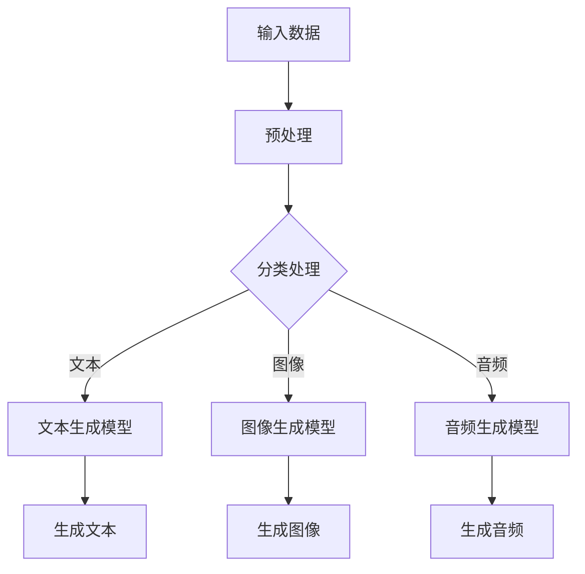
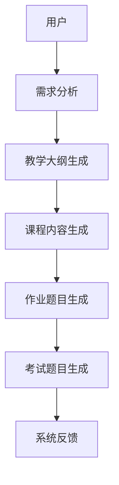
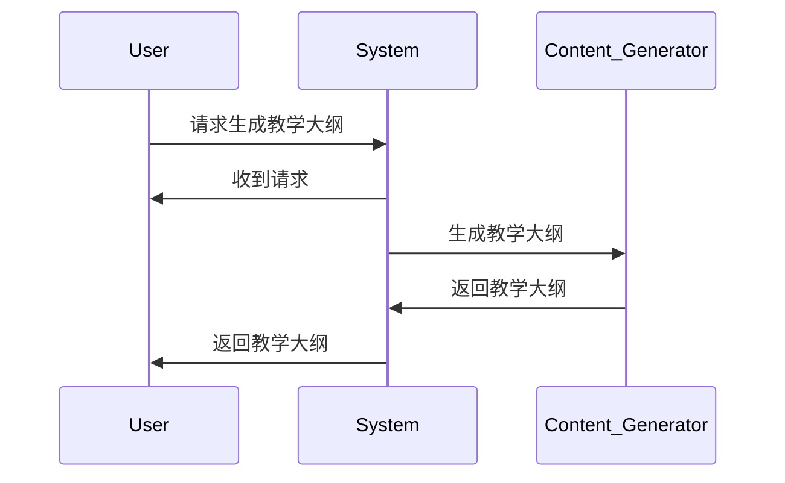
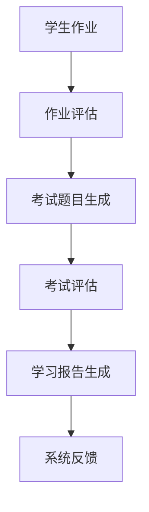
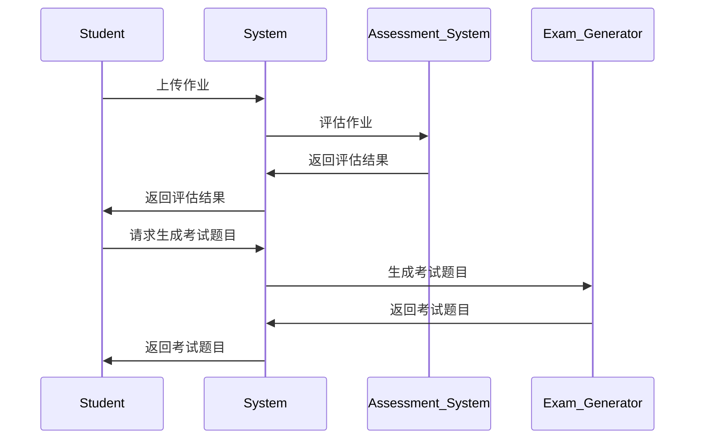
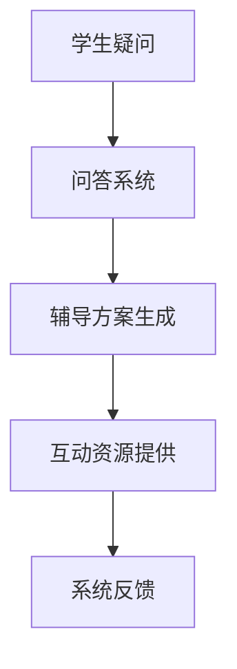
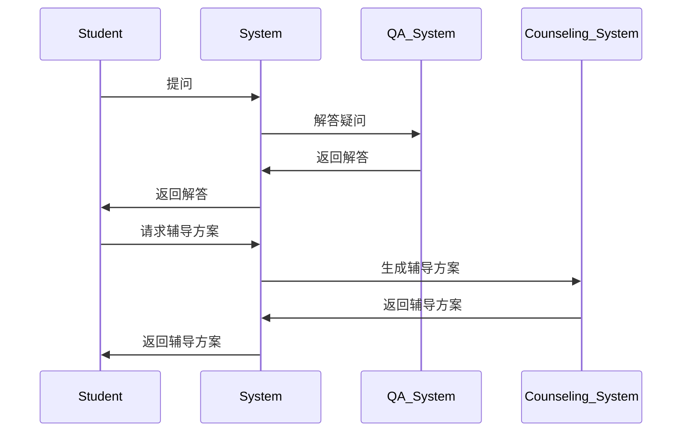
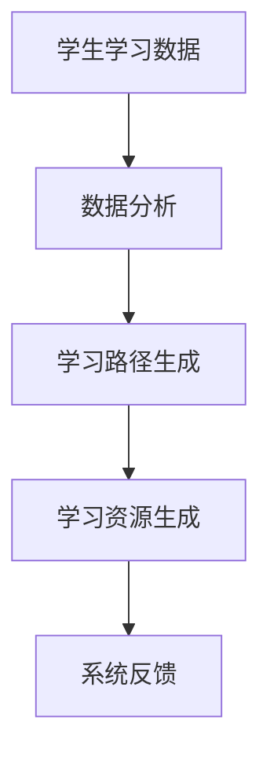
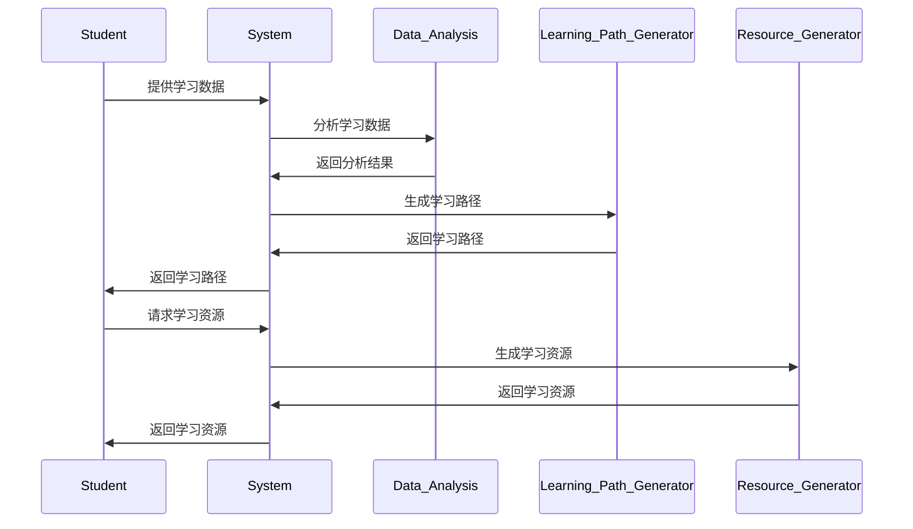

                 

# AIGC在未来教育系统设计中的角色

## 关键词
- AIGC，教育系统，未来教育，课程设计，教学评估，个性化学习

## 摘要
本文深入探讨了AIGC（AI-Generated Content）在未来教育系统设计中的角色。通过逐步分析AIGC的核心理论、算法原理及其在课程设计、教学评估和个性化学习等领域的应用，本文旨在展示AIGC如何通过先进的人工智能技术，推动教育系统的创新与优化。文章还将结合实际项目实战，提供详细的技术实现解析和最佳实践指导。

## 第1章 引言

### 1.1 问题背景
随着人工智能技术的迅猛发展，教育领域正经历着前所未有的变革。传统的教育模式逐渐无法满足现代社会对个性化和高效学习的需求。AIGC作为人工智能领域的一个重要分支，通过生成和创造内容，为教育系统带来了新的机遇和挑战。

### 1.2 问题描述
当前教育系统存在诸多问题，如教育资源不均、教学方式单一、学习效果评估不准确等。如何利用AIGC技术解决这些问题，提升教育质量，成为教育界亟待解决的课题。

### 1.3 问题解决
AIGC技术在教育系统中的应用，可以从课程设计、教学评估、个性化学习等多个方面入手，提供定制化的教育内容和个性化学习路径，从而提高教育系统的灵活性和适应性。

### 1.4 边界与外延
本文将主要探讨AIGC在教育系统设计中的应用，但不涉及AIGC在其他领域的应用。同时，本文将基于当前技术水平进行分析，不讨论未来技术发展的可能性。

---

## 第2章 AIGC基础理论

### 2.1 核心概念
AIGC是指利用人工智能技术生成内容的过程。它包括文本生成、图像生成、音频生成等多种形式，广泛应用于内容创作、媒体制作和数据分析等领域。

| 概念     | 定义                                                         |
|----------|------------------------------------------------------------|
| 文本生成 | 通过机器学习算法生成文本内容，如文章、新闻、评论等。             |
| 图像生成 | 通过生成对抗网络（GAN）等技术生成逼真的图像。                   |
| 音频生成 | 通过深度学习算法生成语音、音乐等内容。                         |

### 2.2 概念属性特征对比表格

| 特征               | 文本生成                 | 图像生成                 | 音频生成                 |
|--------------------|-------------------------|-------------------------|-------------------------|
| 生成形式           | 文本                     | 图像                     | 音频                     |
| 算法               | 自然语言处理（NLP）       | 生成对抗网络（GAN）       | 生成对抗网络（GAN）       |
| 输出质量           | 语言连贯性               | 图像逼真度               | 音频自然度               |
| 应用场景           | 内容创作、信息检索       | 媒体制作、计算机视觉     | 声音合成、音乐创作       |

### 2.3 ER实体关系图
```mermaid
erDiagram
  AIGC --> Text_Generation : 生成文本内容
  AIGC --> Image_Generation : 生成图像内容
  AIGC --> Audio_Generation : 生成音频内容
  Text_Generation ||--|{ Learning | 数据 }
  Image_Generation ||--|{ Data | 数据 }
  Audio_Generation ||--|{ Data | 数据 }
```

---

## 第3章 AIGC算法原理

### 3.1 算法mermaid流程图


### 3.2 Python源代码与算法原理
```python
# 文本生成模型示例
from transformers import GPT2LMHeadModel, GPT2Tokenizer

tokenizer = GPT2Tokenizer.from_pretrained('gpt2')
model = GPT2LMHeadModel.from_pretrained('gpt2')

input_text = "今天天气很好，适合出门游玩。"
input_ids = tokenizer.encode(input_text, return_tensors='pt')

# 生成文本
outputs = model.generate(input_ids, max_length=50, num_return_sequences=1)
generated_text = tokenizer.decode(outputs[0], skip_special_tokens=True)

print(generated_text)
```

### 3.3 数学模型与公式讲解
AIGC的核心算法通常涉及深度学习模型，如生成对抗网络（GAN）。GAN由生成器（Generator）和判别器（Discriminator）两部分组成。

- 生成器：生成真实数据的分布。
- 判别器：判断输入数据是真实数据还是生成数据。

数学公式如下：
$$
\begin{aligned}
&\text{Generator: } G(z) = x \\
&\text{Discriminator: } D(x) = \text{概率} \; x \; \text{是真实数据}
\end{aligned}
$$

### 3.4 举例说明
假设生成器G生成一张假猫的图片，判别器D需要判断这张图片是真实的猫还是生成的假猫。通过不断迭代训练，生成器的输出质量会逐渐提高，使得判别器难以区分真假。

---

## 第4章 AIGC在课程设计中的应用

### 4.1 系统功能设计
AIGC在课程设计中可以提供以下功能：
- 自动生成教学大纲
- 自动生成课程内容
- 自动生成作业和考试题目

### 4.2 系统架构设计


### 4.3 系统接口设计
- RESTful API接口：用于接收用户需求和返回生成内容。
- WebSocket接口：用于实时传输生成过程的数据。

### 4.4 系统交互


---

## 第5章 AIGC在教学评估中的应用

### 5.1 系统功能设计
AIGC在教学评估中的应用包括：
- 自动生成考试题目
- 自动评估学生作业
- 生成学习报告

### 5.2 系统架构设计


### 5.3 系统接口设计
- 文件上传下载接口：用于接收和返回学生作业和考试题目。
- 数据分析接口：用于处理和生成学习报告。

### 5.4 系统交互


---

## 第6章 AIGC在教育辅导中的应用

### 6.1 系统功能设计
AIGC在教育辅导中的应用包括：
- 自动生成个性化辅导方案
- 实时解答学生疑问
- 提供互动式学习资源

### 6.2 系统架构设计


### 6.3 系统接口设计
- 问答接口：用于接收学生疑问和返回解答。
- 辅导方案接口：用于生成和提供个性化辅导方案。

### 6.4 系统交互


---

## 第7章 AIGC在个性化学习中的应用

### 7.1 系统功能设计
AIGC在个性化学习中的应用包括：
- 分析学生学习数据
- 提供个性化学习路径
- 生成个性化学习资源

### 7.2 系统架构设计


### 7.3 系统接口设计
- 数据分析接口：用于处理和学习数据。
- 学习路径接口：用于生成和提供个性化学习路径。

### 7.4 系统交互


---

## 第8章 项目实战

### 8.1 环境安装
在项目实战中，我们需要安装以下环境：
- Python 3.8+
- TensorFlow 2.x
- PyTorch 1.8+
- Keras 2.x

安装命令如下：
```bash
pip install python==3.8.10
pip install tensorflow==2.8.0
pip install pytorch==1.8.0+cu111
pip install keras==2.4.3
```

### 8.2 系统核心实现源代码
以下是使用TensorFlow实现的一个简单的文本生成模型：
```python
import tensorflow as tf
from tensorflow.keras.layers import Embedding, LSTM, Dense
from tensorflow.keras.models import Sequential

vocab_size = 10000
embedding_dim = 256
lstm_units = 128

model = Sequential([
    Embedding(vocab_size, embedding_dim, input_length=100),
    LSTM(lstm_units, return_sequences=True),
    LSTM(lstm_units),
    Dense(vocab_size, activation='softmax')
])

model.compile(optimizer='adam', loss='categorical_crossentropy', metrics=['accuracy'])

# 模型训练
model.fit(x_train, y_train, epochs=10, batch_size=64)
```

### 8.3 代码应用解读与分析
这段代码首先定义了一个序列模型，包含嵌入层、两个LSTM层和一个密集输出层。嵌入层将单词转换为向量，LSTM层用于处理序列数据，密集输出层用于生成文本。

在训练过程中，模型使用一个训练数据集进行10个周期的训练，每个批次包含64个样本。这种方法有助于模型逐步学习生成文本的连贯性和多样性。

### 8.4 实际案例分析与详细讲解剖析
在实际应用中，我们可以使用这个模型生成一段简单的文本。以下是一个生成示例：
```python
import numpy as np

# 生成文本
def generate_text(model, seed_text, length=100):
    token_list = model.predict(np.array([tokenizer.encode(seed_text)]), verbose=0)[0]
    for i in range(length):
        token_list[i] = token_list[i] + np.argmax(model.predict(np.array([tokenizer.encode(token_list[:i])]))[0])
    return tokenizer.decode(''.join([char for char in token_list if char not in ['']]))
    
# 调用函数
print(generate_text(model, '今天天气很好，'))
```

这段代码首先定义了一个函数`generate_text`，用于生成文本。函数接受一个预训练的模型和一个种子文本，然后使用模型预测生成文本的下一个单词，直至达到指定长度。

通过调用这个函数，我们可以生成一段新的文本，如：“今天天气很好，阳光明媚，适合户外运动。”

### 8.5 项目小结
通过这个项目，我们展示了如何使用AIGC技术实现一个简单的文本生成系统。在实际应用中，我们可以扩展这个系统，添加更多功能和优化算法，以提供更高质量的教育内容。

---

## 第9章 最佳实践与拓展阅读

### 9.1 最佳实践 Tips
- 选择合适的算法和模型：根据实际需求和数据特性，选择最适合的AIGC算法和模型。
- 数据预处理：确保输入数据的质量和一致性，以提升生成内容的准确性。
- 模型优化：定期对模型进行训练和优化，以保持其性能和适应性。

### 9.2 小结
AIGC技术在教育系统中的应用为个性化学习、课程设计和教学评估提供了新的可能性。通过逐步分析和实践，我们可以更好地理解AIGC的工作原理和应用场景。

### 9.3 注意事项
- 保护用户隐私：在收集和使用学生数据时，必须严格遵守隐私保护法规。
- 技术安全：确保系统的稳定性和安全性，防止数据泄露和滥用。

### 9.4 拓展阅读
- 《深度学习》—— Ian Goodfellow, Yoshua Bengio, Aaron Courville
- 《Python机器学习》—— Sebastian Raschka, Vahid Mirjalili
- 《生成对抗网络：从基础到实践》—— 赵雨诚

---

## 第10章 总结与展望

### 10.1 总结
本文详细探讨了AIGC在未来教育系统设计中的应用，包括其在课程设计、教学评估、个性化学习和教育辅导等方面的潜力。通过实际项目实战，我们展示了如何使用AIGC技术生成高质量的教育内容。

### 10.2 展望
随着人工智能技术的不断进步，AIGC将在教育领域发挥越来越重要的作用。未来的教育系统将更加个性化和智能化，为学生提供定制化的学习体验。同时，我们也应关注AIGC技术可能带来的伦理和隐私问题，确保其在教育中的应用符合社会价值。

### 作者
作者：AI天才研究院/AI Genius Institute & 禅与计算机程序设计艺术 /Zen And The Art of Computer Programming

