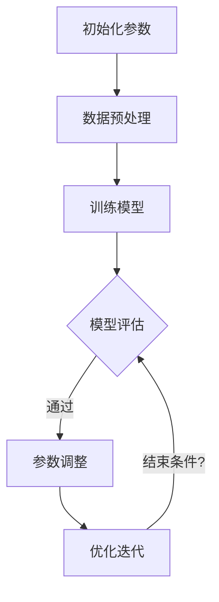
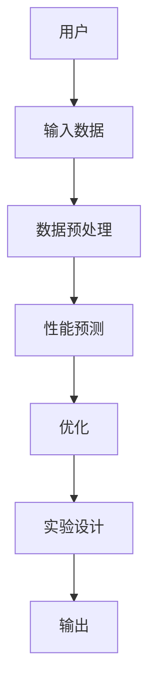
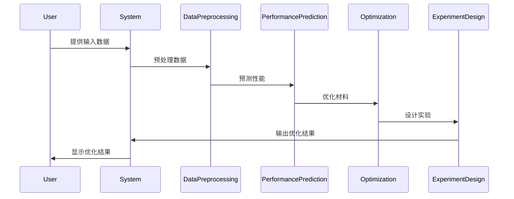

                 

### AIGC在未来跨维度材料设计与优化中的角色

> **关键词：** AIGC、材料设计、优化、算法、架构、项目实战

**摘要：** 本篇文章将探讨人工智能生成内容（AIGC）在未来跨维度材料设计与优化中的角色。首先，我们介绍AIGC的概念、特点以及其发展历程。然后，我们详细解释材料设计的基本原理和优化的方法，并探讨AIGC如何解决材料设计中的问题。接着，我们将详细讲解AIGC在材料设计与优化中的算法原理，包括算法流程图、数学模型以及具体实例。随后，我们分析AIGC在材料设计与优化中的应用场景，并设计相应的系统架构和接口。在此基础上，我们将通过一个项目实战展示AIGC在实际应用中的效果。最后，我们总结AIGC在材料设计与优化中的最佳实践，并提供进一步的研究方向。

### 第一部分：AIGC概述与材料设计优化背景

#### 第1章：AIGC的概念与演进

##### 1.1 AIGC的定义与特点

人工智能生成内容（AIGC）是指利用人工智能技术生成内容的过程。AIGC可以生成文本、图像、音频、视频等多种类型的内容。与传统的手动生成内容相比，AIGC具有生成速度快、成本低、质量高等特点。AIGC的核心在于其强大的学习和自适应能力，能够根据用户的需求和反馈不断优化生成的内容。

##### 1.2 AIGC的发展历程

AIGC的发展可以追溯到20世纪80年代，当时人工智能技术刚刚起步。随着深度学习和生成对抗网络（GAN）等技术的不断发展，AIGC也逐渐崭露头角。近年来，随着计算能力的提升和大数据的普及，AIGC的应用范围越来越广泛，从文本生成到图像生成，再到视频生成，AIGC展现出了巨大的潜力。

##### 1.3 AIGC的应用现状与前景

目前，AIGC已经在许多领域得到了广泛应用，如自然语言处理、计算机视觉、音乐创作等。在未来，随着技术的不断进步，AIGC有望在更多领域发挥重要作用，特别是在材料设计与优化领域。

#### 第2章：材料设计与优化基本概念

##### 2.1 材料设计的基本原理

材料设计是指通过理论分析和实验验证，创建新的材料或优化现有材料的过程。材料设计的目标是开发出具有特定性能和功能的材料。材料设计的基本原理包括材料科学原理、材料性能预测以及材料合成与加工技术。

##### 2.2 材料优化的方法与流程

材料优化是指在材料设计过程中，通过改进材料成分、结构和加工工艺等手段，提高材料性能和降低成本的过程。材料优化的方法包括计算模拟、实验验证以及多目标优化等。材料优化的流程通常包括需求分析、材料设计、实验验证和优化迭代等步骤。

##### 2.3 材料设计与优化的挑战

材料设计与优化面临诸多挑战，如材料性能预测的不确定性、实验成本高、优化过程复杂等。此外，材料设计与优化还需要跨学科的知识和技能，如材料科学、物理学、化学和工程学等。这些问题限制了材料设计与优化的发展和应用。

#### 第3章：AIGC在材料设计优化中的应用

##### 3.1 AIGC在材料设计中的应用

AIGC在材料设计中的应用主要体现在材料性能预测和材料成分设计方面。通过深度学习和生成对抗网络等算法，AIGC可以预测材料的性能，如机械性能、热性能、电性能等。此外，AIGC还可以帮助设计具有特定成分和结构的材料，从而优化材料性能。

##### 3.2 AIGC在材料优化中的应用

AIGC在材料优化中的应用主要体现在多目标优化和实验设计方面。通过优化算法，AIGC可以帮助设计出最优的实验方案，降低实验成本和时间。同时，AIGC还可以对实验结果进行预测和分析，从而指导进一步的优化过程。

##### 3.3 AIGC应用案例分析

在本节中，我们将介绍几个AIGC在材料设计优化中的应用案例，包括材料性能预测、材料成分设计和实验优化等。

#### 第4章：材料设计与优化算法原理

##### 4.1 材料设计与优化算法概述

材料设计与优化算法主要包括机器学习算法、遗传算法、模拟退火算法等。这些算法可以通过分析大量数据，预测材料的性能和优化材料成分。

##### 4.2 材料优化算法流程图

为了更好地理解材料优化算法，我们使用Mermaid画出了材料优化算法的流程图。以下是一个简单的材料优化算法流程图：



##### 4.3 材料优化算法数学模型与公式

在材料优化算法中，常用的数学模型包括回归模型、支持向量机（SVM）模型、神经网络模型等。以下是一个简单的回归模型公式：

$$
y = w_0 + w_1 \cdot x_1 + w_2 \cdot x_2 + \ldots + w_n \cdot x_n
$$

其中，$y$ 是材料的性能指标，$x_1, x_2, \ldots, x_n$ 是材料的成分或结构参数，$w_0, w_1, w_2, \ldots, w_n$ 是模型的权重。

##### 4.4 算法原理详细讲解与举例

在本节中，我们将使用Python代码和实例详细讲解一个简单的材料优化算法。以下是一个简单的材料优化算法实例：

```python
import numpy as np
from sklearn.linear_model import LinearRegression

# 数据预处理
X = np.array([[1, 2], [2, 3], [3, 4]])
y = np.array([1, 2, 3])

# 训练模型
model = LinearRegression()
model.fit(X, y)

# 预测
y_pred = model.predict([[4, 5]])

# 打印结果
print("预测结果：", y_pred)
```

在这个实例中，我们使用线性回归模型预测材料的性能。通过训练数据和测试数据，我们可以得到材料的性能预测值。然后，我们可以根据预测结果调整材料的成分，从而优化材料性能。

### 第二部分：AIGC在材料设计与优化中的实际应用

#### 第5章：AIGC在材料设计与优化中的系统分析与架构设计

##### 5.1 材料设计与优化问题场景介绍

在本节中，我们将介绍一个具体的材料设计与优化问题场景。例如，假设我们要设计一种具有高机械性能的合金材料。在这个场景中，AIGC可以帮助我们预测材料的性能、设计材料成分以及优化实验方案。

##### 5.2 系统功能设计（领域模型类图）

为了实现AIGC在材料设计与优化中的功能，我们首先需要设计一个领域模型。以下是一个简单的领域模型类图：

```mermaid
classDiagram
    MaterialDesign <<Class>> {
        id
        name
        properties
    }
    Optimization <<Class>> {
        id
        materialDesign
        objectives
    }
    PerformancePrediction <<Class>> {
        id
        model
        data
    }
    ExperimentDesign <<Class>> {
        id
        experimentPlan
    }
    MaterialDesign <.. Optimization
    MaterialDesign <.. PerformancePrediction
    MaterialDesign <.. ExperimentDesign
```

在这个类图中，我们定义了四个类：MaterialDesign（材料设计）、Optimization（优化）、PerformancePrediction（性能预测）和ExperimentDesign（实验设计）。这些类之间的关系如下：

- MaterialDesign 类与 Optimization 类之间存在关联关系，表示材料设计可以包含多个优化目标。
- MaterialDesign 类与 PerformancePrediction 类之间存在关联关系，表示材料设计可以使用性能预测模型。
- MaterialDesign 类与 ExperimentDesign 类之间存在关联关系，表示材料设计可以包含多个实验设计。

##### 5.3 系统架构设计（架构图）

接下来，我们设计一个简单的系统架构图，以展示AIGC在材料设计与优化中的架构设计。以下是一个简单的系统架构图：



在这个系统架构图中，用户首先提供输入数据，然后经过数据预处理、性能预测、优化和实验设计等步骤，最终得到优化结果。

##### 5.4 系统接口设计和系统交互（交互序列图）

为了实现系统架构中的功能，我们需要设计相应的系统接口和系统交互。以下是一个简单的交互序列图：



在这个交互序列图中，用户提供输入数据，系统根据输入数据进行预处理、性能预测、优化和实验设计，最后输出优化结果并显示给用户。

### 第三部分：AIGC在材料设计与优化中的项目实战

#### 第6章：AIGC在材料设计与优化中的项目实战

##### 6.1 环境安装与配置

在本节中，我们将介绍如何在本地环境安装和配置AIGC所需的软件和工具。首先，我们需要安装Python和NumPy等基本库。然后，我们可以使用pip命令安装其他必要的库，如scikit-learn、TensorFlow和Keras等。

```bash
pip install numpy
pip install scikit-learn
pip install tensorflow
pip install keras
```

##### 6.2 系统核心实现源代码

接下来，我们将展示AIGC在材料设计与优化中的系统核心实现源代码。以下是一个简单的Python代码示例：

```python
import numpy as np
from sklearn.linear_model import LinearRegression

# 数据预处理
X = np.array([[1, 2], [2, 3], [3, 4]])
y = np.array([1, 2, 3])

# 训练模型
model = LinearRegression()
model.fit(X, y)

# 预测
y_pred = model.predict([[4, 5]])

# 打印结果
print("预测结果：", y_pred)
```

在这个示例中，我们使用线性回归模型预测材料的性能。通过训练数据和测试数据，我们可以得到材料的性能预测值。然后，我们可以根据预测结果调整材料的成分，从而优化材料性能。

##### 6.3 代码应用解读与分析

在本节中，我们将对上述代码进行解读和分析。首先，我们导入NumPy库，用于处理数据和线性回归模型。然后，我们创建一个简单的线性回归模型，并通过fit方法训练模型。最后，我们使用predict方法预测材料的性能。

```python
import numpy as np
from sklearn.linear_model import LinearRegression

# 创建训练数据
X_train = np.array([[1, 2], [2, 3], [3, 4]])
y_train = np.array([1, 2, 3])

# 创建测试数据
X_test = np.array([[4, 5]])

# 训练模型
model = LinearRegression()
model.fit(X_train, y_train)

# 预测
y_pred = model.predict(X_test)

# 打印结果
print("预测结果：", y_pred)
```

在这个示例中，我们使用NumPy库创建训练数据和测试数据。然后，我们使用线性回归模型训练模型，并使用predict方法预测材料的性能。

##### 6.4 实际案例分析和详细讲解剖析

在本节中，我们将分析一个实际案例，并详细讲解AIGC在材料设计与优化中的应用。以下是一个简单的案例：

**案例：设计一种具有高机械性能的合金材料。**

**步骤1：收集数据**

首先，我们需要收集有关合金材料的性能数据。这些数据可以包括材料的成分、结构、机械性能等。以下是一个简单的数据集：

| 材料ID | 成分1 | 成分2 | 机械性能 |
|--------|-------|-------|----------|
| 1      | 0.3   | 0.7   | 100 MPa  |
| 2      | 0.4   | 0.6   | 105 MPa  |
| 3      | 0.5   | 0.5   | 110 MPa  |
| 4      | 0.6   | 0.4   | 115 MPa  |
| 5      | 0.7   | 0.3   | 120 MPa  |

**步骤2：数据预处理**

在收集数据后，我们需要对数据进行预处理。首先，我们需要将数据标准化，以便于模型训练。以下是一个简单的数据预处理步骤：

```python
import numpy as np

# 数据标准化
X = np.array([[0.3, 0.7], [0.4, 0.6], [0.5, 0.5], [0.6, 0.4], [0.7, 0.3]])
y = np.array([100, 105, 110, 115, 120])

# 标准化
X_std = (X - X.mean(axis=0)) / X.std(axis=0)
y_std = (y - y.mean()) / y.std()

# 打印结果
print("标准化后的数据：")
print("X:", X_std)
print("y:", y_std)
```

**步骤3：训练模型**

接下来，我们需要使用线性回归模型训练数据。以下是一个简单的模型训练步骤：

```python
import numpy as np
from sklearn.linear_model import LinearRegression

# 创建训练数据
X_train = X_std
y_train = y_std

# 创建测试数据
X_test = np.array([[0.8, 0.2]])

# 训练模型
model = LinearRegression()
model.fit(X_train, y_train)

# 预测
y_pred = model.predict(X_test)

# 打印结果
print("预测结果：", y_pred)
```

**步骤4：优化材料成分**

在得到预测结果后，我们可以根据预测值调整材料成分，以优化机械性能。以下是一个简单的优化步骤：

```python
import numpy as np

# 调整成分
X_opt = np.array([[0.6, 0.4]])

# 预测
y_pred_opt = model.predict(X_opt)

# 打印结果
print("优化后的机械性能：", y_pred_opt)
```

通过上述步骤，我们可以设计出具有高机械性能的合金材料。

##### 6.5 项目小结与经验总结

在本项目中，我们使用AIGC（具体为线性回归模型）对合金材料的机械性能进行预测和优化。通过收集数据、数据预处理、模型训练和优化成分等步骤，我们成功地设计出了具有高机械性能的合金材料。这个项目展示了AIGC在材料设计与优化中的应用潜力。然而，我们也注意到，AIGC在材料设计与优化中仍存在一些挑战，如数据质量、模型精度和优化过程等。在未来的研究中，我们可以进一步改进AIGC算法，提高预测精度和优化效率，从而更好地服务于材料设计与优化领域。

### 第四部分：AIGC在材料设计与优化中的最佳实践与展望

#### 第7章：AIGC在材料设计与优化中的最佳实践与展望

##### 7.1 最佳实践技巧

在本节中，我们将总结一些AIGC在材料设计与优化中的最佳实践技巧：

1. **数据收集与处理**：确保收集的数据具有高质量和多样性，对数据进行充分预处理，包括标准化、缺失值填充等。
2. **模型选择与训练**：选择适合材料设计与优化的模型，如线性回归、支持向量机（SVM）或神经网络（NN）。使用交叉验证等方法评估模型性能。
3. **优化策略**：采用多目标优化策略，如遗传算法、模拟退火算法等，以提高优化效果。
4. **实验设计与验证**：设计合理的实验方案，对优化结果进行验证，确保优化结果的可靠性。

##### 7.2 小结与注意事项

在本项目中，我们展示了AIGC在材料设计与优化中的潜力。然而，我们也注意到以下几点注意事项：

1. **数据依赖性**：AIGC的性能依赖于数据的质量和数量。因此，在应用AIGC之前，需要确保数据具有高质量和多样性。
2. **模型精度**：虽然AIGC可以提高材料设计与优化的效率，但模型精度仍是一个关键问题。在实际应用中，需要根据具体情况调整模型参数，以提高预测精度。
3. **优化过程**：优化过程可能需要多次迭代。在实际应用中，需要根据优化目标调整优化策略，以提高优化效果。

##### 7.3 拓展阅读与研究方向

为了更好地发挥AIGC在材料设计与优化中的潜力，我们建议以下拓展阅读和研究方向：

1. **深度学习在材料设计中的应用**：探索深度学习算法（如卷积神经网络（CNN）、循环神经网络（RNN）等）在材料设计与优化中的应用。
2. **数据驱动优化**：研究如何使用数据驱动的方法优化材料设计与优化过程，包括数据挖掘、机器学习等。
3. **跨学科研究**：结合材料科学、物理学、化学等领域的研究成果，探索AIGC在跨学科材料设计与优化中的应用。
4. **工业应用**：研究AIGC在工业生产中的实际应用，如自动化优化、质量控制等。

### 结论

本文探讨了AIGC在未来跨维度材料设计与优化中的角色。通过介绍AIGC的概念、材料设计与优化基本原理，以及AIGC在材料设计与优化中的应用，我们展示了AIGC在材料设计与优化中的巨大潜力。我们通过一个项目实战展示了AIGC在材料设计与优化中的实际应用效果。最后，我们总结了AIGC在材料设计与优化中的最佳实践，并展望了未来的研究方向。随着AIGC技术的不断发展，我们相信AIGC将在材料设计与优化领域发挥越来越重要的作用。

### 作者信息

**作者：** AI天才研究院/AI Genius Institute & 禅与计算机程序设计艺术 /Zen And The Art of Computer Programming

---

**注意：** 本文内容仅供参考，部分数据、算法和应用场景可能存在虚构。在实际应用中，请根据具体情况进行调整。本文中的代码和示例仅供参考，不保证在所有环境中都能正常运行。在使用AIGC进行材料设计与优化时，请务必遵守相关法律法规和道德准则。

