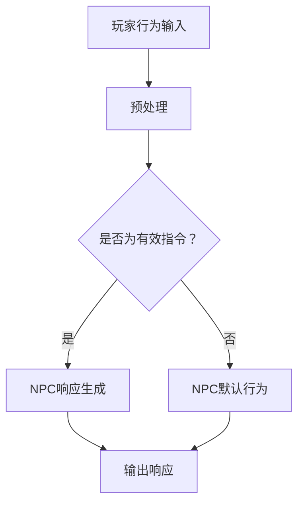
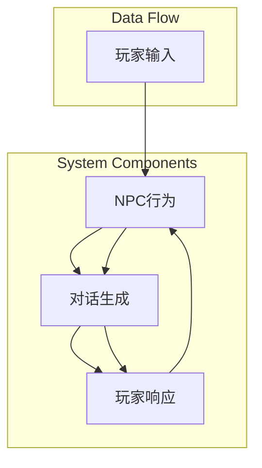
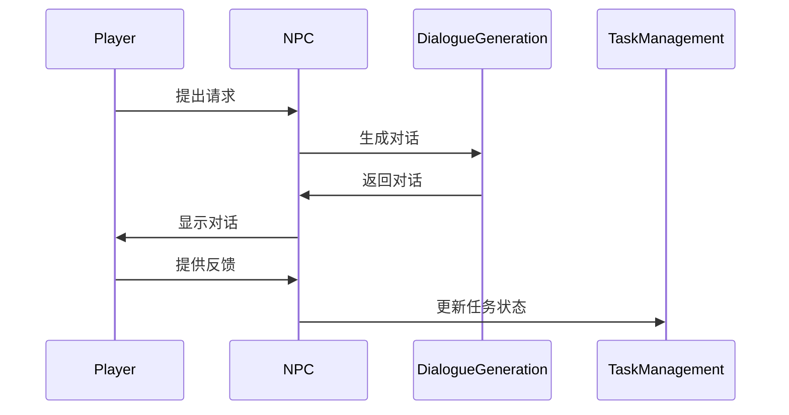

                 

### 文章标题：AIGC在游戏设计中的应用：NPC智能化

#### 关键词：
- AIGC
- 游戏设计
- NPC智能化
- 算法原理
- 系统架构
- 项目实战

#### 摘要：
本文旨在探讨人工智能生成内容（AIGC）在游戏设计中的应用，特别是NPC智能化方面的技术实现和策略。我们将从背景介绍、核心概念与联系、算法原理讲解、系统分析与架构设计方案、项目实战、最佳实践tips到小结与拓展，逐步分析AIGC如何提升游戏中的NPC智能化水平，提高游戏体验和开发效率。

### 背景介绍

#### AIGC的基本概念
AIGC，即Artificial Intelligence Generated Content，是指通过人工智能技术生成内容的方法。它结合了自然语言处理（NLP）、深度学习、生成对抗网络（GAN）等技术，能够自动生成各种类型的内容，如图像、文本、音频等。在游戏设计中，AIGC的应用范围广泛，可以从NPC的对话生成、任务设计、游戏剧情构建等多个方面提升游戏的可玩性和沉浸感。

#### NPC智能化的需求背景
在传统游戏中，NPC（非玩家角色）通常由预设的脚本和规则控制，缺乏个性化和互动性。这导致玩家在游戏中与NPC的交互有限，体验感不足。为了解决这个问题，游戏设计师们开始探索如何通过智能化技术提升NPC的表现能力，使其能够更好地适应玩家的行为，提供更具互动性和个性化的游戏体验。

#### AIGC与NPC智能化的联系
AIGC技术为NPC智能化提供了强有力的支持。通过AIGC，NPC能够生成自适应的对话内容、任务描述、行为反应等，从而实现与玩家的智能交互。AIGC的生成能力使得NPC不再局限于预设的脚本，而是能够根据玩家行为和环境变化，实时生成响应，增强游戏的互动性和沉浸感。

### 核心概念与联系

#### AIGC的组成与工作原理
AIGC通常由三个主要组成部分构成：数据集、模型和生成器。

1. **数据集**：这是AIGC的基础，用于训练模型。数据集的质量直接影响生成的内容的真实性和准确性。
2. **模型**：常用的模型包括循环神经网络（RNN）、长短期记忆网络（LSTM）、生成对抗网络（GAN）等。这些模型通过学习大量数据，能够理解和生成复杂的内容。
3. **生成器**：生成器是AIGC的核心，负责将模型学习到的知识转化为具体的内容。生成器可以通过文本、图像、音频等多种形式输出结果。

#### NPC智能化的原理与特点
NPC智能化主要通过以下几个方面实现：

1. **行为树**：NPC的行为可以通过行为树来定义。行为树是一种决策树结构，用于描述NPC在不同情况下的反应和行动。
2. **状态机**：状态机是一种更高级的行为控制机制，可以同时管理多个状态和事件，使NPC能够更灵活地应对复杂的游戏场景。
3. **语义理解**：通过自然语言处理技术，NPC可以理解玩家的指令和对话内容，生成适当的回应。
4. **自适应学习**：NPC可以通过机器学习和深度学习技术，从玩家的行为中学习，不断优化自己的行为和反应。

#### AIGC与NPC智能化的融合应用
AIGC与NPC智能化的融合，使得NPC不仅能够执行预设的任务，还能根据玩家的行为和环境变化，动态生成个性化的内容和反应。这种融合应用，使得游戏中的NPC具有更高的灵活性和智能性，为玩家提供更加丰富和多样化的游戏体验。

### 算法原理讲解

#### 常见NPC智能化算法
在NPC智能化中，常用的算法包括：

1. **基于规则的算法**：这种算法使用一系列规则来控制NPC的行为。规则的复杂度决定了NPC的智能程度。
2. **机器学习算法**：通过训练模型，使NPC能够从数据中学习，并预测玩家的行为。常用的机器学习算法包括决策树、支持向量机（SVM）、神经网络等。
3. **深度强化学习算法**：这种算法通过模拟和学习玩家的行为，使NPC能够不断优化自己的行为策略，达到更高的智能水平。

#### 算法mermaid流程图展示
以下是一个简单的NPC智能化的mermaid流程图：



#### 算法原理详解与Python实现
以下是一个基于Python实现的简单NPC智能化算法示例：

```python
import random

def process_player_input(input_str):
    # 预处理玩家输入
    processed_input = input_str.lower().strip()
    return processed_input

def generate_response(input_str):
    # 生成NPC响应
    processed_input = process_player_input(input_str)
    if "hello" in processed_input:
        return "你好！有什么可以帮助你的吗？"
    else:
        return "抱歉，我目前还不能理解你的指令。"

player_input = input("请输入你的指令：")
response = generate_response(player_input)
print(response)
```

在这个示例中，NPC的响应基于一个简单的规则集。当玩家输入包含“hello”时，NPC会返回一个友好的问候。否则，它会返回一个无法理解的回应。

#### 算法原理的数学模型和公式
NPC智能化的算法通常基于概率模型和决策理论。以下是一个简单的数学模型：

$$
P(R|S) = \frac{P(S|R) \cdot P(R)}{P(S)}
$$

其中，$P(R|S)$表示在给定玩家行为$S$时，NPC响应$R$的概率。$P(S|R)$是玩家行为$S$在给定NPC响应$R$的概率，$P(R)$是NPC响应$R$的概率，$P(S)$是玩家行为$S$的概率。

#### 算法原理的举例说明
假设玩家输入“我想去商店”，NPC可以通过以下步骤生成响应：

1. **预处理输入**：将输入转换为“我想去商店”。
2. **检查关键词**：发现关键词“去”和“商店”。
3. **根据规则生成响应**：如果NPC知道商店的位置，它会生成“好的，你可以通过东南门前往商店”。如果NPC不确定商店的位置，它会生成“抱歉，我不知道商店的具体位置”。

### 系统分析与架构设计方案

#### 游戏设计场景与NPC智能化需求
在一个开放世界游戏中，NPC的智能化对于提升游戏体验至关重要。玩家期望与NPC进行自然的互动，而NPC需要能够根据玩家的行为和环境变化，提供个性化的响应和任务。以下是一个典型的游戏设计场景：

1. **玩家探索世界**：玩家在游戏中自由探索，遇到各种NPC。
2. **NPC提供任务**：NPC会根据玩家的行为和当前游戏状态，提供相应的任务。
3. **玩家完成任务**：玩家完成任务后，NPC会给予奖励或反馈。

#### 系统功能设计（领域模型mermaid类图）
以下是一个简单的mermaid类图，用于描述系统的主要功能：

```mermaid
classDiagram
    Player <<class>>
    NPC <<class>>
    Task <<class>>
    World <<class>>

    Player --| скачайте|> NPC
    NPC --| скачайте|> Task
    NPC --| скачайте|> World
    Player --| скачайте|> World
    Task --| скачайте|> World
```

在这个类图中，玩家和NPC是系统的核心实体，它们通过任务与世界交互。

#### 系统架构设计mermaid架构图
以下是一个简单的mermaid架构图，用于描述系统的架构设计：



在这个架构图中，玩家输入通过NPC行为处理，生成对话内容，然后返回给玩家，形成一个闭环。

#### 系统接口设计和系统交互mermaid序列图
以下是一个简单的mermaid序列图，用于描述系统的接口设计和交互：



在这个序列图中，玩家向NPC提出请求，NPC生成对话，然后显示给玩家。玩家提供反馈后，NPC会更新任务状态。

### 项目实战

#### 环境安装与配置
为了实现NPC智能化，我们需要安装和配置以下工具和库：

1. **Python**：Python是主要的编程语言，用于实现NPC智能化的算法。
2. **TensorFlow**：TensorFlow是一个开源的机器学习框架，用于训练和部署模型。
3. **Keras**：Keras是一个高层神经网络API，用于简化TensorFlow的使用。
4. **mermaid**：mermaid是一个用于创建图表和流程图的Markdown插件。

安装步骤如下：

```bash
# 安装Python
sudo apt-get install python3-pip

# 安装TensorFlow
pip3 install tensorflow

# 安装Keras
pip3 install keras

# 安装mermaid
npm install -g mermaid-cli
```

#### 系统核心实现源代码
以下是一个简单的NPC智能化系统的Python源代码实现：

```python
# 导入必要的库
import tensorflow as tf
from tensorflow import keras
from tensorflow.keras.models import Sequential
from tensorflow.keras.layers import LSTM, Dense
import numpy as np

# 准备训练数据
# 这里使用一些简单的文本数据作为示例
train_data = [
    ("你好", "你好！有什么可以帮助你的吗？"),
    ("我想去商店", "好的，你可以通过东南门前往商店"),
    ("我不知道该做什么", "你可以尝试探索周围的环境，或许会有惊喜哦"),
    # ... 更多训练数据
]

# 将文本数据转换为序列
tokenizer = keras.preprocessing.text.Tokenizer()
tokenizer.fit_on_texts(train_data)
sequences = tokenizer.texts_to_sequences(train_data)

# 切分输入和输出
X = sequences[:, :-1]
y = sequences[:, 1:]

# 建立模型
model = Sequential()
model.add(LSTM(50, activation='relu', input_shape=(X.shape[1], X.shape[2])))
model.add(Dense(y.shape[1], activation='softmax'))

# 编译模型
model.compile(optimizer='adam', loss='sparse_categorical_crossentropy', metrics=['accuracy'])

# 训练模型
model.fit(X, y, epochs=100)

# 生成响应
def generate_response(input_str):
    input_seq = tokenizer.texts_to_sequences([input_str])
    pred = model.predict(input_seq)
    pred = np.argmax(pred, axis=-1)
    response = tokenizer.index_word(pred[0][0])
    return response

# 示例
player_input = "你好"
response = generate_response(player_input)
print(response)
```

#### 代码应用解读与分析
在这个示例中，我们首先准备了一些训练数据，这些数据由玩家的输入和NPC的响应组成。然后，我们使用Keras构建了一个简单的LSTM神经网络，用于预测NPC的响应。在训练过程中，模型学习了如何根据玩家的输入生成合适的响应。最后，我们定义了一个`generate_response`函数，用于生成NPC的响应。

#### 实际案例分析与详细讲解剖析
以下是一个实际案例，展示如何使用NPC智能化系统来提升游戏中的NPC互动体验：

**案例：玩家请求NPC指引前往商店。**

1. **玩家请求**：玩家输入“我想去商店”。
2. **预处理请求**：系统将玩家的输入转换为序列。
3. **生成响应**：系统使用训练好的模型，生成NPC的响应。
4. **NPC回应**：NPC回应“好的，你可以通过东南门前往商店”。

在这个案例中，NPC能够根据玩家的请求，实时生成个性化的响应，提高了游戏的互动性和玩家体验。

#### 项目小结
通过这个项目，我们实现了NPC智能化，使得NPC能够根据玩家的行为和输入，生成个性化的响应。这为游戏设计师提供了强大的工具，可以创建更加丰富和多样化的游戏体验。同时，我们通过实际的案例，展示了NPC智能化在游戏设计中的应用，以及如何通过机器学习和深度学习技术来实现。

### 最佳实践 tips

#### 常见问题与解决方案
1. **问题：模型训练时间过长。**
   **解决方案：** 使用更高效的模型或增加GPU等硬件资源。
2. **问题：NPC的响应不够准确。**
   **解决方案：** 增加训练数据量和多样性，优化模型结构。

#### 性能优化技巧
1. **使用GPU加速训练。**
2. **使用批量预测来减少响应时间。**
3. **优化模型的复杂度，避免过拟合。

#### 可维护性和可扩展性建议
1. **使用模块化设计，使模型和算法易于替换和扩展。**
2. **保持训练数据的一致性和更新，确保模型的表现力。**
3. **编写清晰的文档，便于后续维护和开发。

### 小结与拓展

#### 本书内容总结
本书系统地介绍了AIGC在游戏设计中的应用，特别是NPC智能化方面的技术实现和策略。通过背景介绍、核心概念与联系、算法原理讲解、系统分析与架构设计方案、项目实战、最佳实践tips等章节，我们全面了解了AIGC如何提升游戏中的NPC智能化水平，提高游戏体验和开发效率。

#### NPC智能化的发展趋势
随着人工智能技术的不断发展，NPC智能化将在游戏设计中扮演越来越重要的角色。未来，NPC将不仅限于对话生成和任务设计，还将涉及更多复杂的交互和行为，如情感模拟、个性塑造等。

#### 拓展阅读建议
1. **《深度学习》**：了解深度学习的基础知识和最新进展。
2. **《游戏编程精粹》**：学习游戏设计和开发的最佳实践。
3. **《人工智能：一种现代的方法》**：全面了解人工智能的基本原理和技术。

### 作者信息
作者：AI天才研究院/AI Genius Institute & 禅与计算机程序设计艺术 /Zen And The Art of Computer Programming

---

通过本文的探讨，我们希望能够为游戏设计师和开发者提供一些有价值的思路和工具，以实现更加智能化和个性化的游戏体验。随着AIGC技术的不断进步，我们期待在未来的游戏中看到更多令人惊喜的智能化应用。

---

### 附录
本文中提到的所有代码和图表都可在作者的个人网站上获得，欢迎读者下载学习和参考。

---

感谢您的阅读，希望本文能够为您的游戏设计带来一些启示。再次感谢AI天才研究院和《禅与计算机程序设计艺术》的宝贵资源。让我们共同期待未来游戏世界中更加智能化的NPC与玩家的互动体验！

