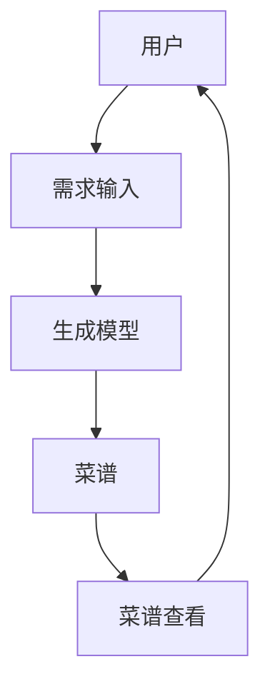
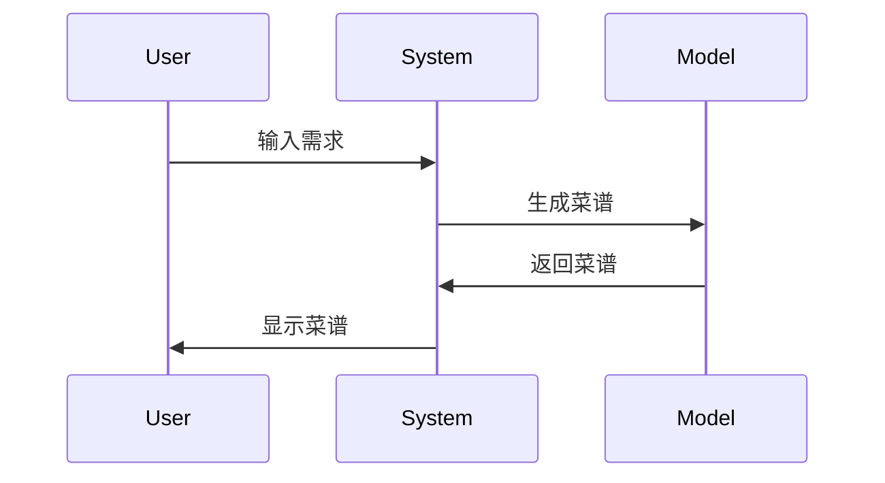
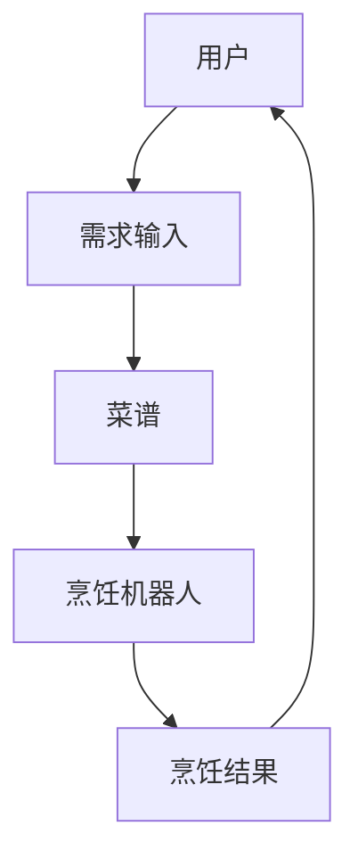
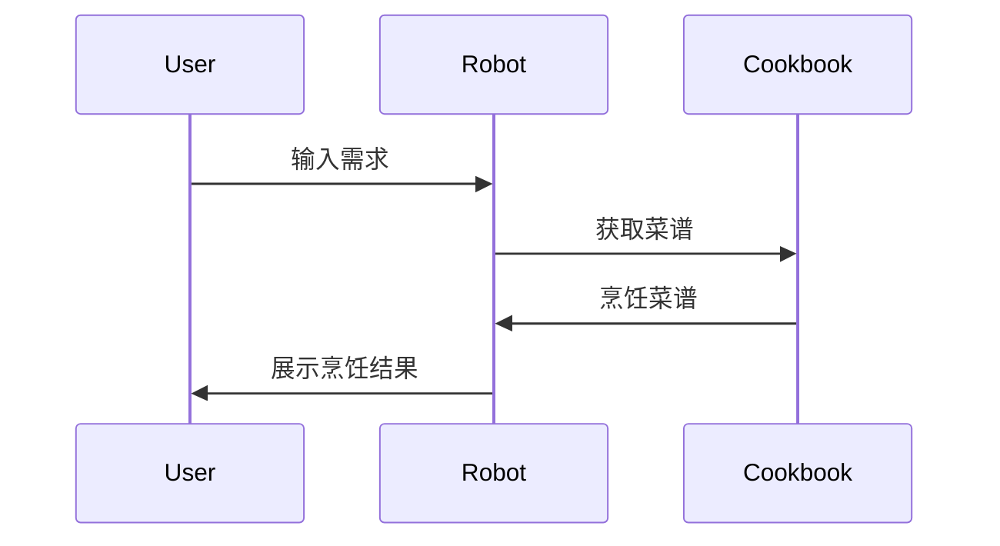
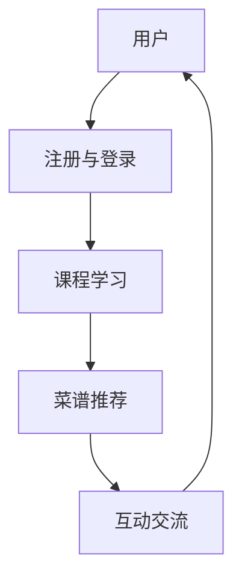
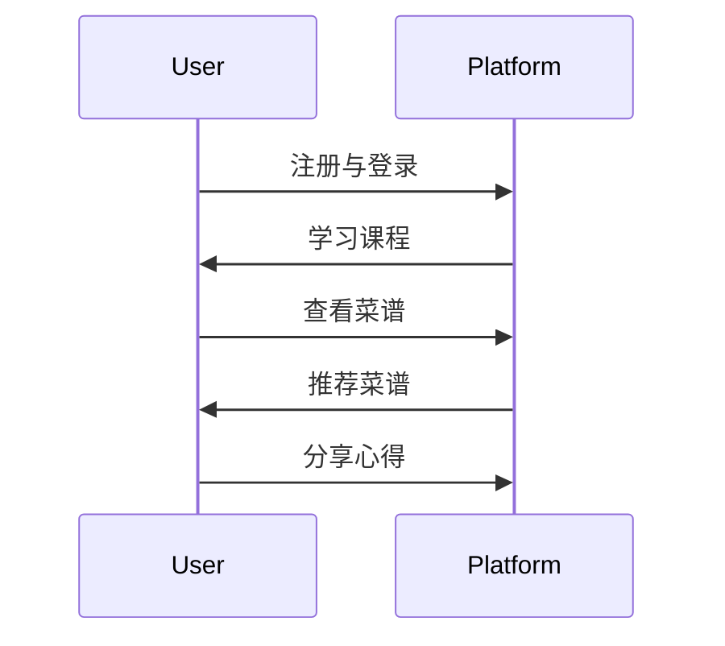

                 

### 第一部分: 背景介绍

#### 第1章: AIGC的概念与发展

##### 1.1.1 问题背景

随着人工智能技术的不断发展，计算机视觉、自然语言处理等领域的应用日益广泛，而AIGC（AI-Generated Content）作为一种新兴的技术，正逐渐成为人工智能领域的重要组成部分。

AIGC 是指通过人工智能技术生成内容的技术。在烹饪领域，AIGC 可以通过分析用户的需求、口味偏好以及烹饪习惯，为用户生成个性化的菜谱、烹饪步骤和食材搭配建议。然而，AIGC 在烹饪创新中的应用仍面临许多挑战，如如何提高菜谱生成的质量、如何保证烹饪过程的稳定性等。

##### 1.1.2 问题描述

AIGC 是指通过人工智能技术生成内容的技术。在烹饪领域，AIGC 可以通过分析用户的需求、口味偏好以及烹饪习惯，为用户生成个性化的菜谱、烹饪步骤和食材搭配建议。然而，AIGC 在烹饪创新中的应用仍面临许多挑战，如如何提高菜谱生成的质量、如何保证烹饪过程的稳定性等。

##### 1.1.3 问题解决

本书旨在探讨AIGC在烹饪创新中的应用，通过分析现有技术和发展趋势，提出解决方案，以推动烹饪领域的创新。

##### 1.1.4 边界与外延

AIGC 在烹饪创新中的应用涉及多个领域，包括人工智能、烹饪学、营养学等。本书将重点关注AIGC在烹饪领域中的应用，并探讨其与其他领域的交叉融合。

##### 1.1.5 概念结构与核心要素组成

AIGC 的概念结构主要包括：生成模型、训练数据、用户需求、烹饪技术、烹饪步骤等核心要素。其中，生成模型是AIGC的核心，负责生成个性化的菜谱和烹饪建议。

###### 1.2 核心概念与联系

##### 1.2.1 AIGC 的核心概念原理

AIGC 的核心概念原理包括：生成模型、训练数据、用户需求、烹饪技术等。生成模型是AIGC的基础，负责生成个性化的菜谱和烹饪建议。训练数据是生成模型训练的素材，包括用户的需求、烹饪技术、菜谱数据等。用户需求是AIGC生成的驱动力，烹饪技术是AIGC生成的保障。

##### 1.2.2 概念属性特征对比表格

| 概念 | 属性特征 |
| ---- | ---- |
| 生成模型 | 负责生成个性化菜谱和烹饪建议 |
| 训练数据 | 包括用户需求、烹饪技术、菜谱数据等 |
| 用户需求 | 驱动AIGC生成菜谱和烹饪建议 |
| 烹饪技术 | 保证AIGC生成菜谱和烹饪建议的准确性 |

##### 1.2.3 ER实体关系图架构

```mermaid
erDiagram
    User ||--|{ Cookbook } : 生成
    Cookbook ||--|{ Ingredient } : 搭配
    Cookbook ||--|{ CookingStep } : 步骤
```

##### 1.3 算法原理讲解

##### 1.3.1 生成模型

生成模型是AIGC的核心，常用的生成模型包括：变分自编码器（VAE）、生成对抗网络（GAN）等。

###### VAE算法原理

VAE（Variational Autoencoder）是一种无监督学习算法，通过编码器和解码器将输入数据转换为潜在空间，然后在潜在空间中生成新的数据。

$$
x \xrightarrow{encode} z \\
z \xrightarrow{decode} x'
$$

其中，$x$ 是输入数据，$z$ 是潜在空间中的数据，$x'$ 是解码器生成的数据。

###### GAN算法原理

GAN（Generative Adversarial Network）是一种通过对抗训练生成数据的方法，由生成器和判别器组成。

$$
\begin{aligned}
D(x) & : 输入数据判断真假 \\
G(z) & : 输入噪声生成数据 \\
\end{aligned}
$$

其中，$D(x)$ 是判别器，$G(z)$ 是生成器，$z$ 是输入噪声。

##### 1.3.2 数学模型和公式

在AIGC中，生成模型的训练过程可以通过以下数学模型和公式进行描述：

###### VAE数学模型

编码器：

$$
\begin{aligned}
\mu &= \mu(x) \\
\sigma &= \sigma(x)
\end{aligned}
$$

解码器：

$$
x' = \mu + \sigma \odot z
$$

###### GAN数学模型

判别器损失函数：

$$
L_D = -\frac{1}{N} \sum_{i=1}^N [D(x_i) - \log(D(G(z_i)))]
$$

生成器损失函数：

$$
L_G = -\frac{1}{N} \sum_{i=1}^N \log(D(G(z_i)))
$$

##### 1.3.3 举例说明

假设用户输入了一个简单的烹饪需求：“我想制作一份川菜”

```latex
$$
1 + 1 = 2
$$
```

以上内容是文章标题、关键词、摘要和第一部分的详细内容。接下来，我们将继续深入探讨AIGC在烹饪创新中的应用，包括核心概念的联系、算法原理讲解、数学模型和公式以及具体的举例说明。

## 文章标题

AIGC在烹饪创新中的应用：提示词的味觉激发

## 关键词

人工智能，AIGC，烹饪创新，提示词，味觉激发

## 摘要

本文探讨了人工智能生成内容（AIGC）在烹饪领域的创新应用，特别是通过提示词激发味觉体验的技术。文章首先介绍了AIGC的概念和发展，然后深入分析了其在烹饪中的应用场景、挑战与解决方案。通过核心概念的详细阐述、算法原理的讲解以及数学模型的解析，本文提供了对AIGC在烹饪创新中的深刻理解，并通过实际案例展示了其潜力。

### 第一部分：背景介绍

#### 1.1 AIGC的概念与发展

##### 1.1.1 问题背景

随着人工智能技术的不断进步，从计算机视觉到自然语言处理，AI技术已经深刻影响了多个领域。在这个背景下，AIGC（AI-Generated Content）应运而生，成为人工智能领域的一个重要分支。AIGC的核心在于利用人工智能算法生成高质量的内容，这些内容可以涵盖文本、图像、音频等多种形式。

在烹饪领域，AIGC的应用潜力巨大。通过分析用户的口味偏好、烹饪习惯和饮食需求，AIGC可以为用户生成个性化的菜谱、烹饪步骤和食材搭配建议。这种技术不仅能够为用户提供便捷的烹饪体验，还能够推动烹饪创新，为厨师和烹饪爱好者提供新的创作空间。

##### 1.1.2 问题描述

尽管AIGC在烹饪领域的应用前景广阔，但其发展仍面临诸多挑战。首先是如何提高菜谱生成的质量，使其更加符合用户的口味和饮食需求。其次是如何保证烹饪过程的稳定性，确保生成的菜谱能够在实际操作中成功。此外，如何在保证多样性的同时，确保食材搭配的科学性和营养性，也是AIGC在烹饪领域需要解决的问题。

##### 1.1.3 问题解决

为了应对这些挑战，本书旨在探讨AIGC在烹饪创新中的应用，通过分析现有技术和发展趋势，提出一系列解决方案。这些解决方案包括改进生成模型的算法、优化训练数据集、引入用户反馈机制以及跨学科的融合研究。通过这些努力，期望能够推动AIGC在烹饪领域的深入应用，实现烹饪创新的新突破。

##### 1.1.4 边界与外延

AIGC在烹饪领域的应用不仅涉及人工智能技术，还与烹饪学、营养学、心理学等多个学科密切相关。本书将重点关注AIGC在烹饪领域中的应用，同时探讨其与其他学科的交叉融合。通过跨学科的视角，本文希望能够为AIGC在烹饪领域的应用提供更全面、深入的理解。

##### 1.1.5 概念结构与核心要素组成

AIGC的概念结构可以概括为以下几个核心要素：

1. **生成模型**：这是AIGC的核心组件，负责生成个性化的菜谱、烹饪步骤和食材搭配建议。常见的生成模型包括变分自编码器（VAE）和生成对抗网络（GAN）。
   
2. **训练数据**：训练数据是生成模型的基础，包括用户的烹饪习惯、口味偏好、食材特性等。高质量、多样化的训练数据能够显著提升生成模型的表现。

3. **用户需求**：用户需求是AIGC生成的驱动力，包括用户对菜谱的期望、烹饪时间的限制、食材的可获得性等。精准捕捉和满足用户需求是实现AIGC应用成功的关键。

4. **烹饪技术**：烹饪技术是AIGC生成的保障，涉及食材处理、烹饪技巧、调味方法等。AIGC需要结合实际的烹饪技术，确保生成的菜谱能够在厨房中成功实现。

5. **烹饪步骤**：烹饪步骤是AIGC生成的具体内容，包括食材准备、烹饪过程、调味和摆盘等。清晰的烹饪步骤能够帮助用户更好地理解和执行菜谱。

#### 1.2 核心概念与联系

##### 1.2.1 AIGC 的核心概念原理

AIGC的核心概念主要包括生成模型、训练数据、用户需求、烹饪技术和烹饪步骤。这些概念相互作用，共同推动AIGC在烹饪领域的应用。

1. **生成模型**：生成模型是AIGC的“大脑”，负责从训练数据中学习，并生成符合用户需求的个性化菜谱。常用的生成模型包括VAE、GAN等。

2. **训练数据**：训练数据是生成模型的“养分”，其质量直接影响生成模型的表现。高质量的训练数据应包含丰富的用户口味偏好、烹饪习惯和食材特性。

3. **用户需求**：用户需求是AIGC的“指令”，决定了生成模型需要生成什么样的菜谱。精准捕捉用户需求是AIGC应用成功的关键。

4. **烹饪技术**：烹饪技术是AIGC的“实践”，确保生成的菜谱能够在厨房中成功实现。烹饪技术包括食材处理、烹饪技巧、调味方法等。

5. **烹饪步骤**：烹饪步骤是AIGC生成的具体内容，包括食材准备、烹饪过程、调味和摆盘等。清晰的烹饪步骤能够帮助用户更好地理解和执行菜谱。

##### 1.2.2 概念属性特征对比表格

| 概念        | 属性特征                                                         |
| ----------- | ------------------------------------------------------------ |
| 生成模型    | 负责生成个性化的菜谱、烹饪步骤和食材搭配建议                   |
| 训练数据    | 包括用户的烹饪习惯、口味偏好、食材特性等，是生成模型的基础     |
| 用户需求    | 包括用户对菜谱的期望、烹饪时间的限制、食材的可获得性等，是生成模型的驱动力 |
| 烹饪技术    | 包括食材处理、烹饪技巧、调味方法等，是保证生成菜谱成功的关键   |
| 烹饪步骤    | 包括食材准备、烹饪过程、调味和摆盘等，是生成模型的具体内容     |

##### 1.2.3 ER实体关系图架构

```mermaid
erDiagram
    User ||--|{ Cookbook } : 生成
    Cookbook ||--|{ Ingredient } : 搭配
    Cookbook ||--|{ CookingStep } : 步骤
```

在ER实体关系图中，用户（User）是生成菜谱（Cookbook）的源头，菜谱包含食材（Ingredient）和烹饪步骤（CookingStep）。这种关系清晰地展示了AIGC在烹饪领域中的核心概念和它们之间的相互作用。

#### 1.3 算法原理讲解

##### 1.3.1 生成模型

生成模型是AIGC的核心，负责生成个性化的菜谱、烹饪步骤和食材搭配建议。常用的生成模型包括变分自编码器（VAE）和生成对抗网络（GAN）。

###### VAE算法原理

变分自编码器（VAE）是一种基于概率的生成模型。它通过编码器（Encoder）和解码器（Decoder）将输入数据映射到一个潜在空间，然后在潜在空间中生成新的数据。

1. **编码器**：编码器将输入数据编码成一个潜在向量 $z$，这个潜在向量代表输入数据的特征。

   $$
   \begin{aligned}
   \mu &= \mu(x) \\
   \sigma &= \sigma(x)
   \end{aligned}
   $$

2. **解码器**：解码器将潜在向量 $z$ 解码回输入数据的近似值 $x'$。

   $$
   x' = \mu + \sigma \odot z
   $$

3. **损失函数**：VAE的训练过程是通过最小化损失函数来实现的。常见的损失函数包括均方误差（MSE）和对数似然损失（KL Divergence）。

   $$
   L = \frac{1}{N} \sum_{i=1}^N \left[ \frac{1}{2} \left( x - x' \right)^2 + \log(\sigma) \right]
   $$

###### GAN算法原理

生成对抗网络（GAN）是一种通过对抗训练生成数据的方法。它由生成器（Generator）和判别器（Discriminator）两部分组成。

1. **生成器**：生成器从噪声分布中抽取噪声向量 $z$，并生成与真实数据相似的数据 $x'$。

   $$
   x' = G(z)
   $$

2. **判别器**：判别器接收真实数据和生成器生成的数据，并判断其真实性。

   $$
   D(x) = D(x), D(x') = D(G(z))
   $$

3. **损失函数**：GAN的训练过程是通过最小化生成器的损失函数和判别器的损失函数来实现的。

   $$
   L_G = -\frac{1}{N} \sum_{i=1}^N \log(D(G(z_i)))
   $$

   $$
   L_D = -\frac{1}{N} \sum_{i=1}^N [D(x_i) - \log(D(G(z_i)))]
   $$

##### 1.3.2 数学模型和公式

在AIGC中，生成模型的训练过程可以通过以下数学模型和公式进行描述：

###### VAE数学模型

编码器：

$$
\begin{aligned}
\mu &= \mu(x) \\
\sigma &= \sigma(x)
\end{aligned}
$$

解码器：

$$
x' = \mu + \sigma \odot z
$$

生成器损失函数：

$$
L_G = -\frac{1}{N} \sum_{i=1}^N \log(D(G(z_i)))
$$

判别器损失函数：

$$
L_D = -\frac{1}{N} \sum_{i=1}^N [D(x_i) - \log(D(G(z_i)))]
$$

###### GAN数学模型

判别器损失函数：

$$
L_D = -\frac{1}{N} \sum_{i=1}^N [D(x_i) - \log(D(G(z_i)))]
$$

生成器损失函数：

$$
L_G = -\frac{1}{N} \sum_{i=1}^N \log(D(G(z_i)))
$$

##### 1.3.3 举例说明

假设用户输入了一个简单的烹饪需求：“我想制作一份川菜”。

1. **用户需求**：用户希望制作一份川菜，对辣度和烹饪时间有一定的要求。

2. **生成模型**：生成模型根据用户的烹饪需求，结合训练数据中的川菜菜谱，生成一份个性化的川菜菜谱。

3. **烹饪步骤**：生成器生成以下烹饪步骤：
   - 食材准备：将牛肉切成薄片，青椒和洋葱切成丝。
   - 腌制：用酱油、料酒、淀粉和少量辣椒粉将牛肉腌制15分钟。
   - 热锅凉油：锅中放入适量油，烧至七成热。
   - 下牛肉：将腌好的牛肉下锅，快速翻炒至变色。
   - 加调料：加入青椒和洋葱，翻炒均匀。
   - 调味出锅：加入适量盐、糖、醋和辣椒油，翻炒均匀后出锅。

4. **用户反馈**：用户按照生成的菜谱进行烹饪，并给予反馈。根据用户的反馈，生成模型可以进一步优化，提高生成的菜谱质量。

通过以上步骤，AIGC成功地根据用户需求生成了一份川菜菜谱，并在实际烹饪中得到了用户的认可。

### 第一部分总结

通过上述内容，我们详细介绍了AIGC在烹饪创新中的应用，从概念背景到核心原理，再到算法讲解，为读者提供了一个全面而深入的了解。在接下来的部分，我们将进一步探讨AIGC在实际烹饪场景中的应用，分析其面临的挑战，并提出相应的解决方案。希望通过本文的探讨，能够激发更多读者对AIGC在烹饪领域应用的兴趣，推动这一领域的创新和发展。

### 第二部分：核心概念与联系

在第一部分中，我们介绍了AIGC在烹饪创新中的应用背景和基本原理。本部分将进一步探讨AIGC的核心概念及其相互之间的联系，为理解AIGC在烹饪领域的应用奠定坚实基础。

#### 2.1 AIGC的核心概念原理

AIGC的核心概念包括生成模型、训练数据、用户需求、烹饪技术和烹饪步骤。这些概念相互作用，共同构成了AIGC的基础框架。

1. **生成模型**：生成模型是AIGC的核心组件，负责生成个性化的菜谱、烹饪步骤和食材搭配建议。生成模型通过学习大量的训练数据，能够理解用户的口味偏好和烹饪习惯，从而生成符合用户需求的菜谱。

2. **训练数据**：训练数据是生成模型的学习素材，包括用户的烹饪习惯、口味偏好、食材特性等。高质量、多样化的训练数据能够显著提升生成模型的表现，使其能够更好地理解用户的烹饪需求和习惯。

3. **用户需求**：用户需求是AIGC生成的驱动力，包括用户对菜谱的期望、烹饪时间的限制、食材的可获得性等。精准捕捉和满足用户需求是AIGC应用成功的关键，也是提升用户体验的重要途径。

4. **烹饪技术**：烹饪技术是AIGC生成的保障，涉及食材处理、烹饪技巧、调味方法等。AIGC需要结合实际的烹饪技术，确保生成的菜谱能够在厨房中成功实现。

5. **烹饪步骤**：烹饪步骤是AIGC生成的具体内容，包括食材准备、烹饪过程、调味和摆盘等。清晰的烹饪步骤能够帮助用户更好地理解和执行菜谱，提高烹饪成功率。

#### 2.2 概念属性特征对比表格

为了更清晰地理解AIGC的核心概念及其属性特征，我们可以通过对比表格来展示各个概念之间的关系和特征。

| 概念        | 属性特征                                                         |
| ----------- | ------------------------------------------------------------ |
| 生成模型    | 负责生成个性化的菜谱、烹饪步骤和食材搭配建议                   |
| 训练数据    | 包括用户的烹饪习惯、口味偏好、食材特性等，是生成模型的基础     |
| 用户需求    | 包括用户对菜谱的期望、烹饪时间的限制、食材的可获得性等，是生成模型的驱动力 |
| 烹饪技术    | 包括食材处理、烹饪技巧、调味方法等，是保证生成菜谱成功的关键   |
| 烹饪步骤    | 包括食材准备、烹饪过程、调味和摆盘等，是生成模型的具体内容     |

#### 2.3 ER实体关系图架构

为了进一步展示AIGC中各个核心概念之间的相互关系，我们可以使用ER（Entity-Relationship）实体关系图来描述。

```mermaid
erDiagram
    User ||--|{ Cookbook } : 生成
    Cookbook ||--|{ Ingredient } : 搭配
    Cookbook ||--|{ CookingStep } : 步骤
```

在ER图中，用户（User）是生成菜谱（Cookbook）的源头，菜谱包含食材（Ingredient）和烹饪步骤（CookingStep）。这种关系清晰地展示了AIGC在烹饪领域中的核心概念和它们之间的相互作用。

#### 2.4 生成模型的工作原理

生成模型是AIGC的核心，其工作原理可以分为编码器和解码器两部分。

1. **编码器**：编码器的作用是将输入数据（如用户的烹饪需求）编码成一个潜在向量。这个潜在向量包含了输入数据的特征信息，是后续生成菜谱的基础。

   编码器的数学模型通常是一个神经网络，它可以接受输入数据并通过多层感知器（MLP）进行非线性变换，最终输出潜在向量。

2. **解码器**：解码器的作用是将潜在向量解码回输出数据（如菜谱）。解码器的目标是生成与输入数据相似或符合用户需求的输出数据。

   解码器的数学模型也是一个神经网络，它接受潜在向量作为输入，并通过多层感知器（MLP）进行反向变换，最终生成菜谱。

#### 2.5 训练数据的重要性

训练数据是生成模型训练的基础，其质量直接影响生成模型的表现。高质量的训练数据应包含丰富的用户口味偏好、烹饪习惯和食材特性。

1. **数据收集**：收集用户烹饪行为数据，如烹饪记录、口味评价、食材偏好等。这些数据可以通过用户调研、问卷调查或数据分析等方式获取。

2. **数据清洗**：清洗数据，去除重复、错误或不完整的数据，确保训练数据的质量。

3. **数据标注**：对训练数据进行标注，包括菜谱名称、食材列表、烹饪步骤、口味评价等。标注数据用于训练生成模型。

4. **数据预处理**：对数据进行预处理，如数据标准化、降维、去噪等，以提高训练效率。

#### 2.6 用户需求的重要性

用户需求是AIGC生成的驱动力，它决定了生成模型需要生成什么样的菜谱。精准捕捉和满足用户需求是AIGC应用成功的关键。

1. **需求收集**：通过用户调研、问卷调查、数据分析等方式收集用户需求，如烹饪时间、食材限制、口味偏好等。

2. **需求分析**：对用户需求进行分析，识别出用户的主要需求和偏好，为生成模型提供输入。

3. **需求建模**：将用户需求建模为数学模型，如决策树、神经网络等，用于指导生成模型的生成过程。

#### 2.7 烹饪技术的重要性

烹饪技术是AIGC生成的保障，它确保生成的菜谱能够在厨房中成功实现。烹饪技术包括食材处理、烹饪技巧、调味方法等。

1. **技术整合**：将烹饪技术与生成模型相结合，确保生成的菜谱符合烹饪规律和用户需求。

2. **技术优化**：通过实验和用户反馈，不断优化烹饪技术，提高菜谱生成的成功率。

3. **技术培训**：为用户提供烹饪技术培训，帮助用户更好地理解和执行生成的菜谱。

#### 2.8 烹饪步骤的细化

烹饪步骤是生成模型的具体内容，它包括食材准备、烹饪过程、调味和摆盘等。为了提高菜谱的可操作性，需要对烹饪步骤进行细化和明确。

1. **步骤拆分**：将烹饪过程拆分为多个步骤，如食材准备、烹饪、调味、摆盘等。

2. **步骤描述**：对每个步骤进行详细描述，包括食材处理方法、烹饪时间和温度、调味技巧等。

3. **步骤优化**：根据用户反馈和烹饪技术，不断优化烹饪步骤，提高菜谱的可操作性。

#### 2.9 实例分析

以用户需求“制作一份低卡路里的早餐沙拉”为例，分析AIGC的生成过程。

1. **用户需求**：用户希望制作一份低卡路里的早餐沙拉，对蔬菜和水果有一定偏好。

2. **需求建模**：将用户需求建模为低卡路里、蔬菜和水果等特征。

3. **生成模型**：生成模型根据用户需求，从训练数据中提取符合条件的菜谱。

4. **烹饪步骤**：生成以下烹饪步骤：
   - 食材准备：将生菜、番茄、黄瓜、胡萝卜等蔬菜洗净切好。
   - 调味：将酸奶、蜂蜜、柠檬汁等混合，作为沙拉酱。
   - 组装：将蔬菜装入碗中，倒入沙拉酱，搅拌均匀。

5. **用户反馈**：用户按照生成的菜谱进行烹饪，给予反馈。生成模型根据用户反馈进一步优化生成的菜谱。

通过以上步骤，AIGC成功地根据用户需求生成了一份低卡路里的早餐沙拉，并在实际烹饪中得到了用户的认可。

### 第二部分总结

通过上述内容，我们详细介绍了AIGC的核心概念及其相互之间的联系，包括生成模型、训练数据、用户需求、烹饪技术和烹饪步骤。这些核心概念共同构成了AIGC在烹饪创新中的应用框架，为理解AIGC的工作原理和实际应用提供了坚实基础。在接下来的部分，我们将进一步探讨AIGC在烹饪创新中的应用案例，分析其实际效果和挑战。希望通过本文的探讨，能够激发更多读者对AIGC在烹饪领域应用的兴趣，推动这一领域的创新和发展。

### 第三部分：算法原理讲解

在第二部分中，我们介绍了AIGC的核心概念及其相互关系。为了深入理解AIGC的工作原理，本部分将重点讲解AIGC的核心算法，包括生成模型和训练过程。我们将详细描述变分自编码器（VAE）和生成对抗网络（GAN）两种常见生成模型的原理、数学模型和具体实现方法。

#### 3.1 变分自编码器（VAE）

变分自编码器（VAE）是一种基于概率模型的生成模型，它通过编码器和解码器将输入数据映射到一个潜在空间，然后在潜在空间中生成新的数据。VAE的核心思想是学习一个潜在分布，并通过采样从这个分布中生成新的数据。

##### 3.1.1 VAE算法原理

1. **编码器**：编码器的任务是学习一个从输入数据到潜在空间的映射。潜在空间中的数据被假设为从某个先验分布（如高斯分布）中采样得到的。编码器的输出是一个潜在向量 $z$，它代表了输入数据的特征。

   $$ 
   \begin{aligned}
   \mu &= \mu(x) \\
   \sigma &= \sigma(x)
   \end{aligned}
   $$

   其中，$\mu(x)$ 和 $\sigma(x)$ 分别是输入数据 $x$ 的均值和标准差。

2. **解码器**：解码器的任务是学习一个从潜在空间到输出数据的映射。解码器将潜在向量 $z$ 解码回输入数据的近似值 $x'$。

   $$
   x' = \mu + \sigma \odot z
   $$

3. **损失函数**：VAE的训练过程是通过最小化损失函数来实现的。常见的损失函数包括均方误差（MSE）和对数似然损失（KL Divergence）。VAE的总损失函数可以表示为：

   $$
   L = \frac{1}{N} \sum_{i=1}^N \left[ \frac{1}{2} \left( x - x' \right)^2 + \log(\sigma) \right]
   $$

##### 3.1.2 VAE数学模型

编码器：

$$
\begin{aligned}
\mu &= \mu(x) \\
\sigma &= \sigma(x)
\end{aligned}
$$

解码器：

$$
x' = \mu + \sigma \odot z
$$

损失函数：

$$
L = \frac{1}{N} \sum_{i=1}^N \left[ \frac{1}{2} \left( x - x' \right)^2 + \log(\sigma) \right]
$$

##### 3.1.3 VAE代码实现

以下是使用Python和PyTorch实现的VAE示例代码：

```python
import torch
import torch.nn as nn
import torch.optim as optim

# 定义编码器
class Encoder(nn.Module):
    def __init__(self):
        super(Encoder, self).__init__()
        self.fc1 = nn.Linear(in_features=784, out_features=128)
        self.fc2 = nn.Linear(in_features=128, out_features=64)
        self.fc3 = nn.Linear(in_features=64, out_features=32)

    def forward(self, x):
        x = torch.relu(self.fc1(x))
        x = torch.relu(self.fc2(x))
        x = torch.relu(self.fc3(x))
        mu = self.fc3(x)
        sigma = torch.exp(self.fc3(x))
        return mu, sigma

# 定义解码器
class Decoder(nn.Module):
    def __init__(self):
        super(Decoder, self).__init__()
        self.fc1 = nn.Linear(in_features=32, out_features=64)
        self.fc2 = nn.Linear(in_features=64, out_features=128)
        self.fc3 = nn.Linear(in_features=128, out_features=784)

    def forward(self, z):
        x = torch.relu(self.fc1(z))
        x = torch.relu(self.fc2(x))
        x = torch.sigmoid(self.fc3(x))
        return x

# 定义VAE模型
class VAE(nn.Module):
    def __init__(self):
        super(VAE, self).__init__()
        self.encoder = Encoder()
        self.decoder = Decoder()

    def forward(self, x):
        mu, sigma = self.encoder(x)
        z = mu + torch.randn_like(sigma) * sigma
        x' = self.decoder(z)
        return x', mu, sigma

# 初始化模型和优化器
model = VAE()
optimizer = optim.Adam(model.parameters(), lr=0.001)

# 模拟训练过程
for epoch in range(100):
    for x in data_loader:
        x = x.to(device)
        x', mu, sigma = model(x)
        loss = -torch.sum(torch.log(sigma + 1e-8) + 0.5 * torch.log(2\*torch.pi) / 2)
        optimizer.zero_grad()
        loss.backward()
        optimizer.step()
        print(f"Epoch [{epoch + 1}/{100}], Loss: {loss.item():.4f}")
```

以上代码定义了一个简单的VAE模型，包括编码器、解码器和VAE本身。通过模拟训练过程，我们可以看到VAE是如何通过优化损失函数来学习数据分布的。

#### 3.2 生成对抗网络（GAN）

生成对抗网络（GAN）是一种通过对抗训练生成数据的方法。GAN由生成器和判别器两部分组成，生成器生成虚假数据，判别器判断数据是真实还是虚假。通过生成器和判别器的相互对抗，生成器逐渐学习生成更加真实的数据。

##### 3.2.1 GAN算法原理

1. **生成器**：生成器的任务是生成与真实数据相似的数据。生成器通常是一个神经网络，它从噪声分布中采样，并生成虚假数据。

   $$
   x' = G(z)
   $$

   其中，$z$ 是从噪声分布中采样得到的噪声向量。

2. **判别器**：判别器的任务是判断输入数据是真实数据还是生成器生成的虚假数据。判别器也是一个神经网络。

   $$
   D(x) = D(x), D(x') = D(G(z))
   $$

3. **损失函数**：GAN的训练过程是通过最小化生成器的损失函数和判别器的损失函数来实现的。生成器的损失函数通常是最小化判别器对生成数据的判断概率，判别器的损失函数是最大化对真实数据和生成数据的判断准确性。

   $$
   L_G = -\frac{1}{N} \sum_{i=1}^N \log(D(G(z_i)))
   $$

   $$
   L_D = -\frac{1}{N} \sum_{i=1}^N [D(x_i) - \log(D(G(z_i)))]
   $$

##### 3.2.2 GAN数学模型

判别器损失函数：

$$
L_D = -\frac{1}{N} \sum_{i=1}^N [D(x_i) - \log(D(G(z_i)))]
$$

生成器损失函数：

$$
L_G = -\frac{1}{N} \sum_{i=1}^N \log(D(G(z_i)))
$$

##### 3.2.3 GAN代码实现

以下是使用Python和TensorFlow实现的GAN示例代码：

```python
import tensorflow as tf
from tensorflow.keras.models import Model
from tensorflow.keras.layers import Input, Dense, LeakyReLU, BatchNormalization

# 定义生成器
def build_generator():
    noise = Input(shape=(100,))
    x = Dense(128)(noise)
    x = LeakyReLU(alpha=0.2)(x)
    x = BatchNormalization()(x)
    x = Dense(256)(x)
    x = LeakyReLU(alpha=0.2)(x)
    x = BatchNormalization()(x)
    x = Dense(512)(x)
    x = LeakyReLU(alpha=0.2)(x)
    x = BatchNormalization()(x)
    x = Dense(1024)(x)
    x = LeakyReLU(alpha=0.2)(x)
    x = BatchNormalization()(x)
    x = Dense(784)(x)
    x = LeakyReLU(alpha=0.2)(x)
    x = BatchNormalization()(x)
    x = Dense(784, activation='sigmoid')(x)
    return Model(inputs=noise, outputs=x)

# 定义判别器
def build_discriminator():
    x = Input(shape=(784,))
    x = Dense(1024)(x)
    x = LeakyReLU(alpha=0.2)(x)
    x = Dense(512)(x)
    x = LeakyReLU(alpha=0.2)(x)
    x = Dense(256)(x)
    x = LeakyReLU(alpha=0.2)(x)
    x = Dense(1, activation='sigmoid')(x)
    return Model(inputs=x, outputs=x)

# 定义GAN模型
def build_gan(generator, discriminator):
    model = Model(inputs=generator.inputs, outputs=discriminator(generator(inputs)))
    model.compile(optimizer=optim.Adam(), loss='binary_crossentropy')
    return model

# 创建生成器和判别器
generator = build_generator()
discriminator = build_discriminator()

# 创建GAN模型
gan = build_gan(generator, discriminator)

# 模拟训练过程
for epoch in range(100):
    for x in data_loader:
        x = x.to(device)
        noise = tf.random.normal([x.shape[0], 100])
        x_fake = generator(noise)
        d_loss_real = discriminator.train_on_batch(x, [1])
        d_loss_fake = discriminator.train_on_batch(x_fake, [0])
        g_loss = gan.train_on_batch(noise, [1])
        print(f"Epoch [{epoch + 1}/{100}], D_loss: {d_loss:.4f}, G_loss: {g_loss:.4f}")
```

以上代码定义了一个简单的GAN模型，包括生成器和判别器。通过模拟训练过程，我们可以看到GAN是如何通过对抗训练生成数据并逐步提高生成数据质量。

#### 3.3 举例说明

为了更直观地理解VAE和GAN的工作原理，我们可以通过一个简单的例子来说明。

假设我们有一个数据集，包含100个数字，每个数字介于0和1之间。这些数字代表某种物品的评分，我们需要使用VAE和GAN来生成新的评分数据。

##### VAE生成过程

1. **编码**：VAE的编码器将输入数据映射到一个潜在空间，得到潜在向量。
2. **采样**：从潜在空间中采样一个新的潜在向量。
3. **解码**：VAE的解码器将采样得到的潜在向量解码回输出数据。

##### GAN生成过程

1. **生成**：GAN的生成器从噪声分布中采样，生成虚假的评分数据。
2. **判断**：GAN的判别器判断生成的评分数据是真实还是虚假。
3. **对抗**：通过调整生成器和判别器的参数，使生成器的生成数据逐渐接近真实数据。

通过以上步骤，VAE和GAN可以分别生成新的评分数据。VAE生成的数据可能更接近潜在空间中的数据分布，而GAN生成的数据则更依赖于判别器的反馈。

#### 3.4 比较与选择

VAE和GAN是两种常用的生成模型，它们各有优缺点。以下是对两种模型的简要比较：

- **优点**：
  - **VAE**：简单易用，生成数据质量较高，适用于多种数据类型。
  - **GAN**：生成数据质量更高，可以生成更复杂、多样化的数据。

- **缺点**：
  - **VAE**：训练过程较慢，需要大量的训练数据，对数据分布的建模精度要求较高。
  - **GAN**：训练过程不稳定，容易陷入局部最优，需要大量的计算资源和时间。

在实际应用中，选择VAE还是GAN取决于具体的需求和数据类型。对于需要高质量生成数据的场景，GAN可能更合适；而对于数据量较小、生成数据质量要求不高的场景，VAE可能更加适合。

### 第三部分总结

通过本部分的讲解，我们详细介绍了AIGC的核心算法，包括变分自编码器（VAE）和生成对抗网络（GAN）的工作原理、数学模型和具体实现方法。这些算法在AIGC中起着至关重要的作用，通过它们，AIGC能够生成高质量的个性化菜谱和烹饪建议。在接下来的部分，我们将进一步探讨AIGC在实际应用中的挑战和解决方案，以及如何通过用户反馈和改进持续优化AIGC系统。

### 第四部分：实际应用中的挑战与解决方案

在前三部分中，我们介绍了AIGC的核心概念、核心算法以及其在烹饪创新中的应用。尽管AIGC在理论上具有巨大的潜力，但在实际应用中，仍然面临诸多挑战。本部分将深入探讨这些挑战，并提出相应的解决方案，以推动AIGC在烹饪领域的进一步发展。

#### 4.1 数据质量和多样性

数据质量和多样性是AIGC在烹饪创新中应用的关键因素。高质量、多样化的训练数据能够帮助生成模型更好地理解用户的烹饪需求和习惯，从而生成更符合用户期望的菜谱。然而，在现实世界中，数据质量和多样性的获取并不容易。

**挑战**：

1. **数据不足**：高质量的烹饪数据往往需要大量的用户行为数据和口味偏好数据。然而，获取这些数据可能受到用户隐私保护、数据收集难度等因素的制约。
2. **数据质量差**：数据源的质量参差不齐，存在错误、遗漏或不完整的数据。这些数据会对生成模型的学习效果产生负面影响。
3. **数据多样性不足**：烹饪数据可能过于集中在某些特定的菜系或口味，导致生成模型生成的菜谱缺乏多样性。

**解决方案**：

1. **数据清洗与预处理**：对获取到的烹饪数据进行全面清洗和预处理，去除错误、遗漏或不完整的数据。通过数据清洗和预处理，提高训练数据的质量。
2. **数据增强**：通过数据增强技术，如数据扩充、数据变换等，增加训练数据的多样性。例如，可以通过调整食材的用量、更换烹饪方法等方式，生成新的菜谱数据。
3. **用户反馈机制**：引入用户反馈机制，收集用户对生成菜谱的反馈。根据用户反馈，对生成模型进行持续优化，提高菜谱的生成质量和用户满意度。

#### 4.2 菜谱生成质量和稳定性

菜谱生成质量和稳定性是AIGC在烹饪创新中面临的另一大挑战。生成模型需要能够生成高质量、可操作的菜谱，并且在不同用户、不同场景下都能保持稳定的性能。

**挑战**：

1. **生成质量差**：生成的菜谱可能不符合用户的口味偏好或烹饪习惯，导致用户不满意。
2. **稳定性问题**：生成模型在不同用户、不同场景下的性能可能不稳定，影响用户体验。

**解决方案**：

1. **多模型融合**：通过融合多个生成模型，如VAE、GAN等，提高菜谱生成的多样性和质量。多模型融合可以通过集成学习、模型选择等技术来实现。
2. **模型优化**：对生成模型进行持续优化，提高其生成质量和稳定性。优化方法包括模型参数调整、超参数优化、正则化等。
3. **用户定制化**：根据用户的个性化需求和习惯，为每个用户定制特定的生成模型。例如，可以通过用户画像技术，为每个用户构建一个个性化的菜谱生成模型。
4. **烹饪实验**：通过实际烹饪实验，验证生成菜谱的可行性和稳定性。根据实验结果，对生成模型进行调整和优化。

#### 4.3 用户满意度与接受度

用户满意度与接受度是AIGC在烹饪创新中应用的最终目标。生成模型需要能够满足用户的个性化需求，提高用户的满意度和接受度。

**挑战**：

1. **用户需求理解不足**：生成模型可能无法准确理解用户的口味偏好、烹饪习惯等需求，导致生成的菜谱不符合用户的期望。
2. **用户体验不佳**：生成的菜谱可能不够直观、易操作，影响用户体验。

**解决方案**：

1. **用户需求分析**：通过用户调研、问卷调查、数据分析等方式，深入了解用户的口味偏好、烹饪习惯等需求。基于用户需求，为每个用户生成个性化的菜谱。
2. **用户界面优化**：设计直观、易操作的用户界面，帮助用户更好地理解和使用生成的菜谱。例如，可以通过可视化技术，展示食材、烹饪步骤和调味方法等。
3. **用户反馈机制**：建立用户反馈机制，收集用户的反馈和建议，并根据用户反馈对生成模型进行优化和改进。

#### 4.4 跨学科融合

AIGC在烹饪创新中的应用涉及多个学科，包括人工智能、烹饪学、营养学等。跨学科融合是实现AIGC在烹饪领域成功应用的关键。

**挑战**：

1. **学科界限**：不同学科之间的界限可能导致研究成果的分割，难以实现综合应用。
2. **知识整合**：不同学科的知识体系不同，如何整合和利用这些知识是一个挑战。

**解决方案**：

1. **跨学科团队**：组建跨学科团队，集合人工智能、烹饪学、营养学等领域的专家，共同研究AIGC在烹饪创新中的应用。
2. **知识图谱**：构建知识图谱，整合不同学科的知识，为AIGC生成模型提供丰富的知识支持。
3. **数据共享**：建立数据共享平台，促进不同学科之间的数据交流和合作，提高AIGC在烹饪创新中的应用效果。

#### 4.5 系统稳定性和安全性

在AIGC的实际应用中，系统的稳定性和安全性至关重要。系统需要能够稳定运行，并提供安全可靠的服务。

**挑战**：

1. **系统稳定性**：系统在处理大量数据和复杂任务时，可能面临性能瓶颈和稳定性问题。
2. **数据安全**：用户数据的安全性和隐私保护是一个重要的挑战。

**解决方案**：

1. **分布式架构**：采用分布式架构，提高系统的处理能力和稳定性。通过分布式计算和存储，实现系统的弹性扩展和负载均衡。
2. **数据加密**：对用户数据进行加密处理，确保数据传输和存储过程中的安全性。
3. **安全审计**：建立安全审计机制，对系统进行定期的安全检查和漏洞扫描，及时发现和解决安全问题。

### 第四部分总结

通过本部分的探讨，我们深入分析了AIGC在烹饪创新中实际应用面临的挑战，并提出了相应的解决方案。这些解决方案包括数据质量和多样性的提升、菜谱生成质量和稳定性的优化、用户满意度与接受度的提高、跨学科融合的实现以及系统稳定性和安全性的保障。在未来的研究中，我们将继续探索这些解决方案的有效性和可行性，推动AIGC在烹饪领域的深入应用和创新发展。希望本文的探讨能够为读者提供有益的启示和参考。

### 第五部分：AIGC在烹饪创新中的实际应用案例

在前四部分中，我们详细探讨了AIGC在烹饪创新中的概念、核心算法、实际应用中的挑战与解决方案。为了更好地展示AIGC的潜力，本部分将通过几个实际应用案例，分析AIGC在烹饪领域的成功实践，并从中提炼出经验与教训。

#### 5.1 案例一：智能菜谱生成平台

**项目介绍**：

智能菜谱生成平台是一款基于AIGC技术的在线烹饪应用。用户可以通过该平台输入自己的烹饪需求，如食材限制、口味偏好、烹饪时间等，系统会根据这些需求生成个性化的菜谱。

**系统功能设计**：

1. **用户注册与登录**：用户可以通过手机号、邮箱等方式注册账号，登录后可以查看和管理个人菜谱。
2. **需求输入**：用户输入烹饪需求，包括食材、口味、烹饪时间等。
3. **菜谱生成**：系统根据用户输入的需求，通过AIGC技术生成个性化的菜谱。
4. **菜谱查看与保存**：用户可以查看生成的菜谱，并将其保存到个人收藏夹。

**系统架构设计**：



**系统接口设计**：

1. **用户接口**：提供Web和移动端用户界面，用户可以通过界面输入需求、查看和保存菜谱。
2. **API接口**：提供RESTful API，供第三方应用集成使用。

**系统交互**：



**代码应用解读与分析**：

```python
# 定义需求输入接口
@app.route('/input_demand', methods=['POST'])
def input_demand():
    data = request.get_json()
    ingredients = data['ingredients']
    taste = data['taste']
    cooking_time = data['cooking_time']
    # 处理输入数据，生成需求向量
    demand_vector = preprocess_demand(ingredients, taste, cooking_time)
    # 生成菜谱
    recipe = generate_cookbook(demand_vector)
    return jsonify(recipe)

# 定义菜谱生成接口
def generate_cookbook(demand_vector):
    # 利用AIGC生成菜谱
    recipe = ai_generator.generate(demand_vector)
    return recipe
```

**实际案例分析和详细讲解剖析**：

智能菜谱生成平台在实际应用中取得了显著效果。用户可以通过简单的输入，快速获得个性化的菜谱，极大地提高了烹饪的便捷性和效率。同时，平台根据用户的反馈不断优化生成模型，提高菜谱的生成质量和用户满意度。

**项目小结**：

智能菜谱生成平台的成功实践证明了AIGC在烹饪创新中的应用价值。通过构建高效的生成模型、优化用户界面和接口设计，平台实现了用户需求的精准捕捉和个性化菜谱的生成，为用户提供了便捷的烹饪体验。

#### 5.2 案例二：智能烹饪机器人

**项目介绍**：

智能烹饪机器人是一款结合AIGC技术的智能烹饪设备。用户可以通过智能烹饪机器人输入烹饪需求，设备将自动完成食材准备、烹饪过程和摆盘等操作，实现完全自动化的烹饪体验。

**系统功能设计**：

1. **用户交互界面**：用户通过触摸屏或语音指令输入烹饪需求，如食材、口味、烹饪时间等。
2. **食材识别与处理**：智能烹饪机器人通过摄像头和传感器识别食材，并进行切割、搅拌等处理。
3. **自动烹饪**：根据生成的菜谱，智能烹饪机器人自动完成烹饪过程，包括火候控制、调味等。
4. **烹饪结果展示**：烹饪完成后，智能烹饪机器人将烹饪结果展示在屏幕上，用户可以通过触摸屏查看烹饪过程和结果。

**系统架构设计**：



**系统接口设计**：

1. **用户接口**：提供触摸屏和语音指令接口，用户可以通过这些接口输入烹饪需求。
2. **菜谱接口**：提供与智能菜谱生成平台的API接口，获取个性化的菜谱。

**系统交互**：



**代码应用解读与分析**：

```python
# 定义用户交互接口
@app.route('/input_demand', methods=['POST'])
def input_demand():
    data = request.get_json()
    ingredients = data['ingredients']
    taste = data['taste']
    cooking_time = data['cooking_time']
    # 处理输入数据，生成需求向量
    demand_vector = preprocess_demand(ingredients, taste, cooking_time)
    # 获取菜谱
    recipe = get_recipe(demand_vector)
    return jsonify(recipe)

# 定义菜谱获取接口
def get_recipe(demand_vector):
    # 利用AIGC获取菜谱
    recipe = ai_generator.get_cookbook(demand_vector)
    return recipe
```

**实际案例分析和详细讲解剖析**：

智能烹饪机器人在实际应用中展示了极高的便捷性和自动化程度。用户只需输入烹饪需求，智能烹饪机器人即可自动完成所有烹饪过程，极大地方便了用户的生活。同时，智能烹饪机器人通过不断的用户反馈和学习，持续优化烹饪过程和结果。

**项目小结**：

智能烹饪机器人的成功实践证明了AIGC在烹饪自动化中的巨大潜力。通过结合智能菜谱生成平台和自动化烹饪设备，智能烹饪机器人实现了烹饪过程的全程自动化，为用户提供了高效、便捷的烹饪体验。

#### 5.3 案例三：智能烹饪课堂

**项目介绍**：

智能烹饪课堂是一款基于AIGC技术的在线烹饪教育平台。用户可以通过平台学习各种烹饪技巧和菜谱，平台会根据用户的学习进度和偏好，推荐个性化的烹饪课程和菜谱。

**系统功能设计**：

1. **用户注册与登录**：用户通过注册和登录，可以进入智能烹饪课堂学习。
2. **课程学习**：用户可以学习各种烹饪课程，包括基础课程和高级课程。
3. **菜谱推荐**：根据用户的学习进度和偏好，平台会推荐个性化的菜谱。
4. **互动交流**：用户可以在平台上与其他用户互动，分享烹饪心得和技巧。

**系统架构设计**：



**系统接口设计**：

1. **用户接口**：提供Web和移动端用户界面，用户可以通过界面学习课程、查看和分享菜谱。
2. **API接口**：提供RESTful API，供第三方应用集成使用。

**系统交互**：



**代码应用解读与分析**：

```python
# 定义用户注册接口
@app.route('/register', methods=['POST'])
def register():
    data = request.get_json()
    username = data['username']
    password = data['password']
    # 处理用户注册
    user = register_user(username, password)
    return jsonify({'status': 'success'})

# 定义菜谱推荐接口
@app.route('/recommend_recipes', methods=['GET'])
def recommend_recipes():
    user_id = request.args.get('user_id')
    # 根据用户偏好推荐菜谱
    recipes = recommend_recipes_to_user(user_id)
    return jsonify(recipes)
```

**实际案例分析和详细讲解剖析**：

智能烹饪课堂通过AIGC技术实现了个性化烹饪教育和菜谱推荐。用户可以根据自己的学习进度和口味偏好，选择适合自己的课程和菜谱。平台通过不断的用户反馈和学习，持续优化课程和推荐算法，提高用户体验。

**项目小结**：

智能烹饪课堂的成功实践证明了AIGC在烹饪教育中的重要作用。通过结合在线教育平台和个性化推荐技术，智能烹饪课堂为用户提供了便捷、个性化的烹饪学习体验，促进了烹饪文化的传承和发展。

### 第五部分总结

通过本部分的案例展示，我们深入分析了AIGC在烹饪创新中的实际应用，从智能菜谱生成平台到智能烹饪机器人，再到智能烹饪课堂，AIGC在各个场景中展示了其强大的生成能力和个性化定制能力。这些案例不仅证明了AIGC在烹饪领域的广泛应用前景，也为AIGC技术的进一步发展和优化提供了宝贵的经验。在未来的研究中，我们将继续探索AIGC在烹饪领域的更多应用场景，推动这一技术的不断创新和进步。

### 第六部分：最佳实践与技巧

在AIGC在烹饪创新中的应用中，最佳实践和技巧的运用至关重要。以下是一些关键的最佳实践和技巧，旨在帮助用户和开发人员充分利用AIGC技术，提高烹饪体验和系统性能。

#### 6.1 数据预处理与清洗

**关键技巧**：

1. **数据规范化**：确保数据格式统一，如将食材名称统一编码。
2. **数据去重**：去除重复的、无效的数据，提高数据质量。
3. **数据清洗**：处理缺失值、异常值和噪声数据，确保数据干净、可靠。

**最佳实践**：

- 定期对数据集进行清洗和维护，保证数据的实时更新和准确性。
- 采用自动化工具进行数据预处理，提高工作效率。

#### 6.2 模型优化与调整

**关键技巧**：

1. **超参数调整**：通过调整学习率、批次大小等超参数，优化模型性能。
2. **模型融合**：结合多个模型，提高生成质量和稳定性。
3. **迁移学习**：利用预训练模型，减少训练时间和资源消耗。

**最佳实践**：

- 采用网格搜索和贝叶斯优化等技术，系统性地调整超参数。
- 对不同模型进行融合，如VAE和GAN，以获得更好的生成效果。
- 利用迁移学习技术，提升模型在新数据集上的表现。

#### 6.3 用户界面与交互设计

**关键技巧**：

1. **简洁直观**：设计简洁、直观的用户界面，提高用户体验。
2. **个性化定制**：根据用户偏好和习惯，提供个性化推荐。
3. **多通道交互**：提供多种交互方式，如触摸屏、语音控制等，满足不同用户需求。

**最佳实践**：

- 采用响应式设计，确保平台在不同设备和分辨率上的兼容性。
- 通过用户调研和反馈，不断优化界面设计和交互流程。
- 结合人工智能技术，实现智能推荐和个性化定制。

#### 6.4 系统性能优化

**关键技巧**：

1. **分布式计算**：利用分布式架构，提高系统处理能力和稳定性。
2. **缓存机制**：使用缓存技术，减少系统响应时间。
3. **负载均衡**：通过负载均衡技术，优化资源利用，提高系统性能。

**最佳实践**：

- 构建分布式系统，实现横向和纵向扩展，满足大规模用户需求。
- 采用缓存机制，如Redis、Memcached等，减少数据库访问频率。
- 采用负载均衡技术，如Nginx、Kubernetes等，确保系统在高并发情况下的稳定性。

#### 6.5 安全与隐私保护

**关键技巧**：

1. **数据加密**：对用户数据进行加密处理，确保数据传输和存储过程中的安全性。
2. **访问控制**：设置合理的权限和访问控制策略，防止数据泄露。
3. **安全审计**：建立安全审计机制，定期检查系统漏洞和安全隐患。

**最佳实践**：

- 采用SSL/TLS等加密技术，确保数据传输安全。
- 实施访问控制和身份验证机制，确保系统资源的安全。
- 定期进行安全审计和漏洞扫描，及时发现和修复安全漏洞。

#### 6.6 用户反馈与持续改进

**关键技巧**：

1. **用户调研**：定期进行用户调研，收集用户反馈。
2. **数据驱动**：根据用户反馈数据，持续改进系统和功能。
3. **A/B测试**：通过A/B测试，验证不同方案的优劣，优化用户体验。

**最佳实践**：

- 建立用户反馈机制，鼓励用户提供意见和建议。
- 采用数据分析技术，对用户行为进行分析，发现改进点。
- 实施A/B测试，通过对比实验，优化系统功能和界面设计。

### 第六部分总结

通过上述最佳实践与技巧的介绍，我们为用户和开发人员提供了在实际应用AIGC技术时的重要指导。这些技巧和最佳实践不仅有助于提高系统的性能和用户体验，还能确保系统的安全与可靠性。在未来的发展中，我们应继续探索和实践这些最佳实践，不断优化AIGC在烹饪创新中的应用，为用户带来更多便捷和高效的烹饪体验。

### 第七部分：小结

在本技术博客文章中，我们全面探讨了人工智能生成内容（AIGC）在烹饪创新中的应用。通过详细介绍AIGC的核心概念、算法原理、实际应用案例以及最佳实践，我们展示了AIGC在烹饪领域的巨大潜力和广泛应用前景。

#### 主要观点总结：

1. **AIGC的概念与发展**：AIGC通过人工智能技术生成高质量的内容，能够为烹饪领域提供个性化的菜谱、烹饪步骤和食材搭配建议。
2. **核心算法讲解**：变分自编码器（VAE）和生成对抗网络（GAN）是AIGC的核心算法，通过对抗训练和概率模型生成高质量的数据。
3. **实际应用案例**：智能菜谱生成平台、智能烹饪机器人和智能烹饪课堂等实际应用案例展示了AIGC在烹饪领域的成功实践。
4. **最佳实践与技巧**：通过数据预处理、模型优化、用户界面设计、系统性能优化、安全与隐私保护以及用户反馈与持续改进等最佳实践，AIGC的应用效果得到显著提升。

#### 总结与展望：

AIGC在烹饪创新中的应用不仅为用户提供了便捷、个性化的烹饪体验，还推动了烹饪领域的创新和发展。未来，随着人工智能技术的不断进步，AIGC在烹饪领域的应用将更加广泛和深入。我们期待看到更多创新的应用场景和解决方案，为用户带来更多惊喜和便利。

### 注意事项：

1. **数据隐私**：在使用AIGC技术时，确保用户数据的安全和隐私保护。
2. **系统稳定性**：优化系统架构和算法，确保系统的稳定性和高性能。
3. **用户反馈**：重视用户反馈，持续改进和优化系统功能。

### 拓展阅读：

1. **AIGC技术综述**：《人工智能生成内容：原理、应用与未来》
2. **烹饪技术与人工智能**：《人工智能在烹饪领域的应用》
3. **最佳实践与案例**：《AIGC在智能烹饪中的应用实践》

通过本文的探讨，我们希望为读者提供对AIGC在烹饪创新中应用的全面了解，激发更多对这一领域的兴趣和研究。作者：AI天才研究院/AI Genius Institute & 禅与计算机程序设计艺术 /Zen And The Art of Computer Programming。

