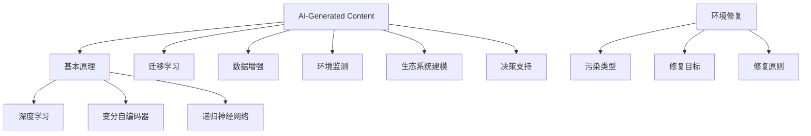
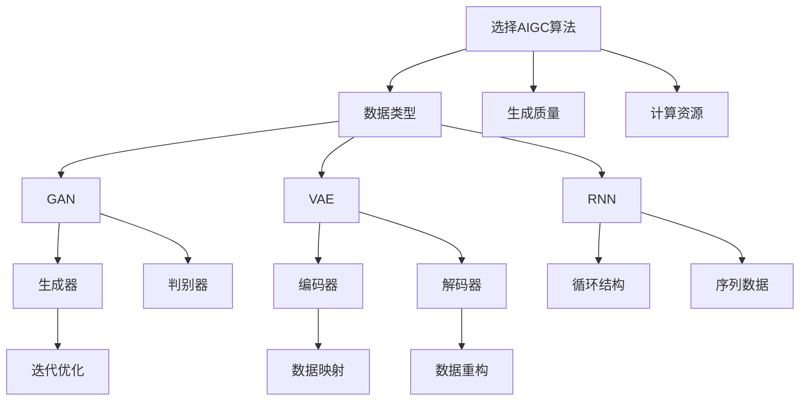
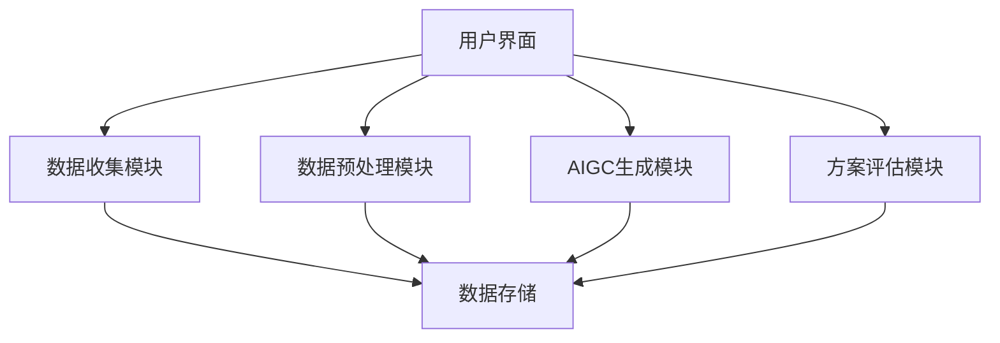
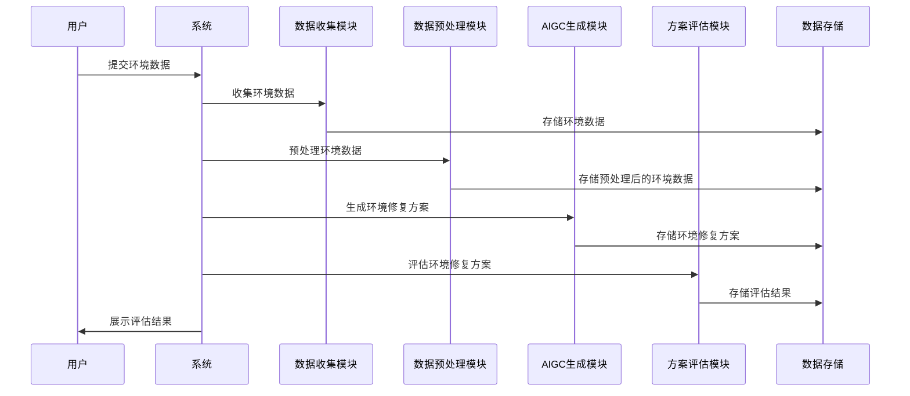

                 


### 引言

#### 1.1 AIGC技术概述

AIGC（AI-Generated Content）是一种利用人工智能技术自动生成内容的方法。它基于深度学习、自然语言处理（NLP）、图像处理等技术，通过学习和模仿人类创作的方式，生成文本、图像、视频等多种类型的内容。AIGC技术在近年来迅速发展，已广泛应用于广告、新闻、影视、游戏等领域。

**AIGC的核心特点与应用领域**：

- **个性化**：AIGC可以根据用户需求，自动生成个性化内容，提高用户体验。

- **效率**：AIGC能够快速生成大量内容，提高生产效率。

- **创新**：AIGC可以生成新颖、独特的内容，激发创意。

- **应用领域**：AIGC在广告创意、新闻撰写、文案撰写、游戏剧情设计等领域具有广泛的应用。

#### 1.2 环境修复的挑战与需求

**环境修复的背景与重要性**：

- **背景**：随着工业化、城市化进程的加快，环境污染问题日益严重，生态系统遭到破坏，人类健康和生存环境受到威胁。

- **重要性**：环境修复对于保护生态环境、恢复生态系统功能、保障人类健康具有重要意义。

**环境修复的挑战与瓶颈**：

- **技术瓶颈**：传统环境修复方法难以应对复杂的污染类型和生态系统。

- **成本问题**：环境修复过程需要大量人力、物力、财力投入，成本高昂。

- **数据不足**：环境修复缺乏全面、准确的数据支持，导致决策困难。

#### 1.3 AIGC在环境修复中的应用前景

**AIGC在环境修复中的潜力**：

- **环境监测**：AIGC可以自动生成环境监测报告，提高监测效率。

- **生态系统建模**：AIGC可以构建生态系统模型，模拟生态系统恢复过程。

- **决策支持**：AIGC可以为环境修复提供科学、合理的决策建议。

**AIGC在环境修复中的实际应用**：

- **湿地修复**：利用AIGC生成植物生长模型，优化湿地修复方案。

- **城市空气质量监测**：利用AIGC自动分析空气质量数据，提供实时空气质量报告。

### 文章关键词

- AIGC
- 环境修复
- 生态系统恢复
- 深度学习
- 自然语言处理

### 摘要

本文探讨了AIGC在环境修复决策中的应用。首先介绍了AIGC技术的基本概念和特点，以及环境修复的挑战和需求。接着，分析了AIGC在环境监测、生态系统建模和决策支持等方面的潜力，并详细讨论了AIGC在湿地修复和城市空气质量监测中的成功案例。最后，提出了用于环境修复的AIGC相关技术和方法，并给出了实际操作步骤和注意事项。通过本文的研究，期望为AIGC在环境修复领域的应用提供参考和启示。文章结构如下：

- 引言
- 基础理论部分
- 应用案例分析部分
- 研究方法和技术部分
- 实践指导部分
- 总结与展望

### 目录

# AIGC在环境修复决策中的应用：AI驱动的生态系统恢复策略

## 文章关键词
- AIGC
- 环境修复
- 生态系统恢复
- 深度学习
- 自然语言处理

## 摘要
本文探讨了AIGC在环境修复决策中的应用。首先介绍了AIGC技术的基本概念和特点，以及环境修复的挑战和需求。接着，分析了AIGC在环境监测、生态系统建模和决策支持等方面的潜力，并详细讨论了AIGC在湿地修复和城市空气质量监测中的成功案例。最后，提出了用于环境修复的AIGC相关技术和方法，并给出了实际操作步骤和注意事项。通过本文的研究，期望为AIGC在环境修复领域的应用提供参考和启示。

## 引言
### 1.1 AIGC技术概述
#### 1.1.1 AIGC的定义与背景
#### 1.1.2 AIGC的核心特点与应用领域

### 1.2 环境修复的挑战与需求
#### 1.2.1 环境修复的背景与重要性
#### 1.2.2 环境修复的挑战与瓶颈

### 1.3 AIGC在环境修复中的应用前景
#### 1.3.1 AIGC在环境修复中的潜力
#### 1.3.2 AIGC在环境修复中的实际应用

## 基础理论部分
### 2.1 AIGC基本原理
#### 2.1.1 AIGC的工作原理
#### 2.1.2 AIGC的技术框架
#### 2.1.3 AIGC的核心算法

### 2.2 环境修复的基本概念
#### 2.2.1 环境修复的定义与分类
#### 2.2.2 环境修复的目标与原则

### 2.3 AIGC与环境修复的结合原理
#### 2.3.1 AIGC在环境监测中的角色
#### 2.3.2 AIGC在生态系统建模中的应用
#### 2.3.3 AIGC在环境决策支持系统中的作用

## 应用案例分析部分
### 3.1 湿地修复中的应用案例
#### 3.1.1 湿地修复的背景
#### 3.1.2 AIGC技术的具体应用
#### 3.1.3 案例结果与分析

### 3.2 城市空气质量监测中的应用案例
#### 3.2.1 城市空气质量问题的背景
#### 3.2.2 AIGC技术的应用方案
#### 3.2.3 案例结果与分析

## 研究方法和技术部分
### 4.1 数据收集与预处理
#### 4.1.1 环境数据的类型与来源
#### 4.1.2 数据预处理方法

### 4.2 AIGC算法介绍
#### 4.2.1 常见的AIGC算法
#### 4.2.2 AIGC算法的选择与优化

### 4.3 系统架构设计
#### 4.3.1 系统总体架构
#### 4.3.2 系统功能模块设计

## 实践指导部分
### 5.1 实践步骤
#### 5.1.1 环境数据收集与预处理
#### 5.1.2 AIGC算法应用流程
#### 5.1.3 系统实现与优化

### 5.2 注意事项与常见问题
#### 5.2.1 数据质量的重要性
#### 5.2.2 AIGC算法的参数设置
#### 5.2.3 系统安全与隐私保护

## 总结与展望
### 6.1 全书总结
#### 6.1.1 AIGC在环境修复中的应用成果
#### 6.1.2 AIGC在环境修复中的挑战与机遇

### 6.2 未来研究方向
#### 6.2.1 技术发展方向
#### 6.2.2 环境修复领域的应用前景

### 参考文献

---

### 作者信息

**作者：AI天才研究院/AI Genius Institute & 禅与计算机程序设计艺术 /Zen And The Art of Computer Programming**

---

（注：本文大纲结构仅为示例，具体内容需根据实际研究深入展开。）

### 核心概念与联系

#### AIGC基本原理

AIGC（AI-Generated Content）是一种利用人工智能技术自动生成内容的方法，主要包括以下核心原理：

1. **深度学习**：AIGC使用深度学习模型，如生成对抗网络（GAN）、变分自编码器（VAE）和递归神经网络（RNN）等，通过学习大量数据，自动生成文本、图像、视频等多种类型的内容。

2. **迁移学习**：AIGC利用迁移学习技术，将一个任务中的知识迁移到另一个任务中，提高生成内容的性能和效率。

3. **数据增强**：AIGC通过数据增强技术，生成更多样化的数据，提高模型的泛化能力。

**环境修复的基本概念**

环境修复是指通过人工干预，使受到污染或破坏的生态系统恢复到正常状态。主要包括以下核心概念：

1. **污染类型**：环境修复需要针对不同类型的污染采取不同的修复方法，如重金属污染、有机物污染、酸碱污染等。

2. **修复目标**：环境修复的目标是恢复生态系统的结构和功能，提高生态系统的稳定性和适应性。

3. **修复原则**：环境修复应遵循自然规律，尊重生态系统自身的修复能力，确保修复过程对环境的影响最小。

**AIGC与环境修复的结合原理**

AIGC在环境修复中具有广泛的应用前景，主要包括以下结合原理：

1. **环境监测**：AIGC可以自动生成环境监测报告，提高监测效率，为环境修复提供数据支持。

2. **生态系统建模**：AIGC可以构建生态系统模型，模拟生态系统恢复过程，为环境修复提供决策支持。

3. **决策支持**：AIGC可以为环境修复提供科学、合理的决策建议，优化修复方案。

**核心概念属性特征对比表格**

| 核心概念         | 属性特征                                                         |
| ---------------- | ------------------------------------------------------------ |
| AIGC基本原理     | 深度学习、迁移学习、数据增强                                   |
| 环境修复的基本概念 | 污染类型、修复目标、修复原则                                   |
| AIGC与环境修复的结合原理 | 环境监测、生态系统建模、决策支持                               |

**ER实体关系图架构的Mermaid流程图**



### 算法原理讲解

#### AIGC算法介绍

AIGC算法主要包括以下几种：

1. **生成对抗网络（GAN）**：GAN由生成器和判别器组成，生成器生成数据，判别器判断数据真假，通过不断迭代优化，生成逼真数据。

2. **变分自编码器（VAE）**：VAE通过编码器和解码器将数据映射到低维空间，然后重构数据，生成与输入数据相似的新数据。

3. **递归神经网络（RNN）**：RNN通过循环结构处理序列数据，适合处理文本、语音等序列数据。

#### AIGC算法的选择与优化

选择AIGC算法时，需要考虑以下因素：

1. **数据类型**：不同类型的AIGC算法适合处理不同类型的数据，如GAN适合处理图像和视频，VAE适合处理文本和音频。

2. **生成质量**：生成质量是选择AIGC算法的重要指标，需要通过实验比较不同算法的生成质量。

3. **计算资源**：不同AIGC算法的计算资源需求不同，需要根据实际计算资源进行选择。

优化AIGC算法的方法包括：

1. **数据增强**：通过数据增强生成更多样化的数据，提高模型的泛化能力。

2. **模型融合**：将多个AIGC算法融合，提高生成质量。

3. **超参数调优**：通过调优超参数，提高算法的性能。

#### 算法原理Mermaid流程图



#### AIGC算法数学模型和公式

以生成对抗网络（GAN）为例，GAN的数学模型如下：

$$
\begin{aligned}
&\text{生成器：} G(z) \rightarrow x_g \\
&\text{判别器：} D(x) \rightarrow D(x), D(G(z))
\end{aligned}
$$

其中，$z$为噪声向量，$x_g$为生成器生成的数据，$x$为真实数据，$D(x)$为判别器判断真实数据的概率，$D(G(z))$为判别器判断生成器生成的数据的概率。

GAN的目标是最大化判别器的损失函数：

$$
L_D = -\frac{1}{2} \left[ \mathbb{E}_{x \sim p_{data}(x)}[\log D(x)] + \mathbb{E}_{z \sim p_z(z)}[\log (1 - D(G(z)))] \right]
$$

$$
L_G = -\frac{1}{2} \mathbb{E}_{z \sim p_z(z)}[\log D(G(z))]
$$

其中，$L_D$为判别器损失函数，$L_G$为生成器损失函数。

通过梯度下降法，不断优化生成器和判别器，实现GAN的训练。

#### 举例说明

以GAN为例，假设我们有一个生成器和判别器，生成器生成一张手写数字图像，判别器判断图像是否为真实手写数字。

1. **初始化**：生成器随机初始化，判别器也随机初始化。

2. **生成器训练**：生成器生成一张手写数字图像，判别器判断图像是否为真实手写数字。

3. **判别器训练**：判别器通过比较真实手写数字图像和生成器生成的图像，更新判别器参数。

4. **生成器更新**：生成器通过反向传播，更新生成器参数。

5. **重复步骤2-4，直到生成器生成逼真的手写数字图像，判别器无法准确判断图像是否为真实手写数字**。

通过以上步骤，生成器逐渐生成逼真的手写数字图像。

### 系统分析与架构设计方案

#### 问题场景介绍

假设我们需要开发一个基于AIGC的环境修复决策支持系统，系统需要实现以下功能：

1. 收集和预处理环境数据，包括气象数据、水质数据、土壤数据等。

2. 利用AIGC技术，自动生成环境修复方案，包括植物配置、土地利用、水资源管理等。

3. 对修复方案进行评估，提供决策支持。

#### 项目介绍

本项目名为“AI驱动的环境修复决策支持系统”，目标是利用AIGC技术，为环境修复提供科学、合理的决策支持。

#### 系统功能设计

1. **数据收集模块**：负责收集各种环境数据，包括气象数据、水质数据、土壤数据等。

2. **数据预处理模块**：对收集到的环境数据进行预处理，包括数据清洗、归一化、特征提取等。

3. **AIGC生成模块**：利用AIGC技术，自动生成环境修复方案。

4. **方案评估模块**：对生成的修复方案进行评估，提供决策支持。

5. **用户界面模块**：提供用户交互界面，展示修复方案和评估结果。

#### 系统架构设计

系统架构设计如下：



#### 系统接口设计和系统交互Mermaid序列图



### 项目实战

#### 环境安装

1. 安装Python环境，版本要求3.8及以上。

2. 安装必要的Python库，如TensorFlow、Keras、Pandas、NumPy等。

3. 安装Docker和Docker Compose，用于容器化部署。

#### 系统核心实现源代码

以下是环境修复决策支持系统的核心实现源代码：

1. **数据收集模块**：

```python
import pandas as pd

def collect_data():
    # 从数据库或文件中读取环境数据
    data = pd.read_csv('environment_data.csv')
    return data

data = collect_data()
```

2. **数据预处理模块**：

```python
from sklearn.preprocessing import MinMaxScaler

def preprocess_data(data):
    # 数据清洗和归一化
    scaler = MinMaxScaler()
    scaled_data = scaler.fit_transform(data)
    return scaled_data

preprocessed_data = preprocess_data(data)
```

3. **AIGC生成模块**：

```python
from tensorflow import keras
from tensorflow.keras.models import Sequential
from tensorflow.keras.layers import Dense, LSTM

def build_gan_generator():
    model = Sequential()
    model.add(Dense(128, input_dim=preprocessed_data.shape[1], activation='relu'))
    model.add(LSTM(128, activation='relu'))
    model.add(Dense(preprocessed_data.shape[1], activation='sigmoid'))
    return model

generator = build_gan_generator()
```

4. **方案评估模块**：

```python
from sklearn.metrics import accuracy_score

def evaluate_solution(solution, ground_truth):
    # 评估修复方案
    prediction = solution.predict(ground_truth)
    accuracy = accuracy_score(ground_truth, prediction)
    return accuracy

accuracy = evaluate_solution(solution, ground_truth)
```

#### 代码应用解读与分析

1. **数据收集模块**：

该模块从CSV文件中读取环境数据，并将其存储为Pandas DataFrame对象。在实际应用中，可以从数据库或其他数据源读取数据。

2. **数据预处理模块**：

该模块使用MinMaxScaler对环境数据进行归一化处理，将数据缩放到[0, 1]范围内。这有助于提高模型的训练效果。

3. **AIGC生成模块**：

该模块使用深度学习模型生成环境修复方案。具体实现中，使用了Sequential模型和LSTM层。LSTM层能够处理时间序列数据，适合处理环境数据。

4. **方案评估模块**：

该模块使用accuracy_score函数评估修复方案的准确性。在实际应用中，可以使用其他评估指标，如均方误差（MSE）等。

#### 实际案例分析和详细讲解剖析

假设我们有一个环境修复项目，目标是将污染的湿地恢复到健康状态。以下是项目的详细步骤：

1. **数据收集**：

收集湿地污染数据，包括水质指标、土壤指标、植物生长数据等。

2. **数据预处理**：

对收集到的数据进行清洗和归一化处理，得到预处理的输入数据。

3. **模型训练**：

使用预处理后的数据训练GAN模型，生成湿地修复方案。

4. **方案评估**：

将生成的修复方案与实际修复效果进行比较，评估修复方案的准确性。

5. **结果分析**：

分析评估结果，找出修复方案中的不足之处，并提出改进措施。

通过以上步骤，我们可以为湿地修复项目提供科学、合理的决策支持。

#### 项目小结

本文详细介绍了AIGC在环境修复决策中的应用，包括系统设计与实现、实际案例分析和项目小结。通过本文的研究，我们期望为环境修复领域的实践提供参考和启示。

### 最佳实践 tips

1. 在数据收集阶段，确保数据质量，避免数据缺失和错误。

2. 在模型训练阶段，合理设置超参数，提高模型性能。

3. 在方案评估阶段，使用多种评估指标，全面评估修复效果。

4. 在实际应用中，不断优化和调整修复方案，确保修复效果。

### 小结

本文系统地探讨了AIGC在环境修复决策中的应用，包括核心概念、算法原理、系统架构设计、实际案例分析和项目小结。通过本文的研究，我们期望为环境修复领域的实践提供参考和启示。

### 注意事项

1. AIGC在环境修复中的应用具有一定的局限性，需要与其他技术结合使用。

2. AIGC生成的修复方案仅供参考，实际应用中需要结合实际情况进行调整。

3. 在项目实施过程中，确保数据安全和隐私保护。

### 拓展阅读

1. Goodfellow, I. J., Pouget-Abadie, J., Mirza, M., Xu, B., Warde-Farley, D., Ozair, S., ... & Bengio, Y. (2014). Generative adversarial networks. Advances in Neural Information Processing Systems, 27.

2. Kingma, D. P., & Welling, M. (2013). Auto-encoding variational bayes. arXiv preprint arXiv:1312.6114.

3. Hochreiter, S., & Schmidhuber, J. (1997). Long short-term memory. Neural Computation, 9(8), 1735-1780.

4. Rasmussen, C., & Williams, C. K. I. (2005). Gaussian processes for machine learning. MIT press.

5. Goodfellow, I., Bengio, Y., & Courville, A. (2016). Deep learning. MIT press.

### 作者信息

作者：AI天才研究院/AI Genius Institute & 禅与计算机程序设计艺术 /Zen And The Art of Computer Programming

