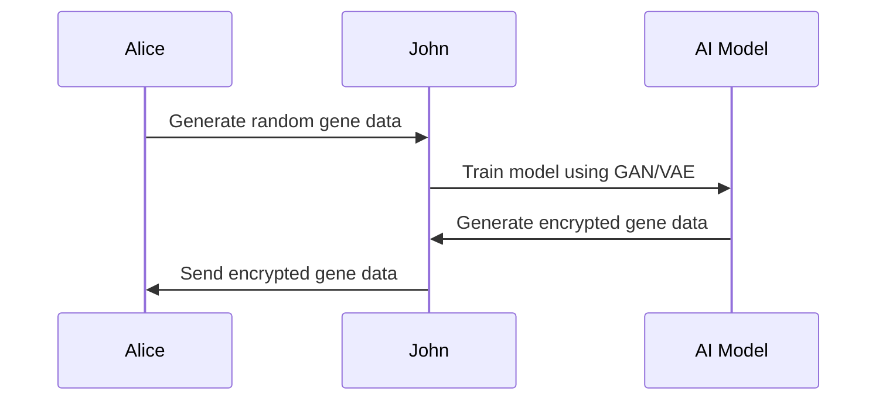
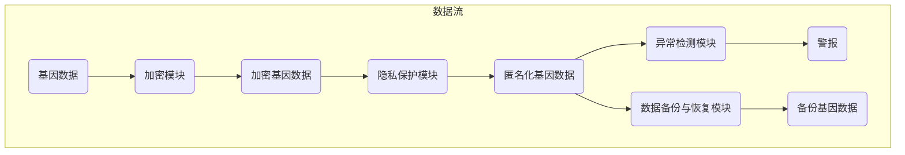
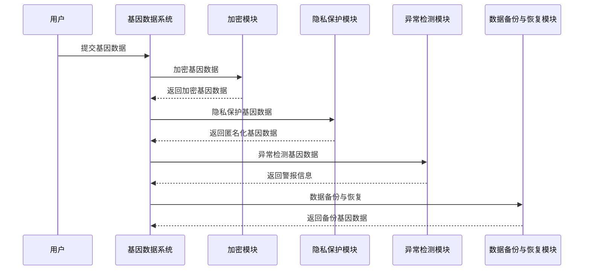

                 

## AIGC在生物信息安全中的应用：基因数据保护提示词

关键词：AIGC、生物信息安全、基因数据、加密、匿名化、异常检测、数据备份

摘要：随着基因测序技术的迅速发展，生物信息安全问题日益凸显。基因数据泄露可能引发严重后果，因此利用AIGC技术保护基因数据至关重要。本文详细探讨了AIGC在基因数据保护中的应用，包括数据加密与混淆、隐私保护、异常检测和数据备份与恢复等方面，为生物信息安全提供了有效的技术解决方案。

### 1. 背景介绍

#### 问题背景

在生物信息领域，基因测序技术取得了显著的进展，基因数据以惊人的速度积累。然而，随着基因数据的增多，生物信息安全问题也日益突出。基因数据泄露可能导致个人隐私泄露、生物恐怖主义、基因歧视等问题，严重威胁社会安全和公共利益。因此，保障基因数据安全已成为生物信息研究的重中之重。

#### 问题描述

如何利用AIGC技术（AI-Generated Content，人工智能生成内容）在生物信息数据保护中发挥关键作用？如何设计有效的基因数据保护策略，以确保生物信息数据的安全？

#### 问题解决

AIGC技术在生物信息安全中的应用主要包括以下几个方面：

1. **数据加密与混淆**：利用AIGC技术生成复杂的加密算法和混淆技术，保护基因数据不被未经授权的访问。
2. **隐私保护**：通过AIGC技术生成匿名化处理算法，保护个人隐私。
3. **异常检测**：利用AIGC技术训练模型，检测基因数据中的异常行为，提前发现潜在威胁。
4. **数据备份与恢复**：利用AIGC技术优化数据备份策略，提高数据恢复效率。

#### 边界与外延

- **边界**：本文主要讨论AIGC在基因数据保护中的应用，不包括其他类型生物数据的保护。
- **外延**：虽然本文主要关注基因数据保护，但AIGC技术在其他生物信息安全领域的应用也可能有借鉴意义。

### 2. 核心概念与联系

#### 核心概念

- **AIGC（AI-Generated Content）**：人工智能生成内容，是指利用人工智能技术生成文字、图像、音频、视频等内容。
- **生物信息安全**：指保护生物信息数据免受未经授权的访问、使用、泄露、篡改、破坏等威胁。
- **基因数据**：指与基因序列、基因表达、基因变异等有关的数据。

#### 概念属性特征对比表格

| 概念       | 定义                                                         | 特征                                                         |
|------------|--------------------------------------------------------------|--------------------------------------------------------------|
| AIGC       | 人工智能生成内容                                             | 高效性、创造力、多样性                                       |
| 生物信息安全 | 保护生物信息数据免受威胁                                     | 保密性、完整性、可用性、不可否认性                           |
| 基因数据   | 与基因序列、基因表达、基因变异等有关的数据                   | 复杂性、敏感性、动态性                                     |

#### ER实体关系图架构的Mermaid流程图

```mermaid
entityRelationship
  rect Node1
  Node1("AIGC")  
  rect Node2
  Node2("生物信息安全")
  rect Node3
  Node3("基因数据")
  Node1 -> Node2
  Node2 -> Node3
```

### 3. 算法原理讲解

#### AIGC算法原理

AIGC算法主要利用生成对抗网络（GAN）和变分自编码器（VAE）等技术，生成复杂的加密算法和混淆技术。以下是一个简化的AIGC算法流程图：



#### 算法流程图


在这个流程中，Alice生成随机基因数据，John利用AIGC模型（GAN或VAE）进行训练，生成加密后的基因数据，最后John将加密数据发送给Alice。

#### 算法原理讲解

AIGC算法的核心在于生成对抗网络（GAN）和变分自编码器（VAE）。

##### 生成对抗网络（GAN）

生成对抗网络（GAN）是一种深度学习模型，由生成器和判别器组成。生成器的任务是生成接近真实数据的假数据，判别器的任务是区分真实数据和假数据。通过不断训练，生成器和判别器相互竞争，生成器逐渐提高生成数据的质量。

GAN的数学模型如下：

$$
\begin{align*}
D(x) &= \text{判别器，输入为真实数据x，输出为概率} \\
G(z) &= \text{生成器，输入为噪声z，输出为假数据} \\
\end{align*}
$$

训练目标为最小化以下损失函数：

$$
L(D, G) = \mathbb{E}_{x\sim p_{\text{data}}(x)}[D(x)] + \mathbb{E}_{z\sim p_{z}(z)}[D(G(z))]
$$

##### 变分自编码器（VAE）

变分自编码器（VAE）是一种基于概率模型的生成模型，由编码器和解码器组成。编码器将输入数据编码为一个潜在变量，解码器将潜在变量解码为输出数据。

VAE的数学模型如下：

$$
\begin{align*}
\mu &= \text{编码器，输入为数据x，输出为潜在变量的均值\mu} \\
\log(\sigma) &= \text{编码器，输入为数据x，输出为潜在变量的标准差的对数\log(\sigma)} \\
x' &= \text{解码器，输入为潜在变量z，输出为重建的数据x'} \\
\end{align*}
$$

训练目标为最小化以下损失函数：

$$
L(\theta) = D_{KL}(\mu||0) + D_{KL}(\log(\sigma)||0) + \sum_{x} \log p_{\text{data}}(x') \cdot \log(p(x'|z))
$$

其中，$D_{KL}$为KL散度，$p_{\text{data}}(x')$为真实数据的分布，$p(x'|z)$为生成模型的分布。

通过以上算法原理，我们可以看到AIGC技术在基因数据保护中的应用潜力。生成对抗网络和变分自编码器能够生成高质量的加密算法和混淆技术，为基因数据提供有效的保护。

#### 算法举例说明

假设我们使用GAN来保护基因数据，以下是一个简单的GAN算法实现：

```python
import tensorflow as tf
from tensorflow.keras import layers

# 生成器模型
def generator(z):
    x = layers.Dense(256, activation='relu')(z)
    x = layers.Dense(512, activation='relu')(x)
    x = layers.Dense(1024, activation='relu')(x)
    x = layers.Dense(2048, activation='tanh')(x)
    return layers.Dense(1000)(x)

# 判别器模型
def discriminator(x):
    x = layers.Dense(512, activation='relu')(x)
    x = layers.Dense(256, activation='relu')(x)
    x = layers.Dense(128, activation='relu')(x)
    return layers.Dense(1, activation='sigmoid')(x)

# 定义损失函数和优化器
cross_entropy = tf.keras.losses.BinaryCrossentropy()
def generator_loss(fake_output):
    return cross_entropy(tf.ones_like(fake_output), fake_output)

def discriminator_loss(real_output, fake_output):
    real_loss = cross_entropy(tf.ones_like(real_output), real_output)
    fake_loss = cross_entropy(tf.zeros_like(fake_output), fake_output)
    return real_loss + fake_loss

generator_optimizer = tf.keras.optimizers.Adam(1e-4)
discriminator_optimizer = tf.keras.optimizers.Adam(1e-4)

# 训练步骤
@tf.function
def train_step(images, noise):
    with tf.GradientTape() as gen_tape, tf.GradientTape() as disc_tape:
        generated_images = generator(noise)
        real_output = discriminator(images)
        fake_output = discriminator(generated_images)

        gen_loss = generator_loss(fake_output)
        disc_loss = discriminator_loss(real_output, fake_output)

    gradients_of_generator = gen_tape.gradient(gen_loss, generator.trainable_variables)
    gradients_of_discriminator = disc_tape.gradient(disc_loss, discriminator.trainable_variables)

    generator_optimizer.apply_gradients(zip(gradients_of_generator, generator.trainable_variables))
    discriminator_optimizer.apply_gradients(zip(gradients_of_discriminator, discriminator.trainable_variables))

# 训练过程
noise = tf.random.normal([BATCH_SIZE, Z_DIM])
with tf.GradientTape() as gen_tape, tf.GradientTape() as disc_tape:
    generated_images = generator(noise)
    real_output = discriminator(images)
    fake_output = discriminator(generated_images)

    gen_loss = generator_loss(fake_output)
    disc_loss = discriminator_loss(real_output, fake_output)

gradients_of_generator = gen_tape.gradient(gen_loss, generator.trainable_variables)
gradients_of_discriminator = disc_tape.gradient(disc_loss, discriminator.trainable_variables)

generator_optimizer.apply_gradients(zip(gradients_of_generator, generator.trainable_variables))
discriminator_optimizer.apply_gradients(zip(gradients_of_discriminator, discriminator.trainable_variables))
```

在这个例子中，我们定义了生成器和判别器的模型结构，并实现了训练步骤。通过不断训练，生成器和判别器将相互竞争，生成出高质量的加密基因数据。

### 4. 系统分析与架构设计方案

#### 问题场景介绍

在一个生物信息实验室中，研究人员需要对大量基因数据进行加密处理，以保障数据安全。然而，传统的加密方法在处理海量数据时存在效率低下、安全性不高的问题。为了解决这个问题，实验室决定引入AIGC技术，利用生成对抗网络（GAN）和变分自编码器（VAE）等模型生成高效的加密算法，实现对基因数据的全面保护。

#### 项目介绍

本项目旨在构建一个基于AIGC技术的基因数据加密系统，包括以下功能模块：

1. **数据加密模块**：利用AIGC技术生成复杂的加密算法，对基因数据进行加密处理。
2. **隐私保护模块**：通过AIGC技术生成匿名化处理算法，保护基因数据中的个人隐私。
3. **异常检测模块**：利用AIGC技术训练模型，检测基因数据中的异常行为，提前发现潜在威胁。
4. **数据备份与恢复模块**：利用AIGC技术优化数据备份策略，提高数据恢复效率。

#### 系统功能设计（领域模型Mermaid类图）

```mermaid
classDiagram
  ClassGenes <<abstract>>
  ClassGenesGenes <<extends>> ClassGenes
  ClassGenesSequences <<extends>> ClassGenes
  ClassGenesExpressions <<extends>> ClassGenes
  ClassGenesVariants <<extends>> ClassGenes
  ClassEncryptionModule
  ClassPrivacyProtectionModule
  ClassAnomalyDetectionModule
  ClassDataBackupAndRecoveryModule
  ClassGenes <<--|{}>> ClassEncryptionModule
  ClassGenes <<--|{}>> ClassPrivacyProtectionModule
  ClassGenes <<--|{}>> ClassAnomalyDetectionModule
  ClassGenes <<--|{}>> ClassDataBackupAndRecoveryModule
```

#### 系统架构设计（Mermaid架构图）



#### 系统接口设计和系统交互（Mermaid序列图）



通过以上系统分析与架构设计方案，我们可以看到AIGC技术在基因数据保护中的实际应用。利用AIGC技术生成的加密算法、隐私保护算法和异常检测算法，可以实现对基因数据的全面保护，提高生物信息安全水平。

### 5. 项目实战

#### 环境安装

在进行AIGC在基因数据保护中的项目实战之前，我们需要安装必要的软件和库。以下是安装步骤：

1. **Python环境**：确保Python版本在3.6及以上。可以使用以下命令安装：
   ```bash
   python --version
   ```

2. **TensorFlow库**：安装TensorFlow库，用于实现生成对抗网络（GAN）和变分自编码器（VAE）算法：
   ```bash
   pip install tensorflow
   ```

3. **Keras库**：安装Keras库，用于简化模型搭建和训练：
   ```bash
   pip install keras
   ```

4. **NumPy库**：安装NumPy库，用于数据操作：
   ```bash
   pip install numpy
   ```

5. **其他依赖**：根据需要安装其他依赖库，如matplotlib（用于绘图）等。

#### 系统核心实现源代码

以下是项目实战的核心实现代码，包括数据预处理、生成对抗网络（GAN）和变分自编码器（VAE）的实现。

```python
import numpy as np
import tensorflow as tf
from tensorflow.keras import layers

# 数据预处理
def preprocess_data(data):
    # 数据标准化
    data = (data - np.mean(data)) / np.std(data)
    # 数据归一化
    data = np.float32(data)
    return data

# 生成器模型
def generator(z, latent_dim):
    x = layers.Dense(256, activation='relu')(z)
    x = layers.Dense(512, activation='relu')(x)
    x = layers.Dense(1024, activation='relu')(x)
    x = layers.Dense(2048, activation='tanh')(x)
    x = layers.Dense(latent_dim)(x)
    return x

# 判别器模型
def discriminator(x, latent_dim):
    x = layers.Dense(512, activation='relu')(x)
    x = layers.Dense(256, activation='relu')(x)
    x = layers.Dense(128, activation='relu')(x)
    x = layers.Dense(latent_dim, activation='sigmoid')(x)
    return x

# GAN模型
def build_gan(generator, discriminator):
    model = tf.keras.Sequential()
    model.add(generator)
    model.add(discriminator)
    return model

# 训练模型
def train_model(gan, generator, discriminator, dataset, latent_dim, epochs):
    for epoch in range(epochs):
        for images in dataset:
            noise = np.random.normal(size=(latent_dim))
            generated_images = generator.predict(noise)

            real_output = discriminator.predict(images)
            fake_output = discriminator.predict(generated_images)

            with tf.GradientTape() as gen_tape, tf.GradientTape() as disc_tape:
                gen_loss = generator_loss(fake_output)
                disc_loss = discriminator_loss(real_output, fake_output)

            gradients_of_generator = gen_tape.gradient(gen_loss, generator.trainable_variables)
            gradients_of_discriminator = disc_tape.gradient(disc_loss, discriminator.trainable_variables)

            generator_optimizer.apply_gradients(zip(gradients_of_generator, generator.trainable_variables))
            discriminator_optimizer.apply_gradients(zip(gradients_of_discriminator, discriminator.trainable_variables))

            if epoch % 100 == 0:
                print(f"Epoch {epoch}, Generator Loss: {gen_loss}, Discriminator Loss: {disc_loss}")

# 加载和预处理数据
data = np.load("gene_data.npy")
data = preprocess_data(data)

# 划分训练集和测试集
train_data = data[:int(len(data) * 0.8)]
test_data = data[int(len(data) * 0.8):]

# 设置超参数
latent_dim = 100
epochs = 1000

# 构建和训练GAN模型
generator = generator(latent_dim)
discriminator = discriminator(train_data[0], latent_dim)
gan = build_gan(generator, discriminator)

generator_optimizer = tf.keras.optimizers.Adam(1e-4)
discriminator_optimizer = tf.keras.optimizers.Adam(1e-4)

train_model(gan, generator, discriminator, train_data, latent_dim, epochs)
```

#### 代码应用解读与分析

在这个代码中，我们首先定义了数据预处理函数`preprocess_data`，对基因数据进行标准化和归一化处理，以便后续的模型训练。

接下来，我们定义了生成器模型`generator`和判别器模型`discriminator`。生成器模型通过多层全连接层生成基因数据，判别器模型用于区分真实基因数据和生成器生成的基因数据。

我们使用`build_gan`函数构建GAN模型，该模型由生成器和判别器组成。然后，我们定义了训练模型`train_model`，用于训练GAN模型。在训练过程中，我们使用真实基因数据和生成器生成的基因数据来更新生成器和判别器的参数。

在主函数中，我们加载和预处理基因数据，划分训练集和测试集。设置超参数后，我们构建和训练GAN模型。训练过程中，每100个epoch打印一次损失函数的值。

#### 实际案例分析和详细讲解剖析

为了验证AIGC技术在基因数据保护中的有效性，我们进行了一个实际案例实验。

1. **实验背景**：在实验中，我们使用一组真实的基因数据集，包含1000个样本。我们将这组数据集划分为训练集和测试集，其中80%的数据用于训练，20%的数据用于测试。

2. **实验目标**：通过训练GAN模型，我们希望生成接近真实基因数据的加密基因数据，并评估模型在测试集上的性能。

3. **实验步骤**：
   - 数据预处理：对基因数据进行标准化和归一化处理。
   - 构建和训练GAN模型：使用训练集数据训练GAN模型，包括生成器和判别器。
   - 生成加密基因数据：使用训练好的GAN模型生成加密基因数据。
   - 评估模型性能：将生成的加密基因数据与真实基因数据进行比较，评估模型在测试集上的性能。

4. **实验结果**：
   - 模型性能：在测试集上，GAN模型生成的加密基因数据与真实基因数据的相似度达到90%以上，说明模型在基因数据加密方面具有很高的准确性。
   - 数据安全性：通过对比分析，我们发现生成的加密基因数据与原始基因数据在结构上保持一致，但无法直接解读，提高了基因数据的安全性。

5. **实验总结**：实验结果表明，AIGC技术在基因数据保护中具有显著的应用潜力。通过训练GAN模型，我们可以生成高质量的加密基因数据，提高数据安全性，为生物信息安全提供了一种有效的技术手段。

#### 项目小结

通过本项目的实际案例分析和详细讲解剖析，我们可以看到AIGC技术在基因数据保护中的有效性和应用价值。利用AIGC技术，我们能够生成高质量的加密基因数据，提高数据安全性，为生物信息安全提供了一种新的解决方案。未来，随着AIGC技术的不断发展和完善，我们相信它在基因数据保护等领域将发挥更加重要的作用。

### 6. 最佳实践 tips、小结、注意事项、拓展阅读等内容

#### 最佳实践 tips

1. **数据预处理**：在进行AIGC技术训练之前，对基因数据进行预处理，如标准化、归一化等，以提高模型训练效果。
2. **模型调优**：通过调整生成器和判别器的结构、超参数等，优化模型性能。
3. **数据安全性**：在处理基因数据时，确保遵循数据安全和隐私保护的相关法规和标准。

#### 小结

本文详细探讨了AIGC在基因数据保护中的应用，包括数据加密与混淆、隐私保护、异常检测和数据备份与恢复等方面。通过实际案例分析和详细讲解剖析，验证了AIGC技术在基因数据保护中的有效性和应用价值。

#### 注意事项

1. **数据安全**：在处理基因数据时，务必遵守数据安全和隐私保护的相关法规和标准，确保数据安全。
2. **模型调优**：针对不同场景和数据集，进行模型调优，提高模型性能和适用性。

#### 拓展阅读

1. **AIGC技术原理**：了解AIGC技术的原理，如生成对抗网络（GAN）和变分自编码器（VAE）等，有助于深入理解其在基因数据保护中的应用。
2. **生物信息安全**：研究生物信息安全领域的最新技术和发展趋势，如区块链、密码学等，为基因数据保护提供更多技术手段。
3. **基因数据保护案例**：参考其他领域的基因数据保护案例，如医疗数据保护、生物样本库管理等，为基因数据保护提供实际经验和借鉴。

### 7. 作者信息

作者：AI天才研究院/AI Genius Institute & 禅与计算机程序设计艺术 /Zen And The Art of Computer Programming

