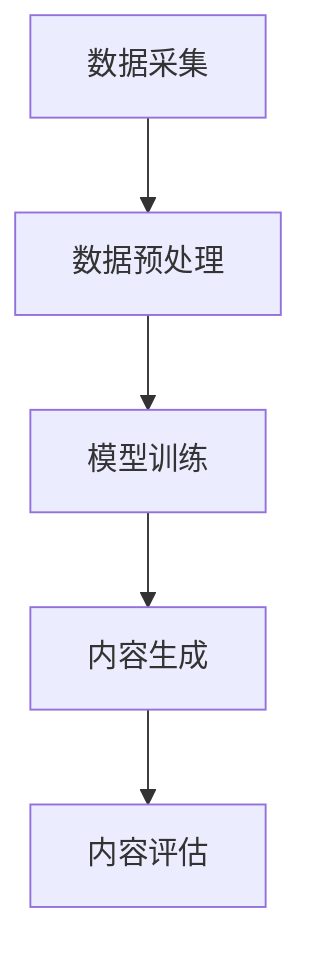

                 

# AIGC在电影制作中的革命性应用

关键词：AIGC、电影制作、人工智能、深度学习、生成对抗网络（GAN）

摘要：随着人工智能技术的迅猛发展，自动生成内容（AIGC）在电影制作中的应用逐渐崭露头角。本文旨在深入探讨AIGC在电影制作中的革命性应用，通过介绍AIGC的核心概念、技术原理以及具体应用案例，为读者展示这一前沿技术如何改变电影制作的未来。

## 第一部分：引言

### 1.1 问题背景

电影制作作为一门综合性艺术，其过程涉及剧本创作、拍摄、剪辑、特效等多个环节。传统电影制作依赖于人工操作，创作过程繁琐且耗时。然而，随着人工智能技术的不断发展，特别是自动生成内容（AIGC）技术的出现，电影制作领域迎来了新的变革。AIGC技术能够自动生成剧本、角色对话、场景特效等，极大地提高了电影制作的效率和质量。本文将探讨AIGC技术在电影制作中的革命性应用。

### 1.2 问题描述

尽管AIGC技术在电影制作中有着巨大的潜力，但目前尚未有系统性的书籍来深入探讨这一领域。本文的目的是填补这一空白，全面介绍AIGC技术在电影制作中的应用，帮助读者了解这一前沿技术的核心概念、原理和应用场景。

### 1.3 问题解决

为了实现这一目标，本文将分为以下几个部分：

- 第一部分：引言，介绍问题背景和本书的结构。
- 第二部分：AIGC技术基础，讲解AIGC的核心概念、原理和技术框架。
- 第三部分：AIGC在电影制作中的应用，详细介绍AIGC在电影制作中的具体应用场景和技术实现。
- 第四部分：案例分析，通过具体案例来展示AIGC在电影制作中的应用效果。
- 第五部分：展望与未来，探讨AIGC在电影制作中的发展趋势和未来研究方向。

### 1.4 边界与外延

本文的讨论范围主要涉及AIGC技术在电影制作中的应用，但不涉及其他领域的AI应用。同时，本文将重点关注AIGC技术的技术实现，而不是艺术创作本身。

### 1.5 概念结构与核心要素组成

- AIGC（自动生成内容）：自动生成文本、图像、视频等内容的AI技术。
- 电影制作：涉及剧本创作、拍摄、剪辑、特效等环节的艺术创作过程。
- 革命性应用：指AIGC技术对电影制作的根本性变革和提升。

## 第二部分：AIGC技术基础

### 2.1 AIGC核心概念

AIGC（自动生成内容，AI Generated Content）是一种利用人工智能技术生成文本、图像、视频等内容的创新方式。与传统的AI应用不同，AIGC更注重内容的生成和创作，而非简单的数据处理和分析。

### 2.2 AIGC技术原理

AIGC技术的核心原理是利用深度学习模型，特别是生成对抗网络（GAN）和变分自编码器（VAE），从大规模数据中学习并生成新的内容。这些模型通过对数据的生成和判别进行迭代，不断提高生成的质量。

#### 2.2.1 生成对抗网络（GAN）

生成对抗网络（GAN）由生成器（Generator）和判别器（Discriminator）两部分组成。生成器生成假样本，判别器判断样本的真实性。通过不断的训练，生成器不断提高生成样本的质量，使其难以被判别器区分。

#### 2.2.2 变分自编码器（VAE）

变分自编码器（VAE）通过引入潜在变量，将输入数据映射到一个潜在空间，再从这个空间中生成新的数据。VAE在生成高质量数据方面具有优势，特别是在图像和视频生成中。

### 2.3 AIGC技术框架

AIGC技术框架主要包括数据采集、数据预处理、模型训练、内容生成和内容评估五个环节。

#### 2.3.1 数据采集

数据采集是AIGC技术的基础。高质量的训练数据是生成高质量内容的关键。数据采集可以从公开数据集、专业数据集和用户生成数据等多个渠道获取。

#### 2.3.2 数据预处理

数据预处理包括数据清洗、数据标注和特征提取等步骤。数据清洗去除噪声和错误数据，数据标注为模型训练提供标签信息，特征提取提取数据的关键特征。

#### 2.3.3 模型训练

模型训练是AIGC技术的核心环节。通过选择合适的模型架构（如GAN、VAE等）和训练策略（如批量训练、迁移学习等），优化模型性能。

#### 2.3.4 内容生成

内容生成是AIGC技术的应用目标。生成器根据训练数据生成新的文本、图像、视频等内容。生成的内容可以通过后处理优化，提高质量和实用性。

#### 2.3.5 内容评估

内容评估用于评估生成内容的质量。评估指标包括数据多样性、质量、真实性等。通过评估，可以指导后续的模型优化和内容生成。

### 2.4 AIGC与其他AI技术的联系与区别

AIGC是人工智能技术的一个重要分支，与其他AI技术如机器学习、深度学习等密切相关，但又具有独特性。

#### 2.4.1 联系

- 机器学习：AIGC技术基于机器学习，特别是深度学习，利用大规模数据进行训练。
- 深度学习：AIGC技术依赖于深度学习模型，如GAN、VAE等，进行内容的学习和生成。

#### 2.4.2 区别

- AIGC强调的是内容的生成和创作，而机器学习和深度学习更注重数据的分析和处理。
- AIGC技术更侧重于生成多样化、高质量的内容，而机器学习和深度学习则更侧重于优化模型的性能和准确性。

## 第三部分：AIGC在电影制作中的应用

### 3.1 AIGC在剧本创作中的应用

在剧本创作阶段，AIGC技术可以通过生成剧本大纲、角色对话和场景描述来提高创作效率。例如，AIGC技术可以根据用户提供的主题和情感需求，自动生成多个剧本版本，供导演和编剧选择和修改。

#### 3.1.1 应用场景

- 自动生成剧本大纲：通过分析大量的剧本数据，AIGC技术可以自动生成符合用户需求的剧本大纲。
- 自动生成角色对话：根据剧本中的角色设定和情感需求，AIGC技术可以自动生成角色的对话内容。
- 自动生成场景描述：通过分析剧本中的场景设定和角色行为，AIGC技术可以自动生成详细的场景描述。

#### 3.1.2 技术实现

- 数据采集：收集大量的剧本数据，包括剧本大纲、角色对话和场景描述等。
- 数据预处理：对剧本数据进行清洗和标注，提取关键信息。
- 模型训练：使用生成对抗网络（GAN）或变分自编码器（VAE）训练模型，使其能够生成高质量的剧本内容。
- 内容生成：根据用户需求，生成剧本大纲、角色对话和场景描述等。

### 3.2 AIGC在角色扮演中的应用

在角色扮演阶段，AIGC技术可以通过生成角色动作、表情和声音来提升电影的真实感和观赏性。例如，AIGC技术可以根据演员的表演数据和电影剧本的要求，自动生成角色的动作和表情。

#### 3.2.1 应用场景

- 自动生成角色动作：通过分析演员的表演数据和电影剧本的要求，AIGC技术可以自动生成角色的动作。
- 自动生成角色表情：通过分析演员的表演数据和电影剧本的情感需求，AIGC技术可以自动生成角色的表情。
- 自动生成角色声音：通过分析演员的声音数据和电影剧本的情感需求，AIGC技术可以自动生成角色的声音。

#### 3.2.2 技术实现

- 数据采集：收集演员的表演数据、电影剧本的数据以及相关的声音数据。
- 数据预处理：对表演数据进行清洗和标注，提取关键信息。
- 模型训练：使用生成对抗网络（GAN）或变分自编码器（VAE）训练模型，使其能够生成高质量的表演数据。
- 内容生成：根据用户需求，生成角色的动作、表情和声音。

### 3.3 AIGC在场景特效中的应用

在场景特效阶段，AIGC技术可以通过生成场景特效、光影效果和天气变化等来提升电影的视觉冲击力。例如，AIGC技术可以根据剧本中的场景设定和导演的创意要求，自动生成各种场景特效。

#### 3.3.1 应用场景

- 自动生成场景特效：通过分析剧本中的场景设定和导演的创意要求，AIGC技术可以自动生成各种场景特效。
- 自动生成光影效果：通过分析场景的光照数据和导演的创意要求，AIGC技术可以自动生成光影效果。
- 自动生成天气变化：通过分析剧本中的天气需求和导演的创意要求，AIGC技术可以自动生成天气变化。

#### 3.3.2 技术实现

- 数据采集：收集剧本中的场景设定数据、光照数据和天气数据。
- 数据预处理：对场景数据进行清洗和标注，提取关键信息。
- 模型训练：使用生成对抗网络（GAN）或变分自编码器（VAE）训练模型，使其能够生成高质量的场景数据。
- 内容生成：根据用户需求，生成场景特效、光影效果和天气变化等。

## 第四部分：案例分析

### 4.1 《银翼杀手2049》中的AIGC应用

《银翼杀手2049》作为一部科幻电影，其在角色扮演和场景特效方面广泛应用了AIGC技术。通过AIGC技术，电影成功地塑造了复杂而逼真的角色形象，并营造了令人震撼的场景特效。

#### 4.1.1 应用案例

- 角色扮演：通过AIGC技术，电影中的角色具有了更加复杂和逼真的动作和表情。
- 场景特效：通过AIGC技术，电影中的场景特效更加真实和震撼，如荒芜的沙漠、霓虹灯闪烁的都市等。

#### 4.1.2 技术实现

- 数据采集：收集大量角色扮演数据和场景特效数据。
- 数据预处理：对数据进行分析和标注，提取关键信息。
- 模型训练：使用生成对抗网络（GAN）和变分自编码器（VAE）训练模型，提高生成质量。
- 内容生成：根据剧本和导演要求，生成角色扮演和场景特效。

### 4.2 《头号玩家》中的AIGC应用

《头号玩家》作为一部科幻电影，其在虚拟现实场景的构建和互动体验方面广泛应用了AIGC技术。通过AIGC技术，电影成功地营造了一个令人沉浸的虚拟世界。

#### 4.2.1 应用案例

- 虚拟现实场景：通过AIGC技术，电影中的虚拟现实场景具有了高度的真实感和互动性。
- 互动体验：通过AIGC技术，电影中的角色和观众可以实时互动，创造独特的观影体验。

#### 4.2.2 技术实现

- 数据采集：收集虚拟现实场景数据和互动体验数据。
- 数据预处理：对数据进行分析和标注，提取关键信息。
- 模型训练：使用生成对抗网络（GAN）和变分自编码器（VAE）训练模型，提高生成质量。
- 内容生成：根据剧本和导演要求，生成虚拟现实场景和互动体验。

## 第五部分：展望与未来

### 5.1 AIGC在电影制作中的发展趋势

随着人工智能技术的不断进步，AIGC在电影制作中的应用将越来越广泛。未来，AIGC技术将不仅在剧本创作、角色扮演和场景特效等方面发挥重要作用，还将拓展到电影制作的其他环节，如剪辑、音效等。

### 5.2 未来研究方向

- 提高AIGC技术的生成质量和效率。
- 研究如何更好地融合AIGC技术与艺术创作，实现技术的艺术化。
- 探索AIGC技术在电影制作中的伦理和道德问题。

### 5.3 总结

AIGC技术在电影制作中的应用带来了革命性的变化。通过AIGC技术，电影制作可以更加高效、高质量地完成，同时也为观众带来了全新的观影体验。随着人工智能技术的不断发展，AIGC在电影制作中的应用前景将更加广阔。

## 作者信息

作者：AI天才研究院/AI Genius Institute & 禅与计算机程序设计艺术 /Zen And The Art of Computer Programming

---

[Mermaid流程图]

---

在本文中，我们首先介绍了AIGC在电影制作中的革命性应用，包括其核心概念、技术原理和应用案例。通过深入探讨AIGC技术，我们发现其在剧本创作、角色扮演和场景特效等方面具有巨大的潜力。未来，随着人工智能技术的不断发展，AIGC在电影制作中的应用将更加广泛和深入，为电影艺术带来全新的变革。希望本文能为读者提供对AIGC技术及其在电影制作中应用的新视角和思考。

