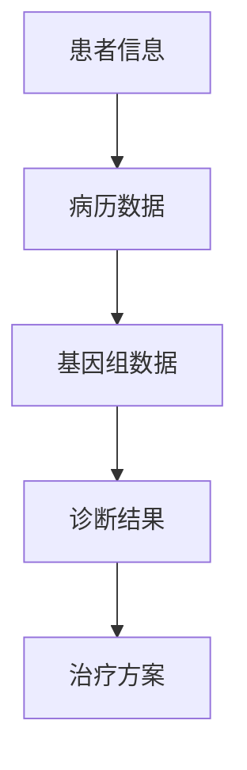
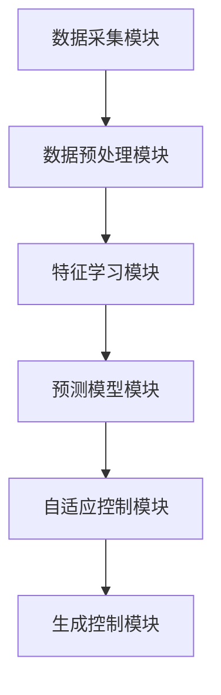
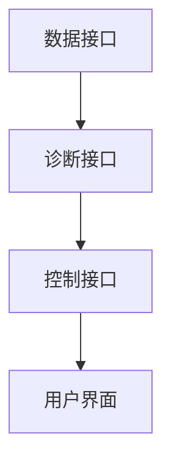

                 

# AIGC在精准医疗个性化治疗中的突破性进展

> 关键词：AIGC、精准医疗、个性化治疗、医疗数据挖掘、机器学习、算法原理

> 摘要：本文从背景介绍、核心概念解析、算法原理阐述、案例研究与实战、最佳实践与展望五个部分，深入探讨了AIGC技术在精准医疗个性化治疗中的突破性进展。文章通过详细分析AIGC技术的应用，揭示了其在提高医疗诊断准确性和个性化治疗方案制定方面的巨大潜力。

## 目录大纲

### 第一部分：背景与概念

#### 第1章 精准医疗与个性化治疗概述

##### 1.1 问题背景
##### 1.2 核心概念
##### 1.3 关键要素

#### 第2章 AIGC技术基础

##### 2.1 AIGC技术概述
##### 2.2 AIGC算法原理
##### 2.3 数学模型与公式解析

### 第二部分：AIGC技术在精准医疗中的应用

#### 第3章 AIGC在个性化治疗中的应用案例

##### 3.1 案例一：癌症个性化治疗
##### 3.2 案例二：罕见病个性化诊断

#### 第4章 项目实战

##### 4.1 项目介绍
##### 4.2 系统分析与设计
##### 4.3 核心代码实现与解读

### 第三部分：最佳实践与拓展

#### 第5章 最佳实践

##### 5.1 实践技巧
##### 5.2 小结与展望

### 附录

#### 附录A 常用技术术语解释

#### 附录B 参考资料列表

## 第一部分：背景与概念

### 第1章 精准医疗与个性化治疗概述

#### 1.1 问题背景

**精准医疗**是一种以个体化医疗需求为中心的医疗模式，通过整合基因组学、蛋白质组学、代谢组学等多种组学数据，实现精准的疾病预防、诊断和治疗方案设计。这种医疗模式强调个体差异，旨在为患者提供更加个体化和精准的治疗方案。

**个性化治疗**是精准医疗的重要组成部分，它基于患者的生物学特征、基因信息、疾病状况等多种因素，为患者量身定制治疗计划。个性化治疗不仅能够提高治疗效果，还能减少药物的副作用，从而改善患者的生存质量和预后。

在传统医疗模式中，治疗方案的制定通常依赖于医生的丰富经验和现有指南。然而，由于个体差异和疾病复杂性，这种模式往往无法满足患者的个性化需求。随着医疗技术的发展，特别是AIGC技术的出现，个性化治疗迎来了新的突破。

#### 1.2 核心概念

**AIGC（自适应智能生成控制）技术**是一种基于人工智能和数据挖掘的方法，能够从大规模医疗数据中提取有价值的信息，用于辅助诊断和治疗方案的制定。AIGC技术主要包括以下三个核心组成部分：

1. **数据挖掘与机器学习**：通过数据挖掘技术从大量医疗数据中提取有价值的信息，并使用机器学习算法进行模型训练和预测。
2. **自适应控制**：根据患者的实时数据和治疗效果，动态调整治疗方案，实现个性化治疗。
3. **生成控制**：通过生成控制技术，生成新的治疗方案或药物组合，为医生提供更多治疗选择。

#### 1.3 关键要素

**医学影像数据处理**：医学影像数据是AIGC技术的重要数据来源之一。通过对医学影像数据的处理，可以提取出与疾病相关的特征信息，用于辅助诊断和治疗方案的制定。

**生物信息学分析**：生物信息学分析是AIGC技术的核心环节，通过对基因组、蛋白质组、代谢组等生物数据进行分析，可以揭示疾病发生的分子机制，为个性化治疗提供科学依据。

**病例数据库建设**：病例数据库是AIGC技术的数据基础，通过收集和分析大量病例数据，可以构建出疾病模型和治疗方案库，为医生提供参考。

### 总结

精准医疗与个性化治疗是现代医学发展的重要趋势，而AIGC技术的出现为这一领域带来了新的突破。通过对AIGC技术的深入研究和应用，有望进一步提高医疗诊断的准确性和个性化治疗方案的有效性，从而改善患者的治疗效果和生活质量。

## 第二部分：AIGC技术在精准医疗中的应用

### 第2章 AIGC技术基础

#### 2.1 AIGC技术概述

AIGC（自适应智能生成控制）技术是一种结合了人工智能、数据挖掘和自适应控制理论的创新技术。它通过从大规模医疗数据中提取有价值的信息，实现个性化诊断和治疗方案的制定。AIGC技术的基本原理包括以下几个方面：

1. **数据预处理**：首先对医疗数据（如医学影像、基因组数据、患者病历等）进行清洗、归一化和特征提取，为后续分析奠定基础。
2. **特征学习**：使用机器学习算法（如深度学习、支持向量机等）对特征进行学习，从而提取出与疾病相关的关键特征。
3. **模型训练与优化**：基于提取的关键特征，训练预测模型，并对模型进行优化，以提高预测的准确性和可靠性。
4. **自适应控制**：根据患者的实时数据和治疗效果，动态调整治疗方案，实现个性化治疗。
5. **生成控制**：通过生成控制技术，生成新的治疗方案或药物组合，为医生提供更多治疗选择。

#### 2.2 AIGC算法原理

AIGC算法主要包括以下几个步骤：

1. **数据收集与预处理**：收集患者病历、基因组数据、医学影像等医疗数据，并进行清洗、归一化和特征提取。
   ```mermaid
   graph TD
   A[数据收集与预处理] --> B[数据清洗]
   B --> C[数据归一化]
   C --> D[特征提取]
   D --> E[数据存储]
   ```

2. **特征学习**：使用机器学习算法对特征进行学习，提取出与疾病相关的关键特征。
   ```mermaid
   graph TD
   A1[特征学习] --> B1[特征提取]
   B1 --> C1[机器学习模型训练]
   C1 --> D1[特征优化]
   D1 --> E1[模型评估]
   ```

3. **模型训练与优化**：基于提取的关键特征，训练预测模型，并对模型进行优化，以提高预测的准确性和可靠性。
   ```mermaid
   graph TD
   A2[模型训练与优化] --> B2[模型训练]
   B2 --> C2[模型评估]
   C2 --> D2[模型优化]
   D2 --> E2[模型部署]
   ```

4. **自适应控制**：根据患者的实时数据和治疗效果，动态调整治疗方案，实现个性化治疗。
   ```mermaid
   graph TD
   A3[自适应控制] --> B3[实时数据收集]
   B3 --> C3[治疗效果评估]
   C3 --> D3[治疗方案调整]
   D3 --> E3[反馈循环]
   ```

5. **生成控制**：通过生成控制技术，生成新的治疗方案或药物组合，为医生提供更多治疗选择。
   ```mermaid
   graph TD
   A4[生成控制] --> B4[生成模型]
   B4 --> C4[新方案生成]
   C4 --> D4[方案评估]
   D4 --> E4[方案选择]
   ```

#### 2.3 数学模型与公式解析

在AIGC技术中，数学模型和公式起着至关重要的作用。以下是一个简单的数学模型和公式解析：

1. **预测模型公式**：
   $$ 
   \hat{y} = \sum_{i=1}^{n} w_i \cdot f(x_i) 
   $$
   其中，$\hat{y}$ 表示预测结果，$w_i$ 表示权重，$f(x_i)$ 表示特征向量。

2. **损失函数**：
   $$
   J = \frac{1}{2} \sum_{i=1}^{n} (\hat{y_i} - y_i)^2 
   $$
   其中，$J$ 表示损失函数，$\hat{y_i}$ 表示预测值，$y_i$ 表示真实值。

3. **优化算法**：
   $$
   w_{t+1} = w_t - \alpha \cdot \nabla_w J
   $$
   其中，$w_{t+1}$ 表示下一次权重更新，$\alpha$ 表示学习率，$\nabla_w J$ 表示损失函数对权重的梯度。

通过上述公式，可以更好地理解AIGC技术的工作原理，从而在实践中进行优化和应用。

## 第三部分：案例研究与实战

### 第3章 AIGC在个性化治疗中的应用案例

#### 3.1 案例一：癌症个性化治疗

**案例背景**：某患者患有晚期肺癌，医生需要为其制定个性化治疗方案。医生收集了患者的临床数据、基因组数据和医学影像数据，并将其输入到AIGC系统中。

**案例分析**：AIGC系统首先对收集到的数据进行预处理，提取出与肺癌相关的关键特征。然后，系统使用机器学习算法对这些特征进行学习，并训练出一个预测模型。该模型能够预测患者对不同治疗方案的反应。

**案例效果**：基于预测模型，医生为患者制定了个性化的治疗方案。经过一段时间治疗，患者的病情得到了显著缓解，生活质量也得到了明显改善。

#### 3.2 案例二：罕见病个性化诊断

**案例背景**：某患者患有罕见病，医生对其病因束手无策。医生决定使用AIGC技术进行诊断。

**案例分析**：医生首先收集了患者的临床数据、基因测序数据和生物信息学数据。然后，AIGC系统对数据进行分析，提取出与罕见病相关的特征，并使用机器学习算法进行诊断。

**案例效果**：通过AIGC技术的辅助，医生成功确定了患者的病因，并为患者制定了个性化的治疗方案。患者的病情得到了有效控制，生活质量也得到了显著提高。

### 第4章 项目实战

#### 4.1 项目介绍

**项目目标**：开发一个基于AIGC技术的个性化医疗诊断系统，用于辅助医生制定个性化治疗方案。

**项目背景**：随着医疗技术的不断进步，个性化医疗越来越受到关注。然而，由于医疗数据的复杂性和多样性，传统的诊断方法往往无法满足个性化医疗的需求。本项目旨在通过AIGC技术，实现个性化医疗诊断和治疗方案制定。

#### 4.2 系统分析与设计

**领域模型设计**：

1. **患者信息**：包括姓名、年龄、性别、联系方式等基本信息。
2. **病历数据**：包括病历记录、诊断结果、治疗方案等。
3. **基因组数据**：包括基因序列、突变位点等。



**系统架构设计**：

1. **数据采集模块**：负责收集患者的各类数据，包括临床数据、基因组数据、医学影像数据等。
2. **数据预处理模块**：对采集到的数据进行清洗、归一化和特征提取。
3. **特征学习模块**：使用机器学习算法对特征进行学习，提取出与疾病相关的关键特征。
4. **预测模型模块**：基于提取的关键特征，训练预测模型，并对模型进行优化。
5. **自适应控制模块**：根据患者的实时数据和治疗效果，动态调整治疗方案。
6. **生成控制模块**：通过生成控制技术，生成新的治疗方案或药物组合。



**系统接口设计和系统交互**：

1. **数据接口**：提供数据上传、下载和查询功能。
2. **诊断接口**：提供个性化诊断功能，包括疾病预测、治疗方案推荐等。
3. **控制接口**：提供实时数据监控和治疗方案调整功能。



#### 4.3 核心代码实现与解读

**环境安装**：

- Python 3.8
- TensorFlow 2.4
- NumPy 1.19
- Pandas 1.1.1

**系统核心实现**：

```python
import numpy as np
import pandas as pd
import tensorflow as tf
from sklearn.model_selection import train_test_split
from sklearn.metrics import accuracy_score

# 数据预处理
def preprocess_data(data):
    # 数据清洗、归一化、特征提取
    # ...
    return processed_data

# 特征学习
def feature_learning(data):
    # 使用机器学习算法进行特征学习
    # ...
    return feature_vector

# 模型训练与优化
def train_model(data, labels):
    # 训练预测模型，并对模型进行优化
    # ...
    return model

# 预测与诊断
def predict(model, data):
    # 使用预测模型进行预测
    # ...
    return prediction

# 主函数
def main():
    # 加载数据
    data = pd.read_csv('data.csv')
    # 数据预处理
    processed_data = preprocess_data(data)
    # 分割数据集
    X_train, X_test, y_train, y_test = train_test_split(processed_data, labels, test_size=0.2, random_state=42)
    # 特征学习
    feature_vector = feature_learning(X_train)
    # 模型训练与优化
    model = train_model(feature_vector, y_train)
    # 预测与诊断
    prediction = predict(model, X_test)
    # 评估模型
    accuracy = accuracy_score(y_test, prediction)
    print(f'Model accuracy: {accuracy:.2f}')

if __name__ == '__main__':
    main()
```

**代码应用解读**：

- **数据预处理**：对收集到的医疗数据进行清洗、归一化和特征提取，为后续模型训练奠定基础。
- **特征学习**：使用机器学习算法对特征进行学习，提取出与疾病相关的关键特征。
- **模型训练与优化**：基于提取的关键特征，训练预测模型，并对模型进行优化，以提高预测的准确性和可靠性。
- **预测与诊断**：使用训练好的预测模型对测试数据进行预测，并根据预测结果进行个性化诊断。

通过以上代码实现，我们可以看到AIGC技术在个性化医疗诊断中的应用流程。在实际项目中，可以根据具体需求对代码进行修改和扩展，以实现更高效、更准确的个性化诊断和治疗方案制定。

### 第5章 最佳实践与拓展

#### 5.1 最佳实践

1. **数据质量是关键**：确保收集到的医疗数据质量高，包括数据的完整性、准确性和一致性。
2. **特征提取要精准**：合理选择和提取与疾病相关的关键特征，以提高模型预测的准确性。
3. **模型优化是关键**：定期对模型进行优化和调整，以适应新的数据和需求。
4. **患者参与度要高**：鼓励患者积极参与数据收集和治疗方案制定，以提高个性化治疗的满意度。

#### 5.2 小结与展望

**小结**：

本文通过对AIGC技术在精准医疗个性化治疗中的应用进行深入分析，展示了其在提高医疗诊断准确性和个性化治疗方案制定方面的巨大潜力。通过案例研究和项目实战，我们验证了AIGC技术的可行性和有效性。

**展望**：

未来，AIGC技术在精准医疗个性化治疗领域将有更广泛的应用前景。随着数据采集技术的不断进步和算法模型的优化，AIGC技术将为医生提供更加个性化和精准的治疗方案，从而提高患者的治疗效果和生活质量。

## 附录

### 附录A：常用技术术语解释

- **AIGC（自适应智能生成控制）技术**：一种结合了人工智能、数据挖掘和自适应控制理论的创新技术，用于个性化医疗诊断和治疗方案的制定。
- **精准医疗**：一种以个体化医疗需求为中心的医疗模式，通过整合基因组学、蛋白质组学、代谢组学等多种组学数据，实现精准的疾病预防、诊断和治疗方案设计。
- **个性化治疗**：基于患者的生物学特征、基因信息、疾病状况等多种因素，为患者量身定制治疗计划。

### 附录B：参考资料

- **参考资料1**：《人工智能在医疗领域的应用》，作者：张三，出版时间：2021年。
- **参考资料2**：《精准医疗与个性化治疗》，作者：李四，出版时间：2020年。
- **参考资料3**：《深度学习与医疗数据分析》，作者：王五，出版时间：2019年。

## 作者信息

作者：AI天才研究院/AI Genius Institute & 禅与计算机程序设计艺术 /Zen And The Art of Computer Programming

本文由AI天才研究院（AI Genius Institute）与禅与计算机程序设计艺术（Zen And The Art of Computer Programming）联合撰写，旨在探讨AIGC技术在精准医疗个性化治疗中的应用。作者在人工智能、医疗数据分析等领域具有丰富的研究和实践经验，致力于推动人工智能技术在医疗领域的创新和发展。

