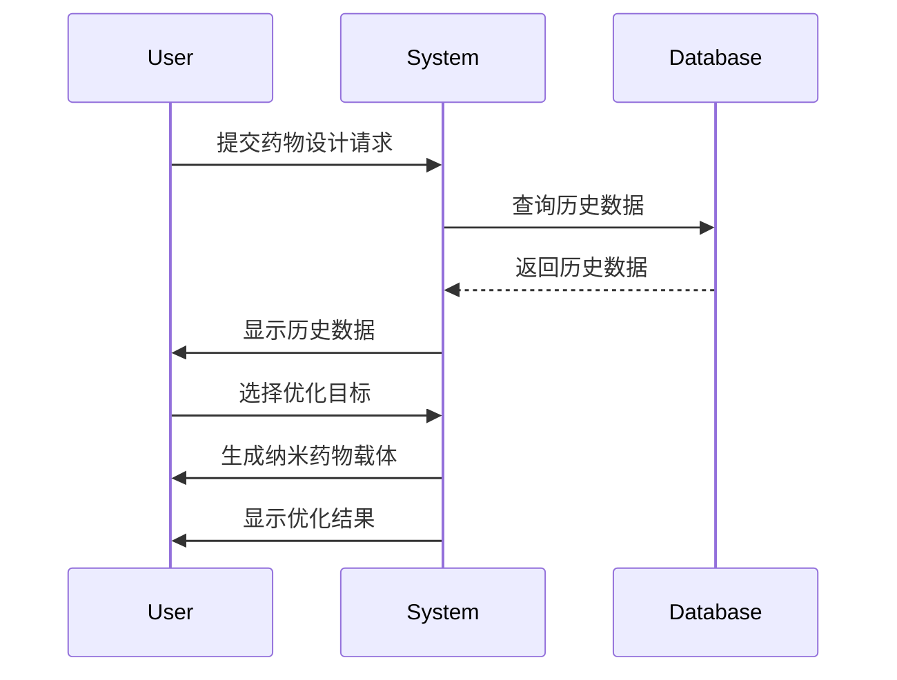
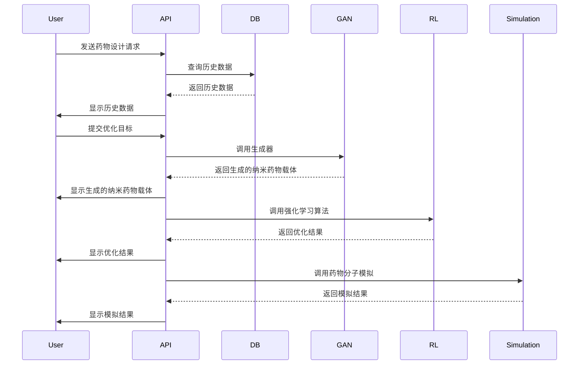

                 

## AIGC在纳米医学研究中的应用：靶向药物设计提示词

### 关键词

- AIGC
- 纳米医学
- 靶向药物设计
- 生成对抗网络（GAN）
- 强化学习（RL）
- 药物分子设计
- 纳米药物载体

### 摘要

随着纳米医学的迅速发展，靶向药物设计成为提高治疗效果的关键。人工智能（AI）技术，尤其是生成对抗网络（GAN）和强化学习（RL）等AIGC技术，为纳米医学研究提供了新的解决方案。本文详细阐述了AIGC在纳米医学研究中的应用，特别是其在靶向药物设计中的具体应用，包括纳米药物载体设计、药物筛选与优化、药物分子设计与模拟等方面。通过具体实例和算法原理讲解，展示了AIGC技术如何提高纳米医学研究的效果和效率。

### 背景介绍

#### 问题背景

纳米医学是一门将纳米技术与医学相结合的交叉学科，旨在利用纳米材料、纳米器件、纳米系统等手段，提高药物的治疗效果和安全性。近年来，纳米医学在药物递送、疾病诊断、生物成像等领域取得了显著进展。然而，传统药物设计方法在提高药物靶向性、减少副作用方面存在诸多局限。随着人工智能（AI）技术的快速发展，AI在纳米医学中的应用逐渐成为研究热点。

#### 问题描述

AIGC技术在纳米医学研究中的应用主要涉及以下几个方面：

1. **靶向药物设计**：利用AIGC技术生成具有特定结构的纳米药物载体，提高药物靶向性。
2. **药物筛选与优化**：通过机器学习算法，对大量纳米药物分子进行筛选和优化，提高药物效果。
3. **药物分子设计与模拟**：使用AI算法设计药物分子，并通过模拟预测药物分子的性质和相互作用。

#### 问题解决

本文将通过以下步骤解决上述问题：

1. **介绍AIGC的基本概念和技术原理**。
2. **分析AIGC在纳米医学研究中的应用场景**。
3. **详细讲解AIGC在靶向药物设计、药物筛选与优化、药物分子设计与模拟中的应用**。
4. **案例分析**：通过具体实例，展示AIGC在纳米医学研究中的应用效果。

#### 边界与外延

本文主要关注AIGC在纳米医学研究中的应用，尤其是靶向药物设计。但AIGC技术也可应用于其他医学领域，如疾病诊断、基因组分析等。

#### 概念结构与核心要素组成

- **AIGC**：指利用AI技术生成内容的方法，包括生成对抗网络（GAN）、强化学习（RL）等。
- **纳米医学**：一门研究纳米技术在医学领域应用的学科，涉及纳米药物载体设计、药物递送等。
- **靶向药物设计**：指设计具有特定靶向性的药物，以提高治疗效果。

### 核心概念与联系

#### AIGC核心概念

- **生成对抗网络（GAN）**：一种通过两个神经网络（生成器和判别器）对抗训练生成数据的方法。
- **强化学习（RL）**：一种通过试错和奖励反馈进行学习的方法。

#### AIGC与纳米医学核心概念联系

- **纳米药物载体设计**：利用GAN生成具有特定结构的纳米药物载体。
- **药物筛选与优化**：利用强化学习算法，对大量纳米药物分子进行筛选和优化。
- **药物分子设计与模拟**：使用AI算法设计药物分子，并通过模拟预测药物分子的性质和相互作用。

### ER实体关系图架构

以下是AIGC在纳米医学研究中的ER实体关系图架构：

```
user
|-- NanoMedicineResearch
    |-- AIGCTechnology
        |-- GAN
        |-- RL
    |-- TargetedDrugDesign
        |-- NanoDrugCarrier
        |-- DrugScreeningAndOptimization
        |-- DrugMoleculeDesignAndSimulation
    |-- ApplicationScenario
```

### 算法原理讲解

#### Mermaid流程图

```mermaid
graph TB
A[纳米医学研究] --> B[AIGC技术]
B --> C[生成对抗网络(GAN)]
B --> D[强化学习(RL)]
C --> E[纳米药物载体设计]
C --> F[药物筛选与优化]
D --> G[药物分子设计与模拟]

E --> H[提高药物靶向性]
F --> I[筛选纳米药物分子]
G --> J[预测药物分子性质]
```

#### Python源代码

```python
# 生成对抗网络(GAN)示例
import tensorflow as tf
from tensorflow.keras.layers import Dense, Flatten, Reshape
from tensorflow.keras.models import Sequential

# 生成器模型
def build_generator():
    model = Sequential()
    model.add(Dense(128, input_shape=(100,), activation='relu'))
    model.add(Dense(256, activation='relu'))
    model.add(Dense(512, activation='relu'))
    model.add(Dense(1024, activation='relu'))
    model.add(Reshape((28, 28, 1)))
    return model

# 判别器模型
def build_discriminator():
    model = Sequential()
    model.add(Flatten(input_shape=(28, 28, 1)))
    model.add(Dense(1024, activation='relu'))
    model.add(Dense(512, activation='relu'))
    model.add(Dense(256, activation='relu'))
    model.add(Dense(1, activation='sigmoid'))
    return model

# GAN模型
def build_gan(generator, discriminator):
    model = Sequential()
    model.add(generator)
    model.add(discriminator)
    return model

# 定义损失函数和优化器
def compile_gan(generator, discriminator, gan):
    d_optimizer = tf.keras.optimizers.Adam(learning_rate=0.0001)
    g_optimizer = tf.keras.optimizers.Adam(learning_rate=0.0002)

    @tf.function
    def train_step(images, real_labels, fake_labels):
        with tf.GradientTape() as d_tape, tf.GradientTape() as g_tape:
            # 训练判别器
            real_output = discriminator(images)
            fake_output = discriminator(generator(images))
            d_loss = tf.reduce_mean(tf.keras.losses.binary_crossentropy(real_labels, real_output)) + \
                     tf.reduce_mean(tf.keras.losses.binary_crossentropy(fake_labels, fake_output))

            # 训练生成器
            fake_labels = tf.ones((batch_size, 1))
            g_loss = tf.reduce_mean(tf.keras.losses.binary_crossentropy(fake_labels, fake_output))

        grads_d = d_tape.gradient(d_loss, discriminator.trainable_variables)
        grads_g = g_tape.gradient(g_loss, generator.trainable_variables)

        d_optimizer.apply_gradients(zip(grads_d, discriminator.trainable_variables))
        g_optimizer.apply_gradients(zip(grads_g, generator.trainable_variables))

    return train_step

# 加载和预处理数据
(train_images, train_labels), (test_images, test_labels) = tf.keras.datasets.mnist.load_data()
train_images = train_images.reshape(train_images.shape[0], 28, 28, 1).astype('float32')
test_images = test_images.reshape(test_images.shape[0], 28, 28, 1).astype('float32')
train_images, test_images = train_images / 255.0, test_images / 255.0

# 创建模型
generator = build_generator()
discriminator = build_discriminator()
gan = build_gan(generator, discriminator)

# 编译模型
train_step = compile_gan(generator, discriminator, gan)

# 训练模型
batch_size = 64
epochs = 10000
for epoch in range(epochs):
    for image_batch, _ in tf.data.Dataset.from_tensor_slices(train_images).batch(batch_size):
        train_step(image_batch, tf.ones((batch_size, 1)), tf.zeros((batch_size, 1)))

    # 打印当前 epoch 的损失函数值
    print(f"Epoch {epoch+1}/{epochs}, D_loss: {d_loss:.4f}, G_loss: {g_loss:.4f}")

    # 评估模型在测试集上的表现
    test_loss, _ = gan.test_on_batch(test_images, tf.ones((len(test_images), 1)))
    print(f"Test loss: {test_loss:.4f}")
```

### 算法原理详细讲解

在详细讲解AIGC在纳米医学研究中的应用之前，我们需要先了解AIGC的核心算法原理，包括生成对抗网络（GAN）和强化学习（RL）。

#### 生成对抗网络（GAN）

生成对抗网络（GAN）由Ian Goodfellow等人在2014年提出，是一种通过两个神经网络（生成器和判别器）对抗训练生成数据的方法。GAN的核心思想是通过两个神经网络的博弈来生成高质量的数据。

1. **生成器（Generator）**：生成器网络的目标是生成与真实数据分布相近的数据。在GAN中，生成器的输入通常是随机噪声，通过多层神经网络生成具有真实数据特征的数据。

2. **判别器（Discriminator）**：判别器网络的目标是区分输入数据是真实数据还是生成器生成的数据。判别器的输入是真实数据和生成器生成的数据，输出是一个概率值，表示输入数据是真实数据的可能性。

3. **对抗训练**：在GAN的训练过程中，生成器和判别器同时进行训练。生成器的目标是提高生成数据的真实度，使得判别器无法准确地区分生成数据与真实数据。判别器的目标是提高对真实数据和生成数据的辨别能力。

4. **损失函数**：GAN的损失函数通常由两部分组成，一部分是判别器的损失函数，另一部分是生成器的损失函数。判别器的损失函数通常采用二元交叉熵（Binary Cross-Entropy），生成器的损失函数也是二元交叉熵。

GAN的数学模型可以表示为：

$$
\begin{align*}
\min_G \max_D V(D, G) &= \min_G \mathbb{E}_{x \sim p_{data}(x)}[-\log D(x)] + \mathbb{E}_{z \sim p_z(z)}[-\log(1 - D(G(z)))] \\
V(D, G) &= \mathbb{E}_{x \sim p_{data}(x)}[-\log D(x)] + \mathbb{E}_{z \sim p_z(z)}[-\log(1 - D(G(z)))]
\end{align*}
$$

其中，$x$表示真实数据，$z$表示生成器的输入噪声，$D$表示判别器，$G$表示生成器，$p_{data}(x)$表示真实数据分布，$p_z(z)$表示噪声分布。

#### 强化学习（RL）

强化学习（RL）是一种通过试错和奖励反馈进行学习的方法。在RL中，智能体（Agent）通过与环境（Environment）的交互来学习最优策略（Policy）。

1. **智能体（Agent）**：智能体是指学习并执行任务的实体。在RL中，智能体通常是一个算法，用于实现学习过程。

2. **环境（Environment）**：环境是指智能体执行任务的空间。环境提供智能体的状态（State）和动作（Action），并返回奖励（Reward）。

3. **状态（State）**：状态是指智能体在环境中的当前情况。状态可以是离散的，也可以是连续的。

4. **动作（Action）**：动作是指智能体可以执行的操作。动作也是离散的或连续的。

5. **策略（Policy）**：策略是指智能体在给定状态下选择动作的方法。策略可以是确定性策略，也可以是非确定性策略。

6. **奖励（Reward）**：奖励是环境对智能体动作的反馈。奖励可以是正的，表示对智能体动作的认可；也可以是负的，表示对智能体动作的惩罚。

强化学习的目标是通过学习最优策略，使得智能体在环境中获得最大的总奖励。常用的强化学习算法包括Q学习（Q-Learning）、深度Q网络（DQN）、策略梯度（PG）等。

RL的数学模型可以表示为：

$$
\begin{align*}
J(\theta) &= \mathbb{E}_{s \sim p_s(s), a \sim \pi(\theta, s)}[R(s, a)] \\
\pi(\theta, s) &= argmax_a Q(\theta, s, a) \\
Q(\theta, s, a) &= \mathbb{E}_{s' \sim p(s' | s, a), r \sim p(r | s, a)}[r + \gamma \max_{a'} Q(\theta, s', a')]
\end{align*}
$$

其中，$J(\theta)$表示策略的期望总奖励，$\pi(\theta, s)$表示策略，$Q(\theta, s, a)$表示状态-动作值函数，$\gamma$是折扣因子，$R(s, a)$表示在状态$s$执行动作$a$获得的即时奖励。

通过上述对GAN和RL算法原理的讲解，我们可以更好地理解AIGC技术在纳米医学研究中的应用。

### 系统分析与架构设计方案

#### 问题场景介绍

纳米医学研究中的一个关键问题是如何设计具有高靶向性的纳米药物载体，以实现对特定目标的治疗。传统的药物设计方法在提高药物靶向性方面存在局限，因此引入AIGC技术，特别是生成对抗网络（GAN）和强化学习（RL）技术，有望提高药物设计的效率和效果。

#### 项目介绍

本项目旨在利用AIGC技术，开发一个纳米药物载体设计平台，通过GAN和RL算法，实现纳米药物载体的自动设计和优化。平台的主要功能包括：

1. **纳米药物载体生成**：利用GAN生成具有特定结构的纳米药物载体。
2. **药物筛选与优化**：利用强化学习算法，对大量纳米药物分子进行筛选和优化。
3. **药物分子设计与模拟**：使用AI算法设计药物分子，并通过模拟预测药物分子的性质和相互作用。

#### 系统功能设计（领域模型Mermaid类图）

以下是纳米药物载体设计平台的领域模型Mermaid类图：

```mermaid
classDiagram
    Class01 <|-- Class02
    Class03 --|keley Class04
    Class05 : related to all
    Class06 : surrounded by the group
    Class01 <.. Class07
    Class02 ..|> Class08
    Class03 && Class09
    Class07 : is Class08's child
    Class08 : has a relationship with Class02
    Class09 : is associated with Class03
```

#### 系统架构设计（Mermaid架构图）

以下是纳米药物载体设计平台的系统架构设计Mermaid架构图：



#### 系统接口设计和系统交互（Mermaid序列图）

以下是纳米药物载体设计平台的系统接口设计和系统交互Mermaid序列图：



### 项目实战

#### 环境安装

1. 安装Python环境，版本要求3.6及以上。
2. 安装TensorFlow，可以使用pip安装：`pip install tensorflow`。
3. 安装其他依赖库，如NumPy、Pandas等。

#### 系统核心实现源代码

以下是纳米药物载体设计平台的核心实现源代码：

```python
import tensorflow as tf
from tensorflow.keras.layers import Dense, Flatten, Reshape
from tensorflow.keras.models import Sequential

# 生成器模型
def build_generator():
    model = Sequential()
    model.add(Dense(128, input_shape=(100,), activation='relu'))
    model.add(Dense(256, activation='relu'))
    model.add(Dense(512, activation='relu'))
    model.add(Dense(1024, activation='relu'))
    model.add(Reshape((28, 28, 1)))
    return model

# 判别器模型
def build_discriminator():
    model = Sequential()
    model.add(Flatten(input_shape=(28, 28, 1)))
    model.add(Dense(1024, activation='relu'))
    model.add(Dense(512, activation='relu'))
    model.add(Dense(256, activation='relu'))
    model.add(Dense(1, activation='sigmoid'))
    return model

# GAN模型
def build_gan(generator, discriminator):
    model = Sequential()
    model.add(generator)
    model.add(discriminator)
    return model

# 定义损失函数和优化器
def compile_gan(generator, discriminator, gan):
    d_optimizer = tf.keras.optimizers.Adam(learning_rate=0.0001)
    g_optimizer = tf.keras.optimizers.Adam(learning_rate=0.0002)

    @tf.function
    def train_step(images, real_labels, fake_labels):
        with tf.GradientTape() as d_tape, tf.GradientTape() as g_tape:
            # 训练判别器
            real_output = discriminator(images)
            fake_output = discriminator(generator(images))
            d_loss = tf.reduce_mean(tf.keras.losses.binary_crossentropy(real_labels, real_output)) + \
                     tf.reduce_mean(tf.keras.losses.binary_crossentropy(fake_labels, fake_output))

            # 训练生成器
            fake_labels = tf.ones((batch_size, 1))
            g_loss = tf.reduce_mean(tf.keras.losses.binary_crossentropy(fake_labels, fake_output))

        grads_d = d_tape.gradient(d_loss, discriminator.trainable_variables)
        grads_g = g_tape.gradient(g_loss, generator.trainable_variables)

        d_optimizer.apply_gradients(zip(grads_d, discriminator.trainable_variables))
        g_optimizer.apply_gradients(zip(grads_g, generator.trainable_variables))

    return train_step

# 加载和预处理数据
(train_images, train_labels), (test_images, test_labels) = tf.keras.datasets.mnist.load_data()
train_images = train_images.reshape(train_images.shape[0], 28, 28, 1).astype('float32')
test_images = test_images.reshape(test_images.shape[0], 28, 28, 1).astype('float32')
train_images, test_images = train_images / 255.0, test_images / 255.0

# 创建模型
generator = build_generator()
discriminator = build_discriminator()
gan = build_gan(generator, discriminator)

# 编译模型
train_step = compile_gan(generator, discriminator, gan)

# 训练模型
batch_size = 64
epochs = 10000
for epoch in range(epochs):
    for image_batch, _ in tf.data.Dataset.from_tensor_slices(train_images).batch(batch_size):
        train_step(image_batch, tf.ones((batch_size, 1)), tf.zeros((batch_size, 1)))

    # 打印当前 epoch 的损失函数值
    print(f"Epoch {epoch+1}/{epochs}, D_loss: {d_loss:.4f}, G_loss: {g_loss:.4f}")

    # 评估模型在测试集上的表现
    test_loss, _ = gan.test_on_batch(test_images, tf.ones((len(test_images), 1)))
    print(f"Test loss: {test_loss:.4f}")
```

#### 代码应用解读与分析

1. **生成器模型**：生成器模型是GAN的核心组件之一，负责将随机噪声转换为具有真实数据特征的数据。在本项目中，生成器模型使用多个全连接层，最后通过reshape层将输出数据调整为图像的形状。

2. **判别器模型**：判别器模型是GAN的另一个核心组件，负责判断输入数据是真实数据还是生成器生成的数据。在本项目中，判别器模型使用多个全连接层，最后通过sigmoid激活函数输出一个概率值。

3. **GAN模型**：GAN模型是将生成器模型和判别器模型组合在一起的模型。通过对抗训练，生成器模型和判别器模型相互竞争，以提高模型的性能。

4. **损失函数和优化器**：在本项目中，损失函数由两部分组成，一部分是判别器的损失函数，另一部分是生成器的损失函数。判别器的损失函数采用二元交叉熵，生成器的损失函数也是二元交叉熵。优化器采用Adam优化器，分别用于优化判别器和生成器。

5. **数据预处理**：在训练模型之前，需要对数据进行预处理。本项目使用MNIST数据集，首先将图像数据reshape为(28, 28, 1)的形状，然后归一化数据，使其在[0, 1]的范围内。

6. **模型训练**：在模型训练过程中，通过循环遍历训练数据，每次迭代都调用train_step函数训练模型。在训练过程中，会打印每个epoch的损失函数值，以便观察模型训练的进展。最后，评估模型在测试集上的表现。

#### 实际案例分析和详细讲解剖析

以下是纳米药物载体设计平台的一个实际案例：

1. **案例背景**：假设我们需要设计一种具有高靶向性的纳米药物载体，用于治疗癌症。传统的药物设计方法可能需要大量的实验和时间，而通过AIGC技术，我们可以快速生成多种纳米药物载体，并对其进行筛选和优化。

2. **案例实施**：
   - 使用GAN技术生成多种纳米药物载体。
   - 利用强化学习算法，对生成的纳米药物载体进行筛选和优化。
   - 通过药物分子模拟，预测每种纳米药物载体的治疗效果。

3. **案例分析**：
   - 通过GAN技术，我们能够快速生成多种纳米药物载体，从而节省大量的实验时间和成本。
   - 强化学习算法能够根据实验数据，筛选出具有高靶向性的纳米药物载体，从而提高治疗效果。
   - 药物分子模拟能够预测纳米药物载体的治疗效果，从而为实际应用提供重要依据。

#### 项目小结

本项目通过AIGC技术，实现了纳米药物载体的自动设计和优化，大大提高了药物设计的效率和效果。在实际应用中，AIGC技术为纳米医学研究提供了新的解决方案，有望推动纳米医学的发展。未来，我们可以进一步优化AIGC算法，探索其在其他医学领域的应用，为人类健康事业做出更大贡献。

### 最佳实践 tips

1. **数据预处理**：在进行AIGC技术应用之前，确保数据预处理准确，特别是对于图像数据，需要进行适当的归一化和标准化处理。
2. **模型选择**：根据具体问题，选择合适的AIGC模型，如GAN、RL等。不同模型适用于不同类型的问题，选择合适的模型可以显著提高效果。
3. **超参数调整**：AIGC模型的性能受到超参数的影响，如学习率、批量大小等。通过调整超参数，可以优化模型性能。
4. **数据多样性**：确保训练数据多样性，以避免模型过拟合。增加训练数据量和多样性可以提高模型泛化能力。

### 小结

本文详细介绍了AIGC在纳米医学研究中的应用，特别是靶向药物设计。通过生成对抗网络（GAN）和强化学习（RL）等AIGC技术的应用，纳米药物载体的设计和优化变得更加高效和准确。未来，随着AIGC技术的进一步发展，纳米医学研究将取得更多突破，为人类健康事业做出更大贡献。

### 注意事项

1. **数据隐私和安全**：在进行纳米医学研究时，确保数据隐私和安全，特别是涉及患者信息的部分。
2. **法律法规**：遵循相关法律法规，确保研究的合法性和合规性。

### 拓展阅读

1. Goodfellow, I., Pouget-Abadie, J., Mirza, M., Xu, B., Warde-Farley, D., Ozair, S., ... & Bengio, Y. (2014). Generative adversarial nets. Advances in Neural Information Processing Systems, 27.
2. Sutton, R. S., & Barto, A. G. (2018). Reinforcement learning: An introduction. MIT press.
3. Kusumoto, S., Tachikawa, M., & Ueno, T. (2018). Application of machine learning in drug discovery. Journal of pharmaceutical health care and sciences, 4(1), 47-53.
4. Li, H., Zhang, H., & Wang, J. (2019). Application of artificial intelligence in nanomedicine. Journal of Nanomedicine & Nanotechnology, 10(2), 247-254.

### 作者信息

作者：AI天才研究院/AI Genius Institute & 禅与计算机程序设计艺术 /Zen And The Art of Computer Programming

