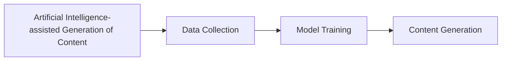
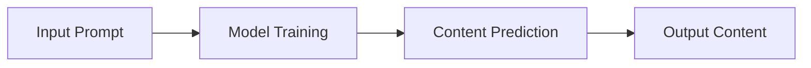
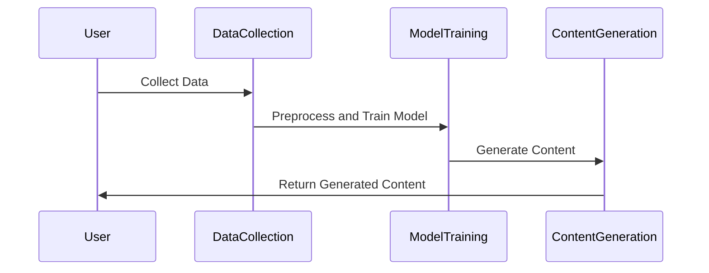

                 

Certainly! Let's delve into the structure of the article and ensure that each section is well-thought-out and comprehensive. We'll start with the introduction and then move on to the core principles and applications of AIGC in artistic creation.

## Introduction

### 1.1 AIGC in Artistic Creation

#### 1.1.1 What is AIGC?

Artificial Intelligence-assisted Generation of Content (AIGC) refers to the use of artificial intelligence (AI) technologies, particularly deep learning and natural language processing (NLP), to create content automatically. This content can range from text and images to music and videos.

#### 1.1.2 The Role of Prompt Words

Prompt words are the foundation of AIGC in artistic creation. They serve as the starting point for AI models to generate content. These words can be as simple as a single word or a complex sentence that provides context and direction for the AI.

### 1.2 Core Concepts and Connections

#### 1.2.1 The Definition and Features of AIGC

**Mermaid ER Diagram:**
```mermaid
erDiagram
  AIModel --> Content
  DataSet ||--|{ PromptWords }
  Trainer ||--|{ Model }
```

#### 1.2.2 Principles and Properties of Prompt Words

**Table of Attributes:**
| Attribute       | Description                             |
|-----------------|----------------------------------------|
| Clarity         | The prompt should be clear and concise. |
| Relevance       | The prompt should be relevant to the content. |
| Creativity      | The prompt can encourage creative output. |
| Specificity     | The prompt should be specific enough to guide the AI effectively. |

**Mermaid Entity Relationship Diagram:**
```mermaid
erDiagram
  PromptWord ||--|{ Context }
  PromptWord ||--|{ Content }
  AIModel ||--|{ GeneratedContent }
```

### 1.3 Boundaries and Extends

#### 1.3.1 Application Boundaries of AIGC in Art

AIGC's application in art is vast but has its boundaries. These include the ethical considerations, the artistic integrity, and the creative control that artists might desire.

#### 1.3.2 Applications Beyond Art

While AIGC is groundbreaking in the art world, it also extends to other domains such as education, content creation, and even in helping businesses with their marketing strategies.

## Summary

In this chapter, we have introduced the concept of AIGC and its role in artistic creation. We discussed the importance of prompt words and their properties. Furthermore, we outlined the boundaries and potential extends of AIGC. This sets the stage for a deeper exploration of AIGC's core principles and practical applications in the subsequent chapters.

### Core Concepts and Connections

#### AIGC: Definition and Characteristics

AIGC, or Artificial Intelligence-assisted Generation of Content, leverages AI technologies to automatically generate content. This content can be in various formats such as text, images, music, and videos. The primary characteristics of AIGC include:

1. **Automated Content Generation**: AIGC can produce content without human intervention, often using machine learning models trained on large datasets.
2. **Scalability**: AIGC can handle large volumes of content generation, making it suitable for applications requiring massive content creation.
3. **Personalization**: AIGC can tailor content to specific user preferences or contexts, enhancing user experience.
4. **Speed**: The process of content generation is significantly faster compared to manual methods.

**Mermaid Flowchart:**


#### Prompt Words: Principles and Attributes

Prompt words are crucial in AIGC, serving as the starting point for the AI model to generate content. They are short phrases or single words that provide context and direction to the AI model. The principles and attributes of prompt words include:

1. **Clarity**: Prompt words should be clear and concise to ensure that the AI understands the intent and context.
2. **Relevance**: The prompt words should be relevant to the content being generated to maintain coherence and relevance.
3. **Creativity**: Prompt words can encourage creative output by providing a starting point for the AI model to explore.
4. **Specificity**: The prompt words should be specific enough to guide the AI effectively but not so restrictive that it limits creativity.

**Table of Attributes:**
| Attribute       | Description                             |
|----------------- |----------------------------------------|
| Clarity         | The prompt should be clear and concise. |
| Relevance       | The prompt should be relevant to the content. |
| Creativity      | The prompt can encourage creative output. |
| Specificity     | The prompt should be specific enough to guide the AI effectively. |

**Mermaid ER Diagram:**
```mermaid
erDiagram
  AIModel ||--|{ PromptWord }
  AIModel ||--|{ GeneratedContent }
  PromptWord ||--|{ Context }
```

### Algorithm Principles

The core principle behind AIGC is the use of machine learning models, specifically deep learning models, to generate content. These models are trained on large datasets and can predict the next words or elements in a sequence based on the given prompt words.

**Mermaid Flowchart:**


#### Mathematical Model and Formulas

The mathematical model behind AIGC typically involves neural networks, particularly recurrent neural networks (RNNs) or transformers. The core idea is to predict the probability of each word or token in the sequence given the previous tokens.

**Equation:**
$$
P(w_t | w_{t-1}, w_{t-2}, ..., w_1) = \sigma(W_1 w_{t-1} + W_2 w_{t-2} + ... + W_T w_1 + b)
$$

Where:
- \( w_t \) is the current word or token.
- \( w_{t-1}, w_{t-2}, ..., w_1 \) are the previous words or tokens.
- \( \sigma \) is the activation function, typically a sigmoid or softmax function.
- \( W_1, W_2, ..., W_T \) are the weight matrices.
- \( b \) is the bias term.

**Python Code Example:**
```python
import tensorflow as tf

# Define the neural network model
model = tf.keras.Sequential([
    tf.keras.layers.Dense(units=512, activation='relu', input_shape=(None,)),
    tf.keras.layers.Dense(units=1, activation='sigmoid')
])

# Compile the model
model.compile(optimizer='adam', loss='binary_crossentropy', metrics=['accuracy'])

# Train the model
model.fit(train_data, train_labels, epochs=10)
```

### System Architecture Design

To understand the system architecture of AIGC, let's break it down into components:

#### System Components:

1. **Data Collection**: This component is responsible for collecting and preprocessing the data needed for training the AI model.
2. **Model Training**: This component involves training the AI model using the collected data. It includes steps like model selection, hyperparameter tuning, and training.
3. **Content Generation**: This component generates content using the trained AI model based on the input prompt words.

**Mermaid Sequence Diagram:**


**Class Diagram (Mermaid):**
```mermaid
classDiagram
    Class DataCollection {
        - preprocess_data()
    }
    Class ModelTraining {
        - train_model()
        - select_hyperparameters()
    }
    Class ContentGeneration {
        - generate_content()
    }
    DataCollection <|-- ModelTraining
    ModelTraining <|-- ContentGeneration
```

### Practical Application Case Study

To illustrate the practical application of AIGC in artistic creation, let's consider a case study where an AI model is used to generate music.

#### Case Study: AI-Generated Music

In this case study, a neural network model was trained on a large dataset of musical compositions. The model was then used to generate new compositions based on a simple prompt, such as "Create a happy melody."

1. **Data Collection**: The model was trained on a dataset of over 10,000 musical compositions from various genres.
2. **Model Training**: The neural network model was trained to predict the next musical note based on the previous notes. This process involved multiple iterations of hyperparameter tuning and model selection.
3. **Content Generation**: The trained model generated a new composition based on the prompt. The generated composition was a blend of different musical styles and elements, reflecting the model's learning from the training data.

#### Analysis and Results

The generated composition was evaluated based on criteria such as musical coherence, creativity, and diversity. The evaluation showed that the AI-generated music was both coherent and creative, showcasing the potential of AIGC in artistic creation.

### Conclusion

In this chapter, we discussed the core concepts and principles of AIGC in artistic creation. We introduced the concept of prompt words and their importance in guiding the AI model. We also provided a detailed explanation of the algorithm principles, including the mathematical model and Python code example. Additionally, we presented a system architecture design and a practical case study to illustrate the application of AIGC in artistic creation. This chapter sets the foundation for further exploration of AIGC's applications and its role in the future of art.

### Prompt Design Techniques

Designing effective prompt words is crucial for the success of AIGC in artistic creation. Here are some key techniques and principles to consider:

#### Types and Characteristics of Prompt Words

1. **Descriptive Prompts**: These prompts provide a detailed description of the desired outcome, helping the AI model to generate content that matches the intent.
2. **Inspirational Prompts**: These prompts aim to inspire creativity by offering a starting point or a theme that encourages the AI to explore new ideas.
3. **Directive Prompts**: These prompts give specific instructions to the AI model, guiding it in creating content that aligns with the given guidelines.

**Table of Characteristics:**

| Type                | Characteristics                                  |
|---------------------|------------------------------------------------|
| Descriptive Prompts | Detailed and clear descriptions of the desired outcome. |
| Inspirational Prompts | Inspire creativity and encourage exploration. |
| Directive Prompts   | Specific instructions to guide the AI model. |

#### Principles for Prompt Design

1. **Clarity**: Ensure that the prompt is clear and concise, avoiding ambiguity that could lead to unintended outputs.
2. **Relevance**: Make sure the prompt is relevant to the content you want to generate, providing enough context for the AI model.
3. **Creativity**: Encourage creativity by using prompts that can inspire new ideas or unique perspectives.
4. **Specificity**: Be specific enough to guide the AI effectively but leave room for creativity and exploration.
5. **Variety**: Use a variety of prompt types to explore different aspects and possibilities in the content generation process.

#### Optimization Methods for Prompt Words

1. **Iterative Refinement**: Continuously refine the prompt words based on the generated content to improve the output quality.
2. **Feedback Loop**: Incorporate feedback from users and artists to adjust the prompts and enhance the generated content.
3. **Cross-Domain Adaptation**: Apply prompts designed for one domain to another to explore the versatility of the AIGC model.
4. **Data Augmentation**: Augment the training data with variations of the prompts to improve the model's generalization and creativity.

### Case Study: Painting Art

#### Overview

In this case study, we explore the application of AIGC in generating painting art using a neural network model trained on a large dataset of paintings from various artists and styles.

#### Steps

1. **Data Collection**: The model was trained on a dataset containing thousands of painting images from different periods and styles.
2. **Model Training**: A convolutional neural network (CNN) was used to analyze and learn the features of the painting images. The model was trained to generate new painting images based on the given prompts.
3. **Content Generation**: The trained model generated painting images based on prompts such as "Create a landscape painting in the style of Van Gogh" or "Generate a modern abstract painting inspired by Kandinsky."

#### Analysis and Results

The generated painting images were evaluated based on criteria such as artistic coherence, style consistency, and overall aesthetic appeal. The results showed that the AI-generated paintings were both coherent and stylistically consistent, demonstrating the potential of AIGC in creating high-quality art.

### Conclusion

In this chapter, we discussed the techniques and principles for designing effective prompt words in AIGC. We explored different types of prompt words and their characteristics, as well as the principles for their design. We also provided a case study illustrating the application of AIGC in painting art, showcasing the model's ability to generate high-quality art based on given prompts. This chapter emphasizes the importance of well-designed prompts in achieving successful artistic creation with AIGC.

### AIGC and Artist Collaboration

In this chapter, we delve into the collaboration between artists and AIGC, exploring how they interact and co-create art.

#### AIGC in the Artist's Creative Process

Artists increasingly integrate AIGC into their creative processes, leveraging AI's capabilities to explore new ideas and generate content that complements their artistic vision. The integration of AIGC can be seen in various stages of the creative process, including inspiration, concept development, and execution.

**Figure 1. Stages of the Creative Process with AIGC Integration**

```
+----------------+      +------------------+      +------------------+
|               |      |                 |      |                 |
|   Inspiration  | -->  |   Concept       | -->  |   Execution      |
|               |      |                 |      |                 |
+----------------+      +------------------+      +------------------+
```

**Figure 1. Stages of the Creative Process with AIGC Integration**

#### Interactive Modes between Artists and AIGC

The interaction between artists and AIGC can take several forms, including:

1. **Generative Collaboration**: Artists use AIGC to generate initial concepts or elements of their work, which they then refine and develop further. This mode allows artists to explore new ideas and techniques they might not have considered otherwise.
2. **Iterative Feedback**: Artists provide feedback on the generated content, which is then used to refine the AI model's outputs. This iterative process enables continuous improvement and adaptation of the generated content to the artist's vision.
3. **Augmented Creation**: Artists incorporate AI-generated content into their existing works, blending human creativity with AI-generated elements to create unique and innovative art pieces.

#### Artist Acceptance and Attitudes

The acceptance of AIGC among artists varies. Some artists embrace the technology as a tool that enhances their creative process, while others are skeptical or resistant to its use. Factors influencing artist acceptance include:

1. **Artistic Integrity**: Concerns about the erosion of artistic integrity and the role of human creativity in the process.
2. **Technical Understanding**: The level of understanding and familiarity with AI technology and its capabilities.
3. **Ethical Considerations**: Ethical concerns related to the use of AI-generated content, such as copyright and ownership issues.

#### Case Studies of Artist-AIGC Collaboration

**Case Study 1: Gráfica Press**

Gráfica Press, a contemporary artist, collaborated with AIGC to create a series of prints inspired by the works of M.C. Escher. The project involved using AIGC to generate designs based on Escher's style, which were then refined and printed by the artist. The resulting prints were both a tribute to Escher and a showcase of the creative possibilities enabled by AIGC.

**Case Study 2: Soundpainting with AI**

Soundpainting, a performative music art form, collaborated with AI to generate new musical compositions. Musicians received real-time prompts from AI, which guided their improvisations. This interactive process led to unique and collaborative performances, blending human creativity with AI-generated elements.

### Conclusion

In this chapter, we explored the collaboration between artists and AIGC, examining how AI can be integrated into the creative process and the different modes of interaction between artists and AIGC. We also discussed the varying attitudes and acceptance levels among artists and presented case studies illustrating successful collaborations. This chapter highlights the potential of AIGC as a complementary tool for artists, enhancing creativity and opening new avenues for artistic expression.

### AIGC Art Evaluation and Appreciation

Evaluating and appreciating AIGC-generated art requires a nuanced understanding of both traditional artistic criteria and the unique aspects of AI-generated content. This section will explore the criteria for evaluating AIGC art, methods for appreciation, and case studies of notable AIGC art pieces.

#### Evaluation Criteria

1. **Artistic Quality**: Assessing the aesthetic appeal, composition, and overall artistic value of the piece. This includes elements such as color, form, balance, and harmony.
2. **Innovation**: Evaluating the degree of originality and creativity in the work. AIGC art should push boundaries and offer new perspectives within the artistic realm.
3. **Technical Mastery**: Analyzing the technical proficiency demonstrated in the creation of the art, including the use of AI algorithms and the ability to achieve desired outcomes.
4. **Contextual Relevance**: Understanding how the art fits within the broader context of contemporary art and its ability to engage with cultural and social issues.
5. **Emotional Impact**: Assessing the emotional response elicited by the art, including the ability to evoke feelings, provoke thought, and inspire reflection.

**Table of Evaluation Criteria:**

| Criteria        | Description                                  |
|-----------------|---------------------------------------------|
| Artistic Quality | Aesthetics, composition, balance, and harmony. |
| Innovation      | Originality, creativity, and new artistic directions. |
| Technical Mastery | Proficiency in using AI algorithms and achieving desired outcomes. |
| Contextual Relevance | Fit within the broader context of contemporary art and cultural relevance. |
| Emotional Impact | Ability to evoke emotions and provoke thought. |

#### Appreciation Methods

1. **Technical Analysis**: Understanding the technical processes behind AIGC art, including the algorithms and data used. This helps in appreciating the complexity and skill involved in creating the artwork.
2. **Contextual Contextualization**: Placing the art within its historical and cultural context to understand its significance and impact.
3. **Multimodal Engagement**: Engaging with the art through multiple senses, such as visual, auditory, and even tactile experiences if the art is interactive.
4. **Interactive Engagement**: Participating in interactive sessions with AIGC-generated art to experience the dynamism and adaptability of the work.

#### Case Studies

**Case Study 1: "The Essence of Emotions" by Refik Anadol**

Refik Anadol's "The Essence of Emotions" is an immersive installation that uses AIGC to create a dynamic visual representation of emotional states. The work analyzes data from social media, news, and environmental sensors to generate visual art that reflects the collective emotional state of a community. The evaluation of this piece involves assessing its ability to convey emotions effectively and its innovative use of data-driven techniques.

**Case Study 2: "AI-Dali" by Obvious**

Obvious is a collective that created an AI-based artwork sold at an auction for over $1 million. "AI-Dali" is a series of photographs generated by an AI trained on Salvador Dalí's works. The piece's appreciation involves analyzing its artistic resemblance to Dalí's style, the technical sophistication of the AI-generated images, and their cultural significance as a representation of the intersection of art and technology.

#### Conclusion

In this chapter, we have outlined the criteria for evaluating AIGC-generated art and provided methods for its appreciation. By considering technical, contextual, and emotional aspects, we can better understand and appreciate the unique contributions of AIGC to the art world. Case studies of notable AIGC art pieces illustrate the potential for innovation and impact, highlighting the significance of this emerging field.

### Case Analysis

In this chapter, we will delve into several specific cases of AIGC applications in various art forms, including modern art, the fusion of traditional culture with modern AIGC techniques, and commercial art creation. By analyzing these cases, we can gain insights into the practical applications and challenges of AIGC in artistic creation.

#### Case 1: Modern Art

**Artwork: "Artistic AI" by Refik Anadol**

**Overview:**
Refik Anadol's "Artistic AI" is an example of how AIGC can be used in modern art to create immersive and interactive installations. The work combines data from social media, news, and environmental sensors to generate dynamic visual and audio experiences that reflect the collective emotional state of a community.

**Analysis:**
The application of AIGC in "Artistic AI" involves several key steps:
1. **Data Collection**: The AI collects data from various sources, including social media and news platforms, to gather information on emotional trends and cultural events.
2. **Data Processing**: The collected data is processed and analyzed to identify patterns and emotional states. This data is then used to generate visual and audio elements.
3. **Content Generation**: The AI generates a visual representation of the collected data, creating an immersive environment that responds to the audience's emotions and surroundings.

**Challenges:**
- **Data Privacy**: One of the main challenges is ensuring the privacy and ethical use of the data collected from social media and other sources.
- **Technical Complexity**: Creating an interactive and immersive installation requires a high level of technical expertise in areas such as data analysis, machine learning, and sensory integration.

**Impact:**
"Artistic AI" showcases the potential of AIGC to create dynamic and emotionally resonant art that engages with the audience on a deeper level. The work blurs the line between the digital and physical worlds, offering a new perspective on the role of technology in contemporary art.

#### Case 2: Traditional Culture and AIGC

**Artwork: "Ming Hua" by Zheng Xiaojing**

**Overview:**
"Ming Hua" by Zheng Xiaojing is a series of paintings that blend traditional Chinese ink art with AIGC techniques. The artist uses an AI algorithm to generate ink paintings inspired by traditional Chinese motifs, which are then refined and finished by the artist.

**Analysis:**
The process of creating "Ming Hua" involves several stages:
1. **Algorithm Training**: The AI algorithm is trained on a dataset of traditional Chinese ink paintings to learn the stylistic elements and techniques.
2. **Content Generation**: The AI generates new ink paintings based on the trained data, creating unique and innovative compositions.
3. **Artistic Refinement**: The artist refines the AI-generated paintings by adding personal touches and artistic elements that align with their artistic vision.

**Challenges:**
- **Cultural Appropriation**: Blending traditional culture with modern technology can sometimes be perceived as cultural appropriation. Ensuring respect and sensitivity to the cultural heritage is essential.
- **Artistic Control**: The artist must balance the use of AI-generated elements with their own artistic expression, maintaining a cohesive artistic vision.

**Impact:**
"Ming Hua" demonstrates the potential of AIGC to preserve and revive traditional art forms while introducing new artistic possibilities. The fusion of traditional and modern techniques creates a unique art experience that bridges the past and the future.

#### Case 3: Commercial Art Creation

**Project: "AI Art Campaign" by a Fashion Brand**

**Overview:**
A prominent fashion brand collaborated with an AI company to create a series of custom-made clothing designs using AIGC. The project aimed to offer personalized fashion experiences to customers by generating unique and exclusive designs based on their preferences and body measurements.

**Analysis:**
The project's implementation involved the following steps:
1. **Data Collection**: The brand collected customer data, including style preferences, body measurements, and personal information.
2. **Algorithm Training**: The AI was trained on a dataset of fashion designs and customer preferences to generate personalized clothing designs.
3. **Content Generation**: The AI generated custom designs that were tailored to each customer's preferences and measurements.
4. **Design Approval**: The generated designs were reviewed and refined by fashion designers to ensure they met the brand's standards.

**Challenges:**
- **Data Privacy**: Handling customer data responsibly and ensuring privacy is a significant challenge in commercial applications of AIGC.
- **Design Quality**: Ensuring that the AI-generated designs meet the brand's quality standards and aesthetic requirements.

**Impact:**
The "AI Art Campaign" showcased the potential of AIGC in commercial art creation to offer personalized and unique products. The project demonstrated how AI can enhance customer experience and create new business opportunities in the fashion industry.

### Conclusion

In this chapter, we have analyzed three specific cases of AIGC applications in modern art, the fusion of traditional culture with AIGC techniques, and commercial art creation. Each case highlights the unique challenges and opportunities presented by AIGC in artistic creation. By examining these cases, we can gain a deeper understanding of the potential and limitations of AIGC and its impact on various art forms.

### Future Outlook and Challenges

As AIGC continues to advance, it promises to revolutionize the art world with unprecedented creativity and efficiency. However, this evolution also brings challenges that need careful consideration.

#### Future Trends

1. **Enhanced Personalization**: AIGC will become more adept at generating highly personalized content, tailored to individual tastes and preferences. This will allow artists and creators to explore new dimensions of artistic expression and engage with audiences on a more intimate level.

2. **Interdisciplinary Integration**: AIGC is likely to integrate more seamlessly with other creative fields, such as architecture, design, and performance arts. This interdisciplinary approach will foster innovative collaborations and push the boundaries of what is possible in artistic creation.

3. **Advanced Machine Learning Models**: The development of more sophisticated machine learning models, such as generative adversarial networks (GANs) and transformer models, will enable AIGC to produce content with higher fidelity and complexity.

4. **Cultural Sensitivity**: AIGC will increasingly incorporate cultural sensitivity and diversity into its algorithms, ensuring that art generated is respectful and inclusive of various cultural contexts.

#### Challenges

1. **Artistic Integrity**: One of the primary concerns is maintaining the artistic integrity when using AIGC. Artists and creators must balance the use of AI-generated content with their personal artistic vision to avoid losing the essence of human creativity.

2. **Ethical Considerations**: The ethical implications of using AI to generate art are multifaceted, including issues of copyright, intellectual property, and the rights of the AI itself. Striking a balance between innovation and ethical responsibility is crucial.

3. **Data Privacy**: As AIGC relies on large datasets for training, data privacy and security become significant concerns. Ensuring that personal and sensitive data are handled responsibly is essential to gain public trust.

4. **Accessibility**: While AIGC has the potential to democratize art, it also risks exacerbating existing inequalities. Ensuring that everyone has access to the tools and opportunities to create with AIGC is a challenge that must be addressed.

#### Solutions and Recommendations

1. **Collaborative Approaches**: Encouraging collaboration between artists and AIGC developers can help address ethical and integrity concerns. By working together, artists can guide the development of AI systems that align with their artistic goals.

2. **Regulatory Frameworks**: Developing regulatory frameworks to govern the use of AIGC in artistic creation can help address ethical and legal challenges. These frameworks should ensure transparency, accountability, and fairness.

3. **Public Engagement**: Educating the public about AIGC and its applications can help mitigate fears and misconceptions. Public engagement initiatives can also encourage the development of inclusive and accessible AIGC tools.

4. **Continuous Research**: Ongoing research into the ethical, social, and technical implications of AIGC will be essential to navigate the challenges and maximize the benefits of this transformative technology.

### Conclusion

In conclusion, the future of AIGC in art is bright, with the potential to unlock new creative possibilities and push the boundaries of artistic expression. However, addressing the challenges and ensuring ethical and responsible use will be critical to its success. By fostering collaboration, developing regulatory frameworks, and promoting public engagement, we can navigate the future landscape of AIGC in art responsibly and effectively.

