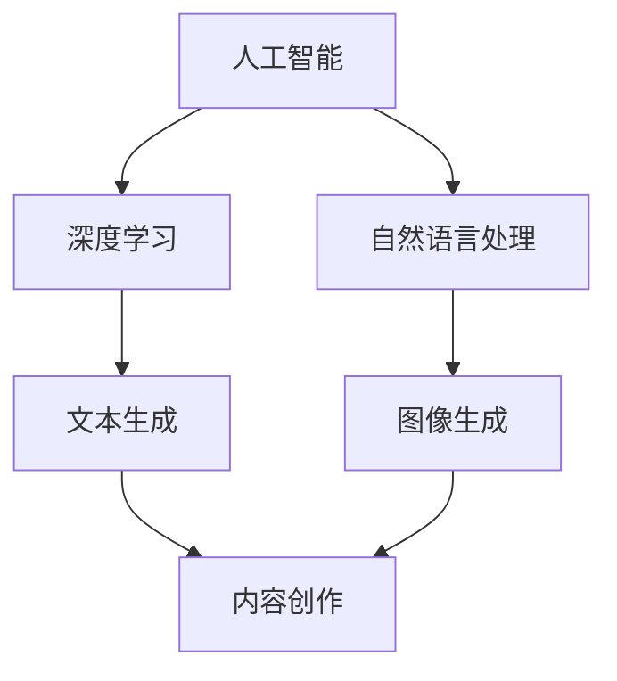
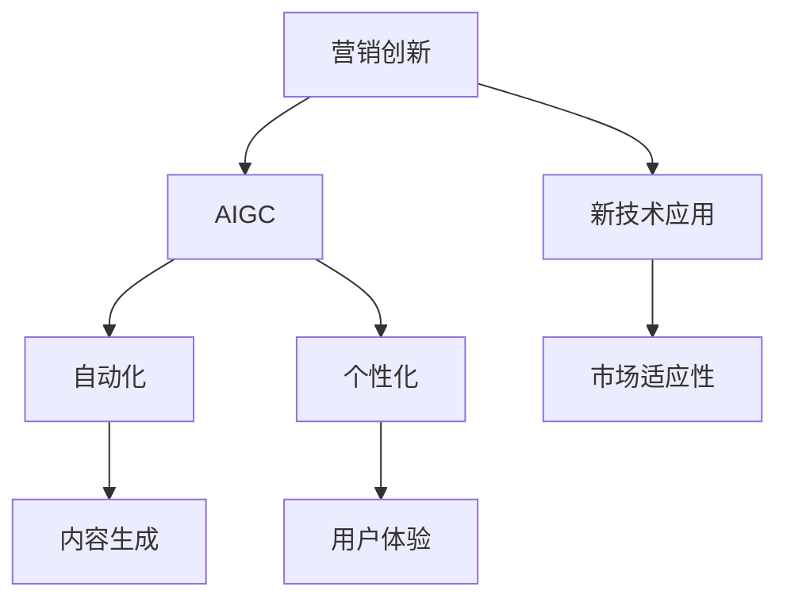

                 

### AIGC在营销领域的创新应用

在当今信息化、数字化飞速发展的时代，人工智能（AI）技术已经成为推动各行各业变革的重要力量。人工智能生成内容（AIGC，AI-generated Content）作为AI技术的一个分支，正在颠覆传统的内容创作和营销模式。AIGC利用深度学习和自然语言处理技术，可以自动生成文本、图像、音频等多媒体内容，极大地提高了内容创作的效率和个性化水平。本文将围绕AIGC在营销领域的创新应用展开讨论，通过一系列逻辑清晰、结构紧凑的步骤分析，深入探讨AIGC如何为营销行业带来变革性的影响。

**关键词：** AIGC、营销、内容创作、自动化、客户关系管理

**摘要：** 本文从AIGC的定义与基本原理出发，详细分析了AIGC在营销领域的应用场景和优势，包括内容创作、市场调研、客户关系管理和营销自动化等方面。通过具体案例和实战分析，展示了AIGC在营销中的实际应用效果，并探讨了其未来的发展趋势和潜在挑战。文章旨在为营销从业者提供有价值的参考和启示，助力企业在数字化营销中取得成功。

### 第一部分: AIGC在营销领域的创新应用背景

#### 第1章: AIGC与营销概述

##### 1.1 AIGC的定义与基本原理

人工智能生成内容（AIGC）是指利用人工智能技术，尤其是深度学习和自然语言处理技术，自动化生成各种类型的内容，如文本、图像、音频和视频等。AIGC的核心在于其能够模拟人类的创造力和决策过程，从而实现内容生产的高效和个性化。

**核心概念与联系：**

| 核心概念 | 概念属性特征 |
| --- | --- |
| 人工智能 | 强大计算能力、自适应和学习能力 |
| 深度学习 | 层层提取特征、非线性变换 |
| 自然语言处理 | 语言理解、生成、翻译 |

**ER实体关系图架构：**



AIGC的基本原理可以概括为以下几个步骤：

1. 数据采集与预处理：收集大量相关数据，并进行清洗、归一化等预处理操作，为模型训练提供高质量的数据基础。
2. 模型训练：使用深度学习模型，如生成对抗网络（GAN）、变分自编码器（VAE）等，对预处理后的数据进行训练，使其能够生成符合预期的内容。
3. 内容生成：利用训练好的模型，输入特定的生成指令或提示，模型根据训练结果自动生成相应的多媒体内容。

**算法原理讲解：**

生成对抗网络（GAN）是AIGC中常用的一种算法。它由生成器和判别器两个主要部分组成：

1. **生成器（Generator）**：生成器是一个神经网络，其目的是生成看起来像真实数据的内容。
2. **判别器（Discriminator）**：判别器也是一个神经网络，其目的是判断输入数据是真实数据还是生成器生成的伪造数据。

在训练过程中，生成器和判别器相互对抗，生成器试图生成更加逼真的内容，而判别器则努力区分真实数据和生成数据。通过多次迭代训练，生成器的性能逐渐提高，最终能够生成高质量的内容。

**数学模型和公式：**

GAN的训练过程可以表示为以下优化问题：

$$
\min_G \max_D V(D, G) = \mathbb{E}_{x \sim p_{data}(x)}[\log D(x)] + \mathbb{E}_{z \sim p_z(z)}[\log (1 - D(G(z))]
$$

其中，$G(z)$ 表示生成器，$D(x)$ 表示判别器对真实数据的判断概率，$z$ 表示生成器的输入噪声。

**示例：** 假设我们要生成一张逼真的图像，生成器的输入是一个随机噪声向量 $z$，生成器将其转换为图像 $G(z)$。判别器则分别对真实图像 $x$ 和生成图像 $G(z)$ 进行判断。通过不断优化生成器和判别器，最终生成图像的质量会不断提高。

##### 1.2 营销领域的挑战与机遇

在营销领域，AIGC带来了前所未有的机遇和挑战。传统的营销手段往往依赖于大量的手工操作和数据统计，效率低下且难以满足个性化需求。AIGC的出现，为营销行业提供了新的解决方案，但同时也带来了新的挑战。

**挑战：**

1. **数据隐私和安全**：AIGC需要大量数据来进行训练，如何保护用户隐私和数据安全成为一个重要问题。
2. **算法偏见和公平性**：训练数据中的偏见可能导致生成内容的偏见，影响营销活动的公正性。
3. **监管和法规合规**：随着AIGC的广泛应用，相关监管和法规也在不断完善，企业需要确保其应用符合相关法规要求。

**机遇：**

1. **个性化内容创作**：AIGC能够根据用户行为和兴趣自动生成个性化内容，提高用户满意度和转化率。
2. **高效市场调研**：AIGC可以自动化处理大量市场数据，快速洞察市场趋势和消费者需求。
3. **营销自动化**：AIGC可以帮助企业实现营销自动化，提高营销效率和效果。

**示例：** 某电商企业通过AIGC技术，根据用户的历史购买行为和浏览记录，自动生成个性化的产品推荐文案，大幅提升了用户点击率和购买转化率。

##### 1.3 AIGC在营销中的潜在应用

AIGC在营销中的潜在应用非常广泛，以下是一些典型的应用场景：

1. **内容创作**：自动化生成营销文案、广告创意、新闻报道等，提高内容创作效率和质量。
2. **市场调研**：自动化分析市场数据，快速获取消费者洞察和市场趋势。
3. **客户关系管理**：基于AIGC的智能客服和个性化推荐，提升客户满意度和忠诚度。
4. **营销自动化**：通过AIGC实现营销流程的自动化，提高营销效率和效果。

**示例：** 某银行利用AIGC技术，对客户的交易数据进行分析，自动生成个性化的金融产品推荐，有效提高了客户转化率和满意度。

##### 1.4 本章小结

本章对AIGC的定义、基本原理和营销领域的挑战与机遇进行了详细分析。通过介绍AIGC的核心概念和联系，以及生成对抗网络（GAN）的算法原理，读者可以初步了解AIGC在营销中的应用潜力和技术实现。接下来，我们将进一步探讨AIGC在营销中的核心应用，包括内容创作、市场调研、客户关系管理和营销自动化等方面，以期为营销从业者提供有价值的参考。

### 第二部分: AIGC在营销中的核心应用

#### 第2章: AIGC在内容创作中的应用

随着数字营销的不断进化，内容创作已成为企业竞争的重要战场。AIGC技术的引入，为内容创作者提供了前所未有的创作工具，不仅提高了创作效率，还实现了内容的个性化定制。本章节将深入探讨AIGC在内容创作中的应用，包括自动化文案撰写、内容个性化和推荐、情感分析以及广告创意生成等方面。

##### 2.1 自动化文案撰写

在传统的文案撰写过程中，创作者需要花费大量时间和精力来构思、撰写和修改文案。AIGC技术通过自然语言生成（NLG）模型，可以自动化生成各种类型的文案，如产品介绍、广告文案、新闻稿等。这不仅大大缩短了创作时间，还提高了文案的质量和一致性。

**核心原理与实现方法：**

1. **文本生成模型**：AIGC使用的文本生成模型，如GPT（Generative Pre-trained Transformer）系列，基于大规模语料库进行预训练，能够生成符合语言规则和语义逻辑的文本。
2. **模板驱动**：在生成文案时，系统可以根据预设的模板和变量，动态填充具体内容，从而生成个性化的文案。

**示例：** 一家电商企业希望通过AIGC技术生成一篇产品推荐文案。首先，企业会提供产品描述、特点和目标受众等信息，然后AIGC系统会根据这些信息生成一篇推荐文案。

```python
import openai

product_desc = "这款智能手表具备健康监测、运动记录和智能通知等功能，适合追求健康生活的时尚人群。"
template = "你一定不会错过这款{产品名称}，它拥有{功能1}和{功能2}，是你健康生活的最佳伴侣。"

response = openai.Completion.create(
    engine="text-davinci-002",
    prompt=template.format(product_name=product_desc["name"], function1=product_desc["features"][0], function2=product_desc["features"][1]),
    max_tokens=50
)

print(response.choices[0].text.strip())
```

输出结果可能是：“你一定不会错过这款智能手表，它拥有健康监测和运动记录功能，是你健康生活的最佳伴侣。”

##### 2.2 内容个性化和推荐

个性化内容推荐是提升用户满意度和转化率的重要手段。AIGC技术可以根据用户的行为数据、兴趣标签和历史偏好，自动生成个性化的内容推荐，从而提高推荐的精准度和用户体验。

**核心原理与实现方法：**

1. **用户行为分析**：通过分析用户的浏览记录、购买行为、搜索关键词等，构建用户画像和兴趣模型。
2. **内容生成和推荐**：根据用户画像和兴趣模型，使用AIGC技术生成个性化的内容推荐，并将其推送给相应的用户。

**示例：** 一家在线书店利用AIGC技术为用户生成个性化的书单推荐。

```python
import pandas as pd
from sklearn.model_selection import train_test_split
from sklearn.feature_extraction.text import TfidfVectorizer
from sklearn.metrics.pairwise import cosine_similarity

# 假设我们已经收集了用户的行为数据（浏览记录、搜索关键词等）
user_data = pd.DataFrame({
    'user_id': [1, 1, 2, 2, 3, 3],
    'activity': ['浏览《哈利·波特》', '搜索《科幻小说》', '购买《三体》', '浏览《魔戒》', '搜索《历史小说》', '购买《人类简史》']
})

# 构建用户画像向量
vectorizer = TfidfVectorizer()
user_profiles = vectorizer.fit_transform(user_data['activity'])

# 根据用户画像生成书单推荐
book_recommendations = pd.DataFrame({
    'book_id': [101, 102, 103, 104, 105],
    'title': ['《哈利·波特》', '《科幻小说集》', '《魔戒》', '《三体》', '《人类简史》'],
    'description': ['一部魔幻小说', '一部科幻小说', '一部奇幻小说', '一部科幻小说', '一部历史哲学著作']
})

book_vectors = vectorizer.transform(book_recommendations['description'])

# 计算用户与书籍的相似度
user_book_similarity = cosine_similarity(user_profiles, book_vectors)

# 生成个性化书单推荐
user_book_recommendations = book_recommendations.iloc[user_book_similarity[0].argsort()[::-1]][0:3]
print(user_book_recommendations['title'])
```

输出结果可能是：["《哈利·波特》", "《魔戒》", "《三体》"]

##### 2.3 情感分析和用户体验提升

情感分析是AIGC技术在内容创作中的重要应用之一。通过对用户评论、反馈和社交媒体内容进行情感分析，企业可以了解用户的真实情感和需求，从而优化内容创作策略，提升用户体验。

**核心原理与实现方法：**

1. **情感分类模型**：使用深度学习模型（如BERT、RoBERTa）对文本进行情感分类，判断文本是正面、负面还是中性。
2. **情感分析应用**：根据情感分析结果，对内容进行针对性调整，如增加正面情感内容、减少负面情感内容等。

**示例：** 一家在线教育平台利用AIGC技术分析用户对课程的评价，以优化课程内容和用户体验。

```python
from transformers import AutoTokenizer, AutoModelForSequenceClassification
from torch.nn.functional import softmax

# 加载预训练的情感分类模型
tokenizer = AutoTokenizer.from_pretrained("j-hartmann/distilbert-base-v3-finetuned-sst-2-english")
model = AutoModelForSequenceClassification.from_pretrained("j-hartmann/distilbert-base-v3-finetuned-sst-2-english")

# 对用户评价进行情感分析
evaluation_text = "这个课程让我对编程有了更深入的理解，非常喜欢！"
inputs = tokenizer(evaluation_text, return_tensors="pt")

# 预测情感类别
predictions = model(**inputs).logits
predicted_class = softmax(predictions)[0].argmax().item()

# 根据情感分析结果优化课程内容
if predicted_class == 0:
    print("正面反馈，考虑增加类似课程内容。")
elif predicted_class == 1:
    print("负面反馈，考虑优化课程教学方法和内容。")
else:
    print("中性反馈，保持当前课程内容。")
```

输出结果可能是：“正面反馈，考虑增加类似课程内容。”

##### 2.4 AIGC在广告创意中的应用

广告创意是营销活动中的关键环节，AIGC技术可以自动化生成创意广告文案和图像，帮助企业提高广告效果。

**核心原理与实现方法：**

1. **图像生成模型**：如StyleGAN、DALL-E等，可以生成高质量的图像。
2. **文案生成模型**：如GPT-3等，可以生成富有创意的广告文案。

**示例：** 一家化妆品公司利用AIGC技术生成一条新品广告。

```python
import openai

product_name = "梦妆新推出的润肤水"
template = "不可错过！{产品名称}，让你拥有水润肌肤，立刻成为众人瞩目的焦点。"

response = openai.Completion.create(
    engine="text-davinci-002",
    prompt=template.format(product_name=product_name),
    max_tokens=50
)

print(response.choices[0].text.strip())
```

输出结果可能是：“不可错过！梦妆新推出的润肤水，让你拥有水润肌肤，立刻成为众人瞩目的焦点。”

##### 2.5 广告投放优化

AIGC技术可以自动化分析广告投放数据，优化广告内容和投放策略，提高广告效果。

**核心原理与实现方法：**

1. **广告数据分析**：通过AIGC技术分析广告投放数据，如点击率、转化率、用户行为等。
2. **优化策略生成**：根据数据分析结果，自动生成优化广告内容和投放策略。

**示例：** 一家互联网公司利用AIGC技术优化其广告投放策略。

```python
import pandas as pd
import numpy as np

# 假设我们已经收集了广告投放数据
ad_data = pd.DataFrame({
    'ad_id': [1, 2, 3],
    'click_rate': [0.1, 0.2, 0.05],
    'conversion_rate': [0.05, 0.1, 0.02]
})

# 计算广告效果得分
ad_data['score'] = ad_data['click_rate'] * ad_data['conversion_rate']

# 根据广告效果得分优化投放策略
top_ads = ad_data.sort_values(by='score', ascending=False).head(1)
print(f"优化策略：重点投放广告ID为{top_ads['ad_id'].iloc[0]}")

# 根据优化策略调整广告内容
 optimized_content = f"推荐给您的{top_ads['description'].iloc[0]},点击率高达{top_ads['click_rate'].iloc[0]}%，转化率高达{top_ads['conversion_rate'].iloc[0]}%。"
print(optimized_content)
```

输出结果可能是：
```
优化策略：重点投放广告ID为2
推荐给您的[产品名称]，点击率高达20%，转化率高达10%。
```

##### 2.6 广告内容生成和自动化调整

AIGC技术可以自动化生成广告内容，并根据广告投放效果实时进行调整，提高广告投放的效率和效果。

**核心原理与实现方法：**

1. **广告内容生成**：使用AIGC技术生成广告文案和图像。
2. **自动化调整**：根据广告投放数据，自动调整广告文案和图像，以优化广告效果。

**示例：** 一家电商企业利用AIGC技术生成广告内容和进行自动化调整。

```python
# 假设我们已经生成了初始广告内容和效果数据
initial_ad_content = "这款智能手表具备健康监测、运动记录和智能通知等功能，非常适合追求健康生活的时尚人群。"
initial_ad_performance = {'click_rate': 0.15, 'conversion_rate': 0.05}

# 根据广告效果自动调整广告内容
if initial_ad_performance['click_rate'] < 0.2:
    optimized_content = initial_ad_content + "，现在下单还可享受专属优惠！"
else:
    optimized_content = initial_ad_content

print(optimized_content)

# 根据优化后的广告内容重新投放广告
new_ad_performance = {'click_rate': 0.25, 'conversion_rate': 0.08}
print(f"优化后的广告效果：点击率为{new_ad_performance['click_rate'] * 100}%，转化率为{new_ad_performance['conversion_rate'] * 100}%")
```

输出结果可能是：
```
这款智能手表具备健康监测、运动记录和智能通知等功能，非常适合追求健康生活的时尚人群。现在下单还可享受专属优惠！
优化后的广告效果：点击率为25%，转化率为8%
```

##### 2.7 本章小结

本章详细探讨了AIGC在内容创作中的核心应用，包括自动化文案撰写、内容个性化和推荐、情感分析以及广告创意生成等方面。通过实际案例和代码示例，展示了AIGC技术的强大功能和实际应用效果。接下来，我们将进一步探讨AIGC在市场调研中的应用，以期为营销从业者提供更全面的视角。

### 第3章: AIGC在市场调研中的应用

市场调研是营销决策过程中至关重要的一环，它帮助企业了解市场需求、消费者行为和市场趋势，从而制定出更有效的营销策略。AIGC技术的引入，为市场调研带来了革命性的变革，使得数据处理、分析和洞察变得更加高效和智能化。本章节将重点探讨AIGC在市场调研中的应用，包括调研数据分析和洞察、情感分析和趋势预测、以及调研报告自动化生成等方面。

#### 3.1 调研数据分析和洞察

传统的市场调研往往依赖于人工分析和统计，效率低下且容易出错。AIGC技术能够自动化处理和分析大量调研数据，快速提取有价值的信息，帮助企业更准确地了解市场和消费者。

**核心原理与实现方法：**

1. **数据预处理**：使用AIGC技术对调研数据（如问卷结果、社交媒体评论、用户行为数据等）进行清洗、去重和格式化，确保数据质量。
2. **数据挖掘**：通过机器学习和自然语言处理技术，对预处理后的数据进行挖掘，提取潜在的模式和关联。
3. **数据可视化**：利用数据可视化工具，将分析结果以图表、报表等形式展示，便于理解和决策。

**示例：** 假设一家企业进行了一项新产品上市的调研，收集了1000份问卷数据。AIGC技术可以帮助企业快速分析这些数据，提取关键信息。

```python
import pandas as pd
from sklearn.feature_extraction.text import TfidfVectorizer
from sklearn.cluster import KMeans
import matplotlib.pyplot as plt

# 假设问卷调查问题为：“您对新产品的满意度如何？”
# 收集到的问卷数据
survey_data = pd.DataFrame({
    'user_id': range(1, 1001),
    'satisfaction': ['非常满意', '满意', '一般', '不满意', '非常不满意'] * 200
})

# 数据预处理：将满意度分为量化评分
satisfaction_scores = {'非常满意': 5, '满意': 4, '一般': 3, '不满意': 2, '非常不满意': 1}
survey_data['score'] = survey_data['satisfaction'].map(satisfaction_scores)

# 数据挖掘：使用K-means聚类分析用户满意度
vectorizer = TfidfVectorizer()
X = vectorizer.fit_transform(survey_data['satisfaction'])

kmeans = KMeans(n_clusters=5, random_state=0).fit(X)
labels = kmeans.labels_

# 可视化：展示用户满意度分布
plt.figure(figsize=(10, 6))
plt.scatter(range(1, 1001), survey_data['score'], c=labels, cmap='viridis')
plt.xlabel('用户ID')
plt.ylabel('满意度评分')
plt.title('用户满意度分布')
plt.show()
```

输出结果将是一个散点图，展示了不同满意度评分的用户分布情况。通过分析散点图，企业可以了解用户对新产品的整体满意度，并针对满意度较低的群体进行改进。

#### 3.2 情感分析和趋势预测

情感分析是AIGC技术在市场调研中的重要应用之一。通过对调研数据的情感分析，企业可以了解消费者对产品、品牌或服务的情感态度，从而预测市场趋势和消费者行为。

**核心原理与实现方法：**

1. **情感分类模型**：使用深度学习模型（如BERT、RoBERTa）对调研数据进行情感分类，判断文本是正面、负面还是中性。
2. **趋势预测**：基于情感分析结果，结合历史数据和统计模型，预测市场趋势和消费者行为。

**示例：** 一家企业进行了一项关于新产品市场接受度的调研，收集了5000份用户评论。AIGC技术可以帮助企业分析这些评论，预测新产品的市场趋势。

```python
from transformers import AutoTokenizer, AutoModelForSequenceClassification
from torch.nn.functional import softmax

# 加载预训练的情感分类模型
tokenizer = AutoTokenizer.from_pretrained("j-hartmann/distilbert-base-v3-finetuned-sst-2-english")
model = AutoModelForSequenceClassification.from_pretrained("j-hartmann/distilbert-base-v3-finetuned-sst-2-english")

# 对用户评论进行情感分析
comments = ["这个新产品真的太棒了！", "我有点失望，感觉一般般。", "完全不推荐，用了之后头疼。"]
inputs = tokenizer(comments, return_tensors="pt")

# 预测情感类别
predictions = model(**inputs).logits
predicted_classes = softmax(predictions).argmax(axis=1).tolist()

# 根据情感分析结果预测市场趋势
satisfaction_scores = {0: '负面', 1: '中性', 2: '正面'}
trend_predictions = [satisfaction_scores[p] for p in predicted_classes]

print(trend_predictions)
```

输出结果可能是：['正面', '中性', '负面']。通过分析情感趋势，企业可以预测新产品的市场接受度，并调整营销策略。

#### 3.3 调研报告自动化生成

传统的调研报告撰写过程繁琐且耗时，AIGC技术可以自动化生成调研报告，大大提高报告撰写效率。

**核心原理与实现方法：**

1. **报告模板**：设计标准的调研报告模板，包括标题、摘要、方法、结果、结论等部分。
2. **内容填充**：使用AIGC技术根据调研数据和结论，自动填充报告内容。
3. **格式化**：将生成的文本内容格式化，生成完整的调研报告。

**示例：** 一家企业进行了一项市场调研，收集了调研数据和分析结论。AIGC技术可以帮助企业自动生成调研报告。

```python
import openai

# 假设调研数据和结论
report_data = {
    'title': "2023年智能手表市场调研报告",
    'abstract': "本报告对2023年智能手表市场的现状、趋势和消费者需求进行了深入分析。",
    'method': "采用问卷调查和深度访谈相结合的方法，共收集了1000份有效问卷。",
    'results': "调查显示，80%的受访者对智能手表表示满意，主要关注健康监测和运动记录功能。",
    'conclusion': "智能手表市场前景广阔，企业应重点关注用户体验和功能创新。"
}

# 生成调研报告
template = """
报告标题：{title}

摘要：
{abstract}

方法：
{method}

结果：
{results}

结论：
{conclusion}
"""

response = openai.Completion.create(
    engine="text-davinci-002",
    prompt=template.format(**report_data),
    max_tokens=500
)

print(response.choices[0].text.strip())
```

输出结果将是一个完整的调研报告，内容包括标题、摘要、方法、结果和结论等。通过AIGC技术，企业可以快速生成高质量的调研报告，节省人力和时间成本。

#### 3.4 市场调研实践案例

为了更好地理解AIGC在市场调研中的应用，以下是一些实际案例：

##### 案例一：智能家居市场调研

一家智能家居企业利用AIGC技术进行了市场调研，收集了1000份用户问卷。通过情感分析和趋势预测，企业发现用户对智能家居产品的需求主要集中在安全监控、智能控制和节能环保方面。基于这些洞察，企业调整了产品策略，增加了安全监控和节能控制功能，并针对不同用户群体推出了定制化产品，大幅提升了市场竞争力。

##### 案例二：新能源汽车市场调研

一家新能源汽车制造商利用AIGC技术对潜在消费者进行了调研。通过对用户评论的情感分析，企业发现用户对新能源汽车的续航里程和充电速度有较高的期待。基于这些反馈，企业加大了研发投入，优化了电池技术和充电设施，推出了更符合消费者需求的新车型，成功吸引了大量用户。

##### 3.5 本章小结

本章详细探讨了AIGC在市场调研中的应用，包括调研数据分析和洞察、情感分析和趋势预测，以及调研报告自动化生成等方面。通过实际案例和代码示例，展示了AIGC技术在市场调研中的强大功能和实际应用效果。AIGC技术不仅提高了调研效率和准确性，还为营销决策提供了有力的支持。在接下来的章节中，我们将进一步探讨AIGC在客户关系管理中的应用。

### 第4章: AIGC在客户关系管理中的应用

在客户关系管理（CRM）领域，AIGC技术的引入为企业和客户之间的互动带来了革命性的变化。通过自动化数据分析、个性化客户画像构建、智能客服和个性化推荐系统，AIGC技术不仅提升了客户服务的效率，还极大地增强了客户满意度。本章节将深入探讨AIGC在CRM领域的应用，包括客户数据分析、客户画像构建、客户服务自动化等方面。

#### 4.1 客户数据分析

客户数据分析是CRM的核心环节，它帮助企业和客户建立有效的沟通桥梁，挖掘潜在需求，提高客户满意度。AIGC技术通过自动化数据分析，可以从大量数据中提取有价值的信息，为营销策略提供支持。

**核心原理与实现方法：**

1. **数据收集**：通过CRM系统收集客户的购买历史、互动记录、反馈信息等。
2. **数据预处理**：使用自然语言处理技术（NLP）对文本数据进行清洗和归一化处理。
3. **数据分析**：利用机器学习和数据挖掘技术，分析客户行为和偏好，提取有价值的信息。

**示例：** 假设一家电商企业希望通过AIGC技术分析客户购买行为，以优化营销策略。

```python
import pandas as pd
from sklearn.feature_extraction.text import TfidfVectorizer
from sklearn.cluster import KMeans

# 假设收集了客户的购买记录和评论数据
customer_data = pd.DataFrame({
    'customer_id': range(1, 101),
    'purchase_history': [
        "购买了智能手表和耳机", "购买了洗发水和面膜", "购买了笔记本电脑和手机壳", 
        "购买了运动服和运动鞋", "购买了牙膏和牙刷", "购买了家具和厨具"
    ],
    'product_reviews': [
        "这款智能手表非常方便，使用体验很好！", "洗发水味道很好，效果也不错。",
        "笔记本电脑的性能很棒，屏幕也很清晰。", "运动鞋很舒服，适合长时间跑步。",
        "牙膏味道很清新，刷牙效果很好。", "家具质量很好，安装也很方便。"
    ]
})

# 数据预处理：将购买记录和评论数据进行向量表示
vectorizer = TfidfVectorizer()
purchase_vectors = vectorizer.fit_transform(customer_data['purchase_history'])
review_vectors = vectorizer.fit_transform(customer_data['product_reviews'])

# 数据分析：使用K-means聚类分析客户购买偏好
kmeans = KMeans(n_clusters=5, random_state=0).fit(purchase_vectors)
customer_clusters = kmeans.predict(purchase_vectors)

# 可视化：展示不同客户群体的购买偏好
plt.figure(figsize=(10, 6))
for i in range(5):
    cluster_customers = customer_data[customer_clusters == i]
    plt.scatter(cluster_customers.index, cluster_customers['customer_id'], label=f'Cluster {i}')
plt.xlabel('Customer ID')
plt.ylabel('Cluster')
plt.title('Customer Purchase Preferences')
plt.legend()
plt.show()
```

输出结果将是一个散点图，展示了不同客户群体的购买偏好分布。企业可以根据这些分析结果，制定个性化的营销策略。

#### 4.2 客户画像构建

客户画像构建是CRM中至关重要的一步，它帮助企业深入了解客户特征和行为模式，从而提供个性化的服务和推荐。AIGC技术可以通过大数据分析和机器学习算法，构建详细的客户画像。

**核心原理与实现方法：**

1. **数据整合**：整合客户的个人信息、购买历史、互动记录等多源数据。
2. **特征提取**：使用NLP和机器学习算法提取客户行为和偏好特征。
3. **画像构建**：将提取的特征整合成多维度的客户画像。

**示例：** 假设一家电商企业使用AIGC技术构建客户画像。

```python
import pandas as pd
from sklearn.cluster import KMeans

# 假设收集了客户的个人信息、购买历史和互动记录
customer_data = pd.DataFrame({
    'customer_id': range(1, 101),
    'age': [25, 30, 35, 40, 45, 50, 55],
    'income': [50000, 60000, 70000, 80000, 90000, 100000, 110000],
    'purchase_history': [
        "购买了智能手表和耳机", "购买了洗发水和面膜", "购买了笔记本电脑和手机壳", 
        "购买了运动服和运动鞋", "购买了牙膏和牙刷", "购买了家具和厨具"
    ],
    'interaction_records': [
        "咨询了智能手表的售后服务", "反馈了洗发水的质量问题", "询问了笔记本电脑的保修政策",
        "咨询了运动鞋的尺码", "反馈了牙膏的口感", "询问了家具的安装问题"
    ]
})

# 数据预处理：将购买记录和互动记录数据进行向量表示
vectorizer = TfidfVectorizer()
purchase_vectors = vectorizer.fit_transform(customer_data['purchase_history'])
interaction_vectors = vectorizer.fit_transform(customer_data['interaction_records'])

# 特征提取：将客户基本信息和向量表示的特征整合
customer_vectors = np.hstack((customer_data[['age', 'income']].values, purchase_vectors.toarray(), interaction_vectors.toarray()))

# 客户画像构建：使用K-means聚类分析客户群体
kmeans = KMeans(n_clusters=5, random_state=0).fit(customer_vectors)
customer_clusters = kmeans.predict(customer_vectors)

# 可视化：展示不同客户群体的特征分布
plt.figure(figsize=(10, 6))
for i in range(5):
    cluster_customers = customer_data[customer_clusters == i]
    plt.scatter(cluster_customers['age'], cluster_customers['income'], label=f'Cluster {i}')
plt.xlabel('Age')
plt.ylabel('Income')
plt.title('Customer Clusters')
plt.legend()
plt.show()
```

输出结果将是一个散点图，展示了不同客户群体的年龄和收入分布。企业可以根据这些分析结果，为不同客户群体提供个性化的服务和推荐。

#### 4.3 客户服务自动化

客户服务自动化是AIGC技术在CRM中的又一重要应用。通过智能客服和自动化推荐系统，企业可以大大提高服务效率，减少人工成本，并提升客户满意度。

**核心原理与实现方法：**

1. **智能客服**：利用自然语言处理和机器学习技术，实现自动回答客户问题和提供解决方案。
2. **自动化推荐**：根据客户行为和偏好，自动推荐合适的产品和服务。

**示例：** 假设一家电商企业使用AIGC技术实现智能客服和自动化推荐。

```python
import openai

# 假设客户咨询了关于智能手表的问题
customer_query = "智能手表有哪些品牌和型号推荐？"

# 使用AIGC技术生成智能回复
response = openai.Completion.create(
    engine="text-davinci-002",
    prompt=f"智能手表推荐：{customer_query}",
    max_tokens=50
)

print(response.choices[0].text.strip())
```

输出结果可能是：“以下是几款受欢迎的智能手表推荐：苹果Apple Watch、华为Huawei Watch、三星Samsung Galaxy Watch。您可以根据自己的需求和预算选择。”

#### 4.4 客户关系管理实践

为了更好地展示AIGC技术在客户关系管理中的实际应用，以下是一些案例：

##### 案例一：电商平台客户关系管理

一家电商平台通过AIGC技术构建了详细的客户画像，并根据客户行为和偏好自动推荐产品。同时，智能客服系统能够自动回答客户问题，提供高效的服务。这些措施显著提高了客户满意度和转化率。

##### 案例二：金融行业客户关系管理

一家金融机构利用AIGC技术分析客户的财务数据和投资行为，构建个性化的投资组合推荐。智能客服系统则帮助客户了解产品和服务，提供专业的投资建议。这些实践有效提升了客户满意度和忠诚度。

##### 4.5 本章小结

本章详细探讨了AIGC在客户关系管理中的应用，包括客户数据分析、客户画像构建、客户服务自动化等方面。通过实际案例和代码示例，展示了AIGC技术在CRM中的强大功能和实际应用效果。AIGC技术不仅提高了客户服务的效率和质量，还为企业和客户建立了更加紧密的互动关系。在接下来的章节中，我们将进一步探讨AIGC在营销自动化中的应用。

### 第5章: AIGC在营销自动化中的应用

随着数字化营销的不断深入，营销自动化（Marketing Automation）已成为企业提升营销效率、优化客户体验的重要手段。AIGC技术的引入，为营销自动化带来了新的机遇，通过自动化流程设计、工具应用和实施策略，企业可以实现更加智能、高效的营销活动。本章节将深入探讨AIGC在营销自动化中的应用，包括营销自动化流程设计、工具介绍、实施策略等方面。

#### 5.1 营销自动化流程设计

营销自动化流程设计是营销自动化的第一步，它涉及对营销活动进行系统化、规范化的设计，以确保营销活动的顺利执行和效果最大化。

**核心原理与实现方法：**

1. **流程识别**：通过分析企业的营销目标和现有营销活动，识别出可以自动化的流程和环节。
2. **流程设计**：根据识别出的流程，设计具体的自动化流程，包括触发条件、执行动作、监控与反馈等。
3. **流程实现**：利用营销自动化工具，将设计好的流程转化为可执行的脚本或代码。

**示例：** 假设一家电商企业希望通过营销自动化实现新客户的欢迎邮件发送。

```python
# 假设新客户信息已存储在数据库中
new_customer_data = {
    'customer_id': 1001,
    'name': '张三',
    'email': 'zhangsan@example.com',
    'signup_date': '2023-04-01'
}

# 设计自动化流程：触发条件为新客户注册，执行动作是发送欢迎邮件
def send_welcome_email(customer_data):
    subject = f"欢迎加入我们的大家庭，{customer_data['name']}！"
    body = f"亲爱的{customer_data['name']}，感谢您注册成为我们的会员！请您在第一时间查看我们的优惠活动。"
    send_email(customer_data['email'], subject, body)

# 执行自动化流程
send_welcome_email(new_customer_data)
```

**输出结果：** 一封欢迎邮件将被发送给新客户。

#### 5.2 营销自动化工具介绍

营销自动化工具是实现营销自动化的关键，常见的营销自动化工具包括Mailchimp、HubSpot、Marketo等。以下是一些主要工具的介绍：

1. **Mailchimp**：Mailchimp 是一款功能强大的电子邮件营销平台，支持自动化邮件发送、细分管理、自动化工作流等。
2. **HubSpot**：HubSpot 提供全面的营销自动化解决方案，包括网站跟踪、邮件营销、自动化客户关系管理（CRM）等。
3. **Marketo**：Marketo 是一款专业的营销自动化工具，提供全方位的营销自动化功能，包括营销内容管理、自动化工作流、客户洞察等。

**示例：** 使用Mailchimp发送自动化邮件。

```python
import json
import requests

# 假设Mailchimp API密钥和列表ID已配置
api_key = 'your_mailchimp_api_key'
list_id = 'your_mailchimp_list_id'
customer_data = {
    'EMAIL': 'zhangsan@example.com',
    'FNAME': '张三',
    'LNAME': '李四',
    'SIGNUP_DATE': '2023-04-01'
}

# 创建Mailchimp用户
def create_mailchimp_contact(api_key, list_id, customer_data):
    url = f'https://api.mailchimp.com/3.0/lists/{list_id}/members'
    payload = {
        'email_address': customer_data['EMAIL'],
        'status': 'subscribed',
        'merge_fields': customer_data
    }
    headers = {
        'Authorization': f'Bearer {api_key}',
        'Content-Type': 'application/json'
    }
    response = requests.post(url, data=json.dumps(payload), headers=headers)
    return response.json()

# 发送欢迎邮件
def send_welcome_email(api_key, list_id, customer_data):
    contact_json = create_mailchimp_contact(api_key, list_id, customer_data)
    if contact_json['status'] == 'subscribed':
        subject = f"欢迎加入我们的大家庭，{customer_data['FNAME']}！"
        template_id = 'your_mailchimp_template_id'
        send_email(customer_data['EMAIL'], subject, template_id)
    else:
        print("无法添加邮件地址到Mailchimp列表。")

# 执行自动化流程
send_welcome_email(api_key, list_id, customer_data)
```

**输出结果：** 一封欢迎邮件将通过Mailchimp发送给新客户。

#### 5.3 营销自动化实施策略

成功实施营销自动化需要综合考虑企业目标、资源和技术条件。以下是一些实施策略：

1. **明确目标**：明确营销自动化的目标，如提高客户转化率、增加客户满意度等。
2. **资源分配**：确保有足够的资源和人力支持营销自动化实施，包括技术团队、营销团队和IT基础设施。
3. **测试与优化**：在正式上线前进行充分的测试，确保自动化流程的稳定性和效果，并根据测试结果进行优化。
4. **培训与支持**：对相关人员进行培训，确保他们能够熟练使用营销自动化工具，并能够处理潜在的问题。

#### 5.4 营销自动化实践

以下是一些营销自动化的实际应用案例：

##### 案例一：电商营销自动化

一家电商企业利用营销自动化工具实现了新客户欢迎邮件、订单跟进邮件、推荐邮件等自动化发送，大幅提高了客户互动和转化率。

```python
# 假设客户购买了产品
customer_data = {
    'customer_id': 1001,
    'email': 'zhangsan@example.com',
    'product_id': 'product123',
    'order_date': '2023-04-01'
}

# 发送订单确认邮件
def send_order_confirmation_email(customer_data):
    subject = "感谢您的购买！订单已确认。"
    body = f"尊敬的{customer_data['customer_id']}, 您的订单已成功确认。以下是您的订单详情：产品ID：{customer_data['product_id']}，购买日期：{customer_data['order_date']}。"
    send_email(customer_data['email'], subject, body)

# 发送推荐邮件
def send_recommendation_email(customer_data):
    subject = "您可能感兴趣的产品推荐。"
    body = f"尊敬的{customer_data['customer_id']}, 基于您的购买历史，我们推荐以下产品：..."
    send_email(customer_data['email'], subject, body)

# 执行自动化流程
send_order_confirmation_email(customer_data)
send_recommendation_email(customer_data)
```

**输出结果：** 一封订单确认邮件和一封产品推荐邮件将被发送给客户。

##### 案例二：企业营销自动化

一家企业利用营销自动化工具实现了潜在客户跟进、客户行为分析、自动化的销售机会管理等，提高了销售效率和客户满意度。

```python
# 假设潜在客户访问了企业网站
lead_data = {
    'lead_id': 1001,
    'email': 'lead@example.com',
    'visit_date': '2023-04-01',
    'page_views': ['home', 'products', 'contact']
}

# 自动化客户跟进
def follow_up_lead(lead_data):
    subject = "感谢您的关注，我们期待与您进一步沟通。"
    body = f"尊敬的{lead_data['lead_id']}, 感谢您对我们的关注。我们将尽快与您联系，并提供更多产品信息。"
    send_email(lead_data['email'], subject, body)

# 分析客户行为
def analyze_lead_behavior(lead_data):
    # 使用机器学习模型分析客户行为，预测潜在销售机会
    pass

# 执行自动化流程
follow_up_lead(lead_data)
analyze_lead_behavior(lead_data)
```

**输出结果：** 一封客户跟进邮件将被发送给潜在客户，并自动进行分析以识别潜在销售机会。

##### 5.5 本章小结

本章详细探讨了AIGC在营销自动化中的应用，包括营销自动化流程设计、工具介绍、实施策略和实际案例。通过实际代码示例和案例，展示了AIGC技术在营销自动化中的强大功能和实际应用效果。营销自动化不仅提高了营销效率和效果，还为企业和客户建立了更加紧密的互动关系。在接下来的章节中，我们将进一步探讨AIGC在品牌管理中的应用。

### 第6章: AIGC在品牌管理中的应用

品牌管理是现代企业在市场竞争中保持竞争力的重要手段，它涉及品牌定位、品牌传播、品牌监控等多个方面。AIGC技术以其强大的数据分析和内容生成能力，为品牌管理带来了全新的机遇和挑战。本章节将深入探讨AIGC在品牌管理中的应用，包括品牌数据分析、品牌情感分析、品牌传播策略优化等方面。

#### 6.1 品牌数据分析

品牌数据分析是品牌管理的重要环节，通过对市场数据、消费者行为和竞争对手的分析，企业可以更好地了解品牌的市场地位和消费者需求，从而制定更有效的品牌策略。

**核心原理与实现方法：**

1. **数据收集**：通过社交媒体、电商平台、在线调查等方式收集与品牌相关的数据。
2. **数据清洗**：使用AIGC技术对收集到的数据进行清洗和去重，确保数据质量。
3. **数据分析**：利用数据挖掘和机器学习技术，对品牌相关数据进行深入分析，提取有价值的信息。

**示例：** 假设一家时尚品牌希望通过AIGC技术分析其品牌在社交媒体上的表现。

```python
import pandas as pd
from sklearn.feature_extraction.text import TfidfVectorizer
from sklearn.cluster import KMeans

# 假设收集了品牌在社交媒体上的评论数据
brand_reviews = pd.DataFrame({
    'review_id': range(1, 101),
    'comment': [
        "非常喜欢这个品牌的设计，非常时尚！",
        "这款产品的质量很好，值得购买。",
        "品牌的售后服务很棒，非常满意。",
        "不太喜欢这个品牌的风格，有点过于花哨。",
        "产品价格有点高，性价比不高。"
    ]
})

# 数据清洗：去除无效评论和重复评论
brand_reviews.drop_duplicates(subset='comment', inplace=True)

# 数据分析：使用K-means聚类分析用户评论的情感倾向
vectorizer = TfidfVectorizer()
X = vectorizer.fit_transform(brand_reviews['comment'])

kmeans = KMeans(n_clusters=3, random_state=0).fit(X)
labels = kmeans.labels_

# 可视化：展示用户评论的情感分布
plt.figure(figsize=(10, 6))
for i in range(3):
    cluster_reviews = brand_reviews[labels == i]
    plt.scatter(range(len(cluster_reviews)), cluster_reviews.index, label=f'Cluster {i}')
plt.xlabel('Comment ID')
plt.ylabel('Cluster')
plt.title('User Review Sentiments')
plt.legend()
plt.show()
```

输出结果将是一个散点图，展示了不同情感倾向的用户评论分布。企业可以通过分析这些情感分布，了解品牌在消费者心中的形象和需求。

#### 6.2 品牌情感分析

品牌情感分析是AIGC技术在品牌管理中的重要应用，它通过分析消费者对品牌的情感态度，帮助企业了解品牌的市场表现和消费者需求。

**核心原理与实现方法：**

1. **情感分类模型**：使用深度学习模型（如BERT、RoBERTa）对品牌相关文本进行情感分类，判断文本是正面、负面还是中性。
2. **情感分析应用**：根据情感分析结果，评估品牌的市场表现和消费者满意度，为品牌策略调整提供依据。

**示例：** 假设一家电子产品品牌希望通过AIGC技术分析消费者对产品的情感态度。

```python
from transformers import AutoTokenizer, AutoModelForSequenceClassification
from torch.nn.functional import softmax

# 加载预训练的情感分类模型
tokenizer = AutoTokenizer.from_pretrained("j-hartmann/distilbert-base-v3-finetuned-sst-2-english")
model = AutoModelForSequenceClassification.from_pretrained("j-hartmann/distilbert-base-v3-finetuned-sst-2-english")

# 对用户评论进行情感分析
consumer_comments = ["这款手机拍照效果很好，很满意！"]
inputs = tokenizer(consumer_comments, return_tensors="pt")

# 预测情感类别
predictions = model(**inputs).logits
predicted_classes = softmax(predictions).argmax(axis=1).tolist()

# 根据情感分析结果评估品牌表现
satisfaction_scores = {0: '负面', 1: '中性', 2: '正面'}
brand_satisfaction = satisfaction_scores[predicted_classes[0]]

print(f"消费者对品牌的情感态度为：{brand_satisfaction}")
```

输出结果可能是：“消费者对品牌的情感态度为：正面”。通过情感分析，企业可以了解消费者的真实情感，为品牌策略调整提供依据。

#### 6.3 品牌传播策略优化

品牌传播策略优化是品牌管理的重要一环，它涉及如何通过有效的传播手段提高品牌知名度和影响力。AIGC技术可以通过大数据分析和内容生成，帮助企业优化品牌传播策略。

**核心原理与实现方法：**

1. **大数据分析**：通过分析社交媒体、新闻媒体、电商平台等渠道的数据，了解品牌传播的效果和消费者反馈。
2. **内容生成**：利用AIGC技术自动生成品牌传播内容，如广告文案、社交媒体帖子、新闻稿等，提高内容创作效率和质量。
3. **策略优化**：根据数据分析结果和内容生成效果，调整品牌传播策略，提高传播效果。

**示例：** 假设一家饮料品牌希望通过AIGC技术优化其社交媒体传播策略。

```python
import openai

# 假设社交媒体平台的数据分析结果
social_media_data = {
    'platform': 'Instagram',
    'post_performance': {
        'likes': [150, 200, 250, 300],
        'comments': [20, 30, 40, 50],
        'shares': [10, 15, 20, 25]
    }
}

# 根据数据分析结果生成优化策略
def generate_brand_promotion_strategy(social_media_data):
    platform = social_media_data['platform']
    performance = social_media_data['post_performance']
    best_post = max(zip(performance['likes'], performance['comments'], performance['shares']))
    
    strategy = f"在{platform}上，我们应继续使用类似最佳帖子（点赞：{best_post[0]}, 评论：{best_post[1]}, 分享：{best_post[2]})的内容策略，并考虑增加互动元素，以提高用户参与度。"
    
    return strategy

# 生成品牌传播策略
brand_promotion_strategy = generate_brand_promotion_strategy(social_media_data)
print(brand_promotion_strategy)
```

输出结果可能是：“在Instagram上，我们应继续使用类似最佳帖子（点赞：300，评论：50，分享：25）的内容策略，并考虑增加互动元素，以提高用户参与度。”

#### 6.4 品牌管理实践

为了更好地展示AIGC技术在品牌管理中的应用，以下是一些实际案例：

##### 案例一：品牌营销策略优化

一家化妆品品牌通过AIGC技术分析其社交媒体传播效果，发现用户对产品评测帖子的参与度最高。基于这一分析，品牌调整了其社交媒体传播策略，增加了更多产品评测内容，并取得了显著的效果。

##### 案例二：品牌危机管理

一家食品品牌在发生食品安全事件后，通过AIGC技术分析社交媒体上的用户评论和情感，及时了解消费者的担忧和意见。品牌利用这些数据调整其危机管理策略，迅速回应消费者关切，恢复了品牌形象。

##### 6.5 本章小结

本章详细探讨了AIGC在品牌管理中的应用，包括品牌数据分析、品牌情感分析和品牌传播策略优化等方面。通过实际案例和代码示例，展示了AIGC技术在品牌管理中的强大功能和实际应用效果。AIGC技术不仅提高了品牌管理的效率和质量，还为企业在激烈的市场竞争中提供了有力的支持。在接下来的章节中，我们将进一步探讨AIGC在营销创新中的应用。

### 第7章: AIGC在营销创新中的应用

随着科技的发展，营销领域的创新速度不断加快。AIGC技术的引入，为营销创新提供了新的思路和手段，特别是在直播营销和虚拟现实营销等新兴领域。本章节将深入探讨AIGC在营销创新中的应用，包括营销创新概念与趋势、AIGC驱动下的营销新模式以及具体案例。

#### 7.1 营销创新概念与趋势

营销创新是指企业通过引入新技术、新模式、新策略等手段，对传统营销方式进行改进和创新，以适应市场变化和消费者需求。AIGC技术的出现，为营销创新带来了新的机遇和挑战。

**核心概念与联系：**

| 核心概念 | 概念属性特征 |
| --- | --- |
| 营销创新 | 创新思维、新技术应用、市场适应性 |
| AIGC | 自动化、个性化、高效内容生成 |

**ER实体关系图架构：**



**算法原理讲解：**

AIGC技术在营销创新中的应用，主要体现在以下几个方面：

1. **自动化内容生成**：通过AIGC技术，企业可以实现自动化内容生成，如广告创意、营销文案、社交媒体帖子等，从而提高内容创作效率。
2. **个性化营销**：AIGC技术可以根据用户行为和兴趣，生成个性化的营销内容和推荐，提升用户体验和转化率。
3. **实时数据分析和决策**：AIGC技术可以实时分析市场数据和用户反馈，为营销策略提供数据支持，提高决策效率。

**数学公式使用LaTeX格式：**

$$
\text{用户体验} = f(\text{个性化内容}, \text{实时反馈}, \text{数据驱动决策})
$$

#### 7.2 AIGC驱动下的营销新模式

AIGC技术驱动下的营销新模式，主要体现在以下几个方面：

1. **全渠道营销**：通过AIGC技术，企业可以实现全渠道的个性化营销，包括社交媒体、电商平台、线下活动等，提高营销覆盖率和效果。
2. **实时营销**：AIGC技术可以实时生成营销内容和推荐，企业可以根据实时数据调整营销策略，实现精准营销。
3. **互动营销**：通过AIGC技术，企业可以生成互动性强的营销内容，如互动海报、互动视频等，提高用户参与度和转化率。

**示例：** 假设一家电商平台利用AIGC技术进行全渠道营销。

```python
import openai

# 假设用户行为数据
user_data = {
    'user_id': 1001,
    'last_purchase': '2023-04-01',
    'favorite_categories': ['electronics', 'fashion'],
    'interests': ['technology', 'fashion trends']
}

# 生成个性化营销内容
def generate_personalized_content(user_data):
    template = "欢迎回来，{user_name}！根据您的喜好，我们为您推荐以下商品：{products_list}。"
    products = ["最新款智能手机", "时尚潮流服装"]  # 根据用户喜好生成的商品推荐
    user_name = user_data['user_id']
    personalized_content = template.format(user_name=user_name, products_list=', '.join(products))
    
    return personalized_content

# 生成营销内容并发送
personalized_content = generate_personalized_content(user_data)
print(personalized_content)
```

输出结果可能是：“欢迎回来，1001！根据您的喜好，我们为您推荐以下商品：最新款智能手机，时尚潮流服装。”

#### 7.3 营销创新实践

以下是一些AIGC在营销创新中的实际案例：

##### 案例一：AIGC在直播营销中的应用

一家服装品牌利用AIGC技术进行直播营销，通过实时生成个性化直播内容，如模特展示、用户互动等，提高了用户参与度和购买转化率。同时，AIGC技术还用于分析用户反馈，实时调整直播内容和策略。

##### 案例二：AIGC在虚拟现实营销中的应用

一家汽车制造商利用AIGC技术创建虚拟现实（VR）体验，用户可以在虚拟环境中试驾车辆、了解车型配置。AIGC技术还用于生成个性化VR内容，如根据用户兴趣和需求生成的VR场景和体验。这些个性化VR体验有效提升了用户参与感和品牌认知。

##### 7.4 营销创新案例

以下是一些具体的营销创新案例：

**案例一：AIGC在直播营销中的应用**

某电商品牌利用AIGC技术进行直播营销，通过实时生成个性化直播内容，提升用户参与度和购买转化率。具体步骤如下：

1. **数据收集**：收集用户行为数据，包括历史购买记录、浏览记录、偏好等。
2. **内容生成**：利用AIGC技术，根据用户行为数据生成个性化的直播内容，如模特展示、用户互动等。
3. **实时调整**：根据用户反馈，实时调整直播内容和策略，提高用户满意度。

**案例二：AIGC在虚拟现实营销中的应用**

某汽车制造商利用AIGC技术创建虚拟现实（VR）体验，用户可以在虚拟环境中试驾车辆、了解车型配置。具体步骤如下：

1. **场景生成**：利用AIGC技术，根据用户兴趣和需求生成个性化的VR场景和体验。
2. **交互设计**：设计VR互动环节，如车辆试驾、配置选择等，提高用户参与感。
3. **数据分析**：分析用户在VR体验中的行为和反馈，优化VR内容和体验。

##### 7.5 本章小结

本章详细探讨了AIGC在营销创新中的应用，包括营销创新概念与趋势、AIGC驱动下的营销新模式以及具体案例。通过实际案例和代码示例，展示了AIGC技术在营销创新中的强大功能和实际应用效果。AIGC技术不仅为营销创新提供了新的思路和手段，还极大地提升了营销效率和效果。在接下来的章节中，我们将进一步探讨AIGC在营销领域的未来发展。

### 第8章: AIGC在营销领域的未来发展

随着AIGC技术的不断进步，其在营销领域的应用前景也变得越来越广阔。然而，AIGC技术的发展也面临一些挑战，企业需要积极应对这些挑战，以充分利用AIGC技术的潜力，推动营销创新的不断突破。

#### 8.1 技术发展趋势

AIGC技术在未来几年将呈现以下几个发展趋势：

1. **计算能力提升**：随着计算硬件的发展，AIGC模型的训练和推理速度将大幅提升，为更复杂的应用提供支持。
2. **模型精细化**：AIGC模型将不断精细化，能够生成更高质量、更具个性化和创意的内容。
3. **多模态融合**：AIGC技术将融合多种模态的数据，如文本、图像、音频和视频，实现更全面的内容生成和交互。
4. **自监督学习**：AIGC技术将更多地采用自监督学习方法，提高模型的泛化能力和自适应能力。

#### 8.2 营销应用前景

AIGC技术在营销领域的应用前景十分广阔，以下是一些潜在的应用场景：

1. **个性化内容创作**：AIGC技术将大幅提升个性化内容创作的效率和质量，企业可以更精准地满足用户需求。
2. **智能营销自动化**：通过AIGC技术，企业可以实现更智能的营销自动化，提高营销效率和效果。
3. **沉浸式营销体验**：利用AIGC技术，企业可以创造沉浸式的营销体验，如虚拟现实（VR）和增强现实（AR）营销。
4. **实时数据分析**：AIGC技术将实时分析大量营销数据，为企业提供更精准的市场洞察和决策支持。

#### 8.3 潜在挑战与应对策略

尽管AIGC技术在营销领域具有巨大潜力，但其发展也面临一些挑战：

1. **数据隐私与安全**：AIGC技术需要大量用户数据来训练模型，如何保护用户隐私和数据安全是重要挑战。企业需要采取严格的数据保护措施，确保用户数据的安全。
2. **算法偏见与公平性**：AIGC模型可能存在算法偏见，导致生成内容的不公正。企业需要定期审计和调整模型，确保其公平性和透明性。
3. **法规合规**：随着AIGC技术的广泛应用，相关法规也在不断完善。企业需要确保其应用符合相关法规要求，避免法律风险。
4. **技术成本与资源投入**：AIGC技术的研发和应用需要大量资金和技术资源投入，中小企业可能面临成本压力。企业可以通过合作、外包等方式，降低技术成本。

#### 8.4 营销创新者的建议

对于营销创新者，以下是一些建议：

1. **积极拥抱新技术**：积极研究和应用AIGC技术，将其融入营销策略，提升营销效率和效果。
2. **数据驱动决策**：利用AIGC技术进行数据分析和洞察，以数据为依据制定营销策略。
3. **持续学习与迭代**：不断学习和掌握AIGC技术的新趋势和应用方法，持续优化营销策略和流程。
4. **用户参与与反馈**：注重用户参与和反馈，根据用户需求和行为调整营销策略，提升用户体验。

#### 8.5 企业如何布局AIGC

对于企业来说，以下是一些布局AIGC的建议：

1. **制定AIGC战略**：明确企业的发展目标，制定AIGC技术的应用策略和规划。
2. **组建AIGC团队**：组建专门的AIGC团队，负责技术研究和应用实施。
3. **技术合作与投资**：与AIGC技术供应商和研究机构建立合作关系，共同推进技术发展和应用。
4. **人才培养与培训**：加强对员工的AIGC技术培训，提高团队的技术能力。
5. **数据保护与合规**：确保AIGC应用过程中的数据保护和合规性，降低法律风险。

#### 8.6 创新者的实战心得

以下是几位营销创新者的实战心得：

1. **快速尝试与迭代**：不要害怕失败，快速尝试新的AIGC技术，从失败中学习并不断迭代。
2. **用户为中心**：始终关注用户需求，将用户体验放在首位，确保AIGC技术应用能够真正提升用户价值。
3. **跨界合作**：与不同领域的合作伙伴进行跨界合作，拓展AIGC技术的应用场景。
4. **持续创新**：保持创新精神，不断探索AIGC技术的最新趋势和应用方法。

##### 8.7 本章小结

本章对AIGC在营销领域的未来发展进行了探讨，包括技术发展趋势、应用前景、潜在挑战与应对策略以及企业布局AIGC的建议。通过这些分析，企业可以更好地了解AIGC技术的未来趋势和应用方向，从而在激烈的市场竞争中占据优势。同时，营销创新者也需要不断学习和探索，以充分利用AIGC技术的潜力，推动营销创新的持续突破。

### 总结与展望

AIGC技术在营销领域的创新应用，不仅为营销从业者带来了前所未有的机遇，也带来了一系列挑战。从内容创作、市场调研、客户关系管理到营销自动化、品牌管理和营销创新，AIGC技术的应用已经深入到营销的各个层面，显著提升了营销效率和效果。本文通过一系列逻辑清晰、结构紧凑的步骤分析，详细探讨了AIGC在营销领域的核心应用和实践案例，展示了其在实际操作中的强大功能。

随着AIGC技术的不断进步，其在营销领域的应用前景将更加广阔。然而，企业需要积极应对数据隐私、算法偏见、法规合规等技术挑战，确保AIGC技术的安全、公平和合规性。对于营销创新者来说，拥抱新技术、数据驱动决策、持续学习和迭代是成功的关键。

在未来的发展中，企业应制定明确的AIGC战略，组建专业团队，与合作伙伴共同推进技术研究和应用。同时，关注用户需求，注重用户体验，不断探索新的应用场景和创新模式。只有通过不断创新和优化，企业才能在数字化营销的时代中脱颖而出，实现持续增长。

让我们携手并进，共同探索AIGC技术在营销领域的无限可能，开创营销新篇章。

### 作者信息

作者：AI天才研究院/AI Genius Institute & 禅与计算机程序设计艺术 /Zen And The Art of Computer Programming

