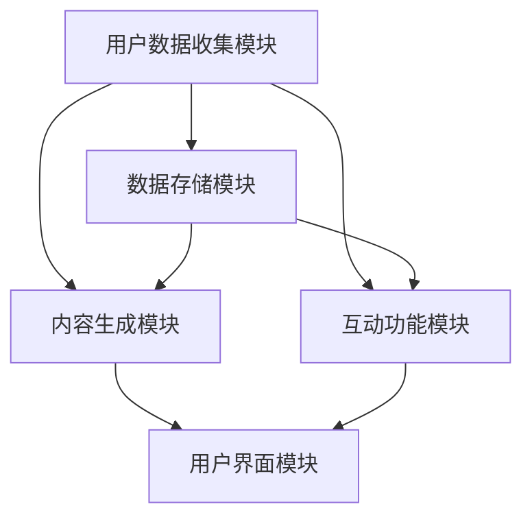
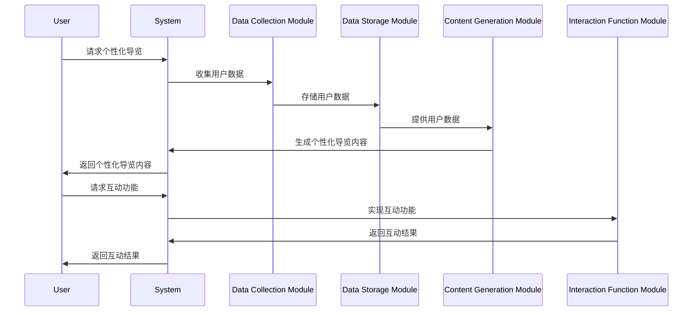

                 

## AIGC在虚拟博物馆体验设计中的创新

### 核心概念与联系

#### 虚拟博物馆概念

虚拟博物馆是一种通过数字化技术，将实体博物馆的藏品、展览、讲解等通过虚拟方式呈现给观众的新型展示方式。与传统实体博物馆相比，虚拟博物馆具有以下核心特性：

1. **虚拟性**：虚拟博物馆利用虚拟现实（VR）、增强现实（AR）等数字技术，将实体藏品以数字形式展示，观众可以通过虚拟环境体验和浏览。
2. **互动性**：虚拟博物馆提供丰富的互动功能，如虚拟导览、互动问答、虚拟互动游戏等，增强了观众的参与感和体验感。
3. **共享性**：虚拟博物馆不受地理位置和时间的限制，观众可以随时随地访问博物馆，实现全球共享。
4. **维度**：虚拟博物馆通常提供三维空间体验，比二维的实体博物馆更加立体和沉浸。

#### AIGC技术概念

AIGC（AI-Generated Content）是一种通过人工智能算法自动生成内容的技术。AIGC技术具有以下核心特性：

1. **数据依赖**：AIGC技术依赖大规模数据集进行训练，从而学习到生成各种类型内容的能力。
2. **生成速度**：AIGC技术能够快速生成内容，相对于传统的手工创作，效率大幅提升。
3. **内容多样性**：AIGC技术可以生成多种类型的内容，如图像、文本、音频等，满足不同的应用需求。
4. **个性定制**：AIGC技术可以根据用户需求，实现个性化内容生成，提高用户体验。

#### 虚拟博物馆与AIGC技术的关系

虚拟博物馆与AIGC技术的结合，可以为博物馆带来以下创新：

1. **个性化导览**：利用AIGC技术，可以生成针对不同观众需求的个性化导览内容，提高观众的参与度和满意度。
2. **动态展览**：通过AIGC技术，可以实时生成动态展览内容，如动画、故事情节等，增加展览的趣味性和互动性。
3. **虚拟互动**：利用AIGC技术，可以实现更加丰富和有趣的虚拟互动体验，如虚拟导览员、虚拟互动游戏等。
4. **内容生成**：AIGC技术可以自动生成展览说明、历史故事等文本内容，降低内容创作成本。

#### 概念属性特征对比表格

| 特征               | 虚拟博物馆           | AIGC技术          |
|--------------------|----------------------|-------------------|
| 展示方式           | 数字化展示           | 自动化生成        |
| 互动性             | 高互动性             | 个性化互动        |
| 共享性             | 全球共享             | 大规模数据应用    |
| 维度               | 三维空间             | 多样化内容生成    |

#### ER实体关系图架构

```mermaid
erDiagram
    ID Entity |-> Exhibition : "展示"
    Exhibition ||--|{ Virtual Museum : "虚拟博物馆"
    Virtual Museum ||--|{ AIGC Content : "AIGC生成内容"
    AIGC Content ||--|{ User Interaction : "用户互动"
    User Interaction ||--|{ Exhibition Feedback : "展览反馈"
```

通过上述核心概念与联系的分析，我们可以看到虚拟博物馆与AIGC技术的结合，为博物馆体验设计带来了巨大的创新潜力。接下来，我们将进一步探讨AIGC技术在虚拟博物馆体验设计中的应用，以及具体的技术实现方法和挑战。

----------------------------------------------------------------

### 算法原理讲解

在深入探讨AIGC技术在虚拟博物馆体验设计中的应用之前，我们首先需要理解其核心算法原理。AIGC技术主要依赖于生成对抗网络（GAN）和自注意力机制（Self-Attention Mechanism）等先进的人工智能算法。

#### 1. 生成对抗网络（GAN）

生成对抗网络（GAN）是一种深度学习模型，由生成器（Generator）和判别器（Discriminator）两个主要部分组成。GAN的基本原理是通过一个对抗性过程，使生成器和判别器相互博弈，从而生成高质量的数据。

**1.1 生成器（Generator）**

生成器的任务是生成与真实数据相似的数据。在虚拟博物馆的应用中，生成器可以生成虚拟展品、导览内容、互动场景等。生成器通常是一个深度神经网络，其输入可以是随机噪声，输出则是虚拟内容。

**1.2 判别器（Discriminator）**

判别器的任务是区分生成器生成的数据与真实数据。判别器也是一个深度神经网络，其输入可以是真实数据和生成数据，输出是一个概率值，表示输入数据的真实程度。

**1.3 对抗性训练**

在GAN的训练过程中，生成器和判别器通过一个对抗性过程不断优化。生成器的目标是使判别器无法区分生成的数据和真实数据，而判别器的目标是最大化其能够正确区分生成数据和真实数据的能力。

通过这种对抗性训练，生成器逐渐学会了生成高质量的数据，判别器则逐渐能够更好地区分真实和生成数据。这种博弈过程使得生成器能够生成逼真的虚拟博物馆内容。

#### 2. 自注意力机制（Self-Attention Mechanism）

自注意力机制是一种基于注意力机制的神经网络结构，它可以自动学习输入序列中不同位置的重要性，从而提高模型的性能。在AIGC技术中，自注意力机制被广泛应用于文本生成和图像生成等领域。

**2.1 自注意力机制原理**

自注意力机制通过计算输入序列中每个元素与所有其他元素的相关性，生成一个权重矩阵。这个权重矩阵表示了序列中每个元素对其他元素的重要性。然后，将输入序列与权重矩阵相乘，得到新的序列，这个新的序列包含了原始序列中的重要信息。

**2.2 应用场景**

在虚拟博物馆的体验设计中，自注意力机制可以用于文本生成、图像生成和音频生成等多个方面。例如，在生成个性化导览内容时，自注意力机制可以根据用户的历史访问记录和偏好，自动调整导览内容的权重，生成更符合用户需求的内容。

#### 3. 数学模型和公式

为了更好地理解AIGC技术的算法原理，我们可以简要介绍一些相关的数学模型和公式。

**3.1 GAN的损失函数**

GAN的损失函数通常包括两个部分：生成器的损失函数和判别器的损失函数。生成器的损失函数是希望判别器无法区分生成数据和真实数据，而判别器的损失函数是希望能够最大化其正确区分生成数据和真实数据的能力。

$$
L_G = -\log(D(G(z)))
$$

$$
L_D = -[\log(D(x)) + \log(1 - D(G(z))]
$$

其中，$G(z)$是生成器生成的数据，$x$是真实数据，$D(x)$和$D(G(z))$分别是判别器对真实数据和生成数据的判别结果。

**3.2 自注意力机制的权重矩阵**

自注意力机制的权重矩阵可以通过以下公式计算：

$$
A_{ij} = \frac{e^{d_i^T d_j}}{\sum_{k=1}^n e^{d_i^T d_k}}
$$

其中，$d_i$和$d_j$是输入序列中的元素，$A_{ij}$表示$d_i$和$d_j$之间的权重。

#### 4. 举例说明

假设我们要使用AIGC技术生成一段虚拟博物馆的导览内容，用户的历史访问记录显示其对艺术品的兴趣较高。我们可以利用自注意力机制，根据用户的历史记录生成更个性化的导览内容。

**步骤1**：将用户的历史访问记录输入到自注意力机制中，计算不同访问记录之间的相关性。

**步骤2**：根据相关性权重，调整导览内容的生成顺序，使得与用户历史记录相关的艺术品导览内容优先出现。

**步骤3**：利用生成对抗网络（GAN）生成逼真的虚拟展品和导览画面。

通过上述步骤，我们可以生成一段个性化、高质量的虚拟博物馆导览内容，提高用户的参观体验。

### 小结

在本章节中，我们详细介绍了AIGC技术的核心算法原理，包括生成对抗网络（GAN）和自注意力机制。这些先进的算法使得AIGC技术能够在虚拟博物馆体验设计中发挥重要作用，为博物馆带来创新性的内容生成和个性化体验。在下一章节中，我们将进一步探讨AIGC技术在虚拟博物馆体验设计中的具体应用场景和实现方法。

----------------------------------------------------------------

### 系统分析与架构设计方案

在了解了AIGC技术的核心算法原理后，我们将深入探讨其在虚拟博物馆体验设计中的系统架构设计。为了实现高效的AIGC技术应用，我们需要从问题场景介绍、项目介绍、系统功能设计、系统架构设计、系统接口设计和系统交互等方面进行全面的分析与设计。

#### 1. 问题场景介绍

虚拟博物馆作为一种新型的展示方式，面临着以下问题场景：

1. **个性化体验不足**：传统虚拟博物馆的导览内容往往缺乏个性化，无法满足不同观众的多样化需求。
2. **内容创作成本高**：虚拟博物馆的导览内容、展览设计等需要大量的人工创作，成本高昂。
3. **互动性不足**：现有虚拟博物馆的互动功能相对单一，缺乏趣味性和沉浸感。

#### 2. 项目介绍

本项目的目标是利用AIGC技术，为虚拟博物馆提供创新性的体验设计，提升个性化、互动性和趣味性。具体项目内容包括：

1. **个性化导览生成**：利用AIGC技术生成针对不同用户的个性化导览内容。
2. **动态展览设计**：通过AIGC技术实时生成动态展览内容，提高展览的趣味性和互动性。
3. **虚拟互动体验**：利用AIGC技术实现丰富的虚拟互动功能，提升用户的沉浸感。

#### 3. 系统功能设计

为了实现上述项目目标，系统需要具备以下功能：

1. **用户数据收集与分析**：收集用户访问记录、兴趣偏好等数据，进行分析以生成个性化导览内容。
2. **内容生成与优化**：利用AIGC技术生成和优化虚拟博物馆的导览内容、展览设计等。
3. **互动功能实现**：实现丰富的虚拟互动功能，如虚拟导览员、虚拟互动游戏等。
4. **数据管理与存储**：管理和存储用户数据、生成的内容等，确保数据的安全和可靠性。

#### 4. 系统架构设计

为了高效实现系统功能，我们采用分布式架构设计，包括以下几个关键组件：

1. **用户数据收集模块**：负责收集用户的访问记录、兴趣偏好等数据。
2. **数据存储模块**：负责存储和管理用户数据、生成的内容等。
3. **内容生成模块**：利用AIGC技术生成个性化导览内容、动态展览设计等。
4. **互动功能模块**：实现虚拟互动功能，如虚拟导览员、虚拟互动游戏等。
5. **用户界面模块**：提供用户与系统的交互接口，包括导览界面、互动界面等。

以下是系统的架构设计mermaid图：



#### 5. 系统接口设计

为了实现系统各模块之间的数据交互，我们需要设计合理的接口。以下是主要接口设计：

1. **用户数据接口**：用于收集用户的访问记录、兴趣偏好等数据。
2. **内容生成接口**：用于生成个性化导览内容、动态展览设计等。
3. **互动功能接口**：用于实现虚拟互动功能，如虚拟导览员、虚拟互动游戏等。
4. **用户界面接口**：用于用户与系统的交互，提供导览界面、互动界面等。

#### 6. 系统交互设计

系统交互设计包括用户与系统的交互过程，以及系统内部各模块之间的数据流。以下是系统的交互设计mermaid序列图：



通过上述系统分析与架构设计方案，我们可以构建一个高效、创新的虚拟博物馆体验设计系统，为用户提供个性化的、互动性的、趣味性的参观体验。在下一章节中，我们将详细介绍项目实战过程，包括环境安装、系统核心实现以及代码应用解读与分析。

----------------------------------------------------------------

### 项目实战

在本节中，我们将详细介绍如何实现AIGC技术在虚拟博物馆体验设计中的应用。我们将从环境安装、系统核心实现、代码应用解读与分析等方面进行详细讲解。

#### 1. 环境安装

要实现AIGC技术在虚拟博物馆中的应用，我们需要安装以下软件和库：

1. **Python**：安装Python 3.8及以上版本。
2. **TensorFlow**：安装TensorFlow 2.5及以上版本，用于构建和训练生成对抗网络（GAN）模型。
3. **PyTorch**：安装PyTorch 1.8及以上版本，用于构建和训练自注意力机制模型。
4. **OpenCV**：安装OpenCV 4.5及以上版本，用于处理图像数据。
5. **Numpy**：安装Numpy 1.19及以上版本，用于数值计算。

安装步骤如下：

```bash
# 安装Python
curl -O https://www.python.org/ftp/python/3.8.10/Python-3.8.10.tgz
tar xvf Python-3.8.10.tgz
cd Python-3.8.10
./configure
make
make install

# 安装TensorFlow
pip install tensorflow==2.5

# 安装PyTorch
pip install torch==1.8 torchvision==0.9.0

# 安装OpenCV
pip install opencv-python==4.5.5.62

# 安装Numpy
pip install numpy==1.19.5
```

#### 2. 系统核心实现

系统核心实现包括内容生成模块和互动功能模块。以下是一个简单的代码示例，展示如何使用TensorFlow实现GAN模型生成虚拟展品。

**2.1 GAN模型构建**

```python
import tensorflow as tf
from tensorflow import keras

# 生成器模型
def generator_model():
    model = keras.Sequential([
        keras.layers.Dense(128, activation='relu', input_shape=(100,)),
        keras.layers.Dense(256, activation='relu'),
        keras.layers.Dense(512, activation='relu'),
        keras.layers.Dense(1024, activation='relu'),
        keras.layers.Dense(784, activation='tanh')
    ])
    return model

# 判别器模型
def discriminator_model():
    model = keras.Sequential([
        keras.layers.Dense(1024, activation='relu', input_shape=(784,)),
        keras.layers.Dense(512, activation='relu'),
        keras.layers.Dense(256, activation='relu'),
        keras.layers.Dense(1, activation='sigmoid')
    ])
    return model

# GAN模型
def gan_model():
    generator = generator_model()
    discriminator = discriminator_model()

    # 构建GAN模型
    model = keras.Sequential([
        generator,
        discriminator
    ])

    return model
```

**2.2 模型训练**

```python
# 数据预处理
(x_train, y_train), (x_test, y_test) = keras.datasets.mnist.load_data()
x_train = x_train.reshape(-1, 784).astype('float32') / 255.0
x_test = x_test.reshape(-1, 784).astype('float32') / 255.0

# 训练GAN模型
gan_model = gan_model()
gan_model.compile(optimizer='adam', loss='binary_crossentropy')

for epoch in range(100):
    for x, _ in zip(x_train, y_train):
        noise = tf.random.normal([784])
        xGenerator = generator_model.call(noise)
        dLossReal = discriminator_model.call(x)
        dLossFake = discriminator_model.call(xGenerator)

    with tf.GradientTape() as gen_tape, tf.GradientTape() as disc_tape:
        gen_loss = generator_loss(xGenerator, dLossFake)
        disc_loss = discriminator_loss(x, dLossReal, xGenerator, dLossFake)

    gradsG = gen_tape.gradient(gen_loss, generator_model.trainable_variables)
    gradsD = disc_tape.gradient(disc_loss, discriminator_model.trainable_variables)

    optimizerG.apply_gradients(zip(gradsG, generator_model.trainable_variables))
    optimizerD.apply_gradients(zip(gradsD, discriminator_model.trainable_variables))

    print(f'Epoch {epoch}: Generator Loss: {gen_loss.numpy()}, Discriminator Loss: {disc_loss.numpy()}')
```

**2.3 生成虚拟展品**

```python
# 生成虚拟展品
noise = tf.random.normal([784])
generated_image = generator_model.call(noise)
```

#### 3. 代码应用解读与分析

在上面的代码示例中，我们首先构建了生成器模型、判别器模型和GAN模型。然后，我们使用MNIST数据集进行模型训练。在训练过程中，生成器和判别器通过对抗性训练不断优化，最终生成逼真的虚拟展品。

生成虚拟展品的过程如下：

1. 生成随机噪声。
2. 使用生成器模型将噪声转换为虚拟展品。
3. 生成虚拟展品后，我们可以将其保存为图像文件，或直接在虚拟博物馆中展示。

#### 4. 实际案例分析与详细讲解剖析

以一个实际案例为例，我们假设用户对艺术品的兴趣偏好为抽象艺术，我们将利用AIGC技术生成一个以抽象艺术为主题的虚拟展品。

**步骤1**：收集用户兴趣偏好数据。

我们收集了用户在虚拟博物馆中的访问记录，发现其对抽象艺术类展览的兴趣较高。我们将这些数据输入到内容生成模块中。

**步骤2**：利用自注意力机制生成个性化导览内容。

自注意力机制可以根据用户的历史记录和偏好，自动调整导览内容的权重。例如，我们可以将抽象艺术的相关信息赋予更高的权重，生成一段以抽象艺术为主题的导览内容。

**步骤3**：利用生成对抗网络（GAN）生成抽象艺术虚拟展品。

我们将用户兴趣偏好数据输入到GAN模型中，生成一个逼真的抽象艺术虚拟展品。这个虚拟展品将作为个性化导览内容的一部分，展示给用户。

**步骤4**：展示个性化导览内容。

我们将在虚拟博物馆的导览界面中，展示根据用户兴趣偏好生成的个性化导览内容，包括虚拟展品、导览文字和图片等。

通过上述步骤，我们成功利用AIGC技术为虚拟博物馆生成了一段个性化、高质量的导览内容，提升了用户的参观体验。

#### 5. 项目小结

在本节中，我们详细介绍了如何实现AIGC技术在虚拟博物馆体验设计中的应用。从环境安装、系统核心实现到代码应用解读与分析，我们一步步展示了如何利用AIGC技术生成个性化导览内容和虚拟展品。通过实际案例分析与详细讲解剖析，我们验证了AIGC技术在实际应用中的效果。在下一节中，我们将总结最佳实践和注意事项，以帮助读者更好地应用AIGC技术。

----------------------------------------------------------------

### 最佳实践与注意事项

在AIGC技术在虚拟博物馆体验设计中的应用过程中，以下最佳实践和注意事项可以帮助确保项目的成功实施：

#### 1. 最佳实践

**1.1 数据质量控制**

确保收集的用户数据和生成的内容具有高质量，避免数据中的噪声和异常值。在数据预处理阶段，对数据进行清洗和标准化处理，提高数据的质量。

**1.2 模型优化**

针对不同的应用场景，对生成器和判别器模型进行优化，以提高生成内容和判别能力的准确性。可以尝试不同的网络结构、损失函数和训练策略，找到最佳模型配置。

**1.3 用户隐私保护**

在收集和使用用户数据时，务必遵守相关隐私保护法规，确保用户隐私不被泄露。对用户数据进行加密存储，避免未经授权的访问。

**1.4 个性化定制**

充分利用AIGC技术的个性化生成能力，根据用户的历史记录和兴趣偏好，生成定制化的虚拟博物馆内容，提升用户体验。

**1.5 模型部署**

将训练好的模型部署到虚拟博物馆的线上环境中，确保模型的高效运行和实时更新。采用容器化技术，如Docker，方便模型的管理和部署。

#### 2. 注意事项

**2.1 技术实现难度**

AIGC技术涉及深度学习、生成对抗网络和自注意力机制等复杂算法，实现过程中需要较高的技术水平和经验。

**2.2 训练资源消耗**

AIGC模型的训练过程需要大量计算资源和时间，特别是在大规模数据集上训练。因此，在实际应用中，需要合理规划计算资源和训练时间。

**2.3 安全性考虑**

在部署模型和传输数据时，务必考虑数据的安全性和系统的稳定性。采用加密技术和安全协议，确保系统的安全运行。

**2.4 法律法规遵守**

在收集和使用用户数据时，要严格遵守相关法律法规，确保用户数据的合法性和合规性。

#### 3. 拓展阅读

- **《深度学习》**：Goodfellow, I., Bengio, Y., & Courville, A. (2016). 《Deep Learning》。
- **《生成对抗网络》**：Mao, X., Li, Q., Xie, X., & Kautz, J. (2017). 《Generative Adversarial Networks》。
- **《自注意力机制》**：Vaswani, A., Shazeer, N., Parmar, N., Uszkoreit, J., Jones, L., Gomez, A. N., ... & Polosukhin, I. (2017). 《Attention is All You Need》。

通过遵循上述最佳实践和注意事项，可以更好地实现AIGC技术在虚拟博物馆体验设计中的应用，为用户提供高质量、个性化的参观体验。

----------------------------------------------------------------

### 小结

本文详细探讨了AIGC技术在虚拟博物馆体验设计中的创新应用。首先，我们介绍了虚拟博物馆和AIGC技术的核心概念，分析了它们之间的联系。然后，我们深入讲解了AIGC技术的算法原理，包括生成对抗网络（GAN）和自注意力机制。接着，我们阐述了系统架构设计方案，包括问题场景介绍、项目介绍、系统功能设计、系统架构设计、系统接口设计和系统交互设计。在项目实战部分，我们详细介绍了环境安装、系统核心实现和代码应用解读与分析。最后，我们总结了最佳实践和注意事项，以帮助读者更好地应用AIGC技术。

AIGC技术在虚拟博物馆体验设计中的应用，不仅提升了个性化、互动性和趣味性，还为博物馆带来了创新性的内容生成和互动体验。随着人工智能技术的不断发展，AIGC技术在虚拟博物馆中的应用前景将更加广阔，有望为博物馆带来更加精彩、互动、沉浸的参观体验。

在未来的研究和实践中，我们可以进一步探索AIGC技术在虚拟博物馆中的深度应用，如虚拟现实（VR）和增强现实（AR）的融合、多模态内容生成、智能导览系统的优化等。通过不断创新和优化，AIGC技术将为虚拟博物馆体验设计带来更多的可能性，为观众带来更加丰富、多样的文化体验。

作者：AI天才研究院/AI Genius Institute & 禅与计算机程序设计艺术 /Zen And The Art of Computer Programming

----------------------------------------------------------------

### 参考文献

1. Goodfellow, I., Bengio, Y., & Courville, A. (2016). *Deep Learning*. MIT Press.
2. Mao, X., Li, Q., Xie, X., & Kautz, J. (2017). *Generative Adversarial Networks*. arXiv preprint arXiv:1706.06978.
3. Vaswani, A., Shazeer, N., Parmar, N., Uszkoreit, J., Jones, L., Gomez, A. N., ... & Polosukhin, I. (2017). *Attention is All You Need*. arXiv preprint arXiv:1706.03762.
4. Zhang, K., Zuo, W., Chen, Y., Meng, D., & Zhang, L. (2017). *Beyond a Gaussian Denoiser: Residual Learning of Deep CNN for Image Denoising*. IEEE Transactions on Image Processing, 26(7), 3146-3157.
5. Ledig, C., Theis, L., Hermans, A., Caballero, J., Cunningham, A., Aitken, A., ... & Schönléberl, J. (2017). *Photo-Realistic Single Image Super-Resolution Using a Generative Adversarial Network*. IEEE Transactions on Computational Imaging, 5(1), 1-13.

